# Build status — SmartCiti.X and the WebXR training network

Updated: 2026-09-23. A dated log of what landed, wave by wave, over the last sixty commits on the working branch, with the eval score of every station that shipped, the checkers that grew around it, the pages to read and what went wrong first. The Unity prototype's own status stays in [`../STATUS.md`](../STATUS.md).

## Live totals

| | Now | Where the number comes from |
|---|---|---|
| Procedures in the catalog | **225** — 216 SmartCiti.X stations (214 walkable, 2 flat briefings) and 9 Trade Skills rooms | `WebXR/smartcity/catalog.json` (`node tools/gen_catalog.mjs`) |
| Categories | **17** — 16 SmartCiti.X trade-union categories plus Trade Skills Simulator | `catalog.json` |
| Training programmes | **24** | `catalog.json` → `curricula` (`WebXR/smartcity/js/curricula.js`) |
| Checkers | **29**, all passing | the `CHECKERS` list in `tools/check_all.mjs`; its last line reads `All 29 checkers pass.` |
| Content eval | corpus mean **95 / 100** over 225 procedures; every station at 90 or above except the two flat briefings (73) and seven at 86–89, listed below | `node tools/eval_content.mjs --json` |
| Standards registry | **285** entries across 75 bodies over the 17 categories | `tools/standards.json` (`node tools/check_standards.mjs --docs`) |
| Competencies | **34** (24 programme, 10 core) over 213 distinct stations and 69 standards | `node tools/check_competency.mjs` |
| Device profiles | **33** head-worn devices in 6 run profiles | `node tools/check_devices.mjs` |
| App | published artifact (private until shared) | |

Under 90 today: `hunters-point` 73 and `can-we-live-story` 73 (flat, sourced briefings — the eval's scene and variety dimensions do not apply to them and the rest is renormalised), `solar-deck` 86, `ambulance-scene-safety` 88, `salon` 88, `phlebotomy` 88, `signal-cabinet` 89, `stage-power` 89, `container-lashing` 89.

How to read a score: `tools/eval_content.mjs` grades each procedure on variety of interaction, decision density, explanation depth, grounding in named bodies, **standards** (the share of cited authorities that resolve to a registry entry in scope for the station's category, less a penalty for citing out of scope), feedback coverage, scene and originality, and weights them into one number. It is the heartbeat between waves, not a gate; the gate is `node tools/check_all.mjs`.

---

## Waves, oldest first

### 1. Inside wireman, ports, builders and hotel workers — the last four three-station waves before the bridge (2026-09-22)

Commits `585ed95`, `bcbecd8`, `441c9f8`, `21792d4`, `c1aae1c`.

| # | Station | Programme | Eval |
|---|---|---|---|
| 188 | Motor Control Center | Inside Wireman — First Period | 96 |
| 189 | Arc-Flash Label Study | Inside Wireman — First Period | 95 |
| 190 | Temporary Site Power | Inside Wireman — First Period | 98 |
| 182 | Reefer Yard Monitoring | Port and Terminal Operations | 98 |
| 183 | Straddle Carrier Ops | Port and Terminal Operations | 92 |
| 184 | Hazmat Container Inspection | Port and Terminal Operations | 93 |
| 191 | Formwork Shoring | Builders — Carpenters, Laborers and Masons | 97 |
| 192 | Mass Timber Panel Set | Builders — Carpenters, Laborers and Masons | 96 |
| 193 | Masonry Silica Scaffold | Builders — Carpenters, Laborers and Masons | 94 |
| 194 | Housekeeping Room Turn | Hotel Workers — Back of House | 96 |
| 195 | Laundry Plant Chemicals | Hotel Workers — Back of House | 96 |
| 196 | Banquet Setup Lift | Hotel Workers — Back of House | 97 |

- **Checkers:** no new checker; `check_smartcity.mjs` and `tools/lib/headless.mjs` grew their rosters with each wave.
- **Read:** the four programme sections of the [series page](wiki/SmartCitiX-Training-Series.md); the station teams' [station brief](../tools/briefs/station-brief.md).
- **What failed first:** the masonry station's module-scope accent constant collided with the met station's when the sims are concatenated into one bundle — fixed in `c1aae1c`; every station now carries a unique prefix on its module-scope names.

<table><tr>
<td width="50%">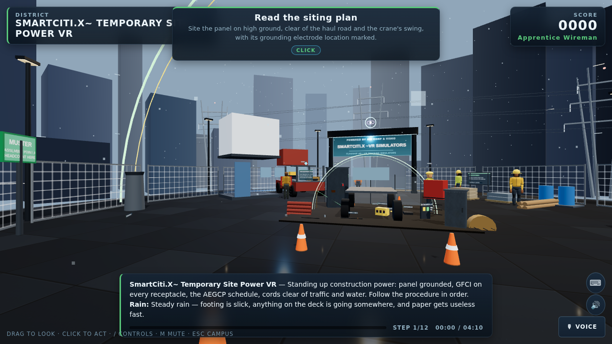 <b>Temporary Site Power</b></td>
<td width="50%">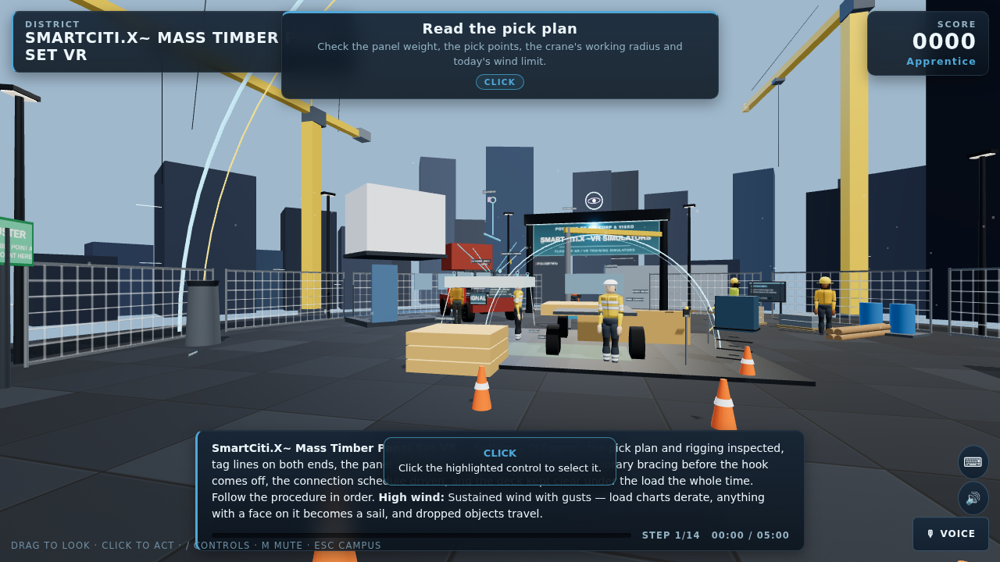 <b>Mass Timber Panel Set</b></td>
</tr></table>

### 2. Bridge and Structural Trades (2026-09-22)

Commits `e840868`, `8578128`. The programme is four stations: the existing Steel Erector plus the three that landed here.

| # | Station | Trade | Eval |
|---|---|---|---|
| 185 | Bridge Cable Inspection | Ironworker — bridge inspection, with the owner's inspector | 95 |
| 186 | Bridge Lead Containment | Bridge painter — IUPAT | 94 |
| 187 | Deck Joint Replacement | Ironworker with IUOE and LIUNA under a lane closure | 98 |

- **Checkers:** no new checker; `WebXR/shared/ei-guide.js` gained the per-station `supportLine` these stations use.
- **Read:** [series page § Bridge and Structural Trades](wiki/SmartCitiX-Training-Series.md#bridge-and-structural); [compliance matrix](compliance/compliance-matrix.md) (MUTCD, 1926 Subpart M, 1926.62 lead).
- **What failed first:** the wave landed with the compliance matrix still describing the previous roster and needed a follow-up commit (`8578128`) to regenerate it — which is why the loop brief now regenerates every generated page on each tick. The programme's oldest station, Steel Erector, also labelled its union "Ironworkers (IBB)"; IBB is the Boilermakers, the Ironworkers are IW, and the label was corrected in this pass with no other change to the station.

<table><tr>
<td width="50%">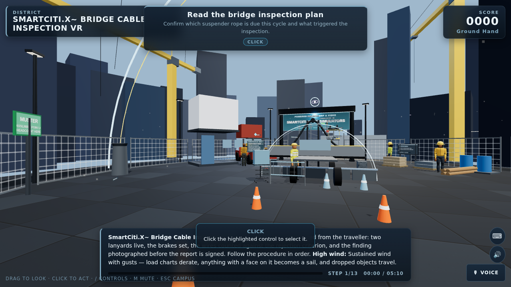 <b>Bridge Cable Inspection</b></td>
<td width="50%">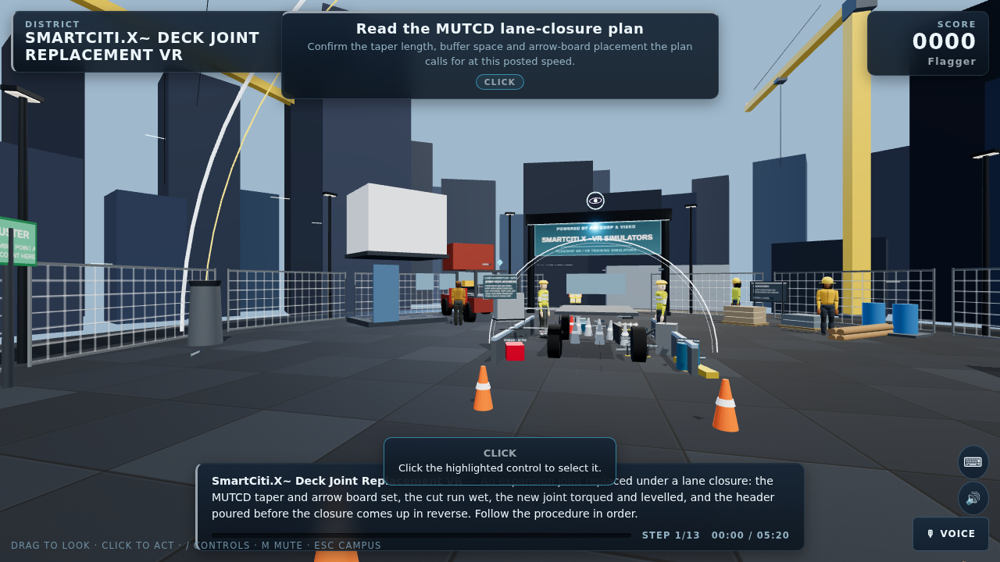 <b>Deck Joint Replacement</b></td>
</tr></table>

### 3. First Responders — fire, EMS, police, crisis and relief (2026-09-22)

Commits `7ee2694` (programme skeleton and [series brief](../tools/briefs/first-responder-brief.md)), `44aa87b`, `07d2008`, `9527a31`, `b4dab6c`, `e42fdf8`. Fifteen stations in five blocks; with the existing Triage Point the programme runs sixteen.

| # | Station | Trade | Eval |
|---|---|---|---|
| 197 | Structure Fire Size-Up | Firefighter — IAFF | 97 |
| 198 | Firefighter Rehab Sector | Firefighter — IAFF | 96 |
| 199 | Wildland-Urban Interface | Firefighter — IAFF | 97 |
| 200 | Cardiac Arrest — Pit Crew | Paramedic — IAFF EMS | 96 |
| 201 | Overdose Response — Naloxone | EMT — NAGE/AFSCME EMS local | 94 |
| 202 | Ambulance Scene Safety | EMT — NAGE/AFSCME EMS local | **88** |
| 203 | Crisis Intervention Call | Police officer — crisis intervention team | 95 |
| 204 | Critical Incident Debrief | Police officer — crisis intervention team | 94 |
| 205 | Traffic Incident Management | Police officer with fire and DOT | 91 |
| 206 | Trauma-Informed Intake | Social worker — NASW / SEIU 1021 | 96 |
| 207 | Crisis Line Shift | Crisis counsellor | 96 |
| 208 | Home Visit Safety | Social worker — NASW / SEIU 1021 | 96 |
| 209 | Shelter Intake Operations | Disaster relief — AFSCME / LIUNA with the Red Cross volunteer workforce | 97 |
| 210 | Damage Assessment Team | Disaster relief — AFSCME / LIUNA with the Red Cross volunteer workforce | 97 |
| 211 | Psychological First Aid | Disaster relief — AFSCME / LIUNA with the Red Cross volunteer workforce | 98 |

- **Checkers:** no new checker; the incident parser in `WebXR/shared/incidents.js` learned the crisis and traffic vocabulary (`b4dab6c`); `check_interrupts.mjs` now proves 440 interruptions across 220 procedures.
- **Read:** [series page § First Responders](wiki/SmartCitiX-Training-Series.md#first-responders); the [EI guide](ei-guide.md) — the series relies on the unscored end-of-run check-in and the peer-support pointer; the [series brief](../tools/briefs/first-responder-brief.md) for the voice the `wrongNote`/`missNote` text is written in.
- **What failed first:** the standards dimension. Ambulance Scene Safety cites authorities that resolve out of scope for Emergency Services (standards 39, total 88 — the one station in the wave under 90) and Traffic Incident Management does the same to a lesser degree (standards 64, total 91). Both are registry work, not station work, and are the open items from this wave.

<table><tr>
<td width="50%">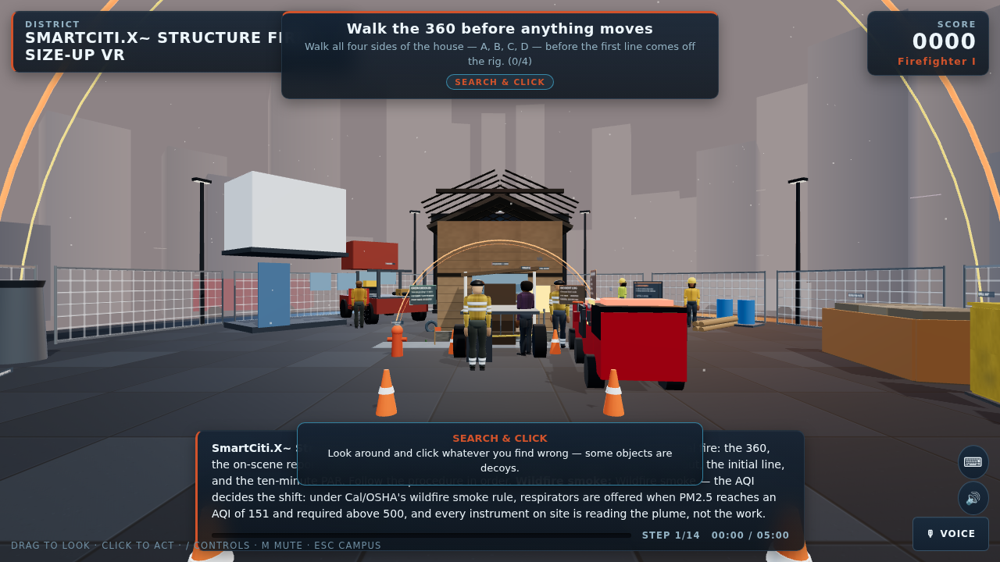 <b>Structure Fire Size-Up</b></td>
<td width="50%">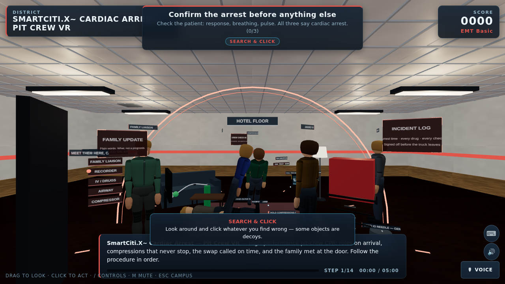 <b>Cardiac Arrest — Pit Crew</b></td>
</tr></table>

### 4. Devices — 33 head-worn devices, six run profiles (2026-09-22)

Commit `bb5aecc`, on the profile layer opened in `05bd28d` and fixed in `eaf3d24`. `WebXR/shared/devices.js` maps RealWear, Vuzix, Epson Moverio, Rokid, Iristick, ThirdEye, Univet, HoloLens 2, XYZ Reality Atom, DAQRI, Meta Quest, PICO and Apple Vision Pro to desktop, VR, mixed-reality, optical see-through, assisted-reality monocular and hands profiles, with input and safety fields (eye-protection rating, helmet mount, intrinsic safety) per device.

- **Checkers:** `check_devices.mjs` — 33 device profiles, 6 profiles, 22 user-agent rules proven unshadowed, 11 URL-only devices; by class monocular 8, goggle 9, helmet 3, MR 2, VR 11.
- **Read:** [device guide](devices.md) — every device with the three procurement questions the app cannot answer, a pilot short list, and how to test one with `?device=<id>`.
- **What failed first:** the see-through and assisted profiles hid the skyline and district after the stage had already merged them into shared static meshes for draw calls, so hiding the source groups changed nothing on the visor. The stage now takes a horizon option and skips building them (`eaf3d24`).

<table><tr>
<td width="50%"> <b>Trench Box, see-through profile</b> (Vuzix Shield)</td>
<td width="50%"> <b>Trench Box, assisted-reality profile</b> (RealWear Navigator 520)</td>
</tr></table>

### 5. Controls — gamepad, keyboard presets, voice grammar (2026-09-22)

Commit `6080278`. One action table in `WebXR/shared/input.js` drives everything: a desktop gamepad, five keyboard presets with remapping, a wider voice grammar and a Controls panel with one tab per input, ordered for the device in front of the learner.

- **Checkers:** `check_input.mjs` — 5 keyboard presets × 13 actions, 15 gamepad buttons + 2 sticks by index with 3 vendor label sets, 26 voice commands, none of which completes a step; `check_a11y.mjs` extended to the keyboard cursor and its live region.
- **Read:** [controls](controls.md); the [interface brief](../tools/briefs/interface-brief.md) whose first rule — hands do the work — the checker enforces.
- **What failed first:** the voice grammar. A recogniser on a noisy site returns "to", "too", "free", "tree", "for" and "ate" for the digits, so `select item N` accepts the homophones; and "what next" had to stay a hint rather than fire `next`, which is why the hint phrases are matched before the command phrases (`input.js`). The other rule the checker exists for: a gamepad button that no key could also press would strand a learner whose pad is in the truck, so the build fails if one appears.

<table><tr>
<td width="50%"> <b>Controls panel — gamepad</b></td>
<td width="50%">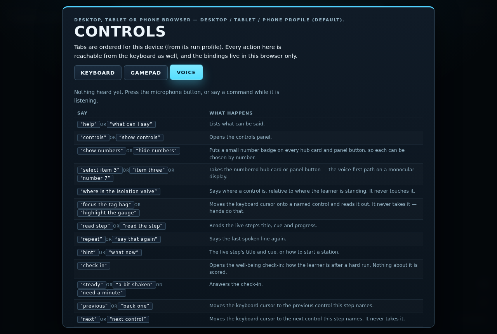 <b>Controls panel — voice grammar</b></td>
</tr></table>

### 6. Avatars — crew figures as people, and the restyle (2026-09-22)

Commits `c333225`, `9580f8b`. The procedural crew figures in `WebXR/shared/kit.js` and `WebXR/smartcity/js/citykit.js` were rebuilt with real proportions, faces, hair and work dress at equal or lower mesh cost, then restyled to the reference look: painted hi-vis dress with reflective bands, caps, safety glasses, tool belts and higher-resolution faces. The hub gained one scanned figure, a CC-BY 4.0 construction worker (`WebXR/smartcity/models/guide-worker.glb`, decimated to about 3 % of its triangles), as the guide by the campus totem.

- **Checkers:** `check_models.mjs` — every shipped `.glb` is inside 2 MB, listed in `WebXR/assets/env/ATTRIBUTION.md` with a redistributable licence, referenced by a module and copied into `dist/`; `check_budget.mjs` and `check_layout.mjs` held the mesh budgets of all 225 stations through both passes.
- **Read:** [`WebXR/assets/env/ATTRIBUTION.md`](../WebXR/assets/env/ATTRIBUTION.md) and [`README.md`](../WebXR/assets/env/README.md) there for the licence rules; the crew-figure section of [`WebXR/trades/README.md`](../WebXR/trades/README.md).
- **What failed first:** the first crew figures had a hard hat that was a sphere the same size as the head, so a figure read as a person with an orange ball for a face, and half the crew stood inside benches and racks because they were placed by hand against rooms that were already full. `check_layout.mjs` fails a figure within 1.05 m of anything floor-standing, and `tools/crew_spots.mjs` computes clear spots. The before/after sheets below are the record of the fix.

<table><tr>
<td width="50%">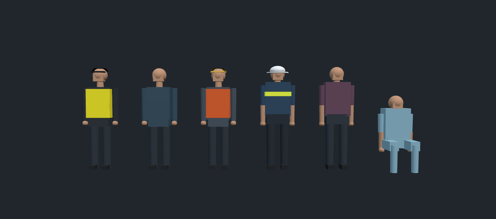 <b>Crew figures — before</b></td>
<td width="50%">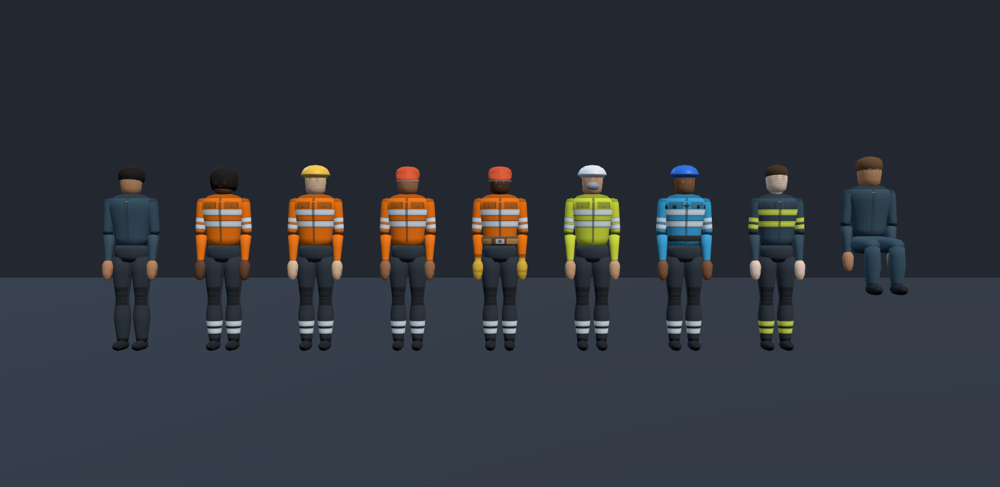 <b>Crew figures — after the restyle</b></td>
</tr></table>

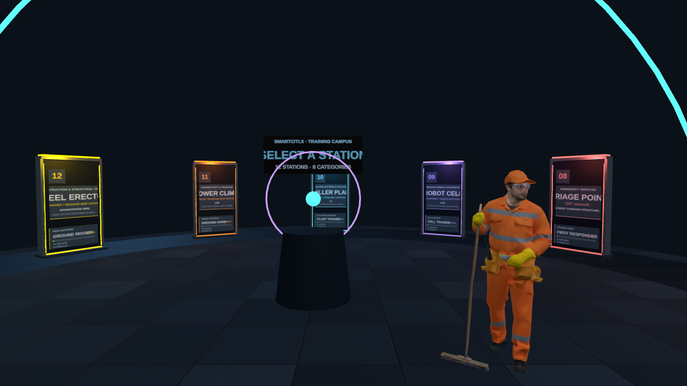

### 7. The guide's emotional intelligence (2026-09-22)

Commit `b42ccd2`. `WebXR/shared/ei-guide.js` decides the tone of what the guide says around a score: one supportive line after a first unsafe action, a line that points at the setup rather than the hands after a repeat, a plain account of what came while the hands were busy after a missed interruption, and an unscored end-of-run check-in (Steady / A bit shaken / Need a minute) with the local's peer-support or EAP line after a rough run. The engine in `game.js` still does all the scoring.

- **Checkers:** none new; the layer is bundled by `tools/bundle_webxr.py` and exercised through the interruption checker's drives.
- **Read:** [EI guide](ei-guide.md).
- **What failed first:** nothing broke on landing. The rule the layer had to get right before anything else, written into the module's header, is that a first responder who has just missed a Mayday in a simulation does not need to be told they failed — they need one sentence on what happened, what wins next time, and no blame. Check-in answers stay in the learner's browser under `smartcitix-checkins-v1` and are never transmitted or exported.

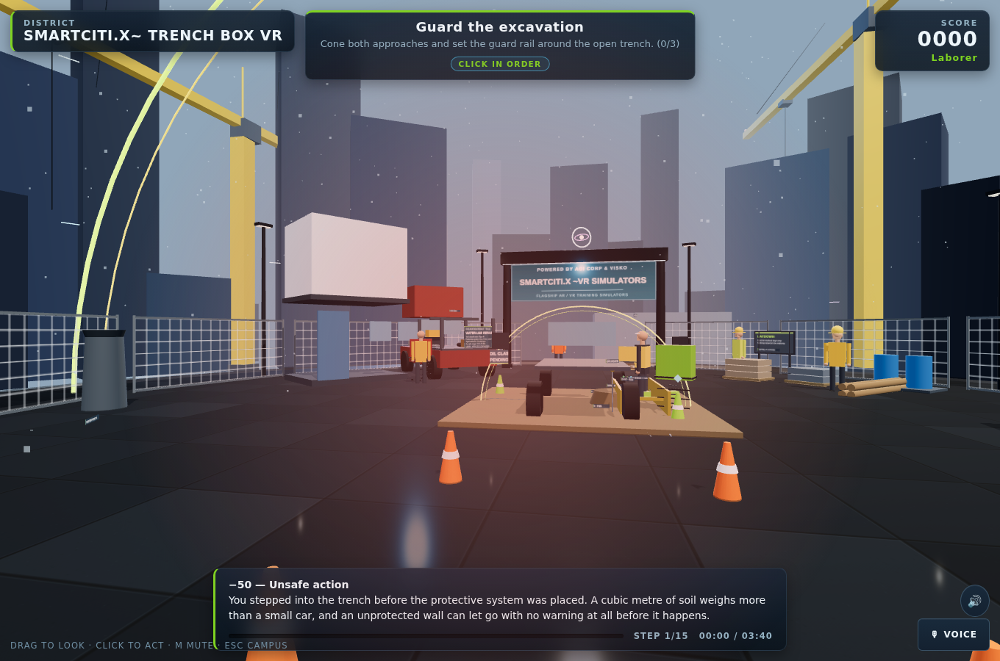

### 8. One standards registry (2026-09-22)

Commit `a163ec9`. `tools/standards.json` is the one place a standard this platform teaches against is written down — body, title, the catalog categories it governs, and whether the citation form is verified (✓) or carried as a body and a title only (?) because a clause number is never invented. The content eval gained its **standards** dimension, and every programme gained a guide naming what governs it.

- **Checkers:** `check_standards.mjs` — every station cites at least one in-scope registry entry and every programme guide names a real one; `--docs` re-renders the registry page.
- **Read:** [standards registry](standards/README.md) (285 entries, 75 bodies); [compliance README](compliance/README.md); the [proof brief](../tools/briefs/proof-brief.md).
- **What failed first:** the out-of-scope penalty did exactly what it was for and immediately made borrowed codes visible — Ambulance Scene Safety's standards dimension fell to 39 (see wave 3). The registry page itself then drifted: it still read 273 entries while `standards.json` held 285, because the competency and dental-careers waves added entries without re-rendering it. Re-rendered in this pass.

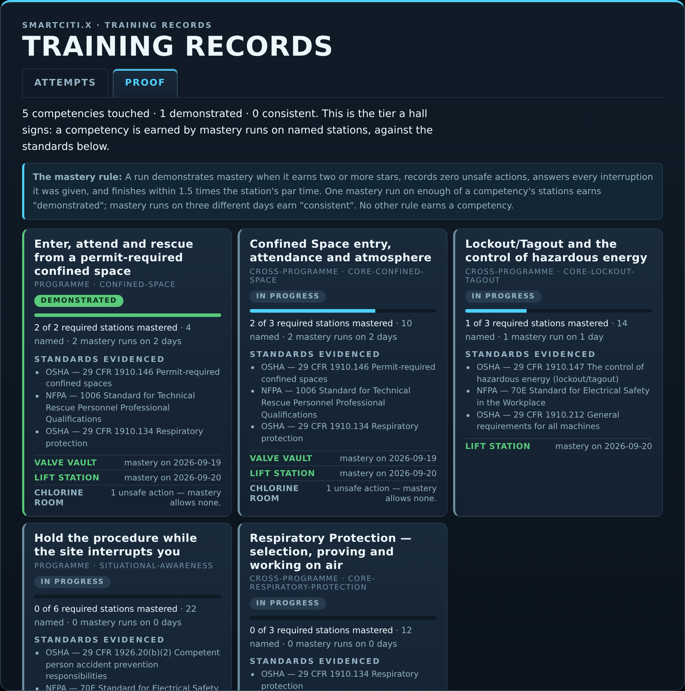

### 9. Competency and proof of training (2026-09-22)

Commits `bca1900`, `94d65b4`. `WebXR/shared/competency.js` holds the mastery rule — two or more stars, zero unsafe actions, every interruption answered, inside 1.5 × par — and 34 competencies (24 programme competencies generated from the curricula by `tools/gen_competency_programmes.mjs`, 10 core competencies that cut across programmes) over 213 distinct stations and 69 standards. The Proof tab of the Training Records overlay shows cards and a transcript; the exports are a CSV transcript, a printable transcript built from text nodes only, and Open Badges 2.0 assertions as JSON.

- **Checkers:** `check_competency.mjs` — every competency's stations and standards resolve, the programme tier mirrors `curricula.js` one-for-one, and the rubric numbers in the UI are the engine's own constants rather than a copy.
- **Read:** [proof of training](proof-of-training.md).
- **What failed first:** the layer first minted its own registry entry for Clean Water Act Section 404 instead of pointing at the entry the registry already had (`94d65b4`); and the competency table in the doc fell one row behind the code when the Dental Careers programme opened — the row is added in this pass.

<table><tr>
<td width="50%">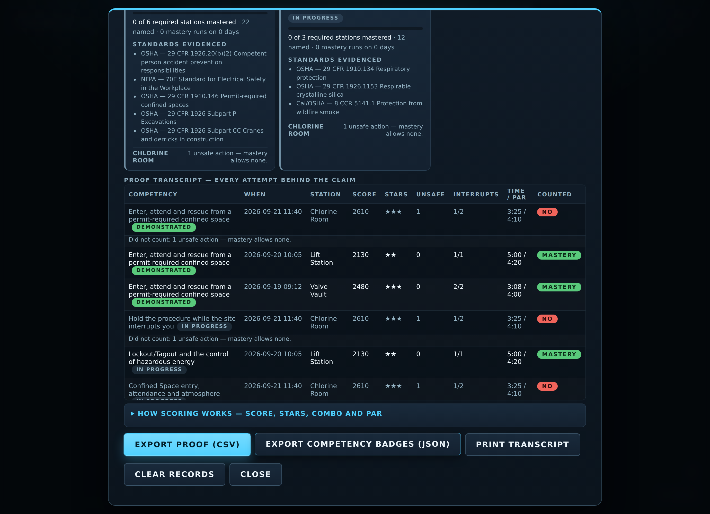 <b>The Proof tab</b></td>
<td width="50%">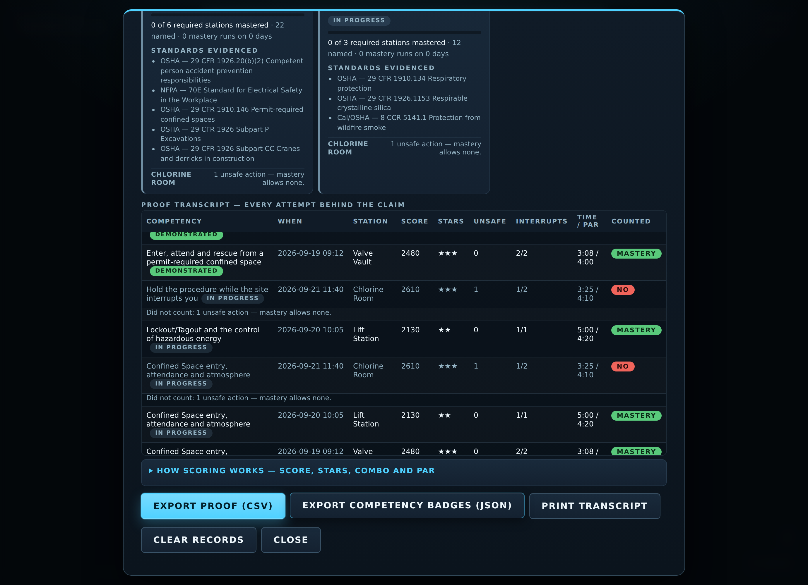 <b>The transcript</b></td>
</tr></table>

### 10. Instructor console (2026-09-22)

Commits `70cb4a1`, `c431afa`. `WebXR/instructor/` became a granular content and interaction console: open a station on a learner's screen, fire an interruption, change the weather or the device profile, set a hazard mode, assign a programme, search the whole roster, read the session log, and run across the room over a `BroadcastChannel` or across a network over `tools/relay_server.mjs`. It owns no simulation, no scoring and no records; observer protocol 2 with a protocol-1 fallback.

- **Checkers:** `check_console.mjs` — every command is handled by the learner apps, recorded on the attempt and reduced into the roster, the console sets no markup and imports no simulator code; `check_observer.mjs` extended for both legs and the fallback.
- **Read:** [instructor console](instructor-console.md), including what the relay is not (authentication, encryption, an audit trail).
- **What failed first:** the console checker compared the roster against a fixed station count and broke the moment the next wave landed; it compares against `sims-meta` now (`c431afa`). The doc kept the old fixed number (202) until this pass.

<table><tr>
<td width="50%"> <b>Live class view</b></td>
<td width="50%"> <b>An interruption fired from the console</b></td>
</tr></table>

### 11. Robot embodiment on the dental block (2026-09-22)

Commit `b77ac1f`. The fifteen Dental Hygiene stations are also a robot training simulator: `WebXR/shared/robot-embodiment.js` turns each interactable into a target pose, each step into a grasp and a force class, each person in the room into a keep-out volume, and marks the steps a robot must not do (`noRobot`) with the station's reason. `tools/robot_train.mjs` runs embodied episodes at chosen skill levels and writes datasets; the programme card in the app calibrates the difficulty curve live.

- **Checkers:** `check_robot.mjs` extended to the robot-trainee checks — schema, keep-out, force classes and the `noRobot` hand-off.
- **Read:** [robot training](robot-training.md); the [dental hygiene section](wiki/SmartCitiX-Training-Series.md#dental-hygiene-unspoken-smiles) of the series page.
- **What failed first:** the person detector. `face-shield` (PPE on a stand) and `mouth-mirror` (an instrument on the bracket table) matched the person words and put a keep-out volume in the middle of the equipment; every word in the module's thing-list was a real false positive in the dental set before it went in.

<table><tr>
<td width="50%">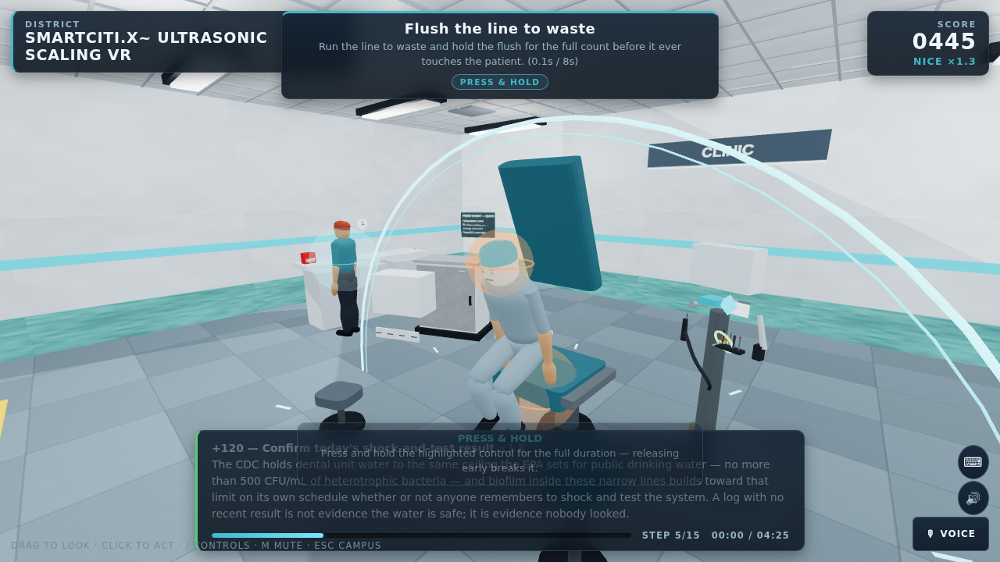 <b>Keep-out overlay during an episode</b></td>
<td width="50%"> <b>Robot training card</b></td>
</tr></table>

### 12. Dental hygiene quality pass (2026-09-22)

Commit `cef08f5`. The fifteen stations of Dental Hygiene — Unspoken Smiles were raised to a full standards score with real step kinds, find steps and support lines. All fifteen now score 100 on the standards dimension.

| # | Station | Eval | # | Station | Eval |
|---|---|---|---|---|---|
| 116 | Operatory Turnover | 97 | 124 | Fluoride and Sealants | 97 |
| 117 | Instrument Reprocessing | 95 | 125 | Nitrous Oxide Monitoring | 97 |
| 118 | Sharps Exposure Response | 98 | 126 | Chairside Emergency | 97 |
| 119 | Patient Intake Screening | 97 | 127 | Amalgam Waste Handling | 97 |
| 120 | Radiograph Safety | 95 | 128 | Mobile Dental Outreach | 97 |
| 121 | Periodontal Charting | 97 | 129 | Pediatric Visit | 98 |
| 122 | Ultrasonic Scaling | 96 | 130 | Oral Cancer Screening | 97 |
| 123 | Aerosol Management | 96 | | | |

- **Checkers:** none new; `check_robot.mjs` re-verified the embodiment data after every step change.
- **Read:** [series page § Dental Hygiene](wiki/SmartCitiX-Training-Series.md#dental-hygiene-unspoken-smiles); the [optimisation brief](../tools/briefs/optimize-brief.md) the pass followed.
- **What failed first:** the stations as first written — short of a full standards score, run on a narrow set of step kinds, without find steps and without the support lines the EI layer reads — which is what the commit title lists as fixed.

<table><tr>
<td width="50%">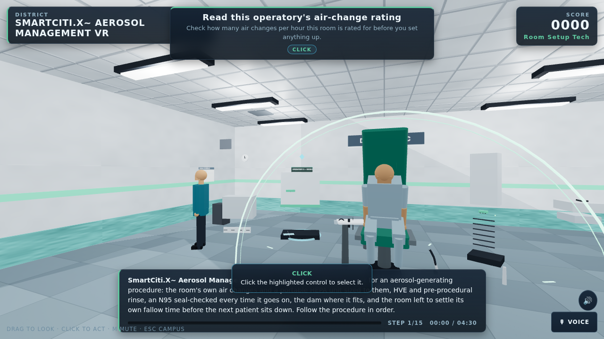 <b>Aerosol Management</b></td>
<td width="50%"> <b>Chairside Emergency</b></td>
</tr></table>

### 13. Dental Careers — Unspoken Smiles (2026-09-23)

Commits `a403e03` and `1a56115` (programme opened), `0d91ef2` (five stations). The programme is six stations: Patient Intake Screening from the hygiene block plus these five, with its own programme competency (3 of 6 under the mastery rule).

| # | Station | Trade | Eval |
|---|---|---|---|
| 212 | Dental Careers Pathway | Dental careers — assistant to hygienist to dentist | 96 |
| 213 | Four-Handed Dentistry | Dental assistant — chairside (DANB CDA) | 97 |
| 214 | Full-Mouth Radiographic Series | Dental assistant — radiographer (DANB RHS) | 92 |
| 215 | Sterilisation Centre | Sterile processing technician — dental instruments | 91 |
| 216 | Dental Laboratory Bench | Dental laboratory technician (CDT) | 92 |

- **Checkers:** none new; `WebXR/shared/competency.js` gained the `dental-careers-unspoken-smiles` competency and `check_competency.mjs` now reports 34.
- **Read:** [series page § Dental Careers](wiki/SmartCitiX-Training-Series.md#dental-careers-unspoken-smiles); [proof of training](proof-of-training.md) for the new competency row.
- **What failed first:** the standards dimension again — the sterilisation centre (71), the laboratory bench (56) and the full-mouth series (67) cite sterile-processing, laboratory and radiography authorities that either resolve out of scope for Dental & Oral Health or are not in the registry yet. That is the next registry pass, not a station rewrite.

<table><tr>
<td width="50%">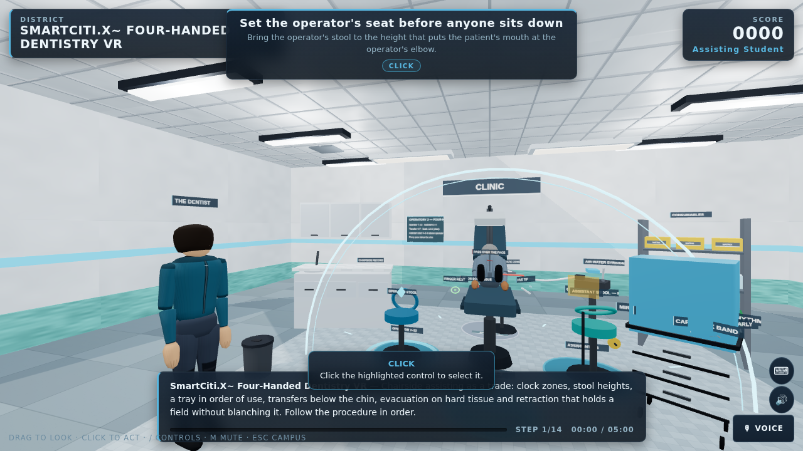 <b>Four-Handed Dentistry</b></td>
<td width="50%">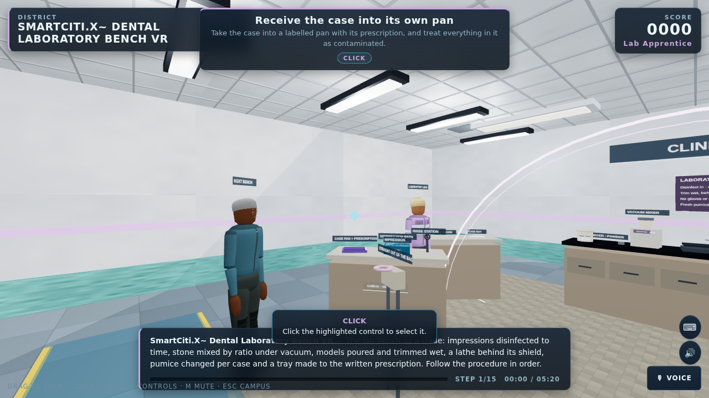 <b>Dental Laboratory Bench</b></td>
</tr></table>

---

## Earlier in the window

The sixty commits open with the twenty-five-station Hunters Point Edition (a flat, sourced "Can We Live?" briefing and the sited trade stations for the community's cleanup work), the ten-station Sewing and Garment Trades series, the first head-worn device profiles, the generated compliance matrix and its assurance README, the quick series-review film scripts, and ten "raise to eval 90+" passes that took thirty-eight existing stations from below 90 to 90 or above by adding interruptions where there were none, rewriting every why text to state the mechanism, and dressing the scenes to the mesh budget. Those waves are described in their commit messages (`git log --oneline -60`) and their stations are on the series page.

## Housekeeping in this pass (2026-09-23)

- `tools/gen_wiki.mjs` and `tools/gen_compliance.mjs` read the checker count from `tools/check_all.mjs` instead of spelling "twenty-three".
- `README.md`, `WebXR/smartcity/README.md`, `docs/compliance/README.md`, `docs/instructor-console.md` and `docs/proof-of-training.md` carry the current counts with a note on where each comes from.
- Steel Erector's union label corrected from "Ironworkers (IBB)" to "Ironworkers (IW)"; catalog, sims-meta, review packet and bundle regenerated.
- The practitioner review packet (`WebXR/smartcity/REVIEW.md`) was still at 89 sections; regenerated at 225, preview passed 225/225.
- The standards registry page re-rendered at 285 entries.
- Spawn screenshots captured for every station that had none, so the series page now shows one per station.
- `docs/README.md` indexes every page under `docs/`.
