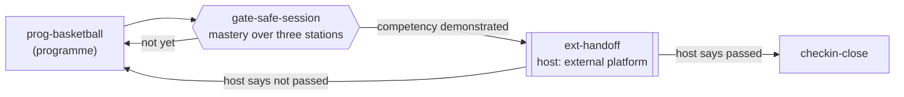

# Basketball Fundamentals

A ten-station SmartCiti.X programme (`basketball-fundamentals`, category
**Youth Sports & Coaching**) that teaches young players the fundamentals and
teaches coaches how to run a session nobody gets hurt in. Every station stands
on the indoor **gym-court** district and plays through the same engine,
records and flow contract as the rest of the platform.

The team, the players, the parents and the gym are invented. The bodies the
programme is taught against are named for what they publish, and no rule
number, time limit or court dimension is quoted as a rule.

## The district: `gym-court`

A scenic district (`plaza: false` in `WebXR/smartcity/js/districts.js`): the
maple floor is the ground, so no plaza, masts, marquee, apron or skyline are
built under it.

- **Ground**: wall-to-wall strip maple (a canvas `hardwoodFace` texture) with
  the lines of a high-school-sized court, painted lanes and centre circle.
- **Horizon**: painted block walls with padding behind both baskets, a
  hoop on a padded stanchion behind each baseline, folding bleachers down both
  sidelines, roof trusses and light fixtures, two lit exit doors, banners and a
  scoreboard on the far wall whose practice clock ticks.
- **Conditions**: forced to its own "Indoor court" label whatever the station
  or the URL asks; the note tells the learner that a cool gym does not replace
  water breaks. No figure is stated.
- **HUD chip**: a scoreboard chip (`#hud-court`, `courtReadout()` in
  `react-ui.js`). The district names the labels (`Practice`, `Drills`,
  `Fouls`); every number is the run's own — steps cleared out of the station's
  total, unsafe actions as fouls, and the session clock against par. It turns
  amber on a foul and red past par, and shows nothing for a station on any
  other district.
- Budget: 35 of the 120 meshes a scenic district may spend, two lights of its
  own, spawn at the near bleachers facing centre court, roam 7.2 m.
  `tools/check_districts.mjs` builds it at night, dusk and day and checks the
  chip.

## The stations

| # | Station | What it teaches | Interruptions |
|---|---|---|---|
| 1 | `bb-warmup-injury-prevention-and-hydration` | Floor walk, emergency action plan, health check-in, water staged, dynamic warm-up in order, shoe and jewellery check, fans on, build-up runs, water break by the clock, heat-illness response | Parent at the side door (assistant meets them); player down on the baseline (athletic trainer's radio) |
| 2 | `bb-stance-and-ball-handling` | Ball check and pressure gauge, wide lanes, triple-threat stance, pound dribble eyes-up, work/rest timer, faults, crossover rhythm, handling series, progression rule, racking loose balls | Shove over a loose ball (separate to cool-off spots); fire alarm (marked exit, headcount) |
| 3 | `bb-footwork-pivots-and-jump-stops` | Floor feel, pivot-foot rule, jump stop, balanced landings, knee bend, front pivot, agility ladder, knee and heel faults, pivot menu, landing count, rolled-ankle care | Rolled ankle on a landing (trainer with the kit); unrecognised adult at pick-up (authorised pick-up list) |
| 4 | `bb-passing-and-catching` | Receiver backgrounds, names before passes, chest pass, target hands, pass speed, partner distance, bounce spot, catching faults, pass types, ball-to-the-head rule, water at the bench | Ball fired at a teammate (sit-out chair with the assistant); fire alarm with two teams (own exit, own list) |
| 5 | `bb-shooting-form-and-arc` | Hoop inspection, ball and rim for age, rim crank, balance-eyes-elbow-follow-through, form shots, a **track** on the shot arc, a **gauge** on release timing, lane cleared, flaws, progression, shot count with rest, follow-through hold | Rebounder down under the rim (radio); fire alarm |
| 6 | `bb-free-throw-routine` | Line and lane check, lane rules, towel, the routine in order, quiet breath, foot alignment, routine tempo, routine breakers, composure on tired legs, water between rounds, pressure rounds, rotation | Fire alarm at the line; parent wanting a word (assistant at the door, time set after practice) |
| 7 | `bb-defensive-stance-and-closeouts` | Room to slide, active hands, stance built and held, slide rhythm, closeout chop, hip turn, closeout cone, faults, closeout pieces, the shooter's landing space, rest between reps | Shove after a closeout (opposite ends of the bench); defender down on a landing (radio) |
| 8 | `bb-rebounding-and-boxing-out` | Paint cleared, pairs by size, box-out in order, seal held, reverse pivot, jump timing, controlled contact, bench back from the baseline, concussion signs, recognise-remove-refer, outlet, racking | Heads collide (athletic trainer's concussion check, no return); parent urging harder hits (assistant at the door) |
| 9 | `bb-team-offense-spacing-and-screens` | Five spots, the action drawn first, spacing fixed, on-ball screen in order and held still, spacing read, screen angle, ball movement, illegal and blind screens, rotation with water, reads, screen contact | Parent filming at the door (photo policy); flare-up after a screen (reset huddle) |
| 10 | `bb-scrimmage-and-sportsmanship-debrief` | Sideline and player checks, ground rules, fair teams, short periods, game temperature, equal minutes, a quiet timeout, tired players rested, sportsmanship moments, handshake line, debrief in order, cool-down, and the guide's check-in (`shared/ei-guide.js`) | Hard foul and a shove (timeout at the scorer's table); fire alarm mid-game |

Each station has 14 steps across all eight step kinds, four hazards drawn from
wet floor, collision, concussion signs, heat and hydration, ankle roll and
over-training, two interruptions armed on a `hold` or `track` step and
answered by a different control that visibly changes the scene, a `why` on
every step, a `supportLine` for the end-of-run check-in card, a head coach,
an assistant coach and an athletic trainer in the scene, a staff check-in step
and a closing practice log. Station ten's guide board speaks through
`eiLine()` when a hazard is struck.

## Authorities

Five registry entries in `tools/standards.json`, each carried as a body and a
title with `source: "unverified"` — the claim is the body and the subject,
never a clause or course number:

| Registry id | Body | Cited as |
|---|---|---|
| `usa-basketball-youth-guidelines` | USA Basketball | `USA Basketball` |
| `nfhs-basketball-rules` | NFHS | `NFHS`, `National Federation of State High School Associations` |
| `cdc-heads-up` | CDC | `CDC Heads Up` |
| `safesport-code` | U.S. Center for SafeSport | `U.S. Center for SafeSport` |
| `red-cross-first-aid-course` | Red Cross | `American Red Cross first aid` |

The programme's `guides` also name `afscme-training` and `seiu-training`,
whose scope now includes the new category, for parks-and-recreation staff
where a public gym runs the league; the programme itself is not a union
apprenticeship and does not claim to be one.

## Programme, ladder and competency

- `WebXR/smartcity/js/curricula.js` — the programme, with a one-sentence `why`
  per station.
- `WebXR/shared/competency.js` — a programme competency mirroring the ten
  stations (half of them, five, required).
- `WebXR/smartcity/js/ladders.js` — ten generated levels; levels 4–6 are
  retitled in `ladders.overrides.json` because the gym reports its own
  conditions and an outdoor weather band would be a label with nothing behind
  it.
- New category plumbing: the registry's category list, a generic safety sign
  and AFSCME as the category's default union in `shared/signage.js`, and the
  roster order in `react-ui.js`.

## Handing the programme to an external platform

`WebXR/flows/basketball-fundamentals.json` carries the programme through the
existing flow contract (`WebXR/shared/flowhub.js`, `docs/flowhub.md`):

The gate asks for mastery (the proof brief's rule: two or more stars, no
unsafe action, every interruption answered, inside 1.5 × par) on the warm-up,
the rebounding and the scrimmage stations — the three that carry the
programme's biggest safety calls. The external node is the hand-off.

The destination the user named is the RBI platform (named by the user; not
described in this repository). Nothing in this repository describes it or
assumes how it works: the node's `ref` is the opaque string
`host:basketball-fundamentals/handoff`, the app emits
`smartcitix:flow.external` and waits, and the flow moves again only when a
host sends `smartcitix:flow.resume` with an outcome shaped like an attempt
record. Whether and how that platform speaks the contract is for it to
decide.

## Verification

- `node tools/add_station.mjs <id>` for each station; `node tools/check_all.mjs`
  passes; `python3 tools/bundle_webxr.py` is clean.
- Every station driven end to end in the bundled build with both
  interruptions fired and answered, no unsafe action and no page error.
- Spawn screenshots in `docs/screenshots/basketball/`.
- `node tools/eval_content.mjs`: every station 97 with `std` 100.
