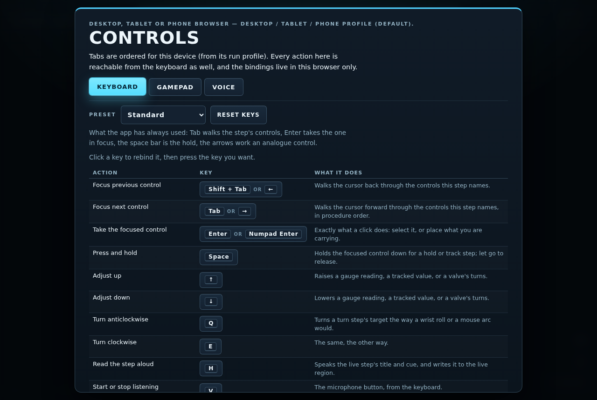
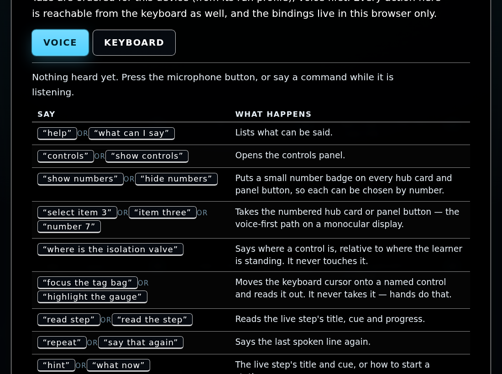
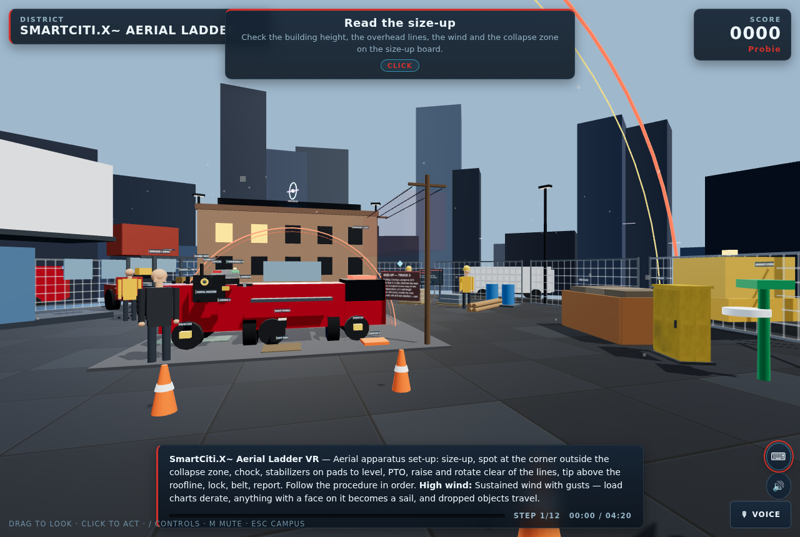

# Controls: keyboard, gamepad and voice

Every learner drives SmartCiti.X through the same short list of actions, whatever is in their hands. A d-pad press, the Tab key and the word "next" all mean *focus the next control this step names*; `A`, `Enter` and a click all mean *take it*. The action table, the bindings, the gamepad mapping and the voice grammar are one module — `WebXR/shared/input.js` — and `tools/check_input.mjs` drives all of it headless with a fake gamepad and a fake key.

Two rules hold everywhere and are enforced by that checker:

1. **Hands do the work.** Voice, a gamepad and the keyboard navigate, focus, adjust, read back, open panels and answer the check-in. Nothing here completes a step by speaking: the select, press, drag and turn paths stay with the hands, the mouse or the controller, which is the point of a hands-on trainer. "Focus" moves the keyboard cursor and stops there.
2. **Every action is reachable from the keyboard.** A gamepad button that no key could also press would strand a learner whose pad is in the truck, so the checker fails the build if one appears.

Open the panel in the app with the toolbar's ⌨ button, `?` or `F1`, a pad's **Start**, or by saying "controls". It has one tab per input, ordered for the device in front of the learner (see [Head-worn devices](devices.md)).

<table><tr>
<td width="33%"><br><b>Keyboard</b>: the preset picker and click-to-remap.</td>
<td width="33%"><br><b>Gamepad</b>: the live readout and the map.</td>
<td width="33%"><br><b>Voice</b>: the grammar and the last phrase heard.</td>
</tr></table>

## Keyboard

Bindings are `KeyboardEvent.code` values, so they survive a non-US layout and caps lock. They are saved in this browser under `smartcitix-input-v1` and reset from the panel; nothing is transmitted.

| Action | Standard | WASD + IJKL | Left hand | Numeric keypad | One hand |
|---|---|---|---|---|---|
| Focus previous control | `Shift + Tab` / `←` | `J` | `Shift + Tab` | `Numpad 4` | `Z` |
| Focus next control | `Tab` / `→` | `L` | `Tab` | `Numpad 6` | `X` |
| Take the focused control | `Enter` / `Numpad Enter` | `Enter` | `G` | `Numpad 5` / `Numpad Enter` | `C` |
| Press and hold | `Space` | `Space` | `Space` | `Numpad 0` | `Space` |
| Adjust up | `↑` | `I` | `R` | `Numpad 8` | `R` |
| Adjust down | `↓` | `K` | `F` | `Numpad 2` | `V` |
| Turn anticlockwise | `Q` | `U` | `Z` | `Numpad 7` | `Q` |
| Turn clockwise | `E` | `O` | `C` | `Numpad 9` | `E` |
| Read the step aloud | `H` | `H` | `T` | `Numpad 1` | `T` |
| Start or stop listening | `V` | `Y` | `B` | `Numpad ×` | `B` |
| Mute or unmute | `M` | `M` | `V` | `Numpad 3` | `F` |
| Open the controls panel | `/` / `F1` | `/` / `F1` | `` ` `` / `F1` | `Numpad /` / `F1` | `G` |
| Close the panel, or back to the campus | `Esc` | `Esc` | `Esc` | `Numpad −` / `Esc` | `Esc` |

Walking is separate and unchanged in every preset: `W A S D` or the arrow keys, `Shift` to move faster, the mouse or the left stick to look.

- **Standard** — what the app has always used: Tab walks the step's controls, Enter takes the one in focus, the space bar is the hold, the arrows work an analogue control. An existing learner's muscle memory is unchanged, and the checker holds these keys in place.
- **WASD + IJKL** — the left hand stays on WASD to walk; the right hand works the step on the IJKL cluster instead of reaching for Tab.
- **Left hand** — for a learner who keeps the mouse in the right hand: every action sits on the left third of the board, with Enter moved to `G`.
- **Numeric keypad** — the whole procedure from the keypad, the way an operator works a panel: 4 and 6 walk the controls, 8 and 2 adjust, 5 takes, 0 holds.
- **One hand** — every action inside the span of one hand, with no chord, no modifier, no Tab and no function key: the preset to pick when the other hand is holding a tool, a rail or a radio. This is also the preset to pair with a one-handed keypad or an assistive switch board.

**Remapping.** Click a key in the panel and press the key you want; `Esc` cancels. The new key is taken off whatever else held it, and an action that would be left with nothing falls back to its preset key rather than going dark — an unreachable action is the one thing the layer refuses to produce. "Reset keys" restores the current preset.

## Gamepad

Polled in flat/desktop mode only, from the W3C Standard Gamepad mapping and **by index alone**. Xbox, PlayStation and unbranded pads behave identically; the detected vendor decides only the printing in the panel. Stick deadzone is 0.18, scaled from its edge so the first movement past it is gentle. Inside an immersive session the poller stands down: the controllers there are XR input sources with their own ray, trigger and grip.

| Xbox | PlayStation | Generic | Fires | What it does |
|---|---|---|---|---|
| A | Cross | Bottom face | tap / hold | **Take the focused control.** A tap is the click; keeping it down is the press-and-hold a hold or track step wants. |
| B | Circle | Right face | once per press | **Back.** Closes the topmost panel, then leaves the station — the Escape path. |
| X | Square | Left face | once per press | **Start or stop listening.** |
| Y | Triangle | Top face | once per press | **Read the step aloud.** |
| LB | L1 | Left bumper | repeats while held | **Turn anticlockwise** on a turn step. |
| RB | R1 | Right bumper | repeats while held | **Turn clockwise.** |
| LT | L2 | Left trigger | analogue | **Adjust down** — a gauge, a tracked value or a valve, as far as the trigger is pulled. |
| RT | R2 | Right trigger | analogue | **Adjust up.** |
| View | Share / Create | Select | once per press | **Back to the campus.** |
| Menu | Options | Start | once per press | **Open or close the controls panel.** |
| L3 | L3 | Left stick press | once per press | **Mute or unmute.** |
| D-pad up / down | D-pad up / down | D-pad up / down | repeats while held | **Adjust up / down** in fixed steps. |
| D-pad left / right | D-pad left / right | D-pad left / right | once per press | **Focus the previous / next control** this step names. |
| Left stick | Left stick | Left stick | continuous | **Look** — orbits and pitches the view, the way dragging with the mouse does. |
| Right stick | Right stick | Right stick | continuous | **Walk and strafe** inside the station's roam limit, like WASD. |

Buttons are edge-detected: one physical press produces one action however many frames it is held, except for the two kinds that are meant to repeat (the bumpers and the d-pad's up/down) and the two analogue triggers. The Gamepad tab draws the pad out of plain DOM shapes and lights up whatever is pressed, with the raw button and axis values underneath — which is how a learner checks a pad that is behaving oddly, and how a trainer checks a hall's spare pads before a session.

## Voice

Navigation, focus, description, read-back and panels. A station name is still the fastest way in: say the name on a kiosk. Everything else:

| Say | Where | What happens |
|---|---|---|
| “help”, “what can I say” | anywhere | Lists what can be said. |
| “controls”, “show controls” | anywhere | Opens the controls panel. |
| “show numbers”, “hide numbers” | anywhere | Puts a number badge on every hub card and panel button. |
| “select item 3”, “item three”, “number 7” | anywhere | Takes the numbered hub card or panel button. |
| “where is the isolation valve” | in a station | Says how far away a control is and which way to turn. It never touches it. |
| “focus the tag bag”, “highlight the gauge” | in a station | Moves the keyboard cursor onto a named control and reads it out. It never takes it. |
| “next”, “previous” | in a station | Walks that cursor one control forward or back. |
| “read step” | in a station | Step number, title, cue and what is focused. |
| “repeat”, “say that again” | anywhere | Says the last spoken line again. |
| “hint”, “what now” | anywhere | The live step's title and cue, or how to start a station. |
| “brief” · “status” | anywhere | The station's briefing line · stations cleared, stars and level. |
| “mute” · “unmute” | anywhere | Sound and spoken lines off · back on. |
| “bigger” · “smaller” | anywhere | A larger or smaller HUD, or the diorama in AR. |
| “check in” | anywhere | The well-being check-in: “steady”, “a bit shaken” or “need a minute”. Nothing about it is scored. |
| “hub”, “campus” | anywhere | Back to the campus. |
| “leaderboards” · “records” · “programmes” · “tour” · “editor” · “reset” | at the campus | The same overlays the buttons open. |

Parsing is a fixed, ordered grammar in `parseVoice()`, not a model: the specific phrases are matched before the general ones, so "what next" stays a hint rather than becoming "next", and "next control" walks the focus rather than opening the controls panel. Station names are matched in `app.js`, which owns the roster — including the learner's own custom drills — and delegates the rest.

### Numbered menus

Say "show numbers" (or arrive on a voice-first profile, which turns them on by itself) and every panel button and hub card wears a small index badge. "Select item 4" then takes the fourth. The badge order and the number voice resolves come from one list — `introMenu()` in `react-ui.js` — so they cannot drift: the panel's buttons are 1 to 10, and the station cards continue from 11 in the order the grid draws them.

## On the head-worn devices

`WebXR/shared/devices.js` decides how a device runs, and the panel reads it rather than sniffing anything: if a device entry carries an `input` object (`primary`, `voiceFirst`, `controllers`, `hands`, `keyboard`) the tabs are ordered and hidden from that; otherwise they follow the run profile. See [Head-worn devices](devices.md) for the profile table and the sixteen devices reviewed.

| Profile | Devices | Tabs offered | How a procedure is driven |
|---|---|---|---|
| desktop | any flat browser | Keyboard, Gamepad, Voice | Mouse and keyboard; a pad if there is one. |
| vr | Meta Quest | Gamepad, Keyboard, Voice | The controllers, as XR input sources — the flat-mode pad poller stands down. Voice and the keyboard still navigate on the desktop mirror. |
| mr | HoloLens 2, hardhat AR | Voice, Keyboard | **Hands do the work**: pinch is the trigger, a fist is the grip, a wrist roll turns (`shared/hands.js`). Voice focuses, describes and reads back; there is no gamepad tab. |
| seethrough | Epson Moverio, Rokid X-Craft, ThirdEye, Univet | Voice, Keyboard | A paired controller or a phone tether acts as the pointer; voice navigates and reads back. No gamepad tab. |
| assisted | RealWear, Vuzix M400/M4000, Iristick | Voice, Keyboard | Voice first, with the number badges on by default: "select item 4", "read step", "next", "bigger". |

<table><tr>
<td width="50%"><br><b>The same panel under the assisted profile</b> (<code>?device=realwear-navigator-520</code>): two tabs, voice first, HUD at 1.5× on black. There is no Gamepad tab, because the device has no pad.</td>
<td width="50%"><br><b>In a station</b>: the ⌨ button opens the panel, and the crib line bottom-left names the keys the live preset actually binds.</td>
</tr></table>

**Hands-only headsets (mr).** Every action in the table above is still reachable, but the ones that take a control are taken by the hands the headset already tracks — the pinch, the fist and the wrist roll — and voice supplies everything around them: `next`/`previous` to walk the cursor, `focus <name>` to put it on a named control, `where is <name>` to find it in the room, `read step` and `repeat` to hear the cue again, `bigger` to enlarge the HUD. Nothing spoken completes a step, so a learner who talks their way through a procedure still has to do it.

**Voice-first monoculars (assisted).** There is no pointer, the display is small, and the wearer's hands are on the real work. These devices get the number badges automatically, so "select item 4" replaces a click; "read step" and "repeat" replace reading a paragraph on an 854-pixel display; "bigger"/"smaller" resize the chrome on the spot; and the keyboard preset to pair with a hardware keypad is **one hand** or **numeric keypad**, both of which reach all thirteen actions with no chord. The procedure itself is still worked by hand on the real equipment or by the paired pointer — the app narrates and scores, it does not perform.

## Checking it

```
node tools/check_input.mjs     # presets, bindings, gamepad edge detection, the grammar
node tools/check_devices.mjs   # which device gets which profile
node tools/check_a11y.mjs      # the keyboard cursor and the live region it reads through
```

In a browser, `window.__smartcityInputTest` drives the real handlers from a headless test: `gamepad(fakePad)` polls the real poller with a fake Standard Gamepad, `key("Tab")` goes through the real keydown path and the saved bindings, and `voice("read step")` goes through the real grammar.
