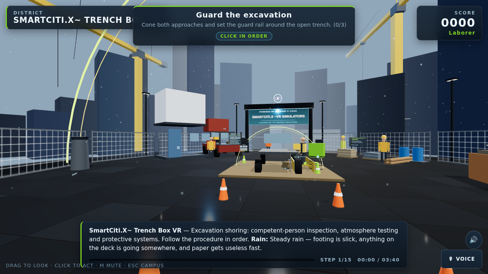
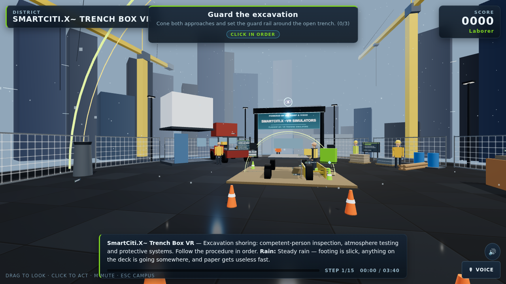
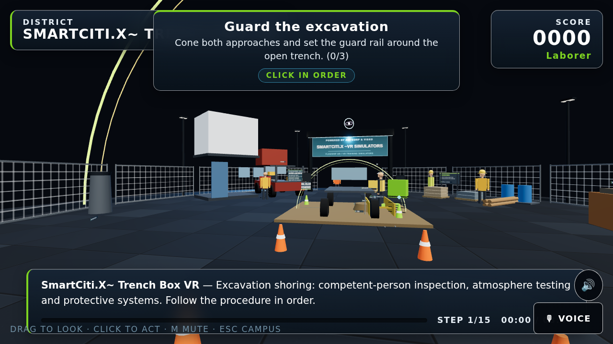
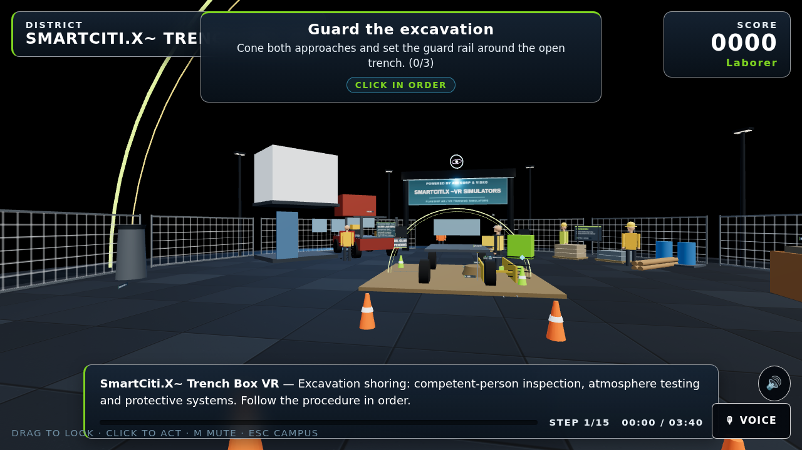

# Head-worn devices: how the apps run on each

SmartCiti.X, Trade Skills Simulator and the Holodeck are WebXR pages. They run in three ways: **flat** (any browser, mouse or touch, voice), **immersive AR** (a WebXR browser with hit-test: the station is placed on the real floor) and **immersive VR** (a headset browser). The head-worn devices a site crew or a response team actually wears are mostly assisted-reality or optical see-through systems whose browsers offer no immersive WebXR session, and the headsets a union training centre buys for its training room are a second, different fleet. So the apps carry a **device profile layer** (`WebXR/shared/devices.js`) that adapts the run to the display in front of the wearer's eye instead of pretending it is a desktop, and describes every device's input for the Controls panel.

Detection: `?device=<id>` on the URL wins (pin a kiosk or a device fleet that way), then the browser's user agent, then a small-monocular screen heuristic, else desktop. The intro rail names what was detected, how it will run and what drives it ("Apple Vision Pro — hand-tracked headset profile, hands and gaze (url)"), so a learner can correct it. The profile is never guessed from the procedure.

A user-agent rule exists only where the browser is known to announce itself: the Meta Quest Browser sends `OculusBrowser` and the model name (`Quest 3`, `Quest 3S`, `Quest Pro`, `Quest 2`), PICO browsers send `PICO` and the model, and RealWear, Vuzix M-series, Epson Moverio, Rokid, Iristick, ThirdEye, Univet, HoloLens, XYZ Reality and DAQRI carry their names. Everything else — Apple Vision Pro above all, whose Safari sends a desktop-Mac user agent on purpose — is URL-only. Specific rules sit above generic ones in the table (Quest 3 above Quest, Navigator 500 above RealWear, BT-45C above Moverio, M4000 above M400, MIDAS above ThirdEye) and `tools/check_devices.mjs` proves that no rule shadows another: a Quest 3 user agent never resolves to the generic Quest.

## The six run profiles

| Profile | Display | Pixel ratio | Shadows | Weather | Skyline | HUD scale | Target scale | Background | Entry | Voice | Select verb |
|---|---|---|---|---|---|---|---|---|---|---|---|
| desktop | flat | ≤2 | on | full | built | 1.0 | 1.0 | district sky | flat | optional | click |
| vr | opaque | ≤2 | on | full | built | 1.0 | 1.0 | district sky | VR | optional | trigger |
| hands | opaque | ≤2 | on | full | built | 1.1 | 1.15 | district sky | VR | optional | pinch |
| mr | see-through, binocular | 1 | off | light (storm, rain, smoke → overcast) | not built | 1.15 | 1.15 | real room | AR | prompted | pinch |
| seethrough | see-through, binocular | 1 | off | off | not built | 1.3 | 1.2 | **black** (transparent to the wearer) | flat | prompted | touchpad |
| assisted | monocular | 1 | off | off | not built | 1.5 | 1.3 | flat dark | flat | prompted | say |

Each profile also carries a one-sentence `hint` the Controls panel shows before the first step, worded in that profile's verb. The **hands** profile is for VR-class headsets that track bare hands and ship no controllers (Apple Vision Pro today): the HUD and the selectable targets are drawn a little larger and every hint names a pinch, never a trigger. **seethrough** is the binocular see-through profile for goggles (Vuzix Shield, Epson Moverio BT-40, ThinkReality A3); **assisted** is the monocular profile (`display: "monocular"`), so a Controls panel can tell a goggle from a hardhat monocular by the profile's `display` field alone. On a monocular hardhat display the learner sees one large step card at a time; voice commands ("next", "hint", "brief", "status", the step's own words) run the procedure, and drag steps can be completed by naming the target. On optical see-through glasses the scene is drawn on black so the real site shows through the display; the HUD uses the high-contrast theme.

<table><tr>
<td width="50%"><br><b>Hands profile</b> (<code>?device=apple-vision-pro</code>): the full scene, HUD at 1.1×, hints name a pinch.</td>
<td width="50%"><br><b>VR profile</b> (<code>?device=meta-quest-3</code>): the full scene, controllers or hands, VR entry offered first.</td>
</tr><tr>
<td width="50%"><br><b>See-through profile</b> (<code>?device=vuzix-shield</code>): the station on black, no skyline or weather, HUD at 1.3×.</td>
<td width="50%"><br><b>Assisted profile</b> (<code>?device=google-glass-ee2</code>): flat dark scene, HUD at 1.5×, voice prompted.</td>
</tr><tr>
<td width="50%"><br><b>See-through profile</b> (<code>?device=epson-bt-45cs</code>): the hardhat goggle the first review used.</td>
<td width="50%"><br><b>Assisted profile</b> (<code>?device=realwear-navigator-520</code>): the hardhat monocular the first review used.</td>
</tr></table>

## What every device record carries

Every entry in `DEVICES` has, beyond `brand`, `product`, `kind`, `profile`, `xr`, `mount`, `ppe`, `use` and `ua`:

- `class` — `vr` (opaque headset, passthrough optional), `mr` (optical see-through headset with room tracking), `goggle` (binocular see-through glasses without WebXR), `monocular` (one small display on a hardhat or a frame), `helmet` (the display is part of head or face protection). The synthetic desktop record uses `flat`.
- `input` — what the Controls panel reads: `primary` (`controllers` | `hands` | `voice` | `touchpad` | `buttons` | `mouse`), `voiceFirst`, `controllers` (tracked hand controllers), `hands` (bare-hand tracking), `keyboard` (a keyboard reaches the page), `gaze` (where the learner looks is an input the page can act on). `describeInput()` turns it into the clause the intro prints.
- `safety` — the vendor's own statements, never a certification by this project: `ansiZ87` and `intrinsicallySafe` are `true` (the vendor states it; verify the certificate), `false` (the vendor does not claim it) or `"unverified"` (no statement confirmed); `helmetMount` is whether the vendor offers a helmet mount.

Anything this page could not confirm is marked **unverified** below, and such a device is reached only through `?device=`. No field-of-view or resolution figure is recorded anywhere, because none was verified to the standard the interface brief asks for.

## The thirty-three devices, by class

WebXR column: what the device's browser is known to offer today; "none" means the flat mode with the profile's theme, and is also what an unverified browser gets. Vendors update browsers, so re-test before a fleet rollout with `node tools/check_devices.mjs` and a visit to each app with `?device=<id>`.

### VR headsets (training room)

| Device | `?device=` | Profile | WebXR | Input | Detected by | Verify before procurement |
|---|---|---|---|---|---|---|
| Meta Quest 3 | `meta-quest-3` | vr | both | controllers or hands | UA `Quest 3` | not PPE; MDM for a fleet |
| Meta Quest 3S | `meta-quest-3s` | vr | both | controllers or hands | UA `Quest 3S` | not PPE; the budget fleet headset |
| Meta Quest Pro | `meta-quest-pro` | vr | both | controllers or hands; eye tracking is not exposed to the browser | UA `Quest Pro` | not PPE |
| Meta Quest 2 / other Quest browsers | `meta-quest` | vr | both | controllers or hands | UA `OculusBrowser` / `Quest` | not PPE |
| Pico 4 Enterprise | `pico-4-enterprise` | vr | vr | controllers or hands | UA `PICO 4` (the exact model string is unverified; pin a fleet by URL) | not PPE; passthrough AR in the browser unverified |
| Pico 4 Ultra Enterprise | `pico-4-ultra-enterprise` | vr | vr | controllers or hands | UA `PICO 4 Ultra` (as above) | not PPE; passthrough AR in the browser unverified |
| HTC Vive Focus 3 | `htc-vive-focus-3` | vr | none (WebXR in the Vive browser unverified) | controllers or hands | URL only | not PPE; swappable battery for all-day classes |
| HTC Vive XR Elite | `htc-vive-xr-elite` | vr | none (unverified) | controllers or hands | URL only | not PPE |
| Lenovo ThinkReality VRX | `lenovo-thinkreality-vrx` | vr | none (unverified) | controllers or hands | URL only | not PPE; MDM |
| Varjo XR-4 | `varjo-xr-4` | vr | vr (a desktop WebXR browser over OpenXR) | controllers; hand tracking unverified; eye tracking not exposed to the browser | URL only (the page sees the PC's user agent) | not PPE; PC and cabling in the training room |
| Apple Vision Pro | `apple-vision-pro` | **hands** | vr (Safari on visionOS) | hands and gaze, no controllers; keyboard reaches the page | URL only — Safari sends a desktop-Mac user agent | not PPE; immersive AR in Safari unverified |

### Mixed-reality headsets (optical see-through with room tracking)

| Device | `?device=` | Profile | WebXR | Input | Detected by | Verify before procurement |
|---|---|---|---|---|---|---|
| Microsoft HoloLens 2 Industrial Edition | `hololens-2` | mr | ar | hands and gaze, voice | UA `HoloLens` | hardhat adapter; the headset is not PPE; hazardous-location class per vendor unverified |
| Magic Leap 2 | `magic-leap-2` | seethrough | none (WebXR AR in its browser unverified; move to `mr` once verified) | controller, hands and gaze | URL only | not PPE; fit over safety eyewear; the compute pack on a lanyard |

### Goggles (binocular see-through, no WebXR)

| Device | `?device=` | Profile | Input | Safety statements | Detected by | Verify before procurement |
|---|---|---|---|---|---|---|
| Vuzix Shield | `vuzix-shield` | seethrough | voice-first, touch controls | ANSI Z87.1 per vendor | URL only | the certificate for the lot bought; no helmet clip |
| Vuzix Blade 2 | `vuzix-blade-2` | seethrough | touchpad, voice | ANSI Z87.1 per vendor for the frames | UA `Blade` | the rating of the frame configuration bought |
| Epson Moverio BT-45CS | `epson-bt-45cs` | seethrough | touchpad controller, voice | Z87.1-compatible shields per vendor; helmet mount | UA `Moverio` / `BT-45` | shields fitted; flip-up display |
| Epson Moverio BT-45C | `epson-bt-45c` | seethrough | touchpad controller, voice | shields per vendor; helmet mount | UA `BT-45C` | helmet mount; shields |
| Epson Moverio BT-40 / BT-40S | `epson-bt-40` | seethrough | touchpad (BO-IC400 controller) or a PC keyboard and mouse | eye protection unverified | URL only (a BO-IC400 that announces Moverio lands on the BT-45CS record, same profile) | USB-C host in the training room; shield options |
| Lenovo ThinkReality A3 | `lenovo-thinkreality-a3` | seethrough | mouse and keyboard on the tethered PC | industrial frame per vendor, rating unverified | URL only (the page sees the host's user agent) | the safety-frame option; the phone or PC it tethers to |
| Rokid X-Craft | `rokid-x-craft` | seethrough | voice-first, buttons | ATEX/IECEx and IP66 per vendor; helmet mount | UA `Rokid` / `X-Craft` | the certificate for the site's zone |
| ThirdEye X2 MR | `thirdeye-x2` | seethrough | voice-first, gesture | eye protection unverified | UA `ThirdEye` / `X2 MR` | eye-protection rating; decontamination |
| Univet VisionAR | `univet-visionar` | seethrough | voice, driven from a paired phone | EN166 and ANSI Z87.1+ per vendor | UA `Univet` / `VisionAR` | helmet compatibility |

### Monoculars (assisted reality)

| Device | `?device=` | Profile | Input | Safety statements | Detected by | Verify before procurement |
|---|---|---|---|---|---|---|
| RealWear Navigator 500 | `realwear-navigator-500` | assisted | voice-first, buttons | helmet clip; not eye protection | UA `Navigator 500` | helmet clip on the approved slot; certified eyewear |
| RealWear Navigator 520 | `realwear-navigator-520` | assisted | voice-first, buttons | helmet clip; not eye protection | UA `RealWear` / `Navigator 520` | as above |
| RealWear HMT-1Z1 | `realwear-hmt-1z1` | assisted | voice-first | Zone 1 / C1D1 per vendor; helmet mount | UA `HMT-1Z1` | the certificate against the site's classification |
| Vuzix M400 | `vuzix-m400` | assisted | voice-first, touchpad, buttons | M-Series helmet mount | UA `M400` | the mount on the helmet's accessory slot |
| Vuzix M4000 | `vuzix-m4000` | assisted | voice-first, touchpad, buttons | M-Series helmet mount | UA `M4000` | the mount; brightness outdoors |
| Vuzix Z100 | `vuzix-z100` | assisted | buttons on the frame (unverified); content pushed from a paired phone | eye protection unverified; no helmet mount | URL only — the glasses have no browser, so the apps run on the phone | what the phone app can mirror; battery |
| Iristick.G2 | `iristick-g2` | assisted | voice-first, phone tether | safety-glasses form, rating unverified | UA `Iristick` | the frame's rating; face-shield compatibility |
| Google Glass Enterprise Edition 2 | `google-glass-ee2` | assisted | touchpad | third-party safety frames, rating unverified | URL only | discontinued in 2023: remaining support before any purchase |

### Helmets and masks (the display is part of the head protection)

| Device | `?device=` | Profile | Input | Detected by | Verify before procurement |
|---|---|---|---|---|---|
| XYZ Reality Atom | `xyz-reality-atom` | mr | vendor platform | UA `XYZ Reality` | no general browser: the apps run beside it on a tablet; the Atom carries the BIM overlay |
| DAQRI Smart Helmet | `daqri-smart-helmet` | mr | vendor platform (legacy) | UA `DAQRI` | current sourcing and support |
| ThirdEye MIDAS | `thirdeye-midas` | seethrough | voice-first | UA `MIDAS` | the mask's own certification governs; decontamination |

Skipped on purpose: voice-first frames of the Kopin or Solos kind, because no model's input, browser and safety facts could be confirmed to the standard above; add one with `ua: null` when they can.

## Three questions the safety officer answers, not the app

1. **Eye protection.** Is the eyewear itself ANSI/ISEA Z87.1+ or EN166 rated, or designed to accept certified shields? Univet states Z87.1+ and EN166; Vuzix states Z87.1 for the Shield and the Blade 2 frames; Epson states compatible shields attach to the BT-45. A smart glass is not automatically safety eyewear, and a `safety.ansiZ87: true` in the registry is a vendor claim to verify, not a certificate.
2. **Head protection.** Does the mount attach through the helmet's approved accessory slot or a manufacturer-approved adapter without voiding the helmet's certification? Vuzix's M-Series mounts are made for standard accessory slots; RealWear clips to standard helmets. A VR headset is never worn with a hardhat.
3. **Operational suitability.** IP rating, heat and cold, battery runtime, voice control in high noise, decontamination, intrinsic-safety requirements (`safety.intrinsicallySafe`), whether the display flips out of the field of view, and for a training-room fleet: device management, a charging cabinet and hygiene covers.

## A pilot short list

For a hardhat pilot: Epson Moverio BT-45CS (binocular see-through, training and remote assistance), RealWear Navigator 520 (rugged voice-first procedures), Vuzix M400 with the M-Series helmet mount (compact monocular inspection), Rokid X-Craft (hazardous and helmet-first sites), ThirdEye X2 or MIDAS (EMS, public safety and protective-mask use). Where the glasses must also be the eye protection, Vuzix Shield. For construction BIM with immersive trade training, pair the XYZ Reality Atom on site with the Epson BT-45CS or HoloLens 2 Industrial Edition for the training and guided-assembly content.

For the training room: Meta Quest 3 or Quest 3S (WebXR VR and passthrough AR in the Quest browser, detected by user agent) as the fleet headset, Pico 4 Enterprise where device management without a consumer account matters, and one Apple Vision Pro pinned with `?device=apple-vision-pro` to exercise the hands profile before a controller-free class is scheduled.

## Testing a device

```
node tools/check_devices.mjs                                     # the registry, the detector and the user-agent rules
open WebXR/smartcity/index.html?device=vuzix-m400                 # the assisted profile on any screen
open WebXR/smartcity/index.html?device=vuzix-shield&sim=trench-box   # see-through on black
open WebXR/smartcity/index.html?device=apple-vision-pro&sim=trench-box   # the hands profile
```
