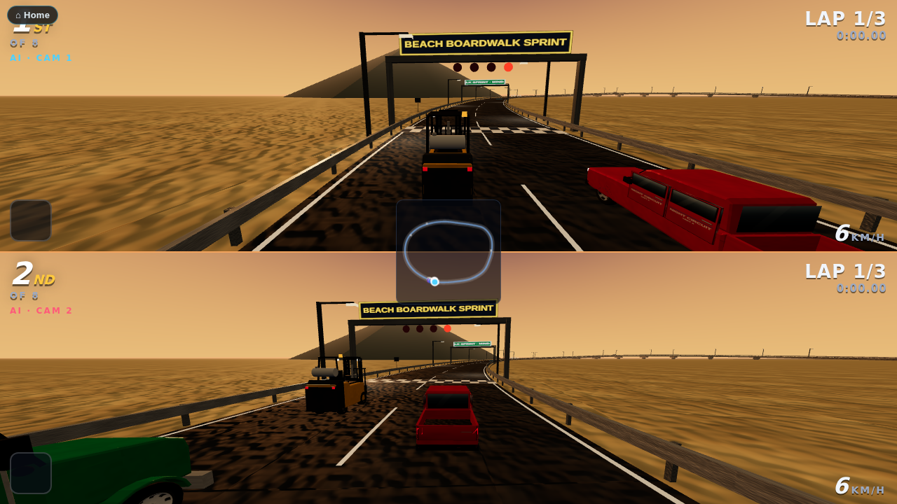
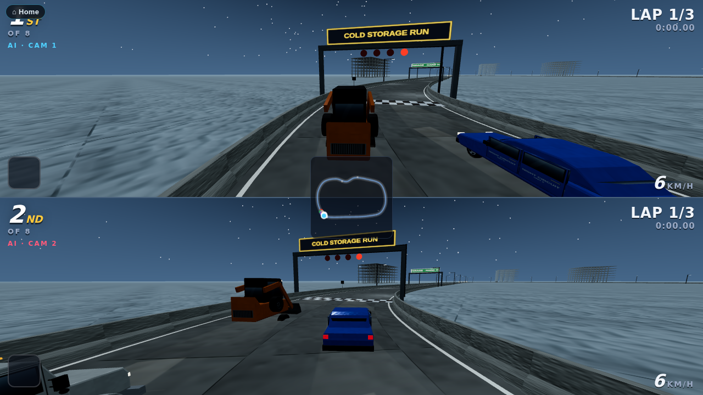
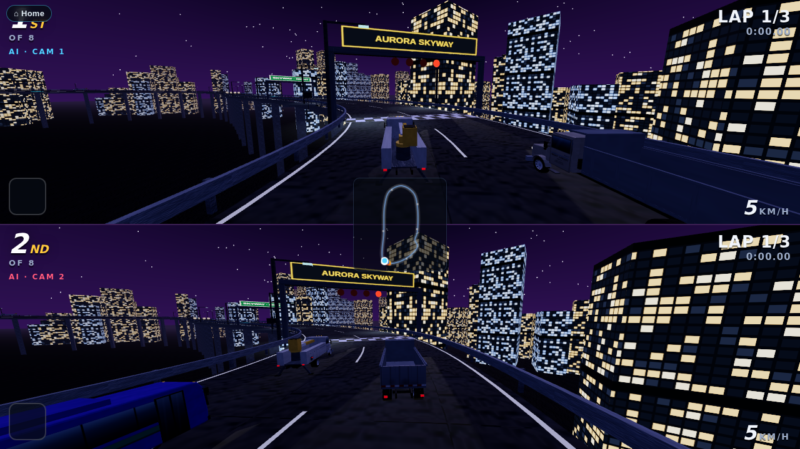
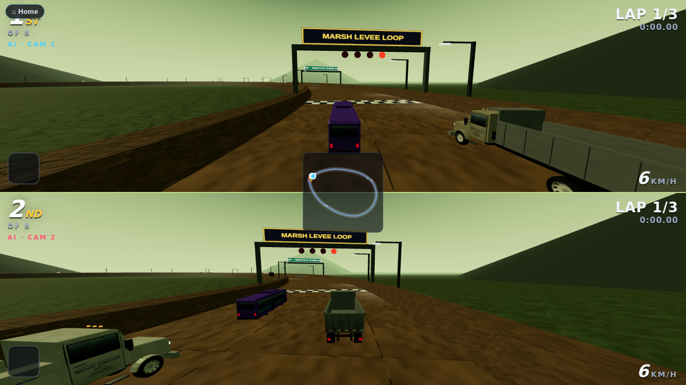
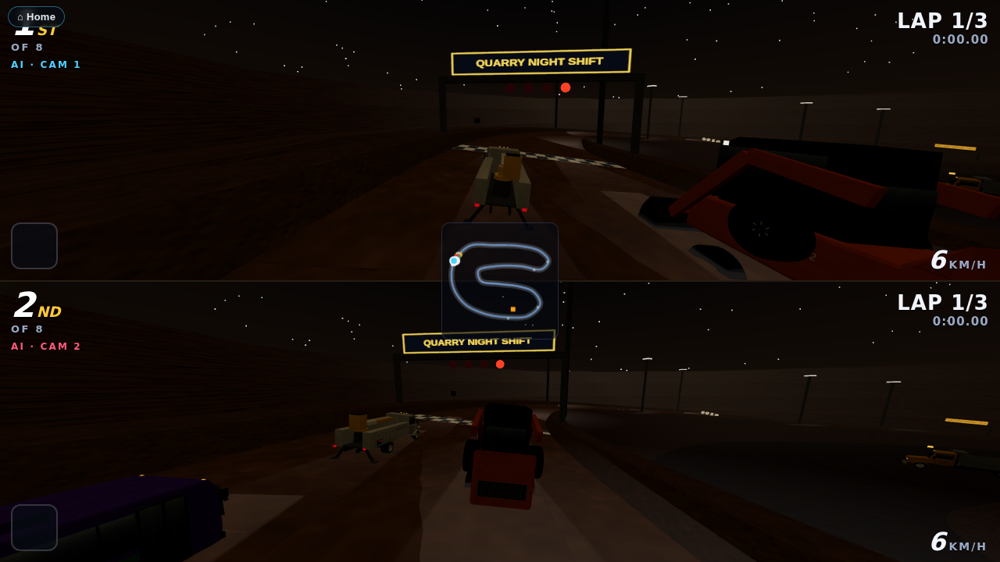
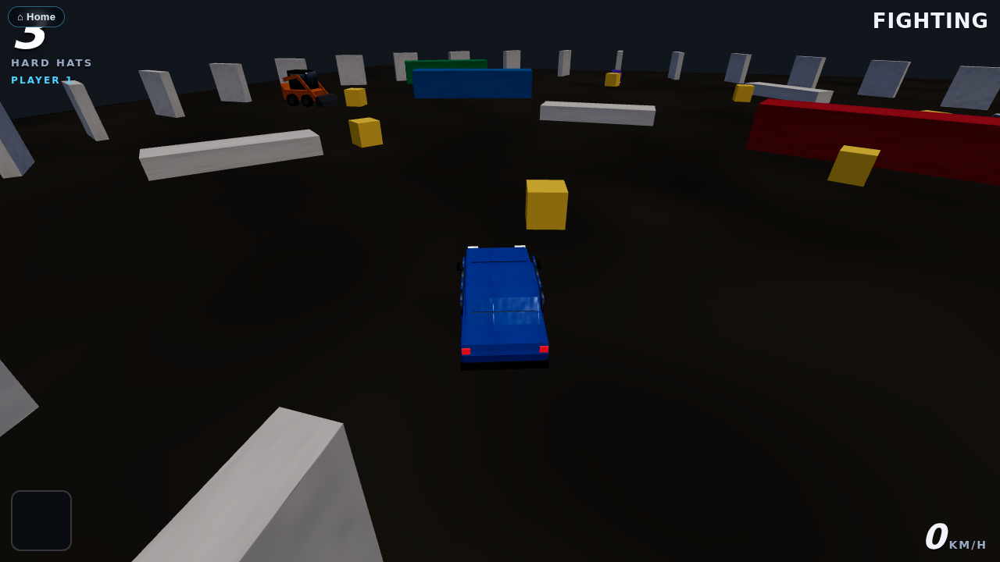

# The Easter egg: Night Highway Circuit

The platform hides an arcade racer. You drive the vehicles the training stations already use (from `WebXR/shared/fleet.js` and `WebXR/shared/equipment.js`), shrunk to kart size, on ten original courses, plus a Battle Arena. It has drifting and mini boosts, boost pads, supply crates with construction-site items, three laps, a rolling-start countdown, a position and lap HUD, a minimap, a chequered finish and a results table. Every sound is synthesised in the browser.

The game is a joke, but it still teaches. **Signal and check your mirrors before a lane change, and you earn a small boost.** The AI drivers do it too, and the results table counts safety bonuses next to lap times.

## How to open it

Any of these, from the homepage (`WebXR/index.html`, or `index.html` in the combined `WebXR/dist/` folder):

- Type the classic key sequence: **up up down down left right left right B A**. Keys typed into the search box do not count.
- Tap the **hard-hat glyph** at the bottom of the footer five times within three seconds.
- Add **`?egg=race`** to the homepage URL.

A one-line toast appears, then `race/index.html` opens (or `race.html` in the dist folder).

You can also open the page directly: `WebXR/race/index.html` from source, or `WebXR/dist/race.html` as a single bundled file. The bundle loads nothing from outside except the pinned three.js from cdnjs, which every page on the platform uses.

## Modes and levels

| Mode | What it is |
|---|---|
| Single race | Choose an engine class and a course. One to four players race split-screen on this machine, and AI drivers fill the grid of eight. |
| Grand Prix | All ten courses in order. Points go 10-8-6-5-4-3-2-1. There is a podium at the end. |
| Time trial | You race alone on the course with no traffic and no items, against a ghost of your best lap. |
| Two-tab race | Two tabs of the same browser race each other (see below). |
| Battle Arena | An enclosed construction-site pit. Items only, three hard-hat lives each, last one standing wins. Four local players or AI. |

Engine classes make up the difficulty ladder:

| Class | Speed | AI skill | Traffic | How to open it |
|---|---|---|---|---|
| Apprentice | ×0.86 | 70 | ×0.6 | Open from the start |
| Journey | ×1.00 | 86 | ×1.0 | Finish an Apprentice Grand Prix in the top three |
| Master | ×1.14 | 100 | ×1.4 | Finish a Journey Grand Prix in the top three |

A course-select toggle called **Mirror** sits above the course list: every course flipped left-right, corners the other way round. It opens the same way the classes do, one rung further up the same ladder — **finish a Master Grand Prix in the top three** — and it applies to Single race, Grand Prix and Time trial alike, on any course.

Unlocks, Grand Prix bests and time-trial ghosts are all saved in this browser under one `localStorage` key, `night-highway-circuit-v1`. A ghost is saved for each course and class (a mirrored course keeps its own ghost, under its own id). The results table carries a badge that shows the class and the mode, for example "JOURNEY CLASS · Grand Prix · race 2 of 10".

## The courses

| Course | What is on it |
|---|---|
| **Night Highway Circuit** | An elevated city freeway at night, laid out as a figure of eight. The lap climbs onto an overpass nine metres above its own lower carriageway and threads a lit tunnel through a tower podium. It sweeps along the seafront on a banked curve under a full moon and weaves a toll-plaza chicane between booths. Sedans and tractor-trailers drive in both directions: race-direction traffic on the right, oncoming traffic on the left. |
| **Port Terminal Sprint** | A container terminal at night. The course runs down the stack alleys and under the legs of the quay cranes along the berth, past a reefer row and a moored container ship. Straddle carriers cross the course between the stacks on their own cycle, and yard tractors run the terminal roads. |
| **Bay Fog Span** | A long suspension-bridge deck in evening fog, raced as a dog-bone: out on one carriageway and back on the other, with a balloon loop on each shore. The towers are painted International Orange. A work zone closes a lane behind a cone taper and an arrow board, with a bucket truck and its crew in the closure. The bridge is a generic one of its type, and no real bridge is named or copied. |
| **Quarry Haul Road** | A dirt haul road into an open pit at dusk. It drops down two banked switchbacks between the benches, crosses the pit floor past the crusher and the stockpiles, and climbs the long ramp back up. The road is edged with safety berms and there is dust in the air. A haul truck crosses the pit floor, and pickups and dump trucks use the road in both directions. |
| **Downtown Site Shuffle** | A tight lap of a construction site. It runs between two tower cranes, up onto a podium deck and down its ramp, past a trench-box run behind a barricade, and through a wet concrete pour, where grip is low. |
| **Beach Boardwalk Sprint** | A dusk boardwalk lap: up a ramp onto a pier that runs out over the sea on pillars, round the pier head and back, then a stretch of soft beach sand that saps your grip past the lifeguard tower, with gulls lifting off the rail as you pass. |
| **Cold Storage Run** | An ice-cold distribution warehouse at night: slick aisles, a forklift crossing the lane on its own cycle at each end, and near the back, a freezer door that opens and closes on a timer — wait for it, or clip it closed. |
| **Aurora Skyway** | A high, elevated transit viaduct through the neon towers at night: a banked sweep with the guard rail down on its outer edge for maintenance (mind the drop), and a chicane past a piling under repair where a gantry crane slides back and forth building the next span. |
| **Marsh Levee Loop** | A levee road around a restored wetland: the road dips toward the marsh floor, closed off by a tide gate that floods it on a timer, with egrets lifting off the reeds as you pass. |
| **Quarry Night Shift** | Quarry Haul Road run the other way round and worked after dark: down the long ramp that was the climb out, across the pit floor, and up both banked switchbacks under the light towers, with a haul truck crossing the pit floor and another crossing at each switchback. |

Each course is a data module under `WebXR/race/tracks/`. A module holds a closed spline of control points `[x, z, y, bank°]` and tables of zones, boost pads, item-box rows, hazards and scenery, all keyed by position along the spline. `WebXR/race/js/track.js` compiles the spline and applies the Mirror flip (`rcMirrorTrackDef`), and `WebXR/race/js/world.js` builds the scenery.

To add a course:

1. Write a new data module.
2. Import it in `WebXR/race/js/tracks.js`.
3. Add it to the `"race"` module list in `tools/bundle_webxr.py`.

`tools/check_race.mjs` holds the new course, and its mirrored twin, to the same checks as the others. Only a genuinely new kind of scenery needs new code in `world.js`.

## Battle Arena

An enclosed pit built from the props of a construction site: jersey barriers ring it, and shipping containers sit as cover in the middle. `WebXR/race/js/battle.js` is the whole mode — its own physics and AI (no track, no laps), and the arena's build and per-frame render, on the same vehicles and the same six items as the race. Bumping another car just bounces both apart: **items only** do damage. Each racer starts with three hard-hat lives; losing the last one is out. The last one standing wins. Four local players share the pit with AI filling the rest, and it opens from the main menu into the usual driver-and-vehicle screen — no class or course to choose, since the arena is fixed.

## The racers

Eight vehicles, each with a stat card from 1 to 5 in which the three stats sum to ten:

| Racer | Vehicle | Speed | Handling | Weight |
|---|---|---|---|---|
| Commuter | sedan | 4 | 4 | 2 |
| Crew Cab | pickup | 4 | 3 | 3 |
| Bobtail | semi tractor (no trailer) | 5 | 1 | 4 |
| Counterweight | forklift | 2 | 4 | 4 |
| Skid Pup | skid steer | 2 | 5 | 3 |
| Tri-Axle | dump truck | 3 | 2 | 5 |
| Lineman | bucket truck | 3 | 3 | 4 |
| Night Owl | transit bus | 4 | 1 | 5 |

## Items

Supply crates on the course (or scattered round the Battle Arena) hand out one item at a time. Racers near the front tend to get defensive items and racers near the back tend to get catch-up items.

| Item | What it does |
|---|---|
| Cone Drop | Drops three traffic cones behind you. Anyone who clips one spins. The cones last 18 seconds. |
| Wet-Paint Slick | Leaves a puddle of line paint with no grip. It lasts 14 seconds. |
| Hard-Hat Shield | Eight seconds of protection that stops the next hit. |
| Air-Horn Shockwave | Pushes aside and slows every racer within 16 m, and makes nearby traffic swerve. |
| Tow-Strap Grab | Hooks the racer ahead, reels you in and slingshots you past. |
| Flatbed Boost | A long, strong boost. |

## Controls

| | Drive | Drift | Item | Mirrors (look back) | Signal left / right |
|---|---|---|---|---|---|
| Player 1 | W A S D | Space | F | R | Q / E |
| Player 2 | arrow keys | Right Shift | Enter | / | , / . |
| Player 3 | I J K L | H | Y | N | U / O |
| Player 4 | Numpad 8 4 5 6 | Numpad 0 | Numpad Enter | Numpad . | Numpad 7 / 9 |

- **Solo play.** A single player can drive with either WASD or the arrow keys.
- **Gamepads.** These are read through `WebXR/shared/input.js` on the standard mapping: pad 1 is player 1, pad 2 is player 2, and so on. Steer with the left stick. Accelerate with RT or A, and brake or reverse with LT or B. Drift is RB, item is X, mirrors is LB, the D-pad left and right signal, and Start pauses.
- **Drifting.** Hold drift while you steer into a bend, then release it. A longer drift gives a bigger mini boost.
- **Rolling start.** Hold throttle only in the last moment of the countdown for a perfect start.
- **Other keys.** Esc pauses and M mutes.
- **Battle Arena.** The same drive, item and lookback keys; there is no course to lap, so drift and signal have nothing to do there.

## Multiplayer, honestly

This is **local multiplayer only**, and there is **no server**:

- **Split-screen.** Up to four players share one screen on one machine. Each uses their own keyboard cluster or gamepad, and AI drivers fill the rest of the grid of eight (four in the Battle Arena).
- **Two-tab race.** Two tabs of the **same browser on the same machine** link over the browser's `BroadcastChannel`. The hosting tab runs the race and the AI. The joining tab sends its controls and draws the snapshots it gets back. Nothing leaves the machine, and it is not online play.

## Track-side signage

Every course carries a couple of trackside signs in the union wordmarks style the rest of the platform uses (`WebXR/shared/signage.js`'s `unionSign`, typeset from `tools/unions.json` — never a logo): a fictional but real training-fund wordmark picked for the course's own trade, the same signage a station on the platform stands beside its pad. Night Highway Circuit and Quarry Night Shift stand behind the Operating Engineers; Port Terminal Sprint behind the Longshore and Warehouse Union; Bay Fog Span behind the Ironworkers; Downtown Site Shuffle and Beach Boardwalk Sprint behind the Carpenters; Cold Storage Run and Quarry Night Shift's haul behind the Teamsters; Aurora Skyway behind the Transit Union; Marsh Levee Loop behind the Laborers'.

## Originality

Every course layout, vehicle livery, item, name, glyph, colour and sound in this game is original to this platform:

- The vehicles are the platform's own procedural fleet builders.
- The item glyphs are drawn inline in SVG for this game.
- The engine, effects and backing loop are synthesised with WebAudio at run time.

No other game's names, characters, items, logos, music, sounds or course geometry are used or imitated. The places are generic: no real highway, port, bridge, quarry, warehouse, pier, viaduct or wetland is depicted. Quarry Night Shift is this platform's own Quarry Haul Road run the other way and lit for a night crew — not another game's track.

## Checks

`node tools/check_race.mjs` is part of `tools/check_all.mjs`. It checks each course, its mirrored twin and the game as a whole:

- **Every course:**
  - The spline closes smoothly and never crosses itself at the same level.
  - There are at least six boost pads and eight item boxes, all on the road.
  - No hazard — traffic, a crossing vehicle, a booth, a cone, a trench box, a slick, a gate or a tide gate's flood zone — spawns inside the start grid.
  - An AI-only race at a fast time step runs three laps with sound lap and position logic, and never produces a NaN.
  - The scene builds with no more than 2,500 meshes before merging.
- **Mirror class:** every course compiles flipped, keeping its point count, its pads and boxes on the road, and a clean closure; nothing spawns in the mirrored grid either.
- **Battle Arena:** an AI-only fight, driven headless the same way a race is, always ends with exactly one survivor within a generous time cap, places come out as a clean 1..N, and the arena's own scene stays under the 2,500-mesh ceiling.
- **The game as a whole:**
  - All six items fire, dropped items expire, and the hard hat blocks a hit.
  - The safety bonus pays out, and pays double when the mirrors were checked.
  - The engine-class unlock rule holds, and so does the Mirror unlock rule (a top-three Master Grand Prix, nothing else).
  - The save, ghosts and two-tab snapshots round-trip.
  - The page is bundled and linked from the homepage.

The checker removes its own scratch folder on exit.

## Screenshots

| | |
|---|---|
|  |  |
|  |  |
|  |  |
|  |  |
|  |  |
|  |  |
|  |  |

A 20-second clip of AI racing is at `screenshots/race/race-clip.webm`; a 20-second clip of AI racing on Aurora Skyway is at `screenshots/race/aurora-clip.webm`.
