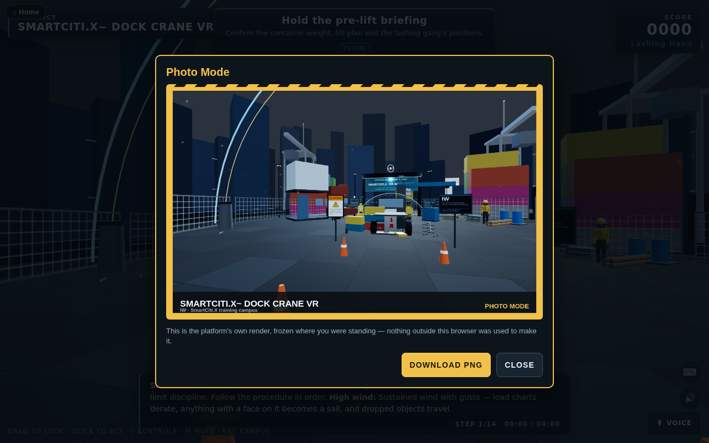
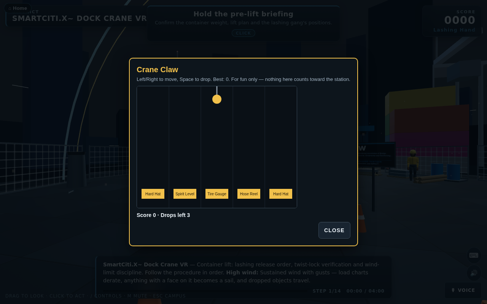

# The Easter egg: Night Highway Circuit

The platform hides an arcade racer. You drive the vehicles the training stations already use (from `WebXR/shared/fleet.js` and `WebXR/shared/equipment.js`), shrunk to kart size, on five original courses. It has drifting and mini boosts, boost pads, supply crates with construction-site items, three laps, a rolling-start countdown, a position and lap HUD, a minimap, a chequered finish and a results table. Every sound is synthesised in the browser.

The game is a joke, but it still teaches. **Signal and check your mirrors before a lane change, and you earn a small boost.** The AI drivers do it too, and the results table counts safety bonuses next to lap times.

## How to open it

Any of these, from the homepage (`WebXR/index.html`, or `index.html` in the combined `WebXR/dist/` folder):

- Type the classic key sequence: **up up down down left right left right B A**. Keys typed into the search box do not count.
- Tap the **hard-hat glyph** at the bottom of the footer five times within three seconds.
- Add **`?egg=race`** to the homepage URL.

A one-line toast appears, then `race/index.html` opens (or `race.html` in the dist folder).

You can also open the page directly: `WebXR/race/index.html` from source, or `WebXR/dist/race.html` as a single bundled file. The bundle loads nothing from outside except the pinned three.js from cdnjs, which every page on the platform uses.

## Modes and levels

| Mode | What it is |
|---|---|
| Single race | Choose an engine class and a course. One to four players race split-screen on this machine, and AI drivers fill the grid of eight. |
| Grand Prix | All five courses in order. Points go 10-8-6-5-4-3-2-1. There is a podium at the end. |
| Time trial | You race alone on the course with no traffic and no items, against a ghost of your best lap. |
| Two-tab race | Two tabs of the same browser race each other (see below). |

Engine classes make up the difficulty ladder:

| Class | Speed | AI skill | Traffic | How to open it |
|---|---|---|---|---|
| Apprentice | ×0.86 | 70 | ×0.6 | Open from the start |
| Journey | ×1.00 | 86 | ×1.0 | Finish an Apprentice Grand Prix in the top three |
| Master | ×1.14 | 100 | ×1.4 | Finish a Journey Grand Prix in the top three |

Unlocks, Grand Prix bests and time-trial ghosts are all saved in this browser under one `localStorage` key, `night-highway-circuit-v1`. A ghost is saved for each course and class. The results table carries a badge that shows the class and the mode, for example "JOURNEY CLASS · Grand Prix · race 2 of 5".

## The courses

| Course | What is on it |
|---|---|
| **Night Highway Circuit** | An elevated city freeway at night, laid out as a figure of eight. The lap climbs onto an overpass nine metres above its own lower carriageway and threads a lit tunnel through a tower podium. It sweeps along the seafront on a banked curve under a full moon and weaves a toll-plaza chicane between booths. Sedans and tractor-trailers drive in both directions: race-direction traffic on the right, oncoming traffic on the left. |
| **Port Terminal Sprint** | A container terminal at night. The course runs down the stack alleys and under the legs of the quay cranes along the berth, past a reefer row and a moored container ship. Straddle carriers cross the course between the stacks on their own cycle, and yard tractors run the terminal roads. |
| **Bay Fog Span** | A long suspension-bridge deck in evening fog, raced as a dog-bone: out on one carriageway and back on the other, with a balloon loop on each shore. The towers are painted International Orange. A work zone closes a lane behind a cone taper and an arrow board, with a bucket truck and its crew in the closure. The bridge is a generic one of its type, and no real bridge is named or copied. |
| **Quarry Haul Road** | A dirt haul road into an open pit at dusk. It drops down two banked switchbacks between the benches, crosses the pit floor past the crusher and the stockpiles, and climbs the long ramp back up. The road is edged with safety berms and there is dust in the air. A haul truck crosses the pit floor, and pickups and dump trucks use the road in both directions. |
| **Downtown Site Shuffle** | A tight lap of a construction site. It runs between two tower cranes, up onto a podium deck and down its ramp, past a trench-box run behind a barricade, and through a wet concrete pour, where grip is low. |

Each course is a data module under `WebXR/race/tracks/`. A module holds a closed spline of control points `[x, z, y, bank°]` and tables of zones, boost pads, item-box rows, hazards and scenery, all keyed by position along the spline. `WebXR/race/js/track.js` compiles the spline and `WebXR/race/js/world.js` builds the scenery.

To add a course:

1. Write a new data module.
2. Import it in `WebXR/race/js/tracks.js`.
3. Add it to the `"race"` module list in `tools/bundle_webxr.py`.

`tools/check_race.mjs` holds the new course to the same checks as the others. Only a genuinely new kind of scenery needs new code in `world.js`.

## The racers

Eight vehicles, each with a stat card from 1 to 5 in which the three stats sum to ten:

| Racer | Vehicle | Speed | Handling | Weight |
|---|---|---|---|---|
| Commuter | sedan | 4 | 4 | 2 |
| Crew Cab | pickup | 4 | 3 | 3 |
| Bobtail | semi tractor (no trailer) | 5 | 1 | 4 |
| Counterweight | forklift | 2 | 4 | 4 |
| Skid Pup | skid steer | 2 | 5 | 3 |
| Tri-Axle | dump truck | 3 | 2 | 5 |
| Lineman | bucket truck | 3 | 3 | 4 |
| Night Owl | transit bus | 4 | 1 | 5 |

## Items

Supply crates on the course hand out one item at a time. Racers near the front tend to get defensive items and racers near the back tend to get catch-up items.

| Item | What it does |
|---|---|
| Cone Drop | Drops three traffic cones behind you. Anyone who clips one spins. The cones last 18 seconds. |
| Wet-Paint Slick | Leaves a puddle of line paint with no grip. It lasts 14 seconds. |
| Hard-Hat Shield | Eight seconds of protection that stops the next hit. |
| Air-Horn Shockwave | Pushes aside and slows every racer within 16 m, and makes nearby traffic swerve. |
| Tow-Strap Grab | Hooks the racer ahead, reels you in and slingshots you past. |
| Flatbed Boost | A long, strong boost. |

## Controls

| | Drive | Drift | Item | Mirrors (look back) | Signal left / right |
|---|---|---|---|---|---|
| Player 1 | W A S D | Space | F | R | Q / E |
| Player 2 | arrow keys | Right Shift | Enter | / | , / . |
| Player 3 | I J K L | H | Y | N | U / O |
| Player 4 | Numpad 8 4 5 6 | Numpad 0 | Numpad Enter | Numpad . | Numpad 7 / 9 |

- **Solo play.** A single player can drive with either WASD or the arrow keys.
- **Gamepads.** These are read through `WebXR/shared/input.js` on the standard mapping: pad 1 is player 1, pad 2 is player 2, and so on. Steer with the left stick. Accelerate with RT or A, and brake or reverse with LT or B. Drift is RB, item is X, mirrors is LB, the D-pad left and right signal, and Start pauses.
- **Drifting.** Hold drift while you steer into a bend, then release it. A longer drift gives a bigger mini boost.
- **Rolling start.** Hold throttle only in the last moment of the countdown for a perfect start.
- **Other keys.** Esc pauses and M mutes.

## Multiplayer, honestly

This is **local multiplayer only**, and there is **no server**:

- **Split-screen.** Up to four players share one screen on one machine. Each uses their own keyboard cluster or gamepad, and AI drivers fill the rest of the grid of eight.
- **Two-tab race.** Two tabs of the **same browser on the same machine** link over the browser's `BroadcastChannel`. The hosting tab runs the race and the AI. The joining tab sends its controls and draws the snapshots it gets back. Nothing leaves the machine, and it is not online play.

## Originality

Every course layout, vehicle livery, item, name, glyph, colour and sound in this game is original to this platform:

- The vehicles are the platform's own procedural fleet builders.
- The item glyphs are drawn inline in SVG for this game.
- The engine, effects and backing loop are synthesised with WebAudio at run time.

No other game's names, characters, items, logos, music, sounds or course geometry are used or imitated. The places are generic: no real highway, port, bridge, quarry or company is depicted.

## Checks

`node tools/check_race.mjs` is part of `tools/check_all.mjs`. It checks each course and the game as a whole:

- **Every course:**
  - The spline closes smoothly and never crosses itself at the same level.
  - There are at least six boost pads and eight item boxes.
  - No hazard spawns inside the start grid.
  - An AI-only race at a fast time step runs three laps with sound lap and position logic, and never produces a NaN.
  - The scene builds with no more than 2,500 meshes before merging.
- **The game as a whole:**
  - All six items fire, dropped items expire, and the hard hat blocks a hit.
  - The safety bonus pays out, and pays double when the mirrors were checked.
  - The unlock rule holds.
  - The save, ghosts and two-tab snapshots round-trip.
  - The page is bundled and linked from the homepage.

## Screenshots

| | |
|---|---|
|  |  |
|  |  |
|  |  |
|  |  |

A 20-second clip of AI racing is at `screenshots/race/race-clip.webm`.

## Inside the apps

Six smaller, honest Easter eggs live inside the training apps themselves,
built in `WebXR/shared/eggs-app.js` and mounted with one import and one
mount call in each app's own `js/app.js`. None of them touches a station's
steps, its scoring, or the auditable records in `shared/records.js` — every
one of them keeps its own small `localStorage` key, separate from the real
training record, and says so wherever it shows a learner anything.

### 1. Photo Mode (SmartCiti.X)

Press **P** inside any station (not at the hub) and the run pauses, the
current frame freezes, and the platform composites its own screenshot: a
hard-hat-yellow frame with a hazard-stripe corner, the station's name, and
the union abbreviation its own sign already carries (read straight off
`stage.signage.plan.unionId`, the same union the pad's sign shows — nothing
new is looked up). A small card offers **Download PNG**; closing it (or
pressing Escape) resumes the run exactly where it paused. It is entirely the
platform's own WebGL canvas, read back with `toDataURL()` — nothing loads,
tracks or is sent anywhere.

### 2. The Golden Wrench (SmartCiti.X)

Once a day, one station on the roster is picked (seeded from the local
date, so it holds all day and changes at midnight) and, if that station
happens to have a recognisable hand tool among its clickable props (a
wrench, a drill, a gauge, a meter, a radio — anything a real toolkit prop
would be), exactly one of them turns gold for the day. Clicking it plays a
short four-note jingle, synthesised in the browser (WebAudio, no sample),
and — the first time that day — stamps a "found the golden wrench" line
into its own `smartcitix-egg-golden-wrench-v1` localStorage log, never into
`TrainingRecords`. A station that has no tool that day simply has no golden
wrench that day; the platform never invents one where there is nothing to
paint gold.

### 3. Crane Claw (SmartCiti.X)

Any station in the **Maritime & Ports** district gets a small hook prop
added beside the dock's own gantry crane. Click it three times (each click
plays a metallic clunk) and a tiny claw-machine minigame opens over a canvas:
move the claw with **Left/Right**, drop it with **Space**, and try to land it
on a lane holding one of the toolkit's own tool names. It is purely for fun —
a best score is kept in `smartcitix-egg-claw-best-v1` — and a miss on the
hook lets the normal click straight through to the station underneath it.

### 4. The Holodeck arcade cabinet

A small retro cabinet stands in the Holodeck scene at all times (it survives
every hole and every generated procedure, since it lives in `worldRoot`
rather than inside either). Clicking it opens **Scaffold Climber**: a 2D
canvas game where you dodge tools dropped from above and tie off at every
level you climb (press **T** in the tie-off window) for a bonus — the joke
being that the fastest way up a scaffold is never the one that skips tying
off. A best score is kept in `holodeck-egg-scaffold-best-v1`.

### 5. Toolbox Talk Bingo (the instructor console)

A small **🎯 Toolbox Talk Bingo** button floats in the corner of the
instructor console. It builds a real 5×5 bingo card — one FREE centre square,
24 hazard-named cells drawn from the hazards this class's own live sessions
have actually named, topped up with common toolbox-talk hazard categories
when the room hasn't produced 24 of its own yet — and opens it in a fresh,
printable window. It says plainly, on the card itself, that it is **"for the
room, not for the record"**: nothing about it is saved to any learner's
training record, and the console never reads anything from a simulator to
build it.

### 6. Night Shift (SmartCiti.X)

If the learner's own computer clock reads between **00:00 and 04:00 local**
when they spawn into a station, the plaza's light masts flicker once, and
the EI guide's opening line for that station quietly adds a rest reminder —
nothing about the station, its steps or its scoring changes; the run plays
exactly the same either way.

## Checks

`node tools/check_eggs_app.mjs` (part of `tools/check_all.mjs`) proves:
`shared/eggs-app.js` takes no imports of its own and exports only the three
mount functions; each app's main module actually imports and mounts its own
eggs, and the instructor console still sets no HTML from a string and
imports no simulator code; `tools/bundle_webxr.py` lists the module for all
three apps, before each app's own `app.js`; the daily pick and the bingo
card's pure logic; and, against a small hand-built DOM/THREE/WebAudio stub,
that Photo Mode freezes and unfreezes the run, the Golden Wrench recolours
exactly one tool at exactly one station a day and stamps its note once, the
crane hook only opens the claw on its third real hit (a miss lets the
station's own click through), Night Shift only ever changes anything inside
its four-hour window, the Holodeck cabinet opens its game the same way, and
the printed bingo card escapes untrusted text.
