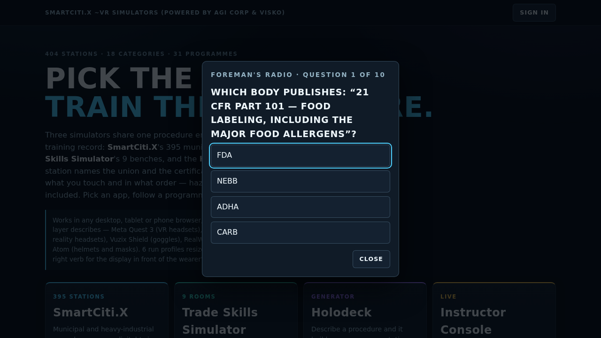
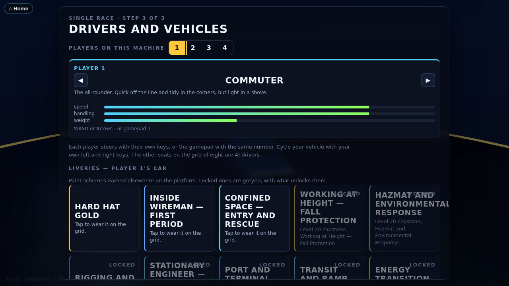

# The Easter eggs

The platform hides four of these now: an arcade racer, a hidden collectible
spread across the training stations, a quiz built from the standards
registry, and a set of unlockable paint schemes for the racer, earned by
finishing a programme's hardest level. All four are original, all say plainly
what they are, and none of them touches a station's steps or its scoring —
finding a hard hat, taking the quiz, and picking a livery are all off to the
side of the real training.

## Night Highway Circuit

The platform hides an arcade racer. You drive the vehicles the training stations already use (from `WebXR/shared/fleet.js` and `WebXR/shared/equipment.js`), shrunk to kart size, on five original courses. It has drifting and mini boosts, boost pads, supply crates with construction-site items, three laps, a rolling-start countdown, a position and lap HUD, a minimap, a chequered finish and a results table. Every sound is synthesised in the browser.

The game is a joke, but it still teaches. **Signal and check your mirrors before a lane change, and you earn a small boost.** The AI drivers do it too, and the results table counts safety bonuses next to lap times.


### How to open it

Any of these, from the homepage (`WebXR/index.html`, or `index.html` in the combined `WebXR/dist/` folder):

- Type the classic key sequence: **up up down down left right left right B A**. Keys typed into the search box do not count.
- Tap the **hard-hat glyph** at the bottom of the footer five times within three seconds.
- Add **`?egg=race`** to the homepage URL.

A one-line toast appears, then `race/index.html` opens (or `race.html` in the dist folder).

You can also open the page directly: `WebXR/race/index.html` from source, or `WebXR/dist/race.html` as a single bundled file. The bundle loads nothing from outside except the pinned three.js from cdnjs, which every page on the platform uses.

### Modes and levels

| Mode | What it is |
|---|---|
| Single race | Choose an engine class and a course. One to four players race split-screen on this machine, and AI drivers fill the grid of eight. |
| Grand Prix | All five courses in order. Points go 10-8-6-5-4-3-2-1. There is a podium at the end. |
| Time trial | You race alone on the course with no traffic and no items, against a ghost of your best lap. |
| Two-tab race | Two tabs of the same browser race each other (see below). |

Engine classes make up the difficulty ladder:

| Class | Speed | AI skill | Traffic | How to open it |
|---|---|---|---|---|
| Apprentice | ×0.86 | 70 | ×0.6 | Open from the start |
| Journey | ×1.00 | 86 | ×1.0 | Finish an Apprentice Grand Prix in the top three |
| Master | ×1.14 | 100 | ×1.4 | Finish a Journey Grand Prix in the top three |

Unlocks, Grand Prix bests and time-trial ghosts are all saved in this browser under one `localStorage` key, `night-highway-circuit-v1`. A ghost is saved for each course and class. The results table carries a badge that shows the class and the mode, for example "JOURNEY CLASS · Grand Prix · race 2 of 5".

### The courses

| Course | What is on it |
|---|---|
| **Night Highway Circuit** | An elevated city freeway at night, laid out as a figure of eight. The lap climbs onto an overpass nine metres above its own lower carriageway and threads a lit tunnel through a tower podium. It sweeps along the seafront on a banked curve under a full moon and weaves a toll-plaza chicane between booths. Sedans and tractor-trailers drive in both directions: race-direction traffic on the right, oncoming traffic on the left. |
| **Port Terminal Sprint** | A container terminal at night. The course runs down the stack alleys and under the legs of the quay cranes along the berth, past a reefer row and a moored container ship. Straddle carriers cross the course between the stacks on their own cycle, and yard tractors run the terminal roads. |
| **Bay Fog Span** | A long suspension-bridge deck in evening fog, raced as a dog-bone: out on one carriageway and back on the other, with a balloon loop on each shore. The towers are painted International Orange. A work zone closes a lane behind a cone taper and an arrow board, with a bucket truck and its crew in the closure. The bridge is a generic one of its type, and no real bridge is named or copied. |
| **Quarry Haul Road** | A dirt haul road into an open pit at dusk. It drops down two banked switchbacks between the benches, crosses the pit floor past the crusher and the stockpiles, and climbs the long ramp back up. The road is edged with safety berms and there is dust in the air. A haul truck crosses the pit floor, and pickups and dump trucks use the road in both directions. |
| **Downtown Site Shuffle** | A tight lap of a construction site. It runs between two tower cranes, up onto a podium deck and down its ramp, past a trench-box run behind a barricade, and through a wet concrete pour, where grip is low. |

Each course is a data module under `WebXR/race/tracks/`. A module holds a closed spline of control points `[x, z, y, bank°]` and tables of zones, boost pads, item-box rows, hazards and scenery, all keyed by position along the spline. `WebXR/race/js/track.js` compiles the spline and `WebXR/race/js/world.js` builds the scenery.

To add a course:

1. Write a new data module.
2. Import it in `WebXR/race/js/tracks.js`.
3. Add it to the `"race"` module list in `tools/bundle_webxr.py`.

`tools/check_race.mjs` holds the new course to the same checks as the others. Only a genuinely new kind of scenery needs new code in `world.js`.

### The racers

Eight vehicles, each with a stat card from 1 to 5 in which the three stats sum to ten:

| Racer | Vehicle | Speed | Handling | Weight |
|---|---|---|---|---|
| Commuter | sedan | 4 | 4 | 2 |
| Crew Cab | pickup | 4 | 3 | 3 |
| Bobtail | semi tractor (no trailer) | 5 | 1 | 4 |
| Counterweight | forklift | 2 | 4 | 4 |
| Skid Pup | skid steer | 2 | 5 | 3 |
| Tri-Axle | dump truck | 3 | 2 | 5 |
| Lineman | bucket truck | 3 | 3 | 4 |
| Night Owl | transit bus | 4 | 1 | 5 |

### Items

Supply crates on the course hand out one item at a time. Racers near the front tend to get defensive items and racers near the back tend to get catch-up items.

| Item | What it does |
|---|---|
| Cone Drop | Drops three traffic cones behind you. Anyone who clips one spins. The cones last 18 seconds. |
| Wet-Paint Slick | Leaves a puddle of line paint with no grip. It lasts 14 seconds. |
| Hard-Hat Shield | Eight seconds of protection that stops the next hit. |
| Air-Horn Shockwave | Pushes aside and slows every racer within 16 m, and makes nearby traffic swerve. |
| Tow-Strap Grab | Hooks the racer ahead, reels you in and slingshots you past. |
| Flatbed Boost | A long, strong boost. |

### Controls

| | Drive | Drift | Item | Mirrors (look back) | Signal left / right |
|---|---|---|---|---|---|
| Player 1 | W A S D | Space | F | R | Q / E |
| Player 2 | arrow keys | Right Shift | Enter | / | , / . |
| Player 3 | I J K L | H | Y | N | U / O |
| Player 4 | Numpad 8 4 5 6 | Numpad 0 | Numpad Enter | Numpad . | Numpad 7 / 9 |

- **Solo play.** A single player can drive with either WASD or the arrow keys.
- **Gamepads.** These are read through `WebXR/shared/input.js` on the standard mapping: pad 1 is player 1, pad 2 is player 2, and so on. Steer with the left stick. Accelerate with RT or A, and brake or reverse with LT or B. Drift is RB, item is X, mirrors is LB, the D-pad left and right signal, and Start pauses.
- **Drifting.** Hold drift while you steer into a bend, then release it. A longer drift gives a bigger mini boost.
- **Rolling start.** Hold throttle only in the last moment of the countdown for a perfect start.
- **Other keys.** Esc pauses and M mutes.

### Multiplayer, honestly

This is **local multiplayer only**, and there is **no server**:

- **Split-screen.** Up to four players share one screen on one machine. Each uses their own keyboard cluster or gamepad, and AI drivers fill the rest of the grid of eight.
- **Two-tab race.** Two tabs of the **same browser on the same machine** link over the browser's `BroadcastChannel`. The hosting tab runs the race and the AI. The joining tab sends its controls and draws the snapshots it gets back. Nothing leaves the machine, and it is not online play.

### Originality

Every course layout, vehicle livery, item, name, glyph, colour and sound in this game is original to this platform:

- The vehicles are the platform's own procedural fleet builders.
- The item glyphs are drawn inline in SVG for this game.
- The engine, effects and backing loop are synthesised with WebAudio at run time.

No other game's names, characters, items, logos, music, sounds or course geometry are used or imitated. The places are generic: no real highway, port, bridge, quarry or company is depicted.

### Checks

`node tools/check_race.mjs` is part of `tools/check_all.mjs`. It checks each course and the game as a whole:

- **Every course:**
  - The spline closes smoothly and never crosses itself at the same level.
  - There are at least six boost pads and eight item boxes.
  - No hazard spawns inside the start grid.
  - An AI-only race at a fast time step runs three laps with sound lap and position logic, and never produces a NaN.
  - The scene builds with no more than 2,500 meshes before merging.
- **The game as a whole:**
  - All six items fire, dropped items expire, and the hard hat blocks a hit.
  - The safety bonus pays out, and pays double when the mirrors were checked.
  - The unlock rule holds.
  - The save, ghosts and two-tab snapshots round-trip.
  - The page is bundled and linked from the homepage.

### Screenshots

| | |
|---|---|
|  |  |
|  |  |
|  |  |
|  |  |
|  |  |

A 20-second clip of AI racing is at `screenshots/race/race-clip.webm`.

## Hard Hat Hunt

A small golden hard hat is hidden in twelve training stations, chosen across
programmes and both simulators. Click it and it is found — nothing about the
station's own procedure changes, and finding one is never scored as a step or
a mistake.


### Where they are

| Station | App | Programme |
|---|---|---|
| Cooling Tower | SmartCiti.X | Building Systems & Facilities |
| Sampling Well | SmartCiti.X | Water & Environmental |
| Stage Load-In and Truss Rigging | SmartCiti.X | Live Events Production |
| Tide Gate | SmartCiti.X | Bay restoration |
| Mast Climber | SmartCiti.X | Working at Height — Fall Protection |
| Level B Entry and SCBA Change-Out | SmartCiti.X | Hazmat and Environmental Response |
| Rebounding and Boxing Out | SmartCiti.X | Basketball Fundamentals |
| Unit Turnover | SmartCiti.X | Property Management |
| Restorative Justice Circle Facilitation | SmartCiti.X | Civic Leadership and Emotional Intelligence |
| Patient Intake Screening | SmartCiti.X | Dental / outbreak-response programmes |
| Welding | Trade Skills Simulator | Builders and trades |
| Plumbing | Trade Skills Simulator | Builders and trades |

### How it is built

Every hard hat is planted by one shared helper, `WebXR/shared/eggs.js`, which
a station calls exactly once from its own `build(root)`:

```js
plantHardHat(root, THREE, "cooling-tower", [2.6, 1.15, -2.6]);
```

That is the whole integration — one import and one call, nothing else in the
twelve stations changes. The helper does everything else:

- **It never touches the station's interaction system.** A station's real
  controls are registered with `shared/kit.js`'s `markInteractive()` and
  raycast against `state.selectables`, which feeds `Session.select()` — the
  scoring engine, where an id it does not expect counts as a wrong answer.
  The hard hat is never added to either list. Instead, the helper raycasts
  for itself, reading the same read-only camera each app already exposes for
  its own live tests (`window.__smartcityTest.camera()`, `__tradesTest`,
  `__holodeckTest`). A find can never touch a step or a score.
- **Finding one is idempotent and saved.** A find is recorded in this
  browser's `localStorage`, under the key `vr-training-hardhats-v1`, as the
  list of station ids found so far. Finding the same hat twice changes
  nothing.
- **The homepage counts them.** The footer shows "hard hats found: n/12",
  read from the same key when the page loads.
- **Finding all twelve unlocks a livery in the race**, "Hard Hat Gold" — see
  Capstone skins below for how liveries work in the garage.

### Checks

`node tools/check_eggs.mjs`, part of `tools/check_all.mjs`, holds this to:

- All twelve host files exist, each imports `plantHardHat` from
  `shared/eggs.js` and calls it exactly once, under a distinct id.
- The hosts land in more than one app and more than one programme.
- A find, a repeated find, and completing all twelve round-trip through a
  fake `localStorage` exactly as described above.

## Foreman's Radio

Type **`radio`** anywhere on the homepage outside the search box (the same
rule the racer's key sequence uses) and a retro handheld-radio card opens
with a ten-question quiz. It is a quiz, honestly — not a real radio, and
passing it earns nothing but a better line in the score card.


### Where the questions come from

Every question is generated from `tools/standards.json` — the one registry of
standards, codes and union training programmes this platform teaches
against — and nothing else. `tools/gen_radio_quiz.mjs` lifts only the `id`,
`body` and `title` of every entry into `WebXR/shared/radio-quiz-data.js`
(regenerated whenever `node tools/gen_catalog.mjs` runs); no `scope`,
`source` or `cites` field is carried over, because a quiz question is never
built on anything but the body that publishes a standard and the standard's
own title. `WebXR/shared/radio-quiz.js` then:

1. Picks ten standards at random, no two alike.
2. Asks "which body publishes …?", quoting the standard's own CFR-style
   clause when its title states one plainly (`29 CFR 1910.146`), or the
   standard's full title otherwise.
3. Offers four choices: the real publishing body, plus three distractor
   bodies drawn from the registry's own list — never an invented one.

A score card follows the last question, and a best score is kept in this
browser under `vr-training-radio-quiz-v1`.

### Checks

`node tools/check_eggs.mjs` holds this to:

- `shared/radio-quiz-data.js` matches `tools/standards.json` exactly (stale
  data fails the build).
- Across several seeds, `buildQuiz()` returns ten questions, all built from
  distinct standards, each with exactly four distinct choices and one correct
  answer that matches the standard's real body — and the question text is
  built only from that standard's own title or the clause inside it, never an
  invented fact.
- A best score round-trips through a fake `localStorage`, and a worse run
  never overwrites it.
- The homepage carries the `radio` key sequence, the hard-hat counter, and
  still carries the racer's own key sequence untouched.

## Capstone skins

Finishing a programme's level-20 capstone — the hardest run of its ladder,
under the mastery rule with no coaching (`shared/ladder.js`'s
`LADDER_LEVELS`) — unlocks a livery in the race, named and coloured after
that programme. The garage's vehicle screen has a **Liveries** grid, under
player 1's car: one row per programme with a ladder, plus Hard Hat Gold.
Locked rows are greyed, each naming what unlocks it.


### The unlock rule, honestly

A station attempt played as part of a level run carries a `.ladder` tag —
`{ programme, level, run, task }` — set by `shared/ladder.js`'s `levelTag()`
and written onto the attempt by `TrainingRecords.record()` (see
`WebXR/shared/records.js` and `WebXR/smartcity/js/app.js`). A livery unlocks
the moment any record in this browser carries `ladder.level === 20` for that
programme and a passing grade (`records.js`'s `passed()`: two or more stars,
no unsafe action). That is a lighter bar than the ladder's own "level
passed" rule, which needs every task in one run of the level at mastery
(`shared/ladder.js`'s `levelResult()`) — a livery is a smaller thing than the
level badge, and this doc says so rather than overclaiming it.

The rule itself lives in `WebXR/race/js/liveries.js`, pure and independent of
three.js and the DOM, and the list of programmes comes from
`WebXR/race/js/capstone-liveries.js`, generated by
`tools/gen_capstone_liveries.mjs` from `WebXR/smartcity/js/ladders.js` — so a
programme can never be missing a livery, or keep one after its ladder is
gone.

An unlocked livery repaints player 1's hull and fleet name — in the garage
preview, on the grid, and on the podium — with no change to the vehicle's
stats.

### Checks

`node tools/check_eggs.mjs` holds this to:

- `race/js/capstone-liveries.js` matches the ladders exactly.
- A livery unlocks only for a passed, level-20 attempt tagged with its own
  programme — not level 19, not an unpassed attempt, and not another
  programme's capstone.
- Hard Hat Gold unlocks only once all twelve hard hats are found.
- Every capstone livery is named after its own programme.
