# The Easter egg: Night Highway Circuit

The platform hides an arcade racer. You drive the vehicles the training stations already use (from `WebXR/shared/fleet.js` and `WebXR/shared/equipment.js`), shrunk to kart size, on five original courses. It has drifting and mini boosts, boost pads, supply crates with construction-site items, three laps, a rolling-start countdown, a position and lap HUD, a minimap, a chequered finish and a results table. Every sound is synthesised in the browser.

The game is a joke, but it still teaches. **Signal and check your mirrors before a lane change, and you earn a small boost.** The AI drivers do it too, and the results table counts safety bonuses next to lap times.

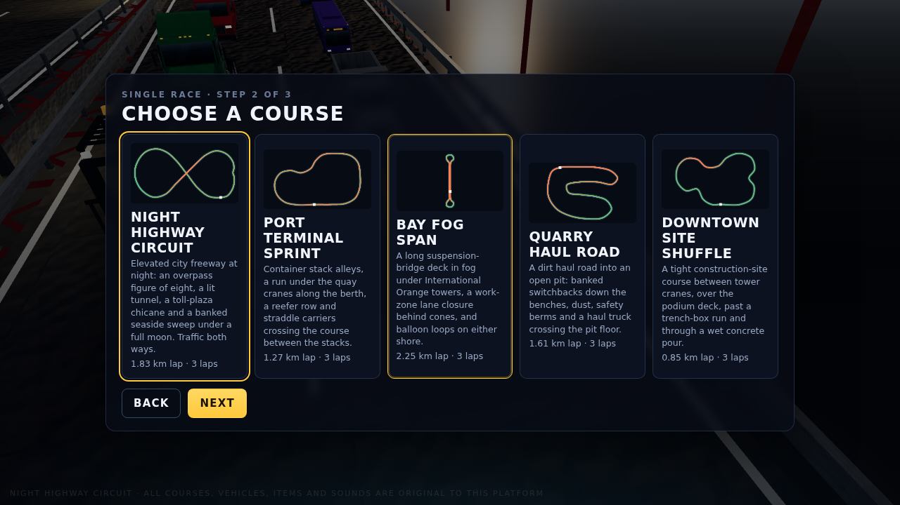

## How to open it

Any of these, from the homepage (`WebXR/index.html`, or `index.html` in the combined `WebXR/dist/` folder):

- Type the classic key sequence: **up up down down left right left right B A**. Keys typed into the search box do not count.
- Tap the **hard-hat glyph** at the bottom of the footer five times within three seconds.
- Add **`?egg=race`** to the homepage URL.

A one-line toast appears, then `race/index.html` opens (or `race.html` in the dist folder).

You can also open the page directly: `WebXR/race/index.html` from source, or `WebXR/dist/race.html` as a single bundled file. The bundle loads nothing from outside except the pinned three.js from cdnjs, which every page on the platform uses.

## Modes and levels

| Mode | What it is |
|---|---|
| Single race | Choose an engine class and a course. One to four players race split-screen on this machine, and AI drivers fill the grid of eight. |
| Grand Prix | All five courses in order. Points go 10-8-6-5-4-3-2-1. There is a podium at the end. |
| Time trial | You race alone on the course with no traffic and no items, against a ghost of your best lap. |
| Two-tab race | Two tabs of the same browser race each other (see below). |

Engine classes make up the difficulty ladder:

| Class | Speed | AI skill | Traffic | How to open it |
|---|---|---|---|---|
| Apprentice | ×0.86 | 70 | ×0.6 | Open from the start |
| Journey | ×1.00 | 86 | ×1.0 | Finish an Apprentice Grand Prix in the top three |
| Master | ×1.14 | 100 | ×1.4 | Finish a Journey Grand Prix in the top three |

Unlocks, Grand Prix bests and time-trial ghosts are all saved in this browser under one `localStorage` key, `night-highway-circuit-v1`. A ghost is saved for each course and class. The results table carries a badge that shows the class and the mode, for example "JOURNEY CLASS · Grand Prix · race 2 of 5".

## The courses

| Course | What is on it |
|---|---|
| **Night Highway Circuit** | An elevated city freeway at night, laid out as a figure of eight. The lap climbs onto an overpass nine metres above its own lower carriageway and threads a lit tunnel through a tower podium. It sweeps along the seafront on a banked curve under a full moon and weaves a toll-plaza chicane between booths. Sedans and tractor-trailers drive in both directions: race-direction traffic on the right, oncoming traffic on the left. |
| **Port Terminal Sprint** | A container terminal at night. The course runs down the stack alleys and under the legs of the quay cranes along the berth, past a reefer row and a moored container ship. Straddle carriers cross the course between the stacks on their own cycle, and yard tractors run the terminal roads. |
| **Bay Fog Span** | A long suspension-bridge deck in evening fog, raced as a dog-bone: out on one carriageway and back on the other, with a balloon loop on each shore. The towers are painted International Orange. A work zone closes a lane behind a cone taper and an arrow board, with a bucket truck and its crew in the closure. The bridge is a generic one of its type, and no real bridge is named or copied. |
| **Quarry Haul Road** | A dirt haul road into an open pit at dusk. It drops down two banked switchbacks between the benches, crosses the pit floor past the crusher and the stockpiles, and climbs the long ramp back up. The road is edged with safety berms and there is dust in the air. A haul truck crosses the pit floor, and pickups and dump trucks use the road in both directions. |
| **Downtown Site Shuffle** | A tight lap of a construction site. It runs between two tower cranes, up onto a podium deck and down its ramp, past a trench-box run behind a barricade, and through a wet concrete pour, where grip is low. |

Each course is a data module under `WebXR/race/tracks/`. A module holds a closed spline of control points `[x, z, y, bank°]` and tables of zones, boost pads, item-box rows, hazards and scenery, all keyed by position along the spline. `WebXR/race/js/track.js` compiles the spline and `WebXR/race/js/world.js` builds the scenery.

To add a course:

1. Write a new data module.
2. Import it in `WebXR/race/js/tracks.js`.
3. Add it to the `"race"` module list in `tools/bundle_webxr.py`.

`tools/check_race.mjs` holds the new course to the same checks as the others. Only a genuinely new kind of scenery needs new code in `world.js`.

## The racers

Eight vehicles, each with a stat card from 1 to 5 in which the three stats sum to ten:

| Racer | Vehicle | Speed | Handling | Weight |
|---|---|---|---|---|
| Commuter | sedan | 4 | 4 | 2 |
| Crew Cab | pickup | 4 | 3 | 3 |
| Bobtail | semi tractor (no trailer) | 5 | 1 | 4 |
| Counterweight | forklift | 2 | 4 | 4 |
| Skid Pup | skid steer | 2 | 5 | 3 |
| Tri-Axle | dump truck | 3 | 2 | 5 |
| Lineman | bucket truck | 3 | 3 | 4 |
| Night Owl | transit bus | 4 | 1 | 5 |

## Items

Supply crates on the course hand out one item at a time. Racers near the front tend to get defensive items and racers near the back tend to get catch-up items.

| Item | What it does |
|---|---|
| Cone Drop | Drops three traffic cones behind you. Anyone who clips one spins. The cones last 18 seconds. |
| Wet-Paint Slick | Leaves a puddle of line paint with no grip. It lasts 14 seconds. |
| Hard-Hat Shield | Eight seconds of protection that stops the next hit. |
| Air-Horn Shockwave | Pushes aside and slows every racer within 16 m, and makes nearby traffic swerve. |
| Tow-Strap Grab | Hooks the racer ahead, reels you in and slingshots you past. |
| Flatbed Boost | A long, strong boost. |

## Controls

| | Drive | Drift | Item | Mirrors (look back) | Signal left / right |
|---|---|---|---|---|---|
| Player 1 | W A S D | Space | F | R | Q / E |
| Player 2 | arrow keys | Right Shift | Enter | / | , / . |
| Player 3 | I J K L | H | Y | N | U / O |
| Player 4 | Numpad 8 4 5 6 | Numpad 0 | Numpad Enter | Numpad . | Numpad 7 / 9 |

- **Solo play.** A single player can drive with either WASD or the arrow keys.
- **Gamepads.** These are read through `WebXR/shared/input.js` on the standard mapping: pad 1 is player 1, pad 2 is player 2, and so on. Steer with the left stick. Accelerate with RT or A, and brake or reverse with LT or B. Drift is RB, item is X, mirrors is LB, the D-pad left and right signal, and Start pauses.
- **Drifting.** Hold drift while you steer into a bend, then release it. A longer drift gives a bigger mini boost.
- **Rolling start.** Hold throttle only in the last moment of the countdown for a perfect start.
- **Other keys.** Esc pauses and M mutes.

## Multiplayer, honestly

This is **local multiplayer only**, and there is **no server**:

- **Split-screen.** Up to four players share one screen on one machine. Each uses their own keyboard cluster or gamepad, and AI drivers fill the rest of the grid of eight.
- **Two-tab race.** Two tabs of the **same browser on the same machine** link over the browser's `BroadcastChannel`. The hosting tab runs the race and the AI. The joining tab sends its controls and draws the snapshots it gets back. Nothing leaves the machine, and it is not online play.

## Originality

Every course layout, vehicle livery, item, name, glyph, colour and sound in this game is original to this platform:

- The vehicles are the platform's own procedural fleet builders.
- The item glyphs are drawn inline in SVG for this game.
- The engine, effects and backing loop are synthesised with WebAudio at run time.

No other game's names, characters, items, logos, music, sounds or course geometry are used or imitated. The places are generic: no real highway, port, bridge, quarry or company is depicted.

## Checks

`node tools/check_race.mjs` is part of `tools/check_all.mjs`. It checks each course and the game as a whole:

- **Every course:**
  - The spline closes smoothly and never crosses itself at the same level.
  - There are at least six boost pads and eight item boxes.
  - No hazard spawns inside the start grid.
  - An AI-only race at a fast time step runs three laps with sound lap and position logic, and never produces a NaN.
  - The scene builds with no more than 2,500 meshes before merging.
- **The game as a whole:**
  - All six items fire, dropped items expire, and the hard hat blocks a hit.
  - The safety bonus pays out, and pays double when the mirrors were checked.
  - The unlock rule holds.
  - The save, ghosts and two-tab snapshots round-trip.
  - The page is bundled and linked from the homepage.

## Screenshots

| | |
|---|---|
| 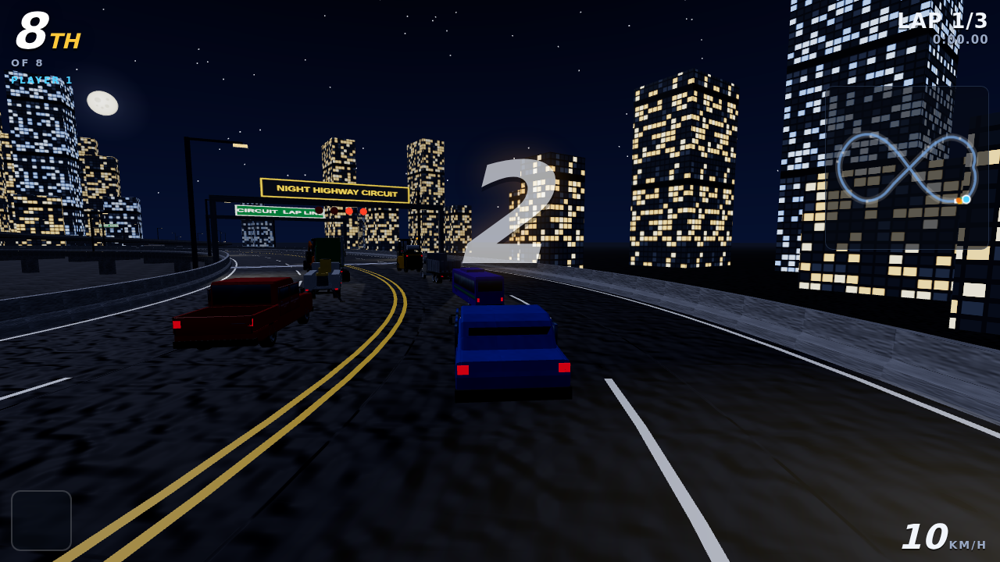 | 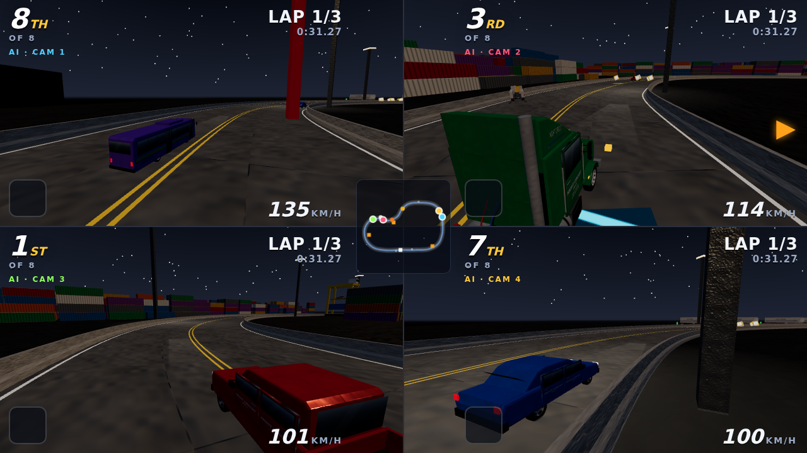 |
| 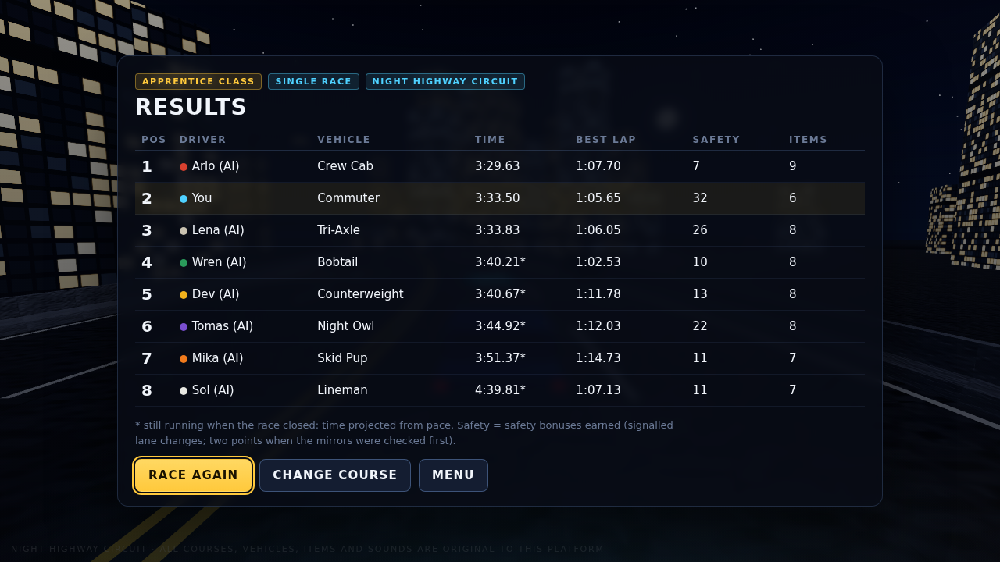 |  |
| 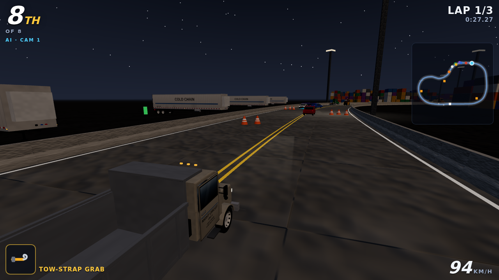 | 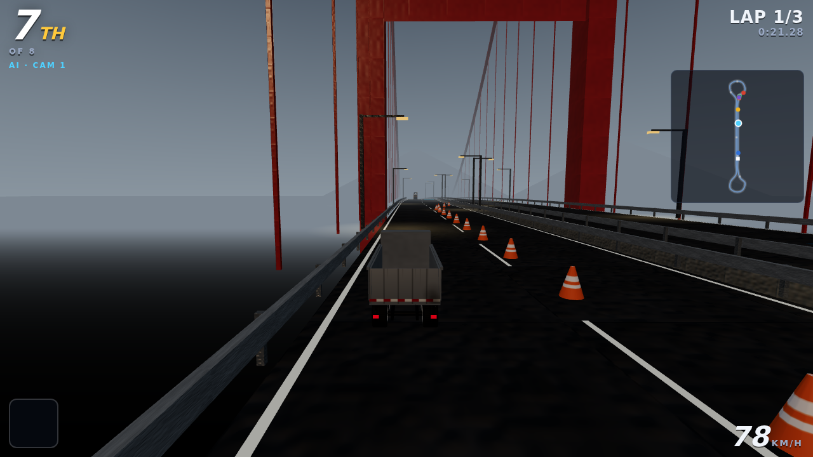 |
| 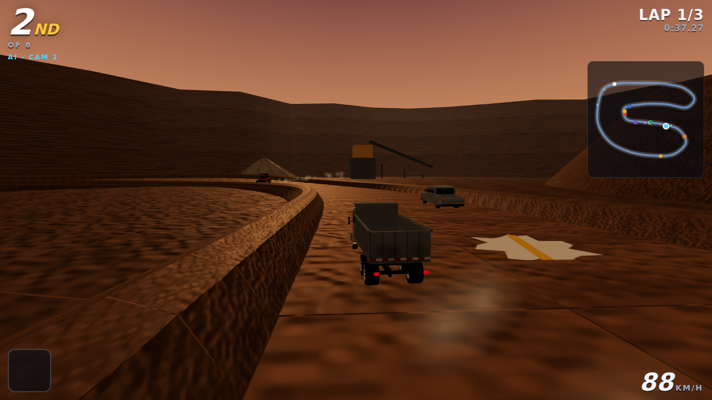 |  |

A 20-second clip of AI racing is at `screenshots/race/race-clip.webm`.

# The other Easter egg: Break Room Arcade

There is a second hidden page: a crew break room with three retro cabinets against the wall, each running an original 2D canvas game in the spirit of a classic arcade genre. Every sprite is chunky pixel art drawn in code, every sound and the backing loop are synthesised live with WebAudio, and each cabinet keeps its own high-score table in this browser. A CRT scanline overlay can be toggled on or off from the header.

## How to open it

Open `WebXR/arcade/index.html` directly from source, or `WebXR/dist/arcade.html` as a single bundled file (also present at `WebXR/arcade/dist/arcade.html`). It stands alone — it is not wired into the race's own menu or the homepage's key-sequence Easter egg, both of which belong to other parts of the platform, but its header links back to the training platform's homepage.

## The cabinets

| Cabinet | Genre | Players | What it is |
|---|---|---|---|
| **Spool Yard** | Climbing platformer | 1 | Climb ladders and girders up a steel frame while cable spools roll down off the loading ramps. Tie off at each level's anchor point for a bonus, then reach the crane cab at the top. Four boards, each with a tighter ladder layout and faster spools than the last. |
| **Crew Run** | Side-scrolling platformer | 1 | A hard-hatted apprentice runs a jobsite: jump the trenches, duck the swinging loads, stomp the hazard icons, and pick up PPE along the way. A foreman checks your PPE count at the end of each of three stages. |
| **Pallet Stacker** | Falling-block stacker | 1–2 (split screen) | Pallets of different shapes drop into the truck bed; complete a row to ship it. The load shifts if the stack leans too far to one side, and levels speed up. Two players get one independent board each, side by side. |

Each cabinet opens on a title card with its genre, controls and a "what this teaches" line, and every run ends on a game-over card with the run's score and, if it qualifies, an entry onto that cabinet's high-score table.

## What each one teaches

- **Spool Yard** — tie off before you climb: an anchored line turns a slip into a stop, not a fall.
- **Crew Run** — PPE only helps if you're still wearing it when you need it: pick it up, keep it on, get checked.
- **Pallet Stacker** — a leaning load is an unstable load: keep the stack square, or it comes down on its own schedule, not yours.

## Controls

Keyboard and gamepad both work on every cabinet; pad 1 is player 1 and pad 2 is player 2, read through `WebXR/shared/input.js` on the standard gamepad mapping.

| | Spool Yard | Crew Run | Pallet Stacker — P1 | Pallet Stacker — P2 |
|---|---|---|---|---|
| Move | ← → or A/D | — | A / D | ← / → |
| Climb / jump / rotate | ↑ ↓ or W/S (against a ladder) | ↑ / W / Space to jump | W to rotate | ↑ to rotate |
| Duck / soft drop | — | ↓ / S (hold under a swinging load) | S | ↓ |
| Hard drop | — | — | Space | Enter |
| Gamepad | Left stick or D-pad | A jumps, B ducks, D-pad down ducks | Left stick/D-pad move, A rotates, RT hard drops | (pad 2) same buttons |

Esc pauses any cabinet, and M mutes. The CRT scanline overlay toggle sits in the header and applies while a game is running.

## High scores

Every cabinet keeps its own top-eight table in this browser under one `localStorage` key, `break-room-arcade-v1`. A run that beats the lowest saved score prompts for three initials and is added to that cabinet's table; the menu, each title card and the game-over card all show it.

## Originality

Every sprite, sound, tune, level layout and name in this game is original to this platform. The three genres — a climbing platformer, a side-scrolling runner and a falling-block stacker — are generic arcade genres, not any specific existing game, and no other game's names, characters, sprites, level layouts, music or sounds appear here.

## Checks

`node tools/check_arcade.mjs` is part of `tools/check_all.mjs`. It checks:

- Each cabinet's engine runs a scripted 30-second session (1800 steps at 1/60 s) with no exception and no non-finite value anywhere in its state.
- Score never decreases and is never negative; level (board or stage) stays in range and never decreases; lives never go negative; stepping a finished game is a no-op.
- Pallet Stacker's two boards run independently in split screen, and a deliberately lopsided stack triggers a shift that moves a block without creating, losing or corrupting one.
- The high-score table round-trips through a stubbed `localStorage`, including ranking, the eight-row cap, and a corrupt value falling back to fresh, empty tables.
- All three cabinets are registered with a genre, a teaching line, controls text and a working engine, and the app is bundled and registered in `check_all`.

## Screenshots

| | |
|---|---|
| 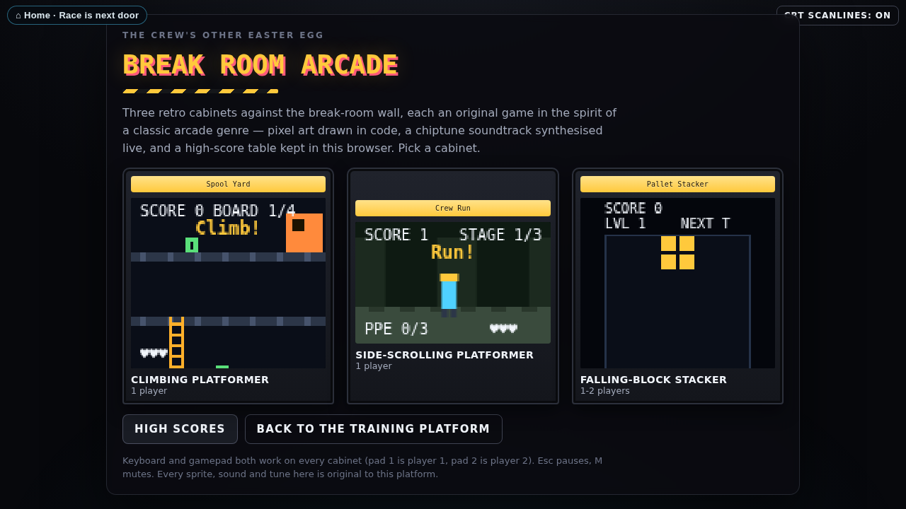 | 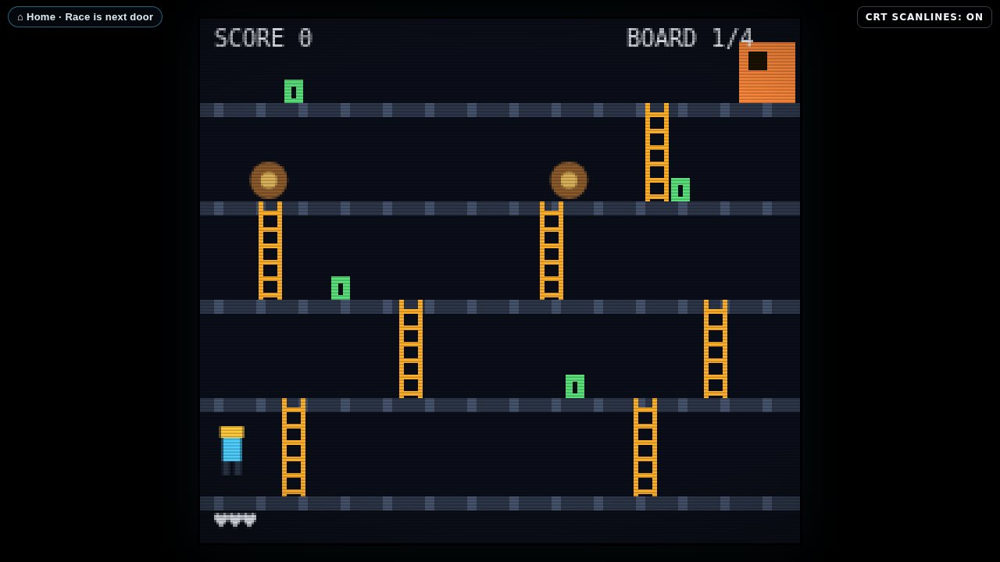 |
| 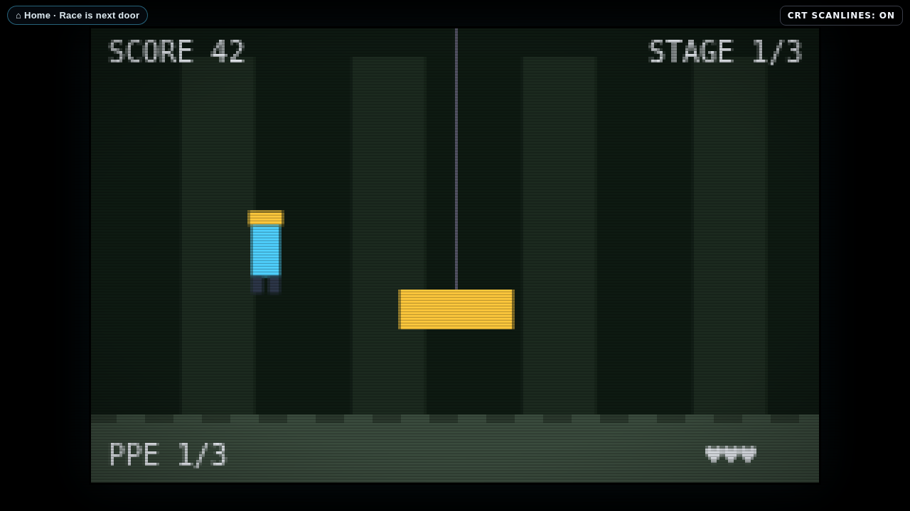 | 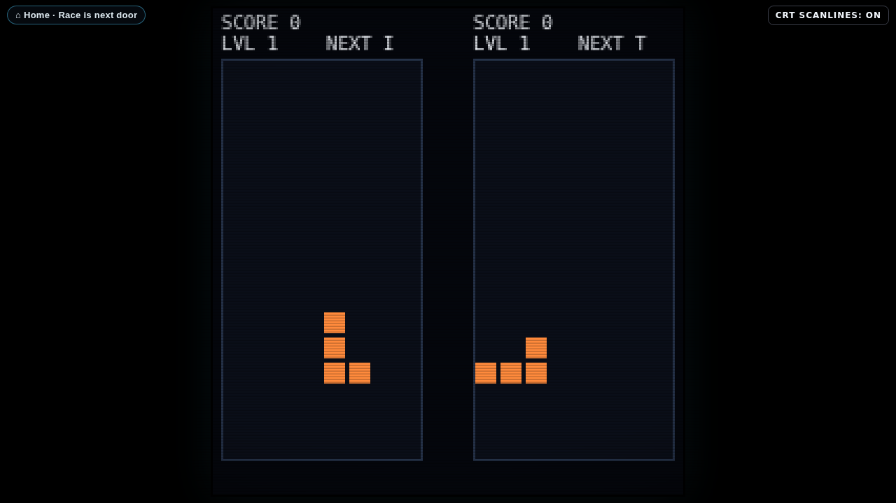 |

A 20-second clip of play is at `screenshots/arcade/arcade-clip.webm`.
