# The Easter eggs

The platform hides four of these now: an arcade racer, a hidden collectible
spread across the training stations, a quiz built from the standards
registry, and a set of unlockable paint schemes for the racer, earned by
finishing a programme's hardest level. All four are original, all say plainly
what they are, and none of them touches a station's steps or its scoring —
finding a hard hat, taking the quiz, and picking a livery are all off to the
side of the real training.

## Night Highway Circuit

The platform hides an arcade racer. You drive the vehicles the training stations already use (from `WebXR/shared/fleet.js` and `WebXR/shared/equipment.js`), shrunk to kart size, on ten original courses, plus a Battle Arena. It has drifting and mini boosts, boost pads, supply crates with construction-site items, three laps, a rolling-start countdown, a position and lap HUD, a minimap, a chequered finish and a results table. Every sound is synthesised in the browser.

The game is a joke, but it still teaches. **Signal and check your mirrors before a lane change, and you earn a small boost.** The AI drivers do it too, and the results table counts safety bonuses next to lap times.

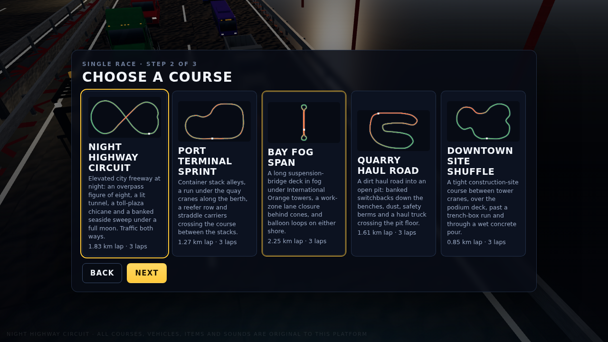

### How to open it

Any of these, from the homepage (`WebXR/index.html`, or `index.html` in the combined `WebXR/dist/` folder):

- Type the classic key sequence: **up up down down left right left right B A**. Keys typed into the search box do not count.
- Tap the **hard-hat glyph** at the bottom of the footer five times within three seconds.
- Add **`?egg=race`** to the homepage URL.

A one-line toast appears, then `race/index.html` opens (or `race.html` in the dist folder).

You can also open the page directly: `WebXR/race/index.html` from source, or `WebXR/dist/race.html` as a single bundled file. The bundle loads nothing from outside except the pinned three.js from cdnjs, which every page on the platform uses.

### Modes and levels

| Mode | What it is |
|---|---|
| Single race | Choose an engine class and a course. One to four players race split-screen on this machine, and AI drivers fill the grid of eight. |
| Grand Prix | All ten courses in order. Points go 10-8-6-5-4-3-2-1. There is a podium at the end. |
| Time trial | You race alone on the course with no traffic and no items, against a ghost of your best lap. |
| Two-tab race | Two tabs of the same browser race each other (see below). |
| Battle Arena | An enclosed construction-site pit. Items only, three hard-hat lives each, last one standing wins. Four local players or AI. |

Engine classes make up the difficulty ladder:

| Class | Speed | AI skill | Traffic | How to open it |
|---|---|---|---|---|
| Apprentice | ×0.86 | 70 | ×0.6 | Open from the start |
| Journey | ×1.00 | 86 | ×1.0 | Finish an Apprentice Grand Prix in the top three |
| Master | ×1.14 | 100 | ×1.4 | Finish a Journey Grand Prix in the top three |

A course-select toggle called **Mirror** sits above the course list: every course flipped left-right, corners the other way round. It opens the same way the classes do, one rung further up the same ladder — **finish a Master Grand Prix in the top three** — and it applies to Single race, Grand Prix and Time trial alike, on any course.

Unlocks, Grand Prix bests and time-trial ghosts are all saved in this browser under one `localStorage` key, `night-highway-circuit-v1`. A ghost is saved for each course and class (a mirrored course keeps its own ghost, under its own id). The results table carries a badge that shows the class and the mode, for example "JOURNEY CLASS · Grand Prix · race 2 of 10".

### The courses

| Course | What is on it |
|---|---|
| **Night Highway Circuit** | An elevated city freeway at night, laid out as a figure of eight. The lap climbs onto an overpass nine metres above its own lower carriageway and threads a lit tunnel through a tower podium. It sweeps along the seafront on a banked curve under a full moon and weaves a toll-plaza chicane between booths. Sedans and tractor-trailers drive in both directions: race-direction traffic on the right, oncoming traffic on the left. |
| **Port Terminal Sprint** | A container terminal at night. The course runs down the stack alleys and under the legs of the quay cranes along the berth, past a reefer row and a moored container ship. Straddle carriers cross the course between the stacks on their own cycle, and yard tractors run the terminal roads. |
| **Bay Fog Span** | A long suspension-bridge deck in evening fog, raced as a dog-bone: out on one carriageway and back on the other, with a balloon loop on each shore. The towers are painted International Orange. A work zone closes a lane behind a cone taper and an arrow board, with a bucket truck and its crew in the closure. The bridge is a generic one of its type, and no real bridge is named or copied. |
| **Quarry Haul Road** | A dirt haul road into an open pit at dusk. It drops down two banked switchbacks between the benches, crosses the pit floor past the crusher and the stockpiles, and climbs the long ramp back up. The road is edged with safety berms and there is dust in the air. A haul truck crosses the pit floor, and pickups and dump trucks use the road in both directions. |
| **Downtown Site Shuffle** | A tight lap of a construction site. It runs between two tower cranes, up onto a podium deck and down its ramp, past a trench-box run behind a barricade, and through a wet concrete pour, where grip is low. |
| **Beach Boardwalk Sprint** | A dusk boardwalk lap: up a ramp onto a pier that runs out over the sea on pillars, round the pier head and back, then a stretch of soft beach sand that saps your grip past the lifeguard tower, with gulls lifting off the rail as you pass. |
| **Cold Storage Run** | An ice-cold distribution warehouse at night: slick aisles, a forklift crossing the lane on its own cycle at each end, and near the back, a freezer door that opens and closes on a timer — wait for it, or clip it closed. |
| **Aurora Skyway** | A high, elevated transit viaduct through the neon towers at night: a banked sweep with the guard rail down on its outer edge for maintenance (mind the drop), and a chicane past a piling under repair where a gantry crane slides back and forth building the next span. |
| **Marsh Levee Loop** | A levee road around a restored wetland: the road dips toward the marsh floor, closed off by a tide gate that floods it on a timer, with egrets lifting off the reeds as you pass. |
| **Quarry Night Shift** | Quarry Haul Road run the other way round and worked after dark: down the long ramp that was the climb out, across the pit floor, and up both banked switchbacks under the light towers, with a haul truck crossing the pit floor and another crossing at each switchback. |

Each course is a data module under `WebXR/race/tracks/`. A module holds a closed spline of control points `[x, z, y, bank°]` and tables of zones, boost pads, item-box rows, hazards and scenery, all keyed by position along the spline. `WebXR/race/js/track.js` compiles the spline and applies the Mirror flip (`rcMirrorTrackDef`), and `WebXR/race/js/world.js` builds the scenery.

To add a course:

1. Write a new data module.
2. Import it in `WebXR/race/js/tracks.js`.
3. Add it to the `"race"` module list in `tools/bundle_webxr.py`.

`tools/check_race.mjs` holds the new course, and its mirrored twin, to the same checks as the others. Only a genuinely new kind of scenery needs new code in `world.js`.

## Battle Arena

An enclosed pit built from the props of a construction site: jersey barriers ring it, and shipping containers sit as cover in the middle. `WebXR/race/js/battle.js` is the whole mode — its own physics and AI (no track, no laps), and the arena's build and per-frame render, on the same vehicles and the same six items as the race. Bumping another car just bounces both apart: **items only** do damage. Each racer starts with three hard-hat lives; losing the last one is out. The last one standing wins. Four local players share the pit with AI filling the rest, and it opens from the main menu into the usual driver-and-vehicle screen — no class or course to choose, since the arena is fixed.

### The racers

Eight vehicles, each with a stat card from 1 to 5 in which the three stats sum to ten:

| Racer | Vehicle | Speed | Handling | Weight |
|---|---|---|---|---|
| Commuter | sedan | 4 | 4 | 2 |
| Crew Cab | pickup | 4 | 3 | 3 |
| Bobtail | semi tractor (no trailer) | 5 | 1 | 4 |
| Counterweight | forklift | 2 | 4 | 4 |
| Skid Pup | skid steer | 2 | 5 | 3 |
| Tri-Axle | dump truck | 3 | 2 | 5 |
| Lineman | bucket truck | 3 | 3 | 4 |
| Night Owl | transit bus | 4 | 1 | 5 |

### Items

Supply crates on the course (or scattered round the Battle Arena) hand out one item at a time. Racers near the front tend to get defensive items and racers near the back tend to get catch-up items.

| Item | What it does |
|---|---|
| Cone Drop | Drops three traffic cones behind you. Anyone who clips one spins. The cones last 18 seconds. |
| Wet-Paint Slick | Leaves a puddle of line paint with no grip. It lasts 14 seconds. |
| Hard-Hat Shield | Eight seconds of protection that stops the next hit. |
| Air-Horn Shockwave | Pushes aside and slows every racer within 16 m, and makes nearby traffic swerve. |
| Tow-Strap Grab | Hooks the racer ahead, reels you in and slingshots you past. |
| Flatbed Boost | A long, strong boost. |

### Controls

| | Drive | Drift | Item | Mirrors (look back) | Signal left / right |
|---|---|---|---|---|---|
| Player 1 | W A S D | Space | F | R | Q / E |
| Player 2 | arrow keys | Right Shift | Enter | / | , / . |
| Player 3 | I J K L | H | Y | N | U / O |
| Player 4 | Numpad 8 4 5 6 | Numpad 0 | Numpad Enter | Numpad . | Numpad 7 / 9 |

- **Solo play.** A single player can drive with either WASD or the arrow keys.
- **Gamepads.** These are read through `WebXR/shared/input.js` on the standard mapping: pad 1 is player 1, pad 2 is player 2, and so on. Steer with the left stick. Accelerate with RT or A, and brake or reverse with LT or B. Drift is RB, item is X, mirrors is LB, the D-pad left and right signal, and Start pauses.
- **Drifting.** Hold drift while you steer into a bend, then release it. A longer drift gives a bigger mini boost.
- **Rolling start.** Hold throttle only in the last moment of the countdown for a perfect start.
- **Other keys.** Esc pauses and M mutes.
- **Battle Arena.** The same drive, item and lookback keys; there is no course to lap, so drift and signal have nothing to do there.

### Multiplayer, honestly

This is **local multiplayer only**, and there is **no server**:

- **Split-screen.** Up to four players share one screen on one machine. Each uses their own keyboard cluster or gamepad, and AI drivers fill the rest of the grid of eight (four in the Battle Arena).
- **Two-tab race.** Two tabs of the **same browser on the same machine** link over the browser's `BroadcastChannel`. The hosting tab runs the race and the AI. The joining tab sends its controls and draws the snapshots it gets back. Nothing leaves the machine, and it is not online play.

## Track-side signage

Every course carries a couple of trackside signs in the union wordmarks style the rest of the platform uses (`WebXR/shared/signage.js`'s `unionSign`, typeset from `tools/unions.json` — never a logo): a fictional but real training-fund wordmark picked for the course's own trade, the same signage a station on the platform stands beside its pad. Night Highway Circuit and Quarry Night Shift stand behind the Operating Engineers; Port Terminal Sprint behind the Longshore and Warehouse Union; Bay Fog Span behind the Ironworkers; Downtown Site Shuffle and Beach Boardwalk Sprint behind the Carpenters; Cold Storage Run and Quarry Night Shift's haul behind the Teamsters; Aurora Skyway behind the Transit Union; Marsh Levee Loop behind the Laborers'.

## Originality

Every course layout, vehicle livery, item, name, glyph, colour and sound in this game is original to this platform:

- The vehicles are the platform's own procedural fleet builders.
- The item glyphs are drawn inline in SVG for this game.
- The engine, effects and backing loop are synthesised with WebAudio at run time.

No other game's names, characters, items, logos, music, sounds or course geometry are used or imitated. The places are generic: no real highway, port, bridge, quarry, warehouse, pier, viaduct or wetland is depicted. Quarry Night Shift is this platform's own Quarry Haul Road run the other way and lit for a night crew — not another game's track.

### Checks

`node tools/check_race.mjs` is part of `tools/check_all.mjs`. It checks each course, its mirrored twin and the game as a whole:

- **Every course:**
  - The spline closes smoothly and never crosses itself at the same level.
  - There are at least six boost pads and eight item boxes, all on the road.
  - No hazard — traffic, a crossing vehicle, a booth, a cone, a trench box, a slick, a gate or a tide gate's flood zone — spawns inside the start grid.
  - An AI-only race at a fast time step runs three laps with sound lap and position logic, and never produces a NaN.
  - The scene builds with no more than 2,500 meshes before merging.
- **Mirror class:** every course compiles flipped, keeping its point count, its pads and boxes on the road, and a clean closure; nothing spawns in the mirrored grid either.
- **Battle Arena:** an AI-only fight, driven headless the same way a race is, always ends with exactly one survivor within a generous time cap, places come out as a clean 1..N, and the arena's own scene stays under the 2,500-mesh ceiling.
- **The game as a whole:**
  - All six items fire, dropped items expire, and the hard hat blocks a hit.
  - The safety bonus pays out, and pays double when the mirrors were checked.
  - The engine-class unlock rule holds, and so does the Mirror unlock rule (a top-three Master Grand Prix, nothing else).
  - The save, ghosts and two-tab snapshots round-trip.
  - The page is bundled and linked from the homepage.

The checker removes its own scratch folder on exit.

## Screenshots

| | |
|---|---|
| 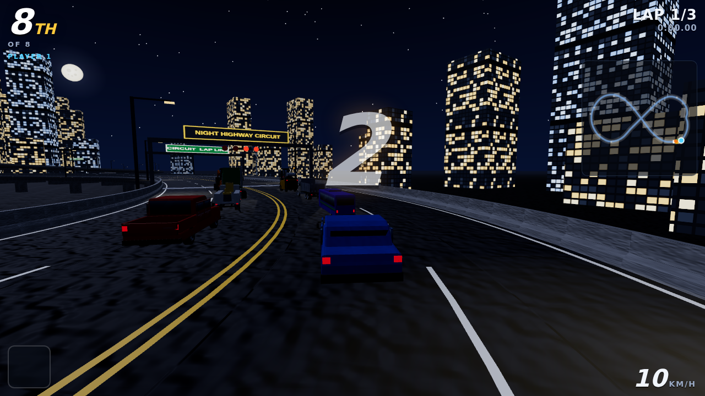 | 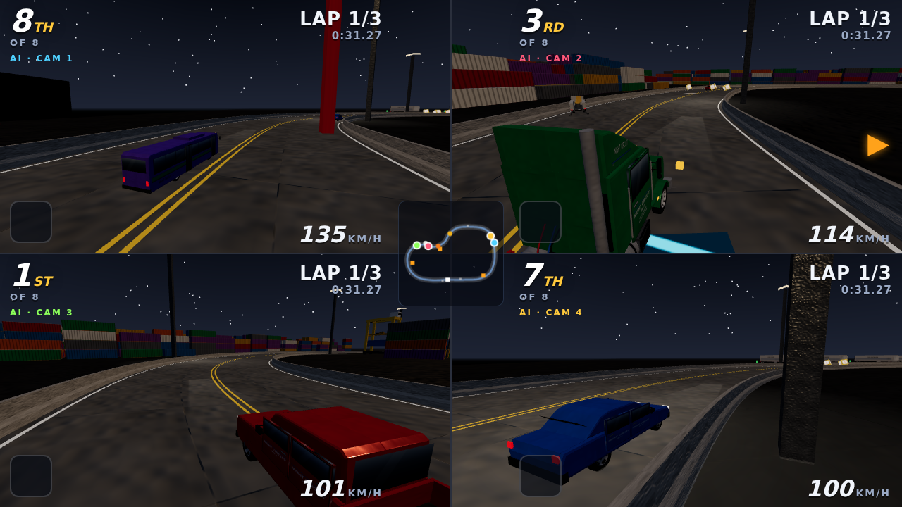 |
| 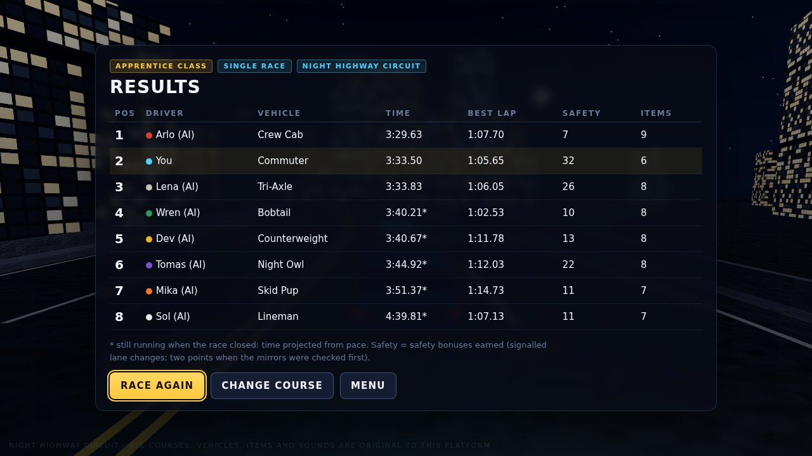 |  |
| 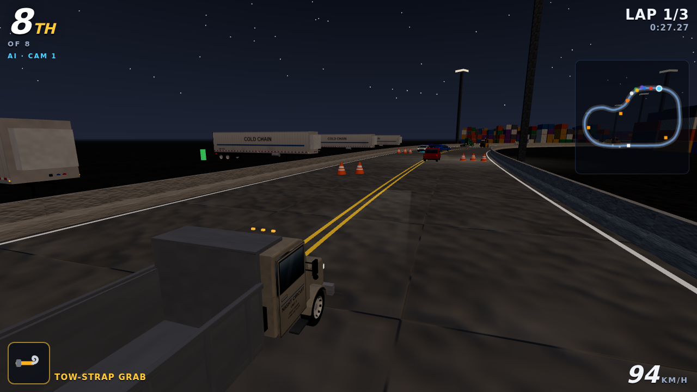 | 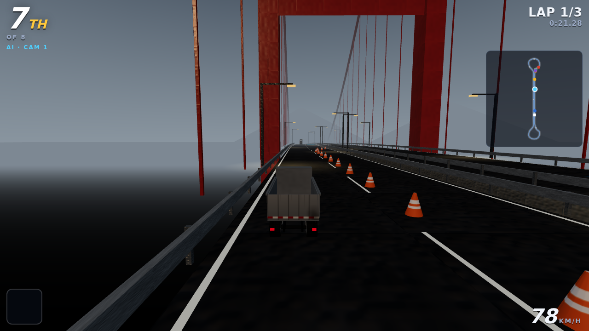 |
| 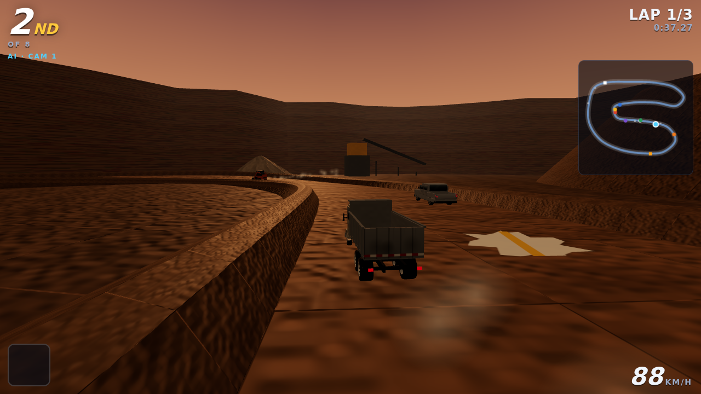 |  |
| 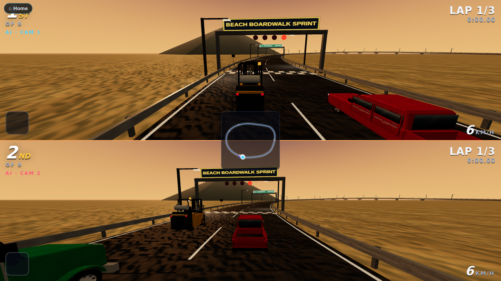 | 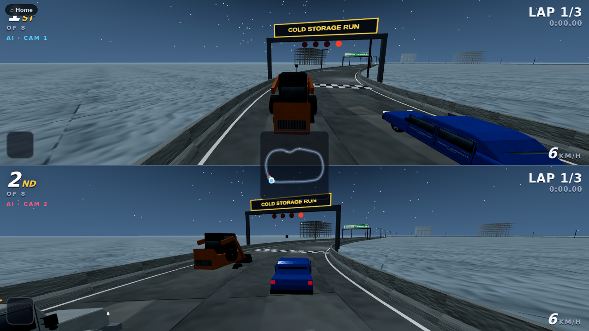 |
| 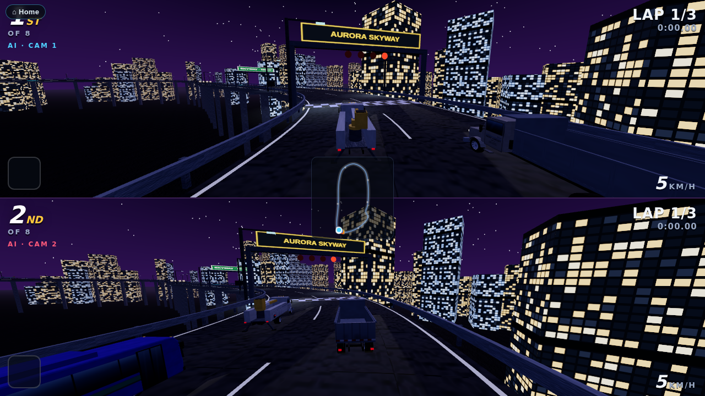 | 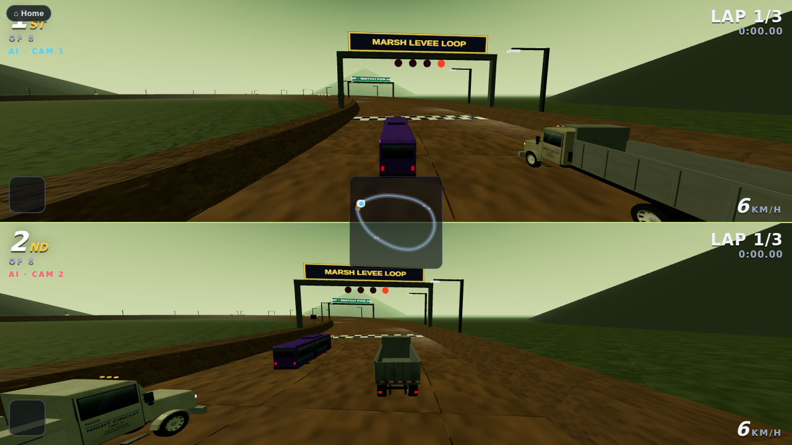 |
| 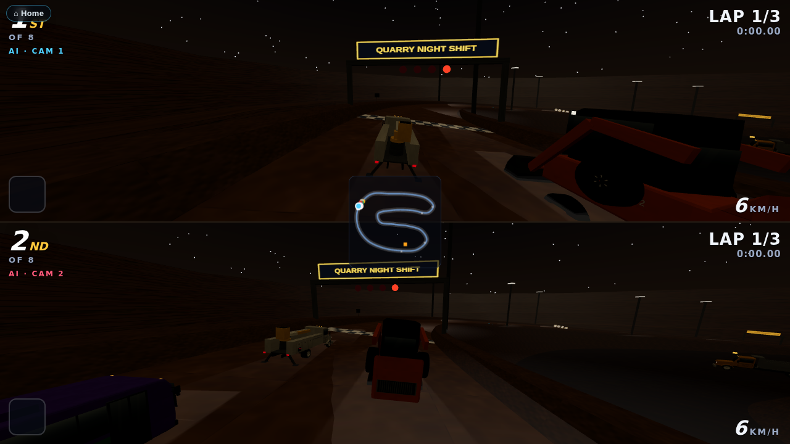 | 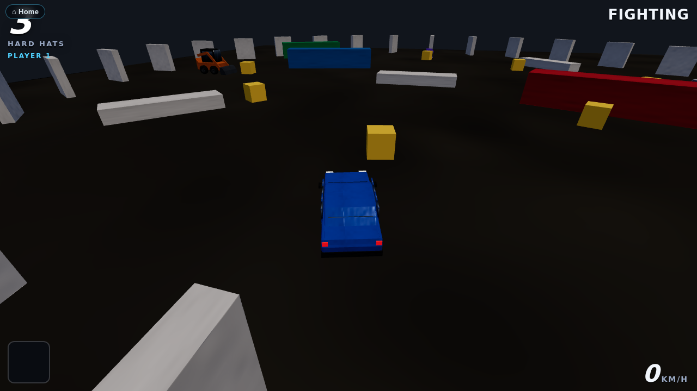 |
| 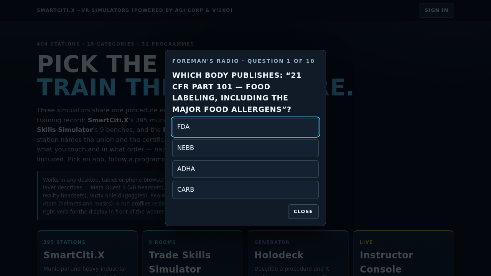 | 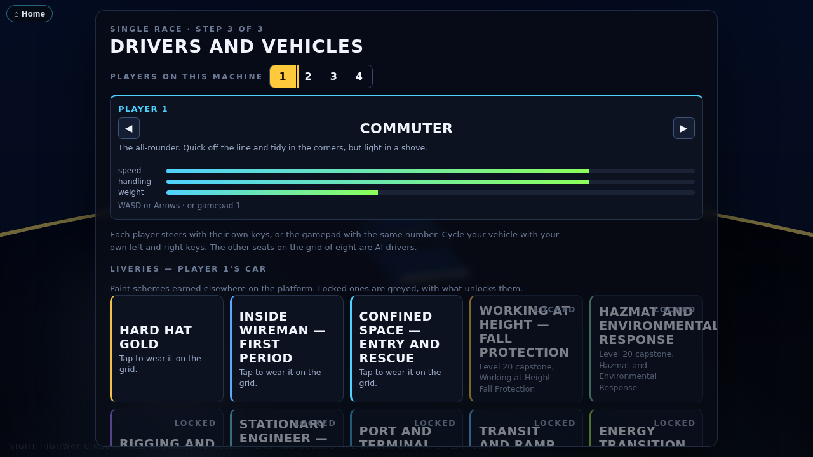 |

A 20-second clip of AI racing is at `screenshots/race/race-clip.webm`; a 20-second clip of AI racing on Aurora Skyway is at `screenshots/race/aurora-clip.webm`.
A 20-second clip of AI racing is at `screenshots/race/race-clip.webm`.

# The other Easter egg: Break Room Arcade

There is a second hidden page: a crew break room with four retro cabinets against the wall, each running an original 2D canvas game in the spirit of a classic arcade genre. Every sprite is chunky pixel art drawn in code, every sound and the backing loop are synthesised live with WebAudio, and each cabinet keeps its own high-score table in this browser. A CRT scanline overlay can be toggled on or off from the header.

## How to open it

Open `WebXR/arcade/index.html` directly from source, or `WebXR/dist/arcade.html` as a single bundled file (also present at `WebXR/arcade/dist/arcade.html`). It stands alone — it is not wired into the race's own menu or the homepage's key-sequence Easter egg, both of which belong to other parts of the platform, but its header links back to the training platform's homepage.

## The cabinets

<details><summary>Spoiler — the four cabinets and what each one is</summary>

| Cabinet | Genre | Players | What it is |
|---|---|---|---|
| **Spool Yard** | Climbing platformer | 1 | Climb ladders and girders up a steel frame while cable spools roll down off the loading ramps. Tie off at each level's anchor point for a bonus, then reach the crane cab at the top. Four boards, each with a tighter ladder layout and faster spools than the last. |
| **Crew Run** | Side-scrolling platformer | 1 | A hard-hatted apprentice runs a jobsite: jump the trenches, duck the swinging loads, stomp the hazard icons, and pick up PPE along the way. A foreman checks your PPE count at the end of each of three stages. |
| **Pallet Stacker** | Falling-block stacker | 1–2 (split screen) | Pallets of different shapes drop into the truck bed; complete a row to ship it. The load shifts if the stack leans too far to one side, and levels speed up. Two players get one independent board each, side by side. |
| **Forklift Aisle** | Lane-crossing dodger | 1 | Cross a warehouse aisle one marked lane at a time, from the marshalling pad to the shipping dock. Some lanes sweep a forklift or pallet jack back and forth across the aisle; a few are painted, marked crossings with their own stop/go beacon — the whole lane closes while it's red. Grab the hi-vis kit before the dock. Three boards, tighter crossings each time, and every round is capped at a minute. Plays by keyboard, gamepad, or an on-screen d-pad on a touch screen. |

Each cabinet opens on a title card with its genre, controls and a "what this teaches" line, and every run ends on a game-over card with the run's score and, if it qualifies, an entry onto that cabinet's high-score table.

</details>

## What each one teaches

<details><summary>Spoiler — the real habit behind each cabinet</summary>

- **Spool Yard** — tie off before you climb: an anchored line turns a slip into a stop, not a fall.
- **Crew Run** — PPE only helps if you're still wearing it when you need it: pick it up, keep it on, get checked.
- **Pallet Stacker** — a leaning load is an unstable load: keep the stack square, or it comes down on its own schedule, not yours.
- **Forklift Aisle** — a marked aisle crossing gets right-of-way for a reason: wait for the light, keep your hi-vis on, and the operator can actually see you coming.

</details>

## Controls

Keyboard and gamepad both work on every cabinet; pad 1 is player 1 and pad 2 is player 2, read through `WebXR/shared/input.js` on the standard gamepad mapping. Forklift Aisle also plays on a touch screen: an on-screen d-pad (up/down/left/right) appears automatically on a coarse-pointer device and drives the very same keys the keyboard does.

| | Spool Yard | Crew Run | Pallet Stacker — P1 | Pallet Stacker — P2 | Forklift Aisle |
|---|---|---|---|---|---|
| Move | ← → or A/D | — | A / D | ← / → | ← / → or A/D, or the touch d-pad |
| Climb / jump / rotate / cross | ↑ ↓ or W/S (against a ladder) | ↑ / W / Space to jump | W to rotate | ↑ to rotate | ↑ or W to cross a lane |
| Duck / soft drop / step back | — | ↓ / S (hold under a swinging load) | S | ↓ | ↓ or S to step back a lane |
| Hard drop | — | — | Space | Enter | — |
| Gamepad | Left stick or D-pad | A jumps, B ducks, D-pad down ducks | Left stick/D-pad move, A rotates, RT hard drops | (pad 2) same buttons | Left stick or D-pad |

Esc pauses any cabinet, and M mutes. The CRT scanline overlay toggle sits in the header and applies while a game is running.

## High scores

Every cabinet keeps its own top-eight table in this browser under one `localStorage` key, `break-room-arcade-v1`. A run that beats the lowest saved score prompts for three initials and is added to that cabinet's table; the menu, each title card and the game-over card all show it.

## Originality

Every sprite, sound, tune, level layout and name in this game is original to this platform. The four genres — a climbing platformer, a side-scrolling runner, a falling-block stacker and a lane-crossing dodger — are generic arcade genres, not any specific existing game, and no other game's names, characters, sprites, level layouts, music or sounds appear here.

## Checks

`node tools/check_arcade.mjs` is part of `tools/check_all.mjs`. It checks:

- Each cabinet's engine runs a scripted 30-second session (1800 steps at 1/60 s) with no exception and no non-finite value anywhere in its state.
- Score never decreases and is never negative; level (board or stage) stays in range and never decreases; lives never go negative; stepping a finished game is a no-op.
- Pallet Stacker's two boards run independently in split screen, and a deliberately lopsided stack triggers a shift that moves a block without creating, losing or corrupting one.
- Forklift Aisle's round is capped at 60 seconds; a sweep lane blocks at most one aisle slot at a time, and a marked crossing lane is observed both open and closed over several beacon cycles.
- The high-score table round-trips through a stubbed `localStorage`, including ranking, the eight-row cap, and a corrupt value falling back to fresh, empty tables.
- All four cabinets are registered with a genre, a teaching line, controls text and a working engine, Forklift Aisle declares touch support and the app carries the on-screen d-pad, and the app is bundled and registered in `check_all`.

## Screenshots

| | |
|---|---|
| 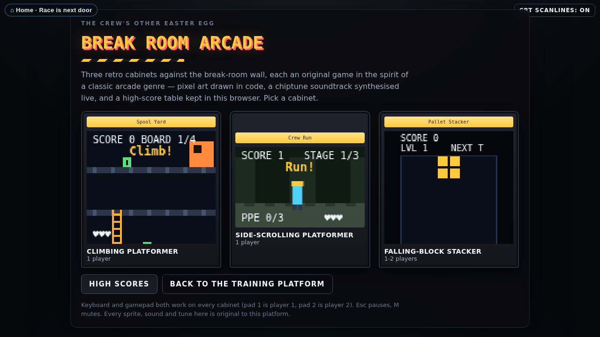 | 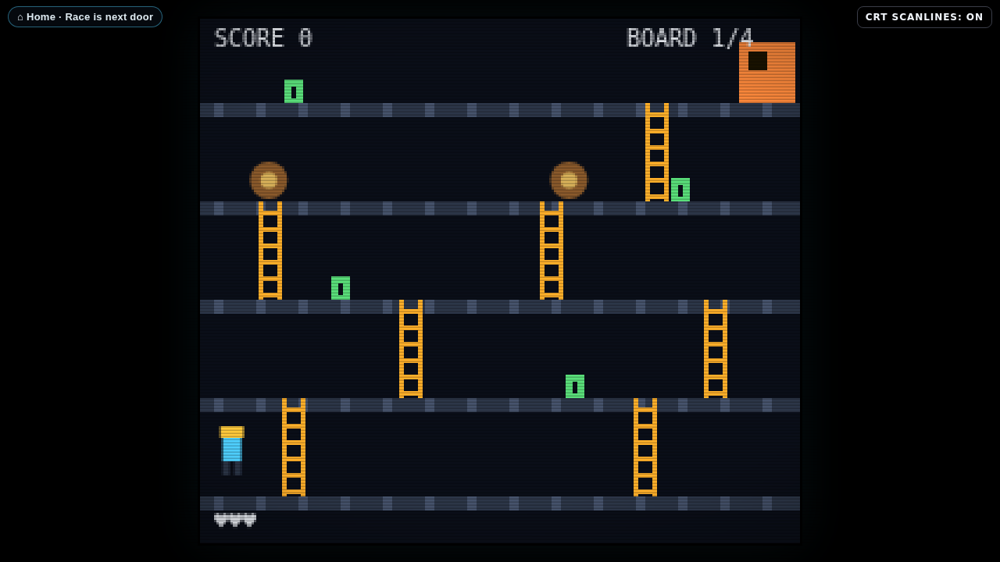 |
| 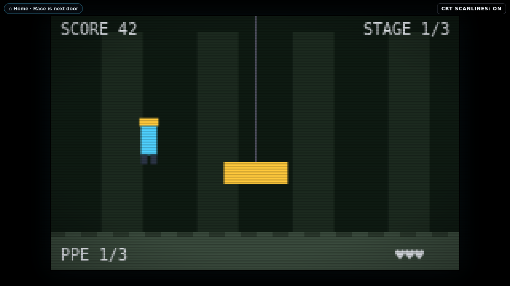 | 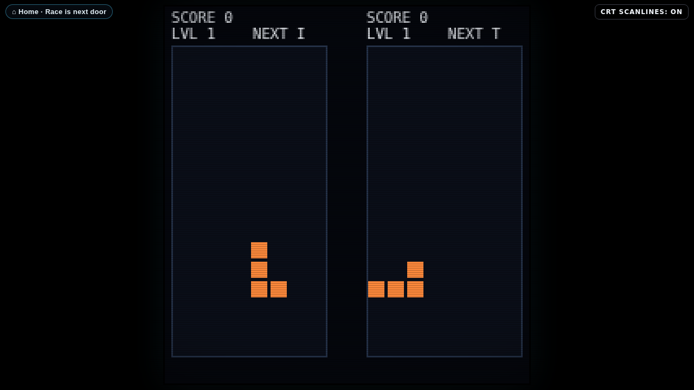 |

A 20-second clip of play is at `screenshots/arcade/arcade-clip.webm`.
## Hard Hat Hunt

A small golden hard hat is hidden in fourteen training stations, chosen
across programmes, both simulators and — since the open-range district and
the bay-underwater dive stations landed — outdoors and underwater too. Click
it and it is found — nothing about the station's own procedure changes, and
finding one is never scored as a step or a mistake.


### Where they are

| Station | App | Programme |
|---|---|---|
| Cooling Tower | SmartCiti.X | Building Systems & Facilities |
| Sampling Well | SmartCiti.X | Water & Environmental |
| Stage Load-In and Truss Rigging | SmartCiti.X | Live Events Production |
| Tide Gate | SmartCiti.X | Bay restoration |
| Mast Climber | SmartCiti.X | Working at Height — Fall Protection |
| Level B Entry and SCBA Change-Out | SmartCiti.X | Hazmat and Environmental Response |
| Rebounding and Boxing Out | SmartCiti.X | Basketball Fundamentals |
| Unit Turnover | SmartCiti.X | Property Management |
| Restorative Justice Circle Facilitation | SmartCiti.X | Civic Leadership and Emotional Intelligence |
| Patient Intake Screening | SmartCiti.X | Dental / outbreak-response programmes |
| Welding | Trade Skills Simulator | Builders and trades |
| Plumbing | Trade Skills Simulator | Builders and trades |
| Solar Farm Tracker Row Maintenance | SmartCiti.X | Energy Transition — open-range district |
| Underwater Debris Survey & Mapping | SmartCiti.X | SF Bay Restoration & Cleanup — bay-underwater district |

### How it is built

Every hard hat is planted by one shared helper, `WebXR/shared/eggs.js`, which
a station calls exactly once from its own `build(root)`:

```js
plantHardHat(root, THREE, "cooling-tower", [2.6, 1.15, -2.6]);
```

That is the whole integration — one import and one call, nothing else in the
fourteen stations changes. The helper does everything else:

- **It never touches the station's interaction system.** A station's real
  controls are registered with `shared/kit.js`'s `markInteractive()` and
  raycast against `state.selectables`, which feeds `Session.select()` — the
  scoring engine, where an id it does not expect counts as a wrong answer.
  The hard hat is never added to either list. Instead, the helper raycasts
  for itself, reading the same read-only camera each app already exposes for
  its own live tests (`window.__smartcityTest.camera()`, `__tradesTest`,
  `__holodeckTest`). A find can never touch a step or a score.
- **Finding one is idempotent and saved.** A find is recorded in this
  browser's `localStorage`, under the key `vr-training-hardhats-v1`, as the
  list of station ids found so far. Finding the same hat twice changes
  nothing.
- **The homepage counts them.** The footer shows "hard hats found: n/14"
  (`tools/gen_home.mjs` reads the count from `shared/eggs.js`'s own
  `HARD_HAT_TOTAL` rather than retyping it), read from the same key when the
  page loads.
- **Finding all fourteen unlocks a livery in the race**, "Hard Hat Gold" — see
  Capstone skins below for how liveries work in the garage.
- **Placement follows the same reachability rule as every other control.**
  `tools/check_layout.mjs` already holds every station's real interactive
  targets to one rule: inside the roam circle (SmartCiti.X) or the room
  (Trade Skills) a learner can walk to, plus a reach's worth of stretch, and
  never below the floor slack a pit or a vault is allowed. The hard hat is
  outside the interaction system `check_layout.mjs` itself audits, so
  `tools/check_eggs.mjs` holds it to the identical numbers on its own —
  including the two hosts on the open-range district and the bay-underwater
  district, where "visible" and "reachable" are the same fact: the roam
  circle is exactly the volume the app's own camera keeps a learner inside,
  outdoors or underwater alike.

### Checks

`node tools/check_eggs.mjs`, part of `tools/check_all.mjs`, holds this to:

- All fourteen host files exist, each imports `plantHardHat` from
  `shared/eggs.js` and calls it exactly once, under a distinct id.
- The hosts land in more than one app and more than one programme.
- Every planted hat resolves to a real mesh inside the reachable, visible
  volume `check_layout.mjs` already defines for that station — the roam
  circle (or room) plus a reach's worth of stretch, and no lower than the
  floor slack.
- A find, a repeated find, and completing all fourteen round-trip through a
  fake `localStorage` exactly as described above.

## Foreman's Radio

Type **`radio`** anywhere on the homepage outside the search box (the same
rule the racer's key sequence uses) and a retro handheld-radio card opens
with a ten-question quiz. It is a quiz, honestly — not a real radio, and
passing it earns nothing but a better line in the score card.


### Where the questions come from

Every question is generated from `tools/standards.json` — the one registry of
standards, codes and union training programmes this platform teaches
against — and nothing else. `tools/gen_radio_quiz.mjs` lifts the `id`,
`body`, `title` and `scope` of every entry into `WebXR/shared/radio-quiz-data.js`
(regenerated whenever `node tools/gen_catalog.mjs` runs); no `source` or
`cites` field is carried over, because a quiz question's own text and answer
are never built on anything but the body that publishes a standard and the
standard's own title — `scope` rides along only so the pool can be narrowed to
one catalog category, never so a question can state a fact `scope` itself
never says. `WebXR/shared/radio-quiz.js` then:

1. Picks ten standards at random, no two alike — or, when a `category` is
   given, ten from the standards in scope for that category alone (a
   programme's own trade), honestly answered with fewer questions when fewer
   than ten are in scope, rather than padding the rest from somewhere else.
2. Asks "which body publishes …?", quoting the standard's own CFR-style
   clause when its title states one plainly (`29 CFR 1910.146`), or the
   standard's full title otherwise.
3. Offers four choices: the real publishing body, plus three distractor
   bodies drawn from the registry's own list — never an invented one.

A score card follows the last question, and a best score is kept in this
browser under `vr-training-radio-quiz-v1`.

Every programme in `WebXR/smartcity/js/curricula.js` is deep enough in its own
category (the trade `guides` and stations already stand behind) to draw a full
six-question quiz honestly this way — including the five newest ones, railroad
crafts, heavy equipment operators, plumbers and pipefitters, SF Bay Restoration
& Cleanup's maritime and underwater block, and Basketball Fundamentals, plus
the four open-range stations, each in its own station's own category. See the
coverage table below.

### Checks

`node tools/check_eggs.mjs` holds this to:

- `shared/radio-quiz-data.js` matches `tools/standards.json` exactly, `scope`
  included (stale data fails the build).
- Across several seeds, `buildQuiz()` returns ten questions, all built from
  distinct standards, each with exactly four distinct choices and one correct
  answer that matches the standard's real body — and the question text is
  built only from that standard's own title or the clause inside it, never an
  invented fact.
- Every recently-landed programme's own catalog category resolves to at least
  six distinct, honestly in-scope questions when `buildQuiz()` is asked for
  that category.
- A best score round-trips through a fake `localStorage`, and a worse run
  never overwrites it.
- The homepage carries the `radio` key sequence, the hard-hat counter, and
  still carries the racer's own key sequence untouched.

## Capstone skins

Finishing a programme's level-20 capstone — the hardest run of its ladder,
under the mastery rule with no coaching (`shared/ladder.js`'s
`LADDER_LEVELS`) — unlocks a livery in the race, named and coloured after
that programme. The garage's vehicle screen has a **Liveries** grid, under
player 1's car: one row per programme with a ladder, plus Hard Hat Gold.
Locked rows are greyed, each naming what unlocks it.


### The unlock rule, honestly

A station attempt played as part of a level run carries a `.ladder` tag —
`{ programme, level, run, task }` — set by `shared/ladder.js`'s `levelTag()`
and written onto the attempt by `TrainingRecords.record()` (see
`WebXR/shared/records.js` and `WebXR/smartcity/js/app.js`). A livery unlocks
the moment any record in this browser carries `ladder.level === 20` for that
programme and a passing grade (`records.js`'s `passed()`: two or more stars,
no unsafe action). That is a lighter bar than the ladder's own "level
passed" rule, which needs every task in one run of the level at mastery
(`shared/ladder.js`'s `levelResult()`) — a livery is a smaller thing than the
level badge, and this doc says so rather than overclaiming it.

The rule itself lives in `WebXR/race/js/liveries.js`, pure and independent of
three.js and the DOM, and the list of programmes comes from
`WebXR/race/js/capstone-liveries.js`, generated by
`tools/gen_capstone_liveries.mjs` from `WebXR/smartcity/js/ladders.js` — so a
programme can never be missing a livery, or keep one after its ladder is
gone.

An unlocked livery repaints player 1's hull and fleet name — in the garage
preview, on the grid, and on the podium — with no change to the vehicle's
stats.

### Checks

`node tools/check_eggs.mjs` holds this to:

- `race/js/capstone-liveries.js` matches the ladders exactly.
- A livery unlocks only for a passed, level-20 attempt tagged with its own
  programme — not level 19, not an unpassed attempt, and not another
  programme's capstone.
- Hard Hat Gold unlocks only once all twelve hard hats are found.
- Every capstone livery is named after its own programme.
## Inside the apps

Six smaller, honest Easter eggs live inside the training apps themselves,
built in `WebXR/shared/eggs-app.js` and mounted with one import and one
mount call in each app's own `js/app.js`. None of them touches a station's
steps, its scoring, or the auditable records in `shared/records.js` — every
one of them keeps its own small `localStorage` key, separate from the real
training record, and says so wherever it shows a learner anything.

### 1. Photo Mode (SmartCiti.X)

Press **P** inside any station (not at the hub) and the run pauses, the
current frame freezes, and the platform composites its own screenshot: a
hard-hat-yellow frame with a hazard-stripe corner, the station's name, and
the union abbreviation its own sign already carries (read straight off
`stage.signage.plan.unionId`, the same union the pad's sign shows — nothing
new is looked up). A small card offers **Download PNG**; closing it (or
pressing Escape) resumes the run exactly where it paused. It is entirely the
platform's own WebGL canvas, read back with `toDataURL()` — nothing loads,
tracks or is sent anywhere.

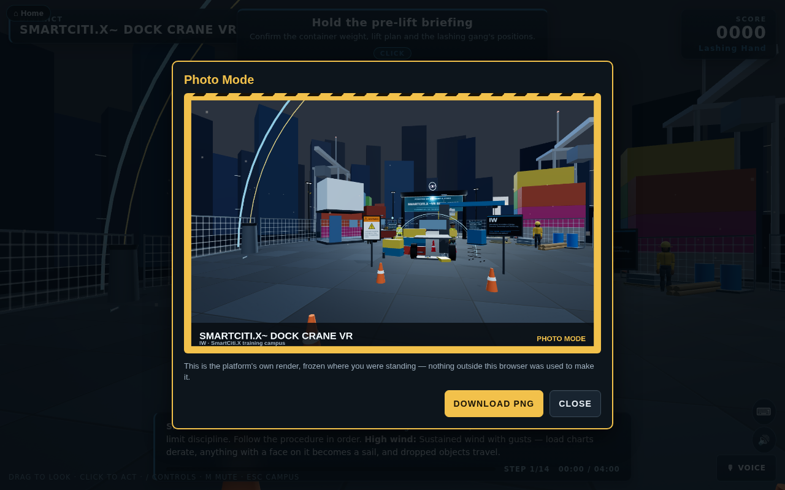

### 2. The Golden Wrench (SmartCiti.X)

Once a day, one station on the roster is picked (seeded from the local
date, so it holds all day and changes at midnight) and, if that station
happens to have a recognisable hand tool among its clickable props (a
wrench, a drill, a gauge, a meter, a radio — anything a real toolkit prop
would be), exactly one of them turns gold for the day. Clicking it plays a
short four-note jingle, synthesised in the browser (WebAudio, no sample),
and — the first time that day — stamps a "found the golden wrench" line
into its own `smartcitix-egg-golden-wrench-v1` localStorage log, never into
`TrainingRecords`. A station that has no tool that day simply has no golden
wrench that day; the platform never invents one where there is nothing to
paint gold.

### 3. Crane Claw (SmartCiti.X)

Any station in the **Maritime & Ports** district gets a small hook prop
added beside the dock's own gantry crane. Click it three times (each click
plays a metallic clunk) and a tiny claw-machine minigame opens over a canvas:
move the claw with **Left/Right**, drop it with **Space**, and try to land it
on a lane holding one of the toolkit's own tool names. It is purely for fun —
a best score is kept in `smartcitix-egg-claw-best-v1` — and a miss on the
hook lets the normal click straight through to the station underneath it.

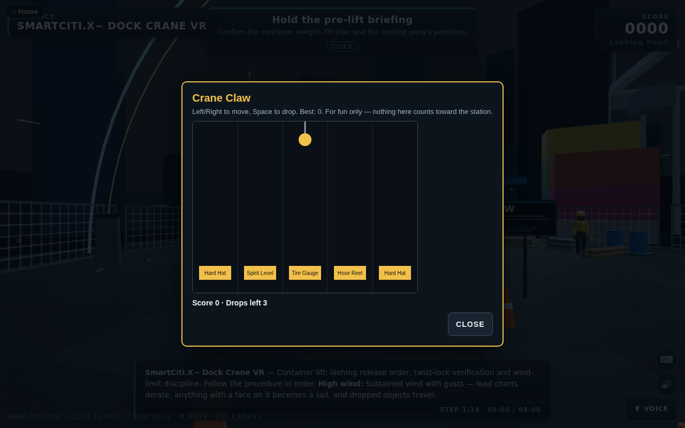

### 4. The Holodeck arcade cabinet

A small retro cabinet stands in the Holodeck scene at all times (it survives
every hole and every generated procedure, since it lives in `worldRoot`
rather than inside either). Clicking it opens **Scaffold Climber**: a 2D
canvas game where you dodge tools dropped from above and tie off at every
level you climb (press **T** in the tie-off window) for a bonus — the joke
being that the fastest way up a scaffold is never the one that skips tying
off. A best score is kept in `holodeck-egg-scaffold-best-v1`.


### 5. Toolbox Talk Bingo (the instructor console)

A small **🎯 Toolbox Talk Bingo** button floats in the corner of the
instructor console. It builds a real 5×5 bingo card — one FREE centre square,
24 hazard-named cells — filled in three passes, roster hazards first: the
hazards this class's own live sessions have actually named; then, for
whichever stations the roster is actually on, that station's own real hazard
vocabulary (`WebXR/shared/bingo-hazards-data.js`, generated by
`tools/gen_bingo_hazards.mjs` straight off each station module's own
`hazards: {}` object — never invented, never the hazard's own long sentence,
just its id title-cased into a short label); and only then the generic
toolbox-talk categories, for whatever a quiet room and a newer, thin-hazard
programme still leave empty. It opens in a fresh, printable window and says
plainly, on the card itself, that it is **"for the room, not for the
record"**: nothing about it is saved to any learner's training record, and the
console never reads anything from a simulator to build it — only the
generated label pool, which is static data with no simulation behind it.

Because that label pool is built from every station in every programme in
`WebXR/smartcity/js/curricula.js`, a class on any programme — including the
five newest — gets real, in-trade cells rather than only the generic list.
See the coverage table below.


### 6. Night Shift (SmartCiti.X)

If the learner's own computer clock reads between **00:00 and 04:00 local**
when they spawn into a station, the plaza's light masts flicker once, and
the EI guide's opening line for that station quietly adds a rest reminder —
nothing about the station, its steps or its scoring changes; the run plays
exactly the same either way.

## Field notes: six more, tied to your own record

<details><summary>Spoiler — what each field note is and how to earn it</summary>

A small **🗒 Field notes** button sits in the corner of every SmartCiti.X
screen. Click it and it lists six training habits, each locked behind a hint
until you actually do the thing, unlocked with a lesson once you have. Unlike
the six eggs above, these six watch `shared/records.js`'s own
`TrainingRecords` — the real, auditable attempt log — and the live session's
own read-only interrupt log, **read only**. Nothing here ever writes to a
record, changes a step, or touches a score; see `shared/eggs-app.js`'s own
header for exactly what each one reads.

| Field note | Earned by | What it teaches |
|---|---|---|
| **Clean Sweep** | A station's latest run: no unsafe action, top marks. | A hazard-free, top-mark run is what a real site's OSHA 300A summary is posted to show: a clean day gets logged, not just remembered. |
| **Radio Check** | Answering an interruption inside its own step, live. | A fire watch or a confined-space attendant has to notice a check-in without ever putting the job down — answering one in the step, not after it, is that same habit. |
| **No Reset Needed** | A programme's level-20 capstone passed, with no level of its ladder ever repeated (`shared/ladder.js`'s `levelTag()` — see below). | A registered apprenticeship credits a stage once, not once per attempt — climbing every rung without a repeat is what that progression schedule assumes of you. |
| **Hot Streak** | The last three attempts anywhere, all passed. | A crew's own safety board tracks consecutive incident-free shifts for the same reason: a streak is what a real habit looks like from the outside. |
| **First Pass** | A run finished with no correction of any kind — hazard or otherwise. | A work order tracks "first-pass" or "right first time" quality for a plain reason: redone work costs the crew twice — getting it right first is the cheaper habit. |
| **Cross-Trained** | A passed attempt in several distinct categories. | Registered apprenticeships pair on-the-job hours with related instruction across more than one skill area — working stations from several categories is what that instruction is for. |

**No Reset Needed, honestly:** one trip through a level shares one `run` id
across every task in it (`shared/ladder.js`'s `levelTag()`); retrying a level
starts a new `run` id under the same level number. The rule reads that
straight off the record: for every level 1-20 of the programme, at most one
`run` id ever appears, and level 20 has a passed attempt.

Each unlock shows a HUD badge (the field-notes panel itself, plus a one-time
toast naming the lesson) and — through the app's own call to
`shared/eggs.js`'s `recordLedgerFind()` — a row in the [egg
ledger](#egg-ledger) below, filed under the programme (its own `category`)
that earned it.

</details>

## Egg ledger

<details><summary>Spoiler — where the ledger lives and what it shows</summary>

The homepage's hard-hat counter has company: once this browser has earned at
least one field note, an **Egg ledger** button appears in the footer next to
it. Opening it lists every field note found so far, grouped by the programme
that earned it, with the lesson it taught — the same six lessons the
in-app panel shows, read back from one small localStorage key,
`vr-training-egg-ledger-v1` (`shared/eggs.js`'s `ledgerByProgramme()`). The
dialog says plainly that it is a running list of what this browser has
noticed, not a training record: nothing it shows is written back into
`TrainingRecords`, and finding the same field note again in a programme
that already has it changes nothing.

</details>

## Checks

`node tools/check_eggs_app.mjs` (part of `tools/check_all.mjs`) proves:
`shared/eggs-app.js` takes no imports of its own and exports only the three
mount functions; each app's main module actually imports and mounts its own
eggs, and the instructor console still sets no HTML from a string and
imports no simulator code; `tools/bundle_webxr.py` lists the module for all
three apps, before each app's own `app.js`; the daily pick and the bingo
card's pure logic; and, against a small hand-built DOM/THREE/WebAudio stub,
that Photo Mode freezes and unfreezes the run, the Golden Wrench recolours
exactly one tool at exactly one station a day and stamps its note once, the
crane hook only opens the claw on its third real hit (a miss lets the
station's own click through), Night Shift only ever changes anything inside
its four-hour window, the Holodeck cabinet opens its game the same way, and
the printed bingo card escapes untrusted text.

It also proves the six field notes: each `fieldNote*` predicate is checked
directly against hand-built `TrainingRecords` fixtures (a hazard-free top-mark
run, a run with a correction, three passes and a miss, several categories,
and a ladder played clean against one played with a retried level), so the
rule is proven without a browser; `shared/eggs-app.js`'s `FIELD_NOTES` list
matches `shared/eggs.js`'s `IN_APP_EGGS` id for id, name for name, lesson for
lesson; and the Field Notes button, panel and toast appear and update against
the same DOM stub once a fixture's condition is met, without ever writing to
`TrainingRecords`. `node tools/check_eggs.mjs` proves the ledger itself:
`recordLedgerFind()` is idempotent per `(id, programme)` pair but adds a new
row for a new programme, `ledgerByProgramme()` groups and sorts it, and the
homepage carries the Egg ledger button, dialog and the ledger's storage key.
## Coverage by programme

<details>
<summary><b>Spoiler — every programme's own numbers</b> (click to expand: what
Foreman's Radio, Toolbox Talk Bingo, Hard Hat Hunt and the level-ladder
milestones each give every programme in <code>WebXR/smartcity/js/curricula.js</code>,
including the five that landed most recently)</summary>

**Radio quiz** is the number of distinct, honestly in-scope questions
`buildQuiz()` can draw for that programme's own catalog category — the
smallest of its categories, for a programme that spans more than one —
capped at ten, the quiz's own per-run size. **Toolbox bingo** is
`PROGRAMME_HAZARDS[id].length` (`WebXR/shared/bingo-hazards-data.js`): the
number of real, in-trade hazard labels that programme's own stations
contribute. **Hard Hat Hunt** names the one host station when a programme
happens to be one of the fourteen — most programmes have none, since the
hunt was never meant to reach every programme, only to be spread honestly
across them. **Ladder milestones** is always four: level 5, 10, 15 and 20 of
that programme's own twenty-level ladder, each with its own real quote.

Every programme clears the six-question radio bar and the 24-cell bingo bar
this page's own Checks hold it to — including Basketball Fundamentals, the
thinnest category in the registry today, which still clears both.

| Programme | Radio quiz | Toolbox bingo | Hard Hat Hunt | Ladder milestones |
|---|---|---|---|---|
| Air Quality — Monitoring and Control | 10 | 24 | — | 4 |
| Bartending — Behind the Bar | 10 | 63 | — | 4 |
| **Basketball Fundamentals** | 8 | 72 | `bb-rebounding-and-boxing-out` | 4 |
| Bay Area Union Edition — Sheet Metal, Bridge, Port and Marine | 10 | 169 | — | 4 |
| Bridge and Structural Trades | 10 | 28 | — | 4 |
| Builders — Carpenters, Laborers and Masons (includes the ranch-road-grading open-range station) | 10 | 32 | — | 4 |
| Civic Leadership and Emotional Intelligence | 10 | 69 | `cv-restorative-justice-circle-facilitation` | 4 |
| Confined Space — Entry and Rescue | 10 | 32 | — | 4 |
| Culinary — The Working Kitchen | 10 | 64 | — | 4 |
| Dental Careers — Unspoken Smiles | 10 | 76 | `patient-intake-screening` | 4 |
| Dental Hygiene — Unspoken Smiles | 10 | 76 | `patient-intake-screening` | 4 |
| Energy Transition Systems (includes two of the four open-range stations) | 10 | 37 | `or-solar-farm-tracker-row-maintenance` | 4 |
| First Responders — Fire, EMS, Police, Crisis and Relief (includes the wildland-fireline open-range station) | 10 | 70 | — | 4 |
| Glaziers and Architectural Metal | 10 | 32 | — | 4 |
| Hazmat and Environmental Response | 10 | 41 | `hz-level-b-entry-and-scba-change-out` | 4 |
| **Heavy Equipment Operators — IUOE Local 3** | 10 | 31 | — | 4 |
| Hotel Workers — Back of House | 10 | 28 | — | 4 |
| Hunters Point Clean-up and Bay Restoration | 10 | 101 | `tide-gate` | 4 |
| Hunters Point Edition — Can We Live? | 10 | 99 | — | 4 |
| Inside Wireman — First Period | 10 | 32 | — | 4 |
| Job Readiness Edition — wojrc.org programmes | 10 | 128 | — | 4 |
| Live Events Production | 10 | 29 | `stage-load-in-and-truss-rigging` | 4 |
| Outbreak and Disease Response — WHO and UN Practice | 10 | 44 | — | 4 |
| **Plumbers and Pipefitters — Journeyman Rough-In and Test Block** | 10 | 32 | — | 4 |
| Port and Terminal Operations | 10 | 29 | — | 4 |
| Ports, Maritime and Bay Ecology | 10 | 45 | — | 4 |
| Property Management — Twenty Zones | 10 | 84 | `pm-unit-turnover` | 4 |
| **Railroad Crafts — Track, Car and Cab** | 10 | 32 | — | 4 |
| Rigging and Lifting | 10 | 24 | — | 4 |
| Sewing and Garment Trades | 10 | 44 | — | 4 |
| **SF Bay Restoration & Cleanup — Maritime and Underwater** | 10 | 134 | `br-underwater-debris-survey-and-mapping` | 4 |
| Situational Awareness — Interruption Drill | 10 | 88 | `welding` | 4 |
| Stationary Engineer — Building Plant | 10 | 28 | `cooling-tower` | 4 |
| Transit and Ramp Operations | 10 | 29 | — | 4 |
| Working at Height — Fall Protection | 10 | 28 | — | 4 |

The four open-range (`or-*`) stations sit inside three existing programmes
rather than a programme of their own: `or-transmission-line-right-of-way-patrol`
and `or-solar-farm-tracker-row-maintenance` in Energy Transition Systems,
`or-wildland-fireline-construction-and-lookout` in First Responders, and
`or-ranch-road-grading-and-culvert` in Builders — Carpenters, Laborers and
Masons — each already carries its own Hard Hat Hunt eligibility, bingo
hazards and radio quiz coverage through that programme's own row above.

</details>

### Checks (coverage)

The counts in this table are read from the same generated data every other
check in this file already holds to the real source: `tools/check_eggs.mjs`
proves the radio-quiz and bingo bars for the five newest programmes plus the
open-range stations' own categories; `tools/check_eggs_app.mjs` proves every
programme in `CURRICULA` yields a full, real bingo card; and
`tools/check_ladders.mjs` proves all 140 milestone quotes (35 programmes × 4
levels). This table itself is not regenerated by a script — it is a snapshot
computed from those same generated files (`WebXR/smartcity/catalog.json`,
`WebXR/shared/bingo-hazards-data.js`, `tools/standards.json`) when this
section was last written, so a future contributor changing any of those
numbers should re-read it rather than trust it blindly.
