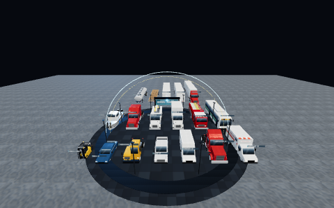

# Fleet, equipment and tool kits

Three shared kits replace the vehicles, plant and tools stations used to draw inline:

| Kit | File | Builders |
|---|---|---|
| Fleet | `WebXR/shared/fleet.js` | tractors (day cab, sleeper), four trailers, a coupled tractor-trailer, box truck, pickup, sedan, cargo van, ambulance, fire engine, bucket truck, transit bus, forklift, yard hustler, workboat, deck barge |
| Equipment | `WebXR/shared/equipment.js` | excavator, backhoe, skid steer, dump truck, mobile crane, aerial boom lift, scissor lift, compactor, generator trailer, light tower, concrete pump, crane spreader |
| Tool kit | `WebXR/shared/toolkit.js` | drill, angle grinder, impact wrench, torque wrench, multimeter, four-gas meter, radio, flashlight, tape measure, level, hammer, wrench set, hard-hat lamp, chock, tag line, tie-down strap, glad-hand gauge, tyre gauge, creeper, hose reel |

All three are in the bundler lists for SmartCiti.X, Trade Skills and Holodeck, and in the headless module lists (`tools/lib/headless.mjs`, `check_smartcity.mjs`, `check_trades.mjs`, `gen_sims_meta.mjs`). A station can import them without touching the build.

## The contract

- **Signature** `builder(parent, x, y, z, opts)`, like the kit helpers. `opts.ry` turns it about Y. It returns a `Group`.
- **Units and frame.** Metres, at the real proportions of the class. The front faces **+Z**. The driver's (left) side is **+X**. y = 0 is the ground, or for tools the surface they rest on. The footprint is centred on the origin in X and Z.
- **Parts.** `group.userData.parts` names everything a station moves or registers: doors, wheels, mirrors, lights, boom, stick, bucket, mast, carriage, outriggers, screens. A list (such as `wheels`, `outriggers` or `twistlocks`) is an array of groups. Each part is a group placed at its pivot, so it animates by its own transform. Articulated machines nest their parts: the excavator's `bucket` hangs off `stick`, which hangs off `boom`, which hangs off `house`. Some parts carry hints in `userData`: `openAngle` (doors), `slide` (sliding doors, extension decks), `deploy` (outriggers, stabilisers), `extend` (crane boom sections), `lift` (fifth wheels). The tractor also publishes `fifthWheelZ`, and each trailer publishes `kingpinZ`.
- **Baking.** The static shell and every part are baked with `mergeStatic(…, { local: true })` into one mesh per material, so the vehicle can still be driven as a unit. Canvas faces (doors, grilles, tyres, tread plate, livery panels) are cached by look, and those meshes merge too. Live screens are the exception: meter displays have their own material so that `userData.show(text)` can repaint them.
- **Paint.** Surfaces use the kit's painted, brushed and rubber finishes plus canvas faces. There is no flat colour. Wheels are one lathe mesh each, with tread, sidewall, rim, hand holes and lug nuts painted in bands.
- **Livery.** `opts.livery = { colour, fleetName, unitNumber }` is painted onto doors and side panels. The defaults are the platform's own generic names (`SMARTCITI FLEET`, `CITY EMS`, `CITY FIRE`, `CITI TRANSIT`…). **Never pass a real company's or union's name or mark.** The kits draw no real emblem: there is no Star of Life and no Red Cross on the ambulance, and no maker's badge or trade dress on any machine. USDOT numbers are always the placeholder `0000000`. The tanker's placard (class 3, UN 1203) is regulatory marking, not a brand.

## Budgets and the gate

Each kit exports a budget table (`FLEET_BUDGET`, `EQUIPMENT_BUDGET`, `TOOLKIT_BUDGET`) and a builder map (`…_BUILDERS`). For every entry the table declares:

- the mesh count after `mergeStatic`;
- the footprint as [width, height, length] in metres;
- the named parts.

`node tools/check_fleet.mjs` (part of `check_all.mjs`) builds every entry headlessly. It fails if:

- a build throws;
- a builder uses more meshes than it declares;
- a count exceeds a ceiling from the assets brief: tractor-trailer 40, car 18, forklift 24, excavator 30, hand tool 4;
- a footprint is off by more than 3 % or 6 cm, or is not centred;
- a named part is missing.

`--measure` prints what each builder actually costs.

Two counts are listed per builder below:

- **drawn** is the mesh count after merging. This is the draw-call cost in a browser, and the gallery label shows it.
- **authored** is the count before merging. `check_budget.mjs` and `check_layout.mjs` measure authored meshes, because merging is a no-op on their stub three.js. **A retrofit adds the authored number to its station's budget total**, so check it against the station's headroom before swapping a builder in.

## Using a builder in a station

```js
import { semiTractor, trailer } from "../../../shared/fleet.js";   // from smartcity/js/sims/
import { fourGasMeter } from "../../../shared/toolkit.js";

const tractor = semiTractor(g, -2, 0, 0, { ry: Math.PI / 2, livery: { colour: 0x2d5f8a, fleetName: "CITY FREIGHT", unitNumber: "214" } });
const { doorL, mirrorL, wheels, fifthWheelRelease } = tractor.userData.parts;
reg(hits, doorL, "pti-door");                 // register a part as the interactable
doorL.rotation.y = doorL.userData.openAngle;  // open the door
for (const w of wheels) w.rotation.x += distance / 0.52;   // roll the wheels

const meter = fourGasMeter(g, 0.4, 0.9, 0.2);
meter.userData.show("O2  19.2\nLEL    4\nCO    12\nH2S  0.0");
```

A retrofit replaces the inline vehicle without changing the station's step ids, hazards or interactables. It registers the kit part under the id the old mesh had. It keeps the station inside its mesh budget, and it re-runs the drive and the spawn screenshot.

## The gallery

`smartcity/index.html?gallery=fleet` (or `equipment`, or `toolkit`) lays every builder out on an empty plaza, with no apron and no district. Each builder is labelled with its name and the meshes it cost in that browser. Vehicles and plant stand in rows facing the spawn. Tools lie on a bench.

In the browser console, `window.__gallery.focus(key)` frames one builder and hides the rest, `window.__gallery.overview()` returns to the full layout, and `window.__gallery.report` lists the measured and declared counts.

The thumbnails below and the overviews (`docs/screenshots/fleet/{fleet,equipment,toolkit}-overview.png`) were taken this way.



## Fleet — `WebXR/shared/fleet.js`

Vehicles. `FLEET_BUDGET` / `FLEET_BUILDERS`. Every vehicle takes `opts.livery` and `opts.ry`; the tractor, trailers and trucks also take `opts.wheels` (a wheel style: `steel`, `alloy`, `grey`, `black`).

| | Builder | Meshes (drawn / authored) | Footprint W × H × L (m) | Parts |
|---|---|---|---|---|
|  | **semiTractor** — Class 8 day cab, tandem drive, fifth wheel, air lines and glad hands. `semiTractor(parent, x, y, z)` | 23 / 85 | 3.02 × 3.95 × 6.86 | doorL, doorR, mirrorL, mirrorR, wheels, lights, headlights, markerLights, tailLights, fifthWheel, fifthWheelRelease, gladHandService, gladHandEmergency |
|  | **semiTractor:sleeper** — Class 8 raised-roof sleeper. `semiTractor(parent, x, y, z, {cab: "sleeper"})` | 23 / 86 | 3.02 × 4 × 8.66 | doorL, doorR, mirrorL, mirrorR, wheels, lights, fifthWheel, gladHandService, gladHandEmergency |
|  | **trailer:dryVan** — 53 ft dry van, swing doors, conspicuity tape. `trailer(parent, x, y, z, {kind: "dryVan"})` | 14 / 44 | 2.63 × 4.11 × 16.27 | doorL, doorR, wheels, landingGear, gladHands, lights |
|  | **trailer:flatbed** — 48 ft flatbed with stake pockets and winches. `trailer(parent, x, y, z, {kind: "flatbed"})` | 13 / 108 | 2.66 × 1.53 × 14.69 | wheels, landingGear, gladHands, lights, stakePockets, winches |
|  | **trailer:reefer** — 53 ft reefer with nose-mounted unit. `trailer(parent, x, y, z, {kind: "reefer"})` | 17 / 47 | 2.63 × 4.11 × 16.7 | doorL, doorR, wheels, landingGear, gladHands, lights, reeferUnit |
|  | **trailer:tanker** — 42 ft DOT-406 style tanker, placarded 3 / 1203. `trailer(parent, x, y, z, {kind: "tanker"})` | 14 / 64 | 2.63 × 3.26 × 12.94 | wheels, landingGear, gladHands, lights, manholes, valves |
|  | **tractorTrailer** — day cab coupled to a 53 ft dry van. `tractorTrailer(parent, x, y, z)` | 37 / 129 | 3.02 × 4.11 × 20.71 | tractor, trailer |
|  | **boxTruck** — Class 6, 26 ft box, roll-up door. `boxTruck(parent, x, y, z)` | 21 / 41 | 3.02 × 4.05 × 10 | doorL, doorR, mirrorL, mirrorR, wheels, lights, rearDoor |
|  | **pickup** — full-size crew cab. `pickup(parent, x, y, z)` | 17 / 31 | 2.39 × 1.93 × 5.92 | doorFL, doorFR, doorRL, doorRR, wheels, mirrorL, mirrorR, lights, tailgate |
|  | **sedan** — mid-size four-door. `sedan(parent, x, y, z)` | 17 / 27 | 2.23 × 1.45 × 4.92 | doorFL, doorFR, doorRL, doorRR, wheels, mirrorL, mirrorR, lights, trunk |
|  | **cargoVan** — high-roof cargo van. `cargoVan(parent, x, y, z)` | 18 / 27 | 2.41 × 2.72 × 5.99 | doorL, doorR, doorSlide, doorRearL, doorRearR, wheels, mirrorL, mirrorR, lights |
|  | **ambulance** — Type III, generic markings, rear chevrons. `ambulance(parent, x, y, z)` | 25 / 48 | 2.62 × 3.13 × 7.06 | doorL, doorR, doorSide, doorRearL, doorRearR, compartments, warningLights, wheels, mirrorL, mirrorR, lights |
|  | **fireEngine** — pumper: pump panel, hose bed, roof ladders. `fireEngine(parent, x, y, z)` | 28 / 83 | 3.2 × 3.23 × 10.25 | doorL, doorR, doorCrewL, doorCrewR, pumpPanel, pumpControls, hoseBed, ladder, compartments, warningLights, wheels, mirrorL, mirrorR, lights |
|  | **bucketTruck** — insulated aerial device, articulated turret-boom-bucket. `bucketTruck(parent, x, y, z)` | 32 / 62 | 3.3 × 3.44 × 9.6 | doorL, doorR, mirrorL, mirrorR, wheels, lights, turret, boom, boomUpper, bucket, outriggers, compartments, controls |
|  | **busTransit** — 40 ft low-floor. `busTransit(parent, x, y, z)` | 16 / 32 | 3.3 × 3.26 × 12.42 | doorFront, doorRear, destinationSign, wheels, mirrorL, mirrorR, lights |
|  | **forkliftCounterbalance** — 5,000 lb LPG counterbalance. `forkliftCounterbalance(parent, x, y, z)` | 21 / 60 | 1.12 × 2.28 × 3.57 | mast, innerMast, carriage, forks, overheadGuard, counterweight, lpgTank, seat, controls, beacon, wheels, lights |
|  | **yardHustler** — terminal tractor, lifting fifth wheel. `yardHustler(parent, x, y, z)` | 19 / 39 | 2.91 × 3.43 × 5.61 | doorL, doorRear, mirrorL, mirrorR, wheels, fifthWheel, gladHandService, gladHandEmergency, beacon, lights |
|  | **workboat** — 7.6 m aluminium workboat. `workboat(parent, x, y, z)` | 16 / 43 | 3.15 × 3.45 × 8.18 | wheelhouseDoor, outboards, davit, navLights, portLight, starboardLight, mastheadLight |
|  | **deckBarge** — 12.2 m sectional spud barge with spill coaming, sump, spuds and bitts. `deckBarge(parent, x, y, z)`; float it at y = −0.6 | 20 / 31 | 6.38 × 6.72 × 12.2 | spuds, bitts, coaming, sump, navLights, portLight, starboardLight |

## Equipment — `WebXR/shared/equipment.js`

Construction plant and terminal equipment. `EQUIPMENT_BUDGET` / `EQUIPMENT_BUILDERS`. Articulated machines nest their parts at the real pivots: rotate the parent and the children follow.

| | Builder | Meshes (drawn / authored) | Footprint W × H × L (m) | Parts |
|---|---|---|---|---|
|  | **excavator** — 20 t tracked excavator, dig-ready. `excavator(parent, x, y, z)` | 21 / 44 | 3.05 × 4.83 × 10.78 | trackL, trackR, house, door, boom, stick, bucket, lights, counterweight |
|  | **backhoe** — loader backhoe, travel pose. `backhoe(parent, x, y, z)` | 23 / 46 | 2.36 × 3.75 × 7.46 | loaderArms, loaderBucket, swingFrame, boom, stick, bucket, stabilizers, wheels, door, lights |
|  | **skidSteer** — wheeled skid steer. `skidSteer(parent, x, y, z)` | 12 / 22 | 1.83 × 2.07 × 3.31 | arms, bucket, wheelsL, wheelsR, wheels, door, lights |
|  | **dumpTruck** — tri-axle dump truck. `dumpTruck(parent, x, y, z)` | 20 / 58 | 3.02 × 3.26 × 9.57 | bed, tailgate, hoist, doorL, doorR, mirrorL, mirrorR, wheels, lights |
|  | **mobileCrane** — rough-terrain crane, travel pose. `mobileCrane(parent, x, y, z)` | 27 / 50 | 2.96 × 3.49 × 11.46 | outriggers, house, counterweight, cabDoor, boom, boomSections, hook, wheels, lights |
|  | **aerialBoomLift** — 60 ft telescopic boom lift, stowed. `aerialBoomLift(parent, x, y, z)` | 19 / 35 | 2.42 × 2.61 × 9 | turntable, boom, boomTele, jib, platform, controls, groundControls, wheels, beacon |
|  | **scissorLift** — 26 ft slab scissor, stowed. `scissorLift(parent, x, y, z)` | 15 / 57 | 1.16 × 2.34 × 2.3 | scissors, platform, extensionDeck, controls, gate, potholeGuards, wheels, beacon |
|  | **compactor** — single-drum soil compactor. `compactor(parent, x, y, z)` | 14 / 28 | 2.4 × 3.12 × 5.68 | frontFrame, drum, wheels, rops, seat, controls, lights, beacon |
|  | **generatorTrailer** — towable diesel generator. `generatorTrailer(parent, x, y, z)` | 14 / 24 | 1.9 × 2.41 × 4.54 | doorL, doorR, controlPanel, eStop, wheels, jack, lights |
|  | **lightTower** — towable light tower, raised. `lightTower(parent, x, y, z)` | 17 / 41 | 2.34 × 9.29 × 3.49 | mast, mastUpper, lamps, outriggers, controlPanel, wheels, jack |
|  | **lightTower:stowed** — towable light tower, stowed for tow. `lightTower(parent, x, y, z, {raised: false})` | 17 / 41 | 1.58 × 1.77 × 4.81 | mast, mastUpper, lamps, outriggers, controlPanel, wheels, jack |
|  | **concretePump** — trailer line pump. `concretePump(parent, x, y, z)` | 16 / 43 | 2.04 × 1.58 × 4.95 | hopper, grate, outlet, controlPanel, outriggers, wheels, jack, lights |
|  | **craneSpreader** — telescopic container spreader, 40 ft. `craneSpreader(parent, x, y, z)` | 18 / 30 | 2.49 × 2.17 × 12.45 | headblock, telescopeFore, telescopeAft, twistlocks, flippers, indicators, landed, locked, unlocked |

## Tool kit — `WebXR/shared/toolkit.js`

Hand and power tools, meters and yard kit, four meshes or fewer each. `TOOLKIT_BUDGET` / `TOOLKIT_BUILDERS`. y = 0 is the surface the tool rests on. Meters (`multimeter`, `fourGasMeter`, `radio`, `gladHandGauge`) expose `userData.show(text)` to repaint their live screen or dial.

| | Builder | Meshes (drawn / authored) | Footprint W × H × L (m) | Parts |
|---|---|---|---|---|
|  | **drill** — cordless drill-driver. `drill(parent, x, y, z)` | 4 / 8 | 0.08 × 0.27 × 0.32 | trigger |
|  | **angleGrinder** — 125 mm angle grinder with guard. `angleGrinder(parent, x, y, z)` | 4 / 6 | 0.2 × 0.07 × 0.42 | guard, disc |
|  | **impactWrench** — 1/2 in cordless impact wrench. `impactWrench(parent, x, y, z)` | 4 / 6 | 0.09 × 0.27 × 0.23 | trigger |
|  | **torqueWrench** — click-type torque wrench. `torqueWrench(parent, x, y, z)` | 3 / 5 | 0.04 × 0.04 × 0.51 | scale |
|  | **multimeter** — digital multimeter, live screen. `multimeter(parent, x, y, z)` | 4 / 5 | 0.33 × 0.2 × 0.13 | screen, leadRed, leadBlack |
|  | **fourGasMeter** — O2 / LEL / CO / H2S monitor, live screen. `fourGasMeter(parent, x, y, z)` | 3 / 4 | 0.07 × 0.12 × 0.05 | screen |
|  | **radio** — portable two-way radio. `radio(parent, x, y, z)` | 4 / 5 | 0.06 × 0.26 × 0.04 | screen, ptt |
|  | **flashlight** — aluminium flashlight. `flashlight(parent, x, y, z)` | 3 / 4 | 0.04 × 0.04 × 0.22 | lens |
|  | **tapeMeasure** — 8 m tape, blade run out. `tapeMeasure(parent, x, y, z)` | 4 / 5 | 0.3 × 0.07 × 0.05 | blade |
|  | **level** — 600 mm spirit level. `level(parent, x, y, z)` | 3 / 6 | 0.63 × 0.06 × 0.03 | vials |
|  | **hammer** — framing hammer. `hammer(parent, x, y, z)` | 3 / 5 | 0.17 × 0.03 × 0.32 | head |
|  | **wrenchSet** — combination wrenches in a roll. `wrenchSet(parent, x, y, z)` | 2 / 25 | 0.42 × 0.01 × 0.3 | wrenches |
|  | **hardHatLamp** — hard hat with cap lamp. `hardHatLamp(parent, x, y, z)` | 3 / 5 | 0.29 × 0.16 × 0.29 | lamp |
|  | **chock** — wheel chock. `chock(parent, x, y, z)` | 2 / 2 | 0.2 × 0.26 × 0.28 | handle |
|  | **tagLine** — coiled tag line with snap hook. `tagLine(parent, x, y, z)` | 2 / 8 | 0.45 × 0.08 × 0.34 | hook |
|  | **tieDownStrap** — 2 in ratchet tie-down. `tieDownStrap(parent, x, y, z)` | 3 / 7 | 0.43 × 0.05 × 0.14 | ratchet, hook |
|  | **gladHandGauge** — glad-hand air gauge, live dial. `gladHandGauge(parent, x, y, z)` | 3 / 5 | 0.13 × 0.14 × 0.06 | dial |
|  | **tireGauge** — dual-foot truck tyre gauge. `tireGauge(parent, x, y, z)` | 3 / 5 | 0.03 × 0.02 × 0.31 | bar |
|  | **creeper** — mechanic's creeper. `creeper(parent, x, y, z)` | 3 / 19 | 0.44 × 0.13 × 0.98 | casters |
|  | **hoseReel** — air hose reel. `hoseReel(parent, x, y, z)` | 4 / 10 | 0.28 × 0.37 × 0.39 | drum, nozzle |
