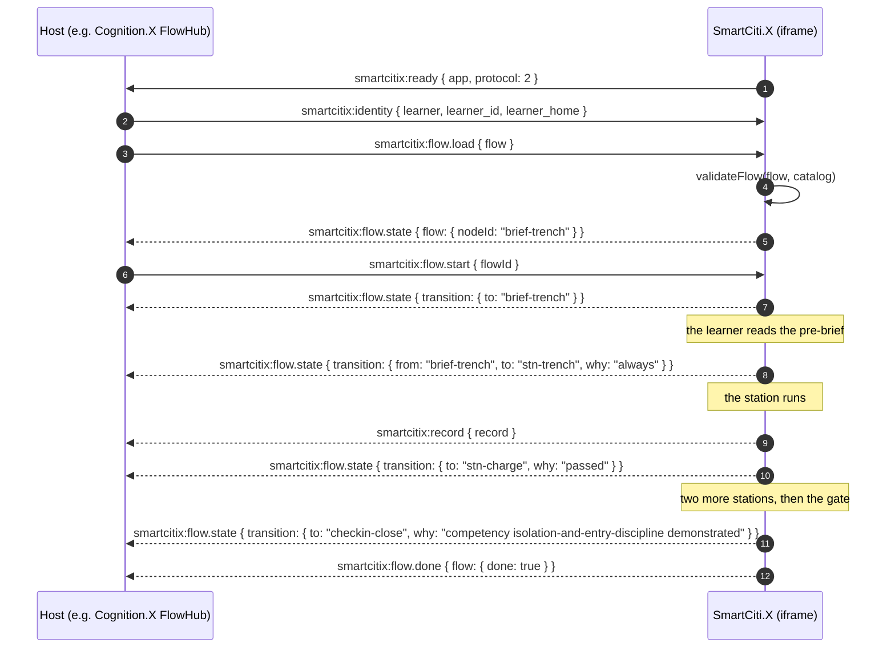
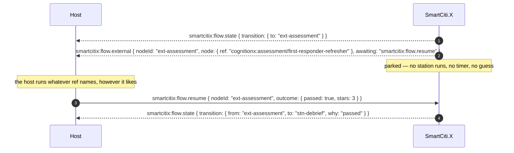
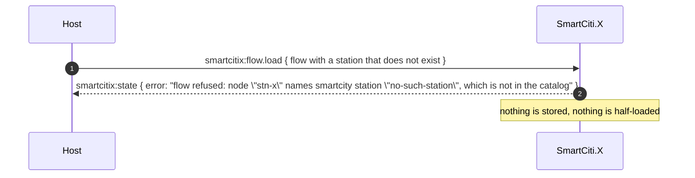
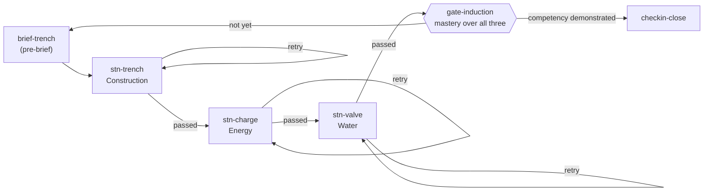
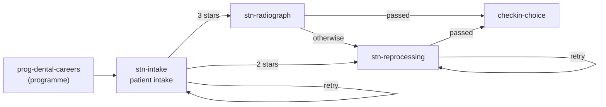
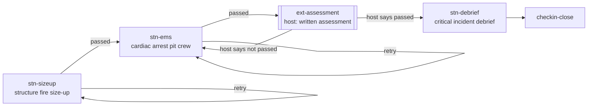

# FlowHub — the SmartCiti.X side of a flow contract

**What this document is.** The user's host platform is **Cognition.X**, and its
orchestration component is called **FlowHub**. *No FlowHub specification exists
in this repository*, and nothing in this document or in
`WebXR/shared/flowhub.js` is derived from one. What follows is **the
SmartCiti.X side of the contract**, specified from this end: the flow schema
this network validates, the messages it accepts, the messages it emits, and the
order they arrive in. A host — Cognition.X's FlowHub, or any other — implements
or adapts to that. Where this document says "the host must send", it is stating
*our* requirement, not describing anybody's internals.

Nothing here special-cases Cognition.X. The channel is the same origin-bound
`smartcitix:*` channel `WebXR/shared/platform.js` has always used, with three
commands and three events added; a host that speaks protocol 1 is unaffected.

- Module: `WebXR/shared/flowhub.js` (pure, no DOM, no three.js — `node
  tools/check_flowhub.mjs` drives the whole state machine headless)
- Channel: `WebXR/shared/platform.js` (platform protocol **2**)
- Instructor console: `WebXR/shared/observer.js` command `flow` (observer
  protocol **3**), see [instructor-console.md](instructor-console.md)
- Examples: `WebXR/flows/*.json`, indexed by `WebXR/flows/index.json`
- Gate: `tools/check_flowhub.mjs`, registered in `tools/check_all.mjs`

---

## 1. The flow schema

```jsonc
{
  "id": "new-apprentice-safety",      // slug: a-z, 0-9, dashes
  "title": "New Apprentice — Site Safety Induction",
  "version": 1,                        // positive integer
  "start": "brief-trench",             // a node id
  "nodes": [ /* see below */ ],
  "edges": [ /* see below */ ],
  "meta": { }                          // free — carried, never interpreted
}
```

### Nodes

| Field | Meaning |
| --- | --- |
| `id` | slug, unique in the flow |
| `kind` | `station` · `programme` · `brief` · `checkin` · `gate` · `external` |
| `app` | `smartcity` · `trades` · `holodeck`, or `host` for an `external` node. Defaults to `smartcity` |
| `ref` | what the node names: a station id, a programme id, or — for `external` — an opaque string the host resolves |
| `params` | per-kind settings (a gate's rule and evidence; an external node's notes) |
| `title`, `why` | what a learner and an instructor read. A title is a host's own text and is always rendered as a text node |

| Kind | What this side does with it |
| --- | --- |
| `station` | runs that station in the app named by `app`. The outcome is the attempt record the run writes |
| `brief` | shows that station's own pre-brief (the flipped-classroom study card) and nothing else. Reading it is the outcome |
| `programme` | opens the programme (`WebXR/smartcity/js/curricula.js`) at the first station the learner has not yet passed, and stays on the node until the whole programme is complete |
| `checkin` | the crew check-in in the Flows panel. Never scored, never leaves the browser |
| `gate` | runs nothing. Reads the run's own attempt outcomes and answers whether a competency has been demonstrated |
| `external` | **the host's node.** This side emits `smartcitix:flow.external` and parks until `smartcitix:flow.resume` arrives for that exact node |

### Edges

```jsonc
{ "from": "stn-trench", "to": "stn-charge", "when": { "passed": true } }
```

`when` is a conjunction — every key present must hold. An absent key never
blocks; `when` absent or `{}` always matches, which is how a fallback branch is
written.

| Key | Holds when |
| --- | --- |
| `passed` | the outcome's pass verdict equals this boolean. The verdict is `records.js`'s: **≥ 2 stars and no unsafe action** |
| `minStars` | `stars >= n` (0–3) |
| `maxHazards` | `hazardHits <= n` |
| `competency` | the learner holds that competency at this point (see §2) |
| `custom` | a named predicate registered with `registerCondition`. Shipped: `under-par` (inside par time), `clean` (no unsafe action, no interruption missed or answered wrongly). A `custom` naming anything else **fails validation** |

**Edges are tried in declared order and the first match wins**, so a flow reads
top-down like the decision it is. A node with no outgoing edge ends the flow. A
node whose every condition fails also ends it, and the state message says
`"no branch condition matched"` rather than pretending it finished.

An edge may point back at its own `from` — that is a retry, and the examples use
it. What validation refuses is a node whose *only* outgoing edge is that
self-loop: a dead end that looks like progress.

### Outcomes

A flow never scores anything of its own. `outcomeFromRecord` reduces the attempt
record `WebXR/shared/records.js` already writes:

```js
{ passed, stars, hazardHits, interrupts: { total, answered, missed, wrong }, seconds, parSeconds, competencies }
```

A node that is not scored (a brief read, a check-in answered) produces
`acknowledgedOutcome()`: passed, zero stars, `acknowledged: true`.

### What validation refuses

`validateFlow(flow, catalog)` returns `{ ok, errors, warnings, nodes, edges,
terminals }` and is run **on arrival, before anything is stored** — by the
learner app, and again by the instructor console before it will send one. It
refuses: a non-slug id; a missing title or a version that is not a positive
integer; an unknown `kind`; a station or programme `ref` that is not in
`WebXR/smartcity/catalog.json`; an `external` node whose `app` is not `host`; a
gate with no `competency` or no `stations` to read evidence from; an unknown
`when` key or an unimplemented `custom`; an edge to or from a node that does not
exist; a node unreachable from `start`; a node that can only loop back to
itself; and a flow with no terminal node at all.

---

## 2. Competencies and gates

A `gate` node names a competency and the stations that evidence it:

```jsonc
{
  "id": "gate-induction", "kind": "gate",
  "params": {
    "competency": "isolation-and-entry-discipline",
    "rule": "mastery",
    "stations": ["trench-box", "charge-point", "valve-vault"]
  }
}
```

`rule: "mastery"` is the proof brief's rule, stated once in `mastered()`: **≥ 2
stars, zero unsafe actions, every interruption answered, and time ≤ 1.5 × par**.
`rule: "passed"` is the looser pass verdict. The gate reads the best outcome per
station **from this run's own history** and produces an outcome
(`passed`, `competency`, `evidence[]`, `why`) that its outgoing edges are then
evaluated against exactly like a station's — which is how
`when: { competency: … }` comes to hold.

The competency layer itself (`WebXR/shared/competency.js`) is a separate module
and **is not in this tree**. `flowhub.js` therefore never imports it:
`hasCompetencyLayer()` is the feature check and `setCompetencyResolver(fn)` is
the seam. With no layer wired in, the gate's evidence is the run
(`source: "run evidence"`); wire one in and it becomes the authority
(`source: "competency layer"`) with the run as the fallback. Nothing else
changes.

A gate is never left standing: the runner evaluates it and steps through in the
same breath, because a node that runs nothing would otherwise be a stall the
learner cannot clear.

---

## 3. The message contract

Trust is `identity.js`'s rule, unchanged. The app announces itself upward with
`smartcitix:ready` (carrying only `app` and `protocol`); the host establishes
trust by posting `smartcitix:identity` with `learner_home` equal to its own real
origin; **from that origin only**, commands are accepted, and **to that origin
only**, events are sent. A flow is not an exception to any of that.

### What the host sends

| Message | Payload | Meaning |
| --- | --- | --- |
| `smartcitix:flow.load` | `{ flow }` — the definition, as an object or as JSON text | Hand over a flow. Validated before it is stored; refused whole, with the reasons, if it does not check out |
| `smartcitix:flow.start` | `{ flowId?, restart? }` | Begin a loaded flow (or the one most recently loaded) and stand on its first node. `restart: true` starts it again from `start` |
| `smartcitix:flow.resume` | `{ nodeId, outcome }` | The host finished the `external` node it was handed. `outcome` is shaped like an attempt record; at minimum `{ passed }`. Accepted **only** for the node the flow is parked on |

### What the host receives

| Message | Payload | When |
| --- | --- | --- |
| `smartcitix:flow.state` | `{ app, protocol, flow: <state>, transition }` | On every transition, and on a successful `flow.load` as the reply |
| `smartcitix:flow.done` | `{ app, protocol, flow: <state> }` | The run reached a terminal node |
| `smartcitix:flow.external` | `{ app, protocol, flowId, nodeId, node, awaiting: "smartcitix:flow.resume" }` | The run reached a node whose `app` is `host`. **Nothing moves until a resume arrives** |
| `smartcitix:state` | `{ …, error }` | A flow command that could not be honoured, with the reason (`flow refused: …`, `flow.start: …`, `flow.resume: …`) |

`flow` in a state message is:

```js
{ protocol, flowId, version, title, nodeId, node, done, why,
  branch: { from, to, why, outcome } | null,
  path: [ { index, id, kind, app, ref, label, passed, stars, why, next, current } ],
  competencies: [ … ], restarts }
```

`transition` on a state message is `{ flowId, version, from, to, done, why,
node, outcome, branch, competencies }` — the branch that was taken and the
reason it was taken, which is what a host's own record of the session wants.

The attempt records, xAPI statements and Open Badges assertions a run produces
keep flowing on `smartcitix:record` / `smartcitix:credential` exactly as before.
A flow adds orchestration; it does not replace the proof.

### A whole run



### A node the host runs



A resume for any other node is refused with a reason, so a stray or replayed
message can never skip a station the learner still owes. There is no timeout: a
flow parked on an external node stays parked until the host resumes it or an
instructor restarts the flow.

### A refusal



---

## 4. Crossing the apps

SmartCiti.X, Trade Skills and Holodeck are three pages on one origin, joined by
the portal's own cross-app links. A flow node in another app is that same link
with the flow and node ids on it:

- `../trades/index.html?room=<ref>&flow=<flowId>&node=<nodeId>`
- `../holodeck/index.html?station=<ref>&flow=<flowId>&node=<nodeId>`
- `../smartcity/index.html?sim=<ref>&flow=<flowId>&node=<nodeId>`

The run itself does not travel on the URL. It waits in **one** localStorage key,
`vr-training-flowhub-v1` — versioned like every other store here, holding every
loaded flow, its run, and which is current. The receiving app reads that key,
checks it agrees with the link (and says so plainly when it does not), and
carries on. All three apps answer `flow.load` / `flow.start` / `flow.resume`;
Trade Skills and Holodeck hand a brief, a programme, a gate or a check-in back
to SmartCiti.X, which owns the pre-brief, the programmes panel and the records
panel.

Like every other store in these apps, this is **this browser only**. Nothing is
transmitted anywhere except to the host origin that launched the learner.

---

## 5. The Flows panel and the instructor console

**Flows panel** (SmartCiti.X, from the intro card or `Flows`): every loaded
flow, the node standing now, the path taken as a chain of chips with the reason
under each hop, the competencies demonstrated, and **Continue** / **Restart**.
On a `checkin` node, Continue is how the check-in is answered. It is built from
plain data — a flow's title comes from a host, so nothing in it is ever set as
markup.

**Instructor console** (`WebXR/instructor/`): the per-learner panel gains
**Load flow** (pick one of `WebXR/flows/*.json`, listed in `flows/index.json`
because a static page cannot list a directory, or paste a definition) and **Send
flow to learner** / **Send to all live**. It travels as the observer command
`flow` (protocol 3), the one command that carries a payload rather than a short
string. The console validates it with the same `validateFlow`, the app validates
it again on arrival, and the app's answer — started, or refused with the reason
— appears in the console's session log and in the learner's attempt record as an
`instructorAction`.

---

## 6. The example flows

All three are in `WebXR/flows/` and all three are validated by
`tools/check_flowhub.mjs` against the real catalog, with every edge condition
proven reachable.

### `new-apprentice-safety` — New Apprentice, Site Safety Induction

Brief → three stations across three different categories → a competency gate →
a check-in.



One habit — isolate, prove, then enter — proven three times in three
categories, gated on the competency rather than on attendance. The gate reads
the same passing attempts the certificate claim rests on.

### `dental-careers-orientation` — Dental Careers, Unspoken Smiles

The dental careers programme, then a branch on stars.



The programme is the orientation; the branch after it is the point. A three-star
intake goes on to the radiography room; two stars goes to instrument
reprocessing; anything less repeats the shared first ten minutes. The flow
closes on the student's own answer, not on a score.

### `first-responder-refresher` — First Responder, Annual Refresher

Fire size-up → EMS → an **external** host assessment → a debrief station.



The external node is why this example exists. `ref` is
`cognitionx:assessment/first-responder-refresher` — an opaque string the host
resolves; this repository asserts nothing about how it runs it, only that
nothing moves here until `smartcitix:flow.resume` arrives for that node.

---

## 7. What a host has to do, in order

1. Embed the app and post `smartcitix:identity` with `learner_home` equal to its
   own origin. Without that, no command is accepted (`identity.js`).
2. Post `smartcitix:flow.load` with a flow that validates. Read the reply: a
   `smartcitix:flow.state` means it was taken, a `smartcitix:state` with `error`
   means it was refused and why.
3. Post `smartcitix:flow.start`.
4. Listen for `smartcitix:flow.state` and record `transition.from`,
   `transition.to` and `transition.why` — that is the audit trail of the
   branching, and it is the only place the reason is stated.
5. On `smartcitix:flow.external`, run the node and post
   `smartcitix:flow.resume { nodeId, outcome }` for **that** node.
6. On `smartcitix:flow.done`, the run is finished. The attempt records and
   credentials already arrived on `smartcitix:record` and
   `smartcitix:credential`.

None of that requires a host to know anything about how a station works, and
none of it lets a host change a verdict: a flow chooses the order, and the
engine — not the flow, and not the host — decides whether a run passed.
