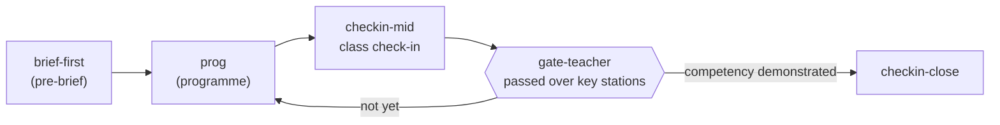

# K-12 — practical maths, science, history and literacy in the SmartCiti.X worlds

Brief: `tools/briefs/k12-brief.md`. Console: `docs/consoles/SCHOLAR.md`. Gate:
`node tools/check_k12.mjs` (in `tools/check_all.mjs`).

## 1. Review: what the flow contract offers a school

**Scope of this review.** This is the **SmartCiti.X side** of a host-orchestrated
flow, and nothing more. The repository holds **no Cognition.X or FlowHub
specification**; what follows is read from `WebXR/shared/flowhub.js`,
`docs/flowhub.md` and `WebXR/flows/*.json`, and it says nothing about how
Cognition.X, or any other host, works inside. Where it says what a host does, it
is restating what this side requires of a host.

What the contract gives a school, read from this end:

- **Ordered nodes.** A flow is a list of nodes — a station, a whole programme, a
  station's pre-brief (the flipped-classroom study card), a check-in, a gate, or
  a node the host runs itself — joined from a named start. A teacher can put a
  lesson in the order they would teach it: read first, then practise, then check.
- **Conditions on edges.** Each edge may carry a condition (`passed`,
  `minStars`, `maxHazards`, `competency`, or a registered custom predicate such
  as `clean`), tried in declared order with the first match winning. That is
  how "go back and try again" and "you are ready for the next part" are written
  without any code.
- **Check-ins.** A `checkin` node pauses the flow for the learner's own answer
  about how it is going. It is never scored and never leaves the browser, which
  is what a classroom needs from a wellbeing question.
- **Gates.** A `gate` node runs nothing: it reads this run's own attempt records
  and answers whether a competency has been shown (`rule: "passed"` or
  `"mastery"`). The K-12 flows call it the **teacher gate**: it certifies
  nothing, and the teacher decides what a result evidences against the school's
  own curriculum.
- **Hand-back to the host.** An `external` node parks the flow and emits
  `smartcitix:flow.external`; nothing moves until the host posts
  `smartcitix:flow.resume` for that exact node. Every transition is reported on
  `smartcitix:flow.state` with the reason for the branch, and the run ends with
  `smartcitix:flow.done`. The K-12 flows do not use an external node yet; a
  school whose host wants to run its own quiz or reflection between stations
  can add one without any change on this side.
- **This browser only.** The run waits in one local storage key, and nothing is
  sent anywhere except to the host origin that launched the learner — which is
  also why a flow keeps working when the connection drops.

## 2. The four programmes

All four carry `audience: "classroom"`, a band named generically (early
primary, upper primary, lower secondary, upper secondary — never a grade code),
the same guides (UN Sustainable Development Goal 4, UNESCO education guidance,
the INEE Minimum Standards, the national curriculum framework as a category, and
AFT as the teachers' training body), and a teacher note on running the lesson
where the connection is poor.

| Programme | Band | What it is for |
| --- | --- | --- |
| `k12-practical-math` | upper primary to lower secondary | measurement, proportion, data and chance, set on the court, at a map, in a kitchen, on a ramp, at the pier, at a community fair's games tent and under a turbine |
| `k12-science` | upper primary to lower secondary | observation and fair test: water, buoyancy, energy, circuits, ecosystems, weather, machines and the scientific method |
| `k12-history-and-civics` | lower to upper secondary | historical **method**: sources, timelines from the lesson's own fictional archive, oral history, a council meeting, guilds as research prompts, maps across eras |
| `k12-literacy-and-life-skills` | early primary to upper secondary | instructions and labels, incident reports, public speaking, digital citizenship, first aid awareness (always "call for help"), teamwork and feedback |

Each station follows the station brief's bar with "hazards" read as
misconceptions and unsafe shortcuts (adding sides to get an area; tasting the
filtered water; trusting a source because it is old; starting before reading to
the end), two interruptions that change the scene, and a closing check-in. The
twenty-eight stations the brief names are all built and listed in
`WebXR/smartcity/js/curricula.js`. Every station shares one control ring and
thirteen step kinds, so each is authored as a compact JSON file in
`tools/k12-data/` and generated by `tools/gen_k12_station.mjs`; edit the JSON and
regenerate, never the generated module. The JSON picks the station's `scene`
(`wall` — the classroom wall, `bench` — outdoors, `deck` — a working boat,
`stage` — a hall, `lab` — a lab bench) and its `order` (`a`, `b` or `c`: three
step orders that all open with the find, close record → share → check-in and
keep the hold and the track apart, because the two interruptions arm there).
All twenty-eight have JSON: the fourteen SCHOLAR wrote by hand were read back
by `tools/extract_k12_station.mjs <id>` (the room headless for the steps,
hazards, interruptions and late notes; the module text for the labels and faces
on the `bead(`/`card(`/`dial(`/`meter(`/`token(`/`spot(`/`board(`/`hazardCard(`
lines, the crew, the guide's lines, the board and the colours), and the script
proves the round trip — `gen(json)` equals the module, whitespace aside — before
it writes anything (`--check` proves without writing). The wall scene's desk
colour is the one per-programme value the template carried, so it is a JSON
field (`desk`). A measured note for whoever works on originality:
`tools/eval_content.mjs` scores originality on prose only (titles, cues, whys,
hazards, interruptions), so a scene or an order changes nothing there; the words
must differ. Rewriting the court station's cues, whys, hazards and
interruptions in the arena's own vocabulary (hardwood, baseline, bleachers,
buzzer, coach) moved its originality from 0 to 52 and its total from 95 to 97,
and lifted its former twin, the map-scale station, from 0 to 28 without a word
of it changing.

### Facts rule

No invented grade codes, dates, figures, statistics, quotes or contested
historical claims. Every number a learner works with is one the scene shows;
`tools/check_k12.mjs` fails a station whose learner-facing text contains a digit
at all. History teaches method: the documents in the history stations are the
lesson's own fictional archive, labelled as such. Frameworks are cited only in
registry form (`tools/standards.json`, `source: "unverified"`), only as
frameworks a lesson is aligned to, never as bodies that certify it.

## 3. The flows

`WebXR/flows/k12-practical-math.json`, `k12-science.json`,
`k12-history-and-civics.json` and `k12-literacy-and-life-skills.json` share one
shape, validated by `tools/check_flowhub.mjs` and again by `tools/check_k12.mjs`:

The gate's competency is the programme's own entry in
`WebXR/shared/competency.js`, and the gate reads the programme's key stations
from this run's records. A teacher loads a flow from the instructor console's
flow picker, or a host posts it with `smartcitix:flow.load`.

## 4. The school view

- **Classroom filter.** The homepage finder has a "Who for" filter with a
  **Classroom (K-12)** entry that shows only the four programmes.
- **Teacher note.** Each programme overview carries a note for the teacher:
  once the page has loaded the app works offline, phones should run at low
  quality, and one device per small group works with the others reading the cue
  and the why aloud.
- **Anchors.** Every station is launched from a Bay World job board that also
  lists its programme: the arena for the court, the treatment plant for water,
  the elementary school for the history and literacy stations, and for the
  newer stations the construction site, the pier, the fair, the wind farm, the
  kelp transect (the Deep), the field lab, the container terminal, the lab
  campus, the union hall, the civic centre archive, the theatre, the college and
  the arena.

## 5. Field lessons

`WebXR/shared/field-lessons.js` holds short lessons placed at landmarks in Bay
World, the Deep, the Regatta and Fairway Park: two to four minutes each, three
short steps read on the spot, one check question, and a link to the full K-12
station that teaches the idea. Each names the trade that uses the idea ("the
crane operator's load chart is a ratio table"), so a school subject and a
worker's skill are seen as the same thing. The Bay World and Deep full maps draw
them as a **K-12 layer** (teal squares, and a list under the sites with a "Full
lesson" link).

The schema is exported (`K2_FIELD_LESSON_SCHEMA`, `k2ValidateFieldLesson`) so any
world can add lessons in its own data module: an `id` containing `-fl-`, a
`world`, an `anchor` of kind site, landmark, course, facility or hole that exists
in that world, a `position`, a `title`, a K-12 `station`, a `trade` and a
`tradeLine`, `minutes` from two to four, a generic `band`, three `steps` and a
`check` with three options, an answer and a why. No digits in any lesson text.
`tools/check_k12.mjs` validates every lesson, its link and its reading level
(Flesch–Kincaid grade as a rough yardstick, via `tools/lib/reading-level.mjs`).

### Lessons in play

`WebXR/shared/field-kiosk.js` makes the lessons playable where the learner
stands. Bay World and the Deep build one **kiosk** per lesson at its position
(a post, a teal board with the title, a cap that turns green once answered);
within reach the HUD reads "Press E — field lesson: …" and E opens the lesson
screen: the trade line, the three steps, the check question with its options
shuffled, and a "Full lesson" link to the K-12 station. A right answer is
recorded on the passport as a `field-lesson` award (one per lesson, never
twice, a small reputation credit); a wrong answer shows the lesson's own why
and lets the learner try again — nothing is scored against anyone. Five
answered lessons in one world earn that world's **Field Notes** badge (a
`field-notes` award, once per world).

The Regatta and Fairway Park have no full map: the Regatta draws the lessons
anchored on a race's course on its course card and lists them in the
pre-departure briefing; Fairway Park lists the park's lessons on the facility
screen (`k2RenderLessonList`). Sierra Summit and Redwood Reach carry their own
ten lessons each in their own data modules (`SM_FIELD_LESSONS`,
`RW_FIELD_LESSONS`, compatible schemas of their own); `check_k12` section 8c
reads both against their sites and landmarks, their K-12 links, steps, checks,
minutes and reading level, and reports (without failing) a lesson that states a
figure its scene shows. Both worlds open their lessons in-world as before, and a
right answer now also writes the shared passport award through
`k2RecordLesson(k2AdaptLesson(lesson, world), lessons)` — `k2AdaptLesson` maps
their shapes onto the shared one, and `k2FieldNotes(world, lessons)` takes the
world's own list — so the one `field-lesson` award kind and one Field Notes
badge count in all six worlds; each lists its lessons under its map through
`k2RenderLessonList`, with the Field Notes standing beneath.

### Teacher tools

`node tools/gen_k12_cards.mjs` writes `WebXR/k12/teacher.html` from the same
lesson data: a teacher view of all sixty-two field lessons by classroom
programme and band (world, minutes, trade, a link to the full station), and one
printable lesson card per lesson — the title, the three steps, the check with
its answer marked and its why, the trade line — with a print stylesheet and a
world filter. The page's only script reads this browser's passport
(`k2FieldNotes` per world) for the learner's Field Notes counts; it fetches
nothing and nothing leaves the device, and on a shared class device it shows
the device's passport, not any one pupil's. `check_k12` section 8d reads the
page against the data (one card per lesson, six counts, the four programme
sections, no network call, the print stylesheet).

## The Bay ecology lessons (ESTUARY)

Twelve K-12 stations on the ecology of San Francisco Bay (`k12-es-*`, from `tools/k12-data/es-*.json`), wired into
`k12-science` (nine), `k12-practical-math` (two) and `k12-literacy-and-life-skills` (one careers lesson), anchored at
San Francisco district sites with a guarded BAYMAP Oakland anchor where the project is mapped there.
`WebXR/shared/es-bay-lessons.js` holds the lessons, the two-minute fallback games and the SCHOLAR / DEAN hooks; one flow
per lesson (`WebXR/flows/es-*.json`) hands off to a BAYQUEST `bq-` game when present, else the ESTUARY fallback. Program
facts appear only in the careers and clean-air lessons and only from the EPA and Port of Oakland sources. check_k12
section 10 holds them. SmartCiti.X side only, as everywhere in this document.
