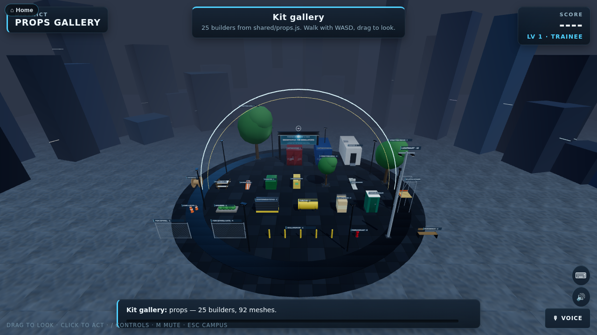

# Site-dressing prop kit

`WebXR/shared/props.js` is a fourth shared kit, in the `shared/fleet.js` pattern: jersey and water-filled barriers, a traffic cone cluster, a fixed light mast, a portable toilet, a site office, a dumpster, a scaffold tower, a wrapped pallet stack, a cable spool, a fire hydrant, a row of bollards, a park bench, a street tree in three sizes, a shrub bed, a chain-link fence panel with a gate variant, a 20 ft shipping container in two colours, a skid fuel tank, a generator on a skid, a mobile crane's counterweight stack, and a picnic table.

These dress **districts** — the horizon and edges around a SmartCiti.X station (`WebXR/smartcity/js/districts.js`) — never a station's own working area. A station's mesh budget (`tools/check_budget.mjs`) never sees them: a station's own `build(root)` never calls `buildStage()`, so district dressing is not part of what a station's headroom is measured against. The only checker that builds a full stage (`tools/check_districts.mjs`) holds the two *scenic* districts (golden-gate-deck, bay-underwater) — the ones where the district is the ground the learner stands on — to `SCENIC_BUDGET` (120 meshes), the same ceiling their own scenery already lived inside; dressing added to golden-gate-deck (a fence and a light mast) counts against that existing, documented ceiling rather than a station's.

## The contract

Same contract as `shared/fleet.js`, and props.js reuses its rig, bake, paint and livery machinery (`flRig`, `flDone`, `flLivery`, the canvas-material cache) rather than duplicating it:

- **Signature** `builder(parent, x, y, z, opts)`. `opts.ry` turns it about Y. Returns a `Group`.
- **Units and frame.** Metres, real proportions. y = 0 is the ground. The footprint is centred on the origin in X and Z.
- **Parts.** `group.userData.parts` names anything that swings, lifts or lights: a toilet or office door, a dumpster's two lids, a container's two doors, a gate leaf, a fuel gauge, a generator's stack and control panel, a light mast's four lamp heads.
- **Baking.** The static shell and every part are baked with `mergeStatic(…, { local: true })`, same as fleet, equipment and toolkit.
- **Colour.** `opts.colour` (or `opts.color`) tints a prop where a real one comes in more than one finish — a dumpster, a hydrant, bollards, a fuel tank, a bench, a container. `shippingContainer` also takes the fuller `opts.livery` (colour, fleet name, unit number) fleet.js vehicles use, painted the same way onto its doors. Nothing here carries a real maker's name or badge.
- **Lit props.** `lightMast` takes `opts.lit` (roughly 0–2), the four lamp heads' emissive intensity. A district's own `dressing` entry sets `lit: true` and stage.js scales it by the same night/dusk/day mast multiplier every other light mast and beacon in the scene uses, so it reads as switched on at night and barely on by day.

## Budget and the gate

`PROPS_BUDGET` declares, per entry, the mesh count after `mergeStatic()`, the footprint `[width X, height Y, length Z]` in metres, and the named parts. Every entry is **at most 14 authored meshes** (before merge) — the assets brief's ceiling for a prop, so a district can dress its horizon with a dozen of these without the count running away.

`node tools/check_props.mjs` (part of `check_all.mjs`) builds every entry headlessly, the same way `tools/check_fleet.mjs` holds fleet, equipment and toolkit to their tables. It fails if a build throws, if the merged count exceeds what is declared, if the authored count exceeds 14, if the footprint is off by more than 3% or 6 cm on an axis or is not centred, or if a declared part is missing from `userData.parts`. `--measure` prints what each builder actually costs.

| Builder | Meshes (merged / authored) | Footprint W × H × L (m) | Parts |
|---|---|---|---|
| **jerseyBarrier** — concrete F-shape traffic barrier, 10 ft run, reflective tape baked into the panel texture | 1 / 1 | 0.61 × 0.81 × 3.05 | — |
| **waterBarrier** — plastic water/sand-filled lane barrier, modular section | 2 / 2 | 0.5 × 0.81 × 1.8 | cap |
| **coneCluster** — three traffic cones in a triangle (`opts.count`) | 3 / 9 | 1.0 × 0.71 × 0.84 | — |
| **lightMast** — fixed site light mast, four heads, `opts.lit` sets their glow | 10 / 11 | 1.3 × 8.95 × 0.5 | lamps |
| **portableToilet** — single-unit portable toilet, hinged door | 4 / 4 | 1.26 × 2.32 × 1.26 | door, vent |
| **siteOffice** — 20 ft portable site office, steps, HVAC unit | 5 / 6 | 2.45 × 3.1 × 6.49 | door |
| **dumpster** — front-load construction dumpster, two hinged lids | 4 / 7 | 1.37 × 1.26 × 1.83 | lidL, lidR |
| **scaffoldTower** — two-lift scaffold tower, planked platform, guardrail | 3 / 12 | 1.35 × 4.0 × 1.35 | — |
| **palletStack** — three loaded pallets under shrink film | 3 / 4 | 1.04 × 1.7 × 1.24 | — |
| **cableSpool** — wound cable/wire reel standing on its rim (`opts.material`: wood or steel) | 2 / 3 | 0.94 × 1.5 × 1.5 | — |
| **fireHydrant** — dry-barrel fire hydrant | 5 / 5 | 0.38 × 0.78 × 0.46 | nozzle×2 |
| **bollardRow** — a row of steel bollards (`opts.count`, `opts.spacing`) | 2 / 10 | 6.16 × 1.08 × 0.16 (5 default) | — |
| **parkBench** — slatted park bench | 2 / 7 | 1.8 × 0.88 × 0.5 | — |
| **streetTree:small** — young street tree in a tree grate (`opts.size`) | 5 / 5 | 2.48 × 4.46 × 2.4 | — |
| **streetTree:medium** — established street tree in a tree grate | 5 / 5 | 3.93 × 6.52 × 3.8 | — |
| **streetTree:large** — mature street tree in a tree grate | 5 / 5 | 5.8 × 9.02 × 5.6 | — |
| **shrubBed** — curbed planting bed, five shrubs (`opts.count`) | 3 / 6 | 2.3 × 0.72 × 1.0 | — |
| **fencePanel** — 10 ft chain-link fence panel | 2 / 5 | 3.07 × 1.9 × 0.07 | — |
| **fencePanel:gate** — chain-link fence panel with a swinging gate leaf | 4 / 6 | 3.08 × 1.9 × 0.08 | gate, latch |
| **shippingContainer** — 20 ft ISO shipping container, oxide red | 5 / 5 | 2.5 × 2.66 × 6.1 | doorL, doorR |
| **shippingContainer:blue** — the same container, marine blue (`opts.livery`) | 5 / 5 | 2.5 × 2.66 × 6.1 | doorL, doorR |
| **fuelTank** — skid fuel tank on a twin saddle stand | 3 / 4 | 2.2 × 1.39 × 1.16 | gauge |
| **generatorSkid** — diesel generator set down on a skid (not towed) | 5 / 5 | 1.0 × 1.39 × 2.2 | stack, controlPanel |
| **counterweightStack** — mobile crane counterweight, five slabs (`opts.count`) | 2 / 5 | 2.5 × 1.48 × 1.0 | — |
| **picnicTable** — A-frame picnic table | 2 / 5 | 1.6 × 0.87 × 1.5 | — |

## Dressing the districts

Every entry in `DISTRICTS` (and the shared `DEFAULT` a plain hub/plaza falls back to) can carry a `dressing` array — `{ prop, x, z, y, ry, opts, lit }`, `prop` naming a `PROPS_BUILDERS` key. `js/stage.js` places them into the district's own group right after the district builds itself (`districts.js`'s `dressDistrict()`), so they cost nothing against a station's own budget and never sit inside a station's working area or the plaza/apron a station stands on:

- **Maritime & Ports** (the port district) — two shipping containers (one in each colour) and a five-bollard row, in the foreground of the yard the district already builds further out.
- **golden-gate-deck** (the Bay district) — a chain-link fence panel and a lit light mast, on the sidewalk well clear of the roadway, the lane closure and the walk from spawn to the station.
- **bay-underwater** and **gym-court** — nothing (`dressing: null`): the learner stands on the district's own floor, and a bench or a hydrant has no business on a dive stage or a basketball court.
- Every other category (Energy & Power, Mobility & Transit, Water & Environmental, Connectivity & Telecom, Emergency Services, Manufacturing & Automation, Building Systems & Facilities, Construction & Structural Trades, Entertainment & Live Events, Environmental Monitoring, Surface Prep & Coatings, Culinary & Hospitality, Dental & Oral Health, Community Environmental Justice, Sewing & Garment Trades) carries two or three props picked for its trade — a fuel tank and a generator skid behind a substation, scaffold and a portable toilet behind a structural trades station, a park bench and a street tree behind a transit or dental stop, and so on.
- The plain hub/plaza (no category) falls back to `DEFAULT`'s own baseline dressing — a bench, a street tree and a short bollard row — so the very first thing a learner sees is dressed too.

## The gallery

`smartcity/index.html?gallery=props` lays every builder out on an empty plaza, the same way `?gallery=fleet` does. Each is labelled with its name and the meshes it cost in that browser. `window.__gallery.focus(key)` frames one builder for a thumbnail; `window.__gallery.overview()` returns to the full layout.

