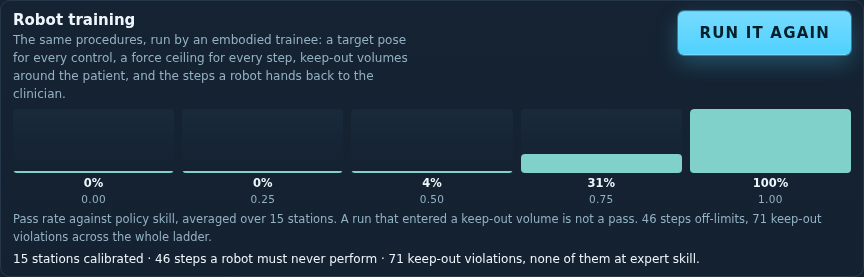

# Robot training

The fifteen dental stations of **Dental Hygiene — Unspoken Smiles** are also a
robot training simulator. A chairside assistant or hygiene-support robot runs
the same procedure engine a student runs, on the same scored steps, in the same
room — and because the room is a real 3D scene rather than a decision tree, each
interactable yields a target pose, each step a grasp and a force ceiling, and
each person in the room a volume the machine must not enter.

Two modules carry it, and the split matters:

| file | what it owns |
| --- | --- |
| `WebXR/shared/robot.js` | the **policy**: a skill-parameterised agent, `observe()`, `applyAction()`, `runEpisode()`, `calibrate()` |
| `WebXR/shared/robot-embodiment.js` | the **body**: poses, approach normals, grasps, force classes, keep-out volumes, `observeEmbodied()`, `runEmbodiedEpisode()` |

`applyAction()` is untouched. The embodiment layer adds what an action is
carried out *with* — it never changes what the engine accepts, so a robot
episode, a learner's click and an instructor's replay all go down one path.

---

## The embodiment schema

### Pose

Every interactable a station registers gets a pose, derived from the scene
itself by walking the object's parent chain through every offset, rotation and
scale (`worldPlacement()` — hand-rolled rather than borrowed from three.js, so
a checker in Node and a browser produce the same numbers):

```json
{
  "position": [-0.674, 0.735, -0.554],   // contact point, station metres
  "normal":   [0.296, 0, 0.955],         // approach normal: the object's +Z face
  "euler":    [0, 0.3, 0],               // accumulated orientation
  "standoff": 0.12,                      // metres staged back along the normal
  "approach": [-0.638, 0.735, -0.439]    // where the end effector waits
}
```

### Grasp, from the step kind

A station never names a grasp. It names a step kind, and the kind is what says
how the hand has to behave:

| step kind | grasp | carries |
| --- | --- | --- |
| `select`, `sequence`, `find` | `touch` | momentary contact, then release |
| `hold` (and the `press` action) | `sustained-contact` | `seconds` to hold |
| `turn` | `wrist-rotation` | `turns` required |
| `drag` | `pick-and-place` | source pose → `place` (the `dropAt` target) and its radius |
| `gauge`, `track` | `continuous-adjustment` | the green `band`, and `seconds` for a track |

### Force class

`none | light | firm` — the most contact force the robot may use on that step:

* `noRobot` on the step → **`none`**, because the robot is not doing it;
* a declared `forceClass` → that value;
* otherwise the kind's default: `firm` for `turn` and `drag` (a valve wheel, a
  carried cassette), `light` for everything else.

Each observation says which of the three it was (`forceSource`), so a dataset
can tell a station's own declaration from a default.

### Keep-out volumes

Spheres around the people in the room, from four sources:

1. `userData.patient` on a figure the station built — `{ part: "head" | "torso", radius }`;
2. `userData.patientChair` on a chair that is empty *now* — a default head
   volume at `offset` from the chair, because it will not be empty for long;
3. an interactable whose **id names part of a person** (`patient-airway`,
   `face-inspect`, `floor-of-mouth`) and is not a hazard prop or an instrument —
   small volumes around the anatomy a procedure works on;
4. `userData.crew`, which citykit's `standingFigure` already sets: a robot keeps
   out of the assistant at the next bench for the same reason it keeps out of
   the patient.

Entering one is a **violation** unless the step declares patient contact by
carrying a `forceClass` — including `"none"`, which means *you may reach in and
look, you may not touch* (reading a child's cooperation cues is exactly this).
A run with any violation is not a pass, whatever it scored.

### The observation

`observeEmbodied(session, api)` returns everything `observe()` returns plus
`grasp`, `maxForce`, `forceSource`, `noRobot`, `operator`, `turns`, `band`,
`seconds`, `pose`, `poses` (one per target), `place` and:

```json
"keepOut": { "zones": 3, "inside": null, "part": null,
             "authorised": true, "nearest": { "id": "patient-head-0", "clearance": 0.38 } }
```

---

## The dental rule set

The annotations live on the station modules themselves — no step and no id was
changed, only fields added. The rule is about **what the end effector reaches
for**, which is objective and checkable, rather than about how a step reads:

1. **`noRobot: true` — the target is a person.** Anything inside the mouth or
   on the airway; any palpation of a patient's tissue; anything that carries
   their life (compressions, an injection, oxygen onto the face, the decision to
   shock); positioning a patient's body; and the patient-facing acts whose whole
   content is a person — comfort, reassurance, staying with a sedated patient.
   Every `noRobot` step also carries a `robotNote` saying why, and the checker
   fails a `noRobot` step that does not.
2. **`forceClass` — contact the robot may make.** Draping an apron or collar,
   changing a headrest barrier, driving the chair, wrapping a cuff, handing up a
   rinse cup, holding the evacuator at the mouth's edge, swinging the light or
   the tubehead past a face. `light` on skin, a face or a covering; `firm` where
   a device must be secured against the body or the chair carries the patient's
   weight; `none` where the step is observation inside the volume.
3. **Nothing on an equipment-only step.** The layer derives the ceiling from the
   kind, and a station that stays silent about a target sitting inside somebody's
   keep-out volume fails `tools/check_robot.mjs`. The declaration *is* the safety
   case, so silence is a build error rather than a default.
4. **PPE, documentation and charting stay robot-trainable.** What is being
   learned there is the order and the completeness, not the wearing — so the
   agent trains on them, and no annotation is needed.

A `noRobot` step is not skipped. In an embodied episode it is **handed to the
clinician**: the procedure continues (the robot is learning to work beside a
hygienist, not instead of one) and the trajectory records that decision with
`operator: "human"`, no pose, no force and no credit. The one exception is a
live interruption during such a step — answering an alarm is a reach for a
control across the room, and that is exactly what the robot is there for.

Where the metadata landed, station by station:

| station | keep-out | steps off-limits | declared contact |
| --- | --- | --- | --- |
| Operatory Turnover | head volume at the empty chair, staff | — | — |
| Instrument Reprocessing | staff | — | — |
| Sharps Exposure Response | patient, staff | 2 | — |
| Patient Intake Screening | patient, staff | 2 | chair lever (firm), BP cuff (firm) |
| Radiograph Safety | patient, staff | 2 | shielding, tubehead, close-out (light) |
| Periodontal Charting | patient, staff | 3 | light position (light) |
| Ultrasonic Scaling | patient, staff | 4 | pre-procedural rinse (light) |
| Aerosol Management | patient, staff | 1 | rinse, evacuator, capture distance, chair-pad cover (light) |
| Fluoride and Sealants | child patient, staff | 10 | — |
| Nitrous Oxide Monitoring | patient, staff | 2 | — |
| Chairside Emergency | patient, staff | 8 | vitals (light) |
| Amalgam Waste Handling | staff | — | — |
| Mobile Dental Outreach | head volume at the portable chair, staff | 1 | headrest barrier (light) |
| Pediatric Visit | child patient, staff | 5 | light aim (light), cooperation cues (none) |
| Oral Cancer Screening | patient, staff | 6 | light aim (light) |

Forty-six steps across the block are ones a robot must never perform. That
number is the point of the exercise, not a shortfall: it is the boundary between
the work a hygiene-support robot can take off a clinician's hands and the work
that is the clinician's.

---

## Dataset layout

```
<out>/manifest.json         one object: the run, the programme, the licence note,
                            the action space, the observation schema, and per
                            station its steps, difficulty curve, optimal skill,
                            every interactable's pose, every keep-out volume,
                            the steps marked noRobot and the declared contact
<out>/episodes.jsonl        one line per episode: station, skill, seed, score,
                            stars, errors, unsafe actions, keepOutViolations,
                            handoffs, handoffSteps, passed, awards
<out>/trajectories.jsonl    one line per decision: observation (embodied),
                            action, operator, pose, grasp, maxForce, keepOut,
                            keepOutViolation, reward, feedback, hazard
```

Licence note, carried in the manifest: **synthetic, generated from the
SmartCiti.X procedures**. Everything is deterministic for a given seed, so a
dataset is a few hundred bytes of arguments rather than a file to archive — with
one caveat: a `track` step's wobble is seeded from `Math.random()` in the
engine, so runs containing one repeat their decisions but not their tick timing.

## How to run it

```bash
# the whole programme, embodied, with the report
node tools/robot_train.mjs --programme dental-hygiene-unspoken-smiles \
  --embodied --episodes 6 --out /tmp/robot-dental --report

# one station, three skill levels, no trajectories
node tools/robot_train.mjs --only ultrasonic-scaling --embodied \
  --skills 0.3,0.6,1.0 --no-trajectories --report

# the gate
node tools/check_robot.mjs          # or node tools/check_all.mjs
```

`--report` prints, per station, the success rate at each skill with its mean
score and unsafe actions, the optimal skill, the keep-out volumes, the
violations by skill, the declared patient contact and every step marked
`noRobot` with the reason the station gave for it.

## In the app

* `WebXR/smartcity/index.html?robot=0.85` runs a live episode at that skill
  through the same click path a learner takes. While it runs, the keep-out
  volumes are drawn as translucent spheres — warm around the patient, cool
  around anyone else at work — and the current target pose as a marker on the
  contact point with a stalk along the approach normal.
* **Training programmes → Dental Hygiene — Unspoken Smiles** carries a *Robot
  training* card. It calibrates every station in the block headlessly, one probe
  per animation frame so the panel stays live, and draws the difficulty curve —
  pass rate against policy skill — as a small chart, with the off-limits step
  count and the keep-out violations underneath.
* `window.__smartcityRobot` exposes `log`, `keepOut`, `marker` and
  `training.start()` / `training.stop()` / `training.state` for a headless drive.



