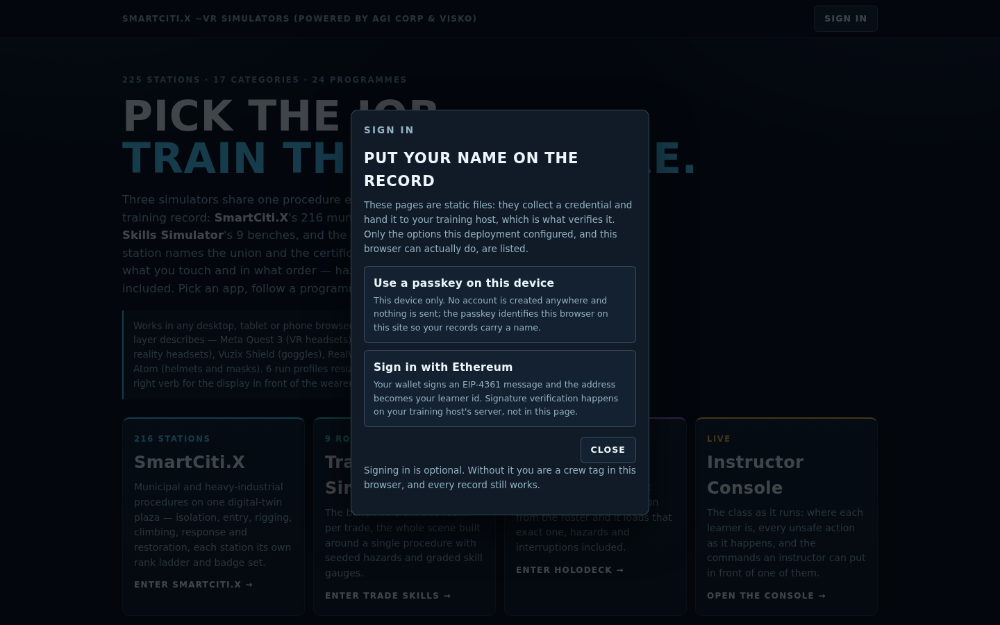
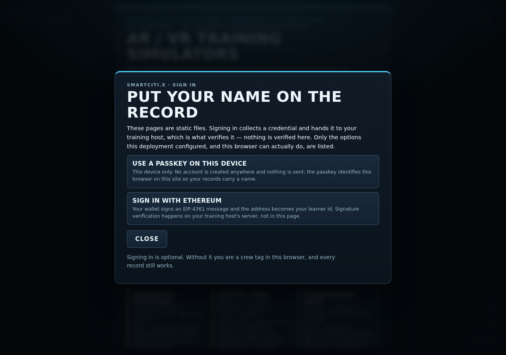
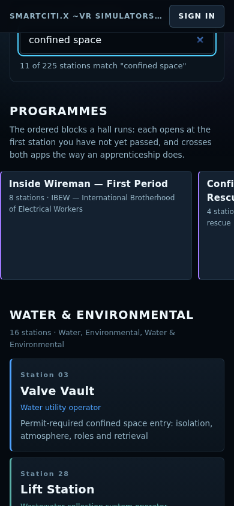

# Sign-in options — what each one does, and what it does not

**The plain statement first: these pages are static files, and a static page cannot verify identity by itself.** There is no server behind `WebXR/index.html`, `smartcity/index.html` or any bundle in `WebXR/dist/`. Nothing in this repository checks a password, validates a signature or decides that a person is who they say they are. What the sign-in dialog does is *collect a credential* from a provider the deployment configured and hand it, unaltered, to the page that hosts these apps. The host's server is what verifies it. Everything below follows from that one fact.

Without signing in, nothing breaks: a learner types a crew tag, and their attempts are recorded in that browser under that tag exactly as before. Signing in replaces the self-typed tag with a name and an id that came from somewhere, so a record can be attributed rather than claimed. The launch-URL and `postMessage` identity that an LMS already uses (`docs/proof-of-training.md`, `WebXR/shared/identity.js`) is unchanged and takes the same path; sign-in is a fourth way into the same `Identity`, not a parallel one.

Implementation: `WebXR/shared/auth.js`. Configuration: `WebXR/auth-config.json`. Checker: `tools/check_home.mjs`.

## The options

| Option | What the page does | What is verified, and where | What a deployment must configure |
|---|---|---|---|
| **Google** | Loads Google Identity Services, renders Google's own button, receives an ID token, and decodes it (not verifies it) for a display name and the `sub` claim. | Google signs the token. **Your host's server verifies the signature, audience and expiry.** The page cannot: it has no key and no clock it can trust. | `googleClientId` — an OAuth client id for the web origin the pages are served from. |
| **Microsoft** | Loads MSAL for browsers and runs the **redirect** flow: the learner leaves for Microsoft and comes back to the same URL, where the returned account and ID token are read. | Microsoft signs the token. **Your host's server verifies it** against your tenant. | `microsoftClientId` and `microsoftTenant` (a tenant GUID, or `common` / `organizations` / `consumers`). The page's own URL must be a registered redirect URI. |
| **E-mail link** | One `POST` of `{ email, returnTo }` to the endpoint you configured. That service mails a link; the link opens these pages with `?learner=…&learner_id=…&learner_home=…`, which is the existing launch-context path. | Your link service decides whether that address may sign in, and issues the link. The page verifies nothing; it only asks. | `emailEndpoint` — an `https` URL you operate. **With no endpoint configured, no request is made at all** and the option becomes the passkey below. |
| **Passkey (this device only)** | `navigator.credentials.create()` / `.get()` (WebAuthn) bound to this origin, with the label the learner types. | **Nothing is verified anywhere, and nothing is sent anywhere.** The passkey proves this browser on this site, which is enough to put a stable name on records that never leave the browser either. The UI says "this device only" wherever it appears. | Nothing. It is offered exactly when `emailEndpoint` is not configured and the browser exposes `PublicKeyCredential`. |
| **Wallet (Sign-In with Ethereum)** | Builds an [EIP-4361](https://eips.ethereum.org/EIPS/eip-4361) message — domain, address, statement, URI, version, chain id, nonce, issued-at — asks `window.ethereum` for `eth_requestAccounts`, then for `personal_sign`. The identity is the address the wallet returned. | The wallet proves control of a key to the *learner*. **Signature verification happens on the host's server, not in the page**: nothing here recovers the signer or checks the nonce, and the dialog says so in that option's own note. | Nothing, beyond an optional `walletChainId` and `walletStatement`. Offered only when `window.ethereum` exists. |

Each option's note in the dialog carries the relevant half of the third column, so a learner reads it at the moment they choose — not only here.

## What reaches the host page

On a successful sign-in, `auth.js` hands `Identity` the same four fields a launch URL gives (`name`, `id`, `homePage`, plus the `provider` it came from) and posts one message to the embedding page:

```js
{ type: "smartcitix:identity", learner, learner_id, learner_home,
  provider, token, tokenKind, verifiedBy }
```

`token` is the raw credential — the Google or Microsoft ID token, or `{ message, signature }` for a wallet — so Cognition.X, an LMS or a union hall's portal can verify it server-side and bind the training records that follow to a real account. `verifiedBy` is `"host-server"` or `"this-device-only"`, stated rather than implied.

The posting rules are `identity.js`'s and do not change: the message goes **only** to the origin given as `learner_home`, only when the page is embedded, and never to `*`. A deployment that configures no `homePage` gets no message — there is nowhere trusted to send it.

Signed-in state is kept under one versioned `localStorage` key, `vr-training-auth-v1`. **Sign out** removes it, clears the identity, and then offers to delete this browser's training records as a separate decision, because leaving a shared kiosk and discarding your own record are not the same act.

## The rule about endpoints

`auth.js` never contacts an endpoint that was not configured. Concretely:

- The only URL it reads unprompted is `auth-config.json`, relative and same-origin — the page's own folder.
- Every absolute URL it can ever reach lives in one `ENDPOINTS` table, and each is reached only from a branch that has already found the matching client id.
- The e-mail `POST` goes to the configured `emailEndpoint` and nowhere else; with none configured, the branch returns before any request.
- The passkey and wallet paths make no network request at all.

`tools/check_home.mjs` proves this twice: statically, that there are exactly three `fetch` call sites and no other network API in the file; and at runtime, by driving all five branches against an empty configuration with spies in place and asserting that not one request and not one script load was attempted.

## Configuring a deployment

Edit `WebXR/auth-config.json` (all values are `null` out of the box) or override per launch on the URL: `?googleClientId=`, `?microsoftClientId=`, `?microsoftTenant=`, `?emailEndpoint=`, `?walletChainId=`, `?learner_home=`. A value that does not clean — a client id with markup in it, an `http` endpoint that is not on localhost, a tenant that is not an id or a keyword — is dropped, which disables that option rather than half-configuring it.

Served over HTTPS in all cases: WebAuthn, Google Identity Services and MSAL all require a secure context, as does WebXR itself.

## What this does not do

- It does not authorise anything. No option grants access to a station, a record or an export; every page in this repository works signed out.
- It does not verify a signature, a token or an address. Three of the five options produce something a server must check, and the dialog names the server each time.
- It does not create accounts. There is no user store here — only the identity a host handed over, and the records in the learner's own browser.
- It does not read a wallet balance, request a transaction, or ask for any scope beyond `openid profile email`.

## Screenshots

The sign-in dialog and the homepage it opens from, at phone and desktop width:

<table><tr>
<td width="50%"><br><b>Homepage, phone width</b></td>
<td width="50%"><br><b>The dialog with nothing configured</b>: only a device passkey and a wallet, each labelled with where it is verified.</td>
</tr></table>

<table><tr>
<td width="50%"><br><b>The same options in the SmartCiti.X toolbar</b>, from the same module and the same configuration.</td>
<td width="50%"><br><b>The roster filtering live</b> on name, id, trade, category and standard.</td>
</tr></table>


**Homepage, desktop width.**
