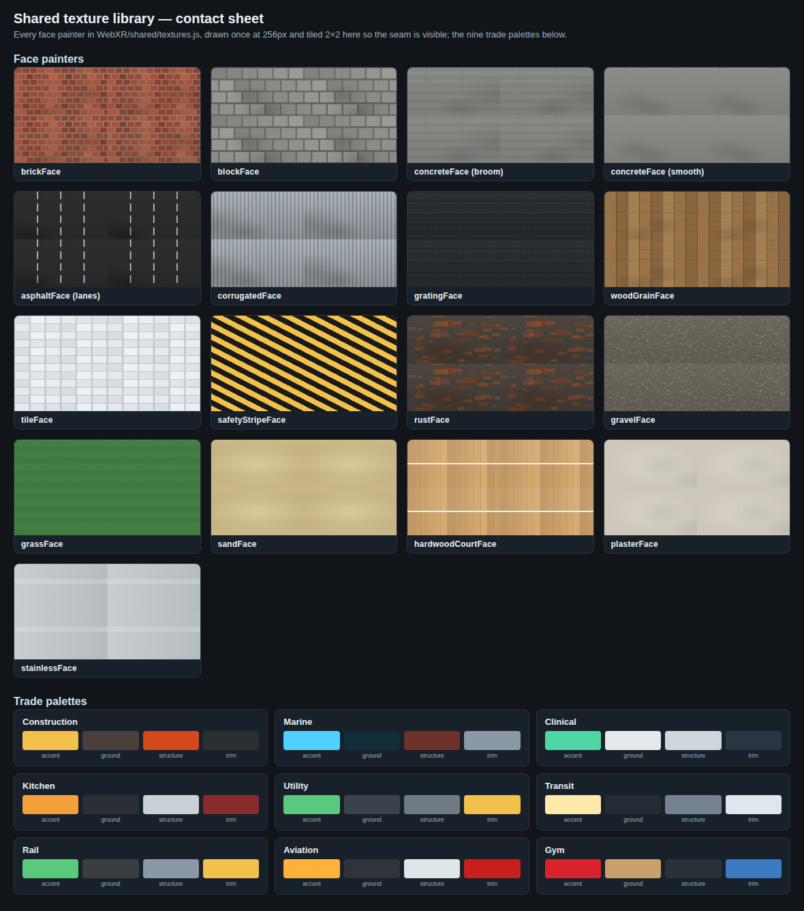
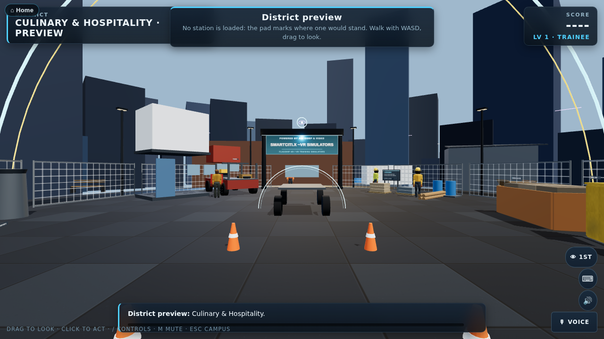
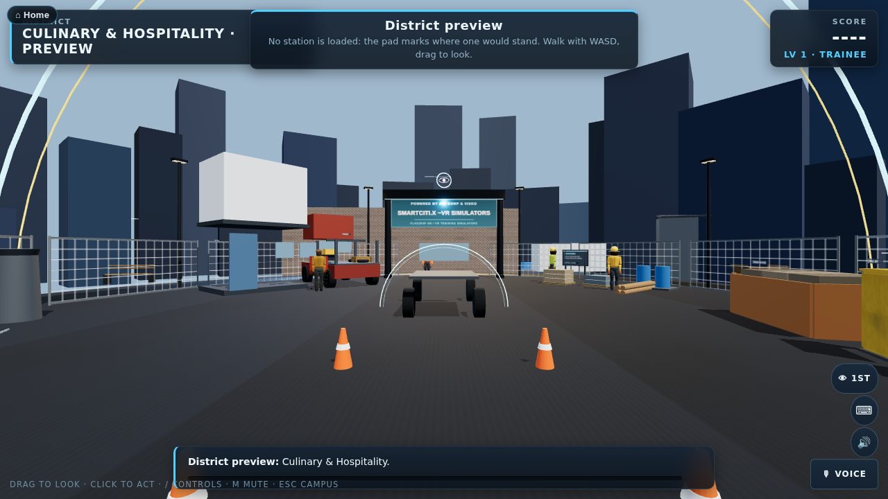
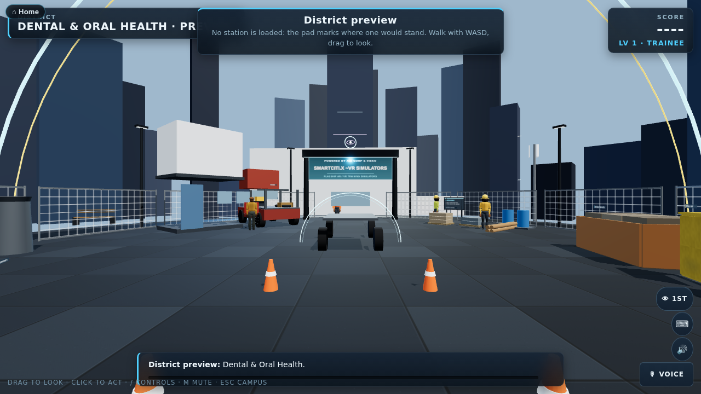
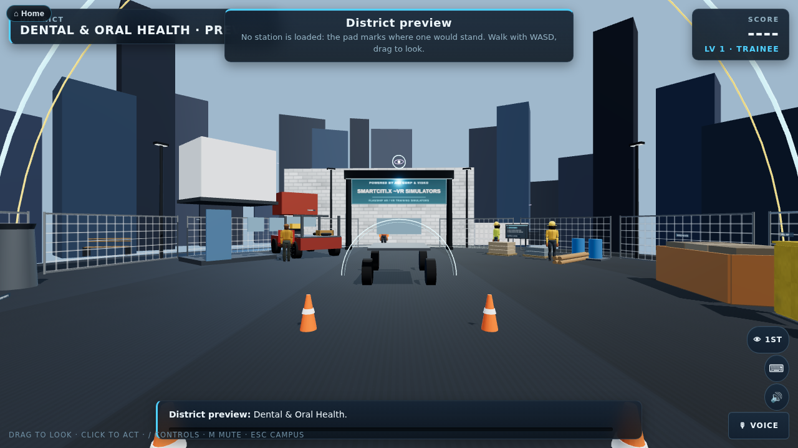
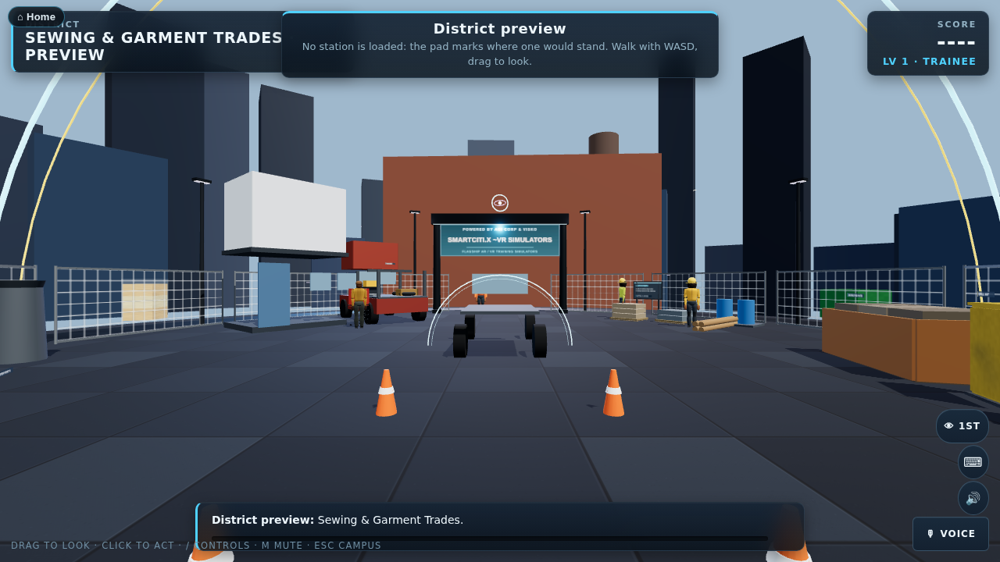
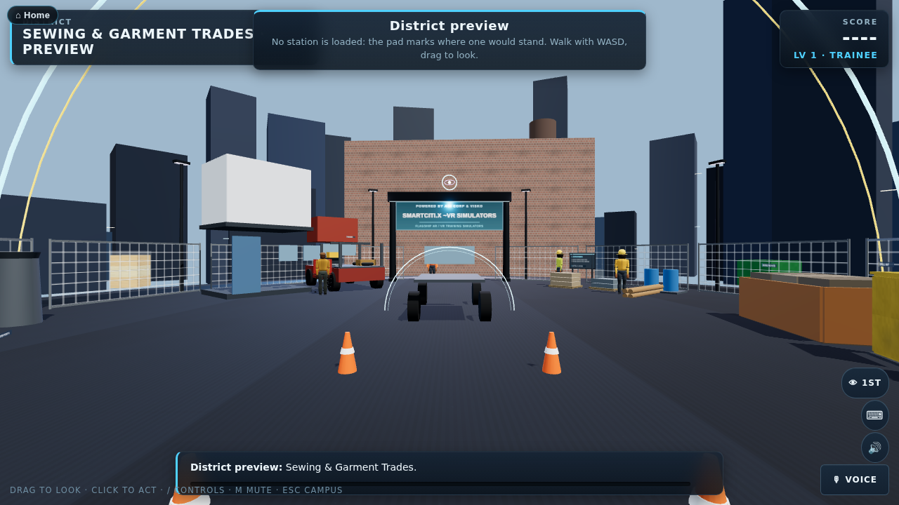

# Shared texture library

`WebXR/shared/textures.js` is the platform's procedural, tileable canvas texture
kit: sixteen face painters, a trade `palette()` helper, and a `facePaint()`
cache so the same painted canvas is never built twice. It sits alongside
`shared/kit.js` and `shared/fleet.js` as a fourth shared kit, and
`smartcity/js/citykit.js` re-exports everything in it (`export * from
"../../shared/textures.js"`) so any existing `import { X } from
"./citykit.js"` in a SmartCiti.X module keeps working unchanged. Shared
modules that cannot import a smartcity-specific file — `shared/props.js`,
`shared/fleet.js` — import straight from `shared/textures.js` instead.

Nothing here is fetched from a host: every pixel comes from canvas gradients,
fills and `Math.random()`, exactly like the district-specific painters
already in `citykit.js` (`pavingFace`, `waterFace`, `deckPlateFace`, …) that
this library is the general-purpose companion to — those stay where they
are; this file is for the surfaces every station's platform shares.



## The painters

Each painter is `(g, w, h, o) => void`: a 2D context, the canvas size in
pixels, and options. Every one is designed to tile — its pattern's pitch
(brick courses, plank width, stripe count, grid cell) divides the canvas an
integer number of times, so repeating the texture across a mesh never shows
a doubled or missing unit at the seam.

| Painter | What it draws | Notable options |
|---|---|---|
| `brickFace` | Running-bond brick, staggered courses, mortar joints, per-brick tone jitter | `rows`, `cols`, `brick` (tone array), `mortar`/`mortar2` |
| `blockFace` | Concrete-masonry block coursing — bigger units than brick, tooled joints | `rows`, `cols`, `block`, `joint`/`joint2` |
| `concreteFace` | Cast concrete, `finish: "broom"` (directional striations) or `"smooth"` (fine grain only) | `finish`, `tone`/`tone2` |
| `asphaltFace` | Dark asphalt aggregate; `lanes` paints dashed white lane lines | `lanes`, `base`/`base2` |
| `corrugatedFace` | Vertical corrugated-metal siding, ridge/valley shading, painted colour | `colour`, `ribs` |
| `gratingFace` | Steel bar grating / diamond-plate deck, a diamond lattice over dark steel | `cell`, `base`/`base2` |
| `woodGrainFace` | Painted plank boards, alternating tone strips, grain streaks | `planks`, `tones` |
| `tileFace` | Ceramic/quarry tile grid, grout lines, per-tile jitter | `tiles`, `tile`, `grout`/`grout2` |
| `safetyStripeFace` | Diagonal hazard stripes, yellow/black by default | `a`, `b`, `stripes` |
| `rustFace` | Oxidised steel, mottled rust patches over a dark metal base | `base`/`base2`, `patches` |
| `gravelFace` | Loose gravel / crushed aggregate, scattered multi-tone stone specks | `stones`, `base`/`base2` |
| `grassFace` | Mowed turf, green mottle with a mow-stripe alternation | `stripes`, `a`, `b` |
| `sandFace` | Fine sand with low wind ripples | `step`, `base`/`base2` |
| `hardwoodCourtFace` | Gym-floor maple strips along the run; `line` paints a court line across the boards | `planks`, `line`, `lineAt` |
| `plasterFace` | Painted plaster/stucco, trowelled low-frequency mottle | `base`/`base2` |
| `stainlessFace` | Brushed stainless, directional brush streaks, a soft sheen band | `base`/`base2` |

Every painter now also layers, on top of the pattern in the table: a broad,
seam-safe colour-variation pass (`noiseWash()`, below), material-specific
detail — aggregate specks in `concreteFace`, tar/crack-seal lines in
`asphaltFace`, longer fibre-grain streaks in `woodGrainFace`, rust bloom in
`corrugatedFace`, individual blade strokes under the mow stripes in
`grassFace`, wet-sheen bands in `sandFace` — and a scattered `edgeWear()`
pass standing in for scuffing and abrasion, tuned per material (very faint on
`safetyStripeFace`'s hazard tape and `stainlessFace`'s brushed panels, absent
grime on `grassFace`/`hardwoodCourtFace` where dirt streaks would look
wrong). `gravelFace`'s stone specks and `grassFace`'s blade strokes scale
with the canvas size, so a station's TEXTURE_RES tier changes how sharp they
look, not how large they are underfoot.

## Resolution and quality tiers

Every painter renders at a **selectable resolution**: `facePaint()`,
`paintTexture()` and `surfaceTexture()` (citykit.js) all default a painter's
canvas to `TEXTURE_RES` from `shared/perf.js`, and any call can still ask for
a specific size with `{ px }`.

| Tier | `TEXTURE_RES` | When |
|---|---|---|
| headless | 256px | No real `HTMLCanvasElement` to paint on — the content checkers, or any other Node run. Nothing here is ever actually shown, so the smallest tier is enough to exercise a painter's code. |
| low | 512px | A mobile browser's user agent (not a standalone VR headset's — Quest/PICO stay in the high tier), or `?quality=low` on the URL. |
| high | 1024px (default) | Desktop and VR/AR headset browsers, or `?quality=high`. |

`shared/perf.js` also exports `QUALITY` ("high"/"low", the same tier
`TEXTURE_RES` reads), which gates the one other resolution-adjacent
decision: at `QUALITY: "high"`, `facePaint()`/`paintTexture()` paint a small
companion canvas (a quarter of the main canvas, capped at 128px) from the
same tileable noise as the colour-variation pass, and `paintedMat()`/
`texturedMat()` attach it as a `bumpMap`/`roughnessMap` — a cheap,
procedurally derived bump/roughness variation with no separate authoring.
At `QUALITY: "low"` no companion canvas is painted and no material carries
one, exactly as before this existed. Pass `{ detail: false }` to opt a
specific call out of the companion canvas regardless of tier (a tiny decal
where it would never be visible, say).

Every canvas texture the kit paints — a painter through `facePaint()`, the
plaza ground and every district's facades through `surfaceTexture()`/
`texturedMat()`, `shared/kit.js`'s `decal()` panels and its per-finish
`surface()` maps — gets mipmaps and the *renderer's own* anisotropy ceiling
rather than a hardcoded guess: `smartcity/js/app.js` and `trades/js/app.js`
call `setActiveRenderer(renderer)` (from `shared/kit.js`) once, right after
creating their `THREE.WebGLRenderer`, and every texture reads
`renderer.capabilities.getMaxAnisotropy()` through it from then on
(`applyTextureQuality()` in `shared/kit.js`); before a renderer registers, or
under the headless checkers, it falls back to 8.

`noiseWash(g, w, h, o)` and `edgeWear(g, w, h, o)` (both exported, for a new
painter to use) are what the "layered multi-octave value noise" and
"edge wear" passes above actually are: `noiseWash()` reads a canvas's current
pixels, shifts each one a little by a multi-octave tileable value-noise
field (several random lattices, finer and fainter each octave, summed — the
same trick `shared/kit.js`'s per-finish `surface()` maps use for their
roughness/normal pair), and writes the result back; `edgeWear()` scatters a
handful of soft light/dark patches. Both tile by construction — every
lattice wraps its own index — not by the tolerance `tools/check_textures.mjs`
happens to allow. The octave math itself only ever runs at a small, fixed
grid (96px) and is then upsampled to the canvas's real size with one cheap
bilinear pass; evaluating it directly at a full 1024² canvas was measured at
several hundred milliseconds per painter and was an unacceptable stall the
first time a station needed its textures.

Material quality has one more piece beyond the map: consistent **environment
lighting**. `smartcity/js/stage.js` exports `LIGHTING_BY_TIME` — the
hemisphere colours/intensity and key-light colour/intensity for `night`,
`dusk` and `day` — and `buildStage()` reads it for every district (a
station's own accent wash and a district's own mast/rim colour still vary;
the *sun and sky* do not), so "night reads as night" is one tuning table
shared by all of them rather than one guess per district.

## `facePaint()` — the cache

```js
import { facePaint, brickFace } from "../../shared/textures.js";

const tex = facePaint("my-wall|0x7a4a3a", (g, w, h) => brickFace(g, w, h, { brick: [0x7a4a3a] }), { px: 256, repeat: 8 });
```

`facePaint(key, draw, o)` builds a `THREE.CanvasTexture` once per distinct
`(key, px, repeat)` — a painter/resolution pair renders once — and hands
back the **same texture instance** on every later call — a station that
paints six identical container walls, or a district that stands a dozen
bollards, costs one canvas draw, not six. Clone the result (`tex.clone()`)
before touching `.offset`/`.repeat` if the same painted canvas is needed a
second time at a different tiling — the pattern `districts.js` already uses
for its own caustic and water maps. `facePaintCacheSize()` reports how many
distinct canvases are live; `clearFacePaintCache()` empties it (a test
harness's tool, not something runtime code calls).

`paintTexture(draw, o)` is the builder behind `facePaint()` (draw, wrap for
tiling, mipmaps/anisotropy, the `QUALITY`-gated companion canvas) without
the caching — what `citykit.js`'s `surfaceTexture()` calls for the plaza
ground and every district's facades, since those draw closures capture
fresh per-call colours and options and have nothing stable to cache on.

`paintedMat(tex, o)` wraps a texture in a tuned `MeshStandardMaterial`,
attaching the bump/roughness companion canvas above when the texture has
one — the same contract as `citykit.js`'s own `texturedMat()`, which is now
a one-line wrapper over it, so `props.js`/`fleet.js` never have to reach
into a smartcity-specific file and every district's facade material gets
the same treatment as a painter used directly.

### Drop-in tiles

Every painter draws procedurally — nothing here is fetched from a host, and
no painter ships a real photographic or PBR tile today (the account this
repository was built under has none of its image-generation credit left to
make one). If one is generated or licensed later for a painter, dropping the
file at `WebXR/assets/textures/<id>.jpg` and naming it in that directory's
`manifest.json` (`file`, `licence`, `provenance`; see its README) is enough:

```js
import { facePaint, brickFace, loadTextureManifest, externalTileFor, tileIdFor } from "../../shared/textures.js";

const manifest = await loadTextureManifest(); // fetched once, cached
const tile = externalTileFor(manifest, tileIdFor(brickFace)); // -> {url, licence, provenance} or null
const tex = facePaint("brick-wall", brickFace, { tile }); // uses the image instead of the canvas when tile is set
```

`facePaint()`/`paintTexture()` load `tile.url` with `THREE.TextureLoader`
instead of drawing the canvas when `o.tile` resolves to one — the painter
function, its cache key and every existing call site stay unchanged, only
where the pixels came from does. `PAINTER_TILE_IDS` lists the sixteen ids;
`tileIdFor(draw)` reads a painter function's own name back to its id.
Nothing calls this automatically today — the same seam
`shared/signage.js`'s `loadBrandManifest()`/`brandFileFor()` already keep,
unused, for a licensed union logo — an app opts in once it actually has a
tile to offer.

## `palette(name)` — trade colour sets

```js
import { palette } from "../../shared/textures.js";
const p = palette("construction"); // { accent: 0xf2c14b, ground: 0x4a3f3a, structure: 0xd24a1c, trim: 0x2b2f33 }
```

Nine named trade palettes — `construction`, `marine`, `clinical`, `kitchen`,
`utility`, `transit`, `rail`, `aviation`, `gym` — each exactly
`{ accent, ground, structure, trim }`. An unknown name falls back to
`construction` rather than throwing, and every call returns a fresh object,
so a caller's edit never leaks into the shared table. `PALETTE_NAMES` lists
the nine.

## Where it is applied

Textures cost no meshes — every application below swaps a material on a
mesh that already existed, so `tools/check_budget.mjs`'s per-station and
per-district mesh counts are unchanged:

- **The plaza ground** (`smartcity/js/stage.js`) — the inner paving disc now
  draws with `concreteFace({ finish: "broom" })` in place of a duplicate
  `pavingFace` call, giving the slab visible directional striation under
  raking light.
- **District facades and grounds** (`smartcity/js/districts.js`) —
  `restaurantRow` and `garmentLoft`'s main building boxes are `brickFace`,
  `clinicBlock`'s is `blockFace`; the gym-court's side/end walls swap their
  old ad hoc block painter for the shared `blockFace`; the coating store's
  ground pad is `asphaltFace`; the tower crane's boom/mast colour is pulled
  from `palette("construction").accent` instead of a bare hex literal.
- **The props kit's big surfaces** (`shared/props.js`) — `jerseyBarrier`'s
  panel is cast concrete via `concreteFace` under its reflective tape;
  `shippingContainer`'s corrugated skin and `siteOffice`'s wall panel both
  draw with `corrugatedFace`.
- **The fleet's hull and trailer sides** (`shared/fleet.js`) — the spud
  barge's hull-side panel is `rustFace` under its tinted paint wash and
  stencilled name/draft marks; the flatbed trailer's deck planking is
  `woodGrainFace`.

Three districts before/after this change, screenshotted headless at the
same spawn view (`?district=<name>&time=day`):

| District | Before | After |
|---|---|---|
| Culinary & Hospitality |  |  |
| Dental & Oral Health |  |  |
| Sewing & Garment Trades |  |  |

## Checked by `tools/check_textures.mjs`

Part of `check_all.mjs`. It holds the library to:

- every painter draws against the same stubbed 2D context the other content
  checkers use, at 128/256/512px (256 being what `TEXTURE_RES` itself picks
  headlessly) and with its documented option variants, without throwing;
- every painter **tiles**: rendered on a small software raster context (no
  native canvas package here — the checker implements just enough of the
  canvas 2D API, including `getImageData`/`putImageData`, to get real
  pixels and actually exercise `noiseWash()`/`edgeWear()` rather than have
  them silently no-op), its left edge's average colour is close to its
  right edge's, and top close to bottom, within a generous tolerance
  (60/255 per channel) that accounts for the random grain and grime every
  painter also layers on;
- `facePaint()`'s cache actually dedupes — the same `(key, px, repeat)`
  never redraws its canvas, a different key, repeat or resolution does, and
  `clearFacePaintCache()` empties it;
- the **resolution switch** is honoured — `TEXTURE_RES` reads 256 with no
  real canvas to paint on, an explicit `{ px }` always wins, and a
  different `{ px }` for the same key is a new cache entry;
- the **drop-in tile manifest** (`WebXR/assets/textures/manifest.json`) has
  exactly one well-formed `{file, licence, provenance}` entry per painter
  id, a named file is actually present with both a licence and a
  provenance recorded, no image ships without an entry naming it, and
  `loadTextureManifest()`/`externalTileFor()` parse and resolve one
  correctly against a mocked fetch;
- `palette()` returns exactly the four keys for all nine documented trades,
  falls back to `construction` for an unknown name, and hands back a fresh
  object each call.

## Adding a painter

1. Write `export function myFace(g, w, h, o = {}) { … }` in
   `shared/textures.js`, using `gradientFill`/`noiseTexture`/`grimeOverlay`
   from `kit.js` where they fit. Keep any pattern's pitch a divisor of the
   canvas size so it tiles.
2. Call it through `facePaint()` (or `surfaceTexture()`/`texturedMat()` from
   `citykit.js` for SmartCiti.X-only code) rather than building a
   `CanvasTexture` by hand.
3. Run `node tools/check_textures.mjs` — it exercises the new painter
   automatically (every export in the harness list needs adding there too).
4. If the painter's module is now pulled into a browser bundle that did not
   carry `shared/textures.js` before, add it to that app's `"modules"` list
   in `tools/bundle_webxr.py` (right after `kit.js`, before `fleet.js`) and
   to any headless checker's own module list that builds the file calling
   it — `tools/check_imports.mjs` and a bundler run
   (`python3 tools/bundle_webxr.py`) both catch a miss.
