# SmartCiti.X — a white paper, second revision

_Union-trade AR/VR procedure training that runs in a browser, proves what it scores, and says plainly what it has not yet proven._

_Second revision, written 2026-09-23 from the repository as it stands at the end of that day; the first revision, written earlier the same day, is kept beside it as `SmartCitiX-Whitepaper.md`. Every number in this paper is read from a file in the repository — `WebXR/smartcity/catalog.json`, `tools/check_all.mjs`, `tools/standards.json`, `tools/eval_content.mjs`, `docs/ladders.md`, the READMEs and the `docs/` tree — and the file is named beside the number where it matters. Where the repository says a thing is unverified, assumed or a stub, this paper says so in the same words. Nothing here names a customer, a revenue figure, a partner agreement or a quotation, because the repository holds none._

---

## Contents

1. Executive summary
2. The problem
3. The current version
4. The stack
5. Compliance and safety posture
6. Roadmap
7. Questions and answers
8. A letter to prospective investors
9. Appendix

---

## 1. Executive summary

SmartCiti.X is a network of browser-based AR/VR training simulators for union trades and the work that stands beside them: community science, public health, public life, job readiness. A learner opens a web page, walks into a generic but fully dressed job site, and works a real ordered procedure — a lockout, a confined-space entry, a chairside turnover, an air-brake test, an isolation-ward setup — with their hands. The engine scores every touch, seeds real hazards, interrupts the learner mid-step with the kind of event that actually hurts people, and writes an auditable record. There is no server to stand up and no app store: the whole thing is static files served over HTTPS.

By the numbers, as the catalog records them at the close of 2026-09-23: **316 procedures** (307 SmartCiti.X stations, of which five are flat sourced briefings, plus the 9 rooms of the sibling Trade Skills Simulator) across **17 trade categories**, organised into **29 training programmes**, each naming a real union and the standards the block maps to. Together they hold **4,125 scored steps**, **1,282 seeded hazards** and **618 interruptions**. Every station cites at least one entry in a **standards registry of 320 entries across 88 publishing bodies**, of which 261 carry a citation form the authors are sure of and 59 are carried as body and title only, marked unverified. A **competency layer of 39 competencies** over 304 distinct stations and 69 standards sits above the game badges and applies one stated mastery rule. Every programme is also a **ten-level ladder**: 290 levels, 256 of them at or over the fifty-step bar and 34 flagged partial, gated by the same mastery rule. **33 headless checkers** gate every commit; the content evaluation ranks the corpus at a **mean of 96 out of 100** over all 316 procedures. **33 head-worn device profiles** in five classes decide how a station renders on hardware from a Quest to a hardhat monocular. Three input layers — keyboard, gamepad and voice — are checked so that nothing spoken can complete a step. A **flow layer** lets a host platform hand over an ordered graph of stations, gates and check-ins and hear back every transition. A **homepage** generated from the catalog links every station, and a **sign-in layer** collects a credential from Google, Microsoft, an e-mail link, a device passkey or an Ethereum wallet and hands it to the host to verify.

Since the first revision of this paper, written earlier the same day, the roster grew from 235 to 316 procedures and from 24 to 29 programmes. Five programmes opened and filled in that window — Civic Leadership and Emotional Intelligence, Property Management in twenty zones, Outbreak and Disease Response under WHO and UN practice, the Job Readiness Edition for the wojrc.org programmes, and the Bay Area Union Edition — along with the ladder layer, the homepage and sign-in, two scenic stage districts (a Golden Gate Bridge deck and a bay-floor dive scene), thirty-five registry entries and three checkers.

What it proves today is narrower than what it contains, and the repository is careful to say so. Records are held in the learner's browser until exported as CSV, xAPI 1.0.3 or Open Badges 2.0; the badges are self-asserted until a hall hosts them. Sign-in collects a credential and verifies nothing: `docs/sign-in.md` opens with "a static page cannot verify identity by itself." Identity is a launch context handed in by an LMS, a URL or the sign-in dialog, not authentication; the one server in the repository, an LTI 1.3 relay, verifies a signed launch and has been proven against a stand-in platform, not registered with a real one. The practitioner review packet shows an automated preview pass on every section and a practitioner sign-off on none, and its roster is stale at 235. No headset performance pass has been recorded, though the instrument to record one exists. The adaptive-content client (Orbis-Stable) and the Holodeck's prompt interpreter are seams with no live model behind them. The flow contract is specified from this side only: no Cognition.X end has been tested against it. The two scenic districts are built and checked, and no station stands in either yet. The bridge and underwater packs, the fleet and signage kits and the `drive` step kind exist as briefs. The running app is published as a private page, shared on request.

The case for funding or adopting it rests on three things the repository does demonstrate: a deterministic engine whose scoring, pass rule and mastery rule are stated once in code and read everywhere; a content corpus built and checked at scale, with the tooling to grow it by eighty stations in a day without the gate going red; and a habit of writing down what is unverified rather than papering over it. The roadmap is ordered by dependency, and the letter at the end says what money would buy in that order.

---

## 2. The problem

### Union and trade training today

A journeyman is made by doing the job beside someone who already knows it, and a union training centre — a JATC, a training fund, a hall — exists to make that safe and repeatable. The repository's own framing of the gap is in `WebXR/shared/incidents.js`: "A toolbox talk is somebody reading out what went wrong on the job and the crew nodding. Nobody rehearses it, so the next crew meets the same event cold." The procedures that kill people are written down in OSHA subparts, NFPA documents and apprenticeship standards, and taught from slides, because the only place to rehearse a chlorine leak or a lock coming off a hasp is the one place nobody should.

The training centre's other problem is proof. A safety director does not sign a game score; what they sign, in the words of `competency.js`, is "a named thing a journeyman can do, tied to the standards a body actually publishes, demonstrated by passing named stations under one stated rule that never bends."

The same two problems appear, in different clothes, in the work the newer editions cover. A pre-apprentice heading for a Class A licence rehearses an air-brake test from a handbook. A public-health worker learns to don and doff PPE for an isolation ward from a poster. A newly appointed commissioner learns the open-meeting law by breaking it once. In each case the procedure is real and written down, the consequence is real, and nobody rehearses the moment while their hands are busy.

### What a simulator has to prove

The repository's design documents set out the bar a simulator has to clear before its records mean anything, and it is a useful list because it is the list the platform is built against:

- **Order is assessed, not suggested.** Reaching for a later step's control is its own scored mistake with a trade-specific reason (`WebXR/trades/README.md`). A quiz with a 3D background does not do this.
- **Hazards carry consequences.** Every station seeds real traps — another worker's padlock, a water jug beside a grease fire, a production credential next to the staging ones — and touching one costs double and explains what would have happened.
- **The dangerous thing is not the procedure.** `WebXR/smartcity/README.md`: "Every step kind in this engine asks the same question: do you know what comes next. That is worth assessing and it is not what gets people hurt. What gets people hurt is the thing that happens while they are busy." A simulator has to interrupt the learner and score whether they noticed.
- **The second attempt has to still measure something.** `variants.js`: a learner who repeats a station "learns the answer key … and the score stops measuring competence and starts measuring recall."
- **Progression has to be earned by the same rule that earns the credential.** The ladder brief: "Level gates use `shared/competency.js`'s mastery rule; nothing else unlocks a level."
- **The record has to be attributable and exportable** to the formats a hall, an HR system and a Learning Record Store already accept.
- **Nothing may be invented.** The station brief that every authoring team reads (`tools/briefs/station-brief.md`) forbids naming a real site, a real person, or "a clause number you are not sure of — name the body instead." The ladder brief extends the rule to organisations: a real person or organisation named in content "is described only from sources in the repo or reachable on the network at build time; otherwise the content states the principles generically and marks the attribution 'not sourced in this repository'." A drill that teaches an invented clause on a union floor, as `incidents.js` puts it, "is how a platform loses a hall."

### Why headset fleets fail in the field

The device guide (`docs/devices.md`) is unusually direct about the hardware problem. The head-worn devices a site crew actually wears "are mostly assisted-reality or optical see-through systems whose browsers offer no immersive WebXR session," and the headsets a training centre buys for its classroom "are a second, different fleet." A procedure "that renders a full plaza with rain at 2× pixel ratio behind a 28px HUD is unreadable on an 854-pixel-wide monocular display clipped to a hardhat" (`WebXR/shared/devices.js`).

Three further failure modes the repository names:

1. **The device is not PPE.** "A smart glass is not automatically safety eyewear," and a VR headset "is never worn with a hardhat." Vendor safety statements are recorded as claims to verify, never as certification.
2. **Detection lies.** Apple's Safari on visionOS "sends a desktop-Mac user agent on purpose"; PC-tethered headsets show the PC's browser. A wrong guess must change only the rendering profile, never the procedure.
3. **Nobody has measured it.** The README lists the Meta Quest headset pass as not yet done: "the instrument to record that pass now exists (`?perf=1`) … the numbers do not."

---

## 3. The current version

### 3.1 By the numbers

All counts are from the generated catalog (`WebXR/smartcity/catalog.json`, `generatedAt` 2026-09-23), the output of `node tools/check_all.mjs` and `node tools/eval_content.mjs` run at the close of the same day, `tools/standards.json` and `docs/ladders.md`. Several pages carry older counts — `docs/STATUS.md` (225 procedures, 29 checkers), the generated series page (226 stations, 24 programmes), `WebXR/smartcity/README.md` (216 and 225) and the review packet (235) — and need regenerating; the catalog and the checkers are the current source.

| Measure | Value | Source |
|---|---|---|
| Procedures in the shared catalog | 316 (307 SmartCiti.X + 9 Trade Skills rooms) | `catalog.json` |
| Flat (non-walkable) briefing stations | 5 — Hunters Point Briefing, Can We Live?, Civic Principles Briefing, Trades Lineage Briefing, Reading an Apprenticeship Standard | `catalog.json` `flat` |
| Trade categories | 17 | `catalog.json` `categories` |
| Training programmes | 29 | `catalog.json` `curricula` |
| Scored steps across the roster | 4,125 (median 13 per station; range 8–16) | `catalog.json` |
| Seeded hazards | 1,282 | `catalog.json` |
| Interruptions | 618 across 309 procedures, every one visibly changing the scene | `check_interrupts.mjs` |
| Step kinds | 8 — select, sequence, find, gauge, hold, track, turn, drag | `shared/game.js` |
| Weather kinds | 7 — clear, overcast, rain, fog, wind, storm, smoke | `catalog.json` `weather` |
| Indoor stations / interior styles | 166 / 10 (plant, service, shop, garage, theatre, datahall, kitchen, clinic, hotel, bar) | `catalog.json` |
| Scenic stage districts | 2 — `golden-gate-deck` (53 of 120 meshes), `bay-underwater` (25 of 120); no station placed in either yet | `check_districts.mjs` |
| Headless checkers | 33, all passing | `tools/check_all.mjs` |
| Content-eval corpus mean | 96 / 100 over 316 procedures | `tools/eval_content.mjs` |
| Standards registry | 320 entries, 88 bodies; 261 verified citation form, 59 unverified | `tools/standards.json` |
| Competencies | 39 (29 programme, 10 core) over 304 stations and 69 standards | `check_competency.mjs` |
| Ladders | 29 programmes × 10 levels = 290 levels; 256 at or over 50 steps, 34 partial | `docs/ladders.md`, `check_ladders.mjs` |
| Flows | 3 example flows; platform protocol 2; observer protocol 3 | `WebXR/flows/`, `check_flowhub.mjs` |
| Device profiles | 33 devices, 6 run profiles; 22 detected by user agent, 11 URL-only | `check_devices.mjs` |
| Device classes | monocular 8, goggle 9, helmet 3, mr 2, vr 11 | `check_devices.mjs` |
| Input methods | 5 keyboard presets × 13 actions; 15 gamepad buttons + 2 sticks; 26 voice commands | `check_input.mjs` |
| Sign-in options | 5 — Google, Microsoft, e-mail link, device passkey, Sign-In with Ethereum; all configuration null by default | `docs/sign-in.md`, `check_home.mjs` |
| Apps and pages | SmartCiti.X, Trade Skills Simulator, Holodeck, portal, homepage, instructor console, credential verifier; plus the older Safety Campus companion page | `WebXR/` |
| Global level ladder | 33 levels in 9 named tiers, shared by three apps | `shared/game.js` |
| Mesh budget | 320 per SmartCiti.X station, 430 per Trade Skills room; all 316 inside | `check_budget.mjs` |
| Shipped binary models | 1 (`guide-worker.glb`, CC-BY 4.0) | `check_models.mjs` |
| Commits | 245 on the working branch, from 2026-07-17 to 2026-09-23; 26 on the last day | `git log` |

Stations by category (catalog, 2026-09-23): Community Environmental Justice 51; Culinary & Hospitality 33; Emergency Services 31; Dental & Oral Health 30; Building Systems & Facilities 28; Maritime & Ports 23; Mobility & Transit 16; Water & Environmental 16; Environmental Monitoring 15; Manufacturing & Automation 14; Construction & Structural Trades 13; Energy & Power 12; Sewing & Garment Trades 10; Trade Skills Simulator 7; Entertainment & Live Events 7; Connectivity & Telecom 6; Surface Prep & Coatings 4. The SmartCiti.X README states the growth target as 33 stations per category; two categories have reached or passed it.

The 29 programmes: Inside Wireman — First Period (8 stations); Confined Space — Entry and Rescue (4); Working at Height — Fall Protection (5); Hazmat and Environmental Response (6); Rigging and Lifting (5); Stationary Engineer — Building Plant (5); Port and Terminal Operations (4); Transit and Ramp Operations (5); Energy Transition Systems (5); Live Events Production (4); Hunters Point Clean-up and Bay Restoration (26); Culinary — The Working Kitchen (16); Dental Hygiene — Unspoken Smiles (16); Dental Careers — Unspoken Smiles (16); Civic Leadership and Emotional Intelligence (11); Property Management — Twenty Zones (21); Outbreak and Disease Response — WHO and UN Practice (11); Job Readiness Edition — wojrc.org programmes (26); Bay Area Union Edition — Sheet Metal, Bridge, Port and Marine (20); Bartending — Behind the Bar (16); Hunters Point Edition — Can We Live? (26); Sewing and Garment Trades (11); Bridge and Structural Trades (4); Hotel Workers — Back of House (4); Builders — Carpenters, Laborers and Masons (4); First Responders — Fire, EMS, Police, Crisis and Relief (16); Situational Awareness — Interruption Drill (22); Ports, Maritime and Bay Ecology (11); Air Quality — Monitoring and Control (6). Every programme carries the same completion rule: "every station has a passing attempt (stars >= 2, no unsafe action)."

### 3.2 The procedure engine and the step kinds

`WebXR/shared/game.js` is the one engine every app runs. Its header states the contract: "A room supplies an ordered list of steps. The engine owns correctness: it decides whether an interaction advances the procedure, applies score, and produces the coaching line the HUD shows. Rooms never score themselves, so the assessment stays deterministic and auditable — the same contract the Unity build uses."

Eight step kinds cover what a hand does on a job. **select** is a single correct control; **sequence** is an ordered set; **find** is a set in any order; **gauge** is an analogue setting scored inside a band, so "just barely right" and "dead centre" differ; **hold** must be held for its seconds and restarts if released early (the 20-second handwash, the post-weld fire watch); **track** is a drifting reading the learner keeps in band; **turn** is a valve or handle rotated through its turns; **drag** is pick-and-place onto a target. The station brief requires 12–15 steps over at least five kinds per station, with a `why` on every step whose median length is at least 200 characters and states "the consequence or mechanism a journeyman would give; never padding." The newer briefs raise the bar to six kinds and at least one of drag, turn, gauge or track per new station.

A ninth kind is specified and not built. `tools/briefs/assets-brief.md` describes **drive** — a vehicle controlled along a declared path, "scored continuously like `track` on lane deviation and speed band, with discrete check events (mirror, signal, horn, gear) the learner must trigger at marked points" — for the Class A driving stations. The brief is in the repository; `game.js` still has eight kinds, and the five Class A stations that shipped are built from those eight.

Scoring constants are exported once and read by everything else: 100 points per correct step times the combo; a wrong control costs 25; a registered hazard costs 50 and is recorded as an unsafe action; the combo climbs 0.1 per clean step to a cap of 2.0×; finishing under par adds 2 points per second saved. Stars, not score, decide whether a run counts: three for no corrections inside par, two for at most one correction inside 1.5× par, one otherwise.

### 3.3 Interruptions

An interruption "is not a step. It arrives unannounced partway through a step the learner is already working, it runs on its own clock, and the learner has to break off, deal with it and come back." Every walkable station is required to carry two. Scoring is deliberately asymmetric: catching one is worth 120 points plus up to 60 for speed, "because noticing is the harder thing and the one nobody practises"; missing one, or answering with the wrong control, counts as an unsafe action and lands on the same field the pass rule and badges read. "A run can be procedurally perfect and still fail on the alarm it slept through, which is the point."

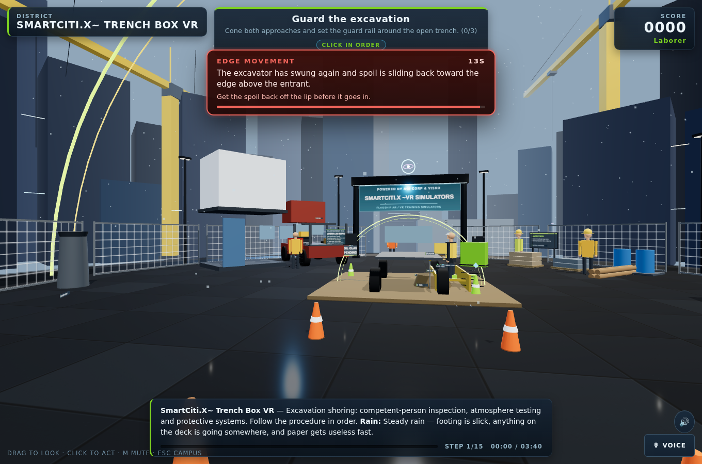

Two rules are enforced by `tools/check_interrupts.mjs`: an interruption must visibly change the world (a fan stops and its lamp goes red; a lock is gone from the hasp) — "an alarm you can only read is a caption" — and its answer must not be the control the learner is already holding, because "that is not an interruption, it is a nudge." 618 interruptions across 309 procedures pass these rules today. The **Situational Awareness — Interruption Drill** programme collects 22 stations a learner may already know and reports an `attention` figure — interruptions caught against dropped — separately from the station count, because "passing the procedure and noticing the alarm are two different competencies." The ladder layer adds a third use: every level from 7 upward must carry at least one declared interruption, so that an instructor can queue one for a task still to come.

### 3.4 Hazards

Every walkable station seeds four hazards on registered objects (the brief's requirement; the corpus holds 1,282). Touching one costs 50 points, is recorded as an unsafe action, and explains its consequence in text the accessibility checker requires to be a full sentence. In the five flat stations the hazards are unsafe conclusions rather than objects — "treating a parcel as open ground, swapping a clean sample, silencing a dust monitor, dismissing the community's monitors" in the Hunters Point pair; in the newer three, attributing to an organisation a claim its own text does not make — scored on the same engine. The instructor console can switch a session between **Assess** (an unsafe action counts) and **Coach** (called out once, taken back off the count); the choice is written onto the record as `hazardMode`, and a level-10 capstone ignores it.

### 3.5 The emotional-intelligence guide and the check-in

`WebXR/shared/ei-guide.js` decides the tone of what is said around a score. Its rule set is the one "a good peer-support trainer follows: name what happened in one plain sentence, say what to do next, never blame, never minimise, and after a hard run ask how the person is and point at the real support line." The file's own example: a first responder who missed a Mayday "does not need 'Unsafe action detected'. They need 'You missed the Mayday while the line was stretched. Next time, the radio wins. Reset and go again.'"

Every results card ends with an unscored check-in — "How are you doing after that run?" with three answers, Steady, A bit shaken, Need a minute — and a rough run adds the pointer to the local's peer-support or EAP line (`supportLine`). Answers are stored only in the learner's own browser, never transmitted, and are not part of any export (`docs/ei-guide.md`). The First Responder series brief makes the human side procedure rather than decoration: the words said to a person in crisis, the check on a partner and the debrief are scored steps, and the interruptions are "the human ones: a bystander filming, a partner freezing, a family member arriving." The Job Readiness Edition's four wellness stations and the Civic Leadership programme's mediation, listening-session and mentorship stations are written to the same rule.

### 3.6 Pre-brief and debrief

The first run of any walkable station opens on a **pre-brief**: the procedure as study material, every step and its reason, the union and certification, and how many hazards are seeded — never which. Reading it earns the Prepared award and a 10% score bonus; skipping costs only that. The README calls it the flipped classroom: "learn the procedure first, then prove it in the simulator." A level-10 capstone offers no pre-brief.

At the other end, the **step debrief** times every step and shows one row per step on the results screen, toned clean, corrected or unsafe, with two lines naming the step that took longest and the step that gave the most trouble — "the two an instructor asks about first." The step log persists on the record and is mapped into xAPI result extensions.

### 3.7 Gamification, and the competency tier above it

The motivational layer is deliberately separate from the proof layer. Each station has its own five-tier rank ladder tracked by its own XP; one account-wide level runs 1 to 33 in nine trade-apprenticeship tiers (Trainee through Apprentice, Journeyworker, Technician, Specialist, Foreman, Master, Certified Master and Legend at 33), shared by SmartCiti.X, Trade Skills Simulator and Holodeck; leaderboards are per station and per device, "arcade-cabinet style." Three stars earn a station's badge.

Above that sits `WebXR/shared/competency.js`, "the sober tier above the badges." A competency is "a named thing a journeyman can do, tied to the standards a body actually publishes, demonstrated by passing named stations under one stated rule that never bends." That rule is the mastery rule, stated once in code and quoted in full in the appendix: two or more stars, zero unsafe actions, every interruption answered, and time within 1.5× par. One mastery run on enough of a competency's stations earns *demonstrated*; mastery runs on three different days earn *consistent*. "No other rule earns a competency. There is no partial credit, no curve, and no second rule for a learner who nearly made it." A near miss is reported with the first reason it fell short, in a fixed order, "because a learner who touched a live bus and also ran long needs to hear about the live bus."

There are 39 competencies: 29 programme competencies that mirror the curricula blocks one for one (a checker fails the build if they drift), each requiring mastery on half its stations capped at six, and 10 cross-programme core competencies — fall protection, lockout/tagout, confined space, hot work, trenching, crane and rigging, respiratory protection, hazard communication, emergency response and trauma-informed practice — that name their required count outright. A competency is dated by its evidence, so an exported badge is issued on the day it was earned rather than the day somebody pressed export.

### 3.8 Ladders: ten levels per programme

The newest layer, landed on 2026-09-23, turns every programme into a ten-level ladder. `docs/ladders.md` is generated by `tools/gen_ladders.mjs` from `curricula.js` and the real station modules — "every number here is read from the real station modules through the same headless harness the checkers use … so a level's step total is never typed by hand" — and reports **29 programmes · 290 levels · 256 at or over 50 steps · 34 partial**.

A **level** is an ordered chain of tasks run back to back with one shared score, one results card and one badge; a **task** is a station run in full. How a level is built is stated in the generator's header and repeated in the doc: stations are sorted by difficulty (par minutes + 0.5 × steps + 1 × hazards + 2 × interruptions), each gets a home band 1–9 by its place in that order, and level N chains its band's stations with the next-nearest by difficulty until the tasks total at least 50 steps. Levels 1–3 are orientation and single procedures, 4–6 the same under interruptions and weather, 7–8 multi-station chains that must carry a declared interruption so `CMD_INTERRUPT` has something to fire, 9 a full shift of at least five tasks. Level 10 is the capstone: "the programme's hardest three stations, or four when three do not reach 50 steps, run with no coaching under the mastery rule" — no hint ring, no pre-brief, coaching mode ignored. Hand-tuned entries live in `ladders.overrides.json` and win over the generated level they name; totals and standards are recomputed from whatever tasks the override names.

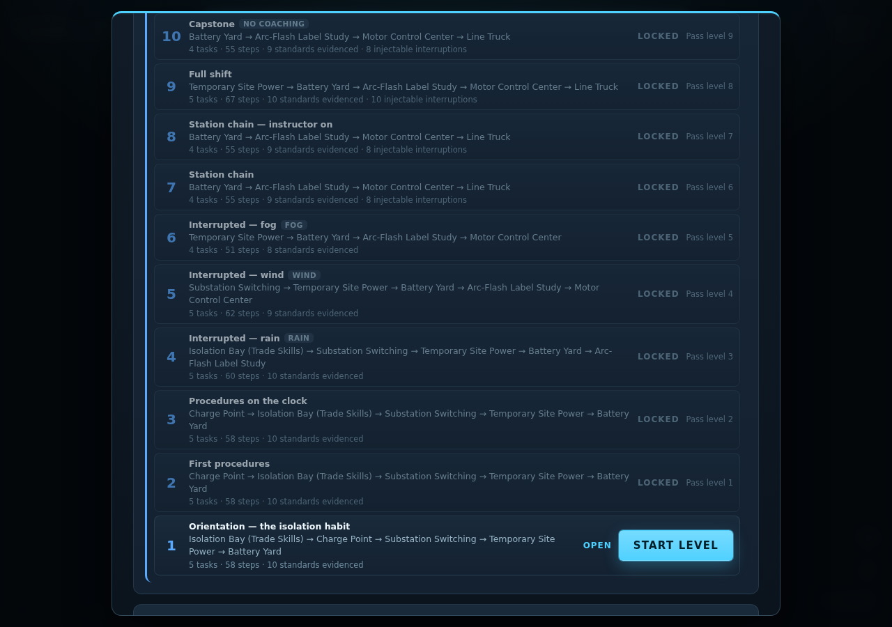

Who passes is decided in `WebXR/shared/ladder.js`, whose only import is the mastery rule: "A level PASSES when one run of it has a mastery run (competency.js's MASTERY, nothing else) on every one of its tasks. Level 1 is always open; level N opens when level N−1 has passed. No other path unlocks a level — not an instructor, not a score, not a streak." Each attempt played inside a level carries a `ladder` tag on its training record, "which is how the record, not the app's memory, decides a pass: attempts on the same stations played outside a level, or split across two runs of it, do not pass the level." A level run survives a trip to Trade Skills and back in one localStorage key, because some programmes chain a Trade Skills room into a level.

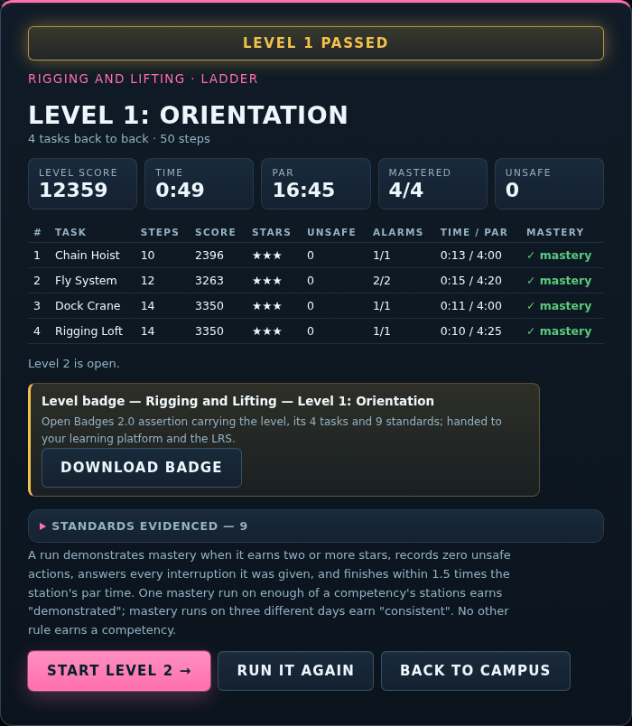

A passed level earns an Open Badges 2.0 assertion carrying the tasks, attempt ids and mastery rule text, offered as a JSON download, and sends an xAPI statement with verb `passed` or `failed`, the shared score and one extension row per task; `Identity.emit("smartcitix:level", …)` hands the verdict to an embedding page. The standards a level evidences are the union of its tasks' registry hits. Two limits the doc states itself: "No registry entry states an apprenticeship-hour equivalence, so no level claims one," and, like every badge here, a level badge "evidences readiness against the standards it names; it is not a licence or a certification issued by those bodies."

The partial levels are named rather than hidden. Three programmes have too little content for any level to reach fifty steps — Confined Space (four stations, 5 short), Port and Terminal Operations (four, 3 short) and Live Events (four, 3 short) — and four more fall short only at the capstone (Fall Protection 2 short, Hazmat 7, Transit and Ramp 4, Energy Transition 5). That table is the ladder layer's own statement of where stations are needed next. `tools/check_ladders.mjs` gates all of it: ten levels per programme, every task a real station, every total recomputed and matching, the capstone rule, the overrides applied, the `levelState` truth table, and a headless run of one level chain on the Inside Wireman ladder — a Trade Skills room and SmartCiti.X stations played by the software trainee — that reaches its results, passes, opens level 2 and verifies its badge.

### 3.9 Proof of training and Open Badges

Every finished run appends one immutable entry to the training record (`WebXR/shared/records.js`): station, category, union and certification, score, stars, corrections, unsafe actions, time against par, the interruption tally, any instructor actions, the ladder tag when played inside a level, and a pass verdict under the rule "two or more stars with no unsafe action." The record carries "nothing it must not (no biometrics, no free text beyond the learner's own crew tag)."

Exports are the hand-off. **CSV** (RFC 4180) for a spreadsheet, HR system or a hall's register. **xAPI 1.0.3** statements with `passed`/`failed` verbs, the station as a `simulation` activity, and category, certification, stars and unsafe-action count as extensions. **Open Badges 2.0** assertions — a station badge for every passing run on a station with a real certification, a competency badge for every demonstrated competency, and now a level badge for every passed level, carrying the standards as OB `alignment` entries, the station and attempt ids, and the mastery rule text in the criteria narrative. The **Proof** tab of the records overlay shows competency cards, the proof transcript (every attempt behind every claim, and why a run did not count) and the scoring rubric read straight from `game.js`'s constants. A print transcript is built as DOM text nodes only, "the last place to hand markup a chance to run."

Two limits the repository states in its own words: "These are self-asserted by a static page: hosting the BadgeClass and Assertion URLs under an issuer is what makes them verifiable," and "Passing a simulator evidences readiness for the named certification; it is not the certification." The credential verifier at `WebXR/verify/` lets a third party check an exported assertion and returns one of three honest verdicts: a structural pass without a hosted match is "self-asserted", a hosted match is "the issuing hall stands behind it", a mismatch is "altered." It flags the `smartciti.example` placeholder home that means the hall never hosted the assertion.

### 3.10 The standards registry and the eval

`tools/standards.json` is "the one place a standard, code or union training programme this platform teaches against is written down": id, body, title, the catalog categories it governs (`scope`), the forms a station's own text cites it by, and `source` — `verified` where the citation form is one the authors are sure of, `unverified` where the entry is carried as a body and a title because "the exact designation, edition or course code is not certain — there the claim is the body and the subject, not the number." At the close of 2026-09-23 it holds 320 entries across 88 bodies, 261 verified and 59 unverified. The largest families are OSHA (70 entries), NFPA (30), the unions' own training funds (29, mostly unverified by design), ANSI/ASSP (20), EPA (16) and ASME (11). The day's editions added bodies the registry had not needed before: WHO, IASC and the Sphere Handbook for outbreak response; FMCSA and CVSA (and further PHMSA entries) for the Class A block; CFPB and the IRS for financial coaching; the California Government Code, the FPPC and a generically named municipal ethics code for civic leadership; SMACNA and NEBB for sheet metal. `docs/standards/README.md` renders the registry and is current at 320; `docs/compliance/compliance-matrix.md` maps every procedure to the standards it cites. The compliance README is explicit that the matrix "maps what is taught. It is not a certification of compliance with any standard."

`tools/check_standards.mjs` is the gate: every station must cite at least one registered standard in scope for its category. `tools/eval_content.mjs` is the ranking: eight weighted dimensions — variety (0.18), decisions (0.20), explanation (0.18), grounding (0.14), standards (0.14), feedback (0.15), scene (0.10), originality (0.05) — scored per station and printed worst-first. The standards dimension is the share of a station's cited authorities that resolve to a registry entry governing its category, less a penalty for citing out of scope, "which is how a code borrowed from somebody else's trade becomes visible." The originality dimension penalises the closest prose match between any two stations. The eval "deliberately does NOT fail a build … wiring it into check_all would turn an opinion into a gate and start producing stations written to satisfy the metric." At the close of 2026-09-23 the corpus mean is 96 over 316 procedures; the five flat briefings score 73, 73, 81, 84 and 88 (they have two step kinds and no interruptions by design, and the scene dimension does not apply), and the lowest walkable stations score 90. The eval's own worst-by-dimension list names where the next raise passes go: the standards dimension on `rigging-loft`, `haul-route-observation`, `odor-complaint-log` and `keg-cellar-co2`, all citing authorities not yet in the registry; the explanation dimension on `forklift-dock`, whose median `why` is 162 characters against the 200 the brief asks.

### 3.11 The instructor console and the observer protocol

`WebXR/instructor/` is the console for the person running the class. It "owns no simulation, no scoring and no records: it speaks only the observer protocol (`WebXR/shared/observer.js`) and reads the static catalog for its roster." Three views: **Live class**, one card per session with the step, score, stars, corrections, unsafe actions, interruptions answered, the last twelve notable events and the verdict; **Roster**, the whole catalog with search, from which a station or programme can be sent to one learner or every live session; **Session log**, both directions, exportable as CSV, gone when the page closes.

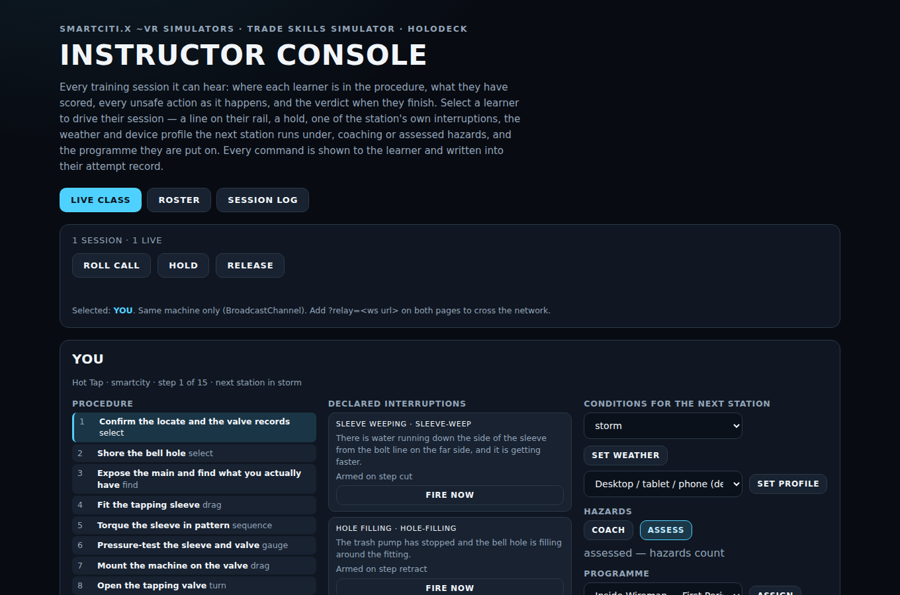

Ten commands — roll call, note, hold/release, open, fire an interruption, set weather, set device profile, coach/assess, assign a programme or a ladder level, and send a flow — each of which "must exist as a command the learner app answers, must be logged in the learner's record, and must have a learner-visible effect." The ladder layer added a level picker to the assign command: `CMD_ASSIGN` with `programme:level` pins a level in the learner's panel, and on a level 7+ chain `CMD_INTERRUPT task/id` queues an interruption for a task still to come; an assignment never unlocks a level. A command the app cannot honour is refused with the reason and not recorded. Every honoured command is appended to the learner's attempt as an `instructorAction`, "so a run driven by an instructor is never mistaken for one the learner drove alone." Untrusted text — crew tags, notes, alerts — is set as text nodes; `tools/check_console.mjs` fails the build if markup assignment appears anywhere in the console.

The default transport is a browser `BroadcastChannel`, same-origin and same-device: "a hall with a row of laptops, or headsets mirrored to one screen." For an instructor on another machine both sides accept `?relay=<ws url>`; `tools/relay_server.mjs` is "a dumb fan-out" whose header says what it is not: "authentication, encryption or an audit trail. Anyone who can reach the port can send commands to every learner on it." The protocol is at version 3 — version 3 added `flow`, "the one command that carries a payload rather than a short string" — and still accepts versions 1 and 2.

### 3.12 Device profiles and the controls layer

`WebXR/shared/devices.js` is "the one place a headset is described; app code reads a profile, never sniffs a user agent itself" (`tools/briefs/interface-brief.md`). Thirty-three devices in five classes — vr, mr, goggle, monocular, helmet — each map to one of six run profiles that decide pixel ratio, shadows, whether the weather layer and the skyline are built, HUD and target scale, contrast, whether the scene sits on black (optical see-through: black is transparent), which entry mode the intro offers first, and what the select verb is called in a hint (a click, a trigger, a pinch, a touchpad, a spoken word). Detection is by `?device=` on the URL first, then user agent, then a small-monocular screen heuristic, else desktop; "a wrong guess only changes the profile, never the procedure, and the intro names what it chose so a learner can correct it." User-agent rules exist only for browsers known to announce themselves (22 devices); the other 11, Apple Vision Pro above all, are URL-only, and `tools/check_devices.mjs` proves no rule shadows another. No field-of-view or resolution figure is recorded, "because none was verified." The full table is in the appendix. Neither the device layer nor the controls layer changed between the two revisions of this paper.

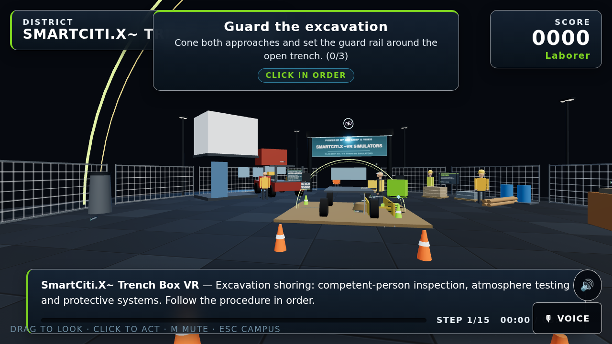

The controls layer (`WebXR/shared/input.js`, `docs/controls.md`) holds one action table for three inputs: five keyboard presets (Standard, WASD + IJKL, Left hand, Numeric keypad, One hand) over thirteen remappable actions, a gamepad polled by the W3C Standard mapping by index alone, and a voice grammar of 26 fixed phrases parsed by an ordered grammar, "not a model." Two rules are enforced by `tools/check_input.mjs`: **hands do the work** — voice, pad and keyboard navigate, focus, adjust, read back and open panels, but "nothing here completes a step by speaking" — and **every action is reachable from the keyboard**. Hand tracking (`shared/hands.js`) maps pinch, fist and wrist roll onto the same verbs the controllers drive; the classifier is a pure function checked headlessly, while "what is left unverified is the plumbing — that the runtime hands us joints at all — which is the part a device has to confirm."

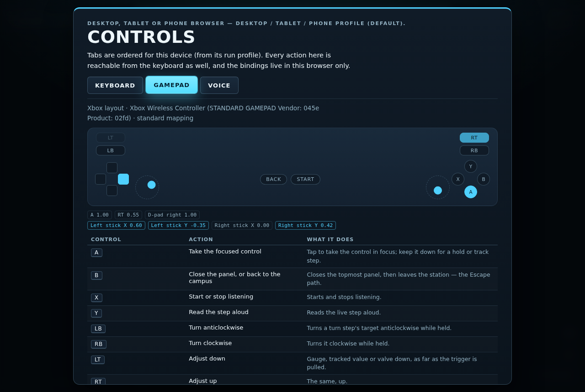

### 3.13 Human avatars and the CC-BY hero

Almost everything in the product is built from primitives at runtime. The crew figures on a site — a supervisor by the gate, a banksman with wands down, a second welder in the next bay — are `standingFigure()` builds from `citykit.js`, restyled on 2026-09-22 with "painted hi-vis dress with reflective bands, caps, safety glasses, tool belts and higher-resolution faces" at equal or lower mesh cost. None is a step target or a hazard, and `check_layout.mjs` fails a figure standing inside equipment.

The one scanned figure in the product is the hub's guide, `WebXR/smartcity/models/guide-worker.glb`: "Construction worker in high visibility" by restore50, CC-BY 4.0, decimated to about 3% of its triangles, 551,500 bytes, with the licence's credit line in the hub's intro panel and in `WebXR/assets/env/ATTRIBUTION.md`. `tools/check_models.mjs` holds every shipped `.glb` to five things: 2 MB or smaller, an attribution line with title, author and source, a licence the product may redistribute (CC0, CC-BY-4.0, CC-BY-3.0 or a marketplace licence), a module that references it, and a copy in `dist/`.

The assets brief (`tools/briefs/assets-brief.md`) describes the next layer of what a learner sees: shared kits for vehicles, construction and terminal plant, and hand tools with real proportions and declared mesh counts; a signage module that typesets a wordmark for each union because "union logos are trademarks" and the repository "ships no reproduction of any union's logo," with a manifest a licensed deployment fills in; and ANSI Z535-format safety signs and jobsite boards. None of it is in the repository yet; the brief is.

### 3.14 The environment: textures, districts and the two scenic stages

Every surface used to be one flat colour, "which is what made the scenes read as diagrams rather than places." `shared/kit.js` builds finish variation procedurally — a roughness and a normal map per finish, drawn once into a 256-pixel canvas and shared by every material of that finish, "so a hundred concrete surfaces still batch." `citykit.js` adds `surfaceTexture()` and the large-surface faces the brief requires — `pavingFace`, `deckPlateFace`, `waterFace`, `mudflatFace` — and, for the new scenes, `paintedSteelFace`, `roadwayFace`, `siltFace`, `causticFace`, `growthFace`, `hullFace` and `fogPuffFace`. A licensed GLB can also be loaded around a station (`shared/environment.js`); the only file there today is a hand-built CC0 placeholder street, and the directory README refuses game rips and models of unknown provenance.

A **district** in `WebXR/smartcity/js/districts.js` is "the part of the VR / flat-screen stage that changes with the station's trade category": the plaza, marquee and skyline are shared, and a district adds "the horizon a worker in that trade would actually see — transmission pylons behind a substation, a container terminal behind a lashing deck, a truss arch behind a company switch," at twenty to sixty meshes, placed in the ring between the plaza edge and the skyline. Seven such category districts exist.

Two **scenic districts** landed on 2026-09-23 and are a different thing: "not a horizon behind the plaza: the learner stands in them, so they replace the plaza, the masts, the marquee and the apron." **`golden-gate-deck`** is "a suspension-bridge deck the learner stands on, a tower rising ahead in International Orange," with main cable, suspender ropes, a lane closure, the strait and a marine layer by default with the skyline kept off the strait side. **`bay-underwater`** is "blue-green water closing in a few metres out, a caustic light pattern," bubbles, a pier's piles with marine growth, a hull side, a dive stage and an umbilical to the surface; a station in it may declare `room.underwater = { depthLabel, bottomTimeSeconds }` and the HUD adds a depth and bottom-time chip. The Bay Area brief fixes what may be said about the real bridge — it "opened in 1937 and is painted International Orange; state nothing else about its history unless the repo sources it. Do not name individual workers, past or present" — and about the dive: "Depth, gas, decompression and current limits are stated only as 'per the dive plan and the tables the supervisor holds', never as numbers the station invents."

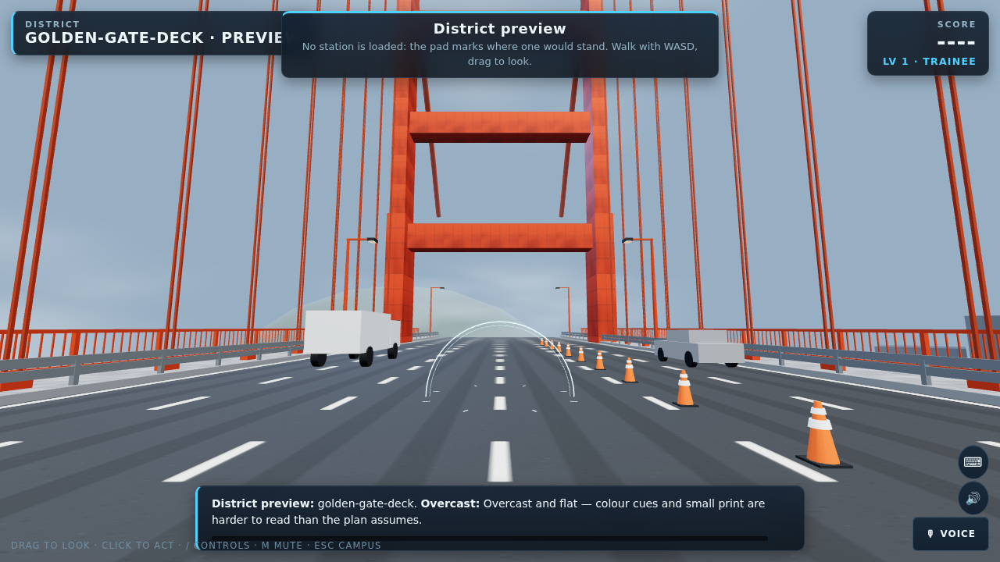

`tools/check_districts.mjs` builds the real stage around each district with no station on it — what `?district=<id>` shows — and fails a build or animate frame that throws by day or night, a district past its own 120-mesh budget, a spawn or walk that breaks `check_layout`'s rules, a plaza or apron drawn under a scenic district, a skyline drawn under water, or a HUD chip shown without the station's declaration. Its line on 2026-09-23: "golden-gate-deck 53/120 meshes, roam 13.2m; bay-underwater 25/120 meshes, roam 7.0m; underwater HUD chip renders." What the checker cannot say, and the catalog confirms, is that **no station stands in either district yet**: they were built for the Bay Area edition's bridge and underwater packs, which are described in the brief and not yet authored.

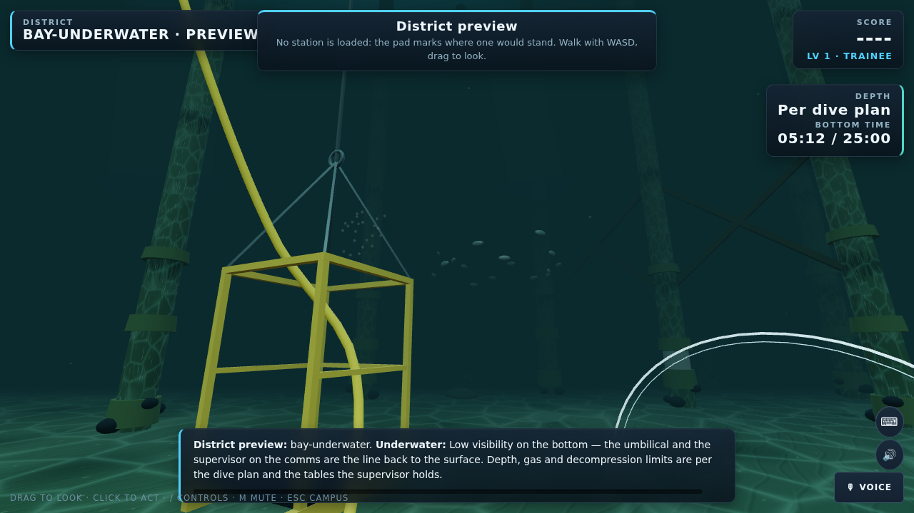

### 3.15 The robot embodiment layer and datasets

`WebXR/shared/robot.js` is a software learner that "sees exactly what the procedure engine exposes … and emits one action at a time," parameterised by a single skill in [0, 1]. Headlessly, `tools/robot_train.mjs` plays every station and writes each station's optimal skill, episodes and per-decision trajectories; live, `?robot=<skill>` runs the agent through the same click path a learner uses. The honest use is difficulty tuning: "which stations an expert still fails (over-tuned) or a random agent already passes (under-tuned)." The ladder checker uses the same trainee at full skill to play a level chain end to end.

`WebXR/shared/robot-embodiment.js` is "the missing half" for a machine with an arm: for every interactable a target pose derived from the scene, for every step the grasp its kind implies and the most force the robot may use (`none`, `light`, `firm`), and for the room the keep-out volumes around the people in it. Two safety rules carry it. A step marked `noRobot` is never performed by the robot and is handed to the clinician, recorded with `operator: "human"`, no pose, no force and no credit. Entering a keep-out volume is a violation unless the step declares patient contact by carrying a `forceClass` — "a station that reaches for a patient without saying so fails the checker, which is the point: the declaration is the safety case." The fifteen dental hygiene stations are annotated to this rule set and held to it by `tools/check_robot.mjs`, whose roster is the Dental Hygiene programme; the ten careers and five advanced stations sit in the same category and are not yet in that roster. 46 steps across the hygiene block are ones a robot must never perform, which `docs/robot-training.md` calls "the point of the exercise, not a shortfall." The dataset is labelled synthetic, generated from the procedures, deterministic for a seed, and engine-level — "ids, states, rewards, not pixels."

### 3.16 The Holodeck generator and the Trade Skills bays

`WebXR/holodeck/` is "a prompt-driven generator that builds a scored safety-training procedure from a spoken or typed description, or loads any real SmartCiti.X station by name." Its `training.js` generates a procedure from one of three templates (lockout and verify, confined-space entry, pressure isolation and bleed-down) and an equipment noun, played through the same `Session` engine, so "nothing about the scoring, hazards or combo system is a toy version." `shared/lessons.js` turns a sentence into a programme of real stations ("nothing here invents content"); `shared/incidents.js` turns a near-miss report into a replay that adds one interruption and never rewrites the procedure; `shared/crew.js` splits a station between two roles only when the station itself holds the evidence, and otherwise declines. The prompt interpreter is a keyword stand-in: "There is no live model behind this yet — no working API endpoint or credentials have been wired into this project."

The Trade Skills Simulator (`WebXR/trades/`) is the sibling app: nine rooms — Isolation Bay, Colour Studio, Hot Line, Draw Station, Weld Bay, Deploy Bay, Rough-In Bay, Wash-Down Yard, Coatings Bay — on the same engine and profile. Its rooms open the Inside Wireman, Dental Hygiene and Situational Awareness programmes, and the Inside Wireman ladder chains its panel bay into every level.

### 3.17 Records, xAPI, LRS, LTI and identity

**Identity** is "a launch context, not authentication, and the docs say so" (`shared/identity.js`). It arrives under the host's control: a launch URL (`?learner=…&learner_id=…&learner_home=<https origin>`, read once, kept per tab, scrubbed from the address bar), an embedding page's `postMessage`, accepted only when `learner_home` equals the sender's real origin, or — since 2026-09-23 — the sign-in dialog described in 3.18, which `docs/sign-in.md` calls "a fourth way into the same `Identity`, not a parallel one." With an identity present the crew tag is locked, every record and xAPI actor carries it, and each finished attempt is also posted back to the host page — "only when embedded, and only to `learner_home`, never broadcast."

**The LRS connection** (`shared/lrs.js`) POSTs every finished attempt to `<endpoint>/statements` as xAPI 1.0.3 the moment it happens; a statement that cannot be delivered waits in a local queue and is retried, carrying the record's own id so a resend never double-counts. Endpoints must be https (http on localhost only); a credential is kept per tab and "never written to localStorage." Level results travel the same queue.

**The LTI 1.3 relay** (`tools/lti_relay.mjs`) is "the one server this network needs, and the smallest one that does the job." It runs the OIDC third-party-initiated login, verifies the platform's RS256 `id_token` against its JWKS — issuer, audience, expiry, single-use nonce, message type and version — and 302s the browser into the app with the launch context. `tools/check_lti.mjs` stands in a platform with its own RSA key and proves a good launch redirects and a bad signature, wrong audience, expired token, replayed nonce or unknown state is refused. It has not been deployed behind TLS or registered with a real platform; the README lists that as the first undone item, "a platform-side act."

**The platform channel** (`shared/platform.js`, protocol 2) lets an LMS or portal drive an app (`open`, `hub`, `status`, `catalog`) and hear back (`ready`, `state`, `progress`, `record`, `credential`), only to the `learner_home` origin; protocol 2 adds the flow commands described in 3.20. The static catalog is the roster a platform can index "without loading the app at all."

### 3.18 The homepage and the sign-in layer

The first revision of this paper listed the homepage and sign-in as "in progress and not yet in the repository." Both landed on 2026-09-23.

**The homepage** — `WebXR/index.html`, with `WebXR/home.html` for the flat bundle layout — is generated from the catalog by `tools/gen_home.mjs` and "is run at the end of `tools/gen_catalog.mjs`, so the page cannot drift from the roster: every station in the catalog gets a card with a working deep link, every category gets a section, every programme gets a rail chip, and the counts in the hero are counted rather than written." Four app cards — SmartCiti.X (307 stations), Trade Skills Simulator (9 rooms), Holodeck, Instructor Console — sit above a live search that filters the roster on name, id, trade, category and standard. The generator's two rules are held by `tools/check_home.mjs`: catalog strings reach the page as text and never as markup — the only catalog values that ever land in an attribute are slug ids and hex accents, both pattern-checked, and the generator is run against a hostile fixture "whose every field carries markup" and must produce the same tag structure as the clean one — and every relative link in both variants resolves to a file that exists.

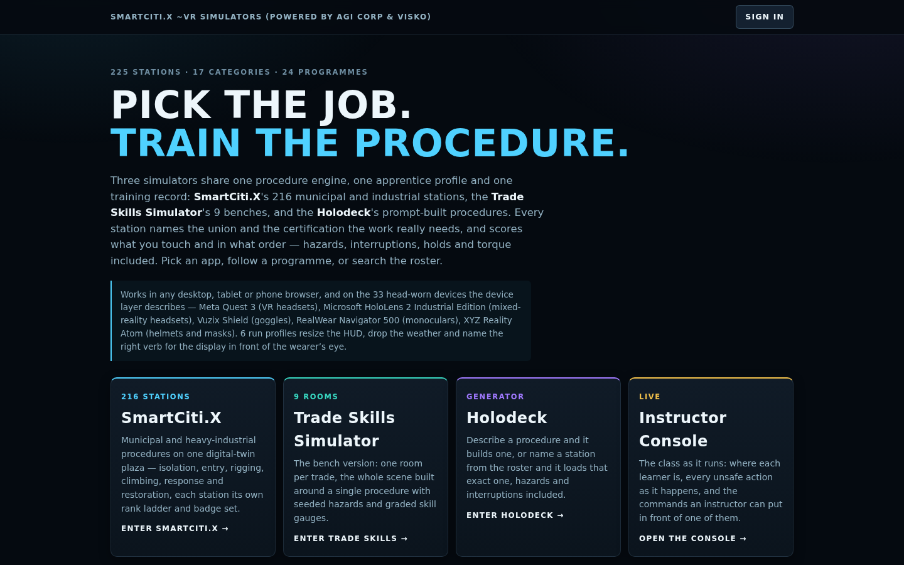

**The sign-in layer** (`WebXR/shared/auth.js`, configured by `WebXR/auth-config.json`) is described in `docs/sign-in.md`, which opens with the plain statement: "these pages are static files, and a static page cannot verify identity by itself … Nothing in this repository checks a password, validates a signature or decides that a person is who they say they are. What the sign-in dialog does is *collect a credential* from a provider the deployment configured and hand it, unaltered, to the page that hosts these apps. The host's server is what verifies it." Five options, each with the sentence that says where its credential is verified shown in the dialog itself: **Google** (Google Identity Services; the page decodes the ID token for a name and `sub` and does not verify it; the host's server does); **Microsoft** (MSAL redirect flow; the host's server verifies against the tenant); **e-mail link** (one `POST` to an endpoint the deployment operates, which mails a link that opens the existing launch-context path; "with no endpoint configured, no request is made at all"); **passkey** (WebAuthn bound to this origin; "nothing is verified anywhere, and nothing is sent anywhere," and the UI says "this device only" wherever it appears); and **wallet** (an EIP-4361 Sign-In with Ethereum message signed by `window.ethereum`; "signature verification happens on the host's server, not in the page").

On success the module posts one `smartcitix:identity` message — learner, id, home, provider, the raw token and a `verifiedBy` of `"host-server"` or `"this-device-only"`, "stated rather than implied" — to the `learner_home` origin only, and only when embedded. "A deployment that configures no `homePage` gets no message — there is nowhere trusted to send it." Every value in `auth-config.json` is null out of the box, so a fresh copy offers only the passkey and the wallet. The rule about endpoints is proven twice by `tools/check_home.mjs`: statically, that every absolute URL lives in one table and there are exactly three `fetch` call sites in the file; at runtime, by driving all five branches against an empty configuration with spies in place and asserting "not one request and not one script load was attempted." Sign out removes the one versioned key and then offers, as a separate decision, to delete this browser's training records, "because leaving a shared kiosk and discarding your own record are not the same act." The doc's closing list is what the layer does not do: authorise anything, verify anything, create accounts, or ask for any scope beyond `openid profile email`.

### 3.19 The editions

**Hunters Point Edition — Can We Live?** (26 stations) and **Hunters Point Clean-up and Bay Restoration** (26). The edition is "a 25-station flagship built to be offered to the Marie Harrison Community Foundation ('Can We Live?')" with a sourced flat opener. The brief's rules are not negotiable: every station "sited generically," never naming a real person, never inventing "a foundation programme detail, a partner, a number or a clause," and "it is not the foundation's own programme and must never say it is." Consent (45 CFR 46) is a scored step wherever a person's sample or data is touched. The Hunters Point Briefing is deliberately flat — an active EPA Superfund site is not rendered as a stroll — and every paragraph carries its source, with the README noting "the settlement and the lawsuit are live matters." The opener's header records that the foundation's own pages "could not be retrieved from the environment this file was written in, so where its own words belong the dossier says so rather than guessing."

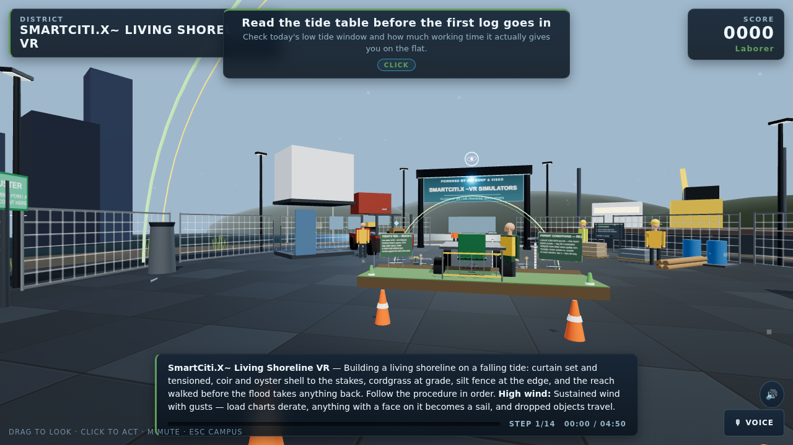

**Dental Hygiene — Unspoken Smiles** (16) and **Dental Careers — Unspoken Smiles** (16). The Unspoken Smiles block is 30 distinct SmartCiti.X dental stations — 15 hygiene, 10 careers and 5 advanced — plus the shared patient-intake station that opens both programmes and the Trade Skills phlebotomy bench that opens the hygiene one. The hygiene block makes a hygienist's clinical day into scored procedures under CDC infection-control guidance, OSHA bloodborne pathogens and hazard communication, the EPA amalgam rule and the state practice act, and doubles as the robot training simulator. The careers programme runs from the pathway briefing through four-handed dentistry, full-mouth radiography, the sterilisation technician's cycle, the laboratory bench, orthodontic and oral-surgery assisting, the front office, an infection-control audit and school screening outreach to five advanced trades: implant surgery assisting, endodontic assisting, denture delivery, special-needs and geriatric dentistry, and teledentistry and triage. The repository names the block "Unspoken Smiles" in its programme titles and does not describe the organisation behind that name; this paper does not either.

**First Responders — Fire, EMS, Police, Crisis and Relief** (16): fireground size-up and rehab, a cardiac arrest, an overdose, a crisis call, a critical incident debrief, trauma-informed intake, a shelter and psychological first aid — every station closing with the crew's own check-in.

**Job Readiness Edition — wojrc.org programmes** (26), opened and filled on 2026-09-23. The brief (`tools/briefs/wojrc-brief.md`) states what is sourced: the sponsor supplied a short passage from wojrc.org and two page titles, "nothing else about the organisation or its staff could be fetched from this sandbox," and the organisation "is referred to by its domain, wojrc.org … do not expand the acronym." The person the sponsor names as running the programmes is to be described as "named by the sponsor of this edition, nothing more: no title, biography, quotation or history is sourced." The programme summary repeats the rule: "Only the sponsor's own words describe the organisation; everything else here is a procedure with its standard." The edition trains five blocks, all cited to the registry: **TDL warehouse** (pallet jack and racking, pick-pack-and-scan, trailer loading, hazmat labelling, lifting and ergonomics, with the existing forklift dock) under OSHA 1910.178, 49 CFR 172 and NIOSH lifting; **Commercial Class A** (pre-trip, air-brake test, coupling, backing and docking, cargo securement and hours) under FMCSA 49 CFR 380 Subpart F, 393 and 395 and CVSA practice; **apprenticeship navigation** (a flat briefing on reading a registered standard, the application and aptitude test, jobsite orientation and OSHA 10, the union hall and dispatch, the first-period evaluation); **financial coaching** (credit report, debt plan, pay stub and withholding, budgeting on irregular income, emergency savings and predatory lending) with CFPB and the IRS as bodies and "no tax advice beyond what the cited body's guidance states"; and **wellness** (shift work and sleep, a peer-support conversation, substance use and the job, asking for help) with SAMHSA and the EI guide. The **Trades Lineage Briefing** that opens the edition says of the bridge only that it opened in 1937, lists the article the sponsor linked "as recommended reading" because "it could not be fetched … so it is not summarised or quoted, and nobody who built the bridge is named here."

**Bay Area Union Edition — Sheet Metal, Bridge, Port and Marine** (20), opened the same day. The brief describes four packs: sheet metal for SMART and its International Training Institute; bridge for the Ironworkers, IUPAT bridge painters and the Pile Drivers, "the Golden Gate Bridge as the working scene"; port maintenance for ILWU and the PMA training programme with IUOE; and marine and water for the Inlandboatmen's Union, MEBA, SIU and the Pile Drivers' commercial divers, including underwater work under OSHA 1910 Subpart T and ADCI consensus standards. What shipped is two of the four: **nine sheet-metal stations** (the existing press brake plus shop layout and shear, duct fabrication and seams, plasma table and fume, TIG and spot welding, duct hanging and seismic bracing, architectural panels at height, air balancing and testing, kitchen exhaust and fire wrap) and **eight port-maintenance stations** (spreader and twist-lock inspection, crane boom hoist brake service, straddle carrier hydraulics, reefer plug and power panel, dock fender and bollard inspection, terminal lighting mast service, stormwater at the terminal, chassis and genset yard). The bridge and marine packs are represented by three existing stations — Steel Erector, Container Lashing and Mooring Line — and the two scenic districts built for them; the underwater stations the brief describes, with `track` for bottom time, `gauge` for depth and `hold` for the umbilical check, are not yet written.

**Property Management — Twenty Zones** (21): a working building as twenty stations from the lobby and front desk, the leasing office and fair housing, unit turnover and the trash room through the fire alarm panel, sprinkler riser, elevator machine room, garage, roof and electrical room to domestic water and backflow, laundry, pool chemistry, the gym, the community room, the mail room, the loading dock, landscaping, the playground and storage — plus the existing boiler room — for SEIU building service, IUOE Local 39 stationary engineers, UNITE HERE residential hospitality staff and the apartment association's CAM and CAMT credentials, under OSHA 1910, NFPA 72 and 25, the Fair Housing Act and the local housing code.

**Outbreak and Disease Response — WHO and UN Practice** (11): surveillance and case definition, PPE donning and doffing, isolation-ward setup, a contact-tracing visit, treatment-centre triage, water, sanitation and hygiene, a vaccination line, risk communication and community engagement, safe and dignified burial and an after-action review — plus the existing decon line — for SEIU and AFSCME public-health staff, NNU and CNA nurses and the humanitarian workforce under IASC clusters, citing WHO infection prevention and control and outbreak communication guidance, CDC isolation precautions, OSHA 1910.1030 and 1910.134, the Sphere Handbook and IASC cluster practice.

**Civic Leadership and Emotional Intelligence** (11): a flat Civic Principles Briefing and ten stations — public-comment prep, chairing a public meeting, a constituent service desk, a coalition table, a budget trade-off hearing, ethics and conflict of interest, a crisis-communication podium, a community listening session, a mediation room and mentorship and succession — under the Brown Act, the Political Reform Act and municipal ethics codes. The briefing's header is the sourcing rule applied to a request the repository could not fulfil: the programme "was asked to draw on the principles taught by a civic-leadership foundation. That foundation's own site could not be reached … and nothing about it exists in this repository. So this briefing does not describe the foundation, does not quote it, and does not speak for it or for any person connected with it." The eight principles are "stated generically and attributed as what they are: principles commonly taught in civic-leadership programmes."

**The trade blocks.** **Sewing and Garment Trades** (11) "teaches sewing as a trade" for Workers United and UNITE HERE members under machine-guarding and lockout standards. **Hotel Workers — Back of House** (4) for UNITE HERE housekeepers, laundry and banquet staff under Cal/OSHA's housekeeping and workplace-violence standards. **Ports, Maritime and Bay Ecology** (11) and **Port and Terminal Operations** (4) for ILWU, the Inlandboatmen's Union, IBEW port electricians and LIUNA. **Bridge and Structural Trades** (4) for Ironworkers, IUPAT bridge painters, IUOE and LIUNA. **Inside Wireman — First Period** (8) is the IBEW block: "the isolation habit, built four ways," opening on the Trade Skills panel bay and ending in a grid battery yard; **Energy Transition Systems** (5) is its outside-construction sibling. **Builders — Carpenters, Laborers and Masons** (4) for UBC, LIUNA, BAC and IUOE under Subparts Q, L and CC and the silica rule. **Culinary — The Working Kitchen** (16) and **Bartending — Behind the Bar** (16) for UNITE HERE Local 2. And the original blocks — Confined Space, Fall Protection, Hazmat, Rigging, Stationary Engineer, Transit and Ramp, Live Events, Air Quality — each under the standards its header names.

### 3.20 Flows: the SmartCiti.X side of a host contract

`WebXR/shared/flowhub.js` and `docs/flowhub.md` are exact about what they are: "The user's host platform is Cognition.X, and its orchestration component is called FlowHub. No FlowHub specification exists in this repository, and nothing in this document … is derived from one. What follows is the SmartCiti.X side of the contract, specified from this end." A host — "Cognition.X's FlowHub, or any other" — implements or adapts to it; nothing special-cases Cognition.X, and no Cognition.X end has been tested against it.

A **flow** is an ordered graph the host hands over: nodes of six kinds — `station`, `programme`, `brief`, `checkin`, `gate` and `external` — joined by edges whose `when` conditions read the attempt record the engine already writes (`passed`, `minStars`, `maxHazards`, `competency`, or a registered `custom` predicate). Edges are tried in declared order and the first match wins, so "a flow reads top-down like the decision it is." A `gate` node applies the mastery rule over the run's own evidence and scores nothing of its own; an `external` node is the host's — this side emits `smartcitix:flow.external` and "parks until `smartcitix:flow.resume` arrives for that exact node," with no timeout and no guess. "A flow chooses the order; it never decides a verdict."

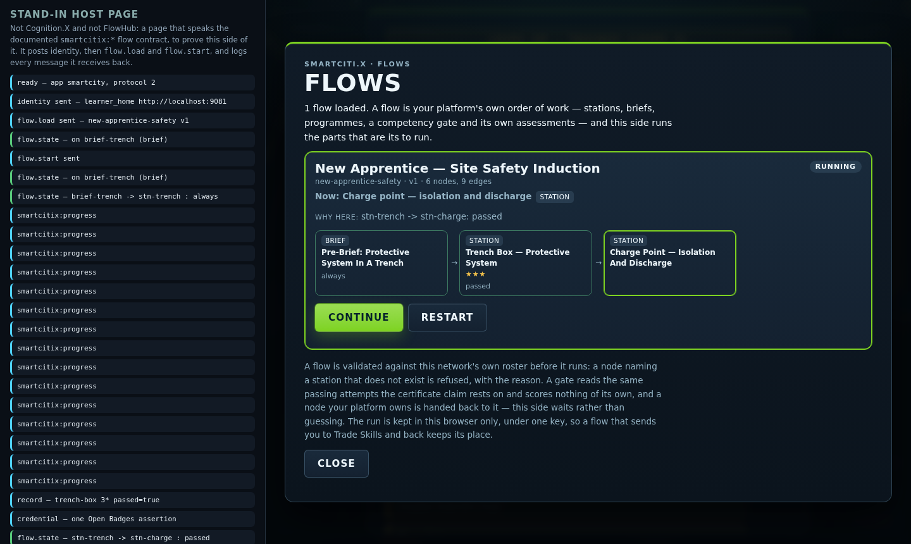

The channel is the existing origin-bound platform channel at protocol 2: three commands in (`flow.load`, `flow.start`, `flow.resume`) and three events out (`flow.state` on every transition with the branch taken and why, `flow.done`, `flow.external`). A flow is validated against the real catalog on arrival and "refused whole, with the reasons, if it does not check out"; a resume for any node but the parked one is refused, so a replayed message can never skip a station the learner still owes. A run survives the switch between the three apps in one versioned localStorage key, and all three apps answer the flow commands. The learner sees a **Flows** panel — the node standing now, the path taken as chips with the reason under each hop, the competencies demonstrated, Continue and Restart — and the instructor console can load one of the three example flows in `WebXR/flows/` or paste one, validate it, and send it to a learner as observer command `flow` (protocol 3), which lands on the attempt record as an `instructorAction`. `tools/check_flowhub.mjs` validates every example flow against the catalog, proves every edge condition reachable, drives the state machine's truth table, and asserts the gate rule is the mastery rule and nothing else.

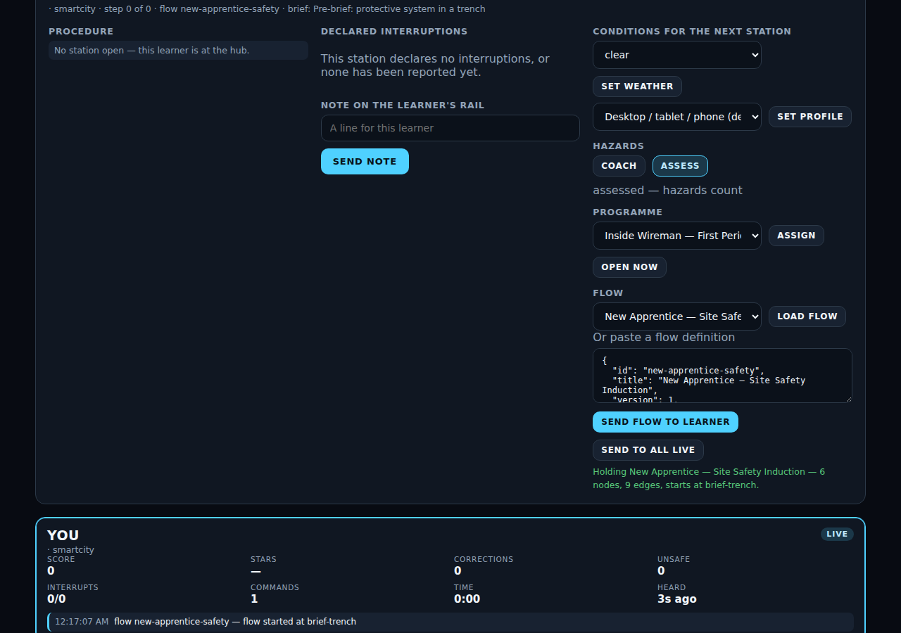

The three examples: **New Apprentice — Site Safety Induction** (a pre-brief, three stations across three categories, a gate, a check-in); **Dental Careers — Orientation** (the careers programme, then a branch on stars); **First Responder — Annual Refresher** (size-up, EMS, an external host assessment, a debrief). `docs/flowhub.md` ends with the six things a host has to do, in order, and "none of it lets a host change a verdict." The ladder layer and the flow layer are complementary and separate: a ladder is the programme's own order of difficulty, decided here; a flow is a host's order of work, decided there; both are gated by the one mastery rule.

---

## 4. The stack

### WebXR, three.js and vanilla ES modules

Every app is a static WebXR page. The renderer is three.js 0.160.0, fetched from cdnjs as the one pinned external dependency; the GLTFLoader is vendored under `WebXR/vendor/` (MIT). There is no framework and no build toolchain in the ordinary sense: plain ES modules under `WebXR/<app>/js` and the shared engine under `WebXR/shared/`. The 2D chrome is built from plain data by a small React-style renderer, never from HTML strings. Stations run in three modes: flat (any browser), immersive AR (a WebXR browser with hit-test, the station placed on the real floor) and immersive VR. The homepage is generated HTML with the app's own palette tokens "so the homepage and the simulators are visibly one product"; the sign-in module loads Google Identity Services or MSAL only from a branch that has already found a configured client id.

### The single-file bundler and lazy stations

`tools/bundle_webxr.py` inlines an app's modules into `WebXR/<app>/dist/<name>.html`. For Trade Skills and Holodeck the result is genuinely self-contained and even opens via `file://`. SmartCiti.X is the exception: its stations are lazy-loaded through dynamic `import()`, so its `dist/` "is a real folder — the HTML plus `sims/`, `citykit.js` and `gamify.js` copied alongside it — and needs a real HTTP(S) server." A learner therefore downloads the engine once and each station only when they walk into it, which is what lets 307 stations sit behind one page. The bundler copies the homepage's flat-layout variant into `dist/index.html` beside the bundles. The CI workflow regenerates `sims-meta.js`, `catalog.json` and every `dist/` bundle and fails if the committed copies differ, because "a stale bundle is a silent deploy of old code."

### The checkers as a gate

`node tools/check_all.mjs` runs 33 headless checkers and prints one line each; the full list with each checker's own summary line is in the appendix. The order matters: `check_parse` runs first because "every other checker reads these files after deleting the part of them most likely to be malformed," and `check_imports` second, "before anything asks whether the content is right." The rest build every station against a stubbed three.js and drive the real engine: a scripted perfect run through all 307 simulators, every interruption fired and timed out and answered, every control reachable from where the learner spawns, every crew figure clear of equipment, every station inside its mesh budget, the records, identity, LRS, LTI, observer, console, competency, devices, input, standards, models and flow layers each proven in Node, and — the three added on 2026-09-23 — the homepage's links and the sign-in module's silence, the two scenic districts' build and layout, and every ladder level recomputed with one chain played to its badge. `.github/workflows/webxr-checks.yml` runs the same command on every push or pull request touching `WebXR/` or `tools/`. The loop brief's rule is "never push red." The whole run takes about seventy seconds on the authoring machine, forty-four of them parsing the 995 shipped modules.

### The content eval as a ranking

Described in section 3.10: eight weighted dimensions, printed worst-first, kept out of the gate on purpose. Its snapshot lives in `tools/eval-content.json` so the corpus can be tracked over time. It exists because a station "can pass all of [the checkers] while being ten clicks in a row with a paragraph of filler on each." The generated ladder doc is a second, different ranking: it names the levels that are short of content, which is a statement about the programme rather than the station.

### The team-brief method

The corpus was built by many parallel authoring teams, each working in its own git worktree from a short brief. `tools/briefs/station-brief.md` is the shape every station must take (section 3.2), the registration command (`node tools/add_station.mjs <id>`), a list of "footguns no checker catches," and the verify routine: all checkers, the bundle, a headless-browser drive of every step with every interruption answered, a spawn screenshot "a person looks at," and the eval row. Series and edition briefs add the rules for a flagship: the Hunters Point, First Responder, Job Readiness and Bay Area briefs each fix what may be said about the real world the edition stands beside. `ladder-brief.md` binds every ladder task to fifty steps a level and the mastery gate; `optimize-brief.md`, `proof-brief.md`, `interface-brief.md` and `assets-brief.md` govern raising a station, the proof layer, the interface and the fleet, tool and signage kits to come. `loop-brief.md` is the integration tick: heartbeat (checkers and eval), integrate the handed-back worktrees, regenerate metadata "with the generators (never by hand)," gate the commit on the exact "All N checkers pass" line, publish, show, re-arm. The history shows the result: 245 commits between 2026-07-17 and 2026-09-23, most adding or raising three stations at a time, and on the last day eighteen commits, after the first revision of this paper, that added eighty-one procedures, five programmes, three layers and three checkers with the gate green throughout.

### The observer relay

Section 3.11 describes the console; the relay (`tools/relay_server.mjs`) is the one optional process a class might run. It is a WebSocket fan-out written on Node's built-in `http` server with the RFC 6455 handshake and no dependencies, one relay per class, storing nothing and logging only a connection count. It is meant to run "on the training room's own network, behind a TLS terminator if it leaves the room."

### The artifact publishing path

The loop brief's publish step reads: "rebuild the site (`build_site.sh`) and republish the artifact at its existing URL; regenerate the compliance matrix and the wiki series page; refresh `docs/STATUS.md`." Two of those exist in the repository as generators (`tools/gen_compliance.mjs`, `tools/gen_wiki.mjs`). `build_site.sh` is a session script that lives outside the repository, so the paper can describe only its effect: the built site is published as a private page, shared on request, and republished in place at each tick. No URL is recorded in the repository. The last day's waves outran the publish step: the status log, the series page and the review packet were not regenerated after the ladder wave, which is why section 3.1 lists them as stale.

### What runs where

**Browser only, no server required.** SmartCiti.X, Trade Skills Simulator, Holodeck, the homepage, the portal, the credential verifier and the instructor console are static files. Records, progress, badges, level runs and check-ins live in the learner's browser. The instructor console works across tabs on one machine with no process at all. Two things are needed for immersive modes: HTTPS (WebXR requires a secure context; so do WebAuthn, Google Identity Services and MSAL) and, when embedded, an iframe `allow="xr-spatial-tracking"`.

**What a deployment adds, each optional:** an LRS endpoint; a host page or LMS that supplies identity and, if it orchestrates, speaks the flow contract; the sign-in client ids or e-mail endpoint the host operates, with the host's server verifying what comes back; the LTI 1.3 relay behind TLS, registered with the platform; the observer relay on the room's network; hosted BadgeClass and Assertion URLs under the hall's issuer; a manifest of licensed union logos, when the signage layer lands; and a Content-Security-Policy that allows the three.js CDN fetch and Google Fonts, or self-hosted copies of both.

---

## 5. Compliance and safety posture

### What is proven

Properties the repository checks mechanically on every commit:

- Every one of 307 SmartCiti.X simulators and 9 Trade Skills rooms parses, imports only what it declares, builds, and can be played to a perfect run on the real engine.
- Every one of 618 interruptions fires after its delay, times out if unanswered, counts the miss as an unsafe action, scores a correct answer, is disarmed when the learner leaves its step, and visibly changes the scene.
- Every step target is reachable from where the learner arrives; every station is inside its mesh budget; every crew figure stands somewhere real.
- Every station cites at least one registered standard in scope for its category; every programme guide names a real registry entry; every competency's stations exist and every programme competency mirrors its programme block.
- Every programme has exactly ten ladder levels; every task is a real station; every step total, partial flag and standards list recomputes from the real modules; level 10 is the capstone; a level chain plays to its results headlessly and its badge verifies.
- Every exported Open Badges assertion validates against the same verifier a third party would use; the rubric shown to a learner is the engine's own constants, not a copy.
- The 33 device records are well formed and no user-agent rule shadows another; every gamepad and voice action has a keyboard equivalent; no voice command completes a step.
- The LTI relay refuses a bad signature, a wrong audience, an expired token, a replayed nonce and an unknown state, against a stand-in platform with its own RSA key.
- The instructor console sets no markup, imports no simulator code, and every command it offers is handled, recorded and reduced into the roster.
- Every example flow validates against the catalog, every edge condition in it is reachable, the flow gate applies the mastery rule and nothing else, and the flow protocol constants appear in all three learner apps and the console.
- The homepage links every station, app and programme, every relative link resolves, and a hostile catalog fixture cannot change its tag structure; the sign-in module has exactly three named fetch sites and, unconfigured, makes no request and loads no script.
- Both scenic districts build by day and night inside their 120-mesh budget, pass the layout rules from their own spawn, draw no plaza or apron, and show the underwater HUD chip only when a station declares it.
- The one shipped model is inside 2 MB, attributed, redistributably licensed, referenced and bundled.
- The Orbis-Stable client rejects, before any transport is called, any payload carrying a biometric or inferred-mental-state key.

### What is asserted

Claims the repository makes in prose, on its own authority, and marks as such:

- The procedures are real procedures under the standards named. The automated preview signature in `WebXR/smartcity/REVIEW.md` checks completeness and internal consistency on every section; the practitioner signature — "a qualified practitioner in that trade" confirming the order, the rationale and the certification claim — is on none. "Until a station's section is signed 'approved as evidence of readiness', records from it are training records, not evidence for the named certification." The packet's roster is stale at 235 sections against 316 procedures and needs regenerating before the eighty-one newest stations are even in it.
- The attributions to real organisations in the Hunters Point, Job Readiness and Civic Leadership editions rest only on text the repository holds. Where it holds none, the content says "not sourced in this repository" — the civic briefing's programme header calls its foundation "an attribution to verify." A reader of those editions should treat every sentence about a named organisation as exactly that text and no more.
- The accessibility statement (`WebXR/ACCESSIBILITY.md`) is a self-assessment against WCAG 2.1 AA and Section 508 for the flat mode only. "No third-party audit has been carried out, and this document says so rather than implying one." The AR and VR modes are not claimed to be keyboard-operable.
- Device safety fields (`ansiZ87`, `intrinsicallySafe`, `helmetMount`) are "the vendor's own statements, never a certification by this project." Where no statement was confirmed the field reads `"unverified"`. No field-of-view or resolution figures are recorded.
- The 59 unverified standards entries are "carried as a body and a title because the exact designation, edition or course code is not certain"; sixteen of them arrived with the day's editions. The Bay Area brief names entries still to be added for the diving stations — OSHA 1910 Subpart T, ADCI, AWS D3.6 and the NAVFAC or USCG diving references — "with the body and title and `source: 'unverified'` unless the citation form is certain."
- The sourced facts in the Hunters Point dossiers carry their sources and are "live matters" to be re-checked when the record changes.
- Headset performance on real hardware: the instrument (`?perf=1`) exists; no pass has been recorded. Hand-tracking on real hardware: the classifier is checked; the runtime plumbing is "the part a device has to confirm."
- The ladder difficulty formula is the generator's own ordering, stated in code; nothing in the repository claims it matches how a training centre would order the same stations.

### What a deployment must configure

- **Issuer URLs.** Badge ids are laid out as URLs under the learner's home. Until a hall hosts the BadgeClass and Assertion documents at those URLs, the verifier reports every badge — station, competency or level — as self-asserted and flags the `smartciti.example` placeholder.
- **LRS.** An https endpoint and a credential, set from the records overlay, the launch URL (endpoint only) or the embedding page from the learner's home origin. Nothing is queued until one is set.
- **Identity and sign-in verification on the host.** The apps cannot verify who is in front of them. `identity.js`: "There is no server here, so nothing can be cryptographically verified: this is a *launch context*, not authentication." The sign-in layer collects a Google or Microsoft token, a wallet signature or an e-mail request and hands it to the host; "three of the five options produce something a server must check, and the dialog names the server each time." Until the host verifies, the passkey — "this device only" — is the only option that does not overstate itself, and it is the default.
- **The relay and the console.** If the console leaves the room, `wss://` behind a TLS terminator, on a network only the class can reach, because the relay itself has no authentication.
- **The three.js CDN fetch.** Either allow `cdnjs.cloudflare.com` and Google Fonts in the site's CSP or self-host both.

### Licensing of models, and the exclusion

`WebXR/assets/env/README.md` sets the rule: only models "with a licence that allows redistribution in this product — CC0, CC-BY (with the attribution line below), or a marketplace licence." `tools/check_models.mjs` encodes the permitted set as exactly CC0, CC-BY-4.0, CC-BY-3.0 and marketplace; a non-commercial licence such as CC-BY-NC is not in it and a model carrying one fails the build. "Ripped game assets are not licensed for this and are not accepted, whatever the file is called." Third-party code is vendored with its licence under `WebXR/vendor/`. The one shipped figure is CC-BY 4.0 with its credit line in the hub and the attribution table. The synthetic robot datasets carry a licence note in their manifest identifying them as generated from the SmartCiti.X procedures. The assets brief extends the rule to trademarks: the repository is to ship no union logo, only typeset wordmarks, with a manifest "the deployment must hold permission" to fill.

### Data and privacy posture

Records "never leave the browser on their own; export is the hand-off." No biometric or inferred-emotional signal is recorded; check-in answers are excluded from every export; launch identity is scrubbed from the address bar; LRS credentials never reach localStorage; the perf instrument runs only with its flag. The sign-in layer reads one same-origin configuration file unprompted and nothing else, requests no scope beyond `openid profile email`, never reads a wallet balance or requests a transaction, and keeps signed-in state under one versioned key that sign-out removes. The robot trainee records to the training log like any attempt, and the README warns to clear or filter it before exporting a learner's record. `WebXR/shared/orbis-stable.js` — the pluggable client for a future adaptive-content model — "has no real backend behind it: nothing here ever makes a network call" and "is not imported by the running apps"; its purpose today is to fix the safety contract at the boundary so that a real transport, if one is ever added, cannot be handed a biometric signal.

---

## 6. Roadmap

Each item is listed with what the repository says it depends on. Nothing here is scheduled; the order is the dependency order. Items marked *done since the first revision* are kept for the record.

### Near

- **The bridge and underwater packs onto the two scenic districts.** `golden-gate-deck` and `bay-underwater` are built, budgeted and checked, and no station stands in either. The Bay Area brief names the stations: tower, main cable, suspender ropes, the traveller and the paint programme on the deck; pier pile inspection, hull inspection and cleaning, underwater welding and cutting and dive supervision under the surface, with `track` for bottom time and `gauge` for depth and the rule that limits are "per the dive plan and the tables the supervisor holds." Depends on: the registry entries for OSHA 1910 Subpart T, ADCI and AWS D3.6, added as unverified unless the citation form is certain.
- **Fill the 34 partial ladder levels.** Three programmes — Confined Space, Port and Terminal Operations, Live Events — have four stations each and cannot reach fifty steps at any level; four more fall short only at the capstone. Depends on: new stations in those programmes under the station brief, three at a time; `docs/ladders.md` regenerates itself.
- **Regenerate the written record.** The status log, series page, SmartCiti.X README and review packet carry counts from 225 to 235 against a roster of 316. Depends on: nothing but running the generators and the loop brief's publish step, which the last day's waves outran.
- **The assets brief: fleet, equipment and tool kits, union wordmarks, and the `drive` step kind.** Specified in `tools/briefs/assets-brief.md` with mesh budgets per builder and a checker named. Depends on: the kits landing first, because the `drive` kind needs a vehicle to move and the five Class A stations to retrofit.
- **Extend the robot rule set across the whole dental block.** `tools/check_robot.mjs` holds only the fifteen hygiene stations to the keep-out and `noRobot` rule set; the ten careers and five advanced stations are in the same category and not in the roster. Depends on: the dental rule set in `docs/robot-training.md`, already written, applied to those stations.
- **The FlowHub contract with Cognition.X.** The SmartCiti.X side exists (section 3.20). Depends on: a Cognition.X host that embeds the app, supplies identity from its own origin, posts `flow.load` and `flow.start`, and answers `flow.external` with `flow.resume` — then a test of a whole run and a refusal.
- **Sign-in verified on a host.** *The page side is done since the first revision.* The dialog, the five options, the identity message with its raw token and `verifiedBy` field, and the checker are in the repository. Depends on: a host server that verifies the Google or Microsoft token or the wallet signature, or an e-mail link service, and a `homePage` configured so the message has somewhere trusted to go.
- **More headset user-agent rules.** Eleven of the 33 devices are URL-only because their browsers are not known to announce themselves; the device guide says "vendors update browsers, so re-test before a fleet rollout." Depends on: hardware in hand, and the interface brief's rule of "no invented device facts."

### Mid

- **A verified standards library and a signed review packet.** 59 registry entries are unverified, most of them union training-fund course names and the bodies added on the last day for outbreak response, financial coaching and civic leadership. Depends on: confirming citation forms with the bodies, and, separately, the practitioner review — the packet has 0 sign-offs and a roster of 235 that must first be regenerated to 316.
- **Sourcing for the named organisations.** Three editions carry attributions the repository could not source at build time: the wojrc.org programmes beyond the sponsor's own passage, the civic-leadership foundation whose principles were asked for, the Hunters Point foundation's own pages. Depends on: the sponsors supplying their text, after which the flat briefings' "not sourced" lines are replaced with sourced ones and nothing else changes.
- **Instructor cohorts.** The console shows the sessions it can hear and stores nothing; a programme or a level can be assigned to a learner. A cohort — a named class with a roster and a history — is not in the repository. Depends on: a durable store, which the architecture currently places outside the apps (the LRS, or the host).
- **Multi-user sessions over the relay.** The relay is a dumb fan-out with no rooms and no authentication, "one relay is one class." Depends on: room scoping and authentication on the relay, and a definition of what two learners in one scene would share, which the engine does not yet model.
- **Headset fleet pilots.** The device guide's pilot short list names, for a hardhat pilot, the Epson Moverio BT-45CS, RealWear Navigator 520, Vuzix M400 with the M-Series helmet mount, Rokid X-Craft, ThirdEye X2 or MIDAS and the Vuzix Shield where the glasses must be the eye protection; for the training room, the Meta Quest 3 or 3S as the fleet headset, Pico 4 Enterprise where device management without a consumer account matters, and one Apple Vision Pro pinned by URL to exercise the hands profile. Depends on: the Quest headset pass with `?perf=1`, heaviest stations first — the two scenic districts among them, since a learner stands inside them — whose numbers "do not" yet exist, and the three procurement questions in `docs/devices.md` answered by a safety officer, not the app.

### Far

- **Robot training partners.** The embodiment layer and datasets exist and are labelled synthetic and engine-level. Depends on: a partner with a real arm to close the loop from pose, grasp and force class to a controller, and extending the `noRobot`/`forceClass` annotation from the dental stations to other blocks.
- **Accredited proof.** Badges are self-asserted; competencies and levels evidence readiness and are "not a licence, and not a certification issued by OSHA, NFPA, ANSI, a state board or a union," and no level claims apprenticeship hours "because no registry entry states an equivalence." Depends on: a hall hosting the badge documents, practitioner sign-off on every station, and a body willing to recognise a mastery run — or a passed capstone — as evidence.
- **More unions, more categories at the target.** Two of seventeen categories have reached the stated 33-station target. Depends on: the team-brief method, which produced eighty-one stations on the last day of this window, and the hall-side review that turns a station into evidence.

---

## 7. Questions and answers

Forty questions, answered from the repository. Where the answer is "no" or "not yet", it is because the repository says so.

### From a union training director

**1. Is this a game or a training record?** Both, on purpose, in two separate layers. The game layer (XP, ranks, leaderboards, station badges) exists to motivate. The record layer (`records.js`) writes one immutable entry per attempt with a pass verdict under a stated rule, and the competency and ladder layers above it apply the mastery rule. A programme "can never show complete on stations that were only played."

**2. Can I run my own block?** Yes. A programme is an ordered list of existing stations, each with a reason, a union and a certification line, under the shared completion rule; the build fails if a programme names a station that does not exist. The moment it is in `curricula.js` it also has a ten-level ladder and a programme competency, both generated. The Holodeck's lesson composer can also assemble a block from a sentence.

**3. What is a ladder level, and what does passing one mean?** A chain of the programme's stations totalling at least fifty steps, run back to back with one score. It passes when one run of it earns a mastery run on every task — the same rule that earns a competency — and only then does the next level open. Level 10 is the capstone: the hardest three or four stations, no hints, no pre-brief, coaching ignored. A passed level is an Open Badges assertion naming the standards its tasks cite. It claims no apprenticeship hours.

**4. Will a hall accept the badge?** As it stands, a badge is self-asserted by a static page. Hosting the BadgeClass and Assertion URLs under your issuer is what turns "self-asserted" into "the issuing hall stands behind it" in the verifier. The ids are already laid out for that.

**5. Who says the procedures are right?** Today, the authors, checked by automation. `REVIEW.md` is the packet for a qualified practitioner in each trade to sign; the automated preview has passed on every section it covers, the practitioner line is blank on all of them, and the packet must be regenerated to cover the eighty-one newest stations.

**6. What does a learner see if they fail?** The step debrief (which step, how long, how many corrections), the guide's one plain sentence on what happened and what wins next time, the check-in, and — on the Proof tab or the level results card — the first reason the run did not count under the mastery rule.

**7. Can my instructor run a class?** On one machine or one mirrored screen, yes, with no server; on separate machines, with the relay on your room's network. Every console action lands on the learner's record, including an assigned level and an interruption queued for a later task in a chain.

**8. Does it cover my trade?** Seventeen categories today with between 4 and 51 stations each; the appendix and `catalog.json` list them. Two categories have reached the stated target of 33. Where a programme has too few stations for its ladder, `docs/ladders.md` says so level by level.

### From a safety officer

**9. Is it a substitute for the training a standard requires?** No: "no station replaces the employer's own hazard assessment, permit system or the training a standard requires to be delivered by a qualified person" (compliance README).

**10. Are the clause numbers right?** Where the registry marks an entry verified (261 of 320), the authors are sure of the citation form. Where it marks one unverified (59), the claim is the body and the subject only, and the learner-facing UI shows a "citation unverified" tag.

**11. Can a learner pass by talking?** No. Voice, gamepad and keyboard navigate, focus and read back; "nothing here completes a step by speaking," and a checker fails the build if a voice command could.

**12. Is the AR glass I want to buy safety eyewear?** The device record tells you what the vendor states and marks anything unconfirmed as unverified; the guide says "a `safety.ansiZ87: true` in the registry is a vendor claim to verify, not a certificate." The three questions — eye protection rating, helmet mount through an approved slot, operational suitability — are yours to answer.

**13. Does a coached run look like an assessed one?** No. `hazardMode` is written on the attempt, and every instructor command is an `instructorAction` on the record. A level-10 capstone ignores coaching mode altogether.

**14. Does it teach last week's incident?** The incident replay adds one interruption to the station where it happened and never rewrites the procedure — "a drill that teaches the job as it was done wrong is worse than no drill."

**15. The driving and diving stations — where do the numbers come from?** The Class A stations cite FMCSA 49 CFR 380 Subpart F, 393 and 395 and CVSA practice, and the brief says speed limits and following distances "are stated only as the cited handbook states them." The underwater stations are not written yet; when they are, the brief requires depth, gas and decompression limits to be "per the dive plan and the tables the supervisor holds", never numbers the station invents.

### From an IT lead

**16. What do I have to host?** Static files over HTTPS. The SmartCiti.X bundle is a folder, not a single file, because stations lazy-load. Optionally an LRS endpoint, the LTI relay (Node, behind TLS), and the observer relay (Node, on the room's network).

**17. What does it phone home to?** One CDN fetch of three.js 0.160.0 and Google Fonts, both of which can be self-hosted. Nothing else leaves the browser unless you connect an LRS, embed the app in a host page that asked who the learner is, or configure a sign-in provider — and the sign-in module contacts nothing you did not configure, which a checker proves.

**18. How is the learner identified?** By a launch context — URL parameters, `postMessage` from the embedding page, or the sign-in dialog — accepted only when `learner_home` equals the sender's real origin. That is provenance, not authentication. For a verified launch, the LTI 1.3 relay verifies the platform's signed token and hands the context to the app.

**19. What does the sign-in send, and to whom?** One `smartcitix:identity` message carrying the learner's name and id, the provider, the raw credential (a Google or Microsoft ID token, or a signed Sign-In with Ethereum message) and a `verifiedBy` field that reads `host-server` or `this-device-only`. It goes only to the `learner_home` origin, only when embedded, never to `*`; with no `homePage` configured, nothing is sent. Your server verifies the token or signature; the page does not.

**20. Where do records live?** In the learner's browser until exported or delivered to your LRS. There is no vendor database, and sign-in "does not create accounts. There is no user store here."

**21. Can I embed it in our LMS, and can the host sequence stations?** Yes, through the platform channel: identity in, `progress`/`record`/`credential`/`level` events out, to your origin only, and — at protocol 2 — a flow in and every transition out. The static catalog lets you index every station without loading the app.

**22. What is the CI, and what about accessibility procurement?** `node tools/check_all.mjs` (33 checkers) plus a freshness check on generated files, on every push touching `WebXR/` or `tools/`. Accessibility: a self-assessed WCAG 2.1 AA / Section 508 statement for the flat mode, non-conforming headset modes listed, no third-party audit.

**23. Which pages in the repository are current?** The catalog, the checker output, the registry page and the ladder doc are current at 316 stations. The status log, the series page, the SmartCiti.X README and the review packet still carry counts from 216 to 235 and need their generators run.

### From an investor

**24. What is actually built?** 316 procedures, 29 programmes, 39 competencies, 290 ladder levels, a shared engine, records and credentials, 33 device profiles, a flow layer, a homepage and a five-option sign-in layer, an instructor console, a verifier, two scenic stage districts, a robot embodiment layer and 33 checkers, in 245 commits over about ten weeks.

**25. What is not built?** Any hosted badge issuer, any registered LTI deployment, any host-side verification of a sign-in, any practitioner-signed station, any headset performance data, any live model behind the Holodeck or Orbis-Stable seams, the Cognition.X end of the flow contract (only the SmartCiti.X side exists), any cohort store, any multi-user scene, any station in the two scenic districts, the bridge and underwater packs, the fleet and signage kits, and the `drive` step kind.

**26. Is there a host platform?** The repository names Cognition.X as the user's host platform and FlowHub as its orchestration component, and ships the SmartCiti.X side of a flow contract for it; it holds no FlowHub specification and records no test against a Cognition.X end.

**27. Who are the customers?** The repository names none. Programme headers name the unions whose members the content is written for and the bodies whose standards it cites; two editions name the organisation they were built to be offered to, in that organisation's own words or not at all. That is content grounding, not a customer list.

**28. What is the moat?** The repository does not use the word. What it demonstrates is a method: briefs, generators, checkers and an eval that let many teams add stations in parallel while holding a 96 corpus mean and a green gate.

**29. How fast does it grow?** Between the two revisions of this paper, both dated 2026-09-23, the roster went from 235 to 316 procedures, 24 to 29 programmes, 285 to 320 registry entries and 30 to 33 checkers, in eighteen commits, with every one of them gated on "All N checkers pass." The eighty-one stations were written by parallel teams from five briefs; the written record did not keep pace, which is the first item on the roadmap.

**30. Why no server?** Because a hall can deploy a folder and a headset can load it over the hall's wifi. The one server that is required for a verified launch is small and checked. The sign-in layer keeps the same shape: it collects and hands off, and the host's server, which the hall already runs, verifies.

**31. What is the biggest risk?** That the content is right by automation and not yet by a practitioner. The second is that the headset pass has not been run. The third, newer, is that three editions stand beside real organisations the repository could not source at build time, and their honesty rests on flat briefings that say "not sourced" — which is the right thing to say and not a thing to leave standing.

### From a student

**32. Do I need a headset?** No. The flat mode runs the same procedure, scores it the same way and writes the same record: a learner without a headset "is not on a lesser course."

**33. What if I get it wrong?** A wrong control costs 25 points and resets your combo; a hazard costs 50 and is an unsafe action. The guide says what happened and what to do next time, never blame. A repeat run is a variant: different hints, alarms and time, same procedure.

**34. Does reading the brief help?** Yes: the Prepared award and a 10% bonus on that run. The capstone at level 10 has no brief, on purpose.

**35. Is my data sold?** Your records stay in your browser until you or your hall export them. The check-in answers are never exported at all. If you sign in with a passkey, nothing is sent anywhere; if you sign in with Google, Microsoft or a wallet, the token goes to the page that hosts the app and nowhere else.

**36. Can I use a controller or just a keyboard?** Either, plus voice for navigation. There are five keyboard presets including a one-handed one, and you can remap keys.

**37. What does a competency or a level mean for me?** That you ran named stations under the mastery rule and the transcript shows every run behind it. Both evidence readiness for the standards named; neither is the certification itself, and a level is not a count of apprenticeship hours.

**38. Why does the bridge or the dive scene say so little about the real place?** Because the brief allows the bridge's opening year and its colour and nothing else the repository has not sourced, and never a worker's name. The lineage briefing lists an article as reading rather than retelling it, because it could not be fetched.

### From a community organisation or sponsor

**39. How is my organisation described?** Only in the words you supplied, and in no others. The Job Readiness Edition's brief allows the sponsor's own passage and two page titles; the person named as running the programmes is "named by the sponsor of this edition, nothing more." Every sentence that refers to the organisation is listed in the hand-back so you can check it against your text. Where the repository holds nothing, the content says "not sourced in this repository."

**40. Can the edition say it is our programme?** No. The Hunters Point brief's rule applies to every edition: it "trains what community science and the trades beside it do; it is not the foundation's own programme and must never say it is." The organisation is context in the certification line and the programme summary; it is not a character, and no station is placed on its real site.

---

## 8. A letter to prospective investors

To whoever is reading this with a decision to make,

We have built a browser-based training network for union trades and the work beside them. At the close of the day of writing it holds 316 procedures across 17 categories and 29 programmes, each a real ordered procedure with real hazards, two interruptions and a reason on every step, citing standards from a registry of 320 entries. A learner opens a page, walks a dressed job site, works the job with their hands, gets interrupted the way a job interrupts you, and leaves with a record that exports as CSV, xAPI and Open Badges. Every programme is a ten-level ladder whose rungs open only under the one mastery rule, and whose capstone is played cold. An instructor can watch a class, step in, assign a level and queue an alarm. A host platform can hand over a flow and hear back every transition; we have written our side of that contract for Cognition.X's FlowHub and tested it against no host yet. A homepage links every station and a sign-in dialog collects a credential from five providers and hands it to the host to verify, because a static page cannot. Thirty-three checkers gate every commit, and the content ranks at a mean of 96 out of 100 on an eval we deliberately keep out of the gate so nobody writes to the metric.

Since the first revision of this paper, earlier the same day, parallel teams added eighty-one procedures and five programmes — job readiness, property management, outbreak response, civic leadership, a Bay Area union edition — plus the ladder layer, the homepage, two scenic stages and three checkers, and the gate stayed green through all of it. That is the thing we most want you to look at: not the count, but that the count moved that far in a day with the same rules holding.

What it proves is that the engine is deterministic and auditable, that the content can be built and held to a standard at scale by parallel teams working from short briefs, and that we would rather write "unverified" or "not sourced" than guess. It does not yet prove that a practitioner in each trade agrees with every step: the review packet has an automated pass on every section and a human signature on none, and its roster has fallen behind the code. It does not yet prove headset performance on real hardware: the instrument exists and the numbers do not. Badges are self-asserted until a hall hosts them. The one server we need for a verified launch has been proven against a stand-in platform and not registered with a real one. Two scenic stages are built and empty. The running app is published as a private page, shared on request.

Funding would buy, in the roadmap's order: the bridge and underwater packs onto the stages built for them, and the stations that fill the thirty-four partial ladder levels; the written record regenerated and the review packet brought to the full roster; the fleet, tool and signage kits and the driving step kind; the robot rule set across the whole dental block and the first tested run of the flow contract against a Cognition.X host; the host-side verification that turns our sign-in from a hand-off into an account; then the practitioner review and the verification of the 59 unverified standards entries, sourced text from the organisations three editions stand beside, instructor cohorts on a durable store, an authenticated relay for multi-user sessions, and headset pilots on the short list with the performance pass recorded; and after that, a robot partner with an arm, a hall that hosts its badges, and more unions at three stations a commit.

The risks are the ones above, stated plainly: content that is right by automation and not yet by a practitioner; hardware that has not been measured; credentials that verify structurally and not yet against a host; attributions that rest on the sponsors' own few sentences; and a reliance on host platforms for identity, which is a design choice that keeps us serverless and also means we do not own the sign-in. We have no customers, partners or revenue to report and have not invented any here.

The SmartCiti.X team

---

## 9. Appendix

### A. Glossary

- **Station** — one procedure in one scene, authored as a `SIM_…` module with steps, hazards, interruptions and a `build()`.
- **Room** — a Trade Skills Simulator station; the room is the whole scene.
- **Flat station** — a station with no walkable scene (a sourced dossier and a knowledge check on the same engine); five exist.
- **Programme** — an ordered block of stations with a reason for each, a union, a certification line and the completion rule "every station has a passing attempt."
- **Ladder / level** — a programme's ten levels; a level is a chain of tasks totalling at least fifty steps, passed only by a mastery run on every task, generated by `gen_ladders.mjs` and decided by `shared/ladder.js`.
- **Partial level** — a level whose tasks total under fifty steps because the programme has run out of content; flagged and listed, never hidden.
- **Capstone** — level 10: the hardest three or four stations, no hints, no pre-brief, coaching ignored.
- **Flow** — a host-supplied graph of nodes (station, programme, brief, checkin, gate, external) with conditions on its edges, run by `flowhub.js`; it chooses the order and never decides a verdict.
- **Step kinds** — select, sequence, find, gauge, hold, track, turn, drag; `drive` is specified and not built.
- **Interruption** — an event that arrives mid-step on its own clock, must visibly change the scene, and counts as an unsafe action if missed.
- **Hazard** — a registered object (or, in a flat station, a conclusion) whose selection costs 50 and is recorded as an unsafe action.
- **Pass rule** — stars ≥ 2 and no unsafe action (`records.js`).
- **Mastery rule** — the stricter competency and ladder rule, quoted in E below.
- **Competency** — a named capability tied to standards and demonstrated on named stations under the mastery rule; programme or core.
- **Standards registry** — `tools/standards.json`; every standard once, with body, title, scope and verified/unverified source.
- **Checker** — a headless gate in `tools/check_*.mjs`; 33 run in `check_all.mjs`.
- **Eval** — `tools/eval_content.mjs`, a weighted ranking that never fails a build.
- **District** — the part of the stage that changes with a station's category; a **scenic district** replaces the plaza and is the ground the learner stands on.
- **Device profile** — one of six run profiles (desktop, vr, hands, mr, seethrough, assisted) a device record maps to.
- **Launch context** — the learner identity a host supplies by URL, `postMessage` or the sign-in dialog; not authentication.
- **Sign-in** — `shared/auth.js`: collects a credential from a configured provider and hands it to the host; verifies nothing.
- **LTI relay** — `tools/lti_relay.mjs`, the one server, verifying an LTI 1.3 launch.
- **Observer protocol** — the console's message envelope, version 3, over BroadcastChannel or the WebSocket relay.
- **Keep-out volume** — a sphere around a person in a scene that a robot end effector must not enter without a declared `forceClass`.
- **noRobot** — a step the robot never performs and hands to the clinician.

### B. File map

| Path | What it holds |
|---|---|
| `README.md` | The Unity prototype the project began as, and the map of the WebXR suite |
| `WebXR/index.html`, `WebXR/home.html` | The generated homepage (repository and flat-bundle layouts) |
| `WebXR/portal/index.html` | Static map of the apps |
| `WebXR/smartcity/` | SmartCiti.X: `index.html`, `js/app.js`, `js/sims/*.js` (307 stations), `js/curricula.js` (29 programmes), `js/ladders.js` and `ladders.overrides.json`, `js/citykit.js`, `js/districts.js`, `js/interiors.js`, `js/apron.js`, `js/ambient.js`, `js/gamify.js`, generated `js/sims-meta.js` and `catalog.json`, `REVIEW.md`, `models/guide-worker.glb`, `dist/` |
| `WebXR/trades/` | Trade Skills Simulator, nine rooms, `README.md`, `dist/` |
| `WebXR/holodeck/` | Prompt-driven generator: `js/training.js`, `js/prompt-parser.js`, `js/minigolf.js` |
| `WebXR/instructor/` | Instructor console, with the level picker |
| `WebXR/verify/` | Credential verifier (`verify.js`) |
| `WebXR/shared/` | The engine (`game.js`) and the shared layers named through section 3: records, competency, ladder, identity, auth, LRS, platform, flowhub, observer, devices, input, hands, a11y, voice, EI guide, weather, environment, kit, perf, robot, embodiment, lessons, incidents, variants, crew, Orbis-Stable |
| `WebXR/auth-config.json` | Sign-in configuration, every value null by default |
| `WebXR/flows/`, `docs/flowhub.md` | The three example flows with their index, and the flow contract |
| `WebXR/assets/env/` | Environment models, `README.md`, `ATTRIBUTION.md` |
| `WebXR/vendor/` | Vendored GLTFLoader (MIT) |
| `WebXR/ACCESSIBILITY.md` | The self-assessed conformance statement |
| `WebXR/campus/`, `WebXR/README.md` | The older Safety Campus companion page |
| `tools/check_all.mjs`, `tools/check_*.mjs` | The 33 checkers |
| `tools/eval_content.mjs`, `tools/eval-content.json` | The content eval and its snapshot |
| `tools/standards.json` | The standards registry |
| `tools/gen_*.mjs` | Generators: sims-meta, catalog, home, ladders, compliance matrix, wiki series page, review packet, competency programmes |
| `tools/bundle_webxr.py` | The single-file bundler |
| `tools/lti_relay.mjs`, `tools/relay_server.mjs` | The LTI relay and the observer relay |
| `tools/robot_train.mjs` | Headless robot runs and datasets |
| `tools/briefs/*.md` | The team briefs: station, series (Hunters Point, first responder), edition (Job Readiness, Bay Area), ladder, assets, interface, proof, optimise, loop |
| `tools/review/` | Review-film scripts (the narration model files are not in the repository) |
| `docs/product-overview.md` | The product overview written alongside this revision |
| `docs/ladders.md` | *Generated.* One table per programme, partial levels named |
| `docs/sign-in.md`, `docs/controls.md`, `docs/devices.md`, `docs/ei-guide.md`, `docs/instructor-console.md`, `docs/proof-of-training.md`, `docs/robot-training.md` | Feature guides |
| `docs/compliance/`, `docs/standards/` | The assurance README, the generated compliance matrix, the rendered registry |
| `docs/wiki/SmartCitiX-Training-Series.md` | The generated series page (stale at 226 on the date of writing) |
| `docs/screenshots/` | Spawn, console, proof, controls, devices, robot, avatar, flowhub, home, ladders and districts screenshots |
| `docs/whitepaper/` | This paper, its first revision, and their figures |
| `.github/workflows/webxr-checks.yml` | The CI gate |
| `Assets/`, `Packages/`, `ProjectSettings/`, `Tools/` | The Unity project |

### C. The checker list

In the order `tools/check_all.mjs` runs them, with each checker's own summary line from the run at the close of 2026-09-23:

1. `check_parse.mjs` — All 995 shipped modules parse as JavaScript modules.
2. `check_imports.mjs` — All 374 modules call only what they declare or import.
3. `check_smartcity.mjs` — All 307 simulators pass.
4. `check_trades.mjs` — All rooms pass.
5. `check_holodeck.mjs` — All Holodeck checks pass.
6. `check_records.mjs` — All training-records checks pass.
7. `check_identity.mjs` — All identity checks pass.
8. `check_lrs.mjs` — All LRS checks pass.
9. `check_robot.mjs` — All robot-trainee checks pass.
10. `check_platform.mjs` — All platform checks pass.
11. `check_lti.mjs` — All LTI relay checks pass.
12. `check_orbis_stable.mjs` — All orbis-stable checks pass.
13. `check_verify.mjs` — All verifier and perf checks pass.
14. `check_observer.mjs` — All instructor-mode checks pass.
15. `check_a11y.mjs` — All accessibility checks pass.
16. `check_budget.mjs` — All 316 stations inside budget (320 meshes on the stage, 430 standalone). Fullest: welding 387/430, kitchen 385/430, salon 381/430.
17. `check_layout.mjs` — All 316 stations reachable. Tightest: crisis-intervention-call 6.3m/5.2m, tip-pool-labor 5.6m/4.6m, till-drop-robbery 5.9m/4.9m.
18. `check_interrupts.mjs` — 618 interruptions across 309 procedures check out: the engine fires, times out and scores them, and all 618 visibly change the world.
19. `check_lessons.mjs` — All lesson checks pass.
20. `check_hands.mjs` — All hand-gesture checks pass.
21. `check_variants.mjs` — All variant checks pass.
22. `check_incidents.mjs` — All incident replay checks pass.
23. `check_crew.mjs` — All crew-role checks pass.
24. `check_devices.mjs` — All 33 device profiles check out: 6 profiles, 22 user-agent rules unshadowed, 11 URL-only; by class monocular 8, goggle 9, helmet 3, mr 2, vr 11.
25. `check_input.mjs` — All input checks pass: 5 keyboard presets × 13 actions, 15 gamepad buttons + 2 sticks by index with 3 vendor label sets, 26 voice commands, none of which completes a step.
26. `check_standards.mjs` — All standards checks pass.
27. `check_console.mjs` — All instructor-console checks pass.
28. `check_competency.mjs` — All competency checks pass. 39 competencies (29 programme, 10 core) · 304 distinct stations · 69 standards.
29. `check_models.mjs` — All 1 shipped model(s) check out: inside 2 MB, attributed with a redistributable licence, referenced by a module and copied into dist/.
30. `check_flowhub.mjs` — All FlowHub checks pass.
31. `check_home.mjs` — All homepage and sign-in checks pass.
32. `check_districts.mjs` — All 2 scenic districts build, fit and are reachable: golden-gate-deck 53/120 meshes, roam 13.2m; bay-underwater 25/120 meshes, roam 7.0m; underwater HUD chip renders.
33. `check_ladders.mjs` — All ladder checks pass: 290 levels, 34 partial.

Final line: **All 33 checkers pass.**

### D. The device profile table

From `WebXR/shared/devices.js` and `docs/devices.md`, unchanged since the first revision. "UA" means the browser is known to announce itself and a user-agent rule exists; "URL" means the device is reached only by `?device=<id>`. Safety statements are the vendor's, to be verified.

| `?device=` | Device | Class | Profile | Detected | Primary input | Notes from the record |
|---|---|---|---|---|---|---|
| `meta-quest-3` | Meta Quest 3 | vr | vr | UA | controllers | WebXR VR and AR; not PPE |
| `meta-quest-3s` | Meta Quest 3S | vr | vr | UA | controllers | the budget fleet headset |
| `meta-quest-pro` | Meta Quest Pro | vr | vr | UA | controllers | eye tracking not exposed to the browser |
| `meta-quest` | Meta Quest 2 / other Quest browsers | vr | vr | UA | controllers | generic Quest rule, below the specific ones |
| `pico-4-enterprise` | Pico 4 Enterprise | vr | vr | UA | controllers | exact model string unverified; pin a fleet by URL |
| `pico-4-ultra-enterprise` | Pico 4 Ultra Enterprise | vr | vr | UA | controllers | as above |
| `htc-vive-focus-3` | HTC Vive Focus 3 | vr | vr | URL | controllers | WebXR in the Vive browser unverified |
| `htc-vive-xr-elite` | HTC Vive XR Elite | vr | vr | URL | controllers | unverified |
| `lenovo-thinkreality-vrx` | Lenovo ThinkReality VRX | vr | vr | URL | controllers | unverified; MDM |
| `varjo-xr-4` | Varjo XR-4 | vr | vr | URL | controllers | PC-tethered; the page sees the PC's user agent |
| `apple-vision-pro` | Apple Vision Pro | vr | hands | URL | hands | Safari sends a desktop-Mac user agent |
| `hololens-2` | Microsoft HoloLens 2 Industrial Edition | mr | mr | UA | hands | hardhat adapter; hazardous-location class per vendor unverified |
| `magic-leap-2` | Magic Leap 2 | mr | seethrough | URL | controllers | move to `mr` once its browser's WebXR AR is verified |
| `vuzix-shield` | Vuzix Shield | goggle | seethrough | URL | voice | ANSI Z87.1 per vendor |
| `vuzix-blade-2` | Vuzix Blade 2 | goggle | seethrough | UA | touchpad | Z87.1 per vendor for the frames |
| `epson-bt-45cs` | Epson Moverio BT-45CS | goggle | seethrough | UA | touchpad | Z87.1-compatible shields per vendor; helmet mount |
| `epson-bt-45c` | Epson Moverio BT-45C | goggle | seethrough | UA | touchpad | shields per vendor; helmet mount |
| `epson-bt-40` | Epson Moverio BT-40 / BT-40S | goggle | seethrough | URL | touchpad | eye protection unverified |
| `lenovo-thinkreality-a3` | Lenovo ThinkReality A3 | goggle | seethrough | URL | mouse | tethered; rating unverified |
| `rokid-x-craft` | Rokid X-Craft | goggle | seethrough | UA | voice | ATEX/IECEx and IP66 per vendor; helmet mount |
| `thirdeye-x2` | ThirdEye X2 MR | goggle | seethrough | UA | voice | eye protection unverified |
| `univet-visionar` | Univet VisionAR | goggle | seethrough | UA | voice | EN166 and ANSI Z87.1+ per vendor |
| `realwear-navigator-500` | RealWear Navigator 500 | monocular | assisted | UA | voice | helmet clip; not eye protection |
| `realwear-navigator-520` | RealWear Navigator 520 | monocular | assisted | UA | voice | as above |
| `realwear-hmt-1z1` | RealWear HMT-1Z1 | monocular | assisted | UA | voice | Zone 1 / C1D1 per vendor |
| `vuzix-m400` | Vuzix M400 | monocular | assisted | UA | voice | M-Series helmet mount |
| `vuzix-m4000` | Vuzix M4000 | monocular | assisted | UA | voice | M-Series helmet mount |
| `vuzix-z100` | Vuzix Z100 | monocular | assisted | URL | buttons | no browser; the apps run on the phone |
| `iristick-g2` | Iristick.G2 | monocular | assisted | UA | voice | rating unverified |
| `google-glass-ee2` | Google Glass Enterprise Edition 2 | monocular | assisted | URL | touchpad | discontinued in 2023 |
| `xyz-reality-atom` | XYZ Reality Atom | helmet | mr | UA | buttons | no general browser; apps run beside it |
| `daqri-smart-helmet` | DAQRI Smart Helmet | helmet | mr | UA | buttons | legacy |
| `thirdeye-midas` | ThirdEye MIDAS | helmet | seethrough | UA | voice | the mask's own certification governs |

The six run profiles: desktop (full scene, click); vr (full scene, trigger); hands (HUD 1.1, targets 1.15, pinch); mr (pixel ratio 1, no shadows, light weather, no skyline, HUD 1.15, pinch); seethrough (no weather or skyline, HUD 1.3, black background, touchpad); assisted (no weather or skyline, HUD 1.5, dark background, say).

### E. The mastery rule

Quoted from `WebXR/shared/competency.js` (`MASTERY.text`, id `mastery-v1`), and imported unchanged by `WebXR/shared/ladder.js` as the only rule that passes a level:

> A run demonstrates mastery when it earns two or more stars, records zero unsafe actions, answers every interruption it was given, and finishes within 1.5 times the station's par time. One mastery run on enough of a competency's stations earns "demonstrated"; mastery runs on three different days earn "consistent". No other rule earns a competency.

The fields it reads: `stars` (≥ 2, `minStars`), `hazardHits` (0, `maxHazardHits`; a wrong or unanswered interruption increments it), `interrupts: { answered, wrong, missed }` (`answerEveryInterruption`, with `null` meaning nothing fired), and `seconds` against `parSeconds × 1.5` (`parMultiple`). Programme competencies require mastery on half their stations capped at six; core competencies name their number. "Consistent" is three or more different days, because "three runs in one sitting is one session, not consistency." A ladder level requires a mastery run on every one of its tasks within one run of the level.

### F. The partial ladder levels

From `docs/ladders.md`, the table the ladder layer publishes of where content is needed:

| Programme | Partial levels | Largest shortfall |
|---|---|---|
| `confined-space` | 1–10 | 5 steps |
| `port-operations` | 1–10 | 3 steps |
| `live-events` | 1–10 | 3 steps |
| `fall-protection` | 10 | 2 steps |
| `hazmat-environmental` | 10 | 7 steps |
| `transit-ramp` | 10 | 4 steps |
| `energy-transition` | 10 | 5 steps |

Thirty-four levels in all; the other 256 are at or over the fifty-step bar.
