# SmartCiti.X training series

_Generated from `WebXR/smartcity/catalog.json` by `tools/gen_wiki.mjs` on 2026-09-23. 226 SmartCiti.X stations across 16 categories and 24 programmes; the Trade Skills rooms the programmes also draw on are listed in their own README._

Every station is a real union procedure sited generically, built on the shared engine's eight step kinds (select, sequence, find, gauge, hold, track, turn, drag), with four scored hazards and two interruptions that must be noticed and answered while the hands are busy. Stations are driven end to end in a headless browser and pass 30 checkers before they ship; the content evaluation in `tools/eval_content.mjs` grades each one on variety, decisions, explanation, grounding, feedback, scene and originality.

## Contents

- [Hunters Point Clean-up and Bay Restoration](#hunters-point-bay-restoration)
- [Ports, Maritime and Bay Ecology](#ports-maritime-ecology)
- [Air Quality — Monitoring and Control](#air-quality-monitoring)
- [Culinary — The Working Kitchen](#culinary-kitchen)
- [Dental Hygiene — Unspoken Smiles](#dental-hygiene-unspoken-smiles)
- [Bartending — Behind the Bar](#bartending-course)
- [Inside Wireman — First Period](#electrical-first-period)
- [Confined Space — Entry and Rescue](#confined-space)
- [Working at Height — Fall Protection](#fall-protection)
- [Hazmat and Environmental Response](#hazmat-environmental)
- [Rigging and Lifting](#rigging-lifting)
- [Stationary Engineer — Building Plant](#stationary-engineer)
- [Port and Terminal Operations](#port-operations)
- [Transit and Ramp Operations](#transit-ramp)
- [Energy Transition Systems](#energy-transition)
- [Live Events Production](#live-events)
- [Dental Careers — Unspoken Smiles](#dental-careers-unspoken-smiles)
- [Hunters Point Edition — Can We Live?](#hunters-point-can-we-live)
- [Sewing and Garment Trades](#sewing-garment-trades)
- [Bridge and Structural Trades](#bridge-and-structural)
- [Hotel Workers — Back of House](#hotel-workers)
- [Builders — Carpenters, Laborers and Masons](#builders-trades)
- [First Responders — Fire, EMS, Police, Crisis and Relief](#first-responders)
- [Situational Awareness — Interruption Drill](#situational-awareness)

## Hunters Point Clean-up and Bay Restoration

The bay-restoration series stands every station on a generic shoreline beside a former shipyard under a federal cleanup order. It opens with a flat, sourced briefing on the Hunters Point Naval Shipyard Superfund site and then moves into the trades that do the work: radiological survey, soil load-out, sediment capping, pile removal, tide gates, living shorelines, eelgrass, oyster reef and marsh monitoring, invasive cordgrass removal.

**Union:** LIUNA Local 261 hazmat and environmental laborers, IUOE Local 3 operating engineers, Teamsters regulated-soil drivers, Pile Drivers Local 34 (Carpenters), UA Local 38 plumbers and pipefitters, and the Inlandboatmen's Union of the Pacific

**Certifications and standards:** OSHA 29 CFR 1910.120 HAZWOPER as the floor for everyone inside the fence; MARSSIM radiological survey practice and NRC 10 CFR 20 for the survey crew; EPA RCRA 40 CFR 262 manifests for the haul; U.S. Army Corps of Engineers Section 404, BCDC and Regional Water Board 401 permit conditions for every hour of in-water work

A Superfund shoreline and the bay beside it, worked in the order a cleanup actually runs: the record first, then survey, then excavation and haul, then the groundwater that stays behind, then the water's edge given back — sediment out, tide back in, marsh planted. The first station is a sourced briefing on the real site and the data-integrity case at the centre of it; every station after it is a union trade doing its part of the work, and the discipline that made the case is taught as procedure: an instrument source-checked before and after, a sample that is the place it came from, and a split for a lab that does not work for you.

| # | Station | Trade | Conditions | Steps | Interrupts | Eval | Why it is in the programme |
|---|---|---|---|---|---|---|---|
| 21 | [Hunters Point Briefing](../../WebXR/smartcity/index.html?sim=hunters-point) | Environmental monitoring technician | clear | 10 | 0 | 75 | The record: what the site is, who oversees it, what the contractor data case established, and where the neighbourhood's own air data comes from — before any simulated work. |
| 75 | [Rad Survey](../../WebXR/smartcity/index.html?sim=rad-survey) | Radiation control technician | fog | 15 | 2 | 93 | The gamma walkover done so its numbers can be trusted: source-check, background, grid speed, a static count over the investigation level, a split sample under chain of custody. |
| 97 | [Building Rad Scan](../../WebXR/smartcity/index.html?sim=building-rad-scan) | Radiation control technician — building structure-surface survey | indoor (plant) | 15 | 2 | 93 | The same discipline turned indoors, on a derelict building ahead of demolition: floor and walls scanned to the plan's coverage, drains scanned as collection points, and a swipe bagged under chain of custody before a roll-up door opens on ground that isn't released yet. |
| 22 | [Perimeter Air](../../WebXR/smartcity/index.html?sim=air-monitor) | Environmental monitoring technician | wind | 10 | 2 | 95 | Fence-line monitoring for the people on the other side of the fence: placement, calibration, and an exceedance response that happens now. |
| 76 | [Soil Loadout](../../WebXR/smartcity/index.html?sim=soil-loadout) | Excavation & haul-out crew — IUOE operator, LIUNA hazmat laborer directing, Teamsters driver | wind | 13 | 2 | 93 | Excavation and haul-out of what the survey found: zones set from the wind, the face wetted, a lined and manifested truck, and the dust alarm that stops the excavator. |
| 98 | [Haul Road Dust](../../WebXR/smartcity/index.html?sim=haul-road-dust) | Haul road dust control crew — Teamsters haul and water-truck drivers, LIUNA laborers, IUOE Local 3 | wind | 12 | 2 | 95 | What keeps that loaded truck from becoming its own dust source once it's rolling: perimeter monitors read against their action level, the road wetted on schedule, a tarped load washed clean at the gate, and the alarm that stops the haul the moment the wind turns. |
| 87 | [PCB Equipment Removal](../../WebXR/smartcity/index.html?sim=pcb-equipment-removal) | Electrician and rigger's helper — IBEW Local 6 electrician, LIUNA hazmat laborer, IUOE Local 3 hoist operator | indoor (plant) | 15 | 2 | 97 | A derelict switch room's own hazard, found and taken down as its own regulated shipment: the circuit proven dead and locked out before a wrench touches it, the transformer rigged and lined out on a pallet, and the manifest signed before it ever reaches the gate. |
| 88 | [Transite Pipe Removal](../../WebXR/smartcity/index.html?sim=transite-pipe-removal) | Asbestos abatement laborer and pipefitter — LIUNA asbestos laborer, UA Local 38 pipefitter, IUOE Local 3 excavation operator | wind | 12 | 2 | 97 | Asbestos-cement pipe out of the same ground as Class II work: wetted and kept wet, cut by hand rather than power tool, bagged where it comes out, and the sampling pump running the whole time. |
| 93 | [UST Removal](../../WebXR/smartcity/index.html?sim=ust-removal) | Excavation & UST closure crew — LIUNA hazmat laborer directing, IUOE Local 3 operating engineer, UA Local 38 pipefitter | overcast | 14 | 2 | 97 | What the survey and the pipe crew leave behind for the ground itself to answer for: a fuel tank pumped and proven inert on the LEL before the pit ever opens wide, rigged and lifted with nobody under the hook, and the pit sampled under chain of custody and fenced before the crew leaves. |
| 25 | [Decon Line](../../WebXR/smartcity/index.html?sim=decon-line) | Hazmat firefighter / decon technician | wind | 11 | 2 | 95 | The corridor everyone and everything leaves the exclusion zone through. |
| 23 | [Sampling Well](../../WebXR/smartcity/index.html?sim=sampling-well) | Environmental sampling technician | overcast | 11 | 2 | 98 | Low-flow groundwater sampling: the plume's own numbers, volatiles first, chain of custody on every bottle. |
| 84 | [Well Install](../../WebXR/smartcity/index.html?sim=well-install) | Environmental geologist — field lead | overcast | 15 | 2 | 96 | The well that sampling-well later draws from, put in by the book: cleared and cased before it is ever sampled, screened at the interval the geology calls for, and sealed so nothing but formation water ever reaches it. |
| 79 | [Pump and Treat](../../WebXR/smartcity/index.html?sim=pump-and-treat) | Pipefitter / groundwater pump-and-treat plant operator | overcast | 14 | 2 | 98 | The system that holds the plume for years after the excavators leave: carbon changed out as hazardous waste, the compliance port sampled, the permit log kept. |
| 83 | [Vapor Mitigation](../../WebXR/smartcity/index.html?sim=vapor-mitigation) | Sub-slab depressurisation system installer | indoor (service) | 15 | 2 | 96 | The plume's other path — up through the slab and into a building's air — cut off at the source: communication proven, the fan hung and vented clear of any intake, and the vacuum verified before anyone signs the placard. |
| 94 | [ISCO Injection](../../WebXR/smartcity/index.html?sim=isco-injection) | In-situ chemical oxidation crew — LIUNA hazmat laborers, UA Local 38 pipefitters, IUOE stationary engineers | overcast | 14 | 2 | 94 | Treating the plume pump-and-treat holds rather than only containing it: permanganate mixed to design, a manifold proven tight before it runs, and the injection held in band while the neighbouring wells are watched for oxidant finding its own way back to the surface. |
| 43 | [Stormwater Outfall](../../WebXR/smartcity/index.html?sim=stormwater-outfall) | Environmental sampling technician — stormwater | rain | 11 | 2 | 98 | The wet-weather grab at the outfall, on the permit clock, because the bay is where the site drains. |
| 86 | [Bioswale Build](../../WebXR/smartcity/index.html?sim=bioswale-build) | Laborer / stormwater bioswale construction crew | overcast, Environmental Monitoring | 13 | 2 | 98 | What keeps the next storm's runoff from undoing all of it: a bioswale built to the design grade rather than by eye, so the site's own water reaches the bay slower and cleaner than it arrived. |
| 78 | [Dredge Barge](../../WebXR/smartcity/index.html?sim=dredge-barge) | Dredge deck lead / marine construction crew | fog | 13 | 2 | 95 | Contaminated sediment out of the bay inside a turbidity curtain, with the scow never over its freeboard line and decant water tested before it goes anywhere. |
| 91 | [Oyster Reef Monitoring](../../WebXR/smartcity/index.html?sim=oyster-reef-monitoring) | Environmental monitoring technician / restoration monitoring crew | fog, Environmental Monitoring | 13 | 2 | 97 | The reef that shoreline built, checked on afterward: fixed quadrats found by tag and GPS, density logged before the frame moves, and the sonde read against the Water Board's own flag level before the flood takes the reef back. |
| 92 | [Marsh Transect Survey](../../WebXR/smartcity/index.html?sim=marsh-transect-survey) | Environmental monitoring technician / vegetation survey crew | overcast | 13 | 2 | 97 | The marsh behind the reef, walked on a fixed line: cover read to protocol class at every quadrat, the invasive hybrid flagged for the control crew, and the transect stopped cold the moment a listed bird flushes near it. |
| 81 | [Sediment Cap](../../WebXR/smartcity/index.html?sim=sediment-cap) | Cap placement deck lead / marine construction crew | overcast | 13 | 2 | 95 | The sediment that stays behind: an engineered cap placed in thin lifts to a design grid, proven by core rather than by eye, and stopped the moment turbidity or a short reading says so. |
| 85 | [Creosote Pile Removal](../../WebXR/smartcity/index.html?sim=creosote-pile-removal) | Pile removal deck lead / rigger — marine construction crew | overcast, Environmental Monitoring | 13 | 2 | 95 | The derelict structures still standing in the mud: a century-old creosote pile pulled whole inside a curtain of its own, drained over the barge rather than the bay, and any stub it leaves behind marked before the barge moves on. |
| 80 | [Tide Gate](../../WebXR/smartcity/index.html?sim=tide-gate) | Operating engineer / laborer — tidal wetland restoration crew | wind, Environmental Monitoring | 15 | 2 | 95 | The tide let back into a diked marsh: a self-regulating gate hung at low water, the cofferdam pulled in the order that keeps the levee. |
| 77 | [Living Shoreline](../../WebXR/smartcity/index.html?sim=living-shoreline) | Marine construction laborer / living shoreline crew | wind, Environmental Monitoring | 14 | 2 | 96 | The water's edge rebuilt as habitat — coir, oyster shell, cordgrass at the design elevation — inside the tide window and the fish window. |
| 100 | [Spartina Removal](../../WebXR/smartcity/index.html?sim=spartina-removal) | Invasive species control laborer — Spartina crew | wind, Environmental Monitoring | 14 | 2 | 97 | The planted marsh defended from the cordgrass that would take it over: the treatment map read instead of the eye, a buffer held around a nesting endangered rail no label rate excuses crossing, and the herbicide mixed off the marsh and applied under the wind limit. |
| 82 | [Eelgrass Transplant](../../WebXR/smartcity/index.html?sim=eelgrass-transplant) | Dive supervisor / commercial diving crew | clear, Environmental Monitoring | 11 | 2 | 98 | The habitat the fill once displaced, replanted underwater: a donor bed cut to its share, shoots bundled inside the clock, and a diver directed to the grid by a supervisor who never gets in the water. |

<table>
<tr><td width="50%">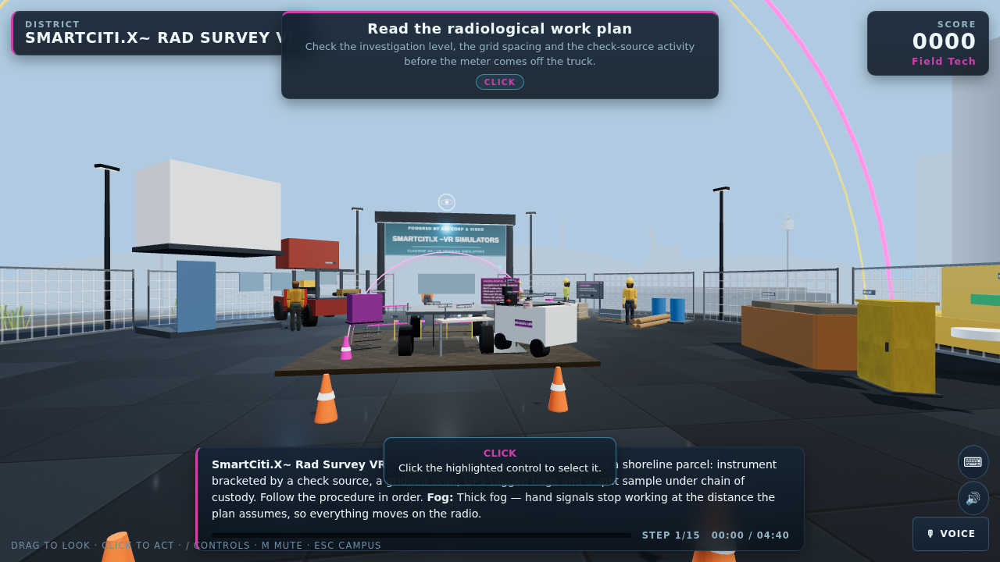 <b>Rad Survey</b> — Gamma walkover and static count on a shoreline parcel: instrument bracketed by a check source, a gridded scan, GPS-tagged flags and a split sample under chain of custody</td><td width="50%">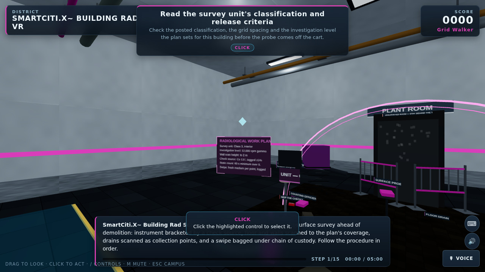 <b>Building Rad Scan</b> — A derelict building's structure-surface survey ahead of demolition: instrument bracketed by a check source, floor and walls scanned to the plan's coverage, drains scanned as collection points, and a swipe bagged under chain of custody</td></tr>
<tr><td width="50%">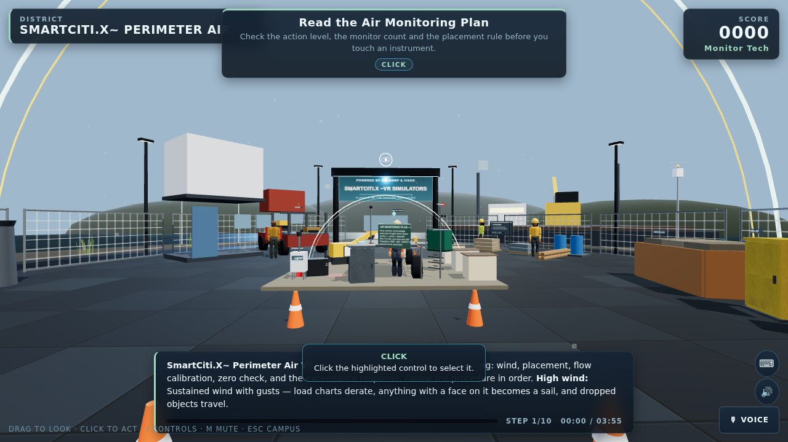 <b>Perimeter Air</b> — Real-time PM10 fence-line monitoring: wind, placement, flow calibration, zero check, and the exceedance response</td><td width="50%">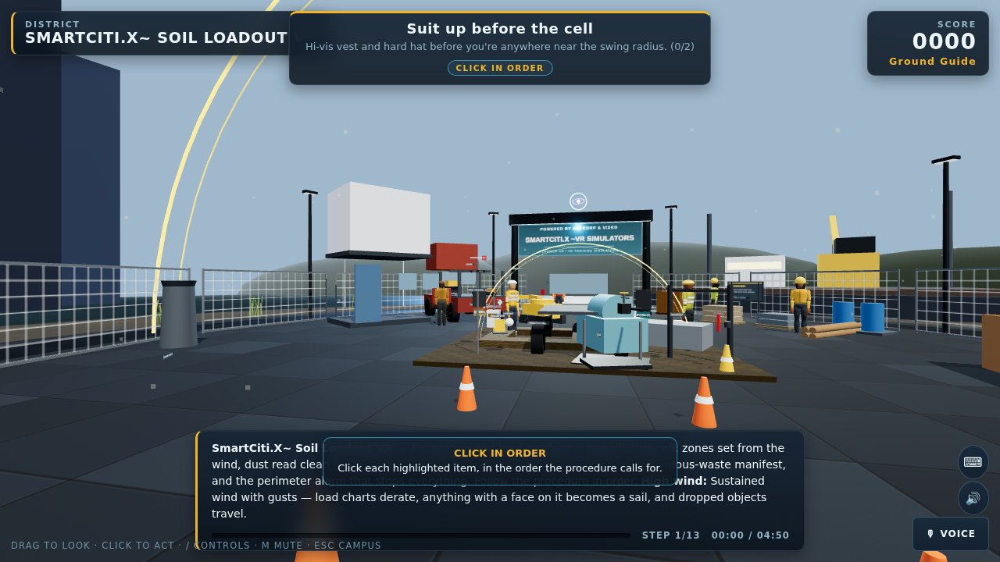 <b>Soil Loadout</b> — Excavation and haul-out from a remediation cell: zones set from the wind, dust read clean before the first bucket, a lined and tarped load under a hazardous-waste manifest, and the perimeter alarm that stops everything</td></tr>
<tr><td width="50%">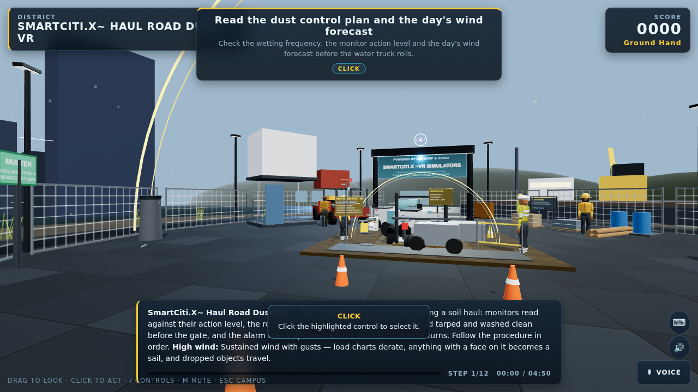 <b>Haul Road Dust</b> — Dust control on the haul road during a soil haul: monitors read against their action level, the road wetted on the plan's schedule, the load tarped and washed clean before the gate, and the alarm that stops the haul the moment the wind turns</td><td width="50%">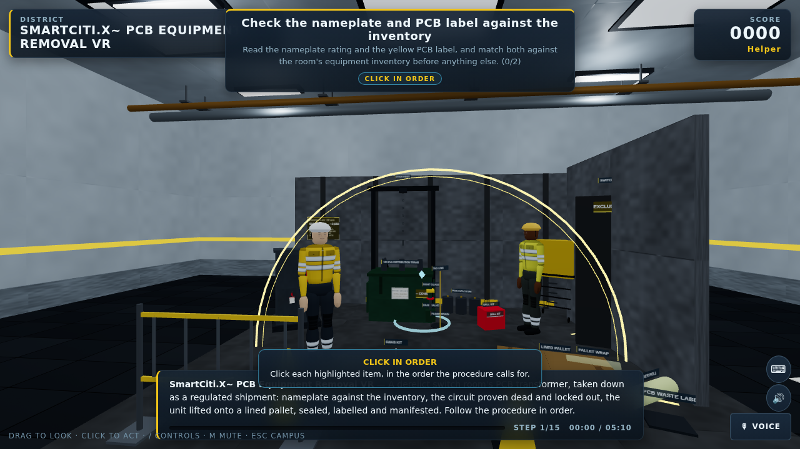 <b>PCB Equipment Removal</b> — A derelict switch room's PCB transformer, taken down as a regulated shipment: nameplate against the inventory, the circuit proven dead and locked out, the unit lifted onto a lined pallet, sealed, labelled and manifested</td></tr>
<tr><td width="50%">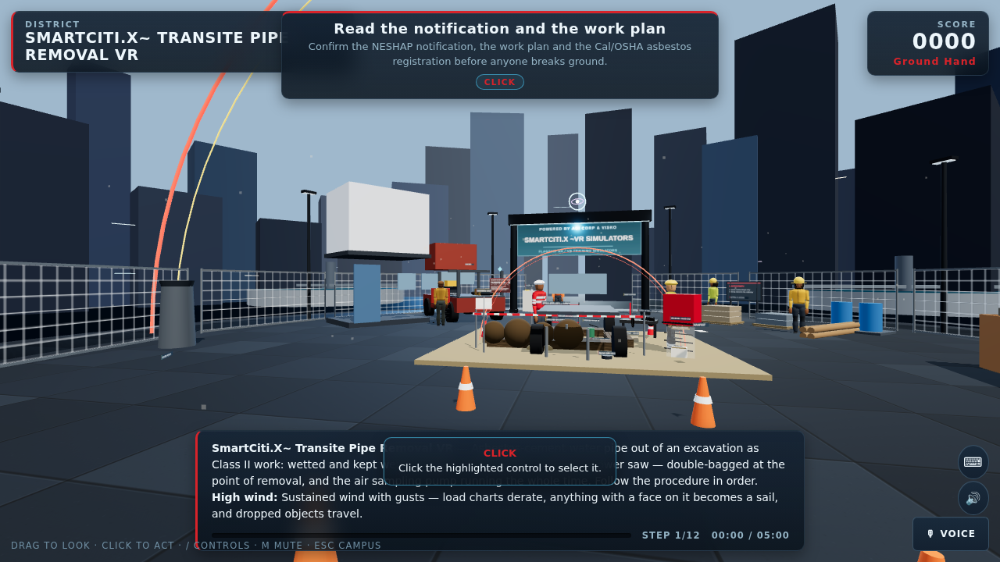 <b>Transite Pipe Removal</b> — Asbestos-cement water pipe out of an excavation as Class II work: wetted and kept wet, cut with a snap cutter — never a power saw — double-bagged at the point of removal, and the air sampling pump running the whole time</td><td width="50%">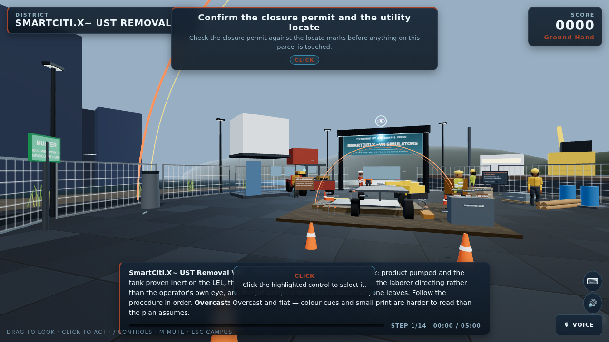 <b>UST Removal</b> — Closing out an underground fuel tank: product pumped and the tank proven inert on the LEL, the pit shored, the tank rigged and lifted by the laborer directing rather than the operator's own eye, and the pit sampled and fenced before anyone leaves</td></tr>
<tr><td width="50%">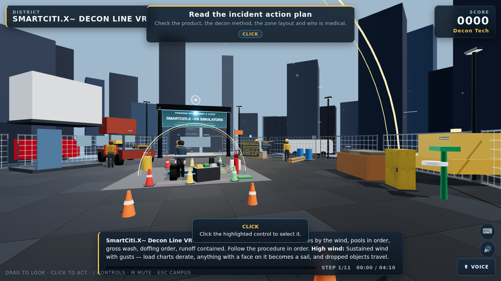 <b>Decon Line</b> — Hazmat decontamination corridor: zones by the wind, pools in order, gross wash, doffing order, runoff contained</td><td width="50%">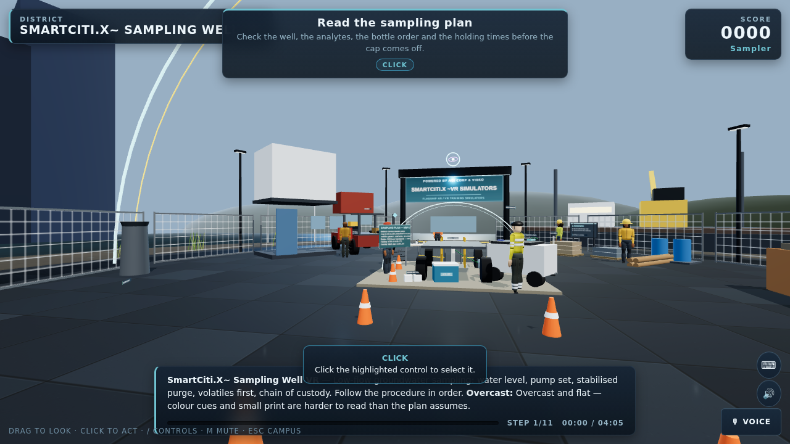 <b>Sampling Well</b> — Low-flow groundwater sampling: water level, pump set, stabilised purge, volatiles first, chain of custody</td></tr>
<tr><td width="50%">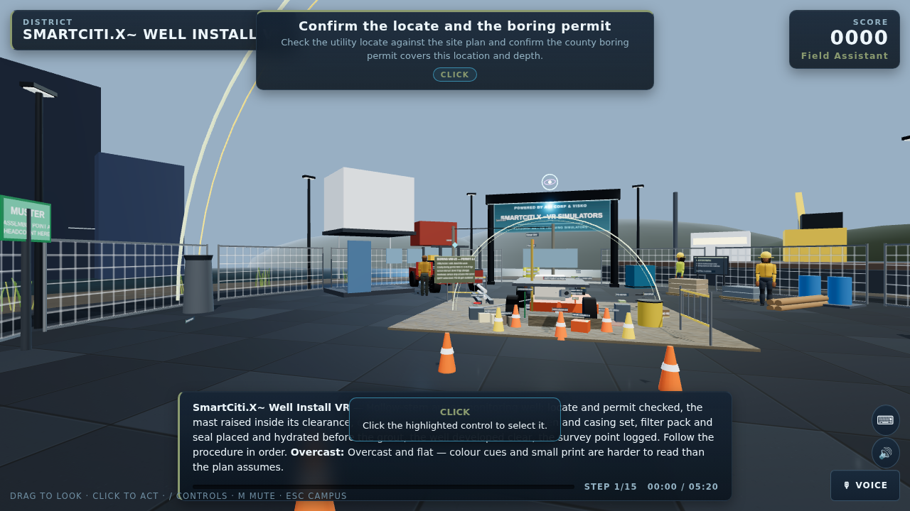 <b>Well Install</b> — Hollow-stem auger monitoring well: locate and permit checked, the mast raised inside its clearance, cuttings screened and drummed, screen and casing set, filter pack and seal placed and hydrated before the grout, the well developed clear, the survey point logged</td><td width="50%">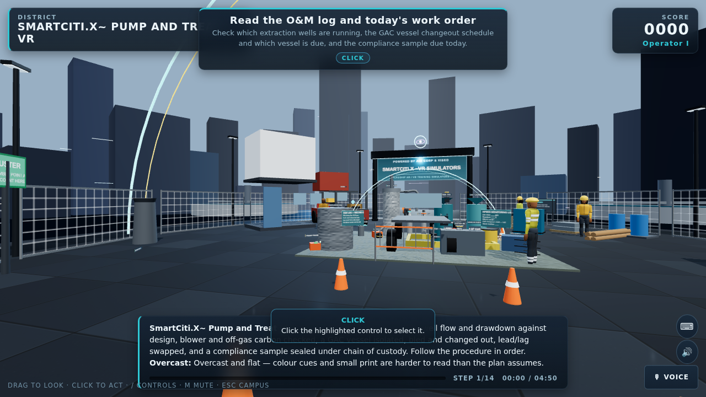 <b>Pump and Treat</b> — Groundwater treatment O&M: well flow and drawdown against design, blower and off-gas carbon checked, a GAC vessel isolated, bled and changed out, lead/lag swapped, and a compliance sample sealed under chain of custody</td></tr>
<tr><td width="50%">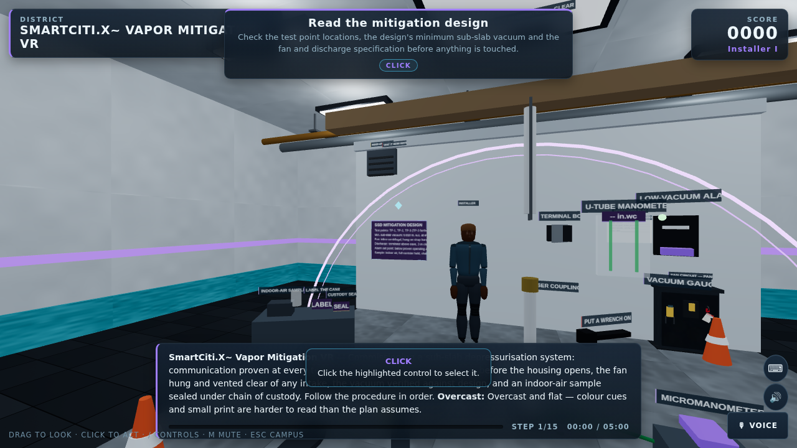 <b>Vapor Mitigation</b> — Commissioning a sub-slab depressurisation system: communication proven at every test point, the fan circuit proven dead before the housing opens, the fan hung and vented clear of any intake, the vacuum verified against design, and an indoor-air sample sealed under chain of custody</td><td width="50%">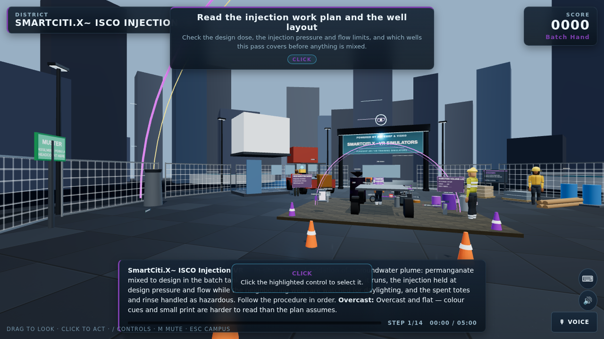 <b>ISCO Injection</b> — In-situ chemical oxidation of a groundwater plume: permanganate mixed to design in the batch tank, the manifold pressure-tested before it runs, the injection held at design pressure and flow while the neighbouring wells are watched for daylighting, and the spent totes and rinse handled as hazardous</td></tr>
<tr><td width="50%">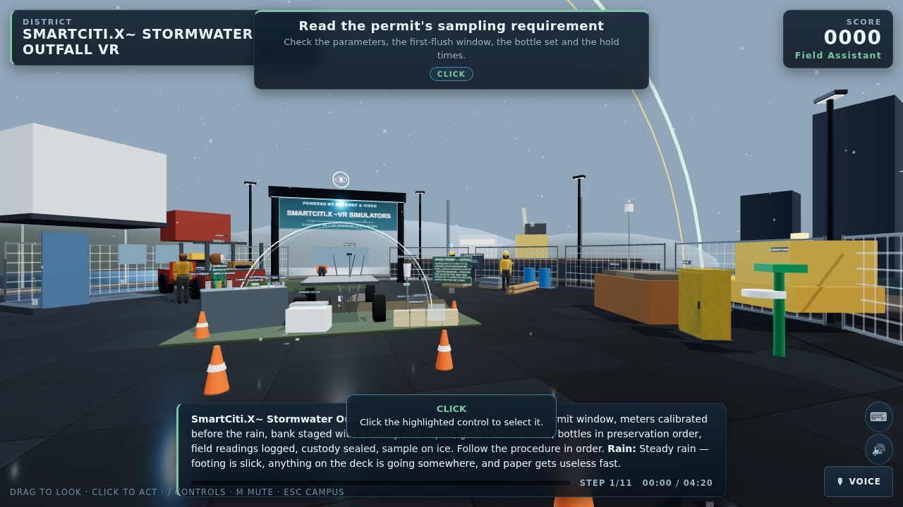 <b>Stormwater Outfall</b> — Wet-weather NPDES grab: permit window, meters calibrated before the rain, bank staged with a buddy and tripod, grab from the flow, bottles in preservation order, field readings logged, custody sealed, sample on ice</td><td width="50%">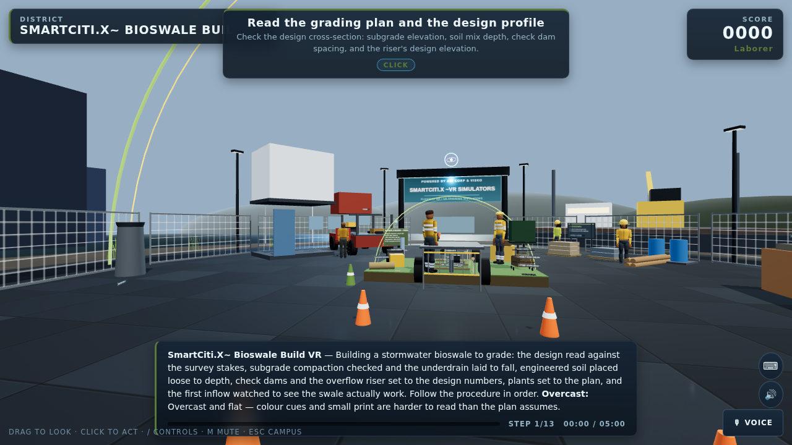 <b>Bioswale Build</b> — Building a stormwater bioswale to grade: the design read against the survey stakes, subgrade compaction checked and the underdrain laid to fall, engineered soil placed loose to depth, check dams and the overflow riser set to the design numbers, plants set to the plan, and the first inflow watched to see the swale actually work</td></tr>
<tr><td width="50%">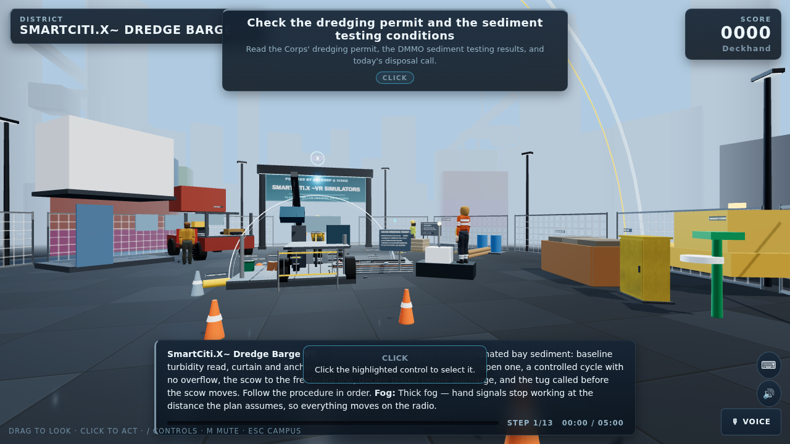 <b>Dredge Barge</b> — Environmental dredging of contaminated bay sediment: baseline turbidity read, curtain and anchors checked, the closed bucket over the open one, a controlled cycle with no overflow, the scow to the freeboard line, decant tested before discharge, and the tug called before the scow moves</td><td width="50%"> <b>Oyster Reef Monitoring</b> — Quarterly reef monitoring on a falling tide: fixed quadrats found by tag and GPS, density counted and logged before the frame moves, tiles turned back to their mark, the sonde read against the permit's own flag level, the drill counted, and the sheet reconciled with the photos before the flood</td></tr>
<tr><td width="50%"> <b>Marsh Transect Survey</b> — Vegetation survey on a fixed transect: bearing set from the start stake, tape run taut to the end stake, percent cover read to protocol class at every quadrat, elevation shot against the benchmark, the invasive hybrid Spartina flagged for the control crew, and the channel edge's erosion pins read before the tide takes the low transect</td><td width="50%">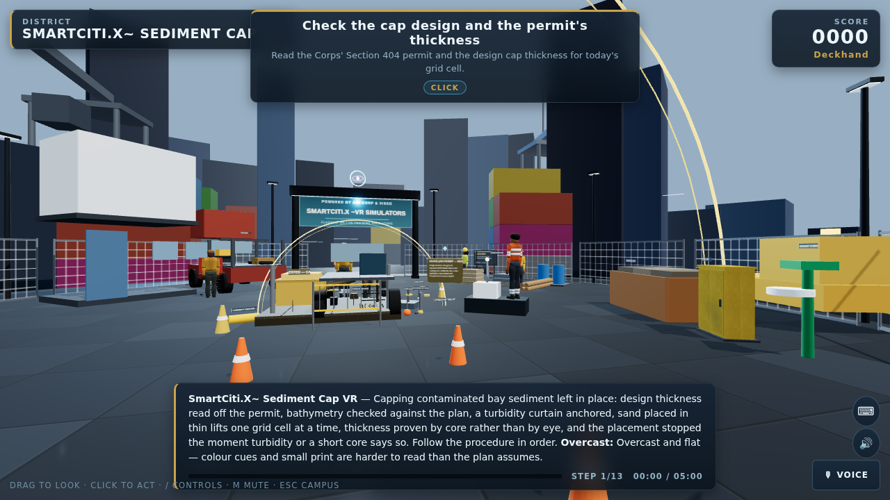 <b>Sediment Cap</b> — Capping contaminated bay sediment left in place: design thickness read off the permit, bathymetry checked against the plan, a turbidity curtain anchored, sand placed in thin lifts one grid cell at a time, thickness proven by core rather than by eye, and the placement stopped the moment turbidity or a short core says so</td></tr>
<tr><td width="50%">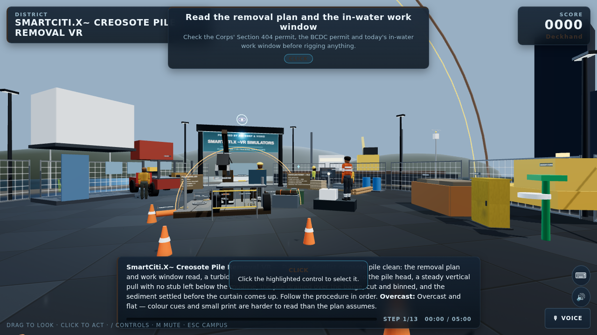 <b>Creosote Pile Removal</b> — Pulling a derelict creosote pile clean: the removal plan and work window read, a turbidity curtain anchored, the choker rigged to the pile head, a steady vertical pull with no stub left below the mudline, the pile drained over the barge, cut and binned, and the sediment settled before the curtain comes up</td><td width="50%"> <b>Tide Gate</b> — Tide-window gate swap: levels read before the cofferdam goes in, a failed flap gate backed out and replaced, the new gate levelled to design elevation, and the cofferdam pulled in order before the first flood</td></tr>
<tr><td width="50%"> <b>Living Shoreline</b> — Building a living shoreline on a falling tide: curtain set and tensioned, coir and oyster shell to the stakes, cordgrass at grade, silt fence at the edge, and the reach walked before the flood takes anything back</td><td width="50%"> <b>Spartina Removal</b> — Invasive hybrid cordgrass control on a restored marsh: treatment map and tide window read, boundary and rail buffer set out, imazapyr mixed off the marsh to the label rate, sprayer calibrated, applied under the wind limit with the drift card checked, clumps flagged for follow-up, containers triple-rinsed, and the treatment logged</td></tr>
<tr><td width="50%"> <b>Eelgrass Transplant</b> — Diver-assisted eelgrass restoration: the dive plan and the tide window read, the donor bed harvested to its permitted share, shoots bundled inside the holding time, the standby diver ready before anyone splashes, planted to the grid on the surface tender's line, and the divers recalled the moment a vessel or the visibility says so</td></tr>
</table>

## Ports, Maritime and Bay Ecology

A container terminal and the water it sits beside: cranes and lashing gangs, shore power for a berthed ship, a fuel transfer with the deck contained, a spill boom worked against the current, ballast water sampled before discharge, a pilot brought aboard and lines taken at the berth.

**Union:** ILWU, the Inlandboatmen's Union of the Pacific, IBEW port electricians, LIUNA and the environmental technicians who monitor the bay

**Certifications and standards:** OSHA 29 CFR 1918 marine terminal safety, the California Air Resources Board At-Berth Regulation, OSHA HAZWOPER 1910.120 and the U.S. Army Corps of Engineers' Section 404 permit conditions for work at the water's edge

A working port and the bay it sits on, worked by the trades that share the same quay: cargo secured and moved, a ship cold-ironed instead of idling, fuel and lines handled without a drop or a hand in the wrong place, and a spill contained before it ever reaches open water.

| # | Station | Trade | Conditions | Steps | Interrupts | Eval | Why it is in the programme |
|---|---|---|---|---|---|---|---|
| 20 | [Dock Crane](../../WebXR/smartcity/index.html?sim=dock-crane) | Longshoreman / container-crane operator | wind | 14 | 2 | 97 | The crane over all of it, with the wind limit and the lashing gang's positions as the hard constraints on every lift. |
| 27 | [Container Lashing](../../WebXR/smartcity/index.html?sim=container-lashing) | Longshore worker — lasher | wind | 11 | 2 | 93 | Deck stow: every twist-lock proven and the rods to the pattern the ship's own manual calls for, crane held off the bay until the gang is clear. |
| 89 | [Shore Power Hookup](../../WebXR/smartcity/index.html?sim=shore-power-hookup) | Port electrician — shore power (cold ironing) | overcast | 13 | 2 | 98 | Cold ironing a berthed ship: ground landed first, the breaker closed only on the port's order, and the auxiliaries shut down clean — the reason the At-Berth Regulation exists. |
| 41 | [Bunkering Watch](../../WebXR/smartcity/index.html?sim=bunkering-watch) | Marine engineer — person in charge of oil transfer | overcast | 12 | 2 | 90 | Fuel transfer as person in charge, with the deck contained before the hose comes aboard and the topping-off rate the whole spill risk comes down to. |
| 99 | [Ballast Water Sampling](../../WebXR/smartcity/index.html?sim=ballast-water-sampling) | Ship's engineer / port state control inspector — ballast water compliance | overcast | 13 | 2 | 97 | The inspection that happens before that same ship ever reaches a working berth: record book and treatment certificate checked, a sample drawn under chain of custody, and the discharge held until the number comes back. |
| 90 | [Spill Boom Deploy](../../WebXR/smartcity/index.html?sim=spill-boom-deploy) | Marine environmental responder — boom deployment | wind | 13 | 2 | 98 | The response when a transfer or a hookup goes wrong anyway: the source secured, a J-boom worked against the current, and the bay kept out of it. |
| 67 | [Pilot Transfer](../../WebXR/smartcity/index.html?sim=pilot-transfer) | Deck officer / able seafarer — pilot transfer party | wind | 15 | 2 | 94 | The harbour pilot brought aboard by ladder in open water, where the transfer itself is the highest-risk minute of the whole call. |
| 29 | [Mooring Line](../../WebXR/smartcity/index.html?sim=mooring-line) | Line handler / wharf mooring crew | wind | 10 | 2 | 95 | Taking the lines that hold the ship to all of this: snap-back zones and the bight nobody stands in. |
| 182 | [Reefer Yard Monitoring](../../WebXR/smartcity/index.html?sim=reefer-yard-monitoring) | Reefer mechanic — ILWU | fog | 13 | 2 | — | The rack these boxes sit on between the crane and the gate: ground proven before the plug goes in, set point and return air read against the manifest, and a leak isolated before anyone else gets near it. |
| 183 | [Straddle Carrier Ops](../../WebXR/smartcity/index.html?sim=straddle-carrier-ops) | Straddle carrier operator — ILWU | overcast | 13 | 2 | — | The machine that moves a box between the stack and the quay: twist-locks proven before the lift, the load carried low down the row, and the wind read the same way the crane reads it. |
| 184 | [Hazmat Container Inspection](../../WebXR/smartcity/index.html?sim=hazmat-container-inspection) | Marine clerk — ILWU, with the Coast Guard's inspection standard | overcast | 13 | 2 | — | The dangerous-goods box on the apron before it ever reaches the crane: placards checked against the declaration, a leak found through the door seam from a safe standoff, and the Coast Guard notified. |

<table>
<tr><td width="50%">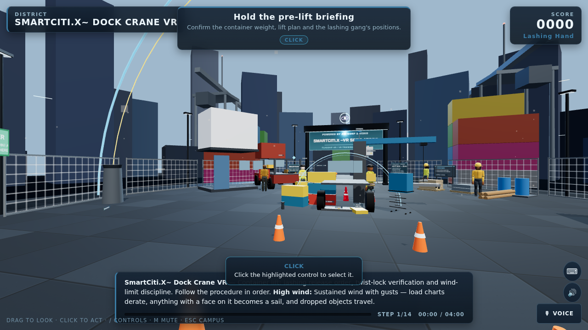 <b>Dock Crane</b> — Container lift: lashing release order, twist-lock verification and wind-limit discipline</td><td width="50%">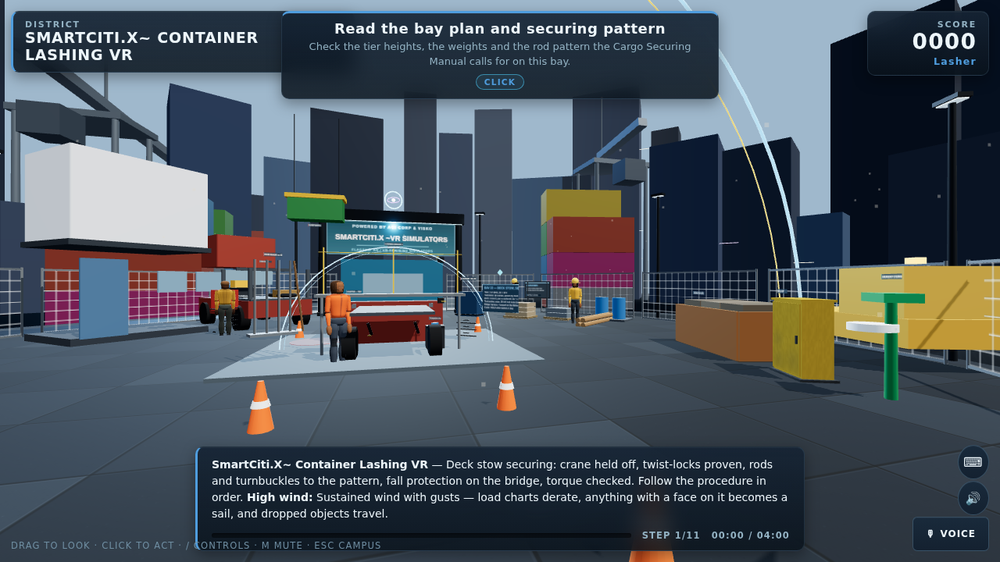 <b>Container Lashing</b> — Deck stow securing: crane held off, twist-locks proven, rods and turnbuckles to the pattern, fall protection on the bridge, torque checked</td></tr>
<tr><td width="50%"> <b>Shore Power Hookup</b> — Cold ironing a berthed ship: compatibility and berth rating checked against the plan, the CMS positioned, the reel paid out by crane, ground landed first, interlock and pilot circuit proven, the breaker closed on the port's order, synchronisation confirmed, and the auxiliaries shut down clean</td><td width="50%">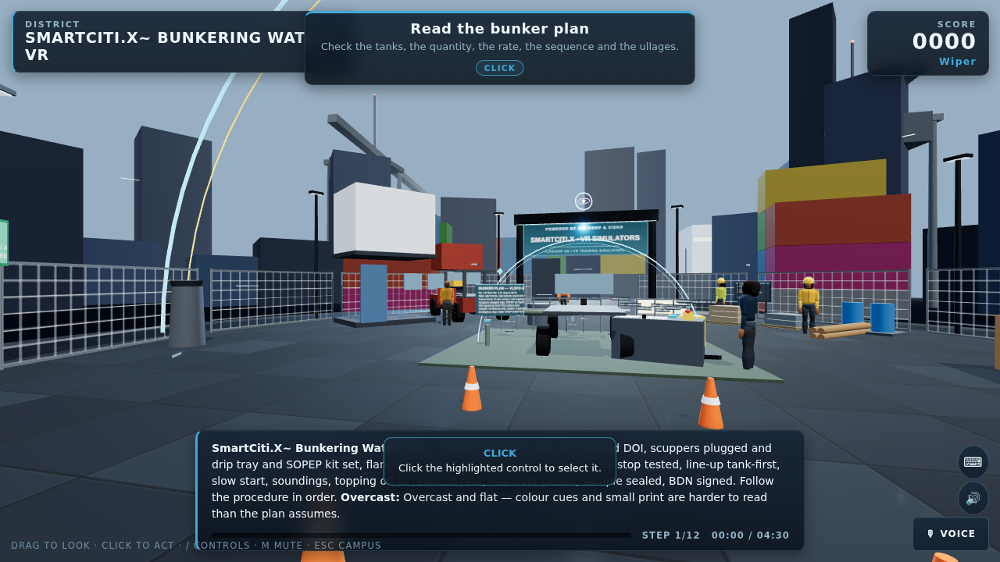 <b>Bunkering Watch</b> — Fuel-oil transfer: plan and signed DOI, scuppers plugged and drip tray and SOPEP kit set, flange bolted all round, radio and emergency stop tested, line-up tank-first, slow start, soundings, topping off at reduced rate, manifold closed, sample sealed, BDN signed</td></tr>
<tr><td width="50%"> <b>Ballast Water Sampling</b> — Port state inspection of a ship's ballast water: record book and management plan against the voyage, the treatment system's certificate checked, the sampling point isolated and flushed, a representative sample under chain of custody, the indicative analysis run, discharge held on the port's order, the officer's signature, and enclosed-space rules observed at the sounding pipe</td><td width="50%"> <b>Spill Boom Deploy</b> — Fuel-dock spill drill: source secured, NRC and OSPR notified, the plan read, boom rigged on deck and worked into a J against the current with the skiff, ends anchored, skimmer staged, sorbent and PPE out for the shore crew, and a decon corridor for anyone leaving the water's edge</td></tr>
<tr><td width="50%">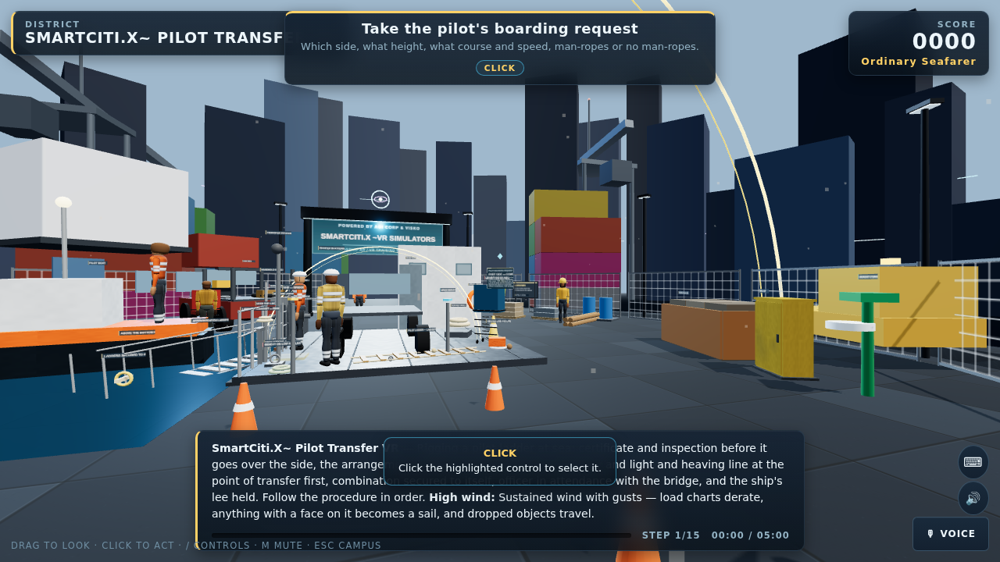 <b>Pilot Transfer</b> — Rigging a pilot ladder at sea: certificate and inspection before it goes over the side, the arrangement to the approved drawing, lifebuoy and light and heaving line at the point of transfer first, combination secured to itself, officer in attendance with the bridge, and the ship's lee held</td><td width="50%">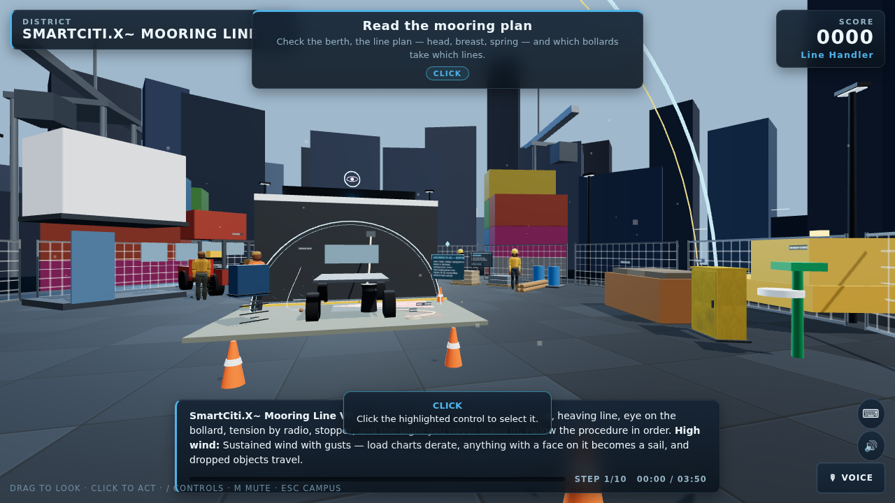 <b>Mooring Line</b> — Taking a ship's lines: snap-back zone, heaving line, eye on the bollard, tension by radio, stopper, and the bight you never stand in</td></tr>
<tr><td width="50%">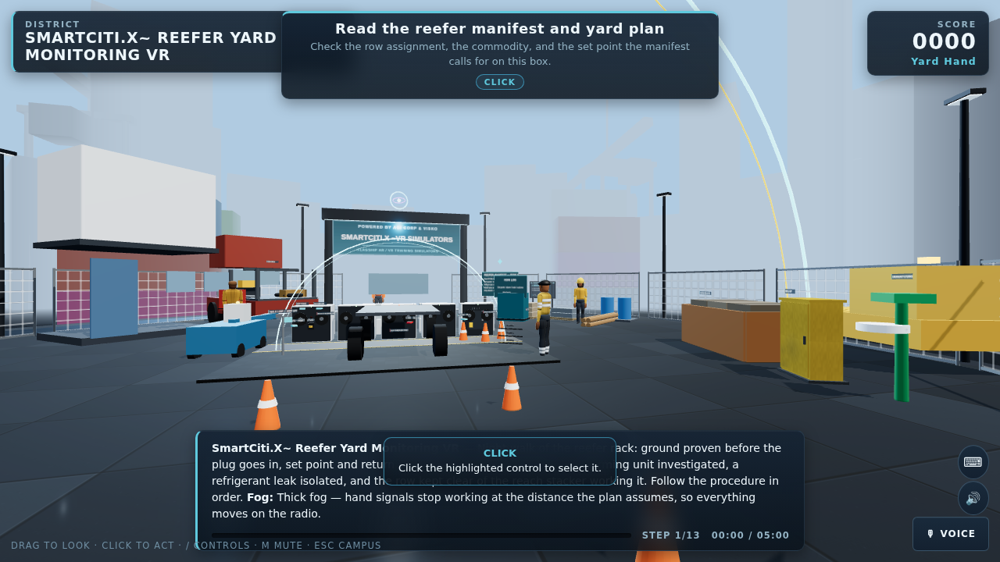 <b>Reefer Yard Monitoring</b> — Night walk of the reefer rack: ground proven before the plug goes in, set point and return air read against the manifest, an alarming unit investigated, a refrigerant leak isolated, and the row kept clear of the reach stacker working it</td><td width="50%">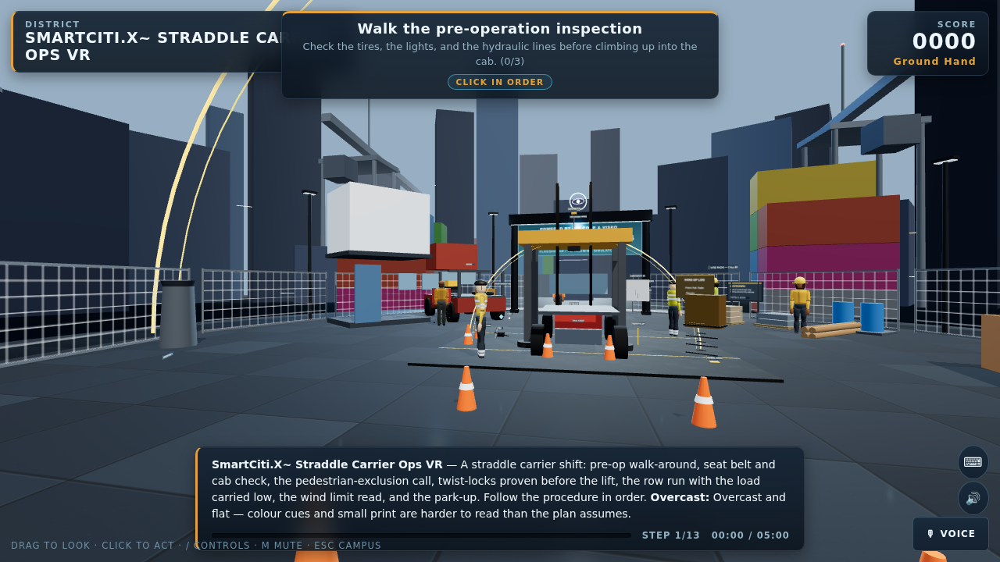 <b>Straddle Carrier Ops</b> — A straddle carrier shift: pre-op walk-around, seat belt and cab check, the pedestrian-exclusion call, twist-locks proven before the lift, the row run with the load carried low, the wind limit read, and the park-up</td></tr>
<tr><td width="50%">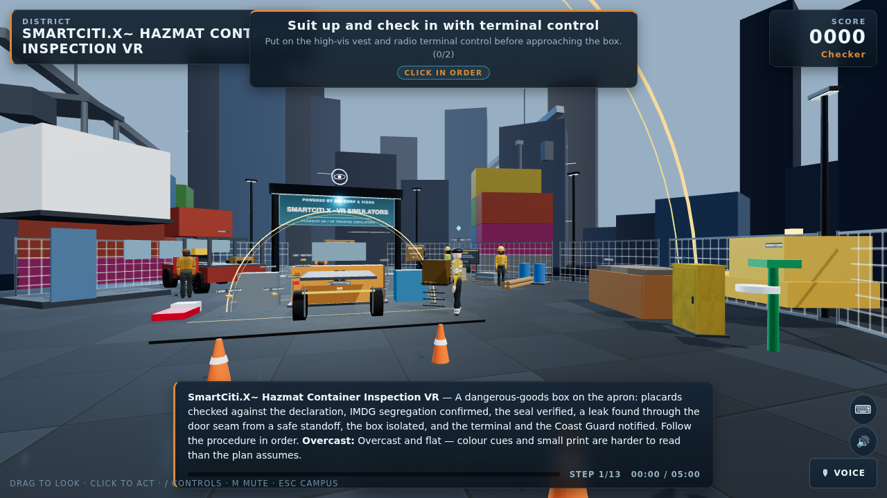 <b>Hazmat Container Inspection</b> — A dangerous-goods box on the apron: placards checked against the declaration, IMDG segregation confirmed, the seal verified, a leak found through the door seam from a safe standoff, the box isolated, and the terminal and the Coast Guard notified</td></tr>
</table>

## Air Quality — Monitoring and Control

Reading the air the crew works in: a site perimeter monitor, a mobile air lab run under wildfire smoke, a certified opacity reading, a stack test, landfill gas and dust control on the haul road.

**Union:** AFSCME air-district technicians, LIUNA environmental laborers, IUOE and USW plant crews

**Certifications and standards:** EPA Method 9 visible emissions (40 CFR 60 Appendix A), EPA 40 CFR Part 58 ambient air quality monitoring, the Bay Area Air Quality Management District's own regulations, and a site's Air Monitoring Plan under a cleanup order

The air a neighbourhood breathes is measured by a short chain of people and instruments, from a fence-line monitor to a stack test to a certified eye reading a plume, each one held to a different standard for a different reason. This block runs that chain end to end, from where the readings are taken to where the emissions actually come from.

| # | Station | Trade | Conditions | Steps | Interrupts | Eval | Why it is in the programme |
|---|---|---|---|---|---|---|---|
| 22 | [Perimeter Air](../../WebXR/smartcity/index.html?sim=air-monitor) | Environmental monitoring technician | wind | 10 | 2 | 95 | The fence line itself: monitors sited by the wind, proven at zero and flow, with an exceedance answered by the plan rather than muted. |
| 96 | [Mobile Air Lab](../../WebXR/smartcity/index.html?sim=mobile-air-lab) | Community air-monitoring van technician | smoke | 14 | 2 | 96 | The same discipline out of a van: sited fresh on the day's wind, every channel zeroed and spanned, and a reference sample running for the neighbourhood's own check. |
| 95 | [Opacity Reading](../../WebXR/smartcity/index.html?sim=opacity-reading) | Visible emissions observer / certified Method 9 reader | wind | 12 | 2 | 97 | What a certified eye adds to what the instruments read: a stack's plume by EPA Method 9, with the geometry proven before the six-minute clock starts. |
| 68 | [Stack Test](../../WebXR/smartcity/index.html?sim=stack-test) | Source emissions tester / stack testing technician | wind | 15 | 2 | 94 | The number that goes in the permit file: an isokinetic source test, bracketed by leak checks that both have to pass or the run does not count. |
| 62 | [Landfill Gas](../../WebXR/smartcity/index.html?sim=landfill-gas) | Landfill gas technician / wellfield operator | wind | 13 | 2 | 91 | Gas held underground instead of vented from a stack, tuned by what the well is actually giving up rather than by how far the valve is opened. |
| 76 | [Soil Loadout](../../WebXR/smartcity/index.html?sim=soil-loadout) | Excavation & haul-out crew — IUOE operator, LIUNA hazmat laborer directing, Teamsters driver | wind | 13 | 2 | 93 | Where the dust a monitor reads can start: an excavation zoned by the wind, wetted at the face, and stopped the moment its own alarm says so. |

<table>
<tr><td width="50%"> <b>Perimeter Air</b> — Real-time PM10 fence-line monitoring: wind, placement, flow calibration, zero check, and the exceedance response</td><td width="50%"> <b>Mobile Air Lab</b> — A monitoring van sited by the wind, its instruments proven at zero and span, a reference sample running for the community's own check, and the first hour read against the action level</td></tr>
<tr><td width="50%"> <b>Opacity Reading</b> — EPA Method 9 by the book: certification checked, the sun kept at your back, the plume's densest point read for six minutes, and the average carried against the permit</td><td width="50%">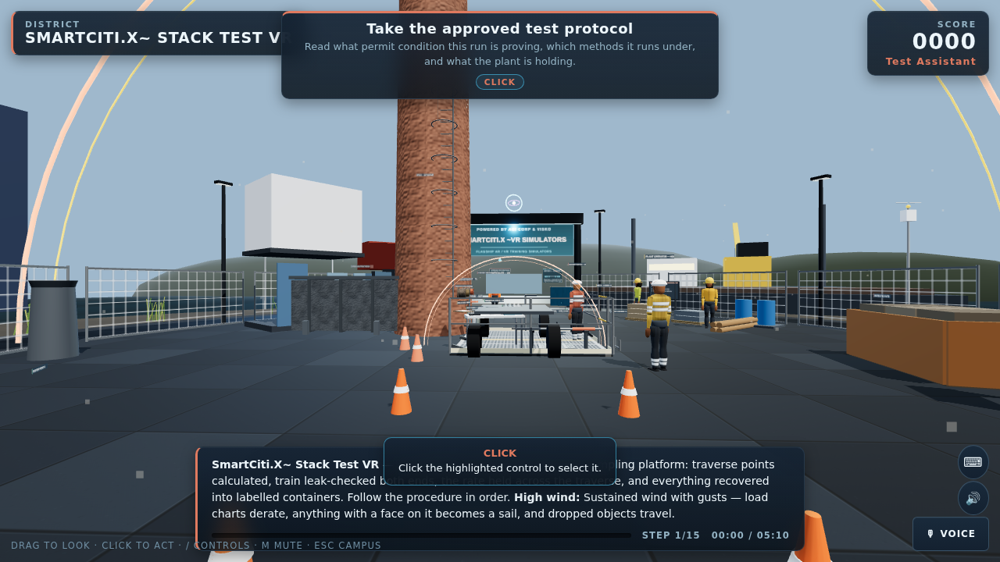 <b>Stack Test</b> — An isokinetic source test from the sampling platform: traverse points calculated, train leak-checked both ends, the rate held across the traverse, and everything recovered into labelled containers</td></tr>
<tr><td width="50%">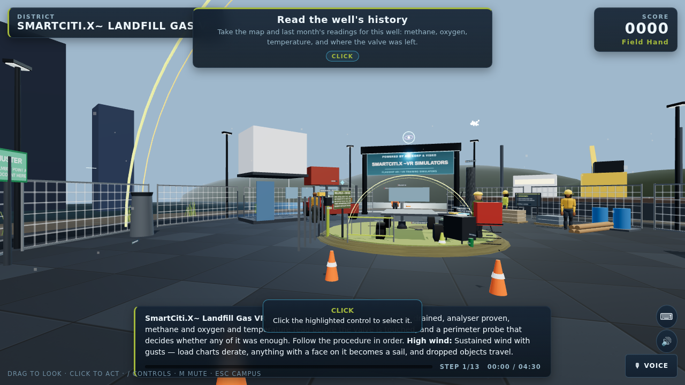 <b>Landfill Gas</b> — Tuning an extraction well: knockout drained, analyser proven, methane and oxygen and temperature read before the valve is touched, and a perimeter probe that decides whether any of it was enough</td><td width="50%"> <b>Soil Loadout</b> — Excavation and haul-out from a remediation cell: zones set from the wind, dust read clean before the first bucket, a lined and tarped load under a hazardous-waste manifest, and the perimeter alarm that stops everything</td></tr>
</table>

## Culinary — The Working Kitchen

Fifteen stations in a working commercial kitchen for UNITE HERE Local 2 kitchen workers: knives, the slicer and the floor mixer; the fryer, the hood suppression system and the gas line; the cold chain from receiving dock to walk-in to two-stage cooling; the dish pit, the grease interceptor and allergen control; banquet hot-holding, cafeteria service and the grill line.

**Union:** UNITE HERE Local 2 cooks, dishwashers and banquet staff; AFSCME and SEIU school and hospital food service

**Certifications and standards:** The FDA Food Code as adopted in the California Retail Food Code, the California Food Handler card and ServSafe manager certification, NFPA 96 for the hood and suppression system, Cal/OSHA's kitchen safety orders, and OSHA 1910.147 for every machine that gets cleaned

Fifteen stations in one kitchen, from the receiving dock to the dish pit. The hazards are the ones a cook actually meets — heat, blades, chemicals, cold, gas and the clock — and the standard behind every step is the one an inspector or a union steward would cite.

| # | Station | Trade | Conditions | Steps | Interrupts | Eval | Why it is in the programme |
|---|---|---|---|---|---|---|---|
| — | Trade Skills: kitchen | — | — | — | — | 98 | The bench case: the line as a first-period cook meets it, before any one hazard is taken apart on its own. |
| 101 | [Knife Skills](../../WebXR/smartcity/index.html?sim=knife-skills) | Prep cook | indoor (kitchen) | 13 | 2 | 96 | The board anchored, the edge honed, and the claw grip that keeps a prep cook's own knuckles between the blade and the cut — plus the mandoline nobody runs bare-handed. |
| 102 | [Slicer Lockout](../../WebXR/smartcity/index.html?sim=slicer-lockout) | Deli / prep cook | indoor (kitchen) | 14 | 2 | 96 | The deli slicer taken apart for a changeover the way a machine shop would: the cord locked out before the guard comes off, and the interlock proven before power goes back in. |
| 103 | [Bakery Mixer](../../WebXR/smartcity/index.html?sim=bakery-mixer) | Baker | indoor (kitchen) | 14 | 2 | 94 | The 60-quart floor mixer whose guard interlock gets proven, not assumed, before anything goes in the bowl — and whose scrape-down only ever happens on a machine that's actually stopped. |
| 104 | [Fryer Oil Change](../../WebXR/smartcity/index.html?sim=fryer-oil-change) | Line cook — UNITE HERE Local 2 | indoor (kitchen) | 14 | 2 | 95 | The vat only gets opened once it has actually cooled — cold and wheeled beats hot and carried, every single change. |
| 105 | [Hood Suppression](../../WebXR/smartcity/index.html?sim=hood-suppression) | Line cook / kitchen fire warden — UNITE HERE Local 2 | indoor (kitchen) | 12 | 2 | 97 | The system over the line only works if the filters, the links and the pull path are checked before the day a flare-up actually tests them. |
| 106 | [Kitchen Gas Shutoff](../../WebXR/smartcity/index.html?sim=kitchen-gas-shutoff) | Kitchen shift lead — UNITE HERE Local 2 | indoor (kitchen) | 13 | 2 | 97 | A gas smell is a procedure, not a guess — no spark searches for it, and the valve, not the nose, decides when the line is clear. |
| 107 | [Walk-In Cooler](../../WebXR/smartcity/index.html?sim=walk-in-cooler) | Line cook / kitchen worker — cold storage | indoor (kitchen) | 13 | 2 | 93 | Cold storage as its own procedure: the inside release proven before the door is trusted, 41 °F confirmed, and stock put away raw-below-ready in the order the Food Code sets. |
| 108 | [Receiving Dock Food](../../WebXR/smartcity/index.html?sim=receiving-dock-food) | Receiving clerk / kitchen worker — food deliveries | indoor (kitchen) | 14 | 2 | 93 | The delivery that stocks that cooler in the first place: every cold, frozen and hot item probed at the dock and refused outside the Food Code's own limits, before anything reaches a shelf. |
| 109 | [Prep Cooling](../../WebXR/smartcity/index.html?sim=prep-cooling) | Line cook — hot food cooling | indoor (kitchen) | 13 | 2 | 93 | The other half of the clock: a cooked batch brought down through 70 °F in two hours and 41 °F in six, with the reheat-or-discard call for the one that misses it. |
| 110 | [Dish Pit](../../WebXR/smartcity/index.html?sim=dish-pit) | UNITE HERE Local 2 dishwasher / kitchen steward | indoor (kitchen) | 13 | 2 | 96 | The dish machine and the three-compartment sink: chemical lines checked, the sanitiser strip-tested and logged, and an eyewash proven clear before the first jug is opened. |
| 111 | [Grease Trap](../../WebXR/smartcity/index.html?sim=grease-trap) | UNITE HERE Local 2 kitchen steward / facilities laborer | indoor (kitchen) | 14 | 2 | 97 | Servicing the under-sink grease interceptor: the confined-space question answered correctly, the 25 percent rule read off the stick, and the waste sealed for the hauler rather than sent down a drain. |
| 112 | [Allergen Control](../../WebXR/smartcity/index.html?sim=allergen-control) | UNITE HERE Local 2 line cook | indoor (kitchen) | 12 | 2 | 96 | An allergen order on the line: the ticket called back, the purple board and dedicated pan pulled, and the plate walked to the pass by the cook who built it. |
| 113 | [Banquet Hot Hold](../../WebXR/smartcity/index.html?sim=banquet-hot-hold) | Banquet cook | indoor (kitchen) | 14 | 2 | 96 | The banquet line: hot boxes probed before they're loaded, chafers lit lid-open, the buffet walked before doors, and a pull-down cooled or discarded to the rule. |
| 114 | [Cafeteria Serving](../../WebXR/smartcity/index.html?sim=cafeteria-serving) | School nutrition service worker | indoor (kitchen) | 13 | 2 | 98 | The school lunch line under the National School Lunch Program: the meal pattern's five components, offer versus serve, the wells probed and the count reconciled for the reimbursement claim. |
| 115 | [Grill Line Burns](../../WebXR/smartcity/index.html?sim=grill-line-burns) | Line cook — grill / sauté | indoor (kitchen) | 13 | 2 | 96 | The grill and sauté station's own hazard, worked as a drill: handles in, a dry pan, a flambé cleared of the filters, and cool water run the full twenty minutes. |

<table>
<tr><td width="50%"> <b>Knife Skills</b> — Board anchored, edge honed, claw grip, the cut-resistant glove on the mandoline, and a clean sanitised close</td><td width="50%"> <b>Slicer Lockout</b> — Cord locked before the guard comes off, the blade cleaned gloved and edge-away, sanitiser contact time, and the interlock proven before the plug goes back in</td></tr>
<tr><td width="50%"> <b>Bakery Mixer</b> — Bowl guard proven, the lift locked, the attachment pinned, ingredients through the chute, and the mixer stopped before anything comes near the bowl</td><td width="50%"> <b>Fryer Oil Change</b> — Cold vat, caddy not a bucket, boil-out, the dry route to the rendering bin, and a covered element before the heat goes back on</td></tr>
<tr><td width="50%"> <b>Hood Suppression</b> — The cook's-side hood inspection and the fire response: filters, fusible links, the pull station's clear path, and the drill itself</td><td width="50%"> <b>Kitchen Gas Shutoff</b> — A gas smell on the line: no spark used to search, every appliance and the emergency valve closed, the room swept at floor level, and a pilot-by-pilot relight</td></tr>
<tr><td width="50%"> <b>Walk-In Cooler</b> — Opening check and a stocking run: inside release and light proven before the door closes, 41 °F confirmed, gasket and floor checked, raw-below-ready stocking, FIFO dates, a case lifted right, and the compressor alarm read</td><td width="50%"> <b>Receiving Dock Food</b> — A delivery at the kitchen dock: invoice against the order, the truck's reefer read before the door opens, every cold and frozen item probed and refused outside the limit, packaging and dates checked, refusals logged, goods moved to cold storage in the window, and the log signed</td></tr>
<tr><td width="50%"> <b>Prep Cooling</b> — Cooling stock and a hotel pan of rice inside the Food Code's clock: shallow pans, an ice paddle, the blast chiller, temperatures logged at two and six hours, a pan covered only once cold, dated with its own discard date, and the reheat-or-discard call when the two-hour mark is missed</td><td width="50%"> <b>Dish Pit</b> — The dish machine and the three-compartment sink: concentrate lines checked, sanitiser strip-tested and logged, the machine's final rinse read against the gauge, wash-rinse-sanitise held for its contact time, the eyewash proven clear, and a splash to the eye drilled</td></tr>
<tr><td width="50%"> <b>Grease Trap</b> — Servicing the under-sink grease interceptor: confined-space question answered, lid lifted with the tool, grease and solids measured against the 25 percent rule, contents pumped to a sealed container, baffles checked, unit rinsed and resealed, manifest and log filed</td><td width="50%"> <b>Allergen Control</b> — An allergen order on the line: the ticket's flag called back, the purple board and dedicated tools pulled, hands washed and gloves changed, the mise checked against the recipe's allergen list, the dish built in the dedicated pan away from the shared fryer, and the plate marked and walked personally to the pass</td></tr>
<tr><td width="50%"> <b>Banquet Hot Hold</b> — Banquet hot line: hot boxes probed, chafers lit lid-open, the buffet walked, time tags honoured, and the pull-down done to the rule</td><td width="50%"> <b>Cafeteria Serving</b> — The school lunch line: meal pattern, offer versus serve, wells probed and logged, and the count for the reimbursement claim</td></tr>
<tr><td width="50%"> <b>Grill Line Burns</b> — The grill and sauté line: handles in, a dry pan, calls through the aisle, a flambé clear of the filters, and the burn drill run cold</td></tr>
</table>

## Dental Hygiene — Unspoken Smiles

A fifteen-station dental-hygienist series built for the Unspoken Smiles training programmes: the operatory turned over and instruments reprocessed, sharps exposure response, screening and radiographs, scaling, aerosol control and preventive care, nitrous oxide, chairside emergencies and amalgam waste, and the outreach van that brings the clinic to a school.

**Union:** SEIU and UFCW dental and clinic staff, AFSCME public-health hygienists, and the ADHA as the profession's body

**Certifications and standards:** The CDC's Guidelines for Infection Control in Dental Health-Care Settings, OSHA 29 CFR 1910.1030 bloodborne pathogens and 1910.1200 hazard communication, the state dental board's practice act, the EPA amalgam rule (40 CFR 441), and the ADA's radiographic guidance

Fifteen stations that make a hygienist's clinical day — the operatory, the sterilisation centre, the chairside procedures, the emergencies and the outreach van — into scored procedures a training programme can run and record. Every step names the guideline it stands on.

| # | Station | Trade | Conditions | Steps | Interrupts | Eval | Why it is in the programme |
|---|---|---|---|---|---|---|---|
| — | Trade Skills: phlebotomy | — | — | — | — | 91 | The bench case every clinical trade shares: sharps, bloodborne pathogens and the exposure control plan, before a single dental instrument is picked up. |
| 116 | [Operatory Turnover](../../WebXR/smartcity/index.html?sim=operatory-turnover) | Dental hygienist | indoor (clinic) | 13 | 2 | 93 | The turnover between patients: sharps and instruments contained at the point of use, the disinfectant held to its own label's contact time, barriers changed and nothing left on the tray for the next patient to find. |
| 117 | [Instrument Reprocessing](../../WebXR/smartcity/index.html?sim=instrument-reprocessing) | Dental hygienist | indoor (clinic) | 14 | 2 | 96 | The sterilisation centre behind that turnover: mechanical cleaning instead of a hand scrub, a chemical indicator in every pack, and the weekly spore test that is the only proof any cycle actually worked. |
| 118 | [Sharps Exposure Response](../../WebXR/smartcity/index.html?sim=sharps-exposure-response) | Dental hygienist | indoor (clinic) | 11 | 2 | 95 | The needlestick this whole chain exists to prevent: washed, reported at once, and into evaluation inside the hours that make post-exposure prophylaxis worth anything. |
| 119 | [Patient Intake Screening](../../WebXR/smartcity/index.html?sim=patient-intake-screening) | Dental hygienist | indoor (clinic) | 13 | 2 | 96 | The first ten minutes with any patient: the history read and flagged, vitals taken, an exam done in order, and consent signed before a single instrument is picked up. |
| 120 | [Radiograph Safety](../../WebXR/smartcity/index.html?sim=radiograph-safety) | Dental hygienist — radiographer | indoor (clinic) | 13 | 2 | 96 | A bitewing series taken under ALARA, so every exposure this programme's stations show is one the selection criteria actually called for. |
| 121 | [Periodontal Charting](../../WebXR/smartcity/index.html?sim=periodontal-charting) | Dental hygienist | indoor (clinic) | 13 | 2 | 96 | The full periodontal chart that a cleaning is planned around, staged and graded to the 2017 classification rather than read off a single deep number. |
| 122 | [Ultrasonic Scaling](../../WebXR/smartcity/index.html?sim=ultrasonic-scaling) | Dental hygienist | indoor (clinic) | 15 | 2 | 95 | A scaling and root planing appointment run the way NIOSH's own ergonomics guidance and the CDC's waterline standard both assume it will be — waterline verified before the tip touches anyone, and the operator's own wrist held as carefully as the root surface. |
| 123 | [Aerosol Management](../../WebXR/smartcity/index.html?sim=aerosol-management) | Dental hygienist | indoor (clinic) | 15 | 2 | 95 | Turning the same operatory over for an aerosol-generating procedure: the room's own air changes and a HEPA unit sized to them, an N95 seal-checked every time, and a fallow time the chair has to earn before the next patient sits down. |
| 124 | [Fluoride and Sealants](../../WebXR/smartcity/index.html?sim=fluoride-and-sealants) | Dental hygienist | indoor (clinic) | 15 | 2 | 94 | Preventive care on a child: a measured varnish dose for the age in the chair, then sealants etched to the label's time, rinsed to the frosted look, and recorded for the recall so the programme can show what it retained. |
| 125 | [Nitrous Oxide Monitoring](../../WebXR/smartcity/index.html?sim=nitrous-oxide-monitoring) | Dental hygienist | indoor (clinic) | 13 | 2 | 97 | The hygienist's own separate permit at work: screening, the fail-safe, scavenging and a titration held inside NIOSH's exposure limit and the board's ceiling on the concentration itself. |
| 126 | [Chairside Emergency](../../WebXR/smartcity/index.html?sim=chairside-emergency) | Dental hygienist | indoor (clinic) | 12 | 2 | 95 | The chair's worst afternoon: a syncope that will not resolve, an anaphylaxis to the local anaesthetic, and the office emergency kit and the AED carrying the response from there. |
| 127 | [Amalgam Waste Handling](../../WebXR/smartcity/index.html?sim=amalgam-waste-handling) | Dental hygienist | indoor (clinic) | 15 | 2 | 93 | The mercury side of the same clinic: a certified separator, scrap routed to one labelled stream instead of the trash or the sharps, and a manifest to the recycler at the end of it. |
| 128 | [Mobile Dental Outreach](../../WebXR/smartcity/index.html?sim=mobile-dental-outreach) | Registered dental hygienist in alternative practice (RDHAP) | wind | 15 | 2 | 97 | The clinical day carried off the operatory entirely: an RDHAP's community-practice rules and the CDC's mobile-setting guidance, run from a van's side door rather than a fixed room. |
| 129 | [Pediatric Visit](../../WebXR/smartcity/index.html?sim=pediatric-visit) | Registered dental hygienist — pediatric practice | indoor (clinic) | 13 | 2 | 98 | The youngest patient this programme sees: tell-show-do and a plan that bends to a five-year-old's cooperation, with the referral as the answer when a parent asks for more than a hygienist's scope allows. |
| 130 | [Oral Cancer Screening](../../WebXR/smartcity/index.html?sim=oral-cancer-screening) | Registered dental hygienist | indoor (clinic) | 13 | 2 | 97 | The screening every adult recall should already include: a fixed extraoral-to-intraoral order, a finding described in terms a surgeon can act on, and the two-week rule that decides whether it waits or it's referred today. |

<table>
<tr><td width="50%"> <b>Operatory Turnover</b> — Dirty-to-clean turnover: sharps and instruments contained at point of use, surfaces held to full contact time, barriers changed, lines flushed, the next setup laid out sterile</td><td width="50%"> <b>Instrument Reprocessing</b> — Sterilization centre: mechanical cleaning, inspection, chemical-indicator packaging, an autoclave cycle read from its own printout, and the weekly spore test that proves it worked</td></tr>
<tr><td width="50%"> <b>Sharps Exposure Response</b> — A needlestick mid-scaling: stopped safely, washed not squeezed, reported at once, the source pursued with consent, evaluation inside the hours that matter, and the stick logged and reviewed</td><td width="50%">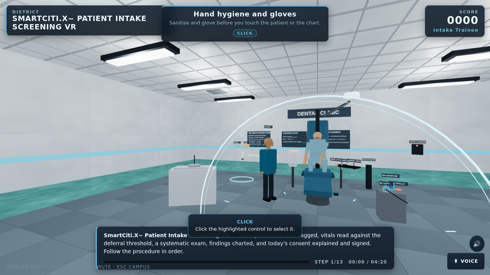 <b>Patient Intake Screening</b> — History reviewed and flagged, vitals read against the deferral threshold, a systematic exam, findings charted, and today's consent explained and signed</td></tr>
<tr><td width="50%">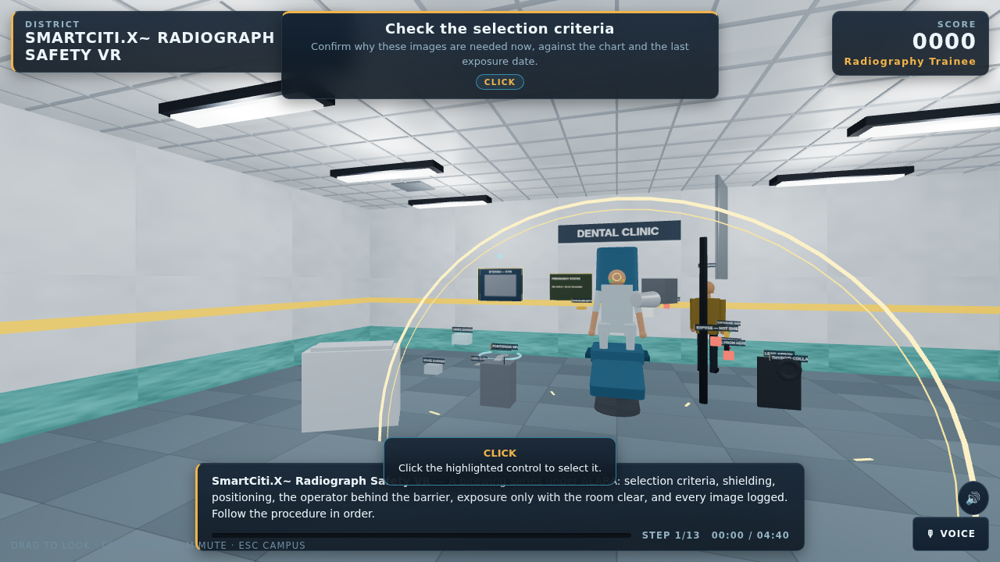 <b>Radiograph Safety</b> — A bitewing series under ALARA: selection criteria, shielding, positioning, the operator behind the barrier, exposure only with the room clear, and every image logged</td><td width="50%">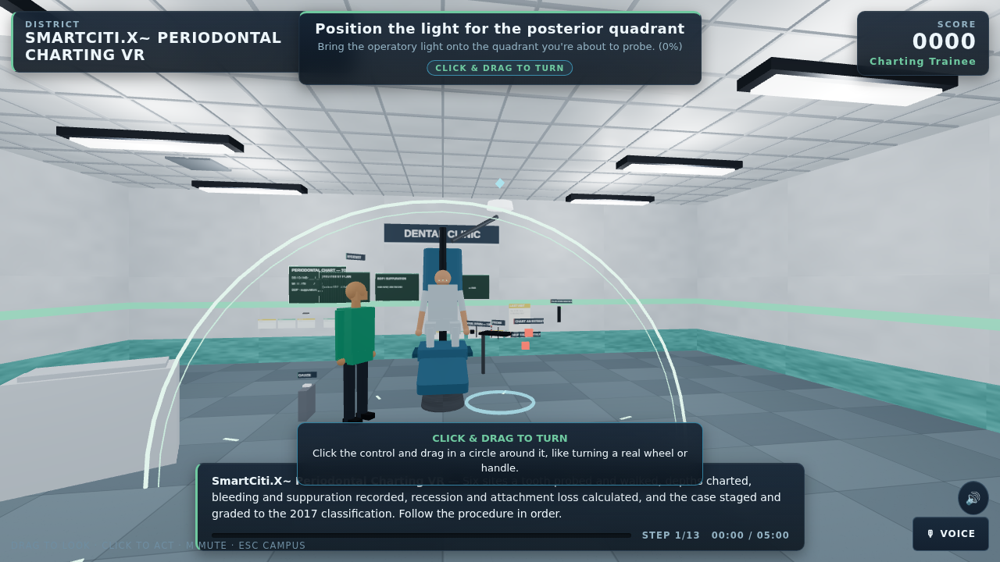 <b>Periodontal Charting</b> — Six sites a tooth probed and walked, depths charted, bleeding and suppuration recorded, recession and attachment loss calculated, and the case staged and graded to the 2017 classification</td></tr>
<tr><td width="50%">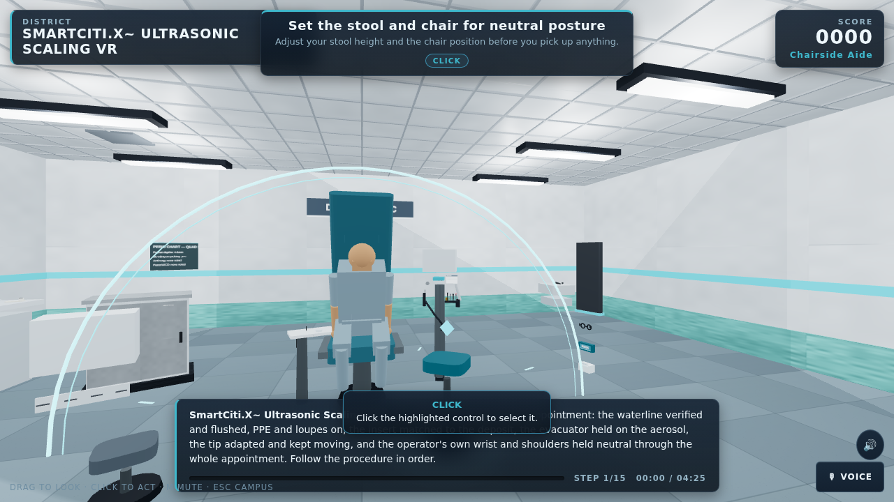 <b>Ultrasonic Scaling</b> — A scaling and root planing appointment: the waterline verified and flushed, PPE and loupes on, the insert matched to the deposit, the evacuator held on the aerosol, the tip adapted and kept moving, and the operator's own wrist and shoulders held neutral through the whole appointment</td><td width="50%"> <b>Aerosol Management</b> — Turning an operatory over for an aerosol-generating procedure: the room's own air changes and a portable HEPA unit sized to them, HVE and pre-procedural rinse, an N95 seal-checked every time it goes on, the dam where it fits, and the room left to settle its own fallow time before the next patient sits down</td></tr>
<tr><td width="50%">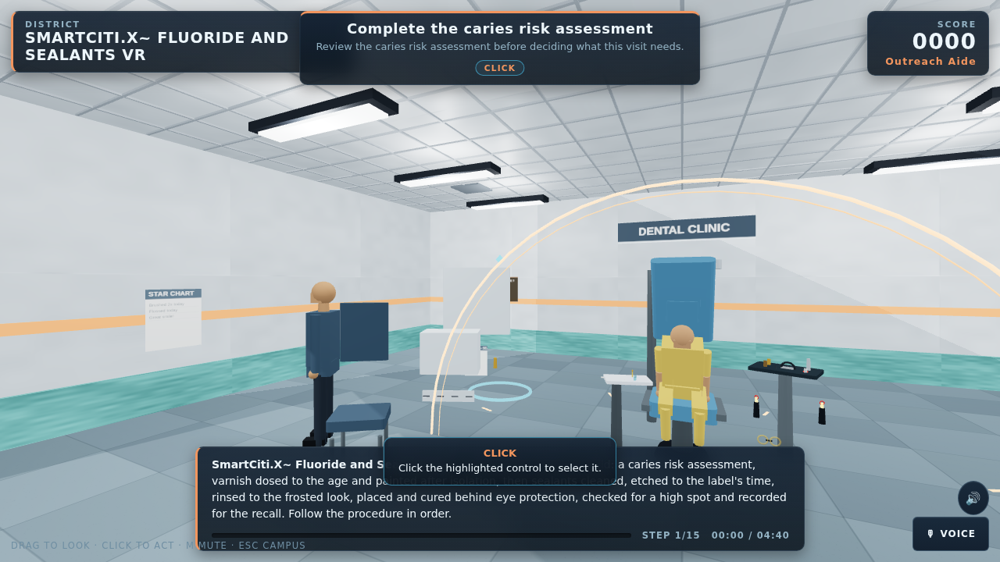 <b>Fluoride and Sealants</b> — Preventive care on a child: a caries risk assessment, varnish dosed to the age and painted after isolation, then sealants cleaned, etched to the label's time, rinsed to the frosted look, placed and cured behind eye protection, checked for a high spot and recorded for the recall</td><td width="50%"> <b>Nitrous Oxide Monitoring</b> — Permit, patient screening, fail-safe and scavenging checks, titration and monitored recovery on a nitrous oxide-oxygen sedation</td></tr>
<tr><td width="50%"> <b>Chairside Emergency</b> — Syncope, escalating to anaphylaxis and a pulseless patient — the office emergency kit, BLS and the AED</td><td width="50%"> <b>Amalgam Waste Handling</b> — Separator certification and canister change, scrap routed to the amalgam waste stream, the recycler's manifest and a mercury spill kit</td></tr>
<tr><td width="50%">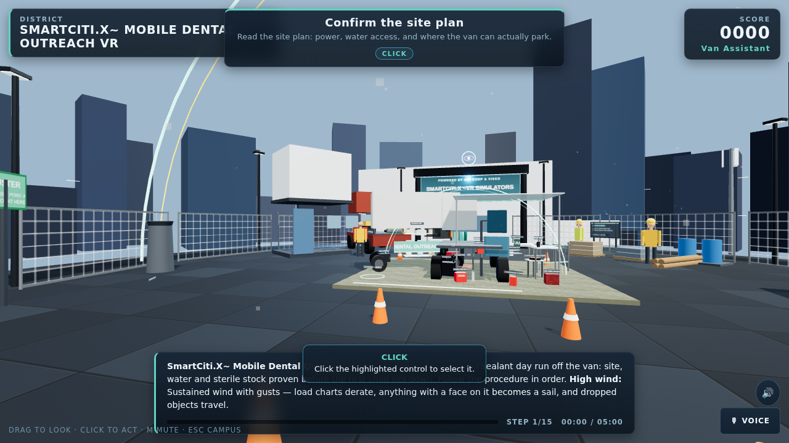 <b>Mobile Dental Outreach</b> — A school screening and sealant day run off the van: site, water and sterile stock proven before the first child sits down</td><td width="50%">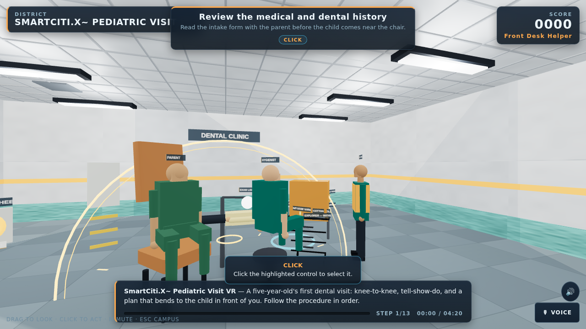 <b>Pediatric Visit</b> — A five-year-old's first dental visit: knee-to-knee, tell-show-do, and a plan that bends to the child in front of you</td></tr>
<tr><td width="50%">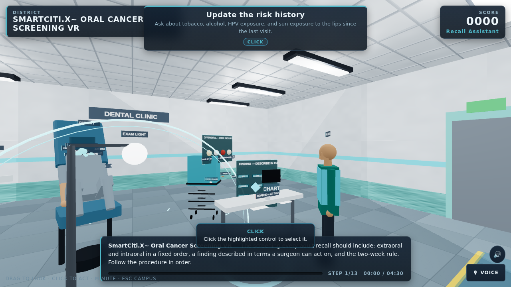 <b>Oral Cancer Screening</b> — The screening every adult recall should include: extraoral and intraoral in a fixed order, a finding described in terms a surgeon can act on, and the two-week rule</td></tr>
</table>

## Bartending — Behind the Bar

A full bartending course for UNITE HERE Local 2 bartenders and barbacks with the customers in it: opening the well, checking ID, pouring to spec, cutting off an intoxicated guest, responding to a spiked drink, de-escalating harassment, the keg cellar, glass in the ice well, line cleaning, the till and a robbery, allergens, last call, tips and the law, the workplace violence plan and a Responsible Beverage Service capstone.

**Union:** UNITE HERE Local 2 bartenders and barbacks

**Certifications and standards:** California ABC Responsible Beverage Service certification (mandatory for anyone serving alcohol since 2022), TIPS or ServSafe Alcohol, the California Retail Food Code for ice and glassware, Cal/OSHA's workplace violence prevention plan requirement, and California Labor Code 351 on tips

Fifteen stations from opening the well to closing the till, and the customers in between: the one who is twenty, the one who has had enough, the one who will not take no, and the one whose drink was touched while she looked away. Every step names the law or the standard a bartender is held to.

| # | Station | Trade | Conditions | Steps | Interrupts | Eval | Why it is in the programme |
|---|---|---|---|---|---|---|---|
| — | Trade Skills: kitchen | — | — | — | — | 98 | The kitchen the bar shares a wall with: the Food Code for ice, glassware and the sanitiser bucket, before a single drink is poured. |
| 131 | [Opening the Well](../../WebXR/smartcity/index.html?sim=bar-well-setup) | Bartender — UNITE HERE Local 2 | indoor (bar) | 12 | 2 | 96 | Opening the bar itself: sanitiser tested to strength, the ice well burned out and refilled with a scoop that never touches a glass, garnish gloved and dated, and the licence and RBS certificates posted before the first guest is let in. |
| 132 | [Checking ID](../../WebXR/smartcity/index.html?sim=id-check-underage) | Bartender — UNITE HERE Local 2 | indoor (bar) | 14 | 2 | 93 | The door: F.L.A.G. worked in order, a UV check against the security features, the birth-date math done against the calendar, and a refusal that is polite, documented and handed off to the rest of the bar. |
| 133 | [Pouring to Spec](../../WebXR/smartcity/index.html?sim=jigger-pour-spec) | Bartender — UNITE HERE Local 2 | indoor (bar) | 12 | 2 | 95 | The pour itself: the standard drink measured to the jigger, a counted free pour held steady, shaken, stirred and built each to its own method, and the round logged per customer the way RBS training expects. |
| 134 | [Cut-Off / Overservice](../../WebXR/smartcity/index.html?sim=cutoff-overservice) | Bartender — UNITE HERE Local 2 | indoor (bar) | 14 | 2 | 94 | The RBS cues read in a real guest, the pour slowed before it is refused outright, and the cutoff itself said quietly once, backed by §25602 and the dram-shop exposure it carries for the licence. |
| 135 | [Spiked Drink Response](../../WebXR/smartcity/index.html?sim=spiked-drink-response) | Bartender — UNITE HERE Local 2 | indoor (bar) | 13 | 2 | 94 | Patron safety when the cues are somebody else's drink, not his own tab: the rail watched, the safe-word scheme posted, and a suspect glass retained rather than rinsed the moment a guest is not the person her count says she should be. |
| 136 | [Patron De-escalation](../../WebXR/smartcity/index.html?sim=patron-deescalation) | Bartender — UNITE HERE Local 2 | indoor (bar) | 13 | 2 | 94 | A confrontation worked from behind the bar's own barrier — named once, backed up, refused — with the panic button the instant a hand crosses the bar and the 8 CCR §3342 log it leaves behind. |
| 137 | [Keg Cellar CO2](../../WebXR/smartcity/index.html?sim=keg-cellar-co2) | Barback — UNITE HERE Local 2 | indoor (bar) | 12 | 2 | 98 | The barback's own cellar: CO2 and nitrogen chained upright, the room monitor read before the door ever opens, and the change worked coupler off, coupler on, leak-checked at the gauge. |
| 138 | [Ice Well Breakage](../../WebXR/smartcity/index.html?sim=ice-well-breakage) | Barback — UNITE HERE Local 2 | indoor (bar) | 13 | 2 | 96 | A glass breaks into the well mid-service: the well stopped and marked, the ice burned down rather than picked through, and the cut it leaves you treated to the same bloodborne-pathogens plan as any other bar-top spill. |
| 139 | [Draught Line Cleaning](../../WebXR/smartcity/index.html?sim=draught-line-cleaning) | Bartender — UNITE HERE Local 2 | indoor (bar) | 12 | 2 | 96 | The lines cleaned to the cleaner's own SDS: taps tagged before the chemical goes in, contact time held, and nothing reconnected until the strip reads a neutral pH. |
| 140 | [Till Drop & Robbery Response](../../WebXR/smartcity/index.html?sim=till-drop-robbery) | Bartender — UNITE HERE Local 2 | indoor (bar) | 15 | 2 | 92 | The till counted down with a witness and dropped with an escort, and the plan for the night somebody demands it instead: comply, don't chase, and let the alarm and the police do the rest. |
| 141 | [Allergens & Honest Drinks](../../WebXR/smartcity/index.html?sim=allergen-cocktail) | Bartender — UNITE HERE Local 2 | indoor (bar) | 15 | 2 | 94 | The nut liqueurs, the egg white, the dairy and the gluten a label — not a memory — actually discloses, dedicated tools for the order that needs them, and the auto-injector found fast if it ever comes to that. |
| 142 | [Last Call & Lockup](../../WebXR/smartcity/index.html?sim=last-call-lockup) | Bartender — UNITE HERE Local 2 | indoor (bar) | 14 | 2 | 96 | The last hour of the shift as its own procedure: last call on the ABC's clock, the "one more" refused, rides checked, the restrooms swept, and the building locked down behind a crew that walked out together. |
| 143 | [Tip Pool & Labor](../../WebXR/smartcity/index.html?sim=tip-pool-labor) | Bartender — UNITE HERE Local 2 | indoor (bar) | 14 | 2 | 96 | The paycheck the drinks pay for: the jar counted in the open, a lawful pool with no manager's hand in it, the breaks and the split shift entered honest, and the steward standing behind the sheet. |
| 144 | [WVPP & Panic Button](../../WebXR/smartcity/index.html?sim=wvpp-panic-button) | Bartender — UNITE HERE Local 2 | indoor (bar) | 13 | 2 | 94 | The workplace violence prevention plan proven rather than filed: the panic button tested to dispatch, the hazard walk run before the smoking area goes dark, and the log kept honest enough for the safety committee to trust. |
| 145 | [RBS Service Capstone](../../WebXR/smartcity/index.html?sim=rbs-service-capstone) | Bartender — UNITE HERE Local 2 | indoor (bar) | 15 | 2 | 95 | The whole course, down one rail in real time: an ID checked, a fourth round cut off, a carry-out refused, a round poured to spec, and a drink nobody should ever hand back. |

<table>
<tr><td width="50%">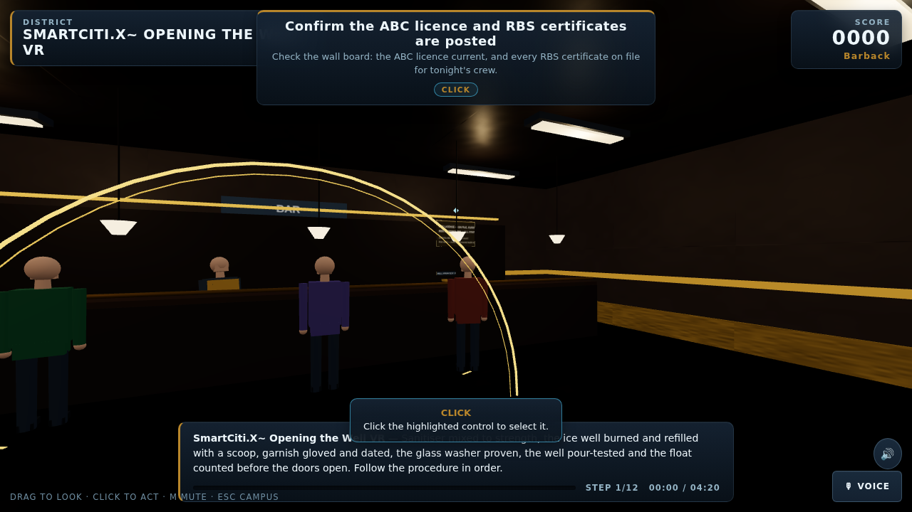 <b>Opening the Well</b> — Sanitiser mixed to strength, the ice well burned and refilled with a scoop, garnish gloved and dated, the glass washer proven, the well pour-tested and the float counted before the doors open</td><td width="50%">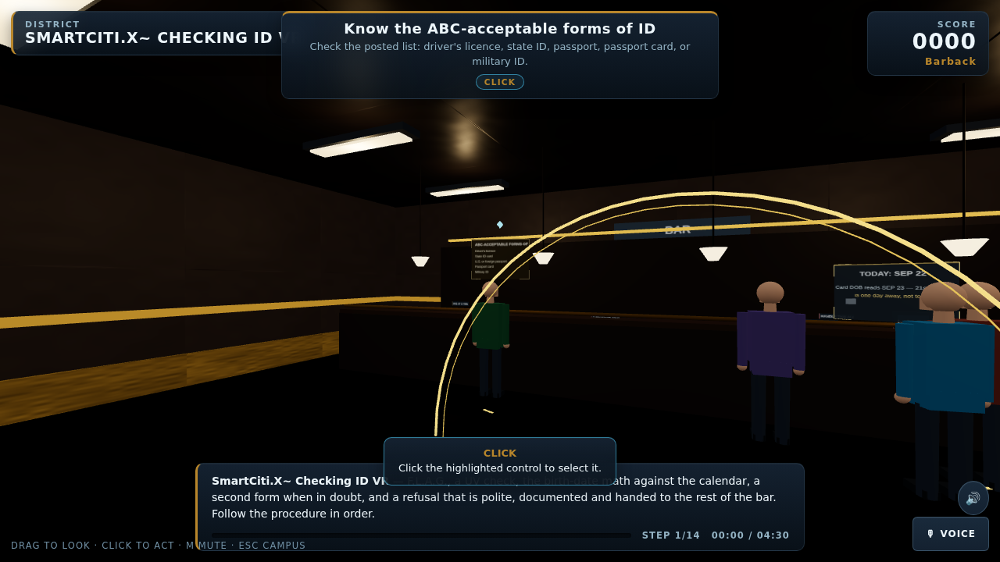 <b>Checking ID</b> — F.L.A.G., a UV check, the birth-date math against the calendar, a second form when in doubt, and a refusal that is polite, documented and handed to the rest of the bar</td></tr>
<tr><td width="50%">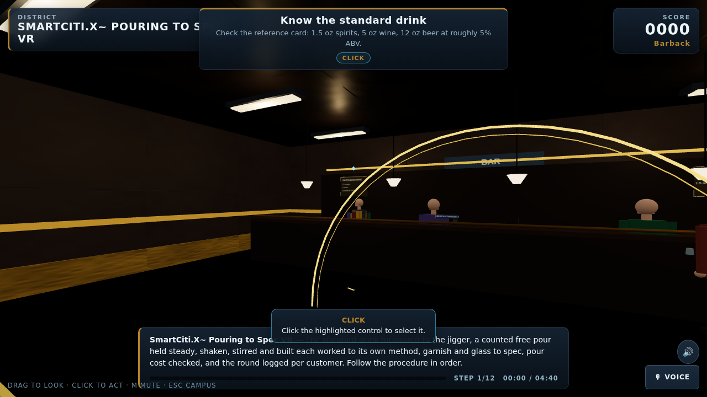 <b>Pouring to Spec</b> — The standard drink measured to the jigger, a counted free pour held steady, shaken, stirred and built each worked to its own method, garnish and glass to spec, pour cost checked, and the round logged per customer</td><td width="50%">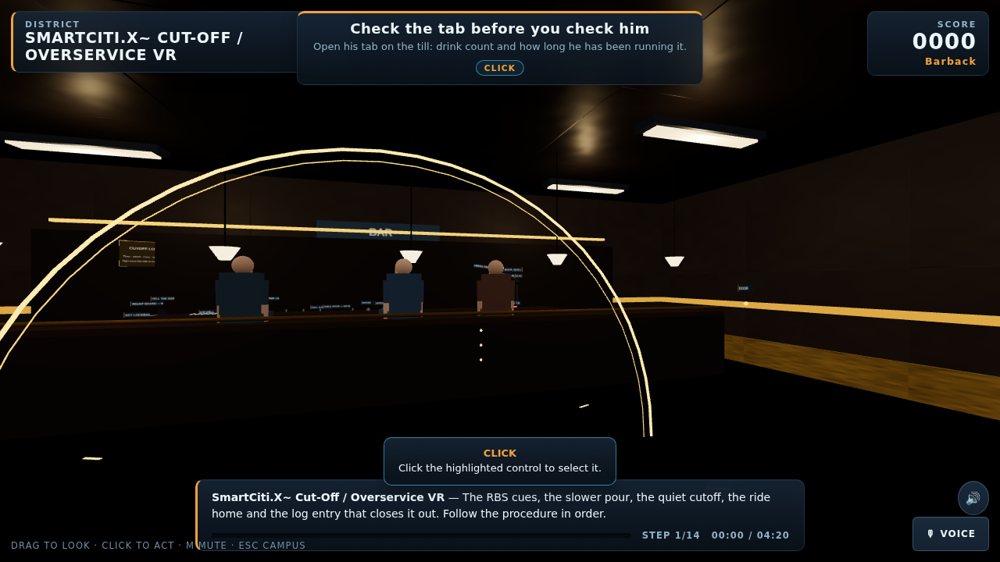 <b>Cut-Off / Overservice</b> — The RBS cues, the slower pour, the quiet cutoff, the ride home and the log entry that closes it out</td></tr>
<tr><td width="50%">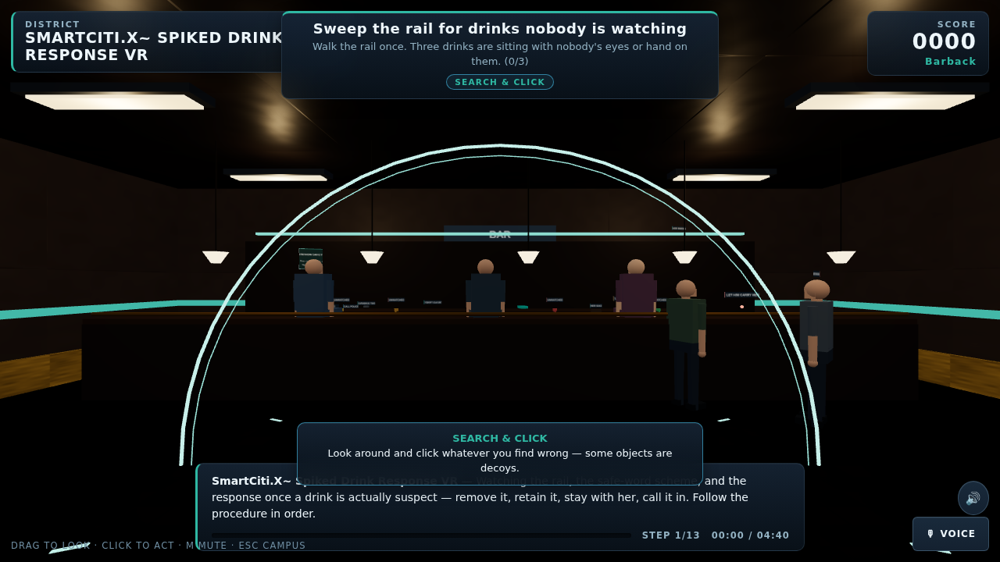 <b>Spiked Drink Response</b> — Watching the rail, the safe-word scheme, and the response once a drink is actually suspect — remove it, retain it, stay with her, call it in</td><td width="50%">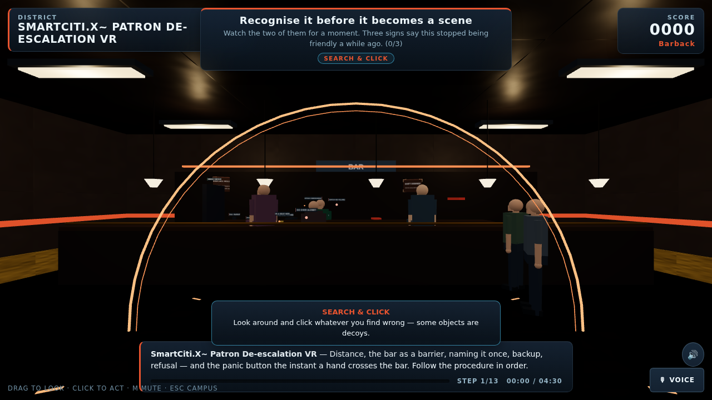 <b>Patron De-escalation</b> — Distance, the bar as a barrier, naming it once, backup, refusal — and the panic button the instant a hand crosses the bar</td></tr>
<tr><td width="50%">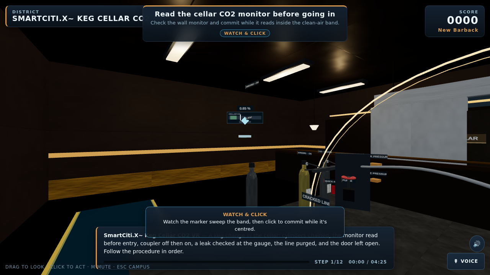 <b>Keg Cellar CO2</b> — A keg change in the cellar: cylinders chained, the monitor read before entry, coupler off then on, a leak checked at the gauge, the line purged, and the door left open</td><td width="50%">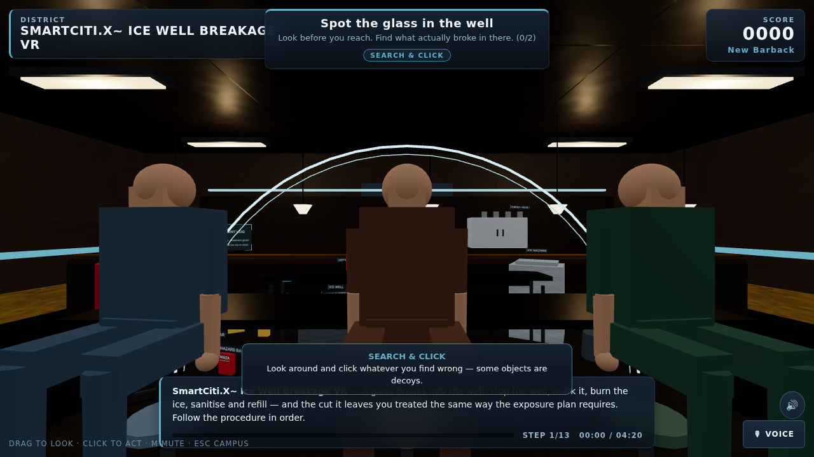 <b>Ice Well Breakage</b> — A glass breaks into the well: stop the well, mark it, burn the ice, sanitise and refill — and the cut it leaves you treated the same way the exposure plan requires</td></tr>
<tr><td width="50%">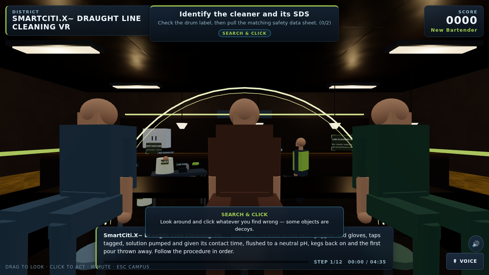 <b>Draught Line Cleaning</b> — Beer lines cleaned to the SDS: goggles and gloves, taps tagged, solution pumped and given its contact time, flushed to a neutral pH, kegs back on and the first pour thrown away</td><td width="50%">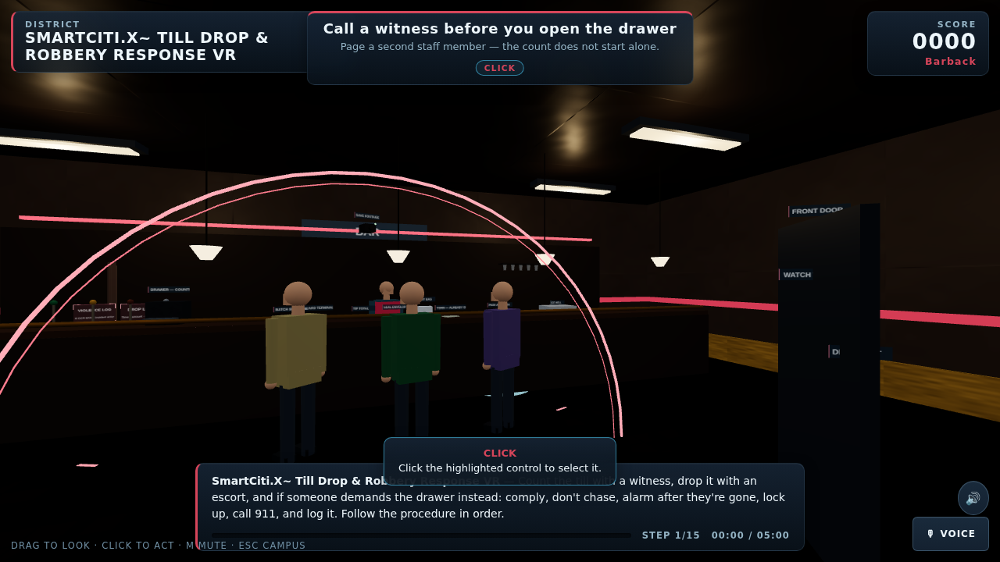 <b>Till Drop & Robbery Response</b> — Count the till with a witness, drop it with an escort, and if someone demands the drawer instead: comply, don't chase, alarm after they're gone, lock up, call 911, and log it</td></tr>
<tr><td width="50%">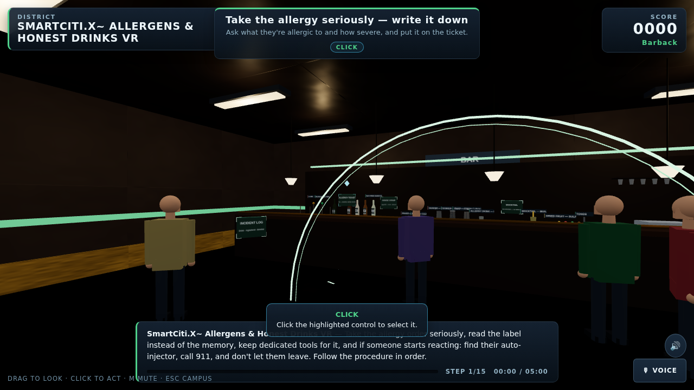 <b>Allergens & Honest Drinks</b> — Take the allergy order seriously, read the label instead of the memory, keep dedicated tools for it, and if someone starts reacting: find their auto-injector, call 911, and don't let them leave</td><td width="50%">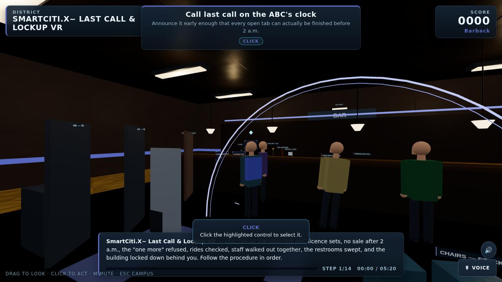 <b>Last Call & Lockup</b> — Last call on the clock the ABC licence sets, no sale after 2 a.m., the "one more" refused, rides checked, staff walked out together, the restrooms swept, and the building locked down behind you</td></tr>
<tr><td width="50%">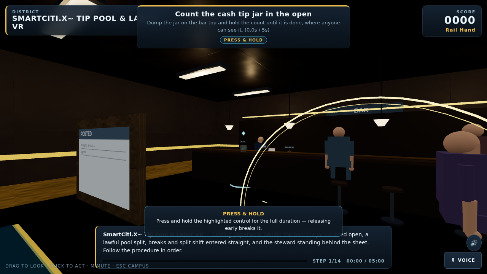 <b>Tip Pool & Labor</b> — Closing paperwork behind the bar: the jar counted open, a lawful pool split, breaks and split shift entered straight, and the steward standing behind the sheet</td><td width="50%">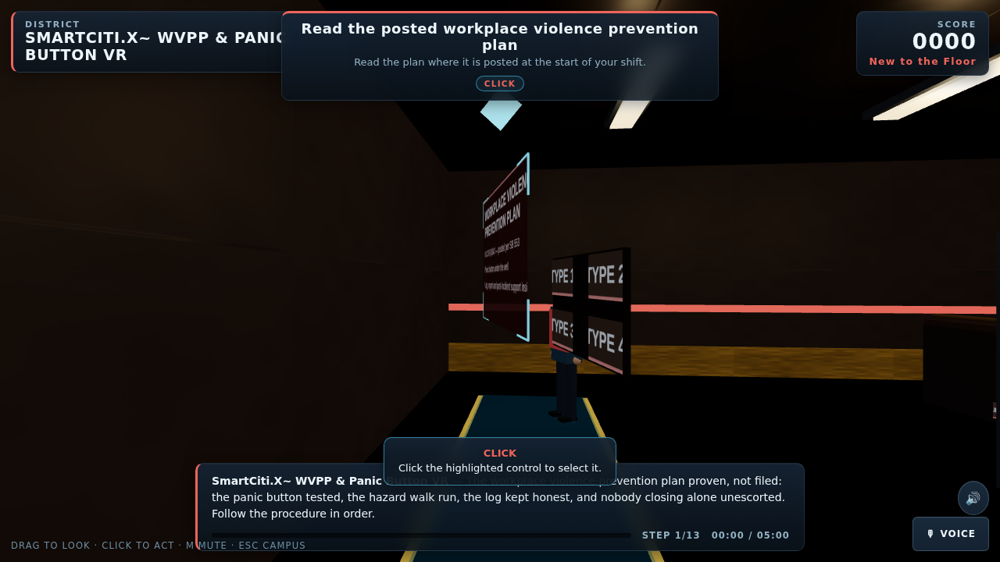 <b>WVPP & Panic Button</b> — The workplace violence prevention plan proven, not filed: the panic button tested, the hazard walk run, the log kept honest, and nobody closing alone unescorted</td></tr>
<tr><td width="50%">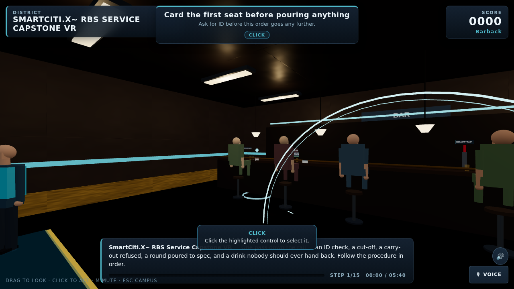 <b>RBS Service Capstone</b> — One pass down the rail — an ID check, a cut-off, a carry-out refused, a round poured to spec, and a drink nobody should ever hand back</td></tr>
</table>

## Inside Wireman — First Period

**Union:** IBEW — International Brotherhood of Electrical Workers

**Certifications and standards:** NFPA 70E work practices and OSHA 1910.147 control of hazardous energy, as taught in an IBEW/NECA JATC first-period block

The isolation habit, built four ways: a panel, a substation feeder, an overhead circuit and a live-load charger. Every station in this block ends with something proven dead before it is touched.

| # | Station | Trade | Conditions | Steps | Interrupts | Eval | Why it is in the programme |
|---|---|---|---|---|---|---|---|
| — | Trade Skills: electrical | — | — | — | — | 97 | The bench case: lockout, tagout and live-dead-live on a 480 V panel, with nothing else going on. |
| 01 | [Charge Point](../../WebXR/smartcity/index.html?sim=charge-point) | EV service technician | overcast | 11 | 2 | 98 | The same habit under a live utility service, where the load is a vehicle and the public is a metre away. |
| 33 | [Substation Switching](../../WebXR/smartcity/index.html?sim=substation-switching) | Substation electrician / switching operator | overcast | 11 | 2 | 97 | Isolation as a written switching order with a read-back, which is how it is done once the circuit leaves the building. |
| 19 | [Line Truck](../../WebXR/smartcity/index.html?sim=line-truck) | Outside / overhead lineworker (IBEW) | overcast | 16 | 2 | 94 | Overhead: the same sequence with cover-up, an approach boundary and a bucket. |
| 44 | [Battery Yard](../../WebXR/smartcity/index.html?sim=battery-yard) | Battery energy storage technician — grid scale | overcast | 12 | 2 | 98 | Direct current, where the arc does not self-extinguish and the bleed-down wait is the whole discipline. |
| 188 | [Motor Control Center](../../WebXR/smartcity/index.html?sim=motor-control-center) | Inside wireman — IBEW | indoor (plant) | 14 | 2 | — | Isolation inside the building again, but now the disconnect is not the whole story — the bucket still has to be racked off a bus that stays live for everyone else on the section. |
| 189 | [Arc-Flash Label Study](../../WebXR/smartcity/index.html?sim=arc-flash-label-study) | Inside wireman — IBEW | indoor (plant) | 13 | 2 | — | Where the label the first four stations all trusted actually comes from — the study, not a guess, behind every incident-energy number this block has been working to. |
| 190 | [Temporary Site Power](../../WebXR/smartcity/index.html?sim=temporary-site-power) | Inside wireman — IBEW | rain | 12 | 2 | — | The isolation habit turned around: building a service worth trusting in the first place, grounded and GFCI-protected before anyone plugs a tool into it. |

<table>
<tr><td width="50%">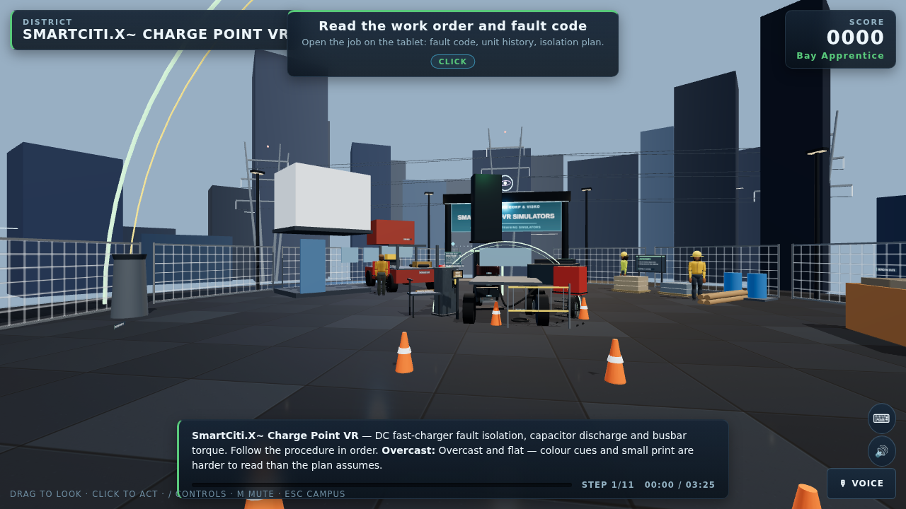 <b>Charge Point</b> — DC fast-charger fault isolation, capacitor discharge and busbar torque</td><td width="50%">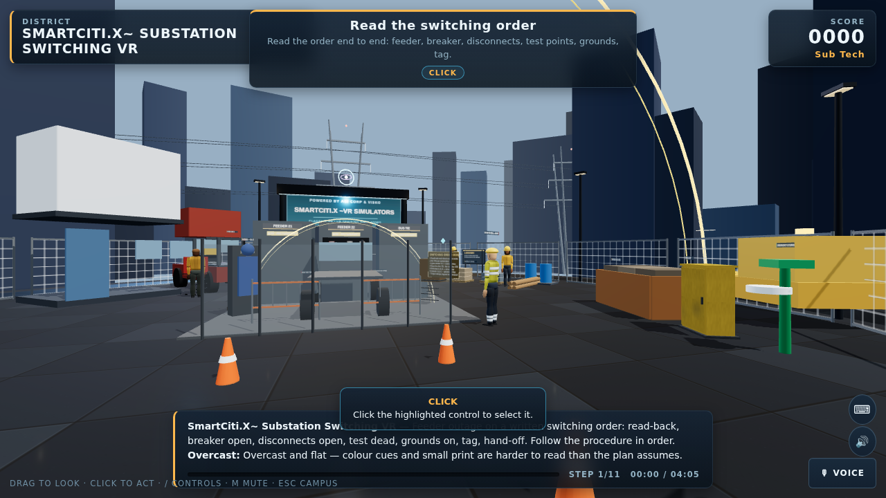 <b>Substation Switching</b> — Feeder outage on a written switching order: read-back, breaker open, disconnects open, test dead, grounds on, tag, hand-off</td></tr>
<tr><td width="50%">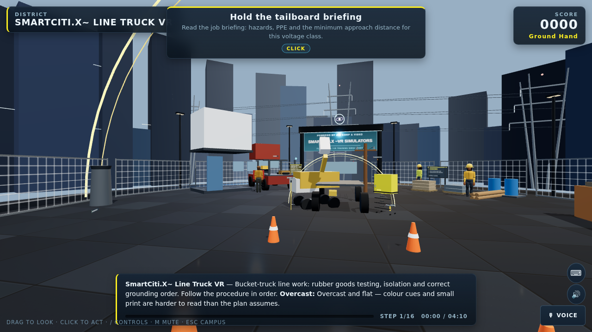 <b>Line Truck</b> — Bucket-truck line work: rubber goods testing, isolation and correct grounding order</td><td width="50%">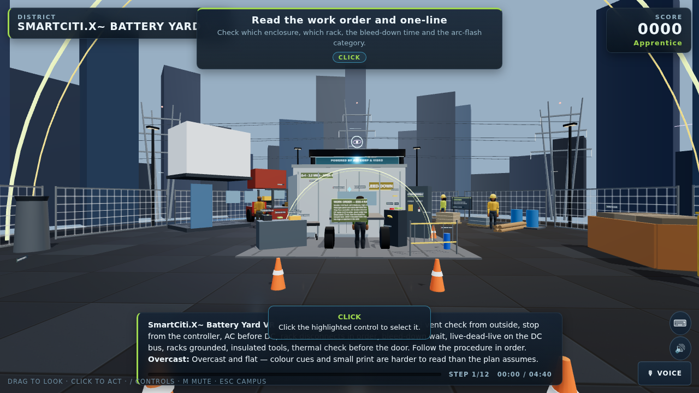 <b>Battery Yard</b> — Grid battery module swap: gas and vent check from outside, stop from the controller, AC before DC, rack disconnects in order, bleed-down wait, live-dead-live on the DC bus, racks grounded, insulated tools, thermal check before the door</td></tr>
<tr><td width="50%">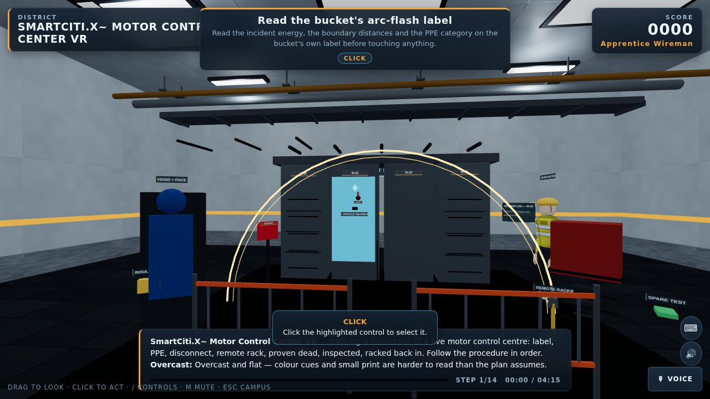 <b>Motor Control Center</b> — Racking a bucket out of a live motor control centre: label, PPE, disconnect, remote rack, proven dead, inspected, racked back in</td><td width="50%">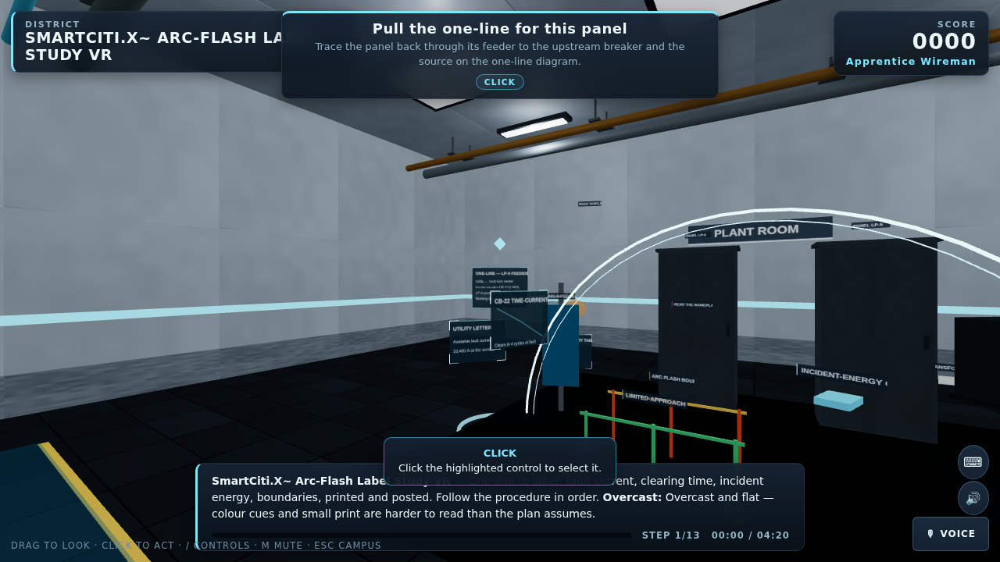 <b>Arc-Flash Label Study</b> — One-line to label: fault current, clearing time, incident energy, boundaries, printed and posted</td></tr>
<tr><td width="50%"> <b>Temporary Site Power</b> — Standing up construction power: panel grounded, GFCI on every receptacle, the AEGCP schedule, cords clear of traffic and water</td></tr>
</table>

## Confined Space — Entry and Rescue

**Union:** LIUNA, UA, IUOE and IAFF technical rescue

**Certifications and standards:** OSHA 29 CFR 1910.146 permit-required confined spaces, with NFPA 1006 rescue technician for the last station

Four spaces and the rescue. The first three build the permit, the atmosphere and the attendant; the last one is what happens when all of that failed for somebody else.

| # | Station | Trade | Conditions | Steps | Interrupts | Eval | Why it is in the programme |
|---|---|---|---|---|---|---|---|
| 03 | [Valve Vault](../../WebXR/smartcity/index.html?sim=valve-vault) | Water utility operator | rain | 12 | 2 | 93 | The permit itself: testing in order, a guarded opening and an attendant who never leaves. |
| 28 | [Lift Station](../../WebXR/smartcity/index.html?sim=lift-station) | Wastewater collection system operator | indoor (plant) | 10 | 2 | 97 | A wet well, where the atmosphere changes while you are in it and the pumps are the second hazard. |
| 38 | [Chlorine Room](../../WebXR/smartcity/index.html?sim=chlorine-room) | Water treatment plant operator | indoor (plant) | 12 | 2 | 97 | A space you do not enter blind: the monitor and the air pack are read and staged from outside the door. |
| 45 | [Confined Rescue](../../WebXR/smartcity/index.html?sim=confined-rescue) | Technical rescue technician — confined space | overcast | 11 | 2 | 97 | The rescue, including the part where the first job is stopping a coworker from becoming the second patient. |

<table>
<tr><td width="50%">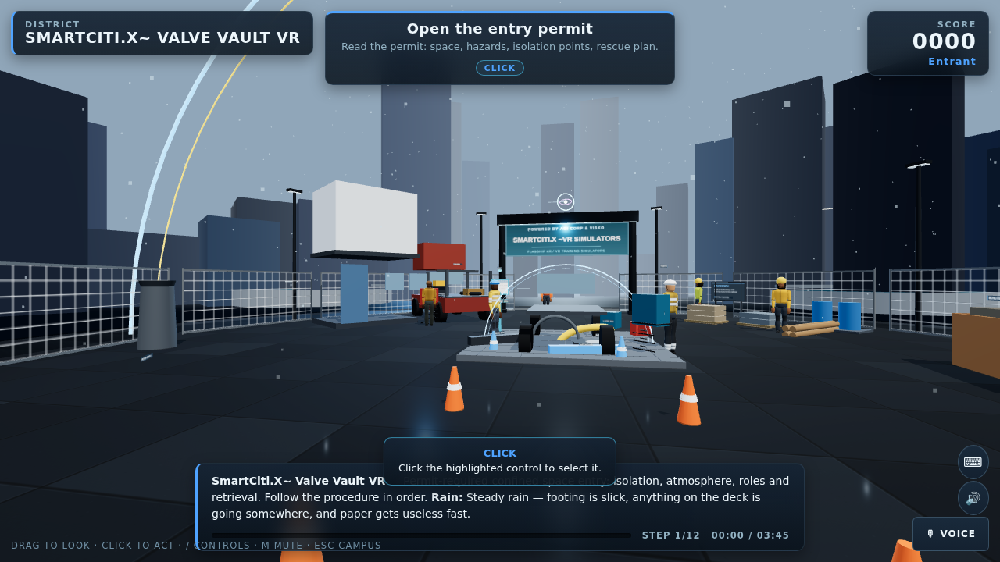 <b>Valve Vault</b> — Permit-required confined space entry: isolation, atmosphere, roles and retrieval</td><td width="50%">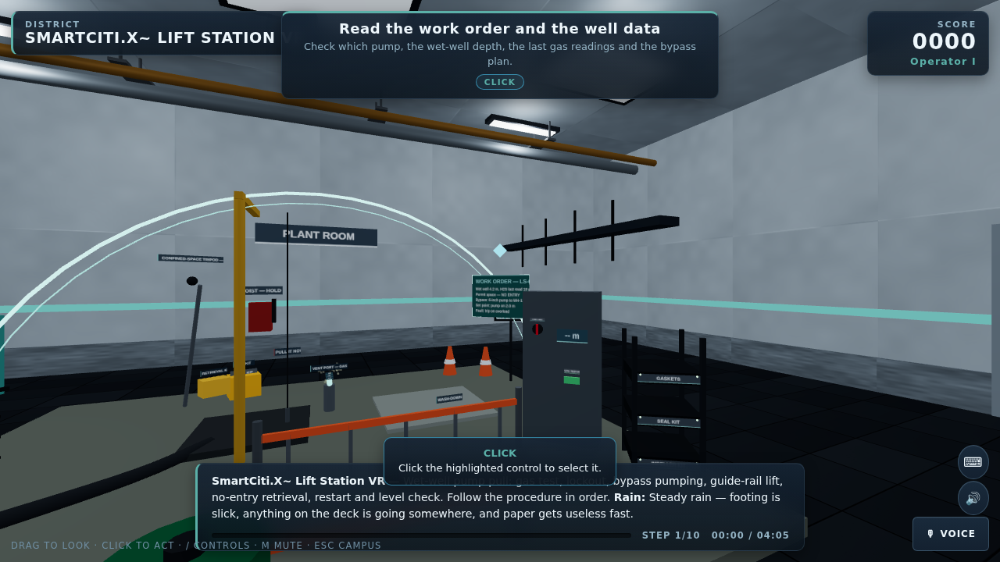 <b>Lift Station</b> — Wet-well pump pull: gas test, lockout, bypass pumping, guide-rail lift, no-entry retrieval, restart and level check</td></tr>
<tr><td width="50%">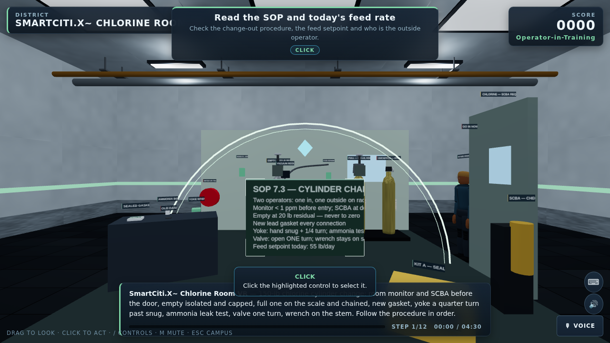 <b>Chlorine Room</b> — 150-lb chlorine cylinder change: room monitor and SCBA before the door, empty isolated and capped, full one on the scale and chained, new gasket, yoke a quarter turn past snug, ammonia leak test, valve one turn, wrench on the stem</td><td width="50%">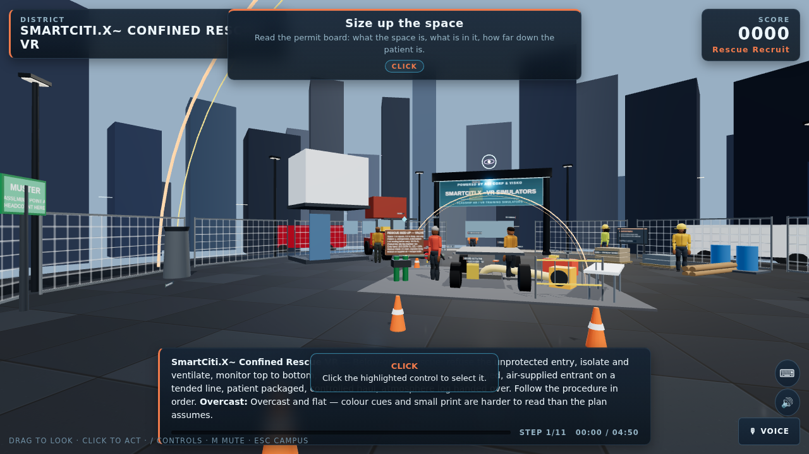 <b>Confined Rescue</b> — Below-grade rescue: refuse the unprotected entry, isolate and ventilate, monitor top to bottom, tripod and mechanical advantage rigged, air-supplied entrant on a tended line, patient packaged, controlled haul, atmosphere log handed over</td></tr>
</table>

## Working at Height — Fall Protection

**Union:** Ironworkers, Carpenters, CWA and NATE climbers

**Certifications and standards:** OSHA 29 CFR 1926 Subpart M fall protection, Subpart L scaffolds, and ANSI Z359 personal fall-arrest systems

Anchor, connect, and the thing you are standing on. Four heights, four different reasons the system has to be right before the first step off the deck.

| # | Station | Trade | Conditions | Steps | Interrupts | Eval | Why it is in the programme |
|---|---|---|---|---|---|---|---|
| 36 | [Scaffold Erection](../../WebXR/smartcity/index.html?sim=scaffold-erection) | Scaffold erector / carpenter | wind | 12 | 2 | 96 | Building the platform: the order in which a scaffold becomes safe to stand on, and the green tag that says so. |
| 12 | [Steel Erector](../../WebXR/smartcity/index.html?sim=steel-erector) | Ironworker / structural steel connector | wind | 12 | 2 | 94 | Connecting steel, where the anchor moves with the work and the decking is not yet there. |
| 11 | [Tower Climb](../../WebXR/smartcity/index.html?sim=tower-climb) | Telecom / broadcast tower technician | wind | 12 | 2 | 98 | A climb with a hundred metres under it: the transitions are where people fall. |
| 42 | [Microwave Backhaul](../../WebXR/smartcity/index.html?sim=microwave-backhaul) | Microwave / RF technician — backhaul | overcast | 11 | 2 | 96 | A rooftop parapet, where the hazard is the edge and everything dropped lands on a public footpath. |
| 37 | [Aerial Ladder](../../WebXR/smartcity/index.html?sim=aerial-ladder) | Firefighter — aerial apparatus driver/operator | wind | 12 | 2 | 93 | An aerial device, where the platform is the thing that has to be set level before anyone is on it. |

<table>
<tr><td width="50%">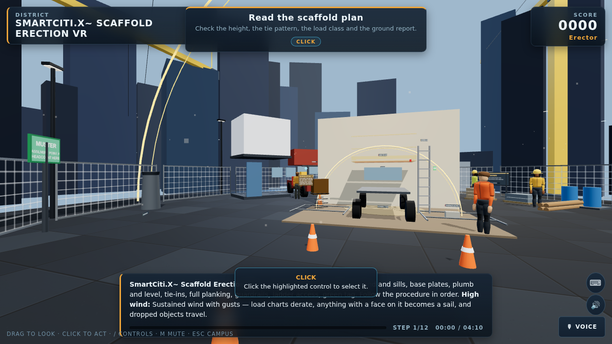 <b>Scaffold Erection</b> — Frame scaffold, two lifts: ground and sills, base plates, plumb and level, tie-ins, full planking, guardrails, ladder access, green tag</td><td width="50%">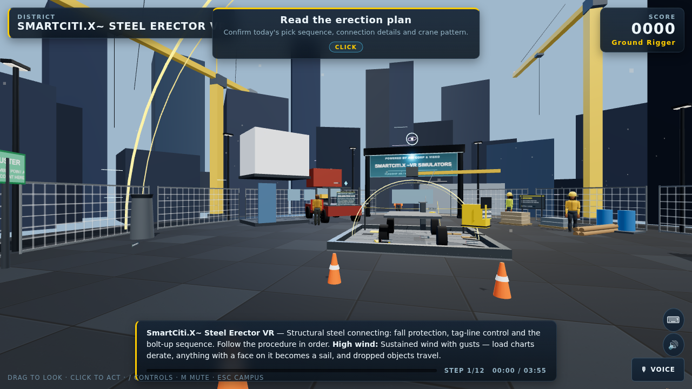 <b>Steel Erector</b> — Structural steel connecting: fall protection, tag-line control and the bolt-up sequence</td></tr>
<tr><td width="50%">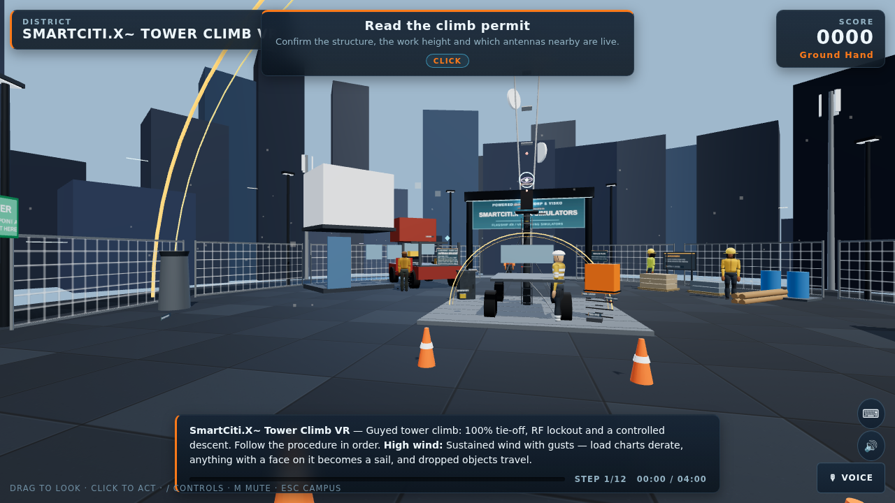 <b>Tower Climb</b> — Guyed tower climb: 100% tie-off, RF lockout and a controlled descent</td><td width="50%">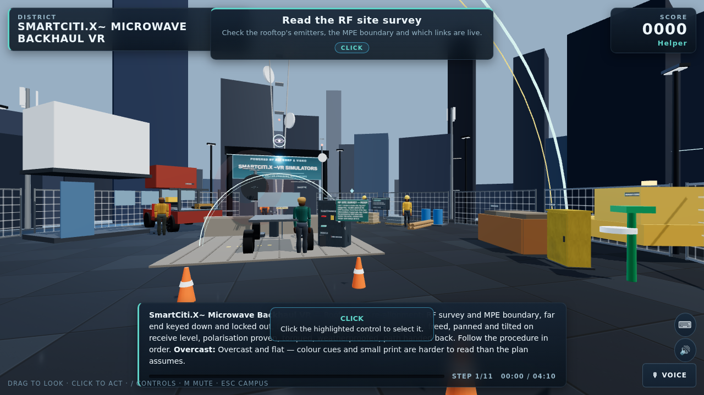 <b>Microwave Backhaul</b> — Rooftop link re-alignment: RF survey and MPE boundary, far end keyed down and locked out, fall protection before the parapet, dish freed, panned and tilted on receive level, polarisation proven, torqued, weatherproofed, path handed back</td></tr>
<tr><td width="50%">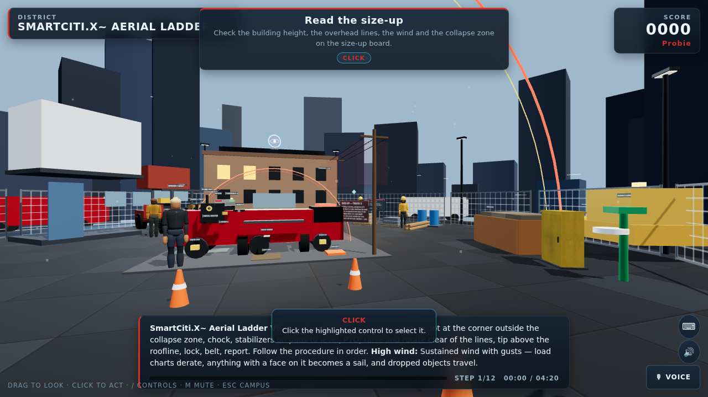 <b>Aerial Ladder</b> — Aerial apparatus set-up: size-up, spot at the corner outside the collapse zone, chock, stabilizers on pads to level, PTO, raise and rotate clear of the lines, tip above the roofline, lock, belt, report</td></tr>
</table>

## Hazmat and Environmental Response

**Union:** LIUNA hazmat and environmental crews, IAFF, and environmental technicians

**Certifications and standards:** OSHA 29 CFR 1910.120 HAZWOPER, NFPA 470 hazardous materials response, and Clean Water Act / Clean Air Act monitoring practice

Containment, decontamination and the numbers a neighbourhood relies on. This block runs from the release to the sample bottle, and opens with the real history of one site.

| # | Station | Trade | Conditions | Steps | Interrupts | Eval | Why it is in the programme |
|---|---|---|---|---|---|---|---|
| 21 | [Hunters Point Briefing](../../WebXR/smartcity/index.html?sim=hunters-point) | Environmental monitoring technician | clear | 10 | 0 | 75 | A sourced briefing on a real Superfund shipyard cleanup and the community monitoring around it, before any simulated work. |
| 17 | [Abatement Chamber](../../WebXR/smartcity/index.html?sim=abatement-chamber) | Asbestos / lead abatement worker | indoor (plant) | 12 | 0 | 92 | Containment done properly: negative pressure, a clean room, and a decon order that keeps the fibre inside. |
| 25 | [Decon Line](../../WebXR/smartcity/index.html?sim=decon-line) | Hazmat firefighter / decon technician | wind | 11 | 2 | 95 | The corridor: zones set by the wind, pools in order, and runoff that stays in the berm. |
| 22 | [Perimeter Air](../../WebXR/smartcity/index.html?sim=air-monitor) | Environmental monitoring technician | wind | 10 | 2 | 95 | Fence-line monitoring: placement, calibration and an exceedance response that happens now. |
| 43 | [Stormwater Outfall](../../WebXR/smartcity/index.html?sim=stormwater-outfall) | Environmental sampling technician — stormwater | rain | 11 | 2 | 98 | The wet-weather grab, on the permit clock, with a chain of custody that makes it evidence. |
| — | Trade Skills: pressure-washer | — | — | — | — | 92 | Surface prep, where the runoff is the pollutant and the stormwater plan is the reason for the containment. |

<table>
<tr><td width="50%">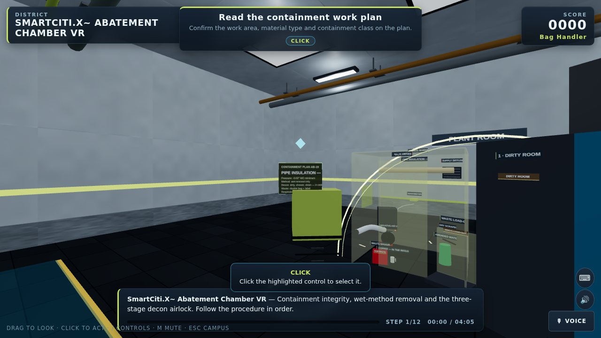 <b>Abatement Chamber</b> — Containment integrity, wet-method removal and the three-stage decon airlock</td><td width="50%"> <b>Decon Line</b> — Hazmat decontamination corridor: zones by the wind, pools in order, gross wash, doffing order, runoff contained</td></tr>
<tr><td width="50%"> <b>Perimeter Air</b> — Real-time PM10 fence-line monitoring: wind, placement, flow calibration, zero check, and the exceedance response</td><td width="50%"> <b>Stormwater Outfall</b> — Wet-weather NPDES grab: permit window, meters calibrated before the rain, bank staged with a buddy and tripod, grab from the flow, bottles in preservation order, field readings logged, custody sealed, sample on ice</td></tr>
</table>

## Rigging and Lifting

**Union:** Ironworkers, IUOE crane operators, ILWU and IATSE riggers

**Certifications and standards:** ASME B30 rigging and crane practice, NCCCO operator knowledge, and ETCP entertainment rigging for the theatre station

Load, radius, chart, and what is under the load. Five lifts in five industries that all fail the same way.

| # | Station | Trade | Conditions | Steps | Interrupts | Eval | Why it is in the programme |
|---|---|---|---|---|---|---|---|
| 13 | [Crane Yard](../../WebXR/smartcity/index.html?sim=crane-yard) | Mobile crane operator / rigger | wind | 15 | 2 | 93 | The load chart and the pick plan, plus programming the anti-collision zone the yard actually needs. |
| 20 | [Dock Crane](../../WebXR/smartcity/index.html?sim=dock-crane) | Longshoreman / container-crane operator | wind | 14 | 2 | 97 | Container work at height and speed, where the wind limit is a hard stop. |
| 30 | [Chain Hoist](../../WebXR/smartcity/index.html?sim=chain-hoist) | Entertainment rigger — chain motors | indoor (theatre) | 10 | 2 | 94 | Manual lifting hardware: inspection, capacity and the load path through a structure that was not designed for it. |
| 18 | [Rigging Loft](../../WebXR/smartcity/index.html?sim=rigging-loft) | Theatrical rigger (IATSE) | indoor (theatre) | 14 | 2 | 96 | Overhead rigging above people, with automation cues that have to be proven before the house opens. |
| 40 | [Fly System](../../WebXR/smartcity/index.html?sim=fly-system) | Theatrical rigger / fly operator | indoor (theatre) | 12 | 2 | 95 | Counterweight: the one rigging system where the operator is holding the other half of the load in their hands. |

<table>
<tr><td width="50%">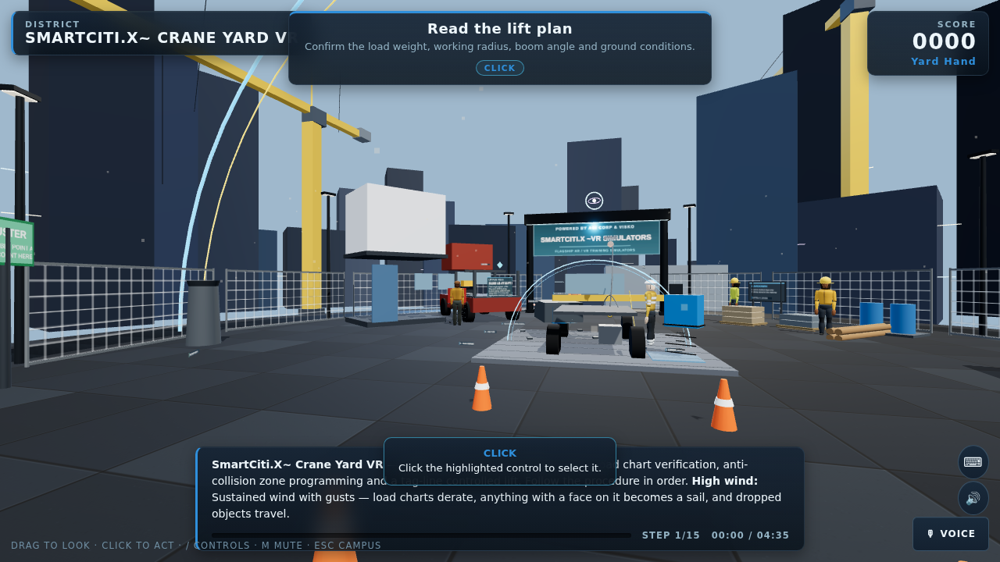 <b>Crane Yard</b> — Mobile crane pick: outrigger setup, load chart verification, anti-collision zone programming and a tag-line controlled lift</td><td width="50%"> <b>Dock Crane</b> — Container lift: lashing release order, twist-lock verification and wind-limit discipline</td></tr>
<tr><td width="50%">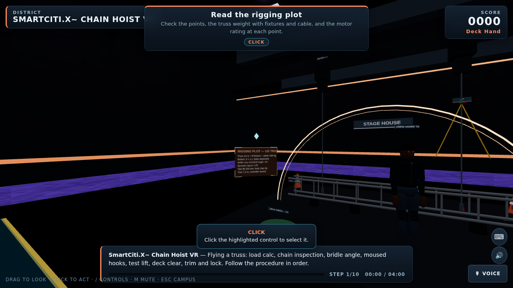 <b>Chain Hoist</b> — Flying a truss: load calc, chain inspection, bridle angle, moused hooks, test lift, deck clear, trim and lock</td><td width="50%">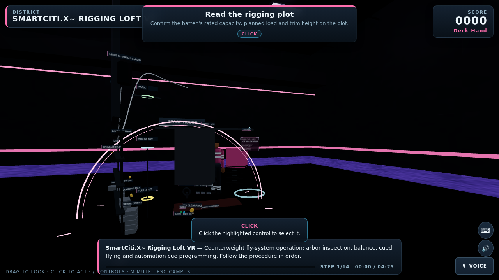 <b>Rigging Loft</b> — Counterweight fly-system operation: arbor inspection, balance, cued flying and automation cue programming</td></tr>
<tr><td width="50%">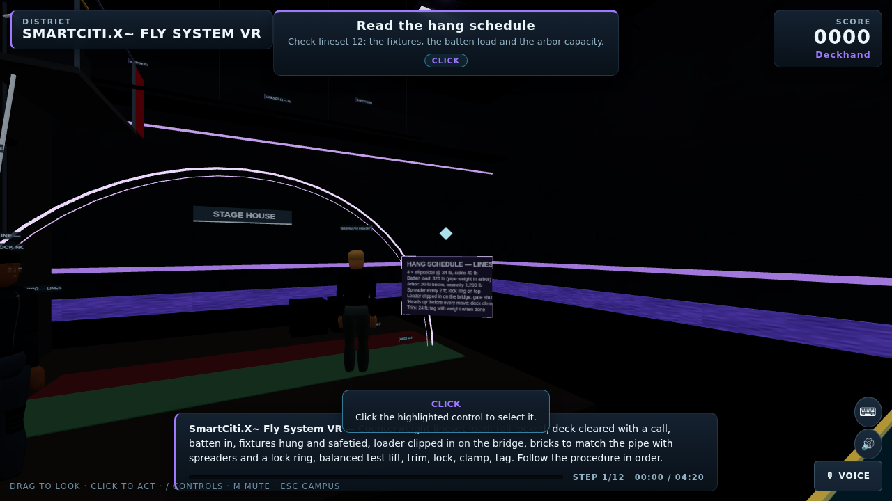 <b>Fly System</b> — Counterweight lineset load: rail locked, deck cleared with a call, batten in, fixtures hung and safetied, loader clipped in on the bridge, bricks to match the pipe with spreaders and a lock ring, balanced test lift, trim, lock, clamp, tag</td></tr>
</table>

## Stationary Engineer — Building Plant

**Union:** IUOE — International Union of Operating Engineers, stationary locals

**Certifications and standards:** State stationary engineer licence, ASME boiler practice, ASHRAE 188 water management and NFPA 25 fire-pump testing

The four plants a building engineer is responsible for at two in the morning, and the tests that prove each one will work when it is needed.

| # | Station | Trade | Conditions | Steps | Interrupts | Eval | Why it is in the programme |
|---|---|---|---|---|---|---|---|
| 15 | [Boiler Room](../../WebXR/smartcity/index.html?sim=boiler-room) | Stationary engineer / steamfitter | indoor (plant) | 12 | 2 | 94 | Start-up and purge: the sequence that stops a furnace explosion. |
| 10 | [Chiller Plant](../../WebXR/smartcity/index.html?sim=chiller-plant) | HVAC / refrigeration technician | indoor (plant) | 13 | 2 | 95 | Refrigerant, isolation and the machine that is the building's whole cooling capacity. |
| 47 | [Cooling Tower](../../WebXR/smartcity/index.html?sim=cooling-tower) | Stationary engineer — water treatment and cooling towers | wind | 11 | 2 | 99 | The Legionella task: the tower is the one plant that can make the neighbourhood sick. |
| 35 | [Fire Pump](../../WebXR/smartcity/index.html?sim=fire-pump) | Fire sprinkler fitter / fire pump technician | indoor (plant) | 12 | 2 | 97 | The annual flow test, where the curve either matches the nameplate or the building has no fire protection. |
| 16 | [Elevator Pit](../../WebXR/smartcity/index.html?sim=elevator-pit) | Elevator constructor / mechanic | indoor (service) | 13 | 2 | 96 | The pit: a confined space with a moving car above it, entered by the person who maintains it. |

<table>
<tr><td width="50%">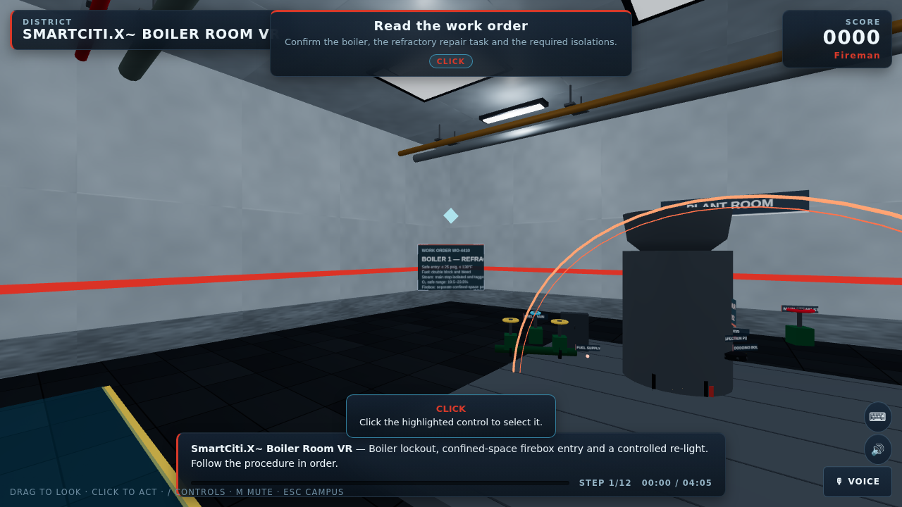 <b>Boiler Room</b> — Boiler lockout, confined-space firebox entry and a controlled re-light</td><td width="50%">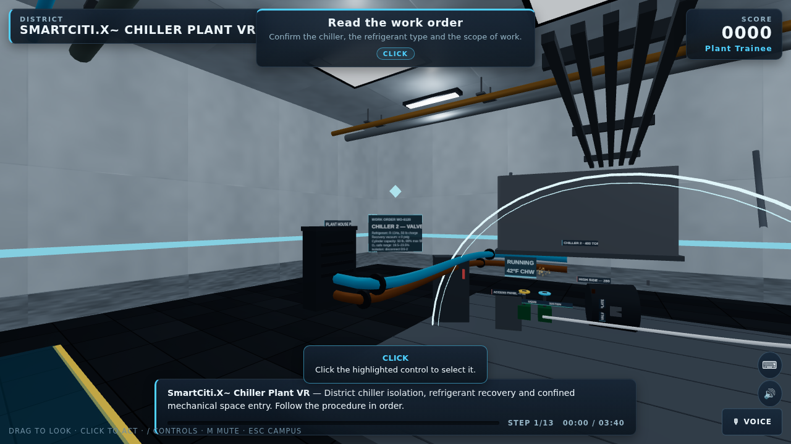 <b>Chiller Plant</b> — District chiller isolation, refrigerant recovery and confined mechanical space entry</td></tr>
<tr><td width="50%">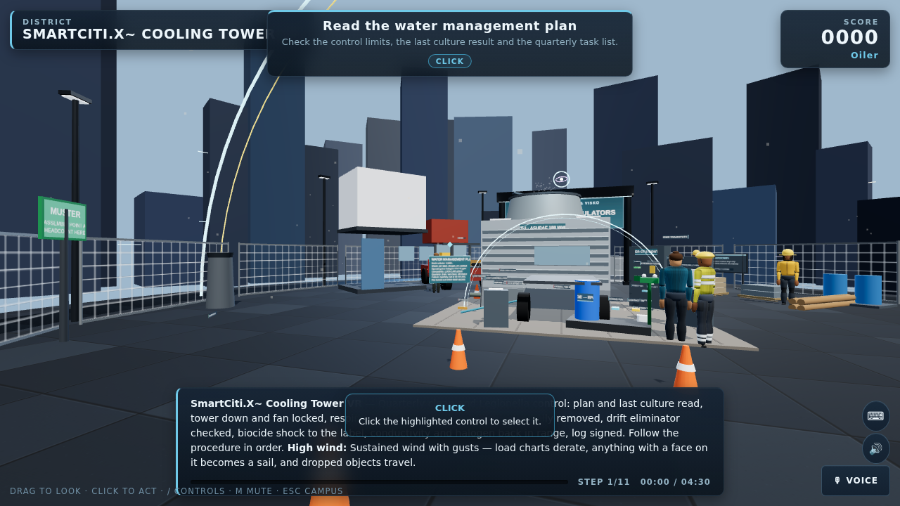 <b>Cooling Tower</b> — Quarterly clean and Legionella control: plan and last culture read, tower down and fan locked, respirator before the basin, biofilm physically removed, drift eliminator checked, biocide shock to the label, conductivity and halogen back in range, log signed</td><td width="50%">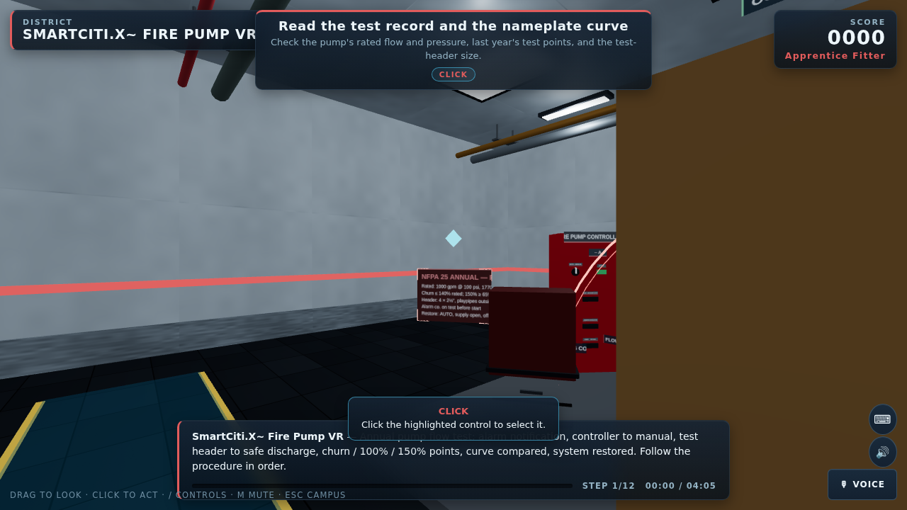 <b>Fire Pump</b> — Annual pump flow test: alarm notification, controller to manual, test header to safe discharge, churn / 100% / 150% points, curve compared, system restored</td></tr>
<tr><td width="50%">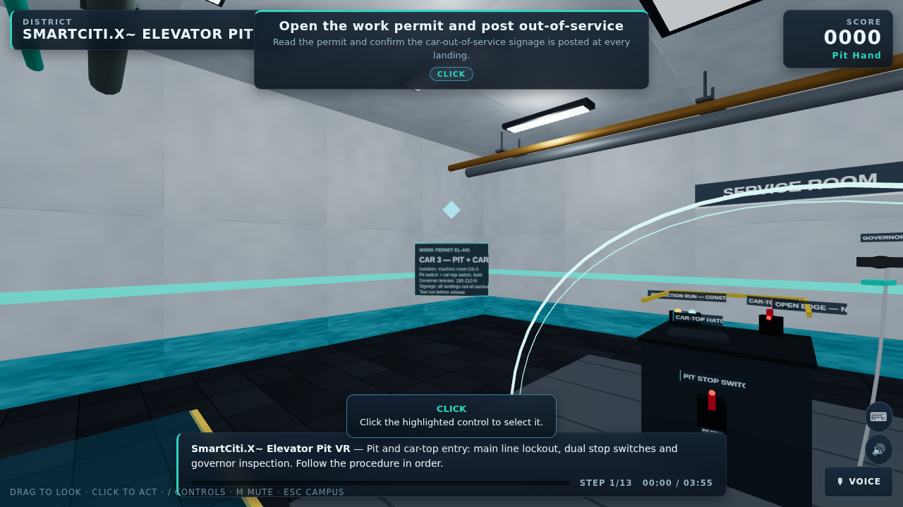 <b>Elevator Pit</b> — Pit and car-top entry: main line lockout, dual stop switches and governor inspection</td></tr>
</table>

## Port and Terminal Operations

**Union:** ILWU longshore, MEBA and SIU marine engineers, IBT terminal drivers

**Certifications and standards:** USCG 33 CFR 155/156 oil transfer, IMO Cargo Securing Manual practice, and OSHA 1917 marine terminals

A ship comes alongside, is secured, is fuelled, is worked and leaves. Four stations that follow that order, each with a different way to put oil or steel where it should not be.

| # | Station | Trade | Conditions | Steps | Interrupts | Eval | Why it is in the programme |
|---|---|---|---|---|---|---|---|
| 29 | [Mooring Line](../../WebXR/smartcity/index.html?sim=mooring-line) | Line handler / wharf mooring crew | wind | 10 | 2 | 95 | Taking the lines: snap-back zones and the bight nobody stands in. |
| 41 | [Bunkering Watch](../../WebXR/smartcity/index.html?sim=bunkering-watch) | Marine engineer — person in charge of oil transfer | overcast | 12 | 2 | 90 | Fuel transfer as person in charge, with the deck contained before the hose comes aboard. |
| 27 | [Container Lashing](../../WebXR/smartcity/index.html?sim=container-lashing) | Longshore worker — lasher | wind | 11 | 2 | 93 | Deck stow: every twist-lock proven and the rods to the pattern the manual calls for. |
| 20 | [Dock Crane](../../WebXR/smartcity/index.html?sim=dock-crane) | Longshoreman / container-crane operator | wind | 14 | 2 | 97 | The crane over all of it, with the lashing gang's positions as the constraint. |

<table>
<tr><td width="50%"> <b>Mooring Line</b> — Taking a ship's lines: snap-back zone, heaving line, eye on the bollard, tension by radio, stopper, and the bight you never stand in</td><td width="50%"> <b>Bunkering Watch</b> — Fuel-oil transfer: plan and signed DOI, scuppers plugged and drip tray and SOPEP kit set, flange bolted all round, radio and emergency stop tested, line-up tank-first, slow start, soundings, topping off at reduced rate, manifold closed, sample sealed, BDN signed</td></tr>
<tr><td width="50%"> <b>Container Lashing</b> — Deck stow securing: crane held off, twist-locks proven, rods and turnbuckles to the pattern, fall protection on the bridge, torque checked</td><td width="50%"> <b>Dock Crane</b> — Container lift: lashing release order, twist-lock verification and wind-limit discipline</td></tr>
</table>

## Transit and Ramp Operations

**Union:** ATU, TWU, IAM and IBEW signal locals

**Certifications and standards:** FRA roadway-worker protection, FTA rail transit safety practice, FAA 14 CFR 139 airfield operations and OSHA 1910.178 for powered equipment

Four places where a vehicle that weighs tonnes moves near people on foot, and the protection that has to exist before anyone steps out.

| # | Station | Trade | Conditions | Steps | Interrupts | Eval | Why it is in the programme |
|---|---|---|---|---|---|---|---|
| 07 | [Track Access](../../WebXR/smartcity/index.html?sim=track-access) | Rail track worker | fog | 12 | 2 | 96 | Roadway-worker protection: the authority, the watchman and the clear time before the rail is occupied. |
| 02 | [Signal Cabinet](../../WebXR/smartcity/index.html?sim=signal-cabinet) | Traffic signal technician | rain | 11 | 2 | 91 | Working inside the system that keeps trains apart, without taking the protection down with you. |
| 34 | [Bus Depot Lift](../../WebXR/smartcity/index.html?sim=bus-depot-lift) | Transit bus technician — electric fleet | indoor (garage) | 10 | 2 | 96 | A vehicle raised over a person, and the supports that go in before anyone is underneath. |
| 46 | [Airport Ramp](../../WebXR/smartcity/index.html?sim=airport-ramp) | Airline ramp agent / ground handler | overcast | 11 | 2 | 99 | An aircraft turn, where chocks before contact is the rule the whole ramp runs on. |
| 39 | [Forklift Dock](../../WebXR/smartcity/index.html?sim=forklift-dock) | Powered industrial truck operator — warehouse and dock | indoor (garage) | 12 | 2 | 91 | The dock: a trailer that creeps and a load that tips, on the most common powered truck in the country. |

<table>
<tr><td width="50%">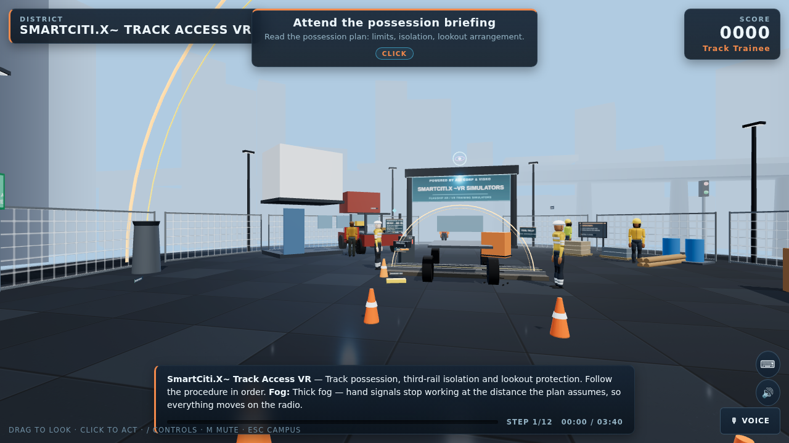 <b>Track Access</b> — Track possession, third-rail isolation and lookout protection</td><td width="50%">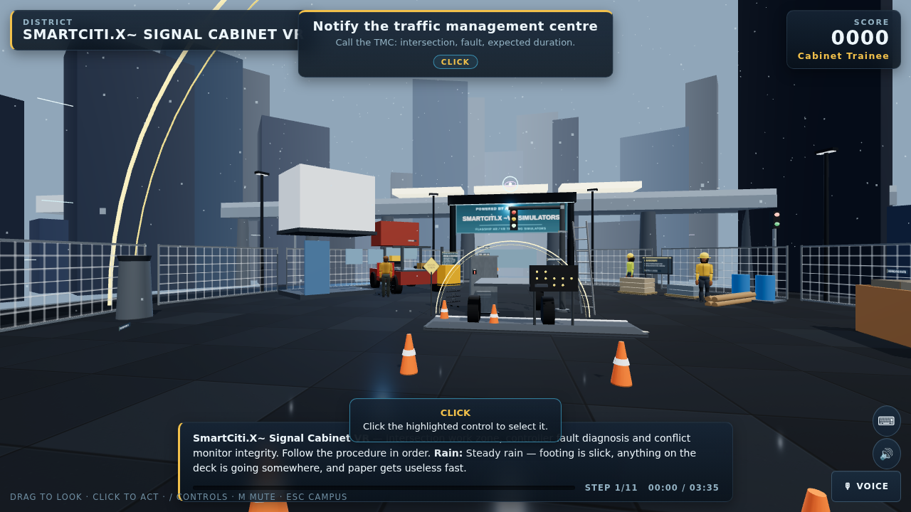 <b>Signal Cabinet</b> — Intersection work zone, controller fault diagnosis and conflict monitor integrity</td></tr>
<tr><td width="50%">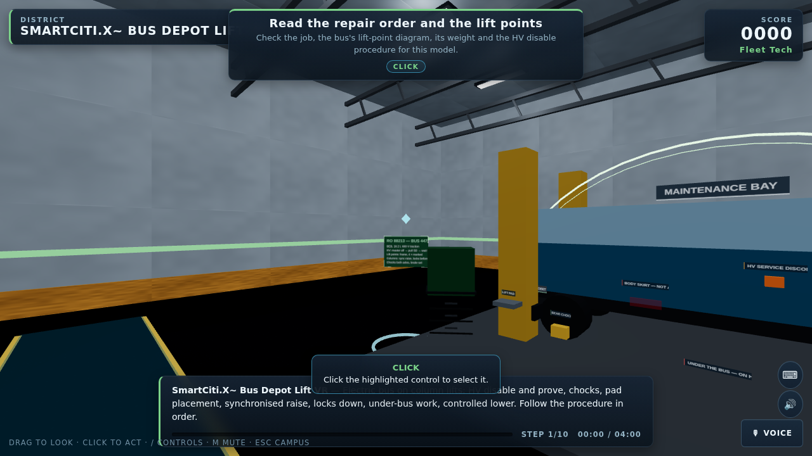 <b>Bus Depot Lift</b> — Electric bus on column lifts: HV disable and prove, chocks, pad placement, synchronised raise, locks down, under-bus work, controlled lower</td><td width="50%">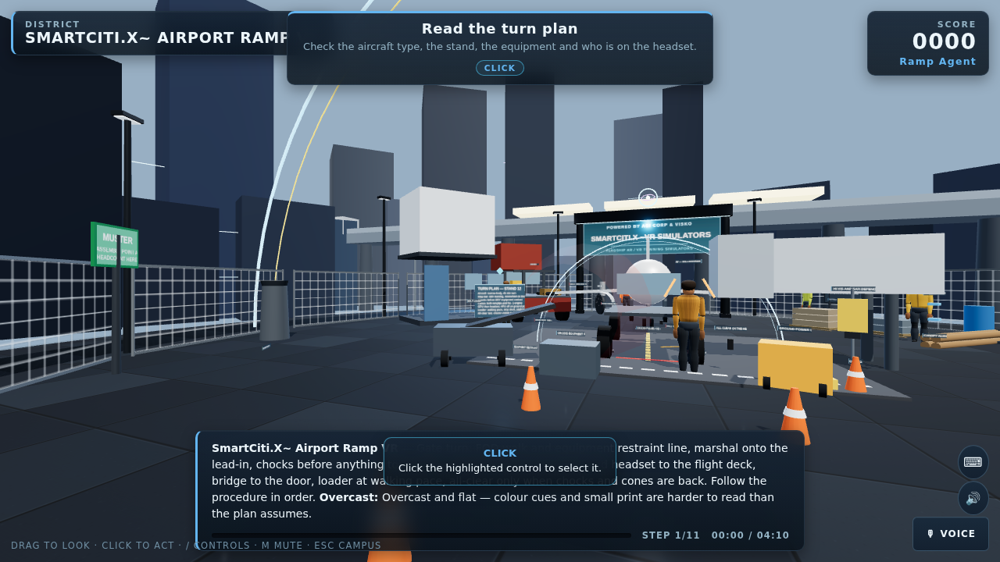 <b>Airport Ramp</b> — Gate turn: FOD walk and equipment restraint line, marshal onto the lead-in, chocks before anything touches it, cones set, ground power and headset to the flight deck, bridge to the door, loader at walking pace, all-clear only when chocks and cones are back</td></tr>
<tr><td width="50%">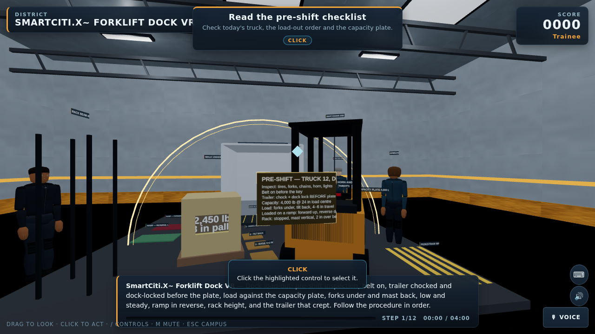 <b>Forklift Dock</b> — Dock load-out: pre-shift inspection, belt on, trailer chocked and dock-locked before the plate, load against the capacity plate, forks under and mast back, low and steady, ramp in reverse, rack height, and the trailer that crept</td></tr>
</table>

## Energy Transition Systems

**Union:** IBEW outside construction and utility locals

**Certifications and standards:** NFPA 70E, NFPA 855 energy storage, NEC Article 690 photovoltaic systems and utility interconnection practice

The plant a utility is building now: solar, storage, charging and the substation that ties them together. Direct current behaves differently, and every station here is about that difference.

| # | Station | Trade | Conditions | Steps | Interrupts | Eval | Why it is in the programme |
|---|---|---|---|---|---|---|---|
| 04 | [Solar Deck](../../WebXR/smartcity/index.html?sim=solar-deck) | Solar / BESS technician | overcast | 11 | 2 | 90 | A photovoltaic array that is energised whenever the sun is up and cannot be switched off at the panel. |
| 44 | [Battery Yard](../../WebXR/smartcity/index.html?sim=battery-yard) | Battery energy storage technician — grid scale | overcast | 12 | 2 | 98 | Grid storage: AC before DC, the bleed-down and the thermal event you are trying not to start. |
| 01 | [Charge Point](../../WebXR/smartcity/index.html?sim=charge-point) | EV service technician | overcast | 11 | 2 | 98 | The load end: high-current DC in a public place. |
| 33 | [Substation Switching](../../WebXR/smartcity/index.html?sim=substation-switching) | Substation electrician / switching operator | overcast | 11 | 2 | 97 | The interconnection, switched on a written order with grounds proven on. |
| 32 | [Cell Site Battery](../../WebXR/smartcity/index.html?sim=cell-site-battery) | Cell site / DC power technician | overcast | 11 | 2 | 98 | A smaller string in a cabinet, where the same chemistry is maintained by one person alone at night. |

<table>
<tr><td width="50%">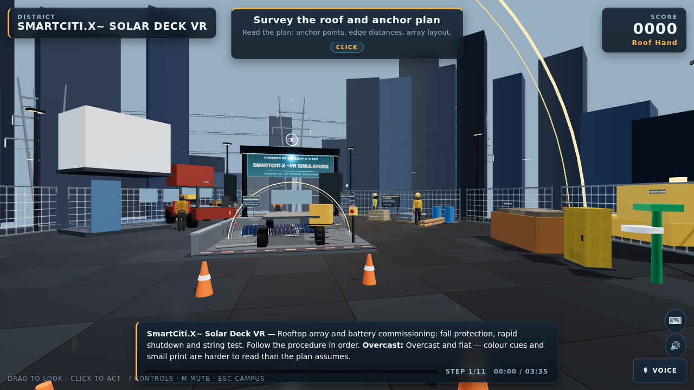 <b>Solar Deck</b> — Rooftop array and battery commissioning: fall protection, rapid shutdown and string test</td><td width="50%"> <b>Battery Yard</b> — Grid battery module swap: gas and vent check from outside, stop from the controller, AC before DC, rack disconnects in order, bleed-down wait, live-dead-live on the DC bus, racks grounded, insulated tools, thermal check before the door</td></tr>
<tr><td width="50%"> <b>Charge Point</b> — DC fast-charger fault isolation, capacitor discharge and busbar torque</td><td width="50%"> <b>Substation Switching</b> — Feeder outage on a written switching order: read-back, breaker open, disconnects open, test dead, grounds on, tag, hand-off</td></tr>
<tr><td width="50%">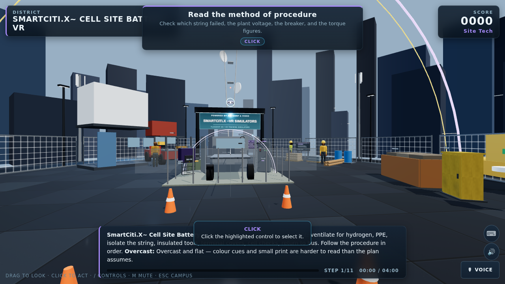 <b>Cell Site Battery</b> — −48 V plant string replacement: ventilate for hydrogen, PPE, isolate the string, insulated tools, terminal covers, cell checks, return to bus</td></tr>
</table>

## Live Events Production

**Union:** IATSE — International Alliance of Theatrical Stage Employees

**Certifications and standards:** ETCP Certified Rigger and Certified Entertainment Electrician, ANSI E1.4-1 counterweight rigging and NFPA 70E for the power tie-in

A load-in from the truck to the house lights, in the order a call actually runs, with the two things that kill on a stage: what is overhead and what is energised.

| # | Station | Trade | Conditions | Steps | Interrupts | Eval | Why it is in the programme |
|---|---|---|---|---|---|---|---|
| 26 | [Stage Power](../../WebXR/smartcity/index.html?sim=stage-power) | Stage / touring electrician | indoor (theatre) | 11 | 2 | 90 | The company switch tie-in: cam-locks ground first, and the phase check before anything is energised. |
| 40 | [Fly System](../../WebXR/smartcity/index.html?sim=fly-system) | Theatrical rigger / fly operator | indoor (theatre) | 12 | 2 | 95 | Loading a lineset, where an unbalanced arbor is a runaway with a person on the rope. |
| 18 | [Rigging Loft](../../WebXR/smartcity/index.html?sim=rigging-loft) | Theatrical rigger (IATSE) | indoor (theatre) | 14 | 2 | 96 | Points overhead, with automation cues proven before the house is let in. |
| 30 | [Chain Hoist](../../WebXR/smartcity/index.html?sim=chain-hoist) | Entertainment rigger — chain motors | indoor (theatre) | 10 | 2 | 94 | Motors: inspection, capacity and never leaving a load hanging on a brake. |

<table>
<tr><td width="50%">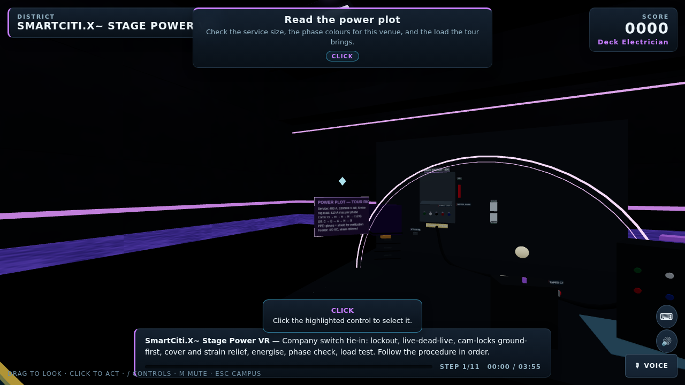 <b>Stage Power</b> — Company switch tie-in: lockout, live-dead-live, cam-locks ground-first, cover and strain relief, energise, phase check, load test</td><td width="50%"> <b>Fly System</b> — Counterweight lineset load: rail locked, deck cleared with a call, batten in, fixtures hung and safetied, loader clipped in on the bridge, bricks to match the pipe with spreaders and a lock ring, balanced test lift, trim, lock, clamp, tag</td></tr>
<tr><td width="50%"> <b>Rigging Loft</b> — Counterweight fly-system operation: arbor inspection, balance, cued flying and automation cue programming</td><td width="50%"> <b>Chain Hoist</b> — Flying a truss: load calc, chain inspection, bridle angle, moused hooks, test lift, deck clear, trim and lock</td></tr>
</table>

## Dental Careers — Unspoken Smiles

**Union:** SEIU and UFCW dental and clinic staff, AFSCME public-health dental staff, the ADHA and the ADAA as the professions' bodies, DANB as the assisting credential

**Certifications and standards:** The state dental practice act and its allowable duties for assistants and hygienists, DANB's CDA components (radiation health and safety, infection control, general chairside), CODA-accredited programme standards, the CDC's dental infection-control guidelines, OSHA 29 CFR 1910.1030 and 1910.1200, HIPAA's privacy and security rules, and the ADA's radiographic guidance

The careers a student can step into from the Unspoken Smiles clinic: dental assisting at the chair, sterilisation and instrument processing, radiography, the laboratory bench, orthodontic and surgical assisting, the front office and treatment coordination, and community outreach — with the ladder from assistant to hygienist to dentist laid out as a station of its own.

| # | Station | Trade | Conditions | Steps | Interrupts | Eval | Why it is in the programme |
|---|---|---|---|---|---|---|---|
| 119 | [Patient Intake Screening](../../WebXR/smartcity/index.html?sim=patient-intake-screening) | Dental hygienist | indoor (clinic) | 13 | 2 | 96 | The shared first ten minutes: every dental career starts by reading the history and taking the vitals the same way. |
| 212 | [Dental Careers Pathway](../../WebXR/smartcity/index.html?sim=dental-careers-pathway) | Dental careers — assistant to hygienist to dentist | indoor (clinic) | 15 | 2 | — | The ladder itself, before any of it: assistant to expanded-function assistant to hygienist to dentist, what each rung actually requires, where the pay-and-hours facts come from, and a signed plan with a date on it. |
| 213 | [Four-Handed Dentistry](../../WebXR/smartcity/index.html?sim=four-handed-dentistry) | Dental assistant — chairside (DANB CDA) | indoor (clinic) | 14 | 2 | — | The assistant's own trade at the chair: clock zones, stool heights, a tray in order of use, and every instrument transferred below the patient's chin rather than across their face. |
| 214 | [Full-Mouth Radiographic Series](../../WebXR/smartcity/index.html?sim=dental-radiography-fmx) | Dental assistant — radiographer (DANB RHS) | indoor (clinic) | 15 | 2 | — | The radiography permit put to work on a full-mouth series: holder assembled, sensor sheathed and seated, factors set for this patient, and a retake decided by rule instead of reflex. |
| 215 | [Sterilisation Centre](../../WebXR/smartcity/index.html?sim=sterilisation-technician-cycle) | Sterile processing technician — dental instruments | indoor (clinic) | 15 | 2 | — | The processing room as a career of its own: one-way zones, indicators and load numbers, a chart read before release, and a recall that can name every pack a failed load produced. |
| 216 | [Dental Laboratory Bench](../../WebXR/smartcity/index.html?sim=dental-lab-bench) | Dental laboratory technician (CDT) | indoor (clinic) | 15 | 2 | — | The bench furthest from the chair: impressions disinfected to time, stone mixed by ratio, models trimmed wet behind a guard, and a tray made to the prescription the dentist actually wrote. |
| 212 | [Orthodontic Assisting](../../WebXR/smartcity/index.html?sim=orthodontic-assisting) | Orthodontic dental assistant | indoor (clinic) | 14 | 2 | — | The specialty chair a DANB Certified Orthodontic Assistant works: a bracket tray in bonding order, an etch held to its label's window, and every distal wire end tucked before the patient stands up. |
| 213 | [Oral Surgery Assisting](../../WebXR/smartcity/index.html?sim=oral-surgery-assisting) | Oral and maxillofacial surgery assistant | indoor (clinic) | 14 | 2 | — | The surgical side of the same building: a time-out, a draped sterile field, suction and retraction held steady, and the sedation monitor read back out loud to the surgeon. |
| 214 | [Front Office & Treatment Coordination](../../WebXR/smartcity/index.html?sim=front-office-treatment-coordination) | Dental front office treatment coordinator | indoor (clinic) | 14 | 2 | — | The dental career that never puts a glove on: privacy at an open counter, a pre-authorisation built on a real CDT code, and a treatment plan presented behind a door with no pressure in it. |
| 215 | [Infection Control Audit](../../WebXR/smartcity/index.html?sim=infection-control-audit) | Dental infection prevention coordinator | indoor (clinic) | 14 | 2 | — | The coordinator's whole-clinic walk with the CDC's own checklist — hand hygiene, PPE, barriers, waterlines, sharps, sterilisation logs and spore records, each finding closed with a corrective action. |
| 216 | [School Screening Outreach](../../WebXR/smartcity/index.html?sim=school-screening-outreach) | Community dental health worker | indoor (clinic) | 14 | 2 | — | The career that works out of a school hall rather than an operatory: consent sorted first, a basic screening by light and mirror, varnish under standing order, and a referral list somebody actually follows up. |
| 212 | [Implant Surgery Assisting](../../WebXR/smartcity/index.html?sim=implant-surgery-assisting) | Dental assistant — surgical assisting (DANB Certified Oral and Maxillofacial Surgery Assistant), SEIU and UFCW clinic and dental staff | indoor (clinic) | 14 | 2 | — | Surgical assisting one chair further on: the sterile field laid and kept, the drill kit handed up in the manufacturer's own sequence, chilled irrigant on the bur and the seating torque read aloud into the record. |
| 213 | [Endodontic Assisting](../../WebXR/smartcity/index.html?sim=endodontic-assisting) | Dental assistant — endodontic assisting (DANB Certified Dental Assistant), SEIU and UFCW clinic and dental staff | indoor (clinic) | 14 | 2 | — | The root canal visit from the assistant's side: the dam on before anything opens the tooth, a working length off the apex locator, hypochlorite handled as a caustic, and every file counted off the bracket. |
| 214 | [Denture Delivery & Adjustment](../../WebXR/smartcity/index.html?sim=denture-delivery-and-adjustment) | Dental assistant and dental laboratory technician — removable prosthodontics (DANB Certified Dental Assistant), SEIU and UFCW clinic, dental and laboratory staff | indoor (clinic) | 15 | 2 | — | Where the laboratory bench meets the chair: the case matched to its prescription, the fit proved with paste, the spot cut under a guard and extraction, and the appliance marked with its owner's identity. |
| 215 | [Special Needs & Geriatric Dentistry](../../WebXR/smartcity/index.html?sim=special-needs-and-geriatric-dentistry) | Dental assistant and hygienist — special care and geriatric dentistry (DANB Certified Dental Assistant), SEIU and UFCW clinic and dental staff | indoor (clinic) | 15 | 2 | — | The patients the schedule makes least room for: a transfer done with equipment rather than backs, consent taken from the patient and not around them, a swallow-safe position, and a dry mouth treated as a disease. |
| 216 | [Teledentistry & Triage](../../WebXR/smartcity/index.html?sim=teledentistry-and-triage) | Dental assistant — teledentistry facilitator and triage (DANB Certified Dental Assistant), SEIU and UFCW clinic and dental staff | indoor (clinic) | 15 | 2 | — | The visit that happens down a camera: a platform the practice may lawfully use, images worth reading, the emergency criteria worked airway first, and the limits of a remote look written into the note. |

<table>
<tr><td width="50%"> <b>Patient Intake Screening</b> — History reviewed and flagged, vitals read against the deferral threshold, a systematic exam, findings charted, and today's consent explained and signed</td><td width="50%">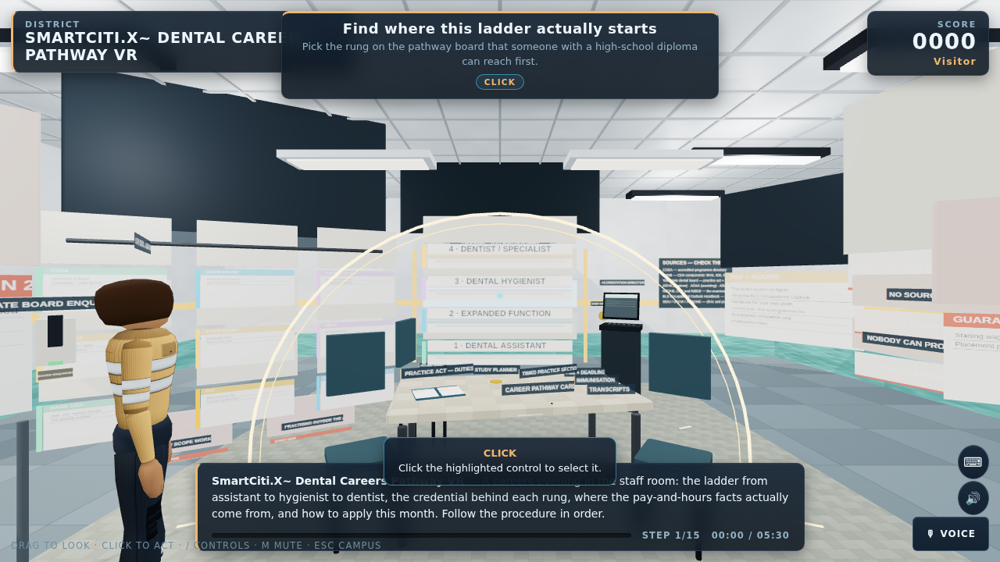 <b>Dental Careers Pathway</b> — A careers evening in the staff room: the ladder from assistant to hygienist to dentist, the credential behind each rung, where the pay-and-hours facts actually come from, and how to apply this month</td></tr>
<tr><td width="50%"> <b>Four-Handed Dentistry</b> — Chairside assisting as a trade: clock zones, stool heights, a tray in order of use, transfers below the chin, evacuation on hard tissue and retraction that holds a field without blanching it</td><td width="50%">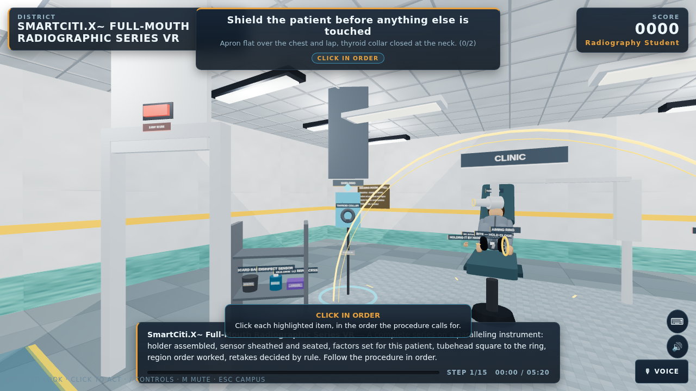 <b>Full-Mouth Radiographic Series</b> — A complete series on a paralleling instrument: holder assembled, sensor sheathed and seated, factors set for this patient, tubehead square to the ring, region order worked, retakes decided by rule</td></tr>
<tr><td width="50%">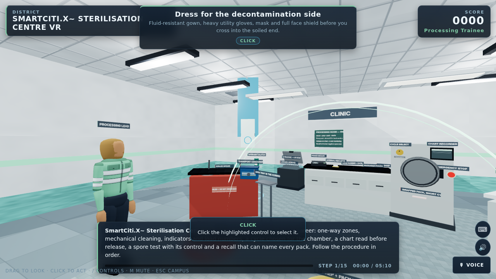 <b>Sterilisation Centre</b> — The processing room as a career: one-way zones, mechanical cleaning, indicators and load numbers, a cycle chosen for the chamber, a chart read before release, a spore test with its control and a recall that can name every pack</td><td width="50%"> <b>Dental Laboratory Bench</b> — The lab bench as a trade: impressions disinfected to time, stone mixed by ratio under vacuum, models poured and trimmed wet, a lathe behind its shield, pumice changed per case and a tray made to the written prescription</td></tr>
</table>

## Hunters Point Edition — Can We Live?

**Union:** Community science with the Marie Harrison Community Foundation and Greenaction as partners; LIUNA hazmat laborers, IUOE operators, Teamsters and radiation technicians on the site-work pathway

**Certifications and standards:** EPA QA/QC and chain-of-custody guidance for community samples, BAAQMD complaint and Community Advisory Council process, 45 CFR 46 informed consent for biomonitoring, OSHA 29 CFR 1910.120 HAZWOPER and 1910.134 respirators for anyone inside a cleanup fence, Cal/OSHA's wildfire smoke rule

A flagship built to be offered to the foundation and its partners: the sourced story of Marie Harrison and the foundation that carries her name, then twenty-five stations in the skills a community science programme actually uses — air sensors, pollution patrol, biomonitoring with consent, fence-line dust and haul-route observation, split samples, radiological literacy, the HAZWOPER gate into cleanup work, and turning data into testimony. Every station is sited generically; the edition does not speak for the foundation.

| # | Station | Trade | Conditions | Steps | Interrupts | Eval | Why it is in the programme |
|---|---|---|---|---|---|---|---|
| 146 | [Can We Live? — The Story](../../WebXR/smartcity/index.html?sim=can-we-live-story) | Community environmental monitor | clear | 10 | 0 | 74 | The story first: the foundation, the woman it is named for, and the record the neighbourhood works against — sourced, flat, and honest about what this edition is not. |
| 147 | [Neighbourhood Air Sensor](../../WebXR/smartcity/index.html?sim=air-sensor-install) | Community environmental monitor | wind, Environmental Monitoring | 14 | 2 | 95 | The network starts on a resident's own wall: siting by the rules, a weatherproof mount, and a first reading proven against a handheld before it ever reports for the block. |
| 148 | [Sensor Co-Location Check](../../WebXR/smartcity/index.html?sim=sensor-colocation-check) | Community environmental monitor | fog, Environmental Monitoring | 13 | 2 | 97 | A week beside the Air District's own reference monitor is what earns the correction factor every sensor this network installs actually relies on. |
| 149 | [Network Data Review](../../WebXR/smartcity/index.html?sim=air-network-data-qa) | Community environmental monitor | indoor (service) | 13 | 2 | 97 | The map only means what it says if somebody reads it honestly every week — a smoke day told from a local source, a stuck sensor caught, and a real finding reported rather than sat on. |
| 150 | [Pollution Patrol](../../WebXR/smartcity/index.html?sim=odor-complaint-log) | Community environmental monitor | wind, Environmental Monitoring | 12 | 2 | 95 | The patrol that turns a smell into a record: logged completely, filed with the Air District, and walked from the public side of the fence every time. |
| 151 | [Biomonitoring Consent](../../WebXR/smartcity/index.html?sim=biomonitoring-consent) | Biomonitoring field coordinator | indoor (clinic) | 13 | 2 | 97 | Before any tube is opened: the study explained, the consent form's rights read aloud, the signature witnessed, and a participant ID assigned so no sample ever carries a name. |
| 152 | [Sample Kit Shipping](../../WebXR/smartcity/index.html?sim=sample-kit-shipping) | Biomonitoring field coordinator | indoor (service) | 13 | 2 | 96 | What consent buys the sample: labels matched to IDs, the cold chain running, UN3373 packing, and the chain of custody signed before a courier ever touches the box. |
| 153 | [Results Return Visit](../../WebXR/smartcity/index.html?sim=results-return-visit) | Biomonitoring field coordinator | indoor (clinic) | 13 | 2 | 96 | The other half of the promise 45 CFR 46 makes: a result explained against reference ranges, without alarm or dismissal, to the participant it actually belongs to. |
| 154 | [Smoke Day Outreach](../../WebXR/smartcity/index.html?sim=smoke-day-outreach) | Community pollution patrol lead | smoke, Environmental Monitoring | 13 | 2 | 95 | The patrol network on the day the air itself is the hazard: the vulnerable list worked first, N95s actually fit, and the patrol's own masks on when the AQI says so. |
| 155 | [Fenceline Dust Monitor](../../WebXR/smartcity/index.html?sim=fenceline-dust-monitor) | Community environmental monitor | wind, Environmental Monitoring | 14 | 2 | 95 | The instrument the patrol reads: a PM10 monitor sited downwind, levelled and guyed, proven at zero and flow, alarmed to the site's own action level, and an exceedance reported without ever crossing the fence. |
| 156 | [Haul Route Observation](../../WebXR/smartcity/index.html?sim=haul-route-observation) | Community environmental monitor | overcast, Environmental Monitoring | 13 | 2 | 96 | The sidewalk's own record of what leaves the gate: the tarp, the wheel wash, the manifest placard and the residential speed limit, each truck logged with a plate, a time and a photo for the Air District and the site's own line. |
| 157 | [Met Station Siting](../../WebXR/smartcity/index.html?sim=met-station-siting) | Community environmental monitor | wind, Environmental Monitoring | 14 | 2 | 96 | The instrument every other reading on this list leans on: the network's own weather station, sited clear of obstructions, turned to true north and checked against the airport before anyone trusts a wind direction off it. |
| 158 | [Dust Plan Review](../../WebXR/smartcity/index.html?sim=dust-plan-review) | Community environmental monitor | indoor (service) | 15 | 2 | 96 | The desk work behind the patrol: a contractor's own dust control plan held against what the patrol actually saw, and the gaps written into a comment letter the regulator has to answer. |
| 159 | [Community Soil Split](../../WebXR/smartcity/index.html?sim=community-soil-split) | Community environmental monitor | overcast, Environmental Monitoring | 12 | 2 | 97 | The split sample is community science's founding move: the same core an agency cuts, witnessed and divided in front of both parties, so the neighbourhood's own answer never depends on trusting the agency's lab alone. |
| 160 | [Garden Soil Screen](../../WebXR/smartcity/index.html?sim=garden-soil-screen) | Community environmental monitor | clear, Environmental Monitoring | 12 | 2 | 98 | The patrol network's other daily work: a handheld XRF, a proven check standard and an honest action-level call turn a family's garden bed from a guess into a result they can act on. |
| 161 | [Shoreline Sediment Grab](../../WebXR/smartcity/index.html?sim=shoreline-sediment-grab) | Community environmental monitor | overcast, Environmental Monitoring | 12 | 2 | 94 | The bay's edge gets the same discipline as the fenced parcel: a tide window read like a clock, a grab from the top two centimetres, and a transect that moves the moment a listed bird says it should. |
| 162 | [Discharge Photo Doc](../../WebXR/smartcity/index.html?sim=discharge-photo-doc) | Community environmental monitor | overcast, Environmental Monitoring | 12 | 2 | 96 | A patrol's whole job in one station: dry boots, the right bottle, a photo an inspector can actually use, and both hotlines called before the sheen has washed out on the next tide. |
| 163 | [Rad Meter Basics](../../WebXR/smartcity/index.html?sim=rad-meter-basics) | Community environmental monitor | overcast, Environmental Monitoring | 13 | 2 | 95 | The meter itself, taught honestly: background counted first, the check source proven, counts per minute told apart from microsieverts per hour, a grid walked at a set pace and height, and what a hand-held reading can never say on its own — which isotope, and how deep. |
| 164 | [Parcel Status Walk](../../WebXR/smartcity/index.html?sim=parcel-status-walk) | Community environmental monitor | overcast, Environmental Monitoring | 13 | 2 | 95 | The regulator's own map carried down the block: which parcel transferred, which is still under cleanup, which is being retested, the institutional controls a transfer doesn't erase, and an honest answer for the resident who just wants to know if her street is done. |
| 165 | [Retest Witnessing](../../WebXR/smartcity/index.html?sim=retest-witnessing) | Community environmental monitor | overcast, Environmental Monitoring | 13 | 2 | 93 | Standing at the fence for someone else's retest: the grid checked against the work plan, the split sample asked for in writing, the custody form actually read, and a statement written the same day while it's still exact. |
| 166 | [Abatement Perimeter Awareness](../../WebXR/smartcity/index.html?sim=abatement-perimeter-awareness) | Hazmat and environmental laborer — LIUNA | wind, Environmental Monitoring | 14 | 2 | 97 | The first rung of the trained-worker pathway: a new laborer's fence-line watch on a demolition perimeter, reading the postings and the controls without ever crossing the tape. |
| 167 | [HAZWOPER Site Orientation](../../WebXR/smartcity/index.html?sim=hazwoper-site-orientation) | Hazmat and environmental laborer — LIUNA | indoor (service) | 13 | 2 | 98 | The gate itself, walked through in full: the plan signed, the zones and the PPE level confirmed, and a buddy assigned before a HAZWOPER-trained laborer's first shift on the parcel begins. |
| 168 | [Decon Support Laborer](../../WebXR/smartcity/index.html?sim=decon-support-laborer) | Hazmat and environmental laborer — LIUNA | clear, Environmental Monitoring | 12 | 2 | 97 | The corridor from the clean side: a laborer stocking it, containing the water, washing entrants and tools in order, and drumming the wastewater so the line's own record holds up. |
| 169 | [Public Comment Prep](../../WebXR/smartcity/index.html?sim=public-comment-prep) | Community pollution patrol lead | indoor (service) | 13 | 2 | 96 | A month of patrol logs and monitor data turned into testimony a regulator's hearing can actually use: every claim tied to a dated record, the chart pulled from the network's own numbers, a three-minute statement timed to the clock, a written comment filed with its exhibits, a speaker card at registration, and nothing said that the record cannot back up. |
| 170 | [Youth Patrol Training](../../WebXR/smartcity/index.html?sim=youth-patrol-training) | Youth patrol member | clear, Environmental Monitoring | 12 | 2 | 96 | A youth patrol team's first shift on the public sidewalk beside a fenced parcel: roles assigned, the route and the fence line's boundary walked, the buddy rule kept, sun and smoke gear staged, a real observation logged, the calm answer at the fence, and a debrief that closes the shift out loud. |
| 171 | [Shelter-in-Place Drill](../../WebXR/smartcity/index.html?sim=shelter-in-place-drill) | Community pollution patrol lead | indoor (service) | 14 | 2 | 96 | A community centre's own drill for a dust or fire event next door: the alert taken seriously, every door and window closed, the HVAC to recirculate, the air cleaner on high, a real headcount, the hotline and the Air District both called, residents with respiratory needs checked by name, and the all-clear recorded rather than assumed. |

<table>
<tr><td width="50%">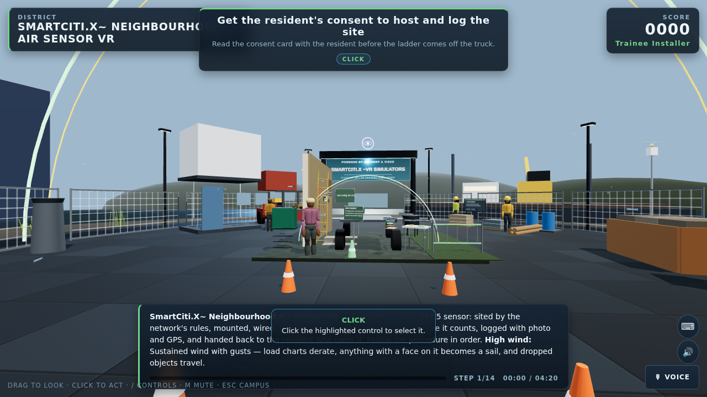 <b>Neighbourhood Air Sensor</b> — A resident's own PM2.5 sensor: sited by the network's rules, mounted, wired, paired, proven against a handheld before it counts, logged with photo and GPS, and handed back to the resident who owns it</td><td width="50%">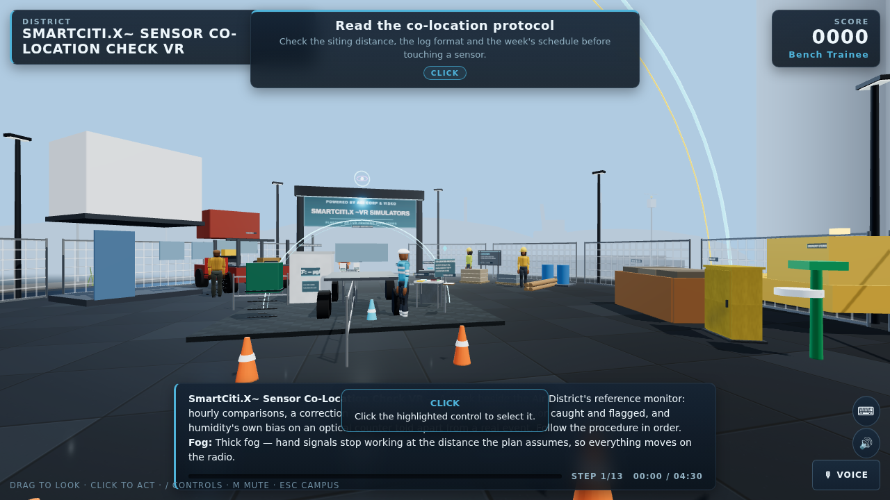 <b>Sensor Co-Location Check</b> — A week beside the Air District's reference monitor: hourly comparisons, a correction factor earned honestly, a drifting sensor caught and flagged, and humidity's own bias on an optical counter told apart from a real event</td></tr>
<tr><td width="50%">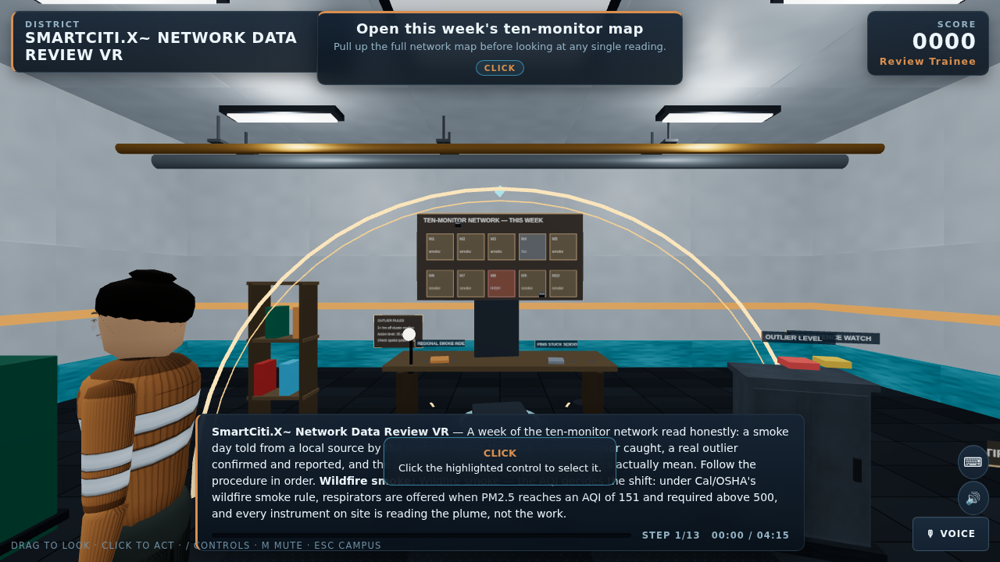 <b>Network Data Review</b> — A week of the ten-monitor network read honestly: a smoke day told from a local source by the pattern across the map, a stuck sensor caught, a real outlier confirmed and reported, and the public note that says what the numbers actually mean</td><td width="50%">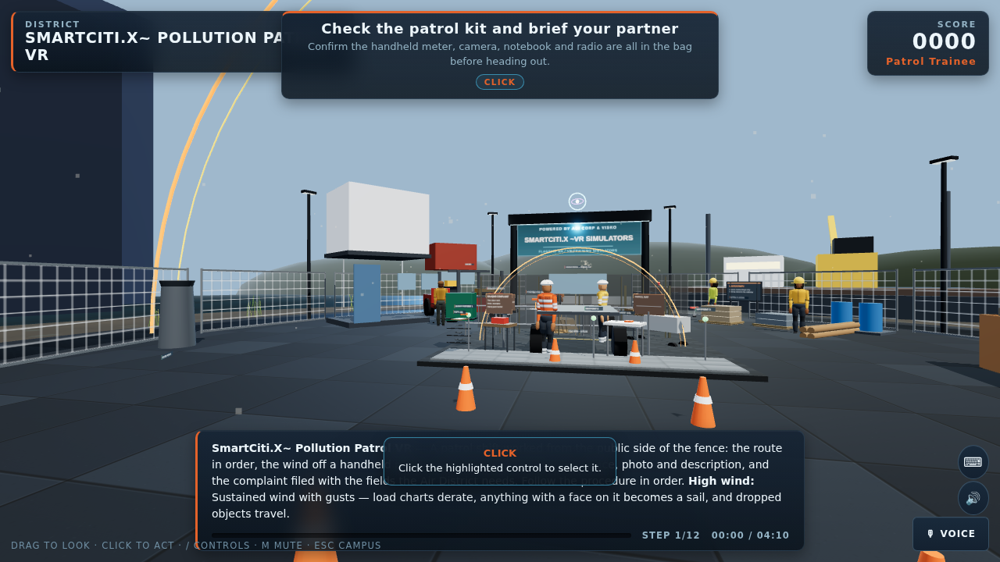 <b>Pollution Patrol</b> — A patrol shift worked from the public side of the fence: the route in order, the wind off a handheld meter, an event logged with time, place, photo and description, and the complaint filed with the fields the Air District needs</td></tr>
<tr><td width="50%">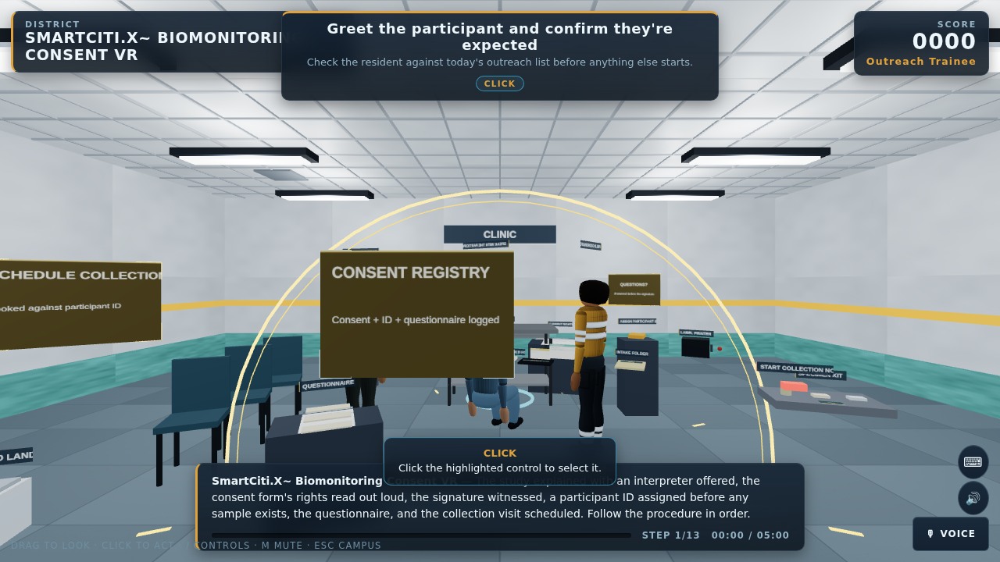 <b>Biomonitoring Consent</b> — The study explained with an interpreter offered, the consent form's rights read out loud, the signature witnessed, a participant ID assigned before any sample exists, the questionnaire, and the collection visit scheduled</td><td width="50%">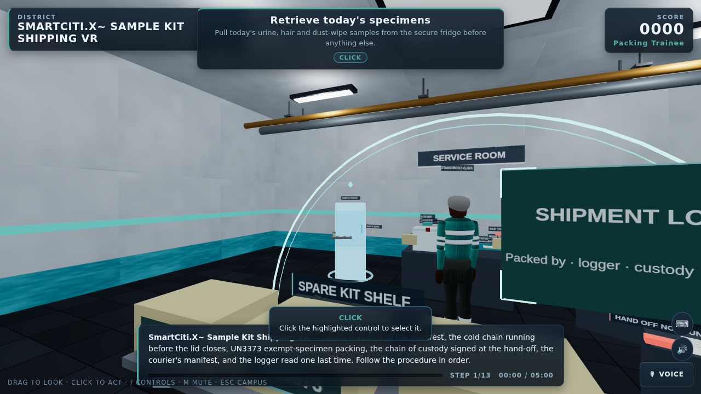 <b>Sample Kit Shipping</b> — Labels matched to the manifest, the cold chain running before the lid closes, UN3373 exempt-specimen packing, the chain of custody signed at the hand-off, the courier's manifest, and the logger read one last time</td></tr>
<tr><td width="50%">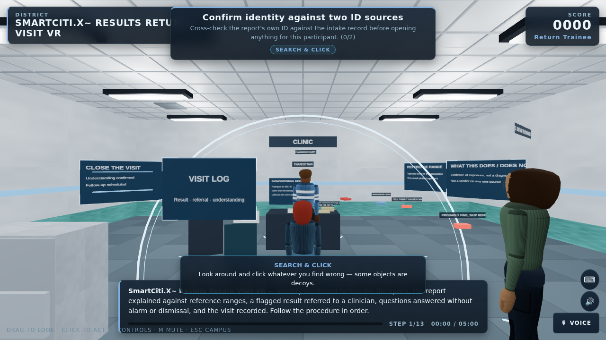 <b>Results Return Visit</b> — Identity confirmed before the file opens, the report explained against reference ranges, a flagged result referred to a clinician, questions answered without alarm or dismissal, and the visit recorded</td><td width="50%">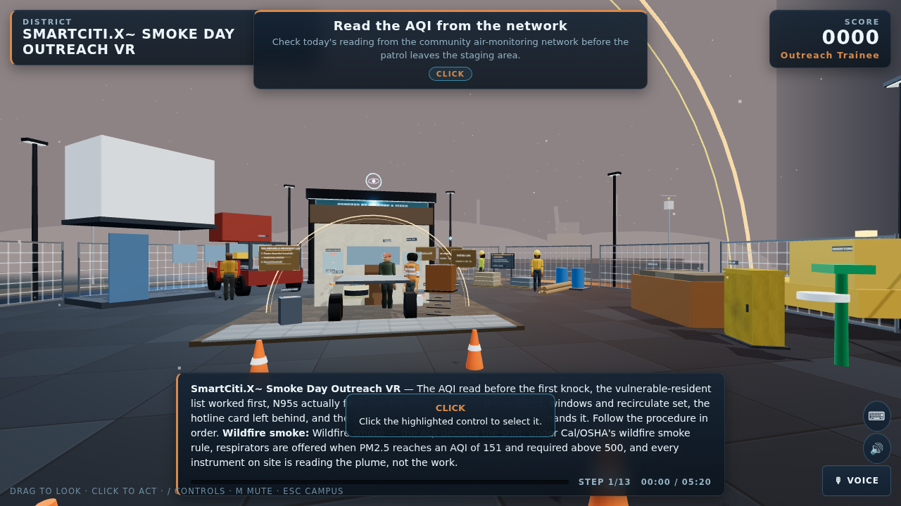 <b>Smoke Day Outreach</b> — The AQI read before the first knock, the vulnerable-resident list worked first, N95s actually fit, a box-fan filter built with the resident, windows and recirculate set, the hotline card left behind, and the patrol's own masks on when the air demands it</td></tr>
<tr><td width="50%">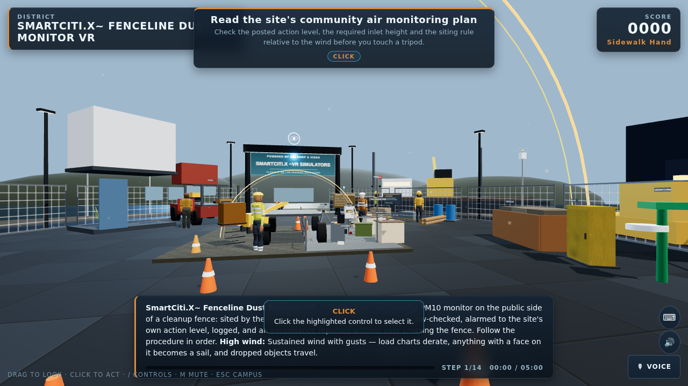 <b>Fenceline Dust Monitor</b> — Deploying a community PM10 monitor on the public side of a cleanup fence: sited by the wind, levelled and guyed, zeroed and flow-checked, alarmed to the site's own action level, logged, and an exceedance reported without ever crossing the fence</td><td width="50%">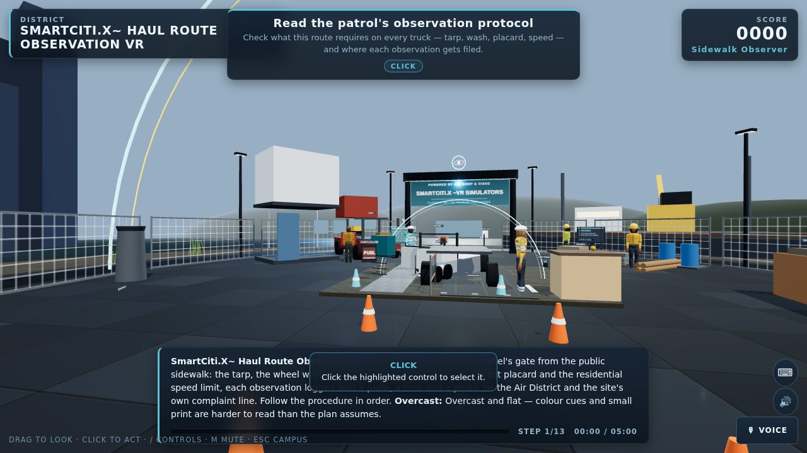 <b>Haul Route Observation</b> — Watching a cleanup parcel's gate from the public sidewalk: the tarp, the wheel wash, track-out onto the street, the manifest placard and the residential speed limit, each observation logged with a plate, a time and a photo for the Air District and the site's own complaint line</td></tr>
<tr><td width="50%">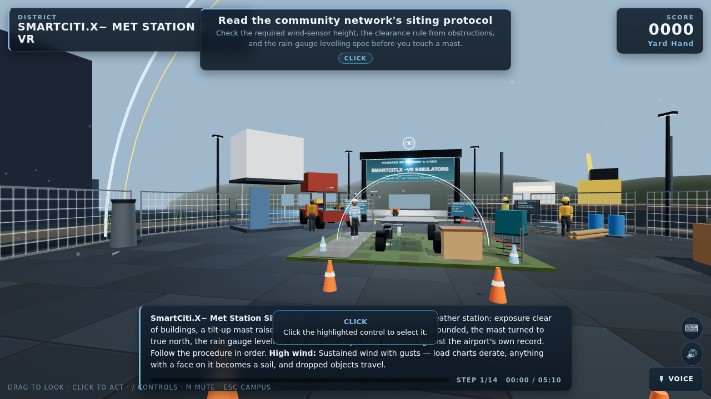 <b>Met Station Siting</b> — Siting the community's own weather station: exposure clear of buildings, a tilt-up mast raised and guyed, the datalogger wired and grounded, the mast turned to true north, the rain gauge levelled, and the first day's data checked against the airport's own record</td><td width="50%">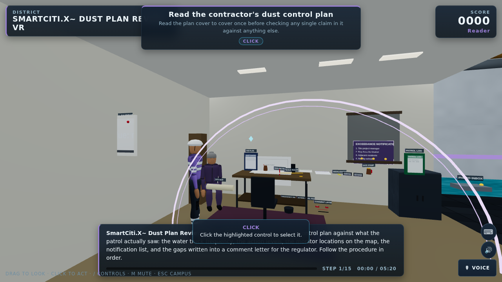 <b>Dust Plan Review</b> — Reading a contractor's dust control plan against what the patrol actually saw: the water truck frequency, the action levels, the monitor locations on the map, the notification list, and the gaps written into a comment letter for the regulator</td></tr>
<tr><td width="50%">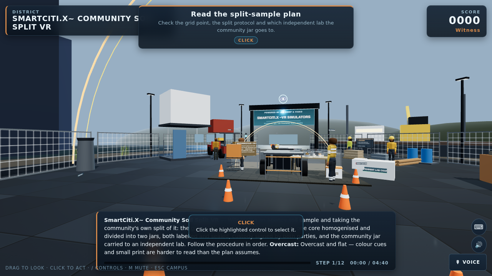 <b>Community Soil Split</b> — Witnessing an agency soil sample and taking the community's own split of it: the grid point, the decontaminated trowel, one core homogenised and divided into two jars, both labelled and sealed, custody signed by both parties, and the community jar carried to an independent lab</td><td width="50%">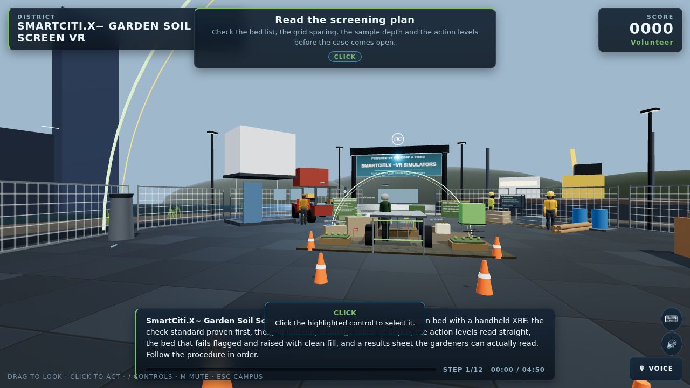 <b>Garden Soil Screen</b> — Screening a community garden bed with a handheld XRF: the check standard proven first, the grid laid out, readings taken at depth, the action levels read straight, the bed that fails flagged and raised with clean fill, and a results sheet the gardeners can actually read</td></tr>
<tr><td width="50%">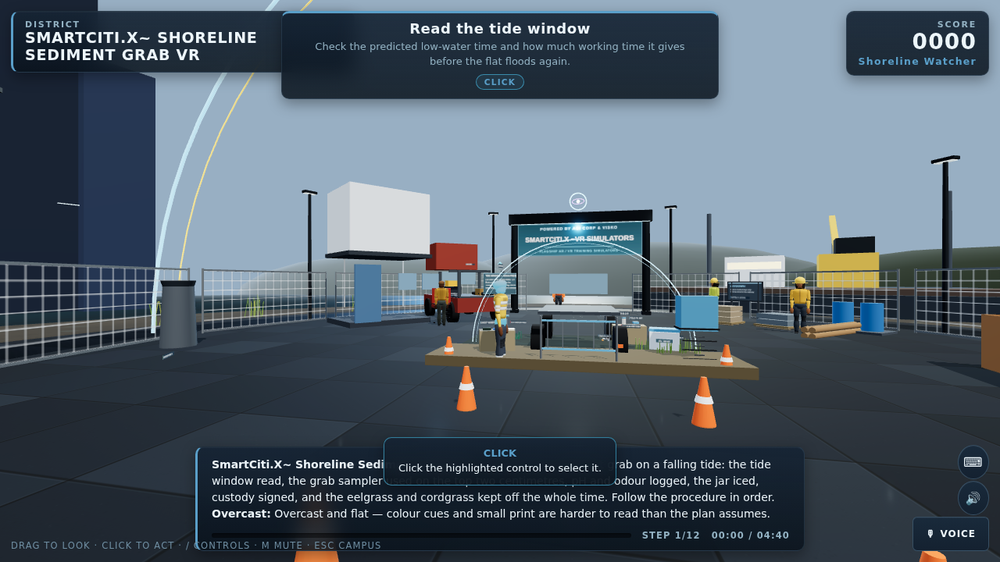 <b>Shoreline Sediment Grab</b> — A shoreline sediment grab on a falling tide: the tide window read, the grab sampler used on the top two centimetres, pH and odour logged, the jar iced, custody signed, and the eelgrass and cordgrass kept off the whole time</td><td width="50%">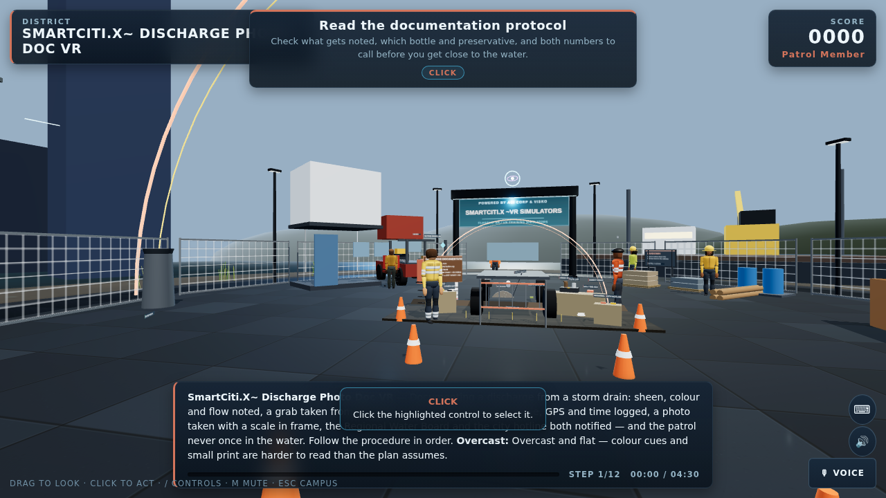 <b>Discharge Photo Doc</b> — Documenting a discharge from a storm drain: sheen, colour and flow noted, a grab taken from the bank in the right preserved bottle, GPS and time logged, a photo taken with a scale in frame, the Regional Water Board and the city hotline both notified — and the patrol never once in the water</td></tr>
<tr><td width="50%">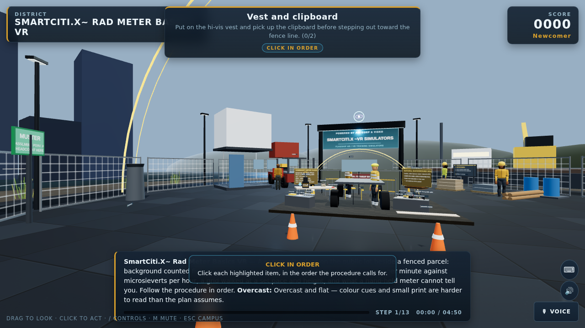 <b>Rad Meter Basics</b> — A community class on the public lot beside a fenced parcel: background counted first, the meter proven against its own check source, counts per minute against microsieverts per hour, a grid walked at a set pace and height, and what a hand-held meter cannot tell you</td><td width="50%">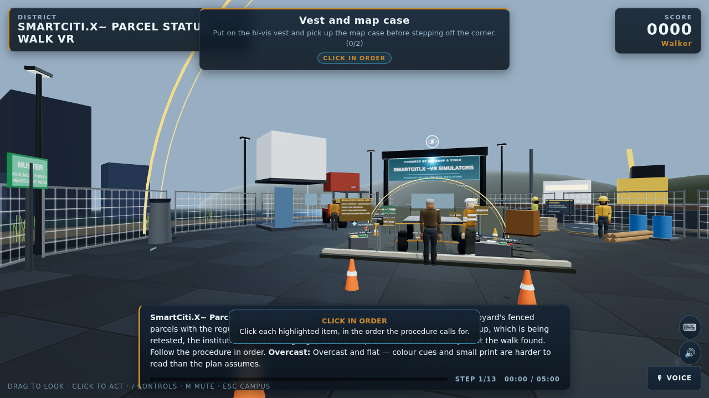 <b>Parcel Status Walk</b> — Walking the public sidewalk around a shipyard's fenced parcels with the regulator's own map: which parcel transferred, which is under cleanup, which is being retested, the institutional-controls signage, and the map annotated with exactly what the walk found</td></tr>
<tr><td width="50%">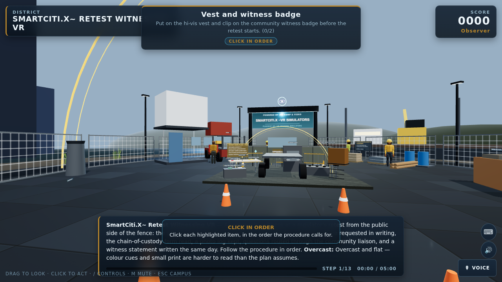 <b>Retest Witnessing</b> — A community witness at a regulator's retest from the public side of the fence: the sampling grid checked against the work plan, the split sample requested in writing, the chain-of-custody form read, a photo log kept, questions routed through the community liaison, and a witness statement written the same day</td><td width="50%">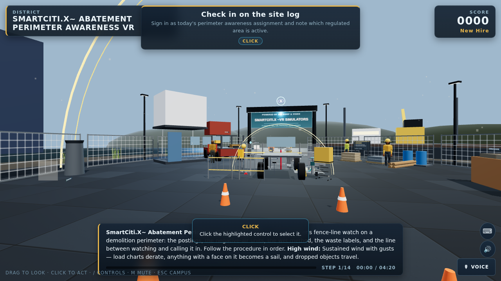 <b>Abatement Perimeter Awareness</b> — A new laborer's fence-line watch on a demolition perimeter: the postings, the negative-air units, the wet method, the waste labels, and the line between watching and calling it in</td></tr>
<tr><td width="50%">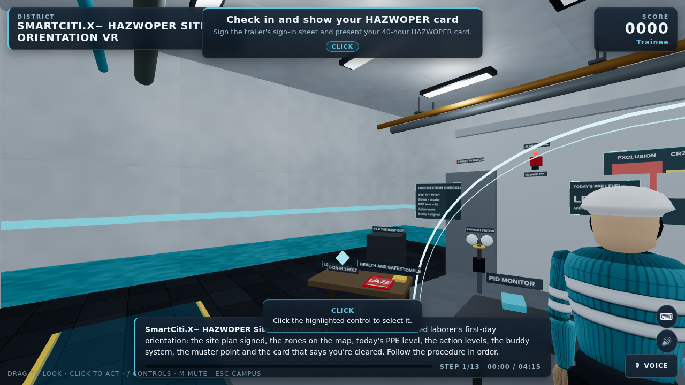 <b>HAZWOPER Site Orientation</b> — A HAZWOPER-trained laborer's first-day orientation: the site plan signed, the zones on the map, today's PPE level, the action levels, the buddy system, the muster point and the card that says you're cleared</td><td width="50%">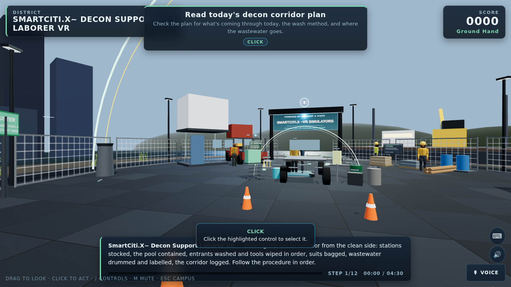 <b>Decon Support Laborer</b> — Working the decon corridor from the clean side: stations stocked, the pool contained, entrants washed and tools wiped in order, suits bagged, wastewater drummed and labelled, the corridor logged</td></tr>
<tr><td width="50%">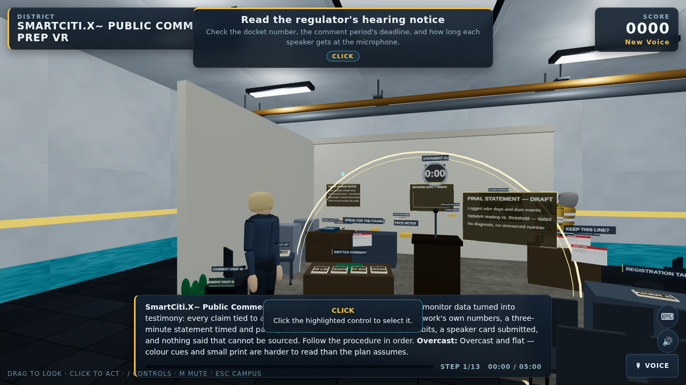 <b>Public Comment Prep</b> — A month of patrol logs and monitor data turned into testimony: every claim tied to a dated record, the chart built from the network's own numbers, a three-minute statement timed and paced, a written comment filed with its exhibits, a speaker card submitted, and nothing said that cannot be sourced</td><td width="50%">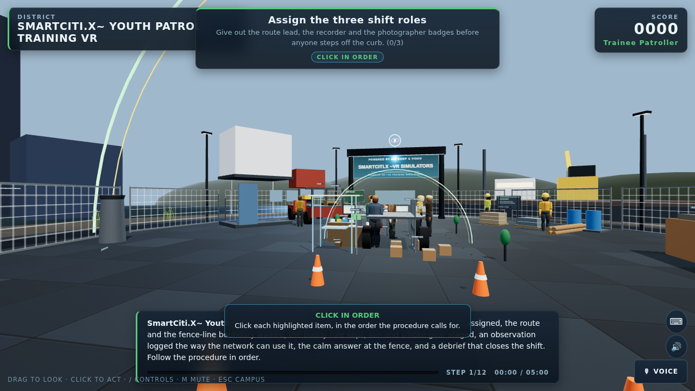 <b>Youth Patrol Training</b> — A youth patrol team's first shift: roles assigned, the route and the fence-line boundary walked, the buddy rule kept, sun and smoke gear staged, an observation logged the way the network can use it, the calm answer at the fence, and a debrief that closes the shift</td></tr>
<tr><td width="50%">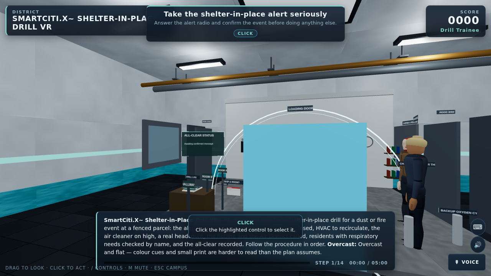 <b>Shelter-in-Place Drill</b> — A community centre's shelter-in-place drill for a dust or fire event at a fenced parcel: the alert taken seriously, doors and windows closed, HVAC to recirculate, the air cleaner on high, a real headcount, the hotline and the Air District called, residents with respiratory needs checked by name, and the all-clear recorded</td></tr>
</table>

## Sewing and Garment Trades

**Union:** Workers United (SEIU) garment and textile workers, and UNITE HERE where the sewing room sits inside a hotel or uniform service

**Certifications and standards:** OSHA 29 CFR 1910.212 machine guarding and 1910.147 lockout for industrial sewing, cutting and pressing equipment, 1910.1200 hazard communication for solvents and spot cleaners, NIOSH ergonomics guidance for seated repetitive work, the state apprenticeship standards for industrial sewing machine operators

A separate trade series that teaches sewing as a trade: threading and needle changes, straight and zigzag seams behind the guard, the serger, the cutting table and rotary cutter, pattern marking, hems and buttonholes, the industrial press, ergonomics, alterations and repair, and inspection and finishing.

| # | Station | Trade | Conditions | Steps | Interrupts | Eval | Why it is in the programme |
|---|---|---|---|---|---|---|---|
| — | Trade Skills: salon | — | — | — | — | 93 | The shared bench case every close-work trade opens on: sharps, chemicals, posture and the client — the same discipline a cutting table asks for. |
| 172 | [Machine Threading and Needle](../../WebXR/smartcity/index.html?sim=machine-threading-needle) | Industrial sewing machine operator — Workers United (SEIU) | indoor (shop) | 14 | 2 | 95 | The lockstitch head from a cold start: the needle changed with the scarf right, threaded in its one path, the bobbin wound and cased, tension proven on scrap, and the guard down before the first seam. |
| 173 | [Lockstitch Seam Behind the Guard](../../WebXR/smartcity/index.html?sim=lockstitch-seam-guard) | Industrial sewing machine operator — Workers United (SEIU) | indoor (shop) | 13 | 2 | 94 | The same head at production speed: a straight seam and a curve run behind the guard, bundle chained to bundle, and a needle break accounted for down to the broken tip. |
| 174 | [Serger and Overlock](../../WebXR/smartcity/index.html?sim=serger-overlock) | Industrial sewing machine operator — Workers United (SEIU) | indoor (shop) | 13 | 2 | 96 | The overlock next to it: four threads by colour, the cutting width set to the ticket, and the one rule that never bends — the knife gets cleaned only after it is locked out. |
| 175 | [Cutting Table and Rotary Knife](../../WebXR/smartcity/index.html?sim=cutting-table-rotary) | Industrial sewing machine operator — Workers United (SEIU) | indoor (shop) | 13 | 2 | 96 | Where the bundle started: the spread cut to the marker on two blades with the glove on the guiding hand, and the blade itself changed the same way — locked out first. |
| 176 | [Pattern Marking & Layout](../../WebXR/smartcity/index.html?sim=pattern-marking-layout) | Industrial sewing machine operator — Workers United (SEIU) | indoor (shop) | 12 | 2 | 97 | Before a blade ever touches cloth: grain and nap held true, notches and drill holes struck, and the marker counted back against the cut ticket. |
| 177 | [Hem & Buttonhole](../../WebXR/smartcity/index.html?sim=hem-and-buttonhole) | Industrial sewing machine operator — Workers United (SEIU) | indoor (shop) | 13 | 2 | 96 | Finishing behind the guard: a blind hem, a buttonhole cut and sewn on its own cutter guard, and bar tacks at the points a garment actually tears first. |
| 178 | [Industrial Press & Steam](../../WebXR/smartcity/index.html?sim=industrial-press-steam) | Industrial sewing machine operator — Workers United (SEIU) | indoor (shop) | 12 | 2 | 97 | The one machine on this floor with a boiler of its own: two-hand control, steam and vacuum, and a head locked open before anyone reaches into it. |
| 179 | [Sewing Ergonomics](../../WebXR/smartcity/index.html?sim=sewing-ergonomics-shift) | Industrial sewing machine operator — Workers United (SEIU) | indoor (shop) | 13 | 2 | 97 | The bench set up to the operator before the first seam: chair, table, pedal and light, the bundle in reach, and a symptom logged early instead of shrugged off. |
| 180 | [Alteration Repair Ticket](../../WebXR/smartcity/index.html?sim=alteration-repair-ticket) | Alterations tailor — Workers United | indoor (shop) | 13 | 2 | 96 | The alterations tailor's own ticket, worked to the customer's pinned fit rather than a guess — the ripper, the hem, and the zipper closed out with a price and a time. |
| 181 | [Garment Inspection & Finish](../../WebXR/smartcity/index.html?sim=garment-inspection-finish) | Industrial sewing machine operator — Workers United (SEIU) | indoor (shop) | 13 | 2 | 95 | The last bench a piece crosses: the light box and the spec sheet catch what a bare eye and a tape alone would miss before it ever reaches the box. |

<table>
<tr><td width="50%">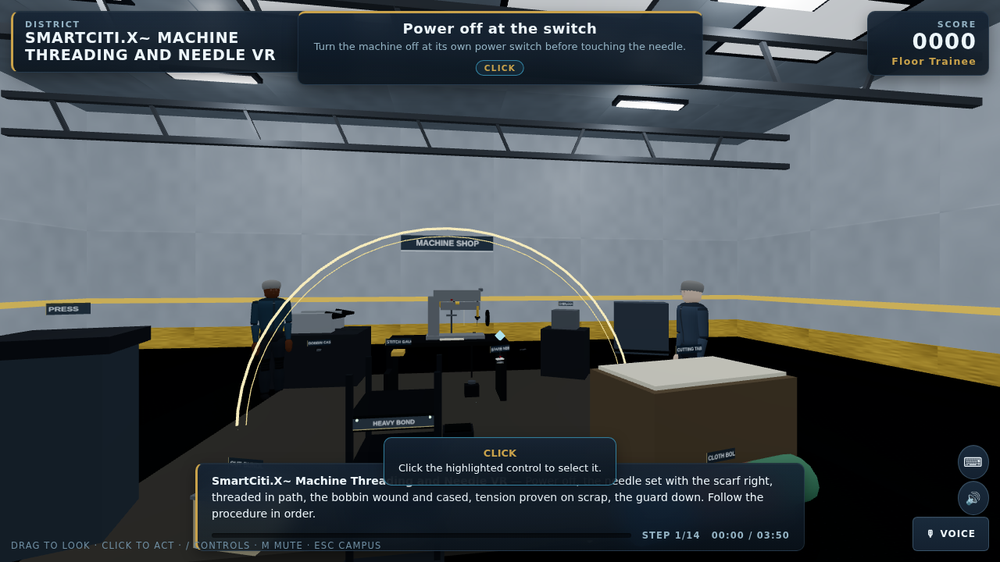 <b>Machine Threading and Needle</b> — Power off, the needle set with the scarf right, threaded in path, the bobbin wound and cased, tension proven on scrap, the guard down</td><td width="50%">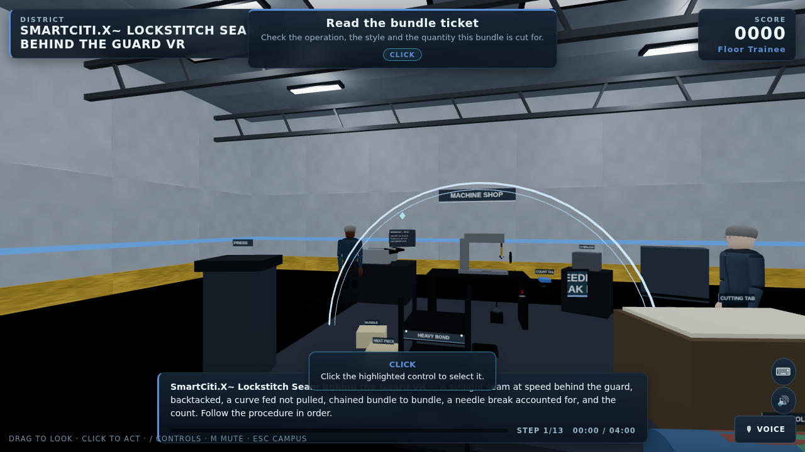 <b>Lockstitch Seam Behind the Guard</b> — A straight seam at speed behind the guard, backtacked, a curve fed not pulled, chained bundle to bundle, a needle break accounted for, and the count</td></tr>
<tr><td width="50%">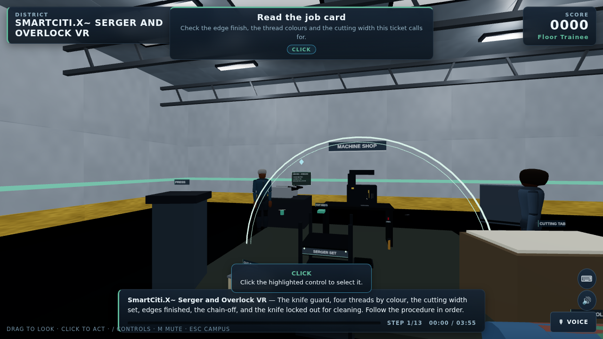 <b>Serger and Overlock</b> — The knife guard, four threads by colour, the cutting width set, edges finished, the chain-off, and the knife locked out for cleaning</td><td width="50%">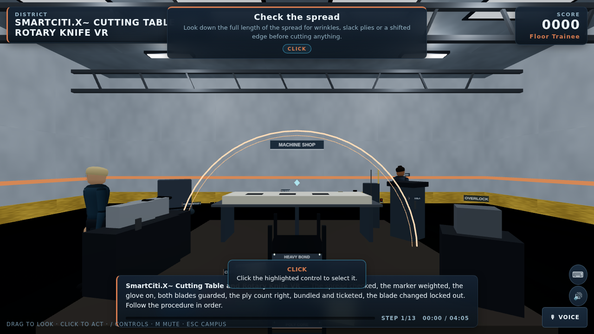 <b>Cutting Table and Rotary Knife</b> — The spread checked, the marker weighted, the glove on, both blades guarded, the ply count right, bundled and ticketed, the blade changed locked out</td></tr>
<tr><td width="50%">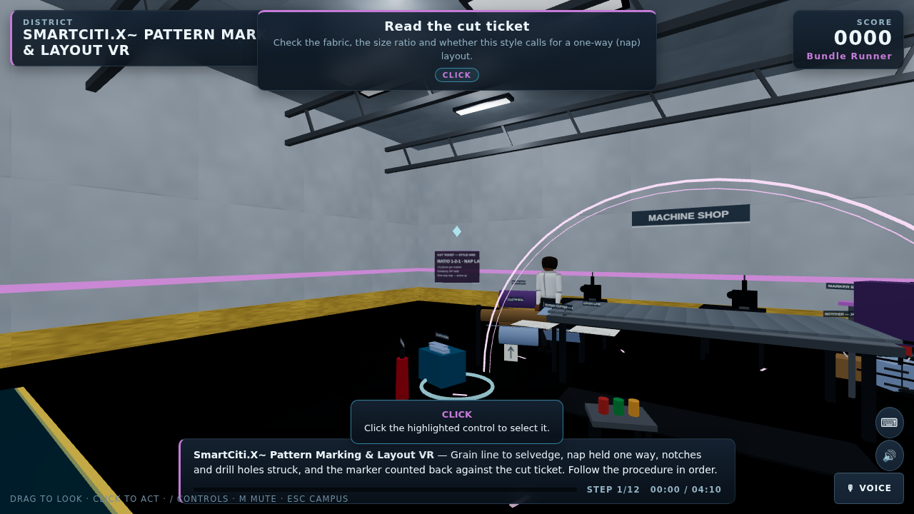 <b>Pattern Marking & Layout</b> — Grain line to selvedge, nap held one way, notches and drill holes struck, and the marker counted back against the cut ticket</td><td width="50%">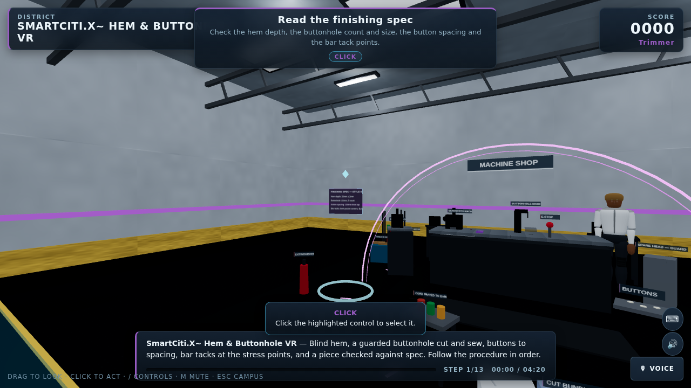 <b>Hem & Buttonhole</b> — Blind hem, a guarded buttonhole cut and sew, buttons to spacing, bar tacks at the stress points, and a piece checked against spec</td></tr>
<tr><td width="50%">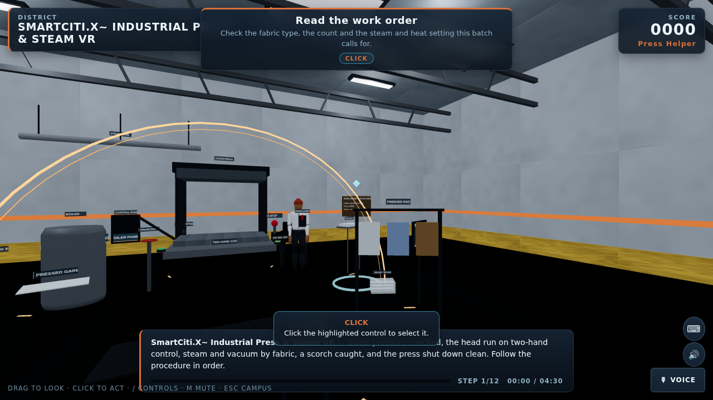 <b>Industrial Press & Steam</b> — Boiler pressure checked, the head run on two-hand control, steam and vacuum by fabric, a scorch caught, and the press shut down clean</td><td width="50%">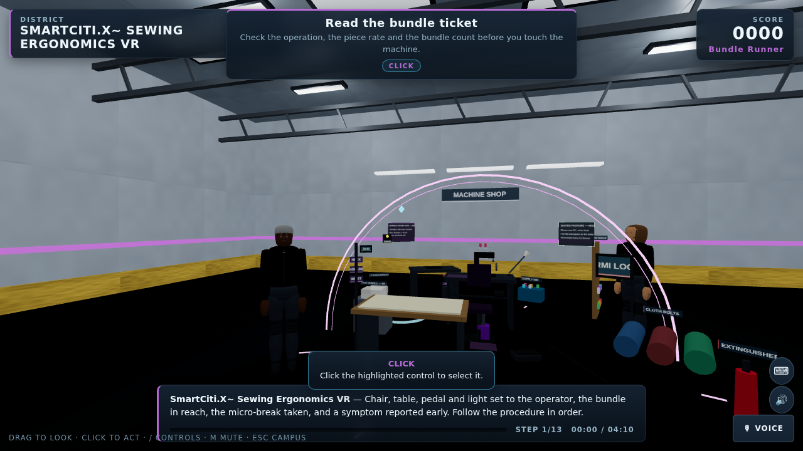 <b>Sewing Ergonomics</b> — Chair, table, pedal and light set to the operator, the bundle in reach, the micro-break taken, and a symptom reported early</td></tr>
<tr><td width="50%">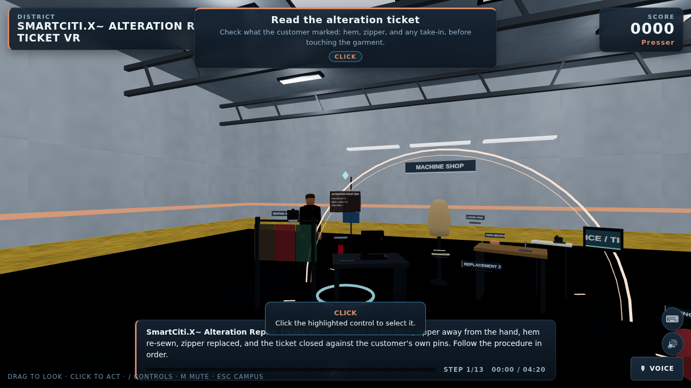 <b>Alteration Repair Ticket</b> — Garment on the form, ripper away from the hand, hem re-sewn, zipper replaced, and the ticket closed against the customer's own pins</td><td width="50%">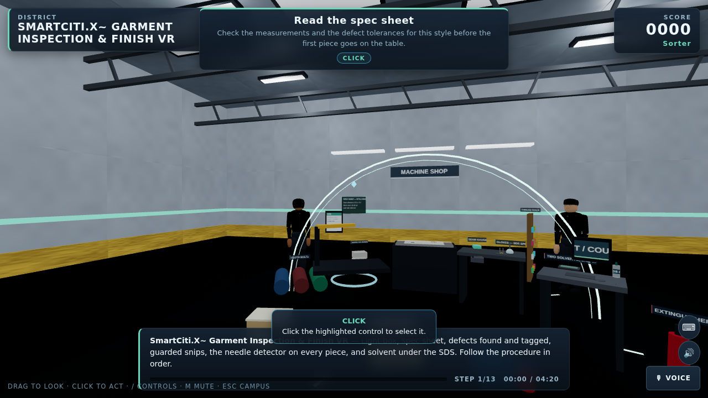 <b>Garment Inspection & Finish</b> — Light box, spec sheet, defects found and tagged, guarded snips, the needle detector on every piece, and solvent under the SDS</td></tr>
</table>

## Bridge and Structural Trades

**Union:** Ironworkers (IW), IUPAT bridge painters, IUOE operating engineers and LIUNA on the deck

**Certifications and standards:** OSHA 29 CFR 1926 Subparts M (fall protection), R (steel erection) and CC (cranes); 1926.62 lead in construction for bridge coatings; ANSI Z359; AWS D1.5 bridge welding; the owner's lane-closure and MUTCD traffic control plan

The bridge as a workplace: cable and hanger inspection at height, lead-paint containment on a truss, deck joint replacement under traffic control, and the erection work the structural programme already teaches.

| # | Station | Trade | Conditions | Steps | Interrupts | Eval | Why it is in the programme |
|---|---|---|---|---|---|---|---|
| 12 | [Steel Erector](../../WebXR/smartcity/index.html?sim=steel-erector) | Ironworker / structural steel connector | wind | 12 | 2 | 94 | The connecting the whole series builds on: the load landed and the bolts made up before anyone lets go. |
| 185 | [Bridge Cable Inspection](../../WebXR/smartcity/index.html?sim=bridge-cable-inspection) | Ironworker — bridge inspection, with the owner's inspector | wind | 13 | 2 | — | The inspection that finds what connecting never checks: two lanyards live on the traveller, the rope read by eye and by flux head, and the wire count carried against the rejection criterion. |
| 186 | [Bridge Lead Containment](../../WebXR/smartcity/index.html?sim=bridge-lead-containment) | Bridge painter — IUPAT | overcast | 14 | 2 | — | The coatings work the same bridge eventually needs: a truss bay contained and held negative over open water so the lead that comes off it never reaches the water below. |
| 187 | [Deck Joint Replacement](../../WebXR/smartcity/index.html?sim=deck-joint-replacement) | Ironworker with IUOE and LIUNA under a lane closure | clear | 13 | 2 | — | The maintenance that happens with traffic still running the other lane: the MUTCD closure set, the cut run wet, and the new joint torqued and levelled before the header goes around it. |

<table>
<tr><td width="50%"> <b>Steel Erector</b> — Structural steel connecting: fall protection, tag-line control and the bolt-up sequence</td><td width="50%"> <b>Bridge Cable Inspection</b> — A suspender rope walked from the traveller: two lanyards live, the brakes set, the wires counted against the rejection criterion, and the finding photographed before the report is signed</td></tr>
<tr><td width="50%">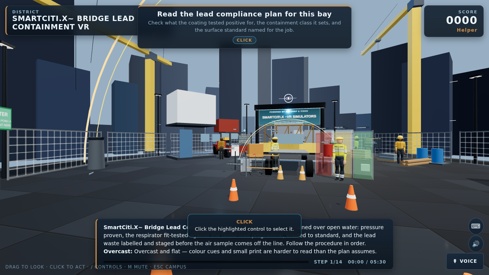 <b>Bridge Lead Containment</b> — A truss bay fully contained over open water: pressure proven, the respirator fit-tested against the blood-lead programme, blasted to standard, and the lead waste labelled and staged before the air sample comes off the line</td><td width="50%"> <b>Deck Joint Replacement</b> — An expansion joint replaced under a lane closure: the MUTCD taper and arrow board set, the cut run wet, the new joint torqued and levelled, and the header poured before the closure comes up in reverse</td></tr>
</table>

## Hotel Workers — Back of House

**Union:** UNITE HERE hotel housekeepers, laundry and banquet staff

**Certifications and standards:** Cal/OSHA's hotel housekeeping musculoskeletal injury prevention standard (8 CCR 3345), the workplace violence prevention plan (8 CCR 3342), 1910.1200 hazard communication for room and laundry chemicals, OSHA 1910.1030 bloodborne pathogens for sharps found in rooms, NFPA 96 where the laundry and kitchen share a plant

The hotel jobs that carry the injuries: turning a room with a housekeeping cart under the state's own hotel ergonomics rule and a panic button on the belt, the laundry plant's chemicals and folder, and a banquet changeover lifted right.

| # | Station | Trade | Conditions | Steps | Interrupts | Eval | Why it is in the programme |
|---|---|---|---|---|---|---|---|
| 113 | [Banquet Hot Hold](../../WebXR/smartcity/index.html?sim=banquet-hot-hold) | Banquet cook | indoor (kitchen) | 14 | 2 | 96 | The banquet floor the series shares with the kitchen: hot boxes, chafers and the room set that has to be right before the doors open. |
| 194 | [Housekeeping Room Turn](../../WebXR/smartcity/index.html?sim=housekeeping-room-turn) | Hotel housekeeper — UNITE HERE Local 2 | indoor (hotel) | 15 | 2 | — | The room itself, turned under the state's own hotel ergonomics rule: the cart staged outside, the belt panic device proven, and the bed walked around rather than reached across. |
| 195 | [Laundry Plant Chemicals](../../WebXR/smartcity/index.html?sim=laundry-plant-chemicals) | Hotel laundry attendant — UNITE HERE Local 2 | indoor (hotel) | 13 | 2 | — | The plant behind every room on the floor: dosing lines checked against the SDS, the washer loaded to the scale, and the ironer's guard proven before a hand ever gets near the rollers. |
| 196 | [Banquet Setup Lift](../../WebXR/smartcity/index.html?sim=banquet-setup-lift) | Banquet setup crew — UNITE HERE Local 2 | indoor (hotel) | 14 | 2 | — | The other end of the banquet floor from the hot line: tables lifted two-handed, chairs stacked to the limit, and the risers locked before the stage is loaded. |

<table>
<tr><td width="50%"> <b>Banquet Hot Hold</b> — Banquet hot line: hot boxes probed, chafers lit lid-open, the buffet walked, time tags honoured, and the pull-down done to the rule</td><td width="50%">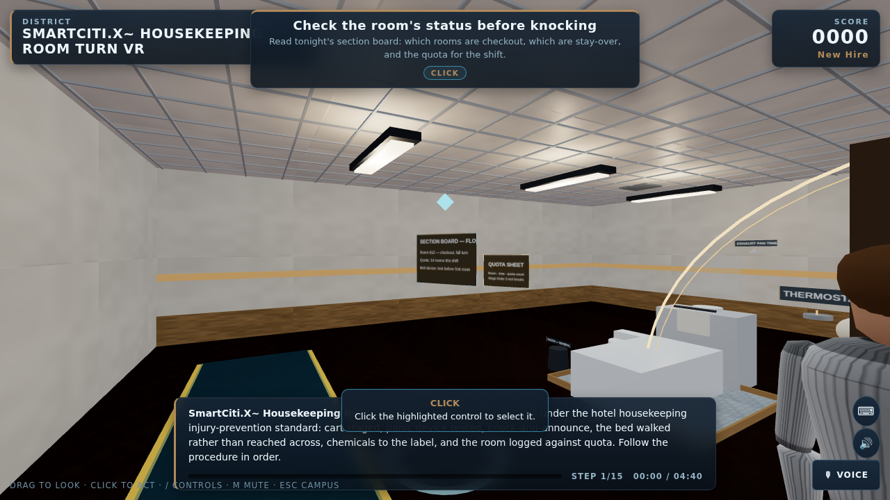 <b>Housekeeping Room Turn</b> — A guest room turned under the hotel housekeeping injury-prevention standard: cart staged, panic device tested, knock-and-announce, the bed walked rather than reached across, chemicals to the label, and the room logged against quota</td></tr>
<tr><td width="50%">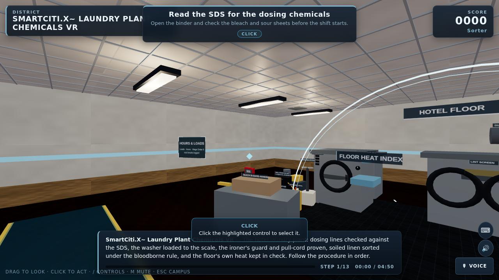 <b>Laundry Plant Chemicals</b> — The hotel laundry plant: dosing lines checked against the SDS, the washer loaded to the scale, the ironer's guard and pull-cord proven, soiled linen sorted under the bloodborne rule, and the floor's own heat kept in check</td><td width="50%">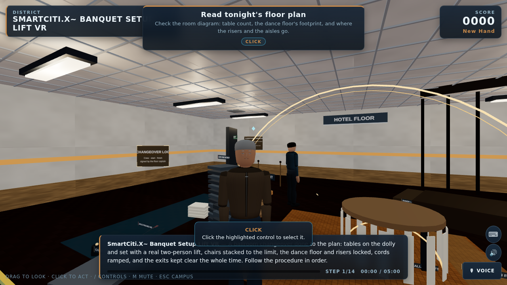 <b>Banquet Setup Lift</b> — A ballroom changeover done to the plan: tables on the dolly and set with a real two-person lift, chairs stacked to the limit, the dance floor and risers locked, cords ramped, and the exits kept clear the whole time</td></tr>
</table>

## Builders — Carpenters, Laborers and Masons

**Union:** UBC carpenters, LIUNA laborers, BAC bricklayers and IUOE operators

**Certifications and standards:** OSHA 29 CFR 1926 Subparts Q (concrete and formwork), L (scaffolds), CC (cranes) and 1926.1153 respirable crystalline silica; ANSI A10.9 concrete and masonry; the engineer's shoring and reshoring drawings

The building trades' own stations: formwork and shoring to the engineer's drawings, a mass-timber panel picked and set, and masonry on a scaffold under the silica rule — beside the concrete pour and scaffold erection the construction programme already teaches.

| # | Station | Trade | Conditions | Steps | Interrupts | Eval | Why it is in the programme |
|---|---|---|---|---|---|---|---|
| 48 | [Concrete Pour](../../WebXR/smartcity/index.html?sim=concrete-pour) | Cement mason / concrete finisher and laborer | overcast | 12 | 2 | 98 | The pour the formwork exists for, with the pump remote and the crane over the deck as the interruptions that make it real. |
| 191 | [Formwork Shoring](../../WebXR/smartcity/index.html?sim=formwork-shoring) | Carpenter — UBC | clear | 14 | 2 | — | The shoring that carries the pour above it — mudsills, plumbed and pinned post shores, and a sign-off the truck outside does not get to skip. |
| 192 | [Mass Timber Panel Set](../../WebXR/smartcity/index.html?sim=mass-timber-panel-set) | Carpenter — UBC, with the IUOE crane operator | wind | 14 | 2 | — | The carpenters' own crane pick, flown by the IUOE operator this programme already names, with the deck kept clear and the panel braced before the hook lets go. |
| 193 | [Masonry Silica Scaffold](../../WebXR/smartcity/index.html?sim=masonry-silica-scaffold) | Bricklayer — BAC, with the mason tender | clear | 14 | 2 | — | The bricklayers' station the programme's silica citation is for — a course laid off a scaffold that was actually checked, cut wet to Table 1. |

<table>
<tr><td width="50%">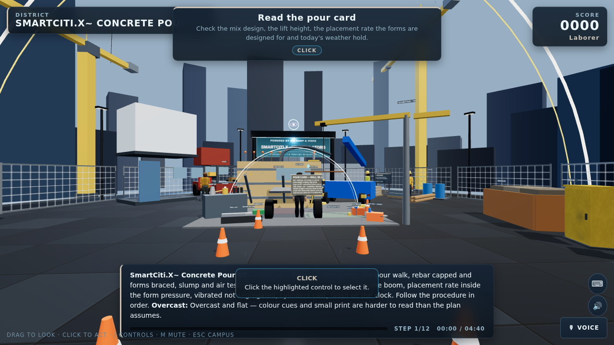 <b>Concrete Pour</b> — Wall pour from a boom pump: pre-pour walk, rebar capped and forms braced, slump and air tested before the first yard, nobody under the boom, placement rate inside the form pressure, vibrated not segregated, cylinders cast, finish on the clock</td><td width="50%">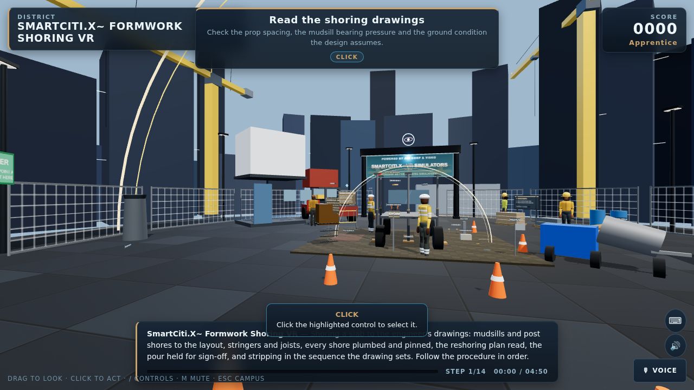 <b>Formwork Shoring</b> — Shoring a slab to the engineer's drawings: mudsills and post shores to the layout, stringers and joists, every shore plumbed and pinned, the reshoring plan read, the pour held for sign-off, and stripping in the sequence the drawing sets</td></tr>
<tr><td width="50%"> <b>Mass Timber Panel Set</b> — Setting a CLT panel: the pick plan and rigging inspected, tag lines on both ends, the panel flown and landed on its bearing, temporary bracing before the hook comes off, the connection schedule driven, and the deck kept clear under the load the whole time</td><td width="50%">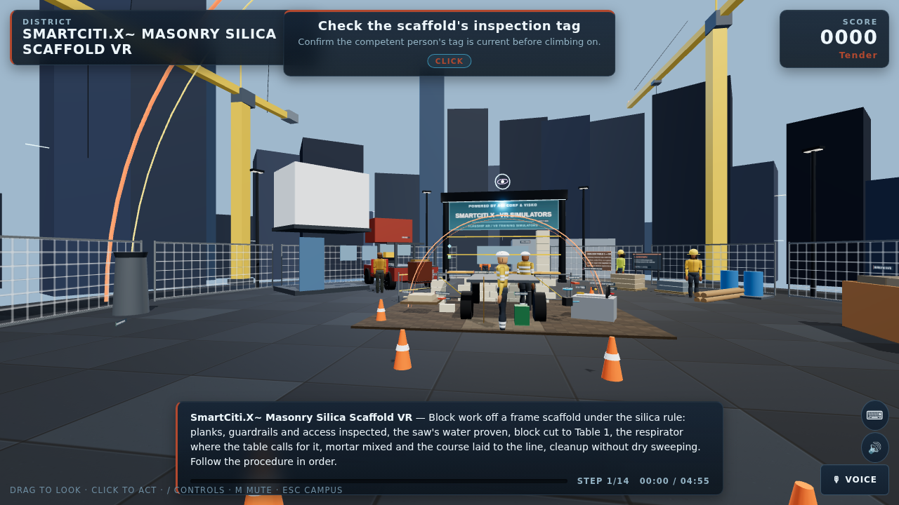 <b>Masonry Silica Scaffold</b> — Block work off a frame scaffold under the silica rule: planks, guardrails and access inspected, the saw's water proven, block cut to Table 1, the respirator where the table calls for it, mortar mixed and the course laid to the line, cleanup without dry sweeping</td></tr>
</table>

## First Responders — Fire, EMS, Police, Crisis and Relief

**Union:** IAFF firefighters and EMS, NAGE and AFSCME EMS locals, police officer associations and the FOP, NASW and SEIU 1021 social workers and crisis counsellors, AFSCME and LIUNA disaster-relief crews with the Red Cross volunteer workforce

**Certifications and standards:** NFPA 1500, 1584 and 1710 for fire and rehab, the NHTSA National EMS Scope of Practice, CIT International's crisis intervention model, the NASW Code of Ethics and SAMHSA's trauma-informed care principles, Psychological First Aid, NIMS/ICS through FEMA IS-100 and IS-700, and OSHA 29 CFR 1910.134, 1910.156 and 1910.1030

Fifteen stations for the people who run toward the call, with the human side scored as procedure: size-up and rehab on the fireground, cardiac arrest as a pit crew, an overdose reversed, a crisis call de-escalated, a critical incident debriefed, trauma-informed intake and a home visit, a shelter opened and a damage-assessment team sent out, and psychological first aid. Every station closes with the crew's own check-in and the peer-support line the department uses.

| # | Station | Trade | Conditions | Steps | Interrupts | Eval | Why it is in the programme |
|---|---|---|---|---|---|---|---|
| 08 | [Triage Point](../../WebXR/smartcity/index.html?sim=triage-point) | EMT / paramedic | overcast | 10 | 2 | 96 | The case every responder shares: a casualty tagged and re-tagged as they change, with the crowd and the structure moving around you. |
| 197 | [Structure Fire Size-Up](../../WebXR/smartcity/index.html?sim=structure-fire-sizeup) | Firefighter — IAFF | smoke | 14 | 2 | — | The first ten minutes of a residential fire: the 360, the report that puts a picture in every radio on the channel, the mode called out loud, and the accountability check that proves everyone who went in is still there. |
| 198 | [Firefighter Rehab Sector](../../WebXR/smartcity/index.html?sim=firefighter-rehab-sector) | Firefighter — IAFF | smoke | 14 | 2 | — | The sector behind the fire where the crew itself is the patient: vitals read against a real release criterion, and a member held back for re-evaluation no matter who is asking for him back on the line. |
| 199 | [Wildland-Urban Interface](../../WebXR/smartcity/index.html?sim=wildland-urban-interface) | Firefighter — IAFF | wind | 14 | 2 | — | A house prepped against embers on the wildland edge, with the trigger point that turns a hose lay into a pull-out call the instant the wind says so. |
| 200 | [Cardiac Arrest — Pit Crew](../../WebXR/smartcity/index.html?sim=cardiac-arrest-pit-crew) | Paramedic — IAFF EMS | indoor (hotel) | 14 | 2 | — | The call this whole series trains toward running as a team instead of a crowd: roles called on arrival, compressions that never really stop, and the swap caught before anybody has to be told the depth already went shallow. |
| 201 | [Overdose Response — Naloxone](../../WebXR/smartcity/index.html?sim=overdose-response-naloxone) | EMT — NAGE/AFSCME EMS local | indoor (service) | 14 | 2 | — | A reversal that is not over at the first dose: rescue breaths that buy the time naloxone needs, a second stop in breathing caught before it becomes the story, and a bystander's own dose thanked instead of overlooked. |
| 202 | [Ambulance Scene Safety](../../WebXR/smartcity/index.html?sim=ambulance-scene-safety) | EMT — NAGE/AFSCME EMS local | clear | 15 | 2 | — | The call that starts before anyone is even out of the cab: the truck itself as the block, the light pattern that warns without blinding, and an agitated occupant approached from the one side traffic cannot reach. |
| 203 | [Crisis Intervention Call](../../WebXR/smartcity/index.html?sim=crisis-intervention-call) | Police officer — crisis intervention team | overcast, Emergency Services | 15 | 2 | — | The call where the words are the tactic: the approach slowed, one speaker, the gap held, time given, and a stabilisation unit at the end of it instead of a cell. |
| 204 | [Critical Incident Debrief](../../WebXR/smartcity/index.html?sim=critical-incident-debrief) | Police officer — crisis intervention team | indoor (service) | 15 | 2 | — | What the shift costs, four hours later: the signs named, the confidentiality rule said out loud with its limits, and the duty question kept out of the room. |
| 205 | [Traffic Incident Management](../../WebXR/smartcity/index.html?sim=traffic-incident-management) | Police officer with fire and DOT under the traffic incident management plan | rain, Emergency Services | 15 | 2 | — | Three services under one plan on a wet shoulder: the block upstream, the taper to the posted speed, a driver in shock kept out of the live lane, and the lane given back. |
| 206 | [Trauma-Informed Intake](../../WebXR/smartcity/index.html?sim=trauma-informed-intake) | Social worker — NASW / SEIU 1021 | indoor (clinic) | 15 | 2 | — | A first intake where the room, the permission and the pace all belong to the client, and the reporting limits are said plainly before a disclosure makes them urgent. |
| 207 | [Crisis Line Shift](../../WebXR/smartcity/index.html?sim=crisis-line-shift) | Crisis counsellor | indoor (service) | 14 | 2 | — | One call worked all the way through: asked directly, reflected back, planned together, the dispatch decision said out loud to the caller, and taken to a supervisor afterwards. |
| 208 | [Home Visit Safety](../../WebXR/smartcity/index.html?sim=home-visit-safety) | Social worker — NASW / SEIU 1021 | overcast | 15 | 2 | — | The unaccompanied visit, where the address, the check-in times and the word for send help are agreed before the car moves and the exit is taken on the plan rather than on the atmosphere. |
| 209 | [Shelter Intake Operations](../../WebXR/smartcity/index.html?sim=shelter-intake-operations) | Disaster relief worker — AFSCME / LIUNA with the Red Cross volunteer workforce | indoor (service) | 14 | 2 | — | The shelter opening before anyone can rest in it: a resident registered with privacy and care, a family kept together, and a fire alarm test that has to be answered as real. |
| 210 | [Damage Assessment Team](../../WebXR/smartcity/index.html?sim=damage-assessment-team) | Disaster relief worker — AFSCME / LIUNA with the Red Cross volunteer workforce | overcast, Environmental Monitoring | 14 | 2 | — | The block swept from the street, buddied and clear of every downed line and gas smell, with a structure classified honestly and never entered to prove it. |
| 211 | [Psychological First Aid](../../WebXR/smartcity/index.html?sim=psychological-first-aid) | Disaster relief worker — AFSCME / LIUNA with the Red Cross volunteer workforce | indoor (service) | 13 | 2 | — | Look, listen, link at the family assistance centre: practical needs met first, a person's own words reflected, and a reporter turned away from a family that never agreed to be quoted. |

<table>
<tr><td width="50%">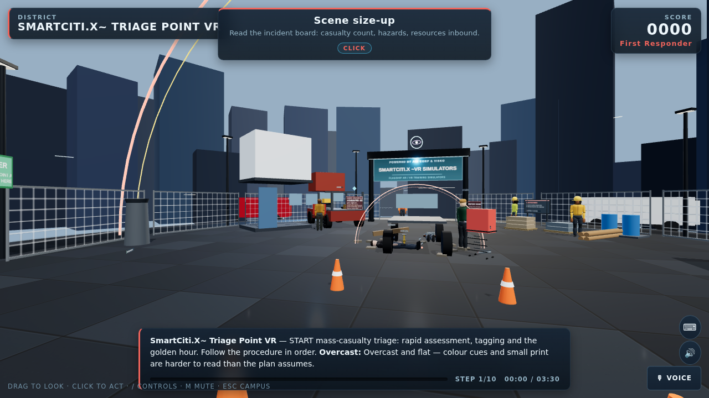 <b>Triage Point</b> — START mass-casualty triage: rapid assessment, tagging and the golden hour</td><td width="50%"> <b>Structure Fire Size-Up</b> — First-in engine at a two-storey residential fire: the 360, the on-scene report, water before entry, the mode called with the reason, two-in two-out, the initial line, and the ten-minute PAR</td></tr>
<tr><td width="50%">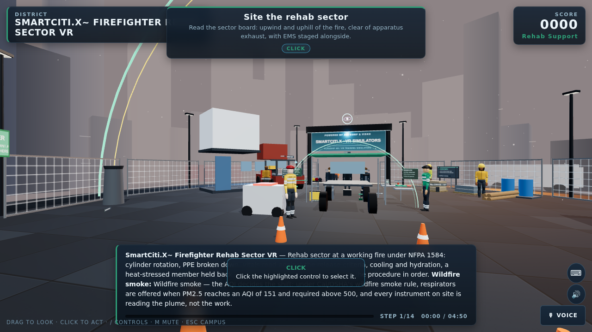 <b>Firefighter Rehab Sector</b> — Rehab sector at a working fire under NFPA 1584: cylinder rotation, PPE broken down, vitals read against the release criteria, cooling and hydration, a heat-stressed member held back, and the crew's own check-in</td><td width="50%">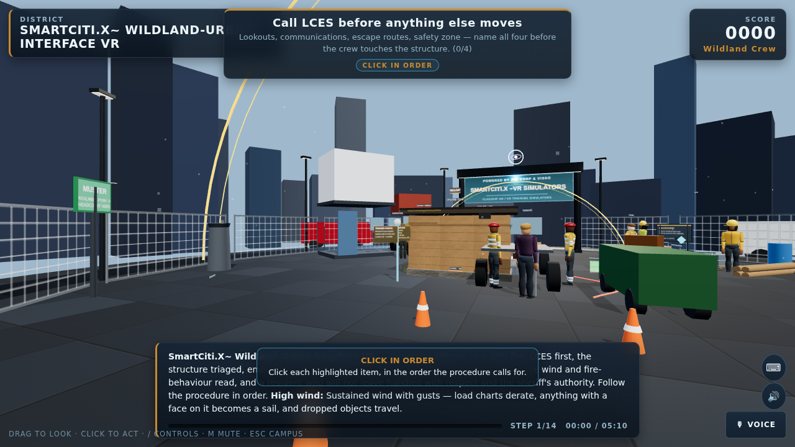 <b>Wildland-Urban Interface</b> — Structure defence at a WUI fire: LCES first, the structure triaged, ember-resistant prep, the trigger points and the pull-out call, a live wind and fire-behaviour read, and a resident who will not leave handled with respect and the sheriff's authority</td></tr>
<tr><td width="50%"> <b>Cardiac Arrest — Pit Crew</b> — High-performance pit-crew CPR: roles on arrival, compressions that never stop, the swap called on time, and the family met at the door</td><td width="50%">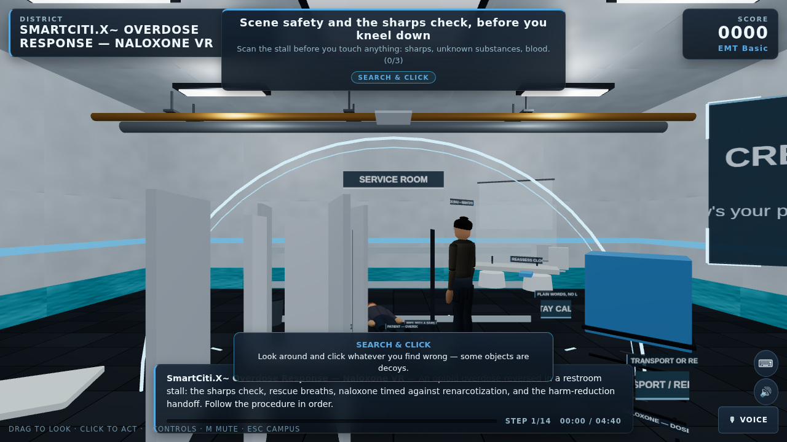 <b>Overdose Response — Naloxone</b> — An opioid overdose reversed in a restroom stall: the sharps check, rescue breaths, naloxone timed against renarcotization, and the harm-reduction handoff</td></tr>
<tr><td width="50%">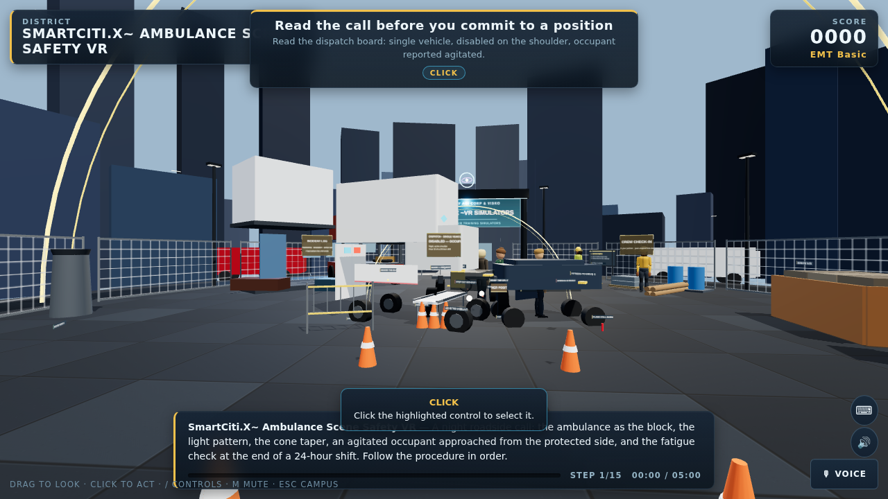 <b>Ambulance Scene Safety</b> — A night roadside call: the ambulance as the block, the light pattern, the cone taper, an agitated occupant approached from the protected side, and the fatigue check at the end of a 24-hour shift</td><td width="50%">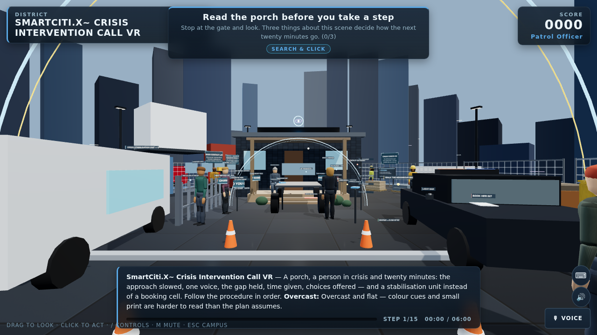 <b>Crisis Intervention Call</b> — A porch, a person in crisis and twenty minutes: the approach slowed, one voice, the gap held, time given, choices offered — and a stabilisation unit instead of a booking cell</td></tr>
<tr><td width="50%">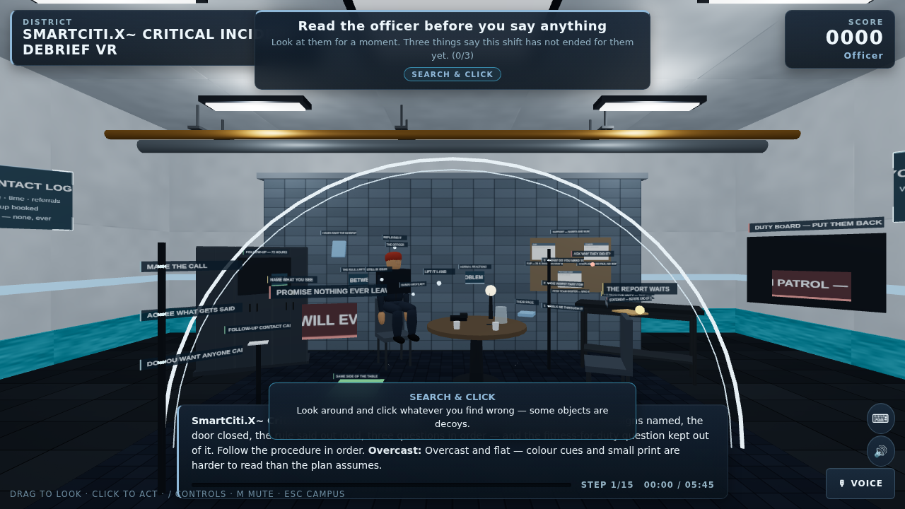 <b>Critical Incident Debrief</b> — The quiet room four hours after: the signs named, the door closed, the rule said out loud, three questions in order — and the fitness-for-duty question kept out of it</td><td width="50%">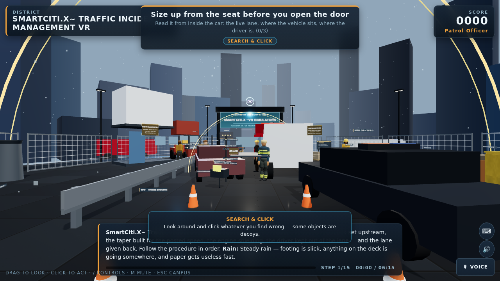 <b>Traffic Incident Management</b> — Wet shoulder, live lane: the block set upstream, the taper built for the posted speed, the engine shielding, the driver kept out of the lane — and the lane given back</td></tr>
<tr><td width="50%">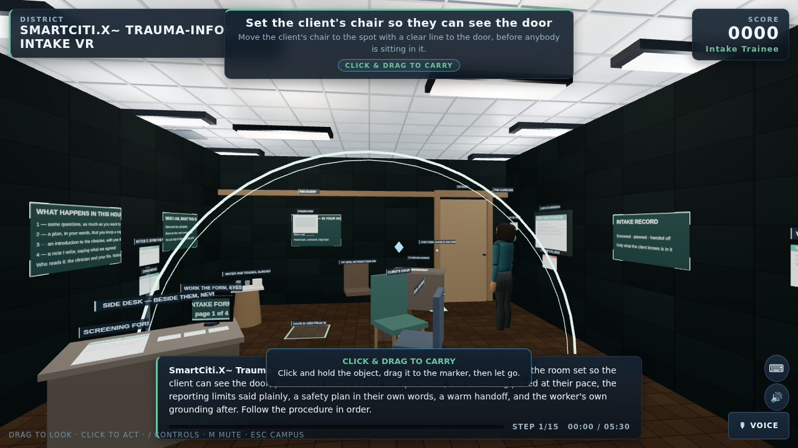 <b>Trauma-Informed Intake</b> — A first intake done as procedure: the room set so the client can see the door, permission asked before the questions, the screening paced at their pace, the reporting limits said plainly, a safety plan in their own words, a warm handoff, and the worker's own grounding after</td><td width="50%">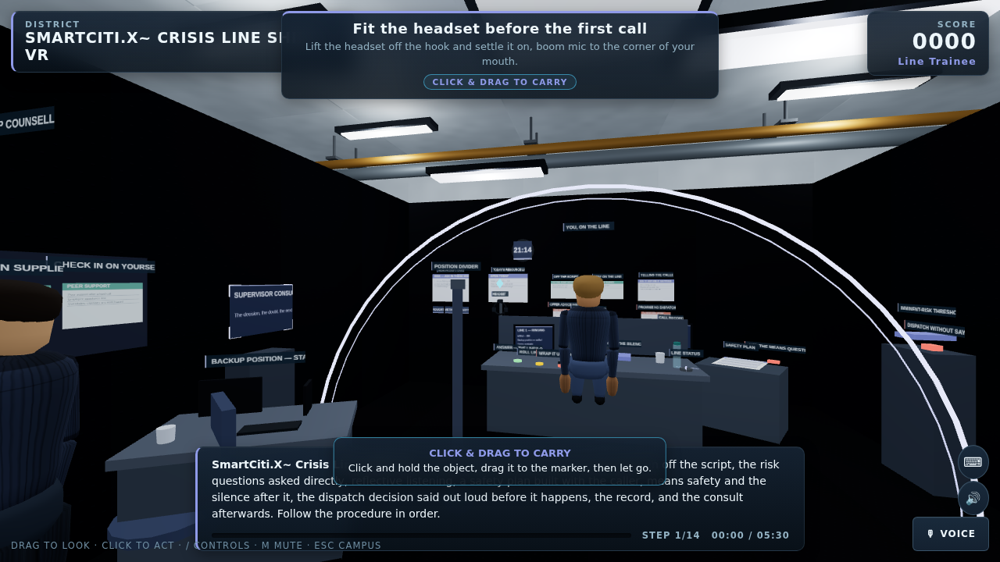 <b>Crisis Line Shift</b> — One call on a crisis line: the opening then off the script, the risk questions asked directly, reflective listening, a safety plan built with the caller, means safety and the silence after it, the dispatch decision said out loud before it happens, the record, and the consult afterwards</td></tr>
<tr><td width="50%">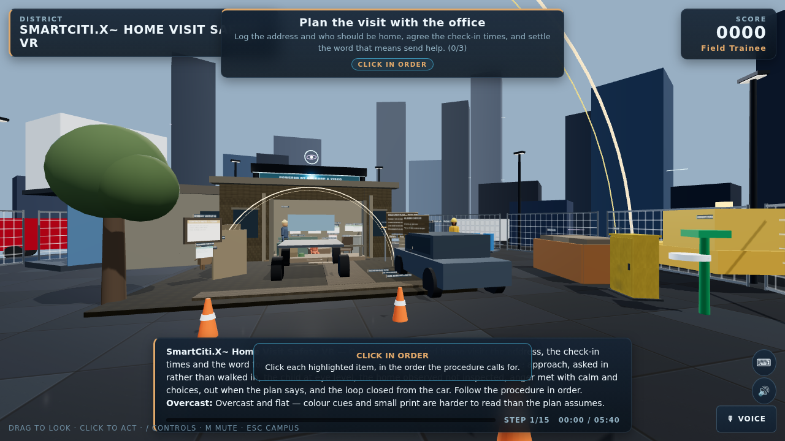 <b>Home Visit Safety</b> — One unaccompanied home visit: the address, the check-in times and the word for send help agreed first, the dog and the way out read on the approach, asked in rather than walked in, the child at eye level, the home observed not inspected, anger met with calm and choices, out when the plan says, and the loop closed from the car</td><td width="50%">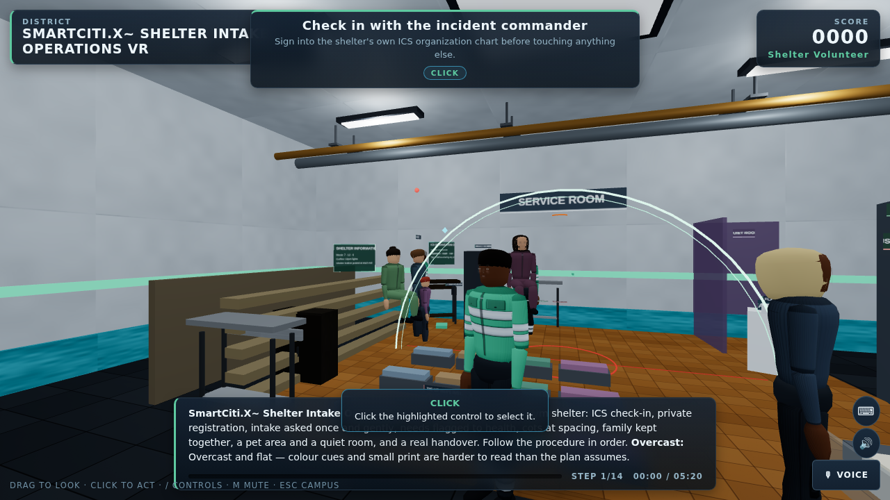 <b>Shelter Intake Operations</b> — Opening a school-gym shelter: ICS check-in, private registration, intake asked once and gently, needs flagged to health, cots at spacing, family kept together, a pet area and a quiet room, and a real handover</td></tr>
<tr><td width="50%">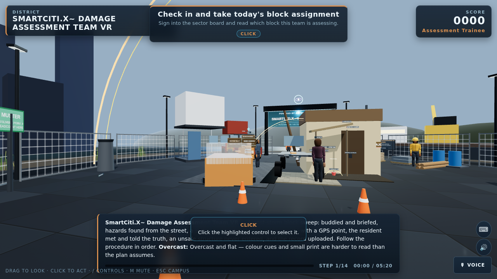 <b>Damage Assessment Team</b> — A post-storm block sweep: buddied and briefed, hazards found from the street, a structure classified and photographed with a GPS point, the resident met and told the truth, an unsafe structure never entered, and the record uploaded</td><td width="50%">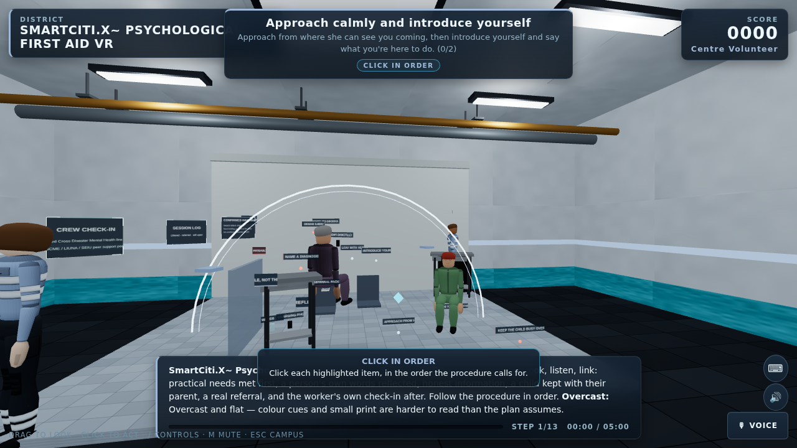 <b>Psychological First Aid</b> — A family assistance centre run on look, listen, link: practical needs met first, a person's own words reflected, honest information, a child kept with their parent, a real referral, and the worker's own check-in after</td></tr>
</table>

## Situational Awareness — Interruption Drill

**Union:** Cross-craft — run as a refresher block by IBEW, UA, LIUNA, Ironworkers and IAFF locals

**Certifications and standards:** OSHA 1926.20(b)(2) competent-person hazard recognition and the human-factors component every one of these standards assumes: NFPA 70E, 1910.146 permit spaces, 1926.651 excavations, 1926.1400 cranes, NFPA 25 impairment control

Twenty-two procedures that interrupt you while you work. Every station in this block is one you may already know the order of — the block is not testing the order. It is testing whether you notice the alarm, the person in the wrong place or the thing that moved while your hands and eyes were somewhere else. Miss one and it scores as an unsafe action, because that is what it is.

| # | Station | Trade | Conditions | Steps | Interrupts | Eval | Why it is in the programme |
|---|---|---|---|---|---|---|---|
| — | Trade Skills: electrical | — | — | — | — | 97 | Your lock comes off the hasp while your eyes are on the meter. The isolation was correct once, and nobody looked at it again. |
| — | Trade Skills: welding | — | — | — | — | 98 | Two: the extraction trips while you set the machine, and the blanket slips off the conduit run while you lay the bead. |
| 14 | [Trench Box](../../WebXR/smartcity/index.html?sim=trench-box) | Laborer / excavation and shoring | rain | 15 | 2 | 96 | Spoil creeping back toward the lip above an entrant, and the spotter walking off while you programme a machine path. |
| 13 | [Crane Yard](../../WebXR/smartcity/index.html?sim=crane-yard) | Mobile crane operator / rigger | wind | 15 | 2 | 93 | Somebody cutting through the swing radius to save walking round, and a pad settling out of level with the load in the air. |
| 38 | [Chlorine Room](../../WebXR/smartcity/index.html?sim=chlorine-room) | Water treatment plant operator | indoor (plant) | 12 | 2 | 97 | The room monitor alarming mid-changeout — real until proven otherwise — and an unprotected attendant in an open door during a leak test. |
| 45 | [Confined Rescue](../../WebXR/smartcity/index.html?sim=confined-rescue) | Technical rescue technician — confined space | overcast | 11 | 2 | 97 | The atmosphere falling while you rig, and the attendant leaving the hole to help on the rope during the haul. |
| 33 | [Substation Switching](../../WebXR/smartcity/index.html?sim=substation-switching) | Substation electrician / switching operator | overcast | 11 | 2 | 97 | An unescorted visitor inside the boundary, and control calling with a verbal change to a written switching order. |
| 46 | [Airport Ramp](../../WebXR/smartcity/index.html?sim=airport-ramp) | Airline ramp agent / ground handler | overcast | 11 | 2 | 99 | A vehicle inbound past an unset equipment line, and a chock a tug kicked clear before the bridge docks. |
| 35 | [Fire Pump](../../WebXR/smartcity/index.html?sim=fire-pump) | Fire sprinkler fitter / fire pump technician | indoor (plant) | 12 | 2 | 97 | Hot work opened in a building whose sprinklers are impaired for your test, and a gland that goes from a drip to a stream at rated flow. |
| 11 | [Tower Climb](../../WebXR/smartcity/index.html?sim=tower-climb) | Telecom / broadcast tower technician | wind | 12 | 2 | 98 | A tool you set down creeping toward the platform edge above your ground crew, and the crew themselves walking into the drop zone. |
| 16 | [Elevator Pit](../../WebXR/smartcity/index.html?sim=elevator-pit) | Elevator constructor / mechanic | indoor (service) | 13 | 2 | 96 | A hall call registering upstairs while you stand in the runby, and somebody working your lock off the hasp while you are on the car top. |
| 15 | [Boiler Room](../../WebXR/smartcity/index.html?sim=boiler-room) | Stationary engineer / steamfitter | indoor (plant) | 12 | 2 | 94 | A block valve passing after you proved the isolation, and the building calling for steam while you are inside the firebox. |
| 39 | [Forklift Dock](../../WebXR/smartcity/index.html?sim=forklift-dock) | Powered industrial truck operator — warehouse and dock | indoor (garage) | 12 | 2 | 91 | The trailer walking off the plate while you are in the box, and a picker stepping into the aisle on the side the load hides. |
| — | Trade Skills: phlebotomy | — | — | — | — | 91 | A patient going vasovagal while your eyes are on the tube rack, and a pre-labelled set offered to you as a time-saver. |
| 51 | [Transformer Vault](../../WebXR/smartcity/index.html?sim=transformer-vault) | Substation / underground distribution electrician | rain | 12 | 2 | 91 | SCADA attempting a reclose before your clearance tag is on the switch, and the vault taking water faster than it drains. |
| 52 | [Wind Nacelle](../../WebXR/smartcity/index.html?sim=wind-nacelle) | Wind turbine technician | wind | 13 | 2 | 91 | The wind freshening ninety metres up with the hoist hatch open, and the hatch guard knocked off its catch behind you. |
| 53 | [Digester Gas](../../WebXR/smartcity/index.html?sim=digester-gas) | Wastewater plant operator / pipefitter | fog | 14 | 2 | 91 | The dome rising because the digester did not stop making gas, and the wind putting your own purge vent over the pit you are reading. |
| 54 | [Data Hall](../../WebXR/smartcity/index.html?sim=data-hall) | Critical facilities electrician | indoor (datahall) | 12 | 2 | 94 | The panel schedule contradicting the busway label, and somebody moving your floor-void barrier to get a cart past. |
| 12 | [Steel Erector](../../WebXR/smartcity/index.html?sim=steel-erector) | Ironworker / structural steel connector | wind | 12 | 2 | 94 | A landed member still on the hook drifting over the bay you are standing in, and a deck opening uncovered behind you. |
| 08 | [Triage Point](../../WebXR/smartcity/index.html?sim=triage-point) | EMT / paramedic | overcast | 10 | 2 | 96 | A casualty you tagged green sitting down and going quiet, and the beam over the collapse starting to move. |
| 20 | [Dock Crane](../../WebXR/smartcity/index.html?sim=dock-crane) | Longshoreman / container-crane operator | wind | 14 | 2 | 97 | A lashing hand cutting through the red zone under a suspended box, and a gust front putting the load on the sail. |
| 24 | [Press Brake](../../WebXR/smartcity/index.html?sim=press-brake) | Sheet-metal press brake operator | indoor (shop) | 12 | 2 | 97 | The light curtain left on bypass from the previous shift, and a colleague reaching into the die space to help. |

<table>
<tr><td width="50%">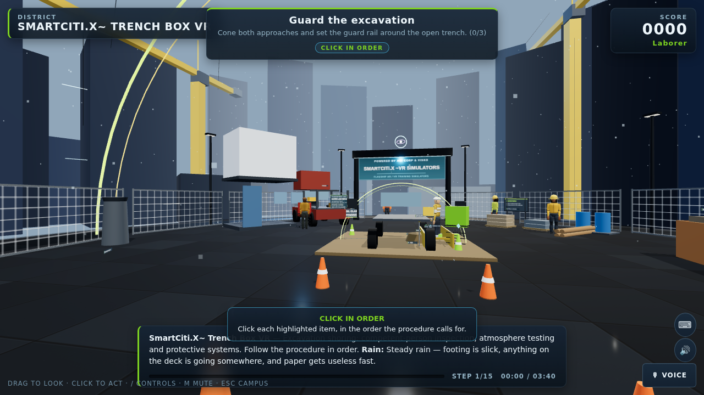 <b>Trench Box</b> — Excavation shoring: competent-person inspection, atmosphere testing and protective systems</td><td width="50%"> <b>Crane Yard</b> — Mobile crane pick: outrigger setup, load chart verification, anti-collision zone programming and a tag-line controlled lift</td></tr>
<tr><td width="50%"> <b>Chlorine Room</b> — 150-lb chlorine cylinder change: room monitor and SCBA before the door, empty isolated and capped, full one on the scale and chained, new gasket, yoke a quarter turn past snug, ammonia leak test, valve one turn, wrench on the stem</td><td width="50%"> <b>Confined Rescue</b> — Below-grade rescue: refuse the unprotected entry, isolate and ventilate, monitor top to bottom, tripod and mechanical advantage rigged, air-supplied entrant on a tended line, patient packaged, controlled haul, atmosphere log handed over</td></tr>
<tr><td width="50%"> <b>Substation Switching</b> — Feeder outage on a written switching order: read-back, breaker open, disconnects open, test dead, grounds on, tag, hand-off</td><td width="50%"> <b>Airport Ramp</b> — Gate turn: FOD walk and equipment restraint line, marshal onto the lead-in, chocks before anything touches it, cones set, ground power and headset to the flight deck, bridge to the door, loader at walking pace, all-clear only when chocks and cones are back</td></tr>
<tr><td width="50%"> <b>Fire Pump</b> — Annual pump flow test: alarm notification, controller to manual, test header to safe discharge, churn / 100% / 150% points, curve compared, system restored</td><td width="50%"> <b>Tower Climb</b> — Guyed tower climb: 100% tie-off, RF lockout and a controlled descent</td></tr>
<tr><td width="50%"> <b>Elevator Pit</b> — Pit and car-top entry: main line lockout, dual stop switches and governor inspection</td><td width="50%"> <b>Boiler Room</b> — Boiler lockout, confined-space firebox entry and a controlled re-light</td></tr>
<tr><td width="50%"> <b>Forklift Dock</b> — Dock load-out: pre-shift inspection, belt on, trailer chocked and dock-locked before the plate, load against the capacity plate, forks under and mast back, low and steady, ramp in reverse, rack height, and the trailer that crept</td><td width="50%">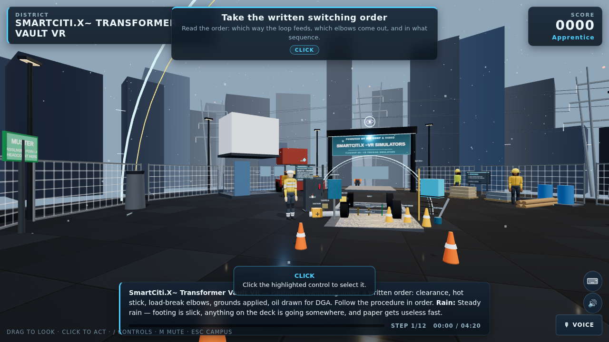 <b>Transformer Vault</b> — Padmount switching under a written order: clearance, hot stick, load-break elbows, grounds applied, oil drawn for DGA</td></tr>
<tr><td width="50%">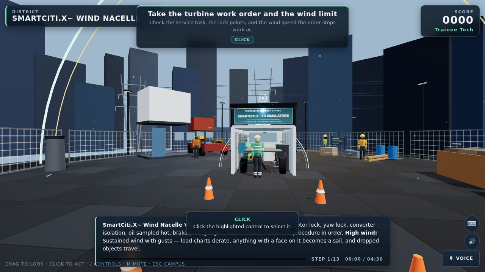 <b>Wind Nacelle</b> — Gearbox service ninety metres up: rotor lock, yaw lock, converter isolation, oil sampled hot, brake pads gauged, hatch closed</td><td width="50%">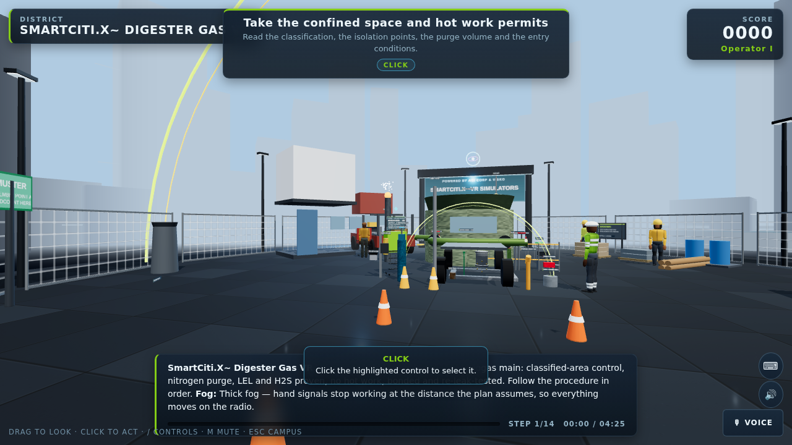 <b>Digester Gas</b> — Flame arrester change on a live biogas main: classified-area control, nitrogen purge, LEL and H2S proven, no hot work, bonded and re-leak-tested</td></tr>
<tr><td width="50%">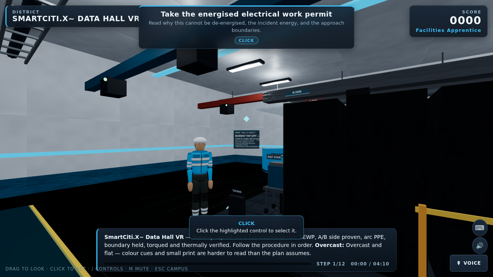 <b>Data Hall</b> — Busway tap-off on a live overhead run: EEWP, A/B side proven, arc PPE, boundary held, torqued and thermally verified</td><td width="50%"> <b>Steel Erector</b> — Structural steel connecting: fall protection, tag-line control and the bolt-up sequence</td></tr>
<tr><td width="50%"> <b>Triage Point</b> — START mass-casualty triage: rapid assessment, tagging and the golden hour</td><td width="50%"> <b>Dock Crane</b> — Container lift: lashing release order, twist-lock verification and wind-limit discipline</td></tr>
<tr><td width="50%">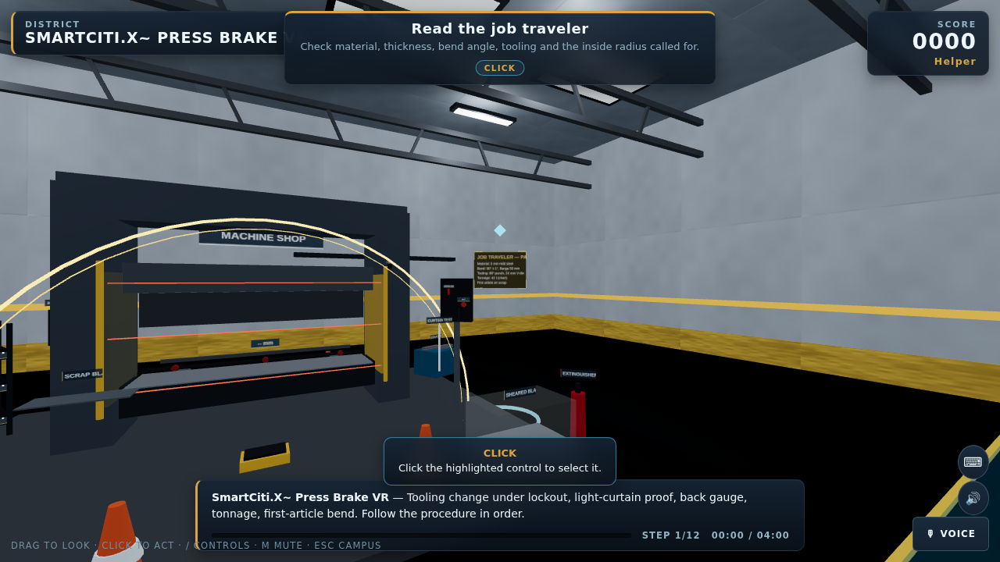 <b>Press Brake</b> — Tooling change under lockout, light-curtain proof, back gauge, tonnage, first-article bend</td></tr>
</table>

## Real-world environments

A station can stand inside a licensed real-world model instead of the generated district: a scanned street, a modelled terminal, a surveyed shoreline. The station declares `environment: { url, scale, position, rotationY }` or a reviewer previews any file with `?env=<url>` before it is committed; the loader hides the procedural skyline and district while the model is shown. Only CC0, CC-BY or marketplace-licensed models with an attribution line go under `WebXR/assets/env/` — game rips are not accepted. The hand-built sample street below is the placeholder every real model is judged against.

## How a station is verified

1. `node tools/check_all.mjs` — 30 checkers, among them: parse, imports, layout (every control reachable, crew figures clear of the work), budget (mesh count per headset frame), interruptions (each one fires, times out, scores and visibly changes the scene), crew roles, incident replay, curricula resolution, catalog freshness, devices, input, standards, console, competency and models.
2. `python3 tools/bundle_webxr.py` — the single-file bundle the headset loads.
3. A headless Chromium drive of every step, with both interruptions answered, and a screenshot from the spawn point that someone actually looks at.
4. `node tools/eval_content.mjs` — the graded content review, used as the heartbeat between waves of stations rather than as a gate.

