# SmartCiti.X training series

_Generated from `WebXR/smartcity/catalog.json` by `tools/gen_wiki.mjs` on 2026-09-22. 127 SmartCiti.X stations across 14 categories and 17 programmes; the Trade Skills rooms the programmes also draw on are listed in their own README._

Every station is a real union procedure sited generically, built on the shared engine's eight step kinds (select, sequence, find, gauge, hold, track, turn, drag), with four scored hazards and two interruptions that must be noticed and answered while the hands are busy. Stations are driven end to end in a headless browser and pass twenty-three checkers before they ship; the content evaluation in `tools/eval_content.mjs` grades each one on variety, decisions, explanation, grounding, feedback, scene and originality.

## Contents

- [Hunters Point Clean-up and Bay Restoration](#hunters-point-bay-restoration)
- [Ports, Maritime and Bay Ecology](#ports-maritime-ecology)
- [Air Quality — Monitoring and Control](#air-quality-monitoring)
- [Culinary — The Working Kitchen](#culinary-kitchen)
- [Dental Hygiene — Unspoken Smiles](#dental-hygiene-unspoken-smiles)
- [Bartending — Behind the Bar](#bartending-course)
- [Inside Wireman — First Period](#electrical-first-period)
- [Confined Space — Entry and Rescue](#confined-space)
- [Working at Height — Fall Protection](#fall-protection)
- [Hazmat and Environmental Response](#hazmat-environmental)
- [Rigging and Lifting](#rigging-lifting)
- [Stationary Engineer — Building Plant](#stationary-engineer)
- [Port and Terminal Operations](#port-operations)
- [Transit and Ramp Operations](#transit-ramp)
- [Energy Transition Systems](#energy-transition)
- [Live Events Production](#live-events)
- [Situational Awareness — Interruption Drill](#situational-awareness)

## Hunters Point Clean-up and Bay Restoration

The bay-restoration series stands every station on a generic shoreline beside a former shipyard under a federal cleanup order. It opens with a flat, sourced briefing on the Hunters Point Naval Shipyard Superfund site and then moves into the trades that do the work: radiological survey, soil load-out, sediment capping, pile removal, tide gates, living shorelines, eelgrass, oyster reef and marsh monitoring, invasive cordgrass removal.

**Union:** LIUNA Local 261 hazmat and environmental laborers, IUOE Local 3 operating engineers, Teamsters regulated-soil drivers, Pile Drivers Local 34 (Carpenters), UA Local 38 plumbers and pipefitters, and the Inlandboatmen's Union of the Pacific

**Certifications and standards:** OSHA 29 CFR 1910.120 HAZWOPER as the floor for everyone inside the fence; MARSSIM radiological survey practice and NRC 10 CFR 20 for the survey crew; EPA RCRA 40 CFR 262 manifests for the haul; U.S. Army Corps of Engineers Section 404, BCDC and Regional Water Board 401 permit conditions for every hour of in-water work

A Superfund shoreline and the bay beside it, worked in the order a cleanup actually runs: the record first, then survey, then excavation and haul, then the groundwater that stays behind, then the water's edge given back — sediment out, tide back in, marsh planted. The first station is a sourced briefing on the real site and the data-integrity case at the centre of it; every station after it is a union trade doing its part of the work, and the discipline that made the case is taught as procedure: an instrument source-checked before and after, a sample that is the place it came from, and a split for a lab that does not work for you.

| # | Station | Trade | Conditions | Steps | Interrupts | Eval | Why it is in the programme |
|---|---|---|---|---|---|---|---|
| 21 | [Hunters Point Briefing](../../WebXR/smartcity/index.html?sim=hunters-point) | Environmental monitoring technician | clear | 10 | 0 | 76 | The record: what the site is, who oversees it, what the contractor data case established, and where the neighbourhood's own air data comes from — before any simulated work. |
| 75 | [Rad Survey](../../WebXR/smartcity/index.html?sim=rad-survey) | Radiation control technician | fog | 15 | 2 | 93 | The gamma walkover done so its numbers can be trusted: source-check, background, grid speed, a static count over the investigation level, a split sample under chain of custody. |
| 97 | [Building Rad Scan](../../WebXR/smartcity/index.html?sim=building-rad-scan) | Radiation control technician — building structure-surface survey | indoor (plant) | 15 | 2 | 93 | The same discipline turned indoors, on a derelict building ahead of demolition: floor and walls scanned to the plan's coverage, drains scanned as collection points, and a swipe bagged under chain of custody before a roll-up door opens on ground that isn't released yet. |
| 22 | [Perimeter Air](../../WebXR/smartcity/index.html?sim=air-monitor) | Environmental monitoring technician | wind | 10 | 0 | 86 | Fence-line monitoring for the people on the other side of the fence: placement, calibration, and an exceedance response that happens now. |
| 76 | [Soil Loadout](../../WebXR/smartcity/index.html?sim=soil-loadout) | Excavation & haul-out crew — IUOE operator, LIUNA hazmat laborer directing, Teamsters driver | wind | 13 | 2 | 93 | Excavation and haul-out of what the survey found: zones set from the wind, the face wetted, a lined and manifested truck, and the dust alarm that stops the excavator. |
| 98 | [Haul Road Dust](../../WebXR/smartcity/index.html?sim=haul-road-dust) | Haul road dust control crew — Teamsters haul and water-truck drivers, LIUNA laborers, IUOE Local 3 | wind | 12 | 2 | 95 | What keeps that loaded truck from becoming its own dust source once it's rolling: perimeter monitors read against their action level, the road wetted on schedule, a tarped load washed clean at the gate, and the alarm that stops the haul the moment the wind turns. |
| 87 | [PCB Equipment Removal](../../WebXR/smartcity/index.html?sim=pcb-equipment-removal) | Electrician and rigger's helper — IBEW Local 6 electrician, LIUNA hazmat laborer, IUOE Local 3 hoist operator | indoor (plant) | 15 | 2 | 97 | A derelict switch room's own hazard, found and taken down as its own regulated shipment: the circuit proven dead and locked out before a wrench touches it, the transformer rigged and lined out on a pallet, and the manifest signed before it ever reaches the gate. |
| 88 | [Transite Pipe Removal](../../WebXR/smartcity/index.html?sim=transite-pipe-removal) | Asbestos abatement laborer and pipefitter — LIUNA asbestos laborer, UA Local 38 pipefitter, IUOE Local 3 excavation operator | wind | 12 | 2 | 97 | Asbestos-cement pipe out of the same ground as Class II work: wetted and kept wet, cut by hand rather than power tool, bagged where it comes out, and the sampling pump running the whole time. |
| 93 | [UST Removal](../../WebXR/smartcity/index.html?sim=ust-removal) | Excavation & UST closure crew — LIUNA hazmat laborer directing, IUOE Local 3 operating engineer, UA Local 38 pipefitter | overcast | 14 | 2 | 97 | What the survey and the pipe crew leave behind for the ground itself to answer for: a fuel tank pumped and proven inert on the LEL before the pit ever opens wide, rigged and lifted with nobody under the hook, and the pit sampled under chain of custody and fenced before the crew leaves. |
| 25 | [Decon Line](../../WebXR/smartcity/index.html?sim=decon-line) | Hazmat firefighter / decon technician | wind | 11 | 0 | 82 | The corridor everyone and everything leaves the exclusion zone through. |
| 23 | [Sampling Well](../../WebXR/smartcity/index.html?sim=sampling-well) | Environmental sampling technician | overcast | 11 | 0 | 84 | Low-flow groundwater sampling: the plume's own numbers, volatiles first, chain of custody on every bottle. |
| 84 | [Well Install](../../WebXR/smartcity/index.html?sim=well-install) | Environmental geologist — field lead | overcast | 15 | 2 | 96 | The well that sampling-well later draws from, put in by the book: cleared and cased before it is ever sampled, screened at the interval the geology calls for, and sealed so nothing but formation water ever reaches it. |
| 79 | [Pump and Treat](../../WebXR/smartcity/index.html?sim=pump-and-treat) | Pipefitter / groundwater pump-and-treat plant operator | overcast | 14 | 2 | 98 | The system that holds the plume for years after the excavators leave: carbon changed out as hazardous waste, the compliance port sampled, the permit log kept. |
| 83 | [Vapor Mitigation](../../WebXR/smartcity/index.html?sim=vapor-mitigation) | Sub-slab depressurisation system installer | indoor (service) | 15 | 2 | 96 | The plume's other path — up through the slab and into a building's air — cut off at the source: communication proven, the fan hung and vented clear of any intake, and the vacuum verified before anyone signs the placard. |
| 94 | [ISCO Injection](../../WebXR/smartcity/index.html?sim=isco-injection) | In-situ chemical oxidation crew — LIUNA hazmat laborers, UA Local 38 pipefitters, IUOE stationary engineers | overcast | 14 | 2 | 94 | Treating the plume pump-and-treat holds rather than only containing it: permanganate mixed to design, a manifold proven tight before it runs, and the injection held in band while the neighbouring wells are watched for oxidant finding its own way back to the surface. |
| 43 | [Stormwater Outfall](../../WebXR/smartcity/index.html?sim=stormwater-outfall) | Environmental sampling technician — stormwater | rain | 11 | 0 | 85 | The wet-weather grab at the outfall, on the permit clock, because the bay is where the site drains. |
| 86 | [Bioswale Build](../../WebXR/smartcity/index.html?sim=bioswale-build) | Laborer / stormwater bioswale construction crew | overcast, Environmental Monitoring | 13 | 2 | 98 | What keeps the next storm's runoff from undoing all of it: a bioswale built to the design grade rather than by eye, so the site's own water reaches the bay slower and cleaner than it arrived. |
| 78 | [Dredge Barge](../../WebXR/smartcity/index.html?sim=dredge-barge) | Dredge deck lead / marine construction crew | fog | 13 | 2 | 95 | Contaminated sediment out of the bay inside a turbidity curtain, with the scow never over its freeboard line and decant water tested before it goes anywhere. |
| 91 | [Oyster Reef Monitoring](../../WebXR/smartcity/index.html?sim=oyster-reef-monitoring) | Environmental monitoring technician / restoration monitoring crew | fog, Environmental Monitoring | 13 | 2 | 97 | The reef that shoreline built, checked on afterward: fixed quadrats found by tag and GPS, density logged before the frame moves, and the sonde read against the Water Board's own flag level before the flood takes the reef back. |
| 92 | [Marsh Transect Survey](../../WebXR/smartcity/index.html?sim=marsh-transect-survey) | Environmental monitoring technician / vegetation survey crew | overcast | 13 | 2 | 97 | The marsh behind the reef, walked on a fixed line: cover read to protocol class at every quadrat, the invasive hybrid flagged for the control crew, and the transect stopped cold the moment a listed bird flushes near it. |
| 81 | [Sediment Cap](../../WebXR/smartcity/index.html?sim=sediment-cap) | Cap placement deck lead / marine construction crew | overcast | 13 | 2 | 95 | The sediment that stays behind: an engineered cap placed in thin lifts to a design grid, proven by core rather than by eye, and stopped the moment turbidity or a short reading says so. |
| 85 | [Creosote Pile Removal](../../WebXR/smartcity/index.html?sim=creosote-pile-removal) | Pile removal deck lead / rigger — marine construction crew | overcast, Environmental Monitoring | 13 | 2 | 95 | The derelict structures still standing in the mud: a century-old creosote pile pulled whole inside a curtain of its own, drained over the barge rather than the bay, and any stub it leaves behind marked before the barge moves on. |
| 80 | [Tide Gate](../../WebXR/smartcity/index.html?sim=tide-gate) | Operating engineer / laborer — tidal wetland restoration crew | wind, Environmental Monitoring | 15 | 2 | 95 | The tide let back into a diked marsh: a self-regulating gate hung at low water, the cofferdam pulled in the order that keeps the levee. |
| 77 | [Living Shoreline](../../WebXR/smartcity/index.html?sim=living-shoreline) | Marine construction laborer / living shoreline crew | wind, Environmental Monitoring | 14 | 2 | 96 | The water's edge rebuilt as habitat — coir, oyster shell, cordgrass at the design elevation — inside the tide window and the fish window. |
| 100 | [Spartina Removal](../../WebXR/smartcity/index.html?sim=spartina-removal) | Invasive species control laborer — Spartina crew | wind, Environmental Monitoring | 14 | 2 | 97 | The planted marsh defended from the cordgrass that would take it over: the treatment map read instead of the eye, a buffer held around a nesting endangered rail no label rate excuses crossing, and the herbicide mixed off the marsh and applied under the wind limit. |
| 82 | [Eelgrass Transplant](../../WebXR/smartcity/index.html?sim=eelgrass-transplant) | Dive supervisor / commercial diving crew | clear, Environmental Monitoring | 11 | 2 | 98 | The habitat the fill once displaced, replanted underwater: a donor bed cut to its share, shoots bundled inside the clock, and a diver directed to the grid by a supervisor who never gets in the water. |

<table>
<tr><td width="50%">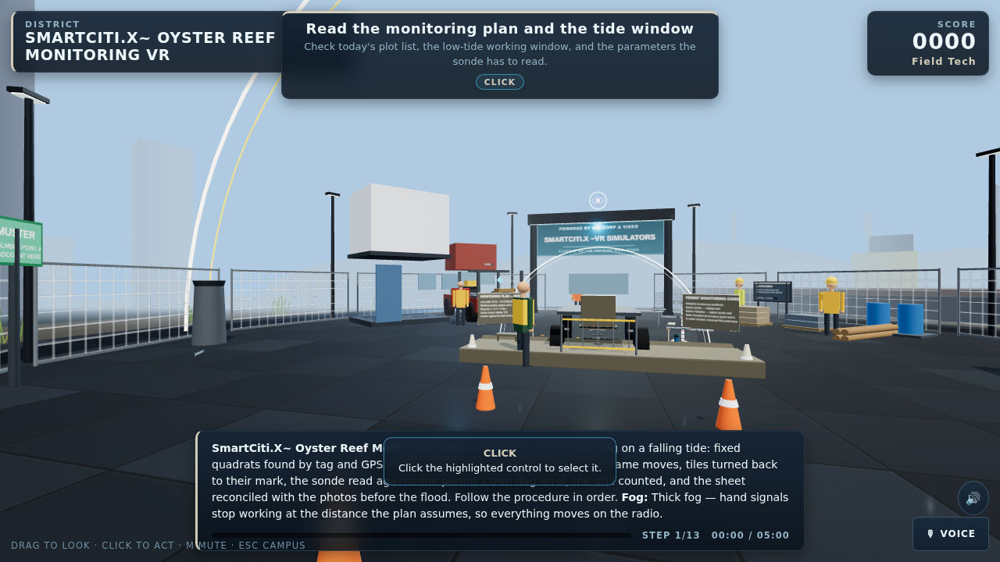 <b>Oyster Reef Monitoring</b> — Quarterly reef monitoring on a falling tide: fixed quadrats found by tag and GPS, density counted and logged before the frame moves, tiles turned back to their mark, the sonde read against the permit's own flag level, the drill counted, and the sheet reconciled with the photos before the flood</td><td width="50%">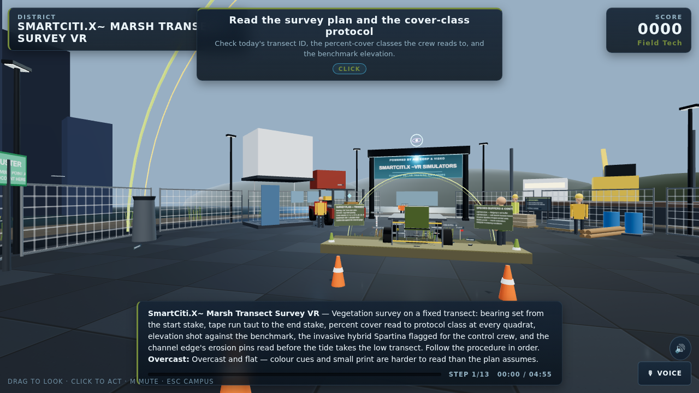 <b>Marsh Transect Survey</b> — Vegetation survey on a fixed transect: bearing set from the start stake, tape run taut to the end stake, percent cover read to protocol class at every quadrat, elevation shot against the benchmark, the invasive hybrid Spartina flagged for the control crew, and the channel edge's erosion pins read before the tide takes the low transect</td></tr>
<tr><td width="50%">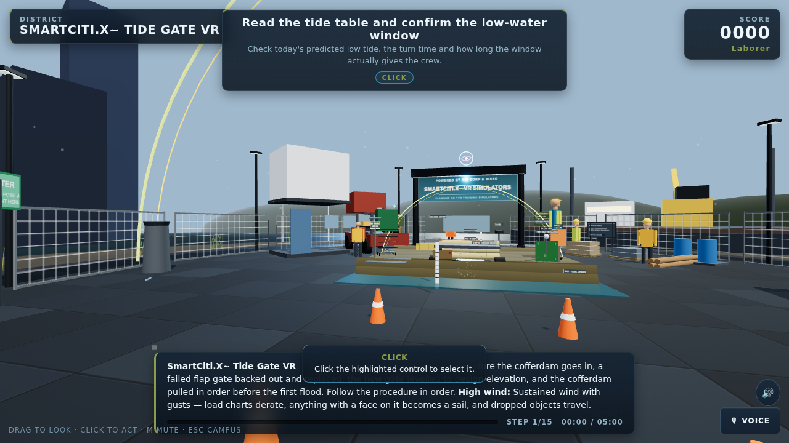 <b>Tide Gate</b> — Tide-window gate swap: levels read before the cofferdam goes in, a failed flap gate backed out and replaced, the new gate levelled to design elevation, and the cofferdam pulled in order before the first flood</td><td width="50%"> <b>Living Shoreline</b> — Building a living shoreline on a falling tide: curtain set and tensioned, coir and oyster shell to the stakes, cordgrass at grade, silt fence at the edge, and the reach walked before the flood takes anything back</td></tr>
<tr><td width="50%">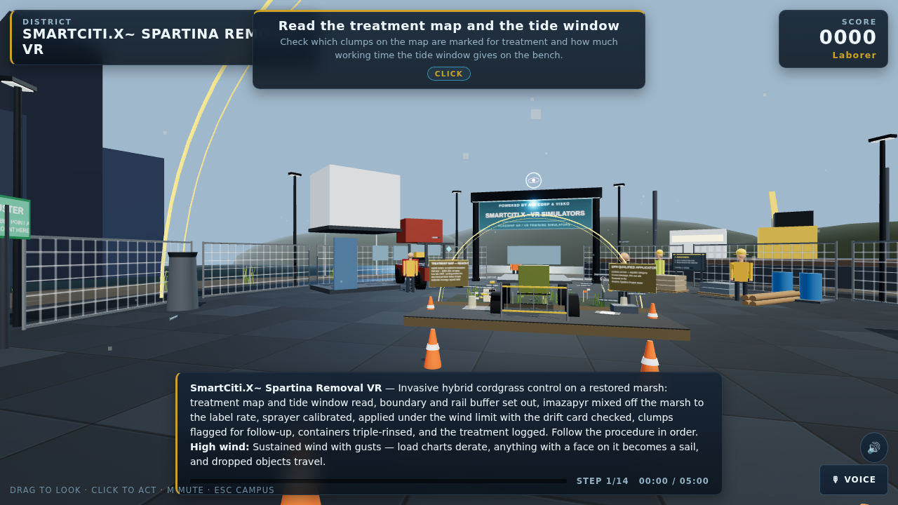 <b>Spartina Removal</b> — Invasive hybrid cordgrass control on a restored marsh: treatment map and tide window read, boundary and rail buffer set out, imazapyr mixed off the marsh to the label rate, sprayer calibrated, applied under the wind limit with the drift card checked, clumps flagged for follow-up, containers triple-rinsed, and the treatment logged</td><td width="50%">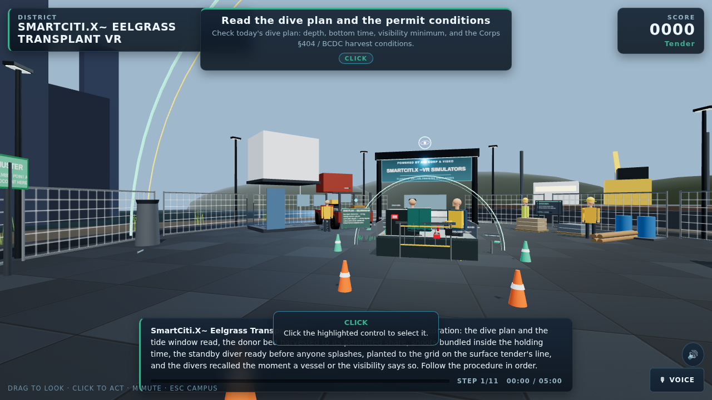 <b>Eelgrass Transplant</b> — Diver-assisted eelgrass restoration: the dive plan and the tide window read, the donor bed harvested to its permitted share, shoots bundled inside the holding time, the standby diver ready before anyone splashes, planted to the grid on the surface tender's line, and the divers recalled the moment a vessel or the visibility says so</td></tr>
</table>

## Ports, Maritime and Bay Ecology

A container terminal and the water it sits beside: cranes and lashing gangs, shore power for a berthed ship, a fuel transfer with the deck contained, a spill boom worked against the current, ballast water sampled before discharge, a pilot brought aboard and lines taken at the berth.

**Union:** ILWU, the Inlandboatmen's Union of the Pacific, IBEW port electricians, LIUNA and the environmental technicians who monitor the bay

**Certifications and standards:** OSHA 29 CFR 1918 marine terminal safety, the California Air Resources Board At-Berth Regulation, OSHA HAZWOPER 1910.120 and the U.S. Army Corps of Engineers' Section 404 permit conditions for work at the water's edge

A working port and the bay it sits on, worked by the trades that share the same quay: cargo secured and moved, a ship cold-ironed instead of idling, fuel and lines handled without a drop or a hand in the wrong place, and a spill contained before it ever reaches open water.

| # | Station | Trade | Conditions | Steps | Interrupts | Eval | Why it is in the programme |
|---|---|---|---|---|---|---|---|
| 20 | [Dock Crane](../../WebXR/smartcity/index.html?sim=dock-crane) | Longshoreman / container-crane operator | wind | 14 | 2 | 79 | The crane over all of it, with the wind limit and the lashing gang's positions as the hard constraints on every lift. |
| 27 | [Container Lashing](../../WebXR/smartcity/index.html?sim=container-lashing) | Longshore worker — lasher | wind | 11 | 2 | 93 | Deck stow: every twist-lock proven and the rods to the pattern the ship's own manual calls for, crane held off the bay until the gang is clear. |
| 89 | [Shore Power Hookup](../../WebXR/smartcity/index.html?sim=shore-power-hookup) | Port electrician — shore power (cold ironing) | overcast | 13 | 2 | 98 | Cold ironing a berthed ship: ground landed first, the breaker closed only on the port's order, and the auxiliaries shut down clean — the reason the At-Berth Regulation exists. |
| 41 | [Bunkering Watch](../../WebXR/smartcity/index.html?sim=bunkering-watch) | Marine engineer — person in charge of oil transfer | overcast | 12 | 2 | 90 | Fuel transfer as person in charge, with the deck contained before the hose comes aboard and the topping-off rate the whole spill risk comes down to. |
| 99 | [Ballast Water Sampling](../../WebXR/smartcity/index.html?sim=ballast-water-sampling) | Ship's engineer / port state control inspector — ballast water compliance | overcast | 13 | 2 | 97 | The inspection that happens before that same ship ever reaches a working berth: record book and treatment certificate checked, a sample drawn under chain of custody, and the discharge held until the number comes back. |
| 90 | [Spill Boom Deploy](../../WebXR/smartcity/index.html?sim=spill-boom-deploy) | Marine environmental responder — boom deployment | wind | 13 | 2 | 98 | The response when a transfer or a hookup goes wrong anyway: the source secured, a J-boom worked against the current, and the bay kept out of it. |
| 67 | [Pilot Transfer](../../WebXR/smartcity/index.html?sim=pilot-transfer) | Deck officer / able seafarer — pilot transfer party | wind | 15 | 2 | 94 | The harbour pilot brought aboard by ladder in open water, where the transfer itself is the highest-risk minute of the whole call. |
| 29 | [Mooring Line](../../WebXR/smartcity/index.html?sim=mooring-line) | Line handler / wharf mooring crew | wind | 10 | 2 | 95 | Taking the lines that hold the ship to all of this: snap-back zones and the bight nobody stands in. |

<table>
<tr><td width="50%">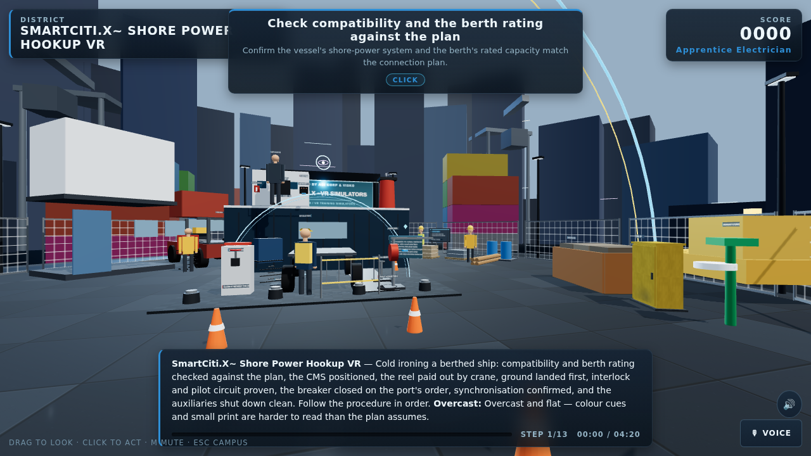 <b>Shore Power Hookup</b> — Cold ironing a berthed ship: compatibility and berth rating checked against the plan, the CMS positioned, the reel paid out by crane, ground landed first, interlock and pilot circuit proven, the breaker closed on the port's order, synchronisation confirmed, and the auxiliaries shut down clean</td><td width="50%">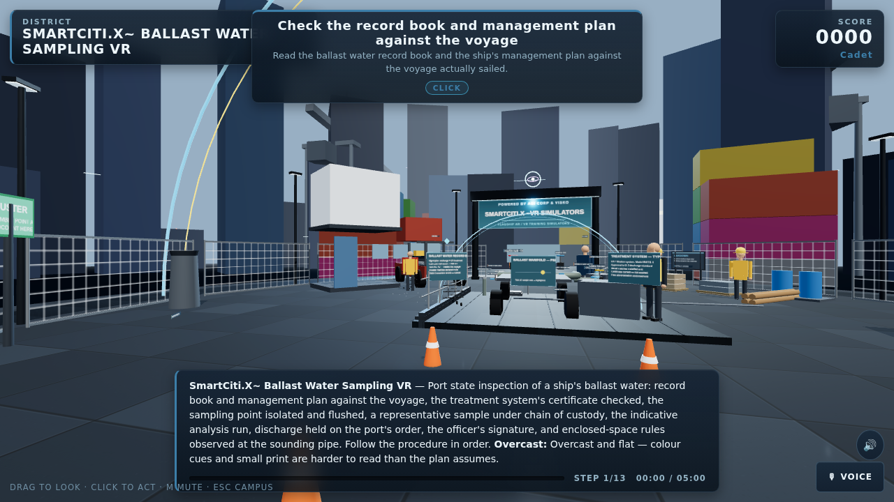 <b>Ballast Water Sampling</b> — Port state inspection of a ship's ballast water: record book and management plan against the voyage, the treatment system's certificate checked, the sampling point isolated and flushed, a representative sample under chain of custody, the indicative analysis run, discharge held on the port's order, the officer's signature, and enclosed-space rules observed at the sounding pipe</td></tr>
<tr><td width="50%">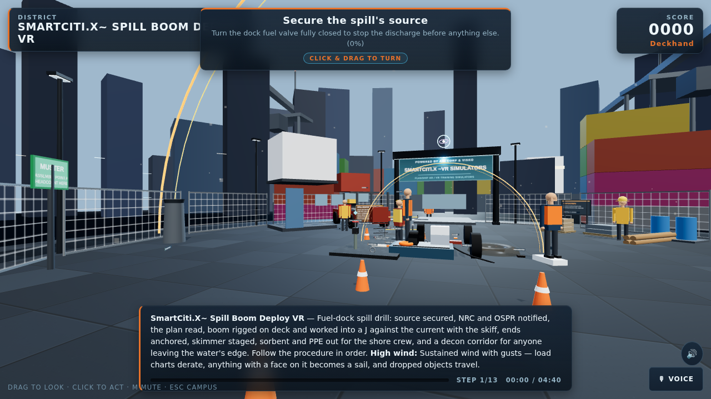 <b>Spill Boom Deploy</b> — Fuel-dock spill drill: source secured, NRC and OSPR notified, the plan read, boom rigged on deck and worked into a J against the current with the skiff, ends anchored, skimmer staged, sorbent and PPE out for the shore crew, and a decon corridor for anyone leaving the water's edge</td></tr>
</table>

## Air Quality — Monitoring and Control

Reading the air the crew works in: a site perimeter monitor, a mobile air lab run under wildfire smoke, a certified opacity reading, a stack test, landfill gas and dust control on the haul road.

**Union:** AFSCME air-district technicians, LIUNA environmental laborers, IUOE and USW plant crews

**Certifications and standards:** EPA Method 9 visible emissions (40 CFR 60 Appendix A), EPA 40 CFR Part 58 ambient air quality monitoring, the Bay Area Air Quality Management District's own regulations, and a site's Air Monitoring Plan under a cleanup order

The air a neighbourhood breathes is measured by a short chain of people and instruments, from a fence-line monitor to a stack test to a certified eye reading a plume, each one held to a different standard for a different reason. This block runs that chain end to end, from where the readings are taken to where the emissions actually come from.

| # | Station | Trade | Conditions | Steps | Interrupts | Eval | Why it is in the programme |
|---|---|---|---|---|---|---|---|
| 22 | [Perimeter Air](../../WebXR/smartcity/index.html?sim=air-monitor) | Environmental monitoring technician | wind | 10 | 0 | 86 | The fence line itself: monitors sited by the wind, proven at zero and flow, with an exceedance answered by the plan rather than muted. |
| 96 | [Mobile Air Lab](../../WebXR/smartcity/index.html?sim=mobile-air-lab) | Community air-monitoring van technician | smoke | 14 | 2 | 97 | The same discipline out of a van: sited fresh on the day's wind, every channel zeroed and spanned, and a reference sample running for the neighbourhood's own check. |
| 95 | [Opacity Reading](../../WebXR/smartcity/index.html?sim=opacity-reading) | Visible emissions observer / certified Method 9 reader | wind | 12 | 2 | 98 | What a certified eye adds to what the instruments read: a stack's plume by EPA Method 9, with the geometry proven before the six-minute clock starts. |
| 68 | [Stack Test](../../WebXR/smartcity/index.html?sim=stack-test) | Source emissions tester / stack testing technician | wind | 15 | 2 | 94 | The number that goes in the permit file: an isokinetic source test, bracketed by leak checks that both have to pass or the run does not count. |
| 62 | [Landfill Gas](../../WebXR/smartcity/index.html?sim=landfill-gas) | Landfill gas technician / wellfield operator | wind | 13 | 2 | 91 | Gas held underground instead of vented from a stack, tuned by what the well is actually giving up rather than by how far the valve is opened. |
| 76 | [Soil Loadout](../../WebXR/smartcity/index.html?sim=soil-loadout) | Excavation & haul-out crew — IUOE operator, LIUNA hazmat laborer directing, Teamsters driver | wind | 13 | 2 | 93 | Where the dust a monitor reads can start: an excavation zoned by the wind, wetted at the face, and stopped the moment its own alarm says so. |

<table>
<tr><td width="50%">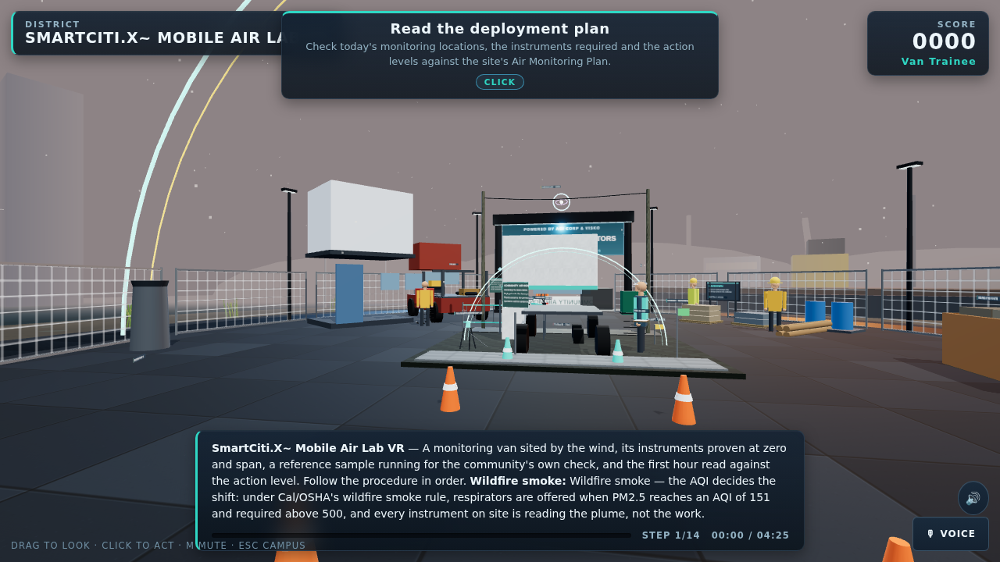 <b>Mobile Air Lab</b> — A monitoring van sited by the wind, its instruments proven at zero and span, a reference sample running for the community's own check, and the first hour read against the action level</td><td width="50%">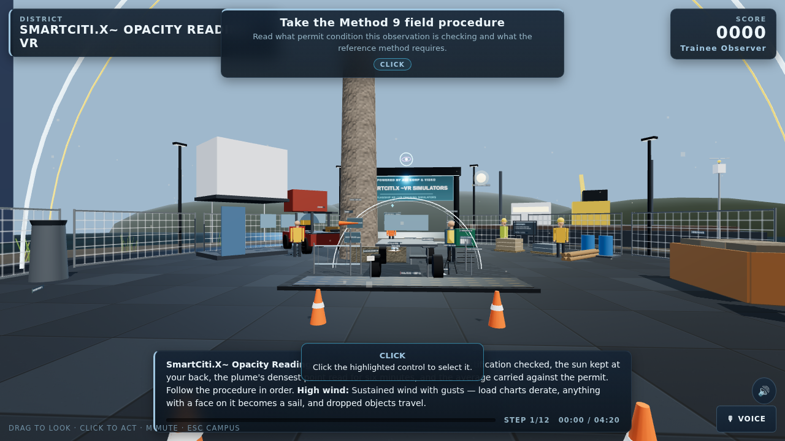 <b>Opacity Reading</b> — EPA Method 9 by the book: certification checked, the sun kept at your back, the plume's densest point read for six minutes, and the average carried against the permit</td></tr>
</table>

## Culinary — The Working Kitchen

Fifteen stations in a working commercial kitchen for UNITE HERE Local 2 kitchen workers: knives, the slicer and the floor mixer; the fryer, the hood suppression system and the gas line; the cold chain from receiving dock to walk-in to two-stage cooling; the dish pit, the grease interceptor and allergen control; banquet hot-holding, cafeteria service and the grill line.

**Union:** UNITE HERE Local 2 cooks, dishwashers and banquet staff; AFSCME and SEIU school and hospital food service

**Certifications and standards:** The FDA Food Code as adopted in the California Retail Food Code, the California Food Handler card and ServSafe manager certification, NFPA 96 for the hood and suppression system, Cal/OSHA's kitchen safety orders, and OSHA 1910.147 for every machine that gets cleaned

Fifteen stations in one kitchen, from the receiving dock to the dish pit. The hazards are the ones a cook actually meets — heat, blades, chemicals, cold, gas and the clock — and the standard behind every step is the one an inspector or a union steward would cite.

| # | Station | Trade | Conditions | Steps | Interrupts | Eval | Why it is in the programme |
|---|---|---|---|---|---|---|---|
| — | Trade Skills: kitchen | — | — | — | — | 98 | The bench case: the line as a first-period cook meets it, before any one hazard is taken apart on its own. |
| 101 | [Knife Skills](../../WebXR/smartcity/index.html?sim=knife-skills) | Prep cook | indoor (kitchen) | 13 | 2 | 96 | The board anchored, the edge honed, and the claw grip that keeps a prep cook's own knuckles between the blade and the cut — plus the mandoline nobody runs bare-handed. |
| 102 | [Slicer Lockout](../../WebXR/smartcity/index.html?sim=slicer-lockout) | Deli / prep cook | indoor (kitchen) | 14 | 2 | 96 | The deli slicer taken apart for a changeover the way a machine shop would: the cord locked out before the guard comes off, and the interlock proven before power goes back in. |
| 103 | [Bakery Mixer](../../WebXR/smartcity/index.html?sim=bakery-mixer) | Baker | indoor (kitchen) | 14 | 2 | 94 | The 60-quart floor mixer whose guard interlock gets proven, not assumed, before anything goes in the bowl — and whose scrape-down only ever happens on a machine that's actually stopped. |
| 104 | [Fryer Oil Change](../../WebXR/smartcity/index.html?sim=fryer-oil-change) | Line cook — UNITE HERE Local 2 | indoor (kitchen) | 14 | 2 | 95 | The vat only gets opened once it has actually cooled — cold and wheeled beats hot and carried, every single change. |
| 105 | [Hood Suppression](../../WebXR/smartcity/index.html?sim=hood-suppression) | Line cook / kitchen fire warden — UNITE HERE Local 2 | indoor (kitchen) | 12 | 2 | 97 | The system over the line only works if the filters, the links and the pull path are checked before the day a flare-up actually tests them. |
| 106 | [Kitchen Gas Shutoff](../../WebXR/smartcity/index.html?sim=kitchen-gas-shutoff) | Kitchen shift lead — UNITE HERE Local 2 | indoor (kitchen) | 13 | 2 | 97 | A gas smell is a procedure, not a guess — no spark searches for it, and the valve, not the nose, decides when the line is clear. |
| 107 | [Walk-In Cooler](../../WebXR/smartcity/index.html?sim=walk-in-cooler) | Line cook / kitchen worker — cold storage | indoor (kitchen) | 13 | 2 | 93 | Cold storage as its own procedure: the inside release proven before the door is trusted, 41 °F confirmed, and stock put away raw-below-ready in the order the Food Code sets. |
| 108 | [Receiving Dock Food](../../WebXR/smartcity/index.html?sim=receiving-dock-food) | Receiving clerk / kitchen worker — food deliveries | indoor (kitchen) | 14 | 2 | 93 | The delivery that stocks that cooler in the first place: every cold, frozen and hot item probed at the dock and refused outside the Food Code's own limits, before anything reaches a shelf. |
| 109 | [Prep Cooling](../../WebXR/smartcity/index.html?sim=prep-cooling) | Line cook — hot food cooling | indoor (kitchen) | 13 | 2 | 93 | The other half of the clock: a cooked batch brought down through 70 °F in two hours and 41 °F in six, with the reheat-or-discard call for the one that misses it. |
| 110 | [Dish Pit](../../WebXR/smartcity/index.html?sim=dish-pit) | UNITE HERE Local 2 dishwasher / kitchen steward | indoor (kitchen) | 13 | 2 | 93 | The dish machine and the three-compartment sink: chemical lines checked, the sanitiser strip-tested and logged, and an eyewash proven clear before the first jug is opened. |
| 111 | [Grease Trap](../../WebXR/smartcity/index.html?sim=grease-trap) | UNITE HERE Local 2 kitchen steward / facilities laborer | indoor (kitchen) | 14 | 2 | 90 | Servicing the under-sink grease interceptor: the confined-space question answered correctly, the 25 percent rule read off the stick, and the waste sealed for the hauler rather than sent down a drain. |
| 112 | [Allergen Control](../../WebXR/smartcity/index.html?sim=allergen-control) | UNITE HERE Local 2 line cook | indoor (kitchen) | 12 | 2 | 86 | An allergen order on the line: the ticket called back, the purple board and dedicated pan pulled, and the plate walked to the pass by the cook who built it. |
| 113 | [Banquet Hot Hold](../../WebXR/smartcity/index.html?sim=banquet-hot-hold) | Banquet cook | indoor (kitchen) | 14 | 2 | 96 | The banquet line: hot boxes probed before they're loaded, chafers lit lid-open, the buffet walked before doors, and a pull-down cooled or discarded to the rule. |
| 114 | [Cafeteria Serving](../../WebXR/smartcity/index.html?sim=cafeteria-serving) | School nutrition service worker | indoor (kitchen) | 13 | 2 | 98 | The school lunch line under the National School Lunch Program: the meal pattern's five components, offer versus serve, the wells probed and the count reconciled for the reimbursement claim. |
| 115 | [Grill Line Burns](../../WebXR/smartcity/index.html?sim=grill-line-burns) | Line cook — grill / sauté | indoor (kitchen) | 13 | 2 | 96 | The grill and sauté station's own hazard, worked as a drill: handles in, a dry pan, a flambé cleared of the filters, and cool water run the full twenty minutes. |

<table>
<tr><td width="50%">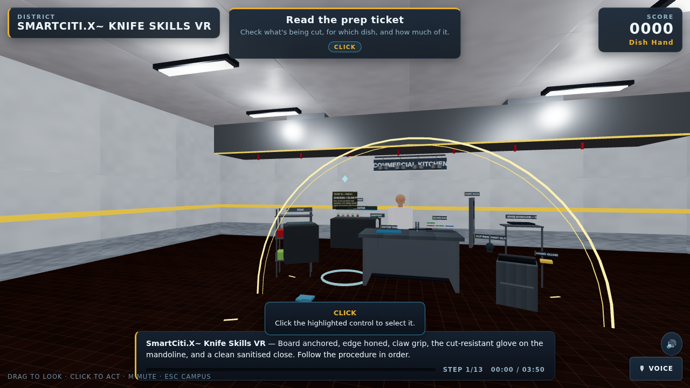 <b>Knife Skills</b> — Board anchored, edge honed, claw grip, the cut-resistant glove on the mandoline, and a clean sanitised close</td><td width="50%">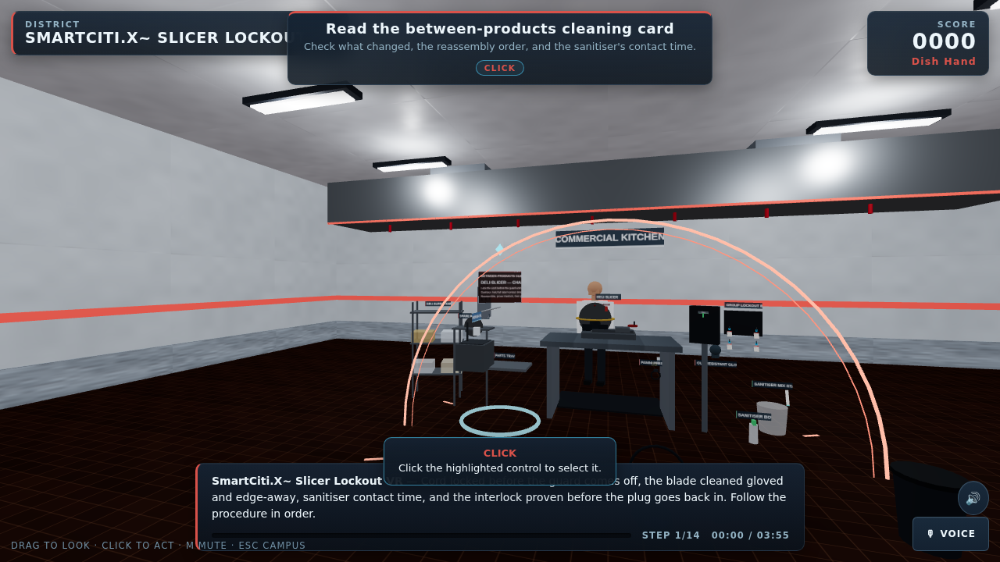 <b>Slicer Lockout</b> — Cord locked before the guard comes off, the blade cleaned gloved and edge-away, sanitiser contact time, and the interlock proven before the plug goes back in</td></tr>
<tr><td width="50%">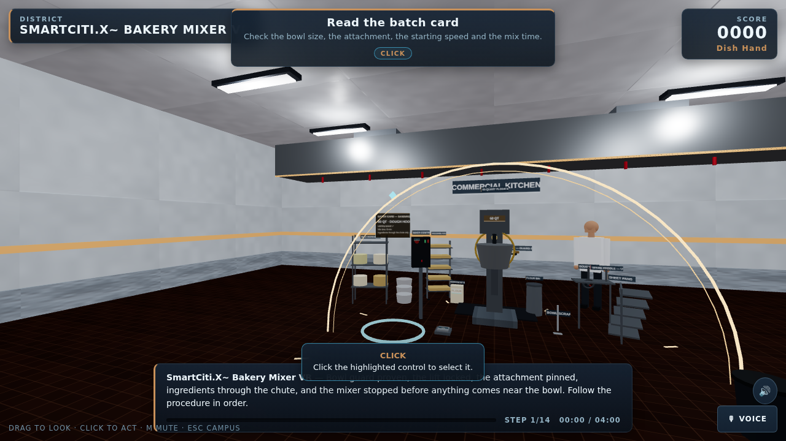 <b>Bakery Mixer</b> — Bowl guard proven, the lift locked, the attachment pinned, ingredients through the chute, and the mixer stopped before anything comes near the bowl</td><td width="50%">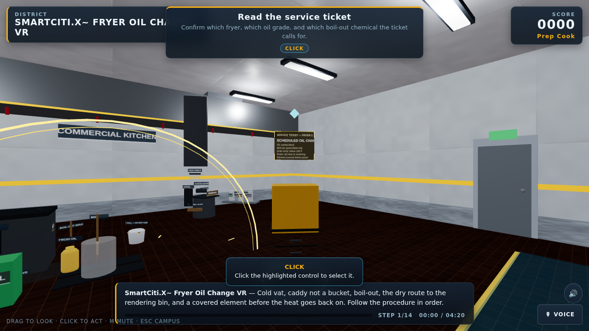 <b>Fryer Oil Change</b> — Cold vat, caddy not a bucket, boil-out, the dry route to the rendering bin, and a covered element before the heat goes back on</td></tr>
<tr><td width="50%">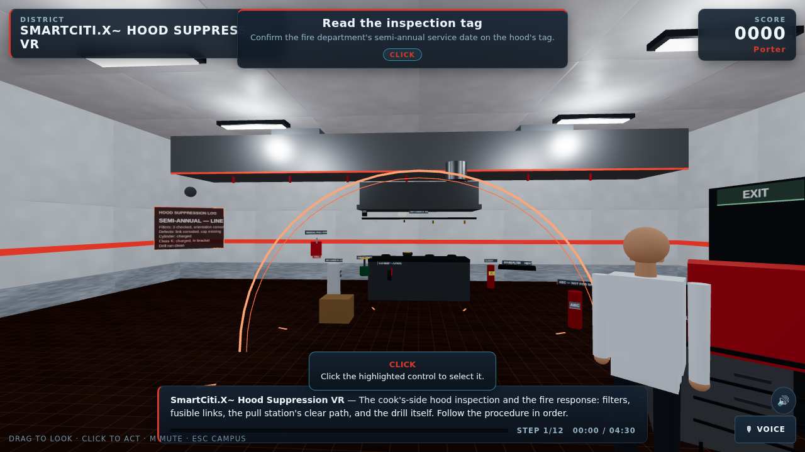 <b>Hood Suppression</b> — The cook's-side hood inspection and the fire response: filters, fusible links, the pull station's clear path, and the drill itself</td><td width="50%">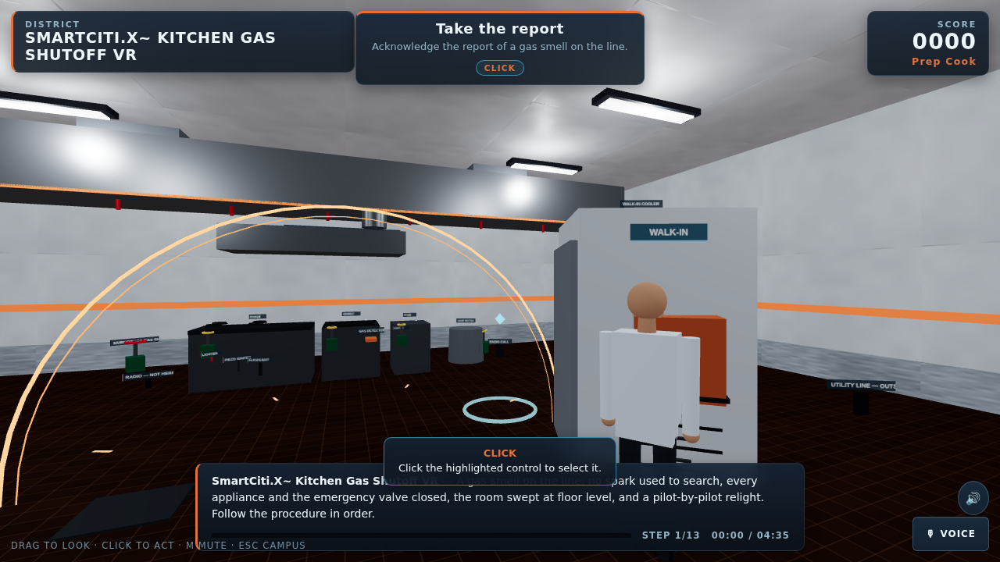 <b>Kitchen Gas Shutoff</b> — A gas smell on the line: no spark used to search, every appliance and the emergency valve closed, the room swept at floor level, and a pilot-by-pilot relight</td></tr>
<tr><td width="50%">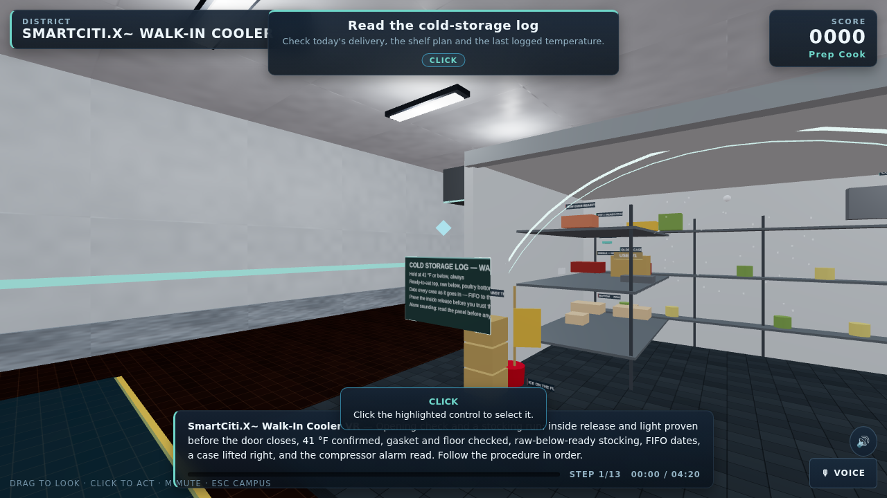 <b>Walk-In Cooler</b> — Opening check and a stocking run: inside release and light proven before the door closes, 41 °F confirmed, gasket and floor checked, raw-below-ready stocking, FIFO dates, a case lifted right, and the compressor alarm read</td><td width="50%">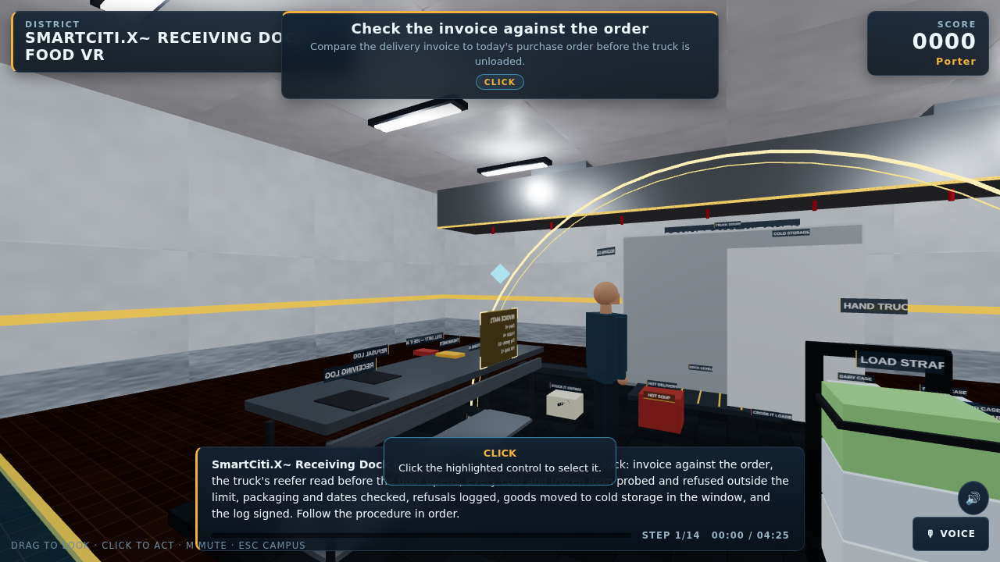 <b>Receiving Dock Food</b> — A delivery at the kitchen dock: invoice against the order, the truck's reefer read before the door opens, every cold and frozen item probed and refused outside the limit, packaging and dates checked, refusals logged, goods moved to cold storage in the window, and the log signed</td></tr>
<tr><td width="50%">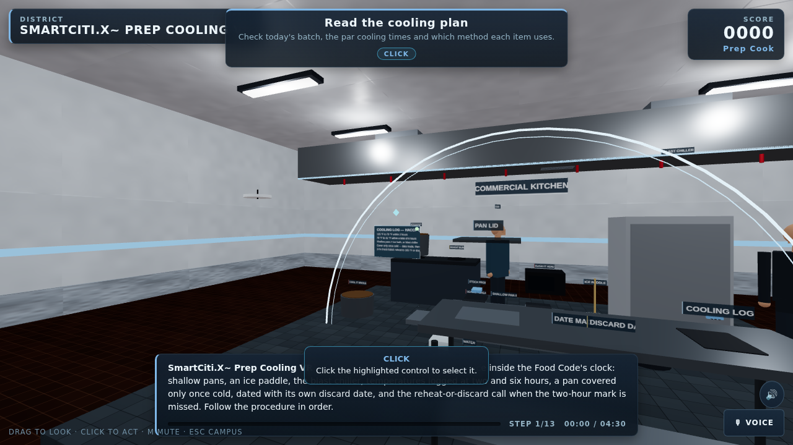 <b>Prep Cooling</b> — Cooling stock and a hotel pan of rice inside the Food Code's clock: shallow pans, an ice paddle, the blast chiller, temperatures logged at two and six hours, a pan covered only once cold, dated with its own discard date, and the reheat-or-discard call when the two-hour mark is missed</td><td width="50%">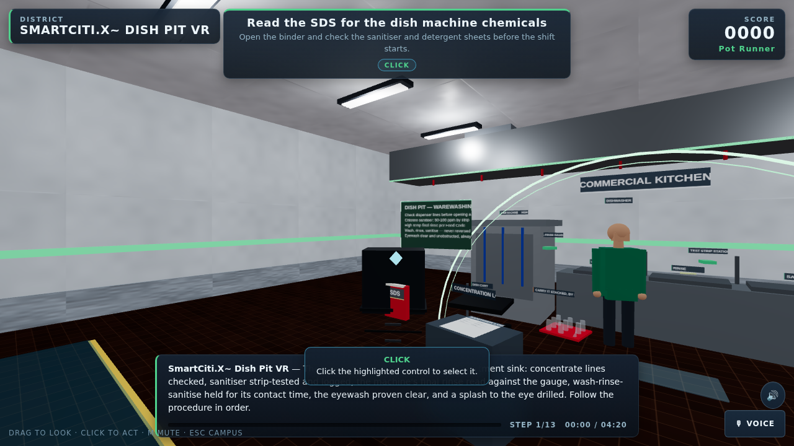 <b>Dish Pit</b> — The dish machine and the three-compartment sink: concentrate lines checked, sanitiser strip-tested and logged, the machine's final rinse read against the gauge, wash-rinse-sanitise held for its contact time, the eyewash proven clear, and a splash to the eye drilled</td></tr>
<tr><td width="50%">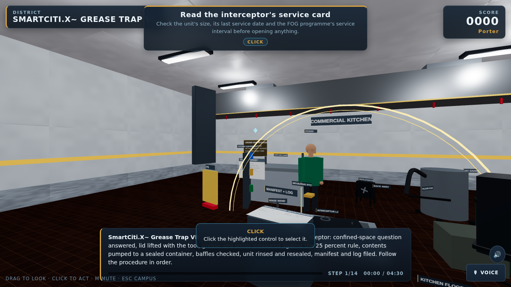 <b>Grease Trap</b> — Servicing the under-sink grease interceptor: confined-space question answered, lid lifted with the tool, grease and solids measured against the 25 percent rule, contents pumped to a sealed container, baffles checked, unit rinsed and resealed, manifest and log filed</td><td width="50%">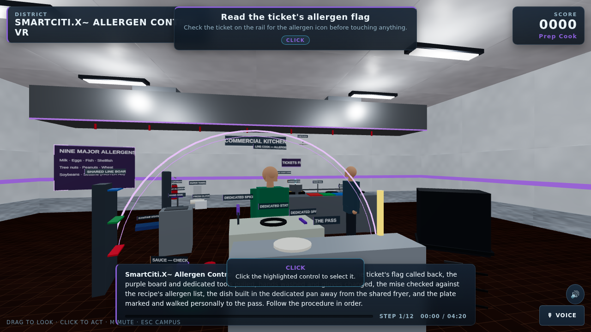 <b>Allergen Control</b> — An allergen order on the line: the ticket's flag called back, the purple board and dedicated tools pulled, hands washed and gloves changed, the mise checked against the recipe's allergen list, the dish built in the dedicated pan away from the shared fryer, and the plate marked and walked personally to the pass</td></tr>
<tr><td width="50%">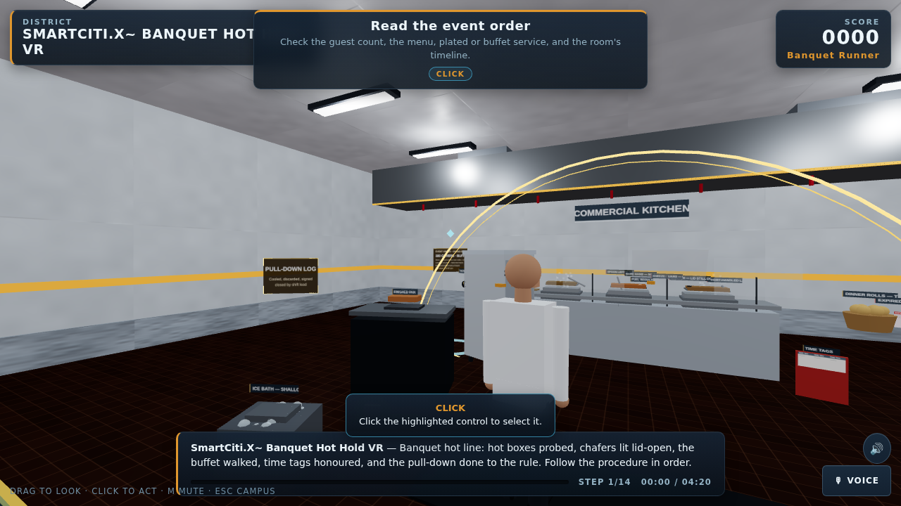 <b>Banquet Hot Hold</b> — Banquet hot line: hot boxes probed, chafers lit lid-open, the buffet walked, time tags honoured, and the pull-down done to the rule</td><td width="50%">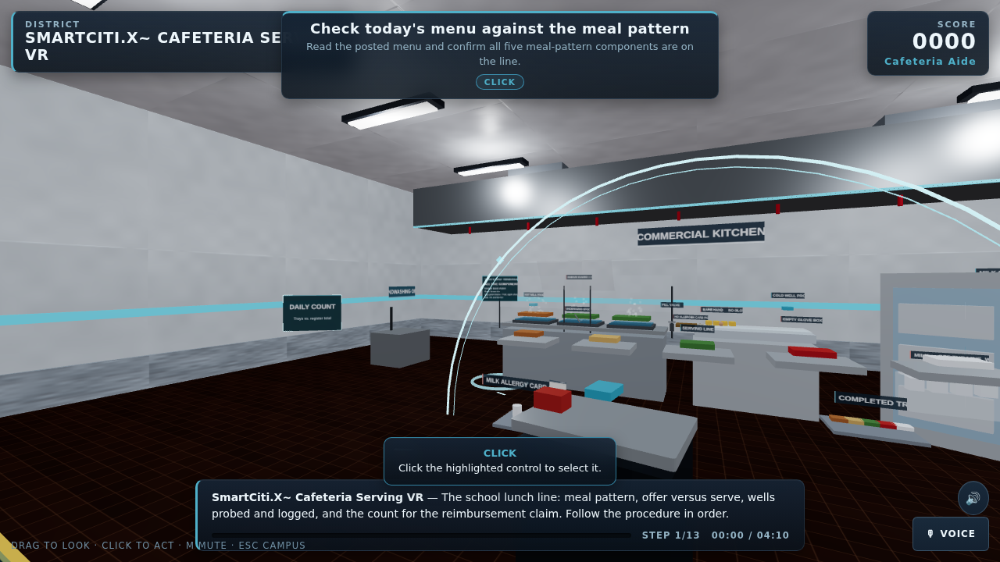 <b>Cafeteria Serving</b> — The school lunch line: meal pattern, offer versus serve, wells probed and logged, and the count for the reimbursement claim</td></tr>
<tr><td width="50%">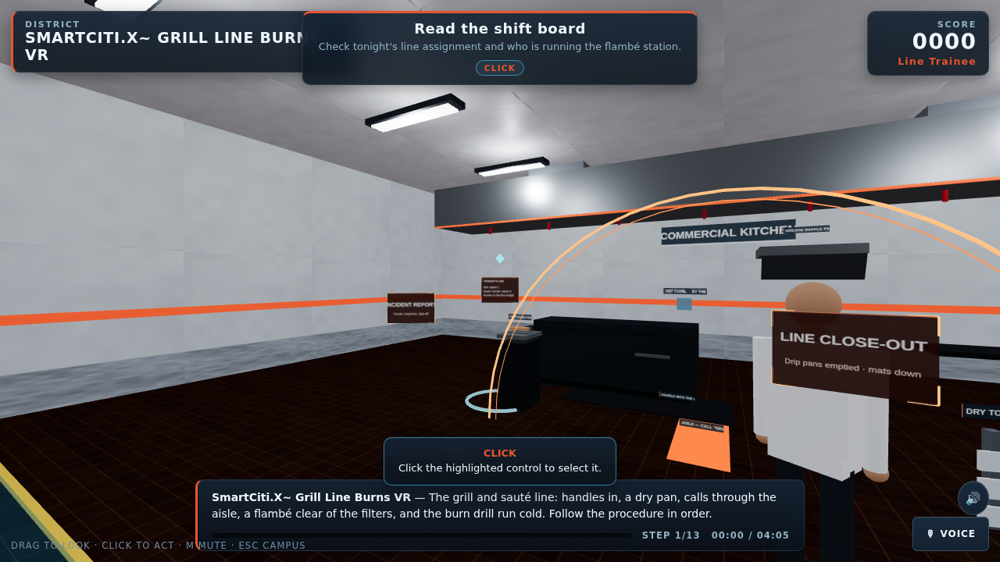 <b>Grill Line Burns</b> — The grill and sauté line: handles in, a dry pan, calls through the aisle, a flambé clear of the filters, and the burn drill run cold</td></tr>
</table>

## Dental Hygiene — Unspoken Smiles

A fifteen-station dental-hygienist series built for the Unspoken Smiles training programmes: the operatory turned over and instruments reprocessed, sharps exposure response, screening and radiographs, scaling, aerosol control and preventive care, nitrous oxide, chairside emergencies and amalgam waste, and the outreach van that brings the clinic to a school.

**Union:** SEIU and UFCW dental and clinic staff, AFSCME public-health hygienists, and the ADHA as the profession's body

**Certifications and standards:** The CDC's Guidelines for Infection Control in Dental Health-Care Settings, OSHA 29 CFR 1910.1030 bloodborne pathogens and 1910.1200 hazard communication, the state dental board's practice act, the EPA amalgam rule (40 CFR 441), and the ADA's radiographic guidance

Fifteen stations that make a hygienist's clinical day — the operatory, the sterilisation centre, the chairside procedures, the emergencies and the outreach van — into scored procedures a training programme can run and record. Every step names the guideline it stands on.

| # | Station | Trade | Conditions | Steps | Interrupts | Eval | Why it is in the programme |
|---|---|---|---|---|---|---|---|
| — | Trade Skills: phlebotomy | — | — | — | — | 91 | The bench case every clinical trade shares: sharps, bloodborne pathogens and the exposure control plan, before a single dental instrument is picked up. |
| 116 | [Operatory Turnover](../../WebXR/smartcity/index.html?sim=operatory-turnover) | Dental hygienist | indoor (clinic) | 12 | 2 | 89 | The turnover between patients: sharps and instruments contained at the point of use, the disinfectant held to its own label's contact time, barriers changed and nothing left on the tray for the next patient to find. |
| 117 | [Instrument Reprocessing](../../WebXR/smartcity/index.html?sim=instrument-reprocessing) | Dental hygienist | indoor (clinic) | 14 | 2 | 93 | The sterilisation centre behind that turnover: mechanical cleaning instead of a hand scrub, a chemical indicator in every pack, and the weekly spore test that is the only proof any cycle actually worked. |
| 118 | [Sharps Exposure Response](../../WebXR/smartcity/index.html?sim=sharps-exposure-response) | Dental hygienist | indoor (clinic) | 11 | 2 | 91 | The needlestick this whole chain exists to prevent: washed, reported at once, and into evaluation inside the hours that make post-exposure prophylaxis worth anything. |
| 119 | [Patient Intake Screening](../../WebXR/smartcity/index.html?sim=patient-intake-screening) | Dental hygienist | indoor (clinic) | 13 | 2 | — | The first ten minutes with any patient: the history read and flagged, vitals taken, an exam done in order, and consent signed before a single instrument is picked up. |
| 120 | [Radiograph Safety](../../WebXR/smartcity/index.html?sim=radiograph-safety) | Dental hygienist — radiographer | indoor (clinic) | 13 | 2 | — | A bitewing series taken under ALARA, so every exposure this programme's stations show is one the selection criteria actually called for. |
| 121 | [Periodontal Charting](../../WebXR/smartcity/index.html?sim=periodontal-charting) | Dental hygienist | indoor (clinic) | 13 | 2 | — | The full periodontal chart that a cleaning is planned around, staged and graded to the 2017 classification rather than read off a single deep number. |
| 122 | [Ultrasonic Scaling](../../WebXR/smartcity/index.html?sim=ultrasonic-scaling) | Dental hygienist | indoor (clinic) | 15 | 2 | — | A scaling and root planing appointment run the way NIOSH's own ergonomics guidance and the CDC's waterline standard both assume it will be — waterline verified before the tip touches anyone, and the operator's own wrist held as carefully as the root surface. |
| 123 | [Aerosol Management](../../WebXR/smartcity/index.html?sim=aerosol-management) | Dental hygienist | indoor (clinic) | 15 | 2 | — | Turning the same operatory over for an aerosol-generating procedure: the room's own air changes and a HEPA unit sized to them, an N95 seal-checked every time, and a fallow time the chair has to earn before the next patient sits down. |
| 124 | [Fluoride and Sealants](../../WebXR/smartcity/index.html?sim=fluoride-and-sealants) | Dental hygienist | indoor (clinic) | 15 | 2 | — | Preventive care on a child: a measured varnish dose for the age in the chair, then sealants etched to the label's time, rinsed to the frosted look, and recorded for the recall so the programme can show what it retained. |
| 125 | [Nitrous Oxide Monitoring](../../WebXR/smartcity/index.html?sim=nitrous-oxide-monitoring) | Dental hygienist | indoor (clinic) | 13 | 2 | 90 | The hygienist's own separate permit at work: screening, the fail-safe, scavenging and a titration held inside NIOSH's exposure limit and the board's ceiling on the concentration itself. |
| 126 | [Chairside Emergency](../../WebXR/smartcity/index.html?sim=chairside-emergency) | Dental hygienist | indoor (clinic) | 12 | 2 | 91 | The chair's worst afternoon: a syncope that will not resolve, an anaphylaxis to the local anaesthetic, and the office emergency kit and the AED carrying the response from there. |
| 127 | [Amalgam Waste Handling](../../WebXR/smartcity/index.html?sim=amalgam-waste-handling) | Dental hygienist | indoor (clinic) | 14 | 2 | 90 | The mercury side of the same clinic: a certified separator, scrap routed to one labelled stream instead of the trash or the sharps, and a manifest to the recycler at the end of it. |

<table>
<tr><td width="50%">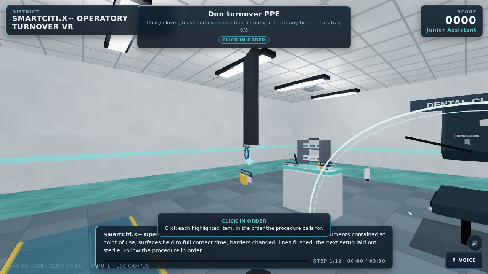 <b>Operatory Turnover</b> — Dirty-to-clean turnover: sharps and instruments contained at point of use, surfaces held to full contact time, barriers changed, lines flushed, the next setup laid out sterile</td><td width="50%">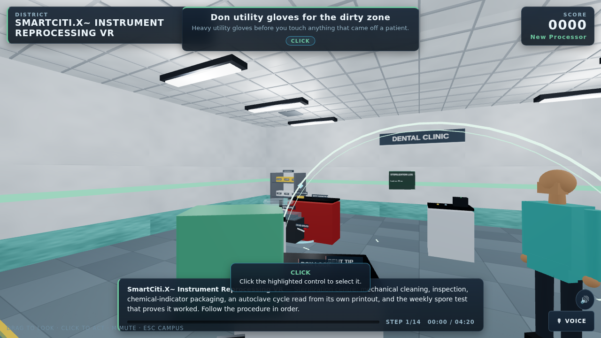 <b>Instrument Reprocessing</b> — Sterilization centre: mechanical cleaning, inspection, chemical-indicator packaging, an autoclave cycle read from its own printout, and the weekly spore test that proves it worked</td></tr>
<tr><td width="50%">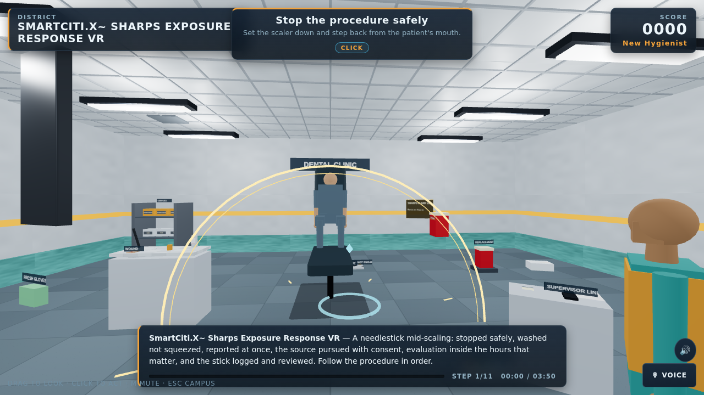 <b>Sharps Exposure Response</b> — A needlestick mid-scaling: stopped safely, washed not squeezed, reported at once, the source pursued with consent, evaluation inside the hours that matter, and the stick logged and reviewed</td><td width="50%">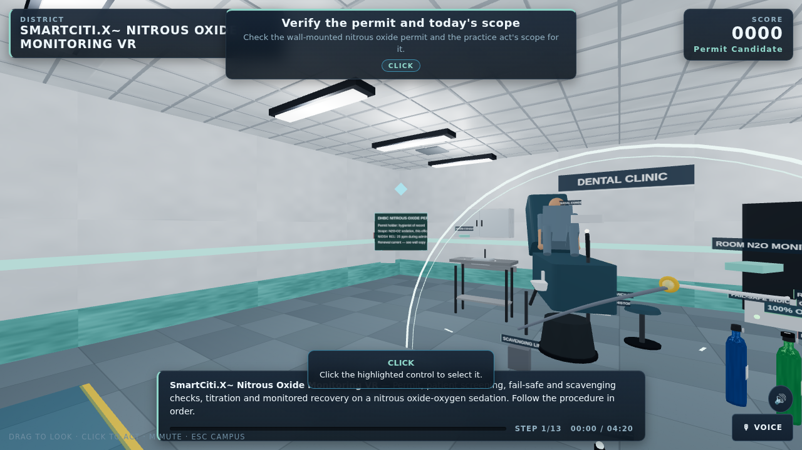 <b>Nitrous Oxide Monitoring</b> — Permit, patient screening, fail-safe and scavenging checks, titration and monitored recovery on a nitrous oxide-oxygen sedation</td></tr>
<tr><td width="50%">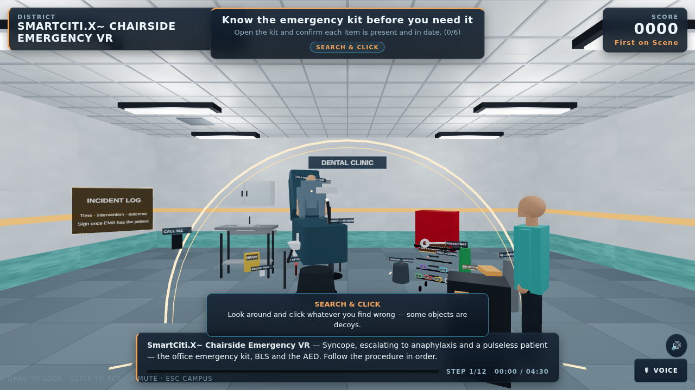 <b>Chairside Emergency</b> — Syncope, escalating to anaphylaxis and a pulseless patient — the office emergency kit, BLS and the AED</td><td width="50%">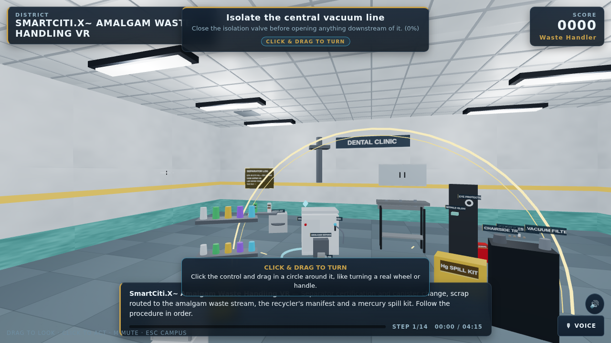 <b>Amalgam Waste Handling</b> — Separator certification and canister change, scrap routed to the amalgam waste stream, the recycler's manifest and a mercury spill kit</td></tr>
</table>

## Bartending — Behind the Bar

A full bartending course for UNITE HERE Local 2 bartenders and barbacks with the customers in it: opening the well, checking ID, pouring to spec, cutting off an intoxicated guest, responding to a spiked drink, de-escalating harassment, the keg cellar, glass in the ice well, line cleaning, the till and a robbery, allergens, last call, tips and the law, the workplace violence plan and a Responsible Beverage Service capstone.

**Union:** UNITE HERE Local 2 bartenders and barbacks

**Certifications and standards:** California ABC Responsible Beverage Service certification (mandatory for anyone serving alcohol since 2022), TIPS or ServSafe Alcohol, the California Retail Food Code for ice and glassware, Cal/OSHA's workplace violence prevention plan requirement, and California Labor Code 351 on tips

Fifteen stations from opening the well to closing the till, and the customers in between: the one who is twenty, the one who has had enough, the one who will not take no, and the one whose drink was touched while she looked away. Every step names the law or the standard a bartender is held to.

| # | Station | Trade | Conditions | Steps | Interrupts | Eval | Why it is in the programme |
|---|---|---|---|---|---|---|---|
| — | Trade Skills: kitchen | — | — | — | — | 98 | The kitchen the bar shares a wall with: the Food Code for ice, glassware and the sanitiser bucket, before a single drink is poured. |

## Inside Wireman — First Period

**Union:** IBEW — International Brotherhood of Electrical Workers

**Certifications and standards:** NFPA 70E work practices and OSHA 1910.147 control of hazardous energy, as taught in an IBEW/NECA JATC first-period block

The isolation habit, built four ways: a panel, a substation feeder, an overhead circuit and a live-load charger. Every station in this block ends with something proven dead before it is touched.

| # | Station | Trade | Conditions | Steps | Interrupts | Eval | Why it is in the programme |
|---|---|---|---|---|---|---|---|
| — | Trade Skills: electrical | — | — | — | — | 85 | The bench case: lockout, tagout and live-dead-live on a 480 V panel, with nothing else going on. |
| 01 | [Charge Point](../../WebXR/smartcity/index.html?sim=charge-point) | EV service technician | overcast | 11 | 2 | 80 | The same habit under a live utility service, where the load is a vehicle and the public is a metre away. |
| 33 | [Substation Switching](../../WebXR/smartcity/index.html?sim=substation-switching) | Substation electrician / switching operator | overcast | 11 | 2 | 87 | Isolation as a written switching order with a read-back, which is how it is done once the circuit leaves the building. |
| 19 | [Line Truck](../../WebXR/smartcity/index.html?sim=line-truck) | Outside / overhead lineworker (IBEW) | overcast | 15 | 2 | 86 | Overhead: the same sequence with cover-up, an approach boundary and a bucket. |
| 44 | [Battery Yard](../../WebXR/smartcity/index.html?sim=battery-yard) | Battery energy storage technician — grid scale | overcast | 12 | 0 | 85 | Direct current, where the arc does not self-extinguish and the bleed-down wait is the whole discipline. |

## Confined Space — Entry and Rescue

**Union:** LIUNA, UA, IUOE and IAFF technical rescue

**Certifications and standards:** OSHA 29 CFR 1910.146 permit-required confined spaces, with NFPA 1006 rescue technician for the last station

Four spaces and the rescue. The first three build the permit, the atmosphere and the attendant; the last one is what happens when all of that failed for somebody else.

| # | Station | Trade | Conditions | Steps | Interrupts | Eval | Why it is in the programme |
|---|---|---|---|---|---|---|---|
| 03 | [Valve Vault](../../WebXR/smartcity/index.html?sim=valve-vault) | Water utility operator | rain | 12 | 2 | 81 | The permit itself: testing in order, a guarded opening and an attendant who never leaves. |
| 28 | [Lift Station](../../WebXR/smartcity/index.html?sim=lift-station) | Wastewater collection system operator | indoor (plant) | 10 | 2 | 81 | A wet well, where the atmosphere changes while you are in it and the pumps are the second hazard. |
| 38 | [Chlorine Room](../../WebXR/smartcity/index.html?sim=chlorine-room) | Water treatment plant operator | indoor (plant) | 12 | 2 | 89 | A space you do not enter blind: the monitor and the air pack are read and staged from outside the door. |
| 45 | [Confined Rescue](../../WebXR/smartcity/index.html?sim=confined-rescue) | Technical rescue technician — confined space | overcast | 11 | 2 | 85 | The rescue, including the part where the first job is stopping a coworker from becoming the second patient. |

## Working at Height — Fall Protection

**Union:** Ironworkers, Carpenters, CWA and NATE climbers

**Certifications and standards:** OSHA 29 CFR 1926 Subpart M fall protection, Subpart L scaffolds, and ANSI Z359 personal fall-arrest systems

Anchor, connect, and the thing you are standing on. Four heights, four different reasons the system has to be right before the first step off the deck.

| # | Station | Trade | Conditions | Steps | Interrupts | Eval | Why it is in the programme |
|---|---|---|---|---|---|---|---|
| 36 | [Scaffold Erection](../../WebXR/smartcity/index.html?sim=scaffold-erection) | Scaffold erector / carpenter | wind | 12 | 2 | 80 | Building the platform: the order in which a scaffold becomes safe to stand on, and the green tag that says so. |
| 12 | [Steel Erector](../../WebXR/smartcity/index.html?sim=steel-erector) | Ironworker / structural steel connector | wind | 12 | 2 | 79 | Connecting steel, where the anchor moves with the work and the decking is not yet there. |
| 11 | [Tower Climb](../../WebXR/smartcity/index.html?sim=tower-climb) | Telecom / broadcast tower technician | wind | 12 | 2 | 98 | A climb with a hundred metres under it: the transitions are where people fall. |
| 42 | [Microwave Backhaul](../../WebXR/smartcity/index.html?sim=microwave-backhaul) | Microwave / RF technician — backhaul | overcast | 11 | 0 | 84 | A rooftop parapet, where the hazard is the edge and everything dropped lands on a public footpath. |
| 37 | [Aerial Ladder](../../WebXR/smartcity/index.html?sim=aerial-ladder) | Firefighter — aerial apparatus driver/operator | wind | 12 | 0 | 79 | An aerial device, where the platform is the thing that has to be set level before anyone is on it. |

## Hazmat and Environmental Response

**Union:** LIUNA hazmat and environmental crews, IAFF, and environmental technicians

**Certifications and standards:** OSHA 29 CFR 1910.120 HAZWOPER, NFPA 470 hazardous materials response, and Clean Water Act / Clean Air Act monitoring practice

Containment, decontamination and the numbers a neighbourhood relies on. This block runs from the release to the sample bottle, and opens with the real history of one site.

| # | Station | Trade | Conditions | Steps | Interrupts | Eval | Why it is in the programme |
|---|---|---|---|---|---|---|---|
| 21 | [Hunters Point Briefing](../../WebXR/smartcity/index.html?sim=hunters-point) | Environmental monitoring technician | clear | 10 | 0 | 76 | A sourced briefing on a real Superfund shipyard cleanup and the community monitoring around it, before any simulated work. |
| 17 | [Abatement Chamber](../../WebXR/smartcity/index.html?sim=abatement-chamber) | Asbestos / lead abatement worker | indoor (plant) | 12 | 0 | 92 | Containment done properly: negative pressure, a clean room, and a decon order that keeps the fibre inside. |
| 25 | [Decon Line](../../WebXR/smartcity/index.html?sim=decon-line) | Hazmat firefighter / decon technician | wind | 11 | 0 | 82 | The corridor: zones set by the wind, pools in order, and runoff that stays in the berm. |
| 22 | [Perimeter Air](../../WebXR/smartcity/index.html?sim=air-monitor) | Environmental monitoring technician | wind | 10 | 0 | 86 | Fence-line monitoring: placement, calibration and an exceedance response that happens now. |
| 43 | [Stormwater Outfall](../../WebXR/smartcity/index.html?sim=stormwater-outfall) | Environmental sampling technician — stormwater | rain | 11 | 0 | 85 | The wet-weather grab, on the permit clock, with a chain of custody that makes it evidence. |
| — | Trade Skills: pressure-washer | — | — | — | — | 92 | Surface prep, where the runoff is the pollutant and the stormwater plan is the reason for the containment. |

## Rigging and Lifting

**Union:** Ironworkers, IUOE crane operators, ILWU and IATSE riggers

**Certifications and standards:** ASME B30 rigging and crane practice, NCCCO operator knowledge, and ETCP entertainment rigging for the theatre station

Load, radius, chart, and what is under the load. Five lifts in five industries that all fail the same way.

| # | Station | Trade | Conditions | Steps | Interrupts | Eval | Why it is in the programme |
|---|---|---|---|---|---|---|---|
| 13 | [Crane Yard](../../WebXR/smartcity/index.html?sim=crane-yard) | Mobile crane operator / rigger | wind | 15 | 2 | 93 | The load chart and the pick plan, plus programming the anti-collision zone the yard actually needs. |
| 20 | [Dock Crane](../../WebXR/smartcity/index.html?sim=dock-crane) | Longshoreman / container-crane operator | wind | 14 | 2 | 79 | Container work at height and speed, where the wind limit is a hard stop. |
| 30 | [Chain Hoist](../../WebXR/smartcity/index.html?sim=chain-hoist) | Entertainment rigger — chain motors | indoor (theatre) | 10 | 2 | 94 | Manual lifting hardware: inspection, capacity and the load path through a structure that was not designed for it. |
| 18 | [Rigging Loft](../../WebXR/smartcity/index.html?sim=rigging-loft) | Theatrical rigger (IATSE) | indoor (theatre) | 14 | 2 | 96 | Overhead rigging above people, with automation cues that have to be proven before the house opens. |
| 40 | [Fly System](../../WebXR/smartcity/index.html?sim=fly-system) | Theatrical rigger / fly operator | indoor (theatre) | 12 | 0 | 80 | Counterweight: the one rigging system where the operator is holding the other half of the load in their hands. |

## Stationary Engineer — Building Plant

**Union:** IUOE — International Union of Operating Engineers, stationary locals

**Certifications and standards:** State stationary engineer licence, ASME boiler practice, ASHRAE 188 water management and NFPA 25 fire-pump testing

The four plants a building engineer is responsible for at two in the morning, and the tests that prove each one will work when it is needed.

| # | Station | Trade | Conditions | Steps | Interrupts | Eval | Why it is in the programme |
|---|---|---|---|---|---|---|---|
| 15 | [Boiler Room](../../WebXR/smartcity/index.html?sim=boiler-room) | Stationary engineer / steamfitter | indoor (plant) | 12 | 2 | 95 | Start-up and purge: the sequence that stops a furnace explosion. |
| 10 | [Chiller Plant](../../WebXR/smartcity/index.html?sim=chiller-plant) | HVAC / refrigeration technician | indoor (plant) | 12 | 2 | 86 | Refrigerant, isolation and the machine that is the building's whole cooling capacity. |
| 47 | [Cooling Tower](../../WebXR/smartcity/index.html?sim=cooling-tower) | Stationary engineer — water treatment and cooling towers | wind | 11 | 0 | 87 | The Legionella task: the tower is the one plant that can make the neighbourhood sick. |
| 35 | [Fire Pump](../../WebXR/smartcity/index.html?sim=fire-pump) | Fire sprinkler fitter / fire pump technician | indoor (plant) | 12 | 2 | 80 | The annual flow test, where the curve either matches the nameplate or the building has no fire protection. |
| 16 | [Elevator Pit](../../WebXR/smartcity/index.html?sim=elevator-pit) | Elevator constructor / mechanic | indoor (service) | 13 | 2 | 96 | The pit: a confined space with a moving car above it, entered by the person who maintains it. |

## Port and Terminal Operations

**Union:** ILWU longshore, MEBA and SIU marine engineers, IBT terminal drivers

**Certifications and standards:** USCG 33 CFR 155/156 oil transfer, IMO Cargo Securing Manual practice, and OSHA 1917 marine terminals

A ship comes alongside, is secured, is fuelled, is worked and leaves. Four stations that follow that order, each with a different way to put oil or steel where it should not be.

| # | Station | Trade | Conditions | Steps | Interrupts | Eval | Why it is in the programme |
|---|---|---|---|---|---|---|---|
| 29 | [Mooring Line](../../WebXR/smartcity/index.html?sim=mooring-line) | Line handler / wharf mooring crew | wind | 10 | 2 | 95 | Taking the lines: snap-back zones and the bight nobody stands in. |
| 41 | [Bunkering Watch](../../WebXR/smartcity/index.html?sim=bunkering-watch) | Marine engineer — person in charge of oil transfer | overcast | 12 | 2 | 90 | Fuel transfer as person in charge, with the deck contained before the hose comes aboard. |
| 27 | [Container Lashing](../../WebXR/smartcity/index.html?sim=container-lashing) | Longshore worker — lasher | wind | 11 | 2 | 93 | Deck stow: every twist-lock proven and the rods to the pattern the manual calls for. |
| 20 | [Dock Crane](../../WebXR/smartcity/index.html?sim=dock-crane) | Longshoreman / container-crane operator | wind | 14 | 2 | 79 | The crane over all of it, with the lashing gang's positions as the constraint. |

## Transit and Ramp Operations

**Union:** ATU, TWU, IAM and IBEW signal locals

**Certifications and standards:** FRA roadway-worker protection, FTA rail transit safety practice, FAA 14 CFR 139 airfield operations and OSHA 1910.178 for powered equipment

Four places where a vehicle that weighs tonnes moves near people on foot, and the protection that has to exist before anyone steps out.

| # | Station | Trade | Conditions | Steps | Interrupts | Eval | Why it is in the programme |
|---|---|---|---|---|---|---|---|
| 07 | [Track Access](../../WebXR/smartcity/index.html?sim=track-access) | Rail track worker | fog | 12 | 2 | 86 | Roadway-worker protection: the authority, the watchman and the clear time before the rail is occupied. |
| 02 | [Signal Cabinet](../../WebXR/smartcity/index.html?sim=signal-cabinet) | Traffic signal technician | rain | 11 | 2 | 91 | Working inside the system that keeps trains apart, without taking the protection down with you. |
| 34 | [Bus Depot Lift](../../WebXR/smartcity/index.html?sim=bus-depot-lift) | Transit bus technician — electric fleet | indoor (garage) | 10 | 2 | 96 | A vehicle raised over a person, and the supports that go in before anyone is underneath. |
| 46 | [Airport Ramp](../../WebXR/smartcity/index.html?sim=airport-ramp) | Airline ramp agent / ground handler | overcast | 11 | 2 | 85 | An aircraft turn, where chocks before contact is the rule the whole ramp runs on. |
| 39 | [Forklift Dock](../../WebXR/smartcity/index.html?sim=forklift-dock) | Powered industrial truck operator — warehouse and dock | indoor (garage) | 12 | 2 | 88 | The dock: a trailer that creeps and a load that tips, on the most common powered truck in the country. |

## Energy Transition Systems

**Union:** IBEW outside construction and utility locals

**Certifications and standards:** NFPA 70E, NFPA 855 energy storage, NEC Article 690 photovoltaic systems and utility interconnection practice

The plant a utility is building now: solar, storage, charging and the substation that ties them together. Direct current behaves differently, and every station here is about that difference.

| # | Station | Trade | Conditions | Steps | Interrupts | Eval | Why it is in the programme |
|---|---|---|---|---|---|---|---|
| 04 | [Solar Deck](../../WebXR/smartcity/index.html?sim=solar-deck) | Solar / BESS technician | overcast | 11 | 2 | 90 | A photovoltaic array that is energised whenever the sun is up and cannot be switched off at the panel. |
| 44 | [Battery Yard](../../WebXR/smartcity/index.html?sim=battery-yard) | Battery energy storage technician — grid scale | overcast | 12 | 0 | 85 | Grid storage: AC before DC, the bleed-down and the thermal event you are trying not to start. |
| 01 | [Charge Point](../../WebXR/smartcity/index.html?sim=charge-point) | EV service technician | overcast | 11 | 2 | 80 | The load end: high-current DC in a public place. |
| 33 | [Substation Switching](../../WebXR/smartcity/index.html?sim=substation-switching) | Substation electrician / switching operator | overcast | 11 | 2 | 87 | The interconnection, switched on a written order with grounds proven on. |
| 32 | [Cell Site Battery](../../WebXR/smartcity/index.html?sim=cell-site-battery) | Cell site / DC power technician | overcast | 11 | 0 | 82 | A smaller string in a cabinet, where the same chemistry is maintained by one person alone at night. |

## Live Events Production

**Union:** IATSE — International Alliance of Theatrical Stage Employees

**Certifications and standards:** ETCP Certified Rigger and Certified Entertainment Electrician, ANSI E1.4-1 counterweight rigging and NFPA 70E for the power tie-in

A load-in from the truck to the house lights, in the order a call actually runs, with the two things that kill on a stage: what is overhead and what is energised.

| # | Station | Trade | Conditions | Steps | Interrupts | Eval | Why it is in the programme |
|---|---|---|---|---|---|---|---|
| 26 | [Stage Power](../../WebXR/smartcity/index.html?sim=stage-power) | Stage / touring electrician | indoor (theatre) | 11 | 2 | 90 | The company switch tie-in: cam-locks ground first, and the phase check before anything is energised. |
| 40 | [Fly System](../../WebXR/smartcity/index.html?sim=fly-system) | Theatrical rigger / fly operator | indoor (theatre) | 12 | 0 | 80 | Loading a lineset, where an unbalanced arbor is a runaway with a person on the rope. |
| 18 | [Rigging Loft](../../WebXR/smartcity/index.html?sim=rigging-loft) | Theatrical rigger (IATSE) | indoor (theatre) | 14 | 2 | 96 | Points overhead, with automation cues proven before the house is let in. |
| 30 | [Chain Hoist](../../WebXR/smartcity/index.html?sim=chain-hoist) | Entertainment rigger — chain motors | indoor (theatre) | 10 | 2 | 94 | Motors: inspection, capacity and never leaving a load hanging on a brake. |

## Situational Awareness — Interruption Drill

**Union:** Cross-craft — run as a refresher block by IBEW, UA, LIUNA, Ironworkers and IAFF locals

**Certifications and standards:** OSHA 1926.20(b)(2) competent-person hazard recognition and the human-factors component every one of these standards assumes: NFPA 70E, 1910.146 permit spaces, 1926.651 excavations, 1926.1400 cranes, NFPA 25 impairment control

Twenty-two procedures that interrupt you while you work. Every station in this block is one you may already know the order of — the block is not testing the order. It is testing whether you notice the alarm, the person in the wrong place or the thing that moved while your hands and eyes were somewhere else. Miss one and it scores as an unsafe action, because that is what it is.

| # | Station | Trade | Conditions | Steps | Interrupts | Eval | Why it is in the programme |
|---|---|---|---|---|---|---|---|
| — | Trade Skills: electrical | — | — | — | — | 85 | Your lock comes off the hasp while your eyes are on the meter. The isolation was correct once, and nobody looked at it again. |
| — | Trade Skills: welding | — | — | — | — | 80 | Two: the extraction trips while you set the machine, and the blanket slips off the conduit run while you lay the bead. |
| 14 | [Trench Box](../../WebXR/smartcity/index.html?sim=trench-box) | Laborer / excavation and shoring | rain | 15 | 2 | 79 | Spoil creeping back toward the lip above an entrant, and the spotter walking off while you programme a machine path. |
| 13 | [Crane Yard](../../WebXR/smartcity/index.html?sim=crane-yard) | Mobile crane operator / rigger | wind | 15 | 2 | 93 | Somebody cutting through the swing radius to save walking round, and a pad settling out of level with the load in the air. |
| 38 | [Chlorine Room](../../WebXR/smartcity/index.html?sim=chlorine-room) | Water treatment plant operator | indoor (plant) | 12 | 2 | 89 | The room monitor alarming mid-changeout — real until proven otherwise — and an unprotected attendant in an open door during a leak test. |
| 45 | [Confined Rescue](../../WebXR/smartcity/index.html?sim=confined-rescue) | Technical rescue technician — confined space | overcast | 11 | 2 | 85 | The atmosphere falling while you rig, and the attendant leaving the hole to help on the rope during the haul. |
| 33 | [Substation Switching](../../WebXR/smartcity/index.html?sim=substation-switching) | Substation electrician / switching operator | overcast | 11 | 2 | 87 | An unescorted visitor inside the boundary, and control calling with a verbal change to a written switching order. |
| 46 | [Airport Ramp](../../WebXR/smartcity/index.html?sim=airport-ramp) | Airline ramp agent / ground handler | overcast | 11 | 2 | 85 | A vehicle inbound past an unset equipment line, and a chock a tug kicked clear before the bridge docks. |
| 35 | [Fire Pump](../../WebXR/smartcity/index.html?sim=fire-pump) | Fire sprinkler fitter / fire pump technician | indoor (plant) | 12 | 2 | 80 | Hot work opened in a building whose sprinklers are impaired for your test, and a gland that goes from a drip to a stream at rated flow. |
| 11 | [Tower Climb](../../WebXR/smartcity/index.html?sim=tower-climb) | Telecom / broadcast tower technician | wind | 12 | 2 | 98 | A tool you set down creeping toward the platform edge above your ground crew, and the crew themselves walking into the drop zone. |
| 16 | [Elevator Pit](../../WebXR/smartcity/index.html?sim=elevator-pit) | Elevator constructor / mechanic | indoor (service) | 13 | 2 | 96 | A hall call registering upstairs while you stand in the runby, and somebody working your lock off the hasp while you are on the car top. |
| 15 | [Boiler Room](../../WebXR/smartcity/index.html?sim=boiler-room) | Stationary engineer / steamfitter | indoor (plant) | 12 | 2 | 95 | A block valve passing after you proved the isolation, and the building calling for steam while you are inside the firebox. |
| 39 | [Forklift Dock](../../WebXR/smartcity/index.html?sim=forklift-dock) | Powered industrial truck operator — warehouse and dock | indoor (garage) | 12 | 2 | 88 | The trailer walking off the plate while you are in the box, and a picker stepping into the aisle on the side the load hides. |
| — | Trade Skills: phlebotomy | — | — | — | — | 91 | A patient going vasovagal while your eyes are on the tube rack, and a pre-labelled set offered to you as a time-saver. |
| 51 | [Transformer Vault](../../WebXR/smartcity/index.html?sim=transformer-vault) | Substation / underground distribution electrician | rain | 12 | 2 | 91 | SCADA attempting a reclose before your clearance tag is on the switch, and the vault taking water faster than it drains. |
| 52 | [Wind Nacelle](../../WebXR/smartcity/index.html?sim=wind-nacelle) | Wind turbine technician | wind | 13 | 2 | 91 | The wind freshening ninety metres up with the hoist hatch open, and the hatch guard knocked off its catch behind you. |
| 53 | [Digester Gas](../../WebXR/smartcity/index.html?sim=digester-gas) | Wastewater plant operator / pipefitter | fog | 14 | 2 | 91 | The dome rising because the digester did not stop making gas, and the wind putting your own purge vent over the pit you are reading. |
| 54 | [Data Hall](../../WebXR/smartcity/index.html?sim=data-hall) | Critical facilities electrician | indoor (datahall) | 12 | 2 | 94 | The panel schedule contradicting the busway label, and somebody moving your floor-void barrier to get a cart past. |
| 12 | [Steel Erector](../../WebXR/smartcity/index.html?sim=steel-erector) | Ironworker / structural steel connector | wind | 12 | 2 | 79 | A landed member still on the hook drifting over the bay you are standing in, and a deck opening uncovered behind you. |
| 08 | [Triage Point](../../WebXR/smartcity/index.html?sim=triage-point) | EMT / paramedic | overcast | 10 | 2 | 96 | A casualty you tagged green sitting down and going quiet, and the beam over the collapse starting to move. |
| 20 | [Dock Crane](../../WebXR/smartcity/index.html?sim=dock-crane) | Longshoreman / container-crane operator | wind | 14 | 2 | 79 | A lashing hand cutting through the red zone under a suspended box, and a gust front putting the load on the sail. |
| 24 | [Press Brake](../../WebXR/smartcity/index.html?sim=press-brake) | Sheet-metal press brake operator | indoor (shop) | 12 | 2 | 86 | The light curtain left on bypass from the previous shift, and a colleague reaching into the die space to help. |

## Real-world environments

A station can stand inside a licensed real-world model instead of the generated district: a scanned street, a modelled terminal, a surveyed shoreline. The station declares `environment: { url, scale, position, rotationY }` or a reviewer previews any file with `?env=<url>` before it is committed; the loader hides the procedural skyline and district while the model is shown. Only CC0, CC-BY or marketplace-licensed models with an attribution line go under `WebXR/assets/env/` — game rips are not accepted. The hand-built sample street below is the placeholder every real model is judged against.

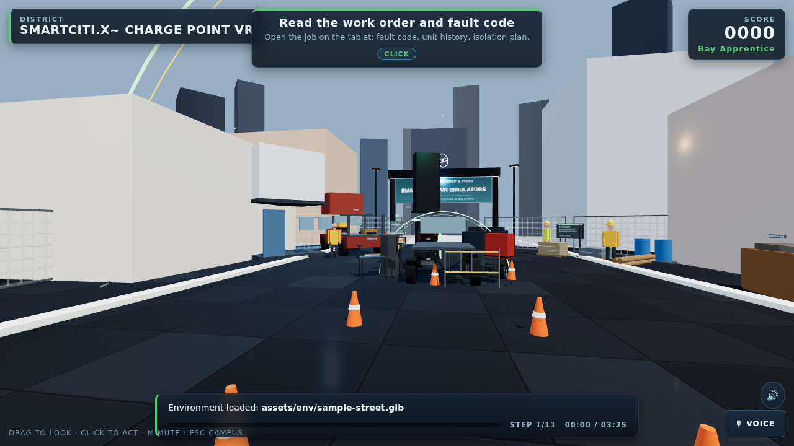

## How a station is verified

1. `node tools/check_all.mjs` — twenty-three checkers: parse, imports, layout (every control reachable, crew figures clear of the work), budget (mesh count per headset frame), interruptions (each one fires, times out, scores and visibly changes the scene), crew roles, incident replay, curricula resolution, catalog freshness.
2. `python3 tools/bundle_webxr.py` — the single-file bundle the headset loads.
3. A headless Chromium drive of every step, with both interruptions answered, and a screenshot from the spawn point that someone actually looks at.
4. `node tools/eval_content.mjs` — the graded content review, used as the heartbeat between waves of stations rather than as a gate.

